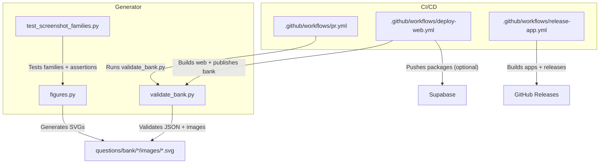
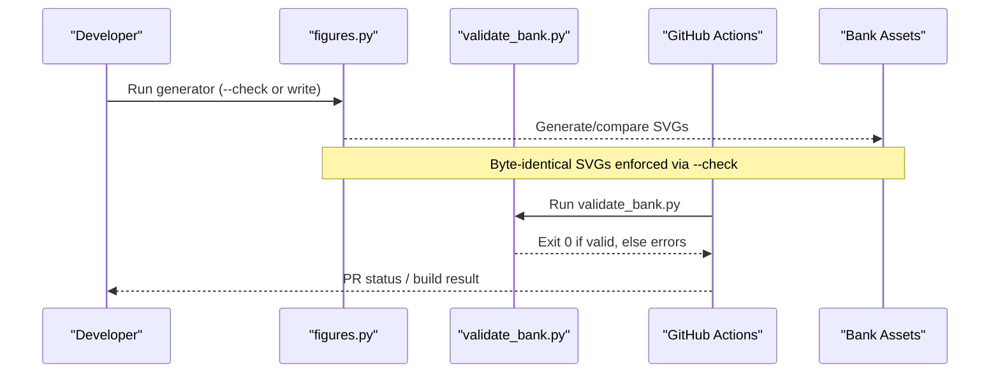
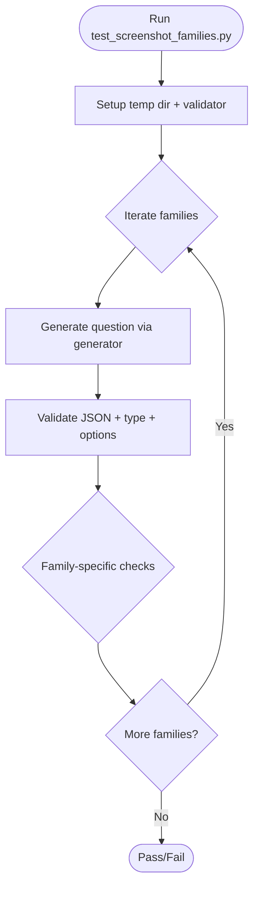
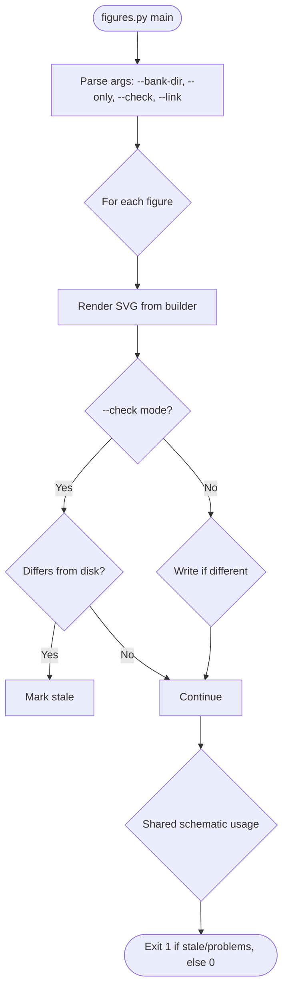
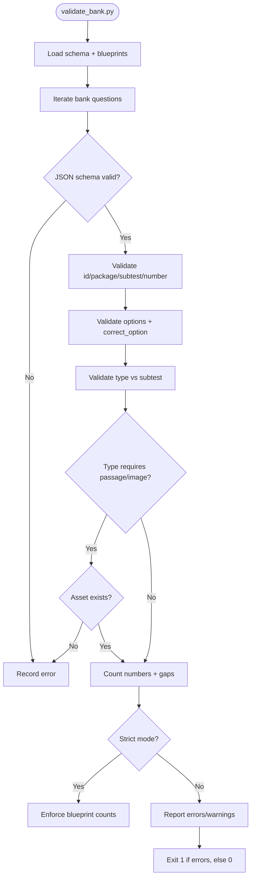
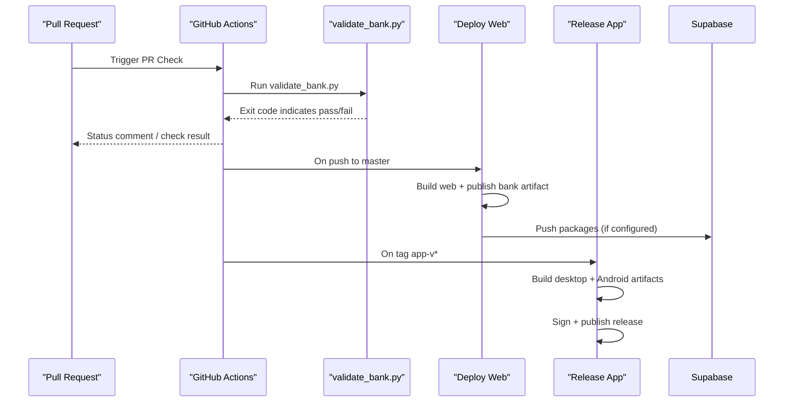
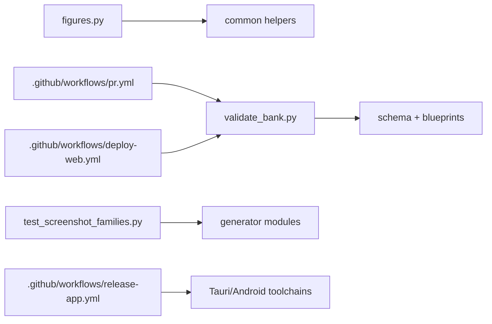

# Visual Testing Framework

<cite>
**Referenced Files in This Document**
- [test_screenshot_families.py](file://questions/generator/test_screenshot_families.py)
- [figures.py](file://questions/generator/figures.py)
- [validate_bank.py](file://questions/generator/validate_bank.py)
- [README.md](file://questions/generator/README.md)
- [pr.yml](file://.github/workflows/pr.yml)
- [deploy-web.yml](file://.github/workflows/deploy-web.yml)
- [release-app.yml](file://.github/workflows/release-app.yml)
</cite>

## Table of Contents
1. [Introduction](#introduction)
2. [Project Structure](#project-structure)
3. [Core Components](#core-components)
4. [Architecture Overview](#architecture-overview)
5. [Detailed Component Analysis](#detailed-component-analysis)
6. [Dependency Analysis](#dependency-analysis)
7. [Performance Considerations](#performance-considerations)
8. [Troubleshooting Guide](#troubleshooting-guide)
9. [Conclusion](#conclusion)
10. [Appendices](#appendices)

## Introduction
This document explains the visual testing framework that ensures consistent rendering of questions across platforms and screen sizes. It focuses on how the project generates deterministic figures, validates question metadata, compares generated SVGs to baselines, and integrates these checks into CI/CD for automated visual regression testing. It also provides guidance on creating new visual tests and maintaining baseline screenshots.

The framework’s core idea is deterministic generation: every figure is produced from a builder with fixed parameters so re-running the generator yields byte-identical SVGs. A “check” mode compares current output against committed baselines and fails when differences are detected. Question validation complements this by ensuring images referenced by questions exist and match expected paths.

## Project Structure
Visual testing spans three main areas:
- Figure generation and baseline comparison: deterministic SVG builders and a check mode that enforces baseline stability.
- Question bank validation: schema and structural checks that ensure image references are valid and consistent.
- CI/CD integration: workflows that run validation and generate/publish artifacts, including question packages.

**Diagram sources**
- [figures.py:1190-1273](file://questions/generator/figures.py#L1190-L1273)
- [validate_bank.py:44-194](file://questions/generator/validate_bank.py#L44-L194)
- [test_screenshot_families.py:21-111](file://questions/generator/test_screenshot_families.py#L21-L111)
- [pr.yml:11-27](file://.github/workflows/pr.yml#L11-L27)
- [deploy-web.yml:97-116](file://.github/workflows/deploy-web.yml#L97-L116)
- [release-app.yml:59-181](file://.github/workflows/release-app.yml#L59-L181)

**Section sources**
- [figures.py:1-30](file://questions/generator/figures.py#L1-L30)
- [validate_bank.py:1-19](file://questions/generator/validate_bank.py#L1-L19)
- [test_screenshot_families.py:1-20](file://questions/generator/test_screenshot_families.py#L1-L20)
- [pr.yml:1-27](file://.github/workflows/pr.yml#L1-L27)
- [deploy-web.yml:1-133](file://.github/workflows/deploy-web.yml#L1-L133)
- [release-app.yml:1-310](file://.github/workflows/release-app.yml#L1-L310)

## Core Components
- Deterministic figure generation: Builders produce SVGs with fixed dimensions, fonts, and styles. Output is stable and reproducible.
- Baseline comparison: A check mode compares generated SVGs to committed files and reports staleness.
- Question validation: Ensures JSON structure, required fields, image references, numbering, and blueprint compliance.
- Test families: Unit tests exercise generator families to assert behavior and layout properties.
- CI/CD integration: Workflows run validation and build steps; optional publishing pushes immutable packages.

**Section sources**
- [figures.py:139-165](file://questions/generator/figures.py#L139-L165)
- [figures.py:1190-1273](file://questions/generator/figures.py#L1190-L1273)
- [validate_bank.py:44-194](file://questions/generator/validate_bank.py#L44-L194)
- [test_screenshot_families.py:21-111](file://questions/generator/test_screenshot_families.py#L21-L111)
- [README.md:1-33](file://questions/generator/README.md#L1-L33)

## Architecture Overview
The visual testing architecture centers on deterministic generation and strict baseline enforcement. The workflow is:
1. Generators create SVGs deterministically.
2. Baseline comparison detects any divergence.
3. Question validation ensures integrity of question assets and references.
4. CI runs validation on pull requests and builds on deployments.

**Diagram sources**
- [figures.py:1190-1273](file://questions/generator/figures.py#L1190-L1273)
- [validate_bank.py:197-208](file://questions/generator/validate_bank.py#L197-L208)
- [pr.yml:11-27](file://.github/workflows/pr.yml#L11-L27)

## Detailed Component Analysis

### Screenshot Family Tests
The screenshot family tests exercise generator families to ensure consistent layouts and correct option structures. They:
- Create temporary directories and use a schema validator.
- Generate questions for multiple patterns and blank configurations.
- Assert type, option count, and correctness constraints.
- Validate specific behaviors like interior blanks and predicate keys.

**Diagram sources**
- [test_screenshot_families.py:21-111](file://questions/generator/test_screenshot_families.py#L21-L111)

**Section sources**
- [test_screenshot_families.py:21-111](file://questions/generator/test_screenshot_families.py#L21-L111)

### Figures Generator and Baseline Comparison
The figures module generates deterministic SVGs and supports:
- Rendering with fixed styles and fonts.
- Check mode to compare generated SVGs to committed baselines.
- Link mode to update question image references to their canonical figure paths.
- Shared schematic figures used by generated data-sufficiency items.

Key behaviors:
- Deterministic formatting ensures stable output.
- Staleness detection exits non-zero when differences are found.
- Question linking updates image fields to match expected figure paths.

**Diagram sources**
- [figures.py:1190-1273](file://questions/generator/figures.py#L1190-L1273)

**Section sources**
- [figures.py:139-165](file://questions/generator/figures.py#L139-L165)
- [figures.py:1190-1273](file://questions/generator/figures.py#L1190-L1273)

### Question Bank Validation
Validation ensures:
- Every question file parses and conforms to the schema.
- IDs, package/subtest/number fields match file paths.
- Options are exactly A..E with a correct_option among them.
- Explanations cover all five options.
- Referenced images exist in the package’s images directory.
- Numbering is unique per subtest with no gaps.
- Stimulus-based types carry required passages or charts.
- Strict mode enforces blueprint counts.

**Diagram sources**
- [validate_bank.py:44-194](file://questions/generator/validate_bank.py#L44-L194)

**Section sources**
- [validate_bank.py:44-194](file://questions/generator/validate_bank.py#L44-L194)

### CI/CD Integration
- Pull Request checks run validation on changes to questions and workflows.
- Deploy web workflow builds the web app, asserts flavor settings, publishes the question-bank artifact, and optionally pushes immutable packages to Supabase.
- Release workflow builds desktop and Android artifacts, signs them, and publishes GitHub Releases.

**Diagram sources**
- [pr.yml:11-27](file://.github/workflows/pr.yml#L11-L27)
- [deploy-web.yml:97-116](file://.github/workflows/deploy-web.yml#L97-L116)
- [release-app.yml:59-181](file://.github/workflows/release-app.yml#L59-L181)

**Section sources**
- [pr.yml:1-27](file://.github/workflows/pr.yml#L1-L27)
- [deploy-web.yml:1-133](file://.github/workflows/deploy-web.yml#L1-L133)
- [release-app.yml:1-310](file://.github/workflows/release-app.yml#L1-L310)

## Dependency Analysis
- The figure generator depends on shared helpers and common utilities to iterate bank questions and compute paths.
- Validation depends on schema loading and blueprint definitions to enforce structure and counts.
- Screenshot family tests depend on generator modules to produce questions and then assert properties.
- CI workflows depend on Python and Node environments to install dependencies and run scripts.

**Diagram sources**
- [figures.py:34-43](file://questions/generator/figures.py#L34-L43)
- [validate_bank.py:29-41](file://questions/generator/validate_bank.py#L29-L41)
- [test_screenshot_families.py:15-18](file://questions/generator/test_screenshot_families.py#L15-L18)
- [pr.yml:11-27](file://.github/workflows/pr.yml#L11-L27)
- [deploy-web.yml:43-48](file://.github/workflows/deploy-web.yml#L43-L48)
- [release-app.yml:106-123](file://.github/workflows/release-app.yml#L106-L123)

**Section sources**
- [figures.py:34-43](file://questions/generator/figures.py#L34-L43)
- [validate_bank.py:29-41](file://questions/generator/validate_bank.py#L29-L41)
- [test_screenshot_families.py:15-18](file://questions/generator/test_screenshot_families.py#L15-L18)

## Performance Considerations
- Deterministic generation avoids expensive rasterization and ensures fast comparisons.
- Check mode only reads and compares text content of SVGs, which is lightweight.
- Validation iterates the entire bank; consider running it selectively during development using flags where supported.
- CI caches Python and Node dependencies to reduce setup time.

[No sources needed since this section provides general guidance]

## Troubleshooting Guide
Common issues and resolutions:
- Stale figures: If figures differ from committed baselines, regenerate them or review changes. Use the generator’s check mode to identify stale files.
- Missing images: Validation will report missing referenced images; ensure images exist in the package’s images directory.
- Incorrect image links: Use link mode to align question image fields with canonical figure paths.
- Schema errors: Fix JSON structure according to schema violations reported by validation.
- Blueprint mismatches: In strict mode, ensure package counts match the blueprint; adjust question distribution accordingly.

**Section sources**
- [figures.py:1190-1273](file://questions/generator/figures.py#L1190-L1273)
- [validate_bank.py:141-163](file://questions/generator/validate_bank.py#L141-L163)

## Conclusion
The visual testing framework ensures consistent rendering through deterministic figure generation, strict baseline comparison, and comprehensive question validation. Integrated into CI/CD, it catches visual regressions early and supports reliable releases. By following the guidelines for creating new tests and maintaining baselines, teams can keep visual quality high across platforms and screen sizes.

[No sources needed since this section summarizes without analyzing specific files]

## Appendices

### Creating New Visual Tests
- Add a figure builder returning a Drawing with deterministic parameters.
- Register the figure in the appropriate collection so it is included in generation and checking.
- Run the generator to produce SVGs and verify they match expectations.
- Use check mode to confirm baseline stability before committing.

**Section sources**
- [figures.py:1-30](file://questions/generator/figures.py#L1-L30)
- [figures.py:1190-1273](file://questions/generator/figures.py#L1190-L1273)

### Maintaining Baseline Screenshots
- Regenerate figures when question data or geometry changes.
- Review diffs carefully to ensure intentional changes only.
- Commit updated SVGs after confirming correctness.
- Use link mode to update question image references consistently.

**Section sources**
- [figures.py:1190-1273](file://questions/generator/figures.py#L1190-L1273)
- [validate_bank.py:141-163](file://questions/generator/validate_bank.py#L141-L163)