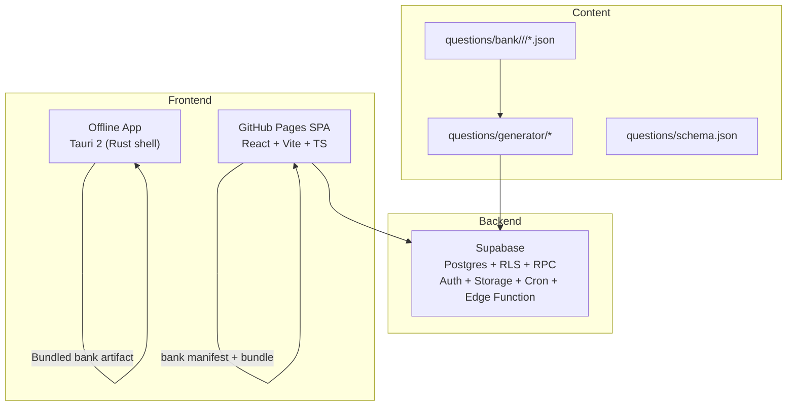
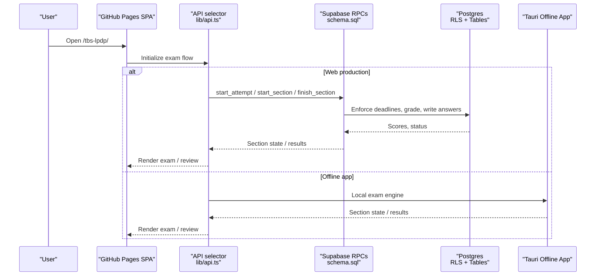
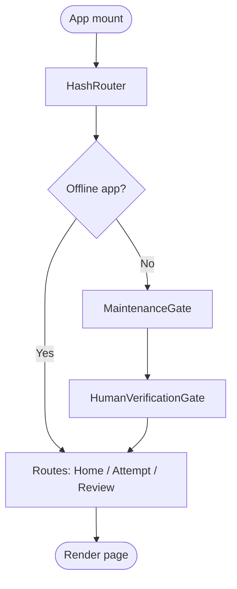
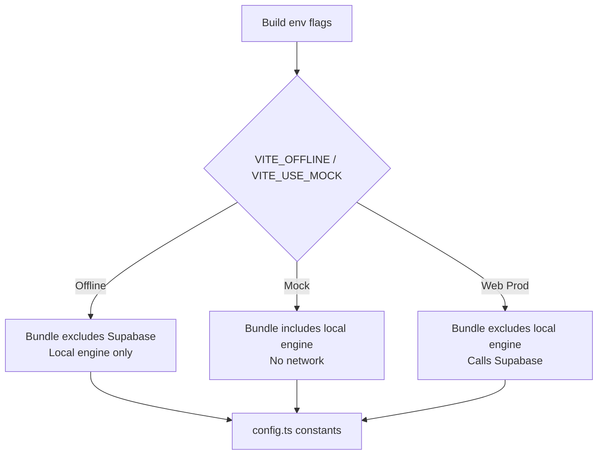
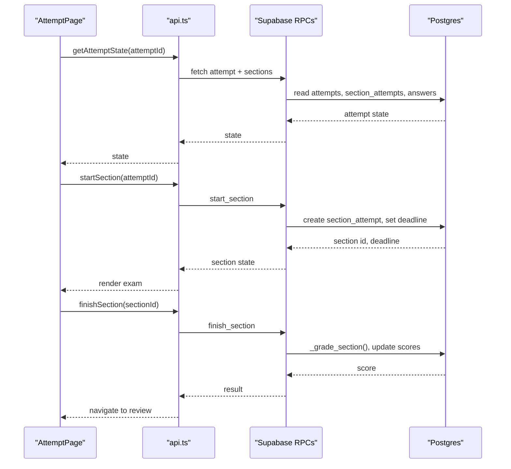
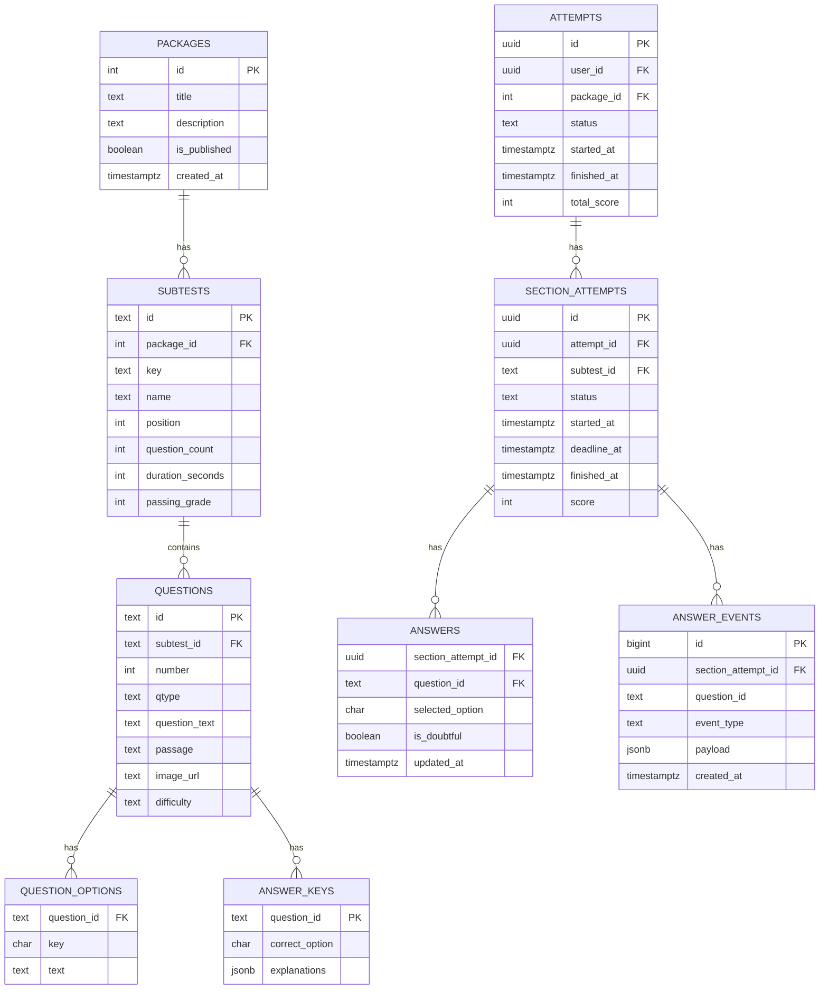
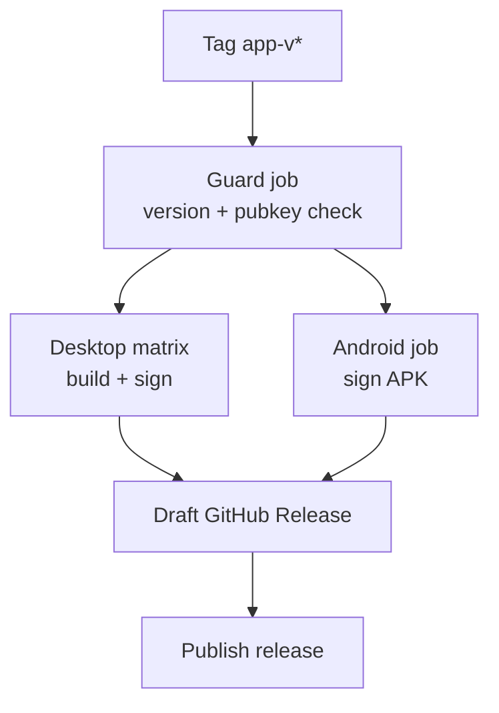
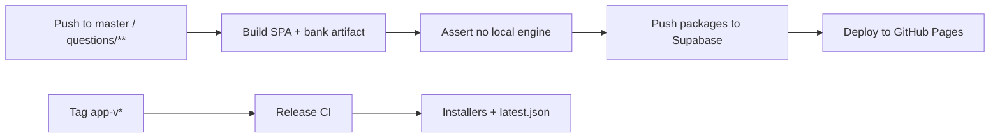
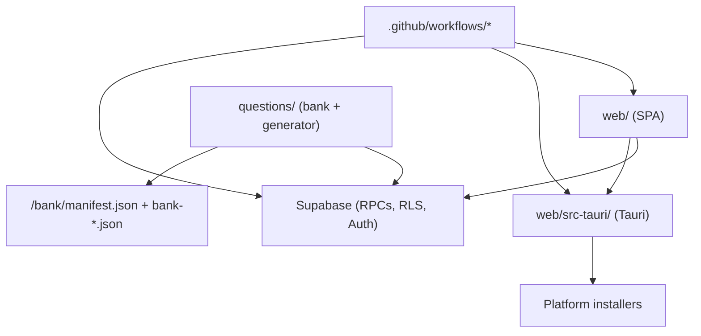

# System Overview

<cite>
**Referenced Files in This Document**
- [README.md](file://README.md)
- [CLAUDE.md](file://CLAUDE.md)
- [CONTRIBUTING.md](file://CONTRIBUTING.md)
- [web/package.json](file://web/package.json)
- [web/src-tauri/tauri.conf.json](file://web/src-tauri/tauri.conf.json)
- [web/src/App.tsx](file://web/src/App.tsx)
- [web/src/lib/config.ts](file://web/src/lib/config.ts)
- [web/src/lib/api.ts](file://web/src/lib/api.ts)
- [web/src/lib/supabase.ts](file://web/src/lib/supabase.ts)
- [web/src/pages/AttemptPage.tsx](file://web/src/pages/AttemptPage.tsx)
- [supabase/config.toml](file://supabase/config.toml)
- [supabase/schema.sql](file://supabase/schema.sql)
- [.github/workflows/deploy-web.yml](file://.github/workflows/deploy-web.yml)
- [.github/workflows/release-app.yml](file://.github/workflows/release-app.yml)
</cite>

## Table of Contents
1. [Introduction](#introduction)
2. [Project Structure](#project-structure)
3. [Core Components](#core-components)
4. [Architecture Overview](#architecture-overview)
5. [Detailed Component Analysis](#detailed-component-analysis)
6. [Dependency Analysis](#dependency-analysis)
7. [Performance Considerations](#performance-considerations)
8. [Troubleshooting Guide](#troubleshooting-guide)
9. [Conclusion](#conclusion)

## Introduction
TBS LPDP Try Out is a free practice platform for the Indonesian Tes Bakat Skolastik (TBS). It reproduces the timed, section-by-section CBT experience with scoring, answer reviews, and explanations per option. The system supports two deployment modes from one codebase:
- A GitHub Pages web application that connects to Supabase for anonymous authentication, server-authoritative grading, deadlines, and answer-key protection.
- An offline-capable desktop and mobile app built with Tauri that bundles the question bank and runs the exam engine locally without network access.

The core architectural decision is to keep trusted exam logic—grading, deadline enforcement, and answer-key validation—in Supabase database functions and RPCs. Untrusted client code never grades an attempt or reads active answer keys on the web. The offline app necessarily carries keys and grading on-device because it must work without a network; this does not expose new secrets since the repository already contains the question bank and keys. Build-time flavor flags ensure each deployment has only the capabilities it needs.

**Section sources**
- [README.md:1-10](file://README.md#L1-L10)
- [README.md:28-70](file://README.md#L28-L70)
- [CLAUDE.md:23-47](file://CLAUDE.md#L23-L47)

## Project Structure
At a high level, the repository separates content, backend, frontend, and tooling:
- questions/: Git-versioned question packages, generators, validators, and schema definitions.
- supabase/: Database schema, migrations, Row Level Security policies, RPC functions, Cron jobs, and Edge Functions.
- web/: React + Vite + TypeScript SPA plus Tauri configuration for the offline app.
- .github/workflows/: CI/CD for GitHub Pages deployment and signed app releases.
- docs/: Requirements and operational documentation.

**Diagram sources**
- [README.md:40-63](file://README.md#L40-L63)
- [CLAUDE.md:23-47](file://CLAUDE.md#L23-L47)

**Section sources**
- [README.md:87-101](file://README.md#L87-L101)
- [CLAUDE.md:23-47](file://CLAUDE.md#L23-L47)

## Core Components
- Frontend SPA: React + TypeScript + Vite with hash routing for host-agnostic deep links and GitHub Pages compatibility.
- Offline App Shell: Tauri 2 wrapping the same SPA, with Rust-based packaging, updater, and platform targets.
- Backend: Supabase Postgres with Row Level Security, RPCs for all mutations, anonymous auth, storage, cron jobs, and a private Edge Function for report digests.
- Question Bank Pipeline: Python generators and validators produce deterministic, schema-compliant questions; CI publishes immutable releases to Supabase and static artifacts to GitHub Pages.
- Build-Time Flavors: Vite environment flags select between web production, mock/local-engine, and offline app builds so each bundle contains only what it needs.

Key responsibilities:
- Web build serves UI, loads the published bank artifact, and delegates grading and key validation to Supabase RPCs.
- Offline app serves UI, loads bundled bank data, and performs local grading without network calls.
- Supabase enforces deadlines, computes scores using answer keys, scopes user data via RLS, and schedules maintenance/capacity/report jobs.

**Section sources**
- [web/package.json:1-46](file://web/package.json#L1-L46)
- [web/src-tauri/tauri.conf.json:1-98](file://web/src-tauri/tauri.conf.json#L1-L98)
- [supabase/config.toml:1-5](file://supabase/config.toml#L1-L5)
- [supabase/schema.sql:1-200](file://supabase/schema.sql#L1-L200)
- [README.md:40-70](file://README.md#L40-L70)

## Architecture Overview
The system uses a dual deployment model with shared UI and separate execution contexts:

**Diagram sources**
- [web/src/lib/api.ts:1-128](file://web/src/lib/api.ts#L1-L128)
- [supabase/schema.sql:185-200](file://supabase/schema.sql#L185-L200)
- [README.md:40-70](file://README.md#L40-L70)

## Detailed Component Analysis

### Frontend Application and Routing
- HashRouter ensures deep links survive refreshes on GitHub Pages and keeps routes host-agnostic for reuse inside Tauri’s webview.
- Maintenance and human verification gates are folded away in offline mode, keeping the offline bundle minimal.
- Update controls are included only in the offline app flavor.

**Diagram sources**
- [web/src/App.tsx:1-63](file://web/src/App.tsx#L1-L63)

**Section sources**
- [web/src/App.tsx:1-63](file://web/src/App.tsx#L1-L63)

### Build-Time Flavor System
- IS_OFFLINE_APP toggles offline behavior at compile time, removing Supabase dependencies from the offline bundle.
- SUPABASE_URL and SUPABASE_PUBLIC_KEY are undefined in offline mode to prevent accidental leakage.
- TURNSTILE_SITE_KEY is also excluded offline.
- The API selector chooses between a local engine and Supabase implementation based on environment flags, ensuring only one backend lives in each flavor.

**Diagram sources**
- [web/src/lib/config.ts:1-68](file://web/src/lib/config.ts#L1-L68)
- [web/src/lib/api.ts:1-128](file://web/src/lib/api.ts#L1-L128)

**Section sources**
- [web/src/lib/config.ts:1-68](file://web/src/lib/config.ts#L1-L68)
- [web/src/lib/api.ts:1-128](file://web/src/lib/api.ts#L1-L128)

### Exam Flow and Server-Authoritative Grading
- AttemptPage orchestrates loading state, resuming active sections, showing intros before starting sections, and navigating to review when complete.
- All writes go through the API layer, which selects the correct backend. In web mode, Supabase RPCs enforce deadlines and compute scores using answer keys stored in Postgres.
- Retry logic handles transient errors while treating terminal states as non-retryable.

**Diagram sources**
- [web/src/pages/AttemptPage.tsx:1-142](file://web/src/pages/AttemptPage.tsx#L1-L142)
- [web/src/lib/api.ts:1-128](file://web/src/lib/api.ts#L1-L128)
- [supabase/schema.sql:185-200](file://supabase/schema.sql#L185-L200)

**Section sources**
- [web/src/pages/AttemptPage.tsx:1-142](file://web/src/pages/AttemptPage.tsx#L1-L142)
- [web/src/lib/api.ts:1-128](file://web/src/lib/api.ts#L1-L128)
- [supabase/schema.sql:185-200](file://supabase/schema.sql#L185-L200)

### Data Model and Security Boundaries
- Public tables store packages, subtests, questions, options, attempts, section attempts, answers, and events.
- Answer keys are protected by Row Level Security with no client-readable policy; clients cannot query them directly.
- All mutations occur through RPCs defined in the schema, ensuring consistent business rules and auditability.
- Service capacity tracking prevents new attempts once storage limits approach the free tier ceiling.

**Diagram sources**
- [supabase/schema.sql:16-106](file://supabase/schema.sql#L16-L106)
- [supabase/schema.sql:131-181](file://supabase/schema.sql#L131-L181)

**Section sources**
- [supabase/schema.sql:16-106](file://supabase/schema.sql#L16-L106)
- [supabase/schema.sql:131-181](file://supabase/schema.sql#L131-L181)

### Offline App Packaging and Updates
- Tauri config defines product metadata, window settings, CSP, bundling targets, and updater endpoints.
- The updater checks GitHub Releases for latest.json and verifies signatures.
- CI builds installers across platforms and signs Android APKs, publishing a single draft release.

**Diagram sources**
- [web/src-tauri/tauri.conf.json:1-98](file://web/src-tauri/tauri.conf.json#L1-L98)
- [.github/workflows/release-app.yml:1-310](file://.github/workflows/release-app.yml#L1-L310)

**Section sources**
- [web/src-tauri/tauri.conf.json:1-98](file://web/src-tauri/tauri.conf.json#L1-L98)
- [.github/workflows/release-app.yml:1-310](file://.github/workflows/release-app.yml#L1-L310)

### CI/CD and Deployment Models
- Web deployment builds the SPA, asserts no local engine in the bundle, publishes the question-bank artifact, pushes immutable package releases to Supabase, and deploys to GitHub Pages.
- App release workflow validates tags, builds multi-platform installers, signs APKs, and publishes a unified release.

**Diagram sources**
- [.github/workflows/deploy-web.yml:1-133](file://.github/workflows/deploy-web.yml#L1-L133)
- [.github/workflows/release-app.yml:1-310](file://.github/workflows/release-app.yml#L1-L310)

**Section sources**
- [.github/workflows/deploy-web.yml:1-133](file://.github/workflows/deploy-web.yml#L1-L133)
- [.github/workflows/release-app.yml:1-310](file://.github/workflows/release-app.yml#L1-L310)

## Dependency Analysis
- Frontend depends on React, TypeScript, Vite, and optionally Supabase JS client (lazy-loaded).
- Tauri depends on Node toolchain, Rust toolchain, and platform SDKs for cross-compilation.
- Backend relies on Supabase services: Postgres, Auth, Storage, Cron, and Edge Functions.
- Question pipeline depends on Python tools and JSON Schema validation.

**Diagram sources**
- [web/package.json:1-46](file://web/package.json#L1-L46)
- [supabase/config.toml:1-5](file://supabase/config.toml#L1-L5)
- [.github/workflows/deploy-web.yml:1-133](file://.github/workflows/deploy-web.yml#L1-L133)
- [.github/workflows/release-app.yml:1-310](file://.github/workflows/release-app.yml#L1-L310)

**Section sources**
- [web/package.json:1-46](file://web/package.json#L1-L46)
- [supabase/config.toml:1-5](file://supabase/config.toml#L1-L5)
- [.github/workflows/deploy-web.yml:1-133](file://.github/workflows/deploy-web.yml#L1-L133)
- [.github/workflows/release-app.yml:1-310](file://.github/workflows/release-app.yml#L1-L310)

## Performance Considerations
- Lazy loading of Supabase client reduces initial bundle size; only code paths that need networking load the heavy client library.
- Hash routing avoids server rewrites and improves resilience during mid-exam refreshes.
- Background retries with exponential backoff improve robustness for transient failures while avoiding retry storms on terminal errors.
- Capacity guard and scheduled retention jobs protect free-tier limits and prevent corruption under storage pressure.
- Offline mode eliminates network latency and enables fully local operation.

[No sources needed since this section provides general guidance]

## Troubleshooting Guide
Common issues and where to look:
- Chunk load errors during deployment updates: The API selector detects dynamic import failures and reloads the page to pick up fresh chunks.
- Terminal error codes: Codes such as rate limit, bad input, storage capacity, and deadline passed are surfaced immediately without retries.
- Offline vs online behavior: Ensure the correct flavor flag is set; the offline app must not include Supabase credentials or Turnstile code.
- Supabase setup order: Apply schemas in the documented order; later files own final RPC definitions and grants.

**Section sources**
- [web/src/lib/api.ts:18-68](file://web/src/lib/api.ts#L18-L68)
- [web/src/lib/api.ts:97-122](file://web/src/lib/api.ts#L97-L122)
- [CONTRIBUTING.md:47-79](file://CONTRIBUTING.md#L47-L79)

## Conclusion
TBS LPDP Try Out delivers a secure, reliable practice testing experience through a clear separation of trusted and untrusted logic. The web deployment leverages Supabase for authoritative grading and security, while the offline Tauri app provides full functionality without network access. Build-time flavors guarantee that each deployment contains only the necessary capabilities, and CI/CD enforces correctness and reproducibility. This design balances accessibility, security, and scalability while supporting both browser-based and standalone usage patterns.

[No sources needed since this section summarizes without analyzing specific files]