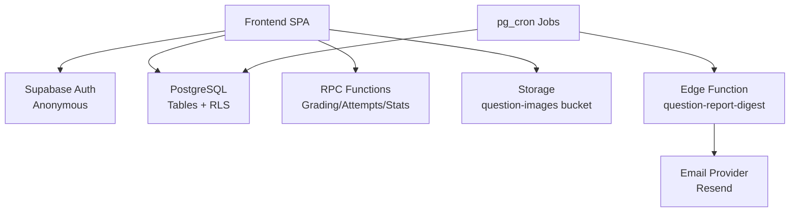
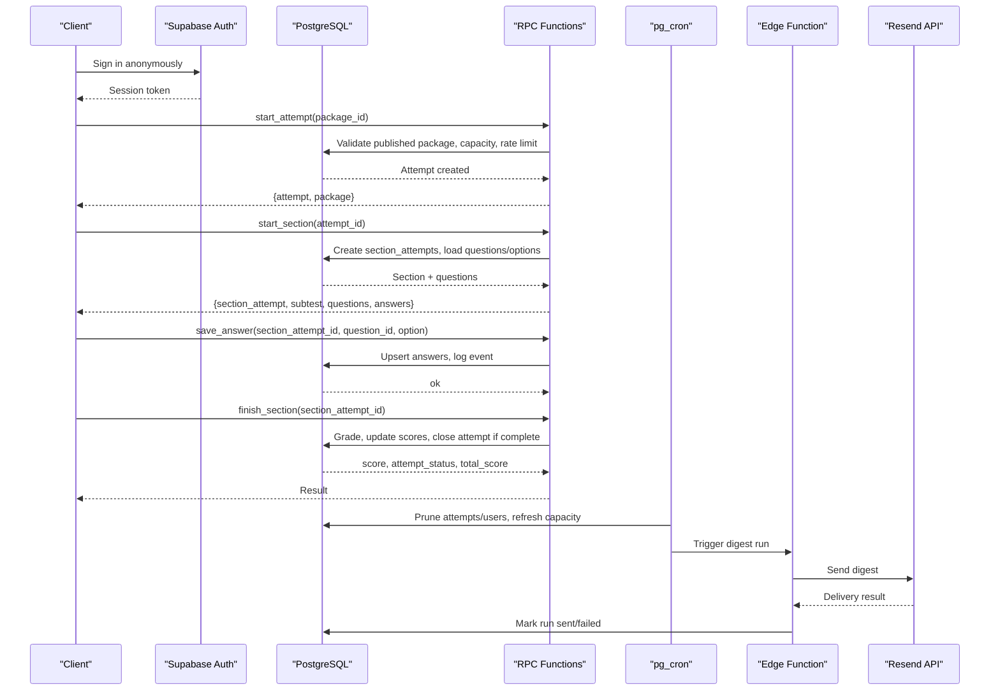
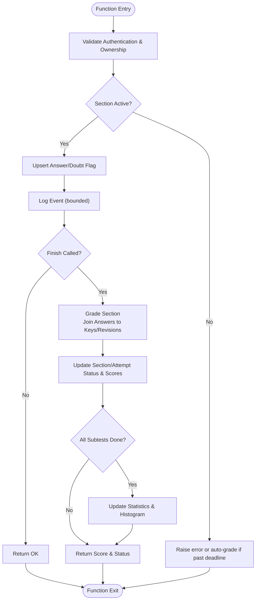
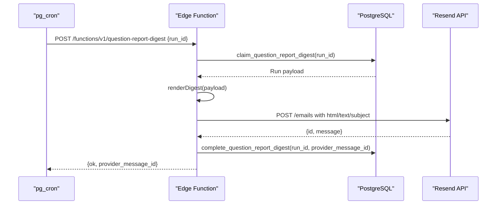
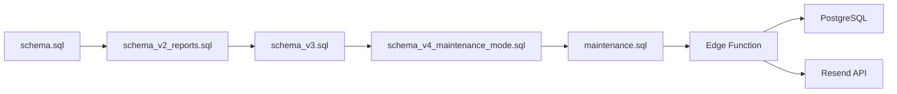

# Backend Services

<cite>
**Referenced Files in This Document**
- [schema.sql](file://supabase/schema.sql)
- [schema_v2_reports.sql](file://supabase/schema_v2_reports.sql)
- [schema_v3.sql](file://supabase/schema_v3.sql)
- [schema_v4_maintenance_mode.sql](file://supabase/schema_v4_maintenance_mode.sql)
- [maintenance.sql](file://supabase/maintenance.sql)
- [config.toml](file://supabase/config.toml)
- [index.ts](file://supabase/functions/question-report-digest/index.ts)
- [render.ts](file://supabase/functions/question-report-digest/render.ts)
</cite>

## Table of Contents
1. [Introduction](#introduction)
2. [Project Structure](#project-structure)
3. [Core Components](#core-components)
4. [Architecture Overview](#architecture-overview)
5. [Detailed Component Analysis](#detailed-component-analysis)
6. [Dependency Analysis](#dependency-analysis)
7. [Performance Considerations](#performance-considerations)
8. [Troubleshooting Guide](#troubleshooting-guide)
9. [Conclusion](#conclusion)
10. [Appendices](#appendices)

## Introduction
This document describes the Supabase-powered backend for the TBS LPDP Try Out application. It covers the PostgreSQL schema, Row Level Security (RLS) policies, server-side RPCs for grading and attempt management, statistics computation, anonymous authentication boundaries, storage for question assets, edge functions for email reporting and digest generation, cron-based maintenance tasks, data retention policies, security considerations, performance optimizations, and scalability aspects.

## Project Structure
The backend is defined primarily through SQL migrations and a small Edge Function:
- Base schema and RLS: `supabase/schema.sql`
- Question feedback (reports): `supabase/schema_v2_reports.sql`
- Immutable releases, statistics, and final RPC definitions: `supabase/schema_v3.sql`
- Scheduled maintenance mode: `supabase/schema_v4_maintenance_mode.sql`
- Cron jobs and operational helpers: `supabase/maintenance.sql`
- Edge function configuration and implementation: `supabase/config.toml`, `supabase/functions/question-report-digest/index.ts`, `render.ts`



**Diagram sources**
- [schema.sql:16-142](file://supabase/schema.sql#L16-L142)
- [schema_v2_reports.sql:27-67](file://supabase/schema_v2_reports.sql#L27-L67)
- [schema_v3.sql:58-183](file://supabase/schema_v3.sql#L58-L183)
- [schema_v4_maintenance_mode.sql:15-63](file://supabase/schema_v4_maintenance_mode.sql#L15-L63)
- [maintenance.sql:18-152](file://supabase/maintenance.sql#L18-L152)
- [config.toml:1-5](file://supabase/config.toml#L1-L5)
- [index.ts:27-118](file://supabase/functions/question-report-digest/index.ts#L27-L118)

**Section sources**
- [schema.sql:16-142](file://supabase/schema.sql#L16-L142)
- [schema_v2_reports.sql:27-67](file://supabase/schema_v2_reports.sql#L27-L67)
- [schema_v3.sql:58-183](file://supabase/schema_v3.sql#L58-L183)
- [schema_v4_maintenance_mode.sql:15-63](file://supabase/schema_v4_maintenance_mode.sql#L15-L63)
- [maintenance.sql:18-152](file://supabase/maintenance.sql#L18-L152)
- [config.toml:1-5](file://supabase/config.toml#L1-L5)
- [index.ts:27-118](file://supabase/functions/question-report-digest/index.ts#L27-L118)

## Core Components
- Database tables for packages, subtests, questions, options, answer keys, attempts, section attempts, answers, events, capacity tracking, immutable revisions/releases, statistics, histogram, report outbox, and maintenance window.
- Row Level Security policies that scope reads to authenticated users and protect sensitive data (answer keys).
- RPC functions for starting attempts, managing sections, saving answers, toggling doubt marks, finishing sections, reviewing results, service status, package catalog, and report submission.
- Storage bucket for question images with public read access for both anonymous and authenticated users.
- Edge function for daily question-report digest emails via Resend.
- pg_cron jobs for retention, capacity snapshotting, and digest scheduling/retry.

**Section sources**
- [schema.sql:16-142](file://supabase/schema.sql#L16-L142)
- [schema_v2_reports.sql:27-67](file://supabase/schema_v2_reports.sql#L27-L67)
- [schema_v3.sql:58-183](file://supabase/schema_v3.sql#L58-L183)
- [schema_v4_maintenance_mode.sql:15-63](file://supabase/schema_v4_maintenance_mode.sql#L15-L63)
- [maintenance.sql:18-152](file://supabase/maintenance.sql#L18-L152)
- [index.ts:27-118](file://supabase/functions/question-report-digest/index.ts#L27-L118)

## Architecture Overview
The system enforces trusted exam logic on the server:
- Clients authenticate anonymously and never write directly to core tables; all mutations go through RPCs.
- Answer keys are not exposed via client policies; they are only used inside server-side grading and review flows.
- Attempts and answers are scoped per user via RLS.
- Capacity guards prevent new attempts when database size or row counts approach limits.
- Retention jobs prune old attempts and anonymous users while preserving reports.
- Daily operator digests are generated and emailed via an Edge Function.



**Diagram sources**
- [schema.sql:341-657](file://supabase/schema.sql#L341-L657)
- [schema_v3.sql:610-800](file://supabase/schema_v3.sql#L610-L800)
- [maintenance.sql:31-152](file://supabase/maintenance.sql#L31-L152)
- [index.ts:27-118](file://supabase/functions/question-report-digest/index.ts#L27-L118)

## Detailed Component Analysis

### PostgreSQL Schema and Relationships
- Content entities:
  - packages: id, title, description, is_published, created_at
  - subtests: id (composite key), package_id FK, key enum, name, position, question_count, duration_seconds, passing_grade, unique constraints on (package_id, key) and (package_id, position)
  - questions: id (composite key), subtest_id FK, number, qtype, question_text, passage, image_url, difficulty enum, unique (subtest_id, number)
  - question_options: question_id FK, key enum (A-E), text, composite PK
  - answer_keys: question_id PK FK, correct_option enum, explanations jsonb
- User session and exam state:
  - attempts: id uuid, user_id FK to auth.users, package_id FK, status enum (active/finished), started_at, finished_at, total_score; index on (user_id, started_at desc)
  - section_attempts: id uuid, attempt_id FK, subtest_id FK, status enum, started_at, deadline_at, finished_at, score; unique (attempt_id, subtest_id)
  - answers: composite PK (section_attempt_id, question_id), selected_option enum, is_doubful boolean, updated_at
  - answer_events: id identity, section_attempt_id FK, question_id, event_type enum, payload jsonb, created_at; index on (section_attempt_id, created_at)
- Operational and analytics:
  - service_capacity: singleton row with db_bytes, attempt_rows, limit_bytes, limit_attempt_rows, measured_at
  - question_revisions and question_revision_options: immutable versions of questions and options with content_hash
  - package_releases and package_release_questions: immutable package snapshots linking to revisions
  - package_statistics and package_score_histogram: durable aggregates and distribution
  - question_report_digest_runs: outbox table for daily digest runs with status, lease, payload hash, provider message id
  - site_maintenance: singleton row controlling scheduled maintenance windows

Indexes and constraints:
- Composite primary keys and foreign keys enforce referential integrity.
- Check constraints restrict enums and ranges.
- Unique indexes ensure one active section per subtest per attempt and one revision per question version.
- Histogram PK (package_id, score) enables efficient updates.
- Digest outbox has a partial unique index to allow only one unsent run at a time.

**Section sources**
- [schema.sql:16-142](file://supabase/schema.sql#L16-L142)
- [schema_v2_reports.sql:27-67](file://supabase/schema_v2_reports.sql#L27-L67)
- [schema_v3.sql:58-183](file://supabase/schema_v3.sql#L58-L183)
- [schema_v4_maintenance_mode.sql:15-63](file://supabase/schema_v4_maintenance_mode.sql#L15-L63)

### Row Level Security Policies
- Public content visibility:
  - packages_read: allows select on published packages
  - subtests_read: allows select on subtests belonging to published packages
- Private content protection:
  - No client policies for questions, question_options, answer_keys; access only via RPCs
- User-scoped data:
  - attempts_read: select where user_id equals current auth.uid()
  - section_attempts_read: select via join to attempts owned by current user
  - answers_read: select via join to section_attempts and attempts owned by current user
  - answer_events_read: same ownership check through section_attempts and attempts
- Service capacity:
  - No direct policy; accessed via get_service_status() RPC

These policies ensure that anonymous users can only interact with their own attempts and cannot read answer keys directly.

**Section sources**
- [schema.sql:133-181](file://supabase/schema.sql#L133-L181)

### RPC Functions: Grading, Attempts, Statistics
Key RPCs:
- start_attempt(p_package_id): Validates authentication, published package, capacity, and per-user hourly rate limit; creates or resumes an attempt; returns attempt and package metadata.
- start_section(p_attempt_id): Sweeps expired sections, resumes or starts next subtest, loads questions and existing answers, logs start event.
- save_answer(p_section_attempt_id, p_question_id, p_option): Validates active section and question membership, upserts answer, logs event.
- toggle_doubt(p_section_attempt_id, p_question_id, p_doubtful): Validates active section and question membership, toggles doubt flag, logs event.
- finish_section(p_section_attempt_id): Grades section using answer_keys, updates status/scores, closes attempt when all subtests finished, returns scores.
- get_attempt_state(p_attempt_id): Returns attempt and its sections with subtest details.
- get_review(p_attempt_id): Returns finished sections with questions, options, user answers, correct options, explanations, and optional my_report field from v2.
- get_service_status(): Returns acceptance status and usage percentage based on capacity snapshot.
- get_package_catalog(): Returns published packages with release metadata, statistics, and subtests.
- get_attempt_summaries(): Returns recent attempts for the current user with package release info.
- report_question / delete_question_report: Submit or withdraw a question report with validation and rolling-hour budget.

Grading logic:
- Scores computed by joining answers to answer_keys or question_revisions depending on schema version.
- When all subtests finish, attempts are closed and totals recomputed.
- Statistics counters and histogram updated for eligible attempts based on answer coverage thresholds.



**Diagram sources**
- [schema.sql:186-337](file://supabase/schema.sql#L186-L337)
- [schema_v3.sql:610-705](file://supabase/schema_v3.sql#L610-L705)

**Section sources**
- [schema.sql:341-657](file://supabase/schema.sql#L341-L657)
- [schema_v2_reports.sql:90-200](file://supabase/schema_v2_reports.sql#L90-L200)
- [schema_v3.sql:574-800](file://supabase/schema_v3.sql#L574-L800)

### Authentication Flow (Anonymous)
- Anonymous sign-in is enabled; clients authenticate via Supabase Auth and receive a session token.
- All RPCs require an authenticated context; unauthenticated calls raise errors.
- RLS ensures users can only access their own attempts and related data.
- The project config disables JWT verification for the digest Edge Function, relying on an apikey header and Vault secrets for internal automation.

Security notes:
- No client policies expose answer_keys.
- Reports are scoped to the reporter’s own rows.
- Maintenance status is exposed via a dedicated RPC without exposing raw maintenance table contents.

**Section sources**
- [schema.sql:133-181](file://supabase/schema.sql#L133-L181)
- [schema.sql:341-389](file://supabase/schema.sql#L341-L389)
- [config.toml:1-5](file://supabase/config.toml#L1-L5)

### Storage API for Question Images and Assets
- A public bucket named question-images is created and configured for public read access by both anon and authenticated roles.
- Uploads use service_role; clients read images via the public object endpoint.
- Content-addressed uploads avoid duplicates by hashing filenames.

Operational guidance:
- If storage policy DDL fails due to restricted permissions, create the same read policy via the Storage dashboard.
- Ensure bucket is public and policies allow SELECT for anon and authenticated.

**Section sources**
- [schema.sql:659-672](file://supabase/schema.sql#L659-L672)

### Edge Functions: Email Reporting and Digest Generation
- The Edge Function endpoint validates method, headers, and run_id format.
- It claims a pending or sending digest run, renders HTML/text digest, sends via Resend, and records completion or failure.
- Secrets include SUPABASE_URL, RESEND_API_KEY, REPORT_DIGEST_TO, REPORT_DIGEST_FROM, and automation/admin keys.
- Idempotency is enforced via provider-level Idempotency-Key and run status checks.

Rendering:
- Digest payloads include activity counts, reason summaries, and report details.
- Text and HTML templates are localized and formatted for readability.



**Diagram sources**
- [index.ts:27-118](file://supabase/functions/question-report-digest/index.ts#L27-L118)
- [render.ts:66-127](file://supabase/functions/question-report-digest/render.ts#L66-L127)
- [maintenance.sql:87-152](file://supabase/maintenance.sql#L87-L152)

**Section sources**
- [index.ts:27-118](file://supabase/functions/question-report-digest/index.ts#L27-L118)
- [render.ts:1-128](file://supabase/functions/question-report-digest/render.ts#L1-L128)
- [maintenance.sql:87-152](file://supabase/maintenance.sql#L87-L152)

### Cron Jobs and Data Retention Policies
- Prune attempts older than 7 days daily at 03:00 UTC; cascades to sections, answers, and events.
- Refresh service capacity every 5 minutes to keep usage metrics warm.
- Prune anonymous users older than 60 days daily at 03:30 UTC, excluding those with retained reports.
- Daily queue for question-report digest at 01:00 WIB; retry every 30 minutes for unsent runs.
- Advisory locks prevent race conditions between daily and retry schedules.

Retention rationale:
- Protects free-tier database size limits and MAU quotas.
- Preserves evidence (reports) even after user deletion.

**Section sources**
- [maintenance.sql:18-152](file://supabase/maintenance.sql#L18-L152)

### Maintenance Mode
- Singleton table controls scheduled maintenance windows with start/end times and messages.
- RPC exposes phase (open/warning/maintenance) derived from current time relative to schedule.
- Updates are operator-only; no client policy exposes raw rows.

**Section sources**
- [schema_v4_maintenance_mode.sql:15-63](file://supabase/schema_v4_maintenance_mode.sql#L15-L63)

## Dependency Analysis
- schema.sql defines base tables, RLS, and initial RPCs; it also sets up storage bucket and grants.
- schema_v2_reports.sql adds question_reports, RLS, RPCs for reporting, and enhances get_review with my_report.
- schema_v3.sql introduces immutable revisions/releases, statistics, histogram, digest outbox, and final RPC definitions overriding earlier ones.
- schema_v4_maintenance_mode.sql adds maintenance window table and RPC.
- maintenance.sql depends on extensions (pg_cron, pg_net) and vault secrets; it schedules jobs that call internal functions and the Edge Function.
- Edge function depends on environment variables and Resend API; it interacts with PostgreSQL via RPCs for claiming/completing runs.



**Diagram sources**
- [schema.sql:1-12](file://supabase/schema.sql#L1-L12)
- [schema_v2_reports.sql:1-21](file://supabase/schema_v2_reports.sql#L1-L21)
- [schema_v3.sql:1-12](file://supabase/schema_v3.sql#L1-L12)
- [schema_v4_maintenance_mode.sql:1-11](file://supabase/schema_v4_maintenance_mode.sql#L1-L11)
- [maintenance.sql:1-16](file://supabase/maintenance.sql#L1-L16)
- [index.ts:27-118](file://supabase/functions/question-report-digest/index.ts#L27-L118)

**Section sources**
- [schema.sql:1-12](file://supabase/schema.sql#L1-L12)
- [schema_v2_reports.sql:1-21](file://supabase/schema_v2_reports.sql#L1-L21)
- [schema_v3.sql:1-12](file://supabase/schema_v3.sql#L1-L12)
- [schema_v4_maintenance_mode.sql:1-11](file://supabase/schema_v4_maintenance_mode.sql#L1-L11)
- [maintenance.sql:1-16](file://supabase/maintenance.sql#L1-L16)

## Performance Considerations
- Use of security definer functions centralizes privileged operations and reduces client-side complexity.
- Capacity checks use pg_database_size and planner estimates for O(1) measurements.
- Event logging is capped per section to bound growth.
- Histogram and statistics tables enable fast aggregation and median calculation.
- Indexes on attempts, answer_events, and digest outbox improve query performance.
- pg_cron offloads periodic work from request paths.

[No sources needed since this section provides general guidance]

## Troubleshooting Guide
Common issues and resolutions:
- Not authenticated: Ensure anonymous sign-in is enabled and client holds a valid session before calling RPCs.
- Package not found/unpublished: Verify package exists and is_published; ensure current_release_id is set for v3.
- Storage capacity reached: Monitor usage_percent via get_service_status(); adjust limits or wait for retention jobs to free space.
- Too many attempts: Respect per-user hourly rate limits; back off retries.
- Section already finished or deadline passed: Auto-grading occurs; re-check status via get_attempt_state.
- Invalid option or question not in section: Validate inputs against current section’s subtest.
- Report submission failures: Ensure the question belongs to a finished section and respect rolling-hour budgets.
- Digest delivery failures: Check environment variables (SUPABASE_URL, RESEND_API_KEY, REPORT_DIGEST_TO/FROM); verify Vault secrets for project_url and automation_key; inspect last_error in digest runs.

**Section sources**
- [schema.sql:341-657](file://supabase/schema.sql#L341-L657)
- [schema_v2_reports.sql:90-200](file://supabase/schema_v2_reports.sql#L90-L200)
- [schema_v3.sql:610-800](file://supabase/schema_v3.sql#L610-L800)
- [maintenance.sql:87-152](file://supabase/maintenance.sql#L87-L152)
- [index.ts:27-118](file://supabase/functions/question-report-digest/index.ts#L27-L118)

## Conclusion
The backend enforces secure, server-authoritative exam logic with strong data isolation via RLS, protected answer keys, and robust grading and statistics. Capacity guards and retention jobs safeguard operational stability under free-tier constraints. Immutable releases and revision-aware reports ensure historical integrity and accurate operator insights. The Edge Function automates daily reporting, while cron jobs maintain data hygiene and readiness. Together, these components provide a scalable, secure, and maintainable backend for the TBS LPDP Try Out platform.

[No sources needed since this section summarizes without analyzing specific files]

## Appendices

### Data Models Diagram
```mermaid
erDiagram
PACKAGES {
integer id PK
text title
text description
boolean is_published
timestamptz created_at
}
SUBTESTS {
text id PK
integer package_id FK
text key
text name
integer position
integer question_count
integer duration_seconds
integer passing_grade
}
QUESTIONS {
text id PK
text subtest_id FK
integer number
text qtype
text question_text
text passage
text image_url
text difficulty
}
QUESTION_OPTIONS {
text question_id FK
char key
text text
}
ANSWER_KEYS {
text question_id PK FK
char correct_option
jsonb explanations
}
ATTEMPTS {
uuid id PK
uuid user_id FK
integer package_id FK
text status
timestamptz started_at
timestamptz finished_at
integer total_score
}
SECTION_ATTEMPTS {
uuid id PK
uuid attempt_id FK
text subtest_id FK
text status
timestamptz started_at
timestamptz deadline_at
timestamptz finished_at
integer score
}
ANSWERS {
uuid section_attempt_id FK
text question_id FK
char selected_option
boolean is_doubtful
timestamptz updated_at
}
ANSWER_EVENTS {
bigint id PK
uuid section_attempt_id FK
text question_id
text event_type
jsonb payload
timestamptz created_at
}
PACKAGE_RELEASES {
uuid id PK
integer package_id FK
integer version
text title
text description
text difficulty
text ai_model
text ai_company
text ai_model_description
text content_hash
timestamptz published_at
}
PACKAGE_STATISTICS {
integer package_id PK FK
bigint attempts_started_total
bigint attempts_completed_total
bigint score_sum
bigint statistics_sample_total
bigint statistics_score_sum
timestamptz coverage_started_at
timestamptz score_statistics_coverage_started_at
timestamptz updated_at
}
PACKAGE_SCORE_HISTOGRAM {
integer package_id FK
smallint score
bigint attempt_count
}
QUESTION_REPORT_DIGEST_RUNS {
uuid id PK
timestamptz window_start
timestamptz window_end
text status
integer delivery_attempts
timestamptz lease_until
jsonb email_payload
text payload_sha256
text provider_message_id
text last_error
timestamptz created_at
timestamptz sent_at
timestamptz updated_at
}
SITE_MAINTENANCE {
boolean id PK
boolean enabled
timestamptz starts_at
timestamptz ends_at
text message
timestamptz updated_at
}
PACKAGES ||--o{ SUBTESTS : "has"
SUBTESTS ||--o{ QUESTIONS : "contains"
QUESTIONS ||--o{ QUESTION_OPTIONS : "has"
QUESTIONS ||--|| ANSWER_KEYS : "has"
ATTEMPTS ||--o{ SECTION_ATTEMPTS : "has"
SECTION_ATTEMPTS ||--o{ ANSWERS : "has"
SECTION_ATTEMPTS ||--o{ ANSWER_EVENTS : "has"
PACKAGES ||--o{ PACKAGE_RELEASES : "released"
PACKAGE_RELEASES ||--o{ PACKAGE_STATISTICS : "aggregates"
PACKAGE_STATISTICS ||--o{ PACKAGE_SCORE_HISTOGRAM : "distribution"
```

**Diagram sources**
- [schema.sql:16-142](file://supabase/schema.sql#L16-L142)
- [schema_v3.sql:58-183](file://supabase/schema_v3.sql#L58-L183)
- [schema_v4_maintenance_mode.sql:15-63](file://supabase/schema_v4_maintenance_mode.sql#L15-L63)