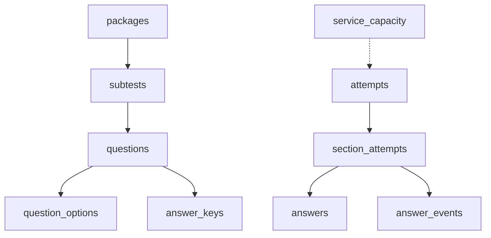
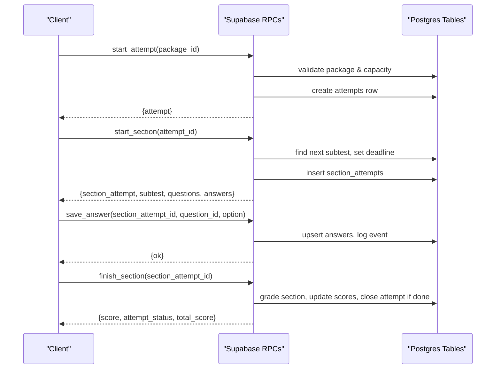

# Core Tables

<cite>
**Referenced Files in This Document**
- [schema.sql](file://supabase/schema.sql)
- [schema_v2_reports.sql](file://supabase/schema_v2_reports.sql)
- [schema_v3.sql](file://supabase/schema_v3.sql)
- [maintenance.sql](file://supabase/maintenance.sql)
- [schema_v4_maintenance_mode.sql](file://supabase/schema_v4_maintenance_mode.sql)
</cite>

## Table of Contents
1. [Introduction](#introduction)
2. [Project Structure](#project-structure)
3. [Core Components](#core-components)
4. [Architecture Overview](#architecture-overview)
5. [Detailed Component Analysis](#detailed-component-analysis)
6. [Dependency Analysis](#dependency-analysis)
7. [Performance Considerations](#performance-considerations)
8. [Troubleshooting Guide](#troubleshooting-guide)
9. [Conclusion](#conclusion)

## Introduction
This document explains the core database tables that power the TBS LPDP Try Out exam system. It focuses on how packages contain subtests, which contain questions with options, and how user attempts track progress through sections. For each table, we describe primary keys, foreign key constraints, data types, and business rules enforced by the schema. We also include entity relationship diagrams and examples of typical data patterns to help both technical and non-technical readers understand the exam flow end-to-end.

## Project Structure
The database is defined across several SQL files applied in order:
- Base schema defines core entities for content and attempts.
- Reports extension adds question feedback.
- Version 3 introduces immutable releases and revision-aware grading.
- Maintenance schedules retention and capacity snapshots.
- Maintenance mode adds a scheduled maintenance window table.



**Diagram sources**
- [schema.sql:16-127](file://supabase/schema.sql#L16-L127)

**Section sources**
- [schema.sql:1-130](file://supabase/schema.sql#L1-L130)

## Core Components
At a high level:
- Content model: packages → subtests → questions → question_options; answer_keys store correct answers and explanations.
- Attempt model: attempts → section_attempts → answers; answer_events log interactions per section.
- Capacity control: service_capacity tracks storage and attempt row limits to protect free-tier quotas.
- Reporting and maintenance: question_reports (v2), immutable releases (v3), and site maintenance (v4).

**Section sources**
- [schema.sql:16-127](file://supabase/schema.sql#L16-L127)
- [schema_v2_reports.sql:27-43](file://supabase/schema_v2_reports.sql#L27-L43)
- [schema_v3.sql:58-166](file://supabase/schema_v3.sql#L58-L166)
- [schema_v4_maintenance_mode.sql:15-26](file://supabase/schema_v4_maintenance_mode.sql#L15-L26)

## Architecture Overview
The exam workflow is server-authoritative: clients never grade or read answer keys directly. All mutations go through RPCs that enforce ownership, deadlines, and capacity limits.



**Diagram sources**
- [schema.sql:341-493](file://supabase/schema.sql#L341-L493)
- [schema_v3.sql:709-833](file://supabase/schema_v3.sql#L709-L833)

## Detailed Component Analysis

### packages
Purpose: Represents a published exam package (e.g., a try-out set).

- Primary key: id (integer)
- Fields:
  - title (text): Display name of the package.
  - description (text): Package description; defaults to empty string.
  - is_published (boolean): Controls visibility to authenticated users via RLS.
  - created_at (timestamptz): Creation timestamp.
- Business rules:
  - Only published packages are selectable by clients.
  - Packages are referenced by subtests and attempts.

Typical data pattern:
- One row per exam package, e.g., id=1, title="Try Out #1", is_published=true.

**Section sources**
- [schema.sql:16-22](file://supabase/schema.sql#L16-L22)

### subtests
Purpose: Defines the sections within a package (verbal, quantitative, problem solving).

- Primary key: id (text), conventionally "<package>-<key>"
- Foreign keys:
  - package_id references packages(id) on delete cascade
- Constraints:
  - key must be one of 'verbal', 'kuantitatif', 'pemecahan_masalah'
  - unique(package_id, key) and unique(package_id, position)
- Fields:
  - name (text): Section display name.
  - position (integer): Order of sections within the package.
  - question_count (integer): Number of questions in this section.
  - duration_seconds (integer): Time limit for the section.
  - passing_grade (integer): Minimum score to pass the section.

Business rules:
- Each package has at most one subtest per key and per position.
- Subtests drive section creation and ordering during attempts.

Typical data pattern:
- id="1-verbal", package_id=1, key='verbal', position=1, question_count=23, duration_seconds=1800, passing_grade=...

**Section sources**
- [schema.sql:24-35](file://supabase/schema.sql#L24-L35)

### questions
Purpose: Individual exam items belonging to a subtest.

- Primary key: id (text), conventionally "<package>-<subtest>-<NNN>"
- Foreign keys:
  - subtest_id references subtests(id) on delete cascade
- Constraints:
  - difficulty must be one of 'easy', 'medium', 'hard'
  - unique(subtest_id, number)
- Fields:
  - number (integer): Question sequence within the subtest.
  - qtype (text): Question type/category.
  - question_text (text): The stem of the question.
  - passage (text): Optional shared stimulus (text or table).
  - image_url (text): Optional image reference.
  - difficulty (text): Difficulty rating.

Business rules:
- Questions are ordered by number within a subtest.
- Options and answer keys are linked via question_id.

Typical data pattern:
- id="1-verbal-001", subtest_id="1-verbal", number=1, qtype='reading', question_text='...', difficulty='medium'

**Section sources**
- [schema.sql:37-47](file://supabase/schema.sql#L37-L47)

### question_options
Purpose: Multiple-choice options for a question.

- Composite primary key: (question_id, key)
- Foreign keys:
  - question_id references questions(id) on delete cascade
- Constraints:
  - key must be one of 'A','B','C','D','E'
- Fields:
  - text (text): Option text.

Business rules:
- Exactly five options per question are expected by authoring tools and validators.
- Option keys are strictly ordered A–E.

Typical data pattern:
- (question_id="1-verbal-001", key='A', text='Option A')
- (question_id="1-verbal-001", key='B', text='Option B')
- ...

**Section sources**
- [schema.sql:49-54](file://supabase/schema.sql#L49-L54)

### answer_keys
Purpose: Stores the correct option and explanations for each question.

- Primary key: question_id references questions(id) on delete cascade
- Constraints:
  - correct_option must be one of 'A','B','C','D','E'
- Fields:
  - explanations (jsonb): Rich explanation metadata.

Business rules:
- No client-readable policy exists; grading happens server-side via RPCs.
- Used only by internal functions to compute scores and review outputs.

Typical data pattern:
- question_id="1-verbal-001", correct_option='C', explanations={...}

**Section sources**
- [schema.sql:56-60](file://supabase/schema.sql#L56-L60)

### attempts
Purpose: Represents a user’s overall attempt at a package.

- Primary key: id (uuid, auto-generated)
- Foreign keys:
  - user_id references auth.users(id) on delete cascade
  - package_id references packages(id)
- Constraints:
  - status must be one of 'active', 'finished'
- Fields:
  - started_at (timestamptz): When the attempt began.
  - finished_at (timestamptz): When all sections completed.
  - total_score (integer): Sum of section scores when finished.

Business rules:
- At most one active attempt per user per package at a time.
- Attempts are gated by capacity and rate limits before creation.
- v3 pins attempts to an immutable package_release_id for durability.

Typical data pattern:
- id=uuid, user_id=..., package_id=1, status='active', started_at=..., total_score=null

**Section sources**
- [schema.sql:64-73](file://supabase/schema.sql#L64-L73)
- [schema_v3.sql:170-171](file://supabase/schema_v3.sql#L170-L171)

### section_attempts
Purpose: Tracks progress per subtest within an attempt.

- Primary key: id (uuid, auto-generated)
- Foreign keys:
  - attempt_id references attempts(id) on delete cascade
  - subtest_id references subtests(id)
- Constraints:
  - status must be one of 'active', 'finished'
  - unique(attempt_id, subtest_id)
- Fields:
  - started_at (timestamptz): When the section began.
  - deadline_at (timestamptz): Hard deadline based on subtest duration.
  - finished_at (timestamptz): When the section was graded/completed.
  - score (integer): Section score after grading.

Business rules:
- Deadlines are enforced; late sections are auto-graded.
- Sections are created in package-defined order.

Typical data pattern:
- id=uuid, attempt_id=..., subtest_id="1-verbal", status='active', deadline_at=started_at+duration_seconds

**Section sources**
- [schema.sql:75-85](file://supabase/schema.sql#L75-L85)

### answers
Purpose: Records a user’s selected option and doubt flag per question in a section.

- Composite primary key: (section_attempt_id, question_id)
- Foreign keys:
  - section_attempt_id references section_attempts(id) on delete cascade
  - question_id references questions(id)
- Constraints:
  - selected_option must be one of 'A','B','C','D','E'
- Fields:
  - is_doubtful (boolean): User-marked uncertainty.
  - updated_at (timestamptz): Last modification time.
- v3 addition:
  - question_revision_id references question_revisions(id) to pin answers to immutable versions.

Business rules:
- Upsert semantics allow saving answers multiple times without duplication.
- Answers are scoped to a specific section and question version.

Typical data pattern:
- (section_attempt_id=uuid, question_id="1-verbal-001", selected_option='C', is_doubtful=false, updated_at=...)

**Section sources**
- [schema.sql:87-94](file://supabase/schema.sql#L87-L94)
- [schema_v3.sql:172-173](file://supabase/schema_v3.sql#L172-L173)

### answer_events
Purpose: Append-only audit log of user actions within a section.

- Primary key: id (bigint, identity)
- Foreign keys:
  - section_attempt_id references section_attempts(id) on delete cascade
- Constraints:
  - event_type must be one of 'start', 'save_answer', 'mark_doubt', 'unmark_doubt', 'finish'
- Fields:
  - question_id (text): Optional context for the event.
  - payload (jsonb): Event-specific data.
  - created_at (timestamptz): Timestamp.

Business rules:
- Per-section cap prevents unbounded growth (e.g., capped at 500 events per section).
- Used for analytics and debugging; not used for scoring.

Typical data pattern:
- section_attempt_id=uuid, event_type='save_answer', payload={"option":"C"}, created_at=...

**Section sources**
- [schema.sql:96-106](file://supabase/schema.sql#L96-L106)

### service_capacity
Purpose: Singleton configuration controlling global storage and attempt-row limits.

- Primary key: id (boolean, single row)
- Fields:
  - db_bytes (bigint): Current database size.
  - attempt_rows (bigint): Combined row count of attempt-related tables.
  - limit_bytes (bigint): Soft cap for database size.
  - limit_attempt_rows (bigint): Soft cap for attempt-related rows.
  - measured_at (timestamptz): Last measurement time.

Business rules:
- New attempts are blocked when usage exceeds limits to protect free-tier quotas.
- Measurements are cached and refreshed periodically.

Typical data pattern:
- id=true, db_bytes=..., attempt_rows=..., limit_bytes=400*1024*1024, measured_at=...

**Section sources**
- [schema.sql:119-129](file://supabase/schema.sql#L119-L129)

### Additional tables relevant to the exam system

#### question_reports (v2)
Purpose: Captures user-reported issues with questions from the review screen.

- Primary key: id (uuid)
- Foreign keys:
  - user_id references auth.users(id) on delete cascade
  - question_id references questions(id) on delete cascade
  - attempt_id references attempts(id) on delete set null
  - section_attempt_id references section_attempts(id) on delete set null
- Constraints:
  - reason must be one of predefined values
  - status must be one of 'open', 'reviewing', 'accepted', 'rejected', 'duplicate'
  - selected_option must be one of 'A'–'E'
  - unique(user_id, question_id) enforces one report per user per question
- Fields:
  - comment (text): Optional user comment
  - content_hash (text): Snapshot hash of visible question content
  - created_at/updated_at timestamps

Business rules:
- Only finished sections can trigger reports; no direct table writes allowed (RPC-gated).
- Reports are private to their authors via RLS.

**Section sources**
- [schema_v2_reports.sql:27-43](file://supabase/schema_v2_reports.sql#L27-L43)

#### Immutable releases and revisions (v3)
Purpose: Pin attempts to immutable versions of questions and packages for durable history.

Key tables:
- question_revisions: Immutable snapshot of a question including options and correct answer.
- question_revision_options: Options tied to a revision.
- package_releases: Immutable snapshot of a package with attribution metadata and content hash.
- package_release_questions: Maps a release to its questions and revisions.
- package_statistics and package_score_histogram: Aggregated stats and score distribution.
- question_report_digest_runs: Outbox for operator digest emails.

Business rules:
- Triggers prevent updates/deletes to ensure immutability.
- Attempts and answers are pinned to a release and revision respectively.
- Statistics are updated only for eligible completed attempts.

**Section sources**
- [schema_v3.sql:58-166](file://supabase/schema_v3.sql#L58-L166)
- [schema_v3.sql:187-236](file://supabase/schema_v3.sql#L187-L236)
- [schema_v3.sql:267-288](file://supabase/schema_v3.sql#L267-L288)
- [schema_v3.sql:935-955](file://supabase/schema_v3.sql#L935-L955)

#### site_maintenance (v4)
Purpose: Operator-managed schedule for planned maintenance windows.

- Primary key: id (boolean, single row)
- Fields:
  - enabled (boolean)
  - starts_at/ends_at (timestamptz)
  - message (text): Public-facing notice
  - updated_at (timestamptz)
- Constraints:
  - If enabled, requires start/end times and valid ranges
  - Message length bounded

Business rules:
- Read-only via RPC; updates require service role/operator access.
- Provides phase computation (open/warning/maintenance) for frontend.

**Section sources**
- [schema_v4_maintenance_mode.sql:15-26](file://supabase/schema_v4_maintenance_mode.sql#L15-L26)

## Dependency Analysis
The following diagram shows the core relationships among the requested tables and how they interact during an exam session.

```mermaid
erDiagram
PACKAGES ||--o{ SUBTESTS : "contains"
SUBTESTS ||--o{ QUESTIONS : "has"
QUESTIONS ||--o{ QUESTION_OPTIONS : "has"
QUESTIONS ||--|| ANSWER_KEYS : "has"
ATTEMPTS ||--o{ SECTION_ATTEMPTS : "has"
SECTION_ATTEMPTS ||--o{ ANSWERS : "records"
SECTION_ATTEMPTS ||--o{ ANSWER_EVENTS : "logs"
SERVICE_CAPACITY }..|| ATTEMPTS : "gates new attempts"
```

**Diagram sources**
- [schema.sql:16-127](file://supabase/schema.sql#L16-L127)

Additional dependencies introduced by later versions:
- Attempts link to package_releases for immutability.
- Answers link to question_revisions to pin content versions.
- Statistics tables aggregate completion outcomes.

**Section sources**
- [schema_v3.sql:170-173](file://supabase/schema_v3.sql#L170-L173)
- [schema_v3.sql:187-236](file://supabase/schema_v3.sql#L187-L236)

## Performance Considerations
- Indexes:
  - attempts_user_idx supports listing recent attempts per user.
  - answer_events_section_idx optimizes querying events per section.
  - package_release_questions_subtest_idx speeds up loading questions by release and subtest.
- Caps and budgets:
  - answer_events capped per section to prevent runaway growth.
  - service_capacity enforces soft limits on database size and attempt rows.
  - Rate limiting on new attempts per user per hour.
- Retention:
  - Scheduled jobs prune old attempts and anonymous users while preserving reports.

[No sources needed since this section provides general guidance]

## Troubleshooting Guide
Common errors and where they originate:
- Invalid option: save_answer validates option values.
- Question not in this section: ensures the question belongs to the current section/subtest.
- Section already finished: prevents regrading a closed section.
- Storage capacity reached: blocks new attempts when limits exceeded.
- Too many attempts: hourly rate limit enforcement.
- Not authenticated: missing user context.

These checks are implemented in RPCs and triggers to maintain integrity and security.

**Section sources**
- [schema.sql:495-548](file://supabase/schema.sql#L495-L548)
- [schema.sql:341-389](file://supabase/schema.sql#L341-L389)
- [schema_v3.sql:836-907](file://supabase/schema_v3.sql#L836-L907)

## Conclusion
The TBS LPDP Try Out database models a robust, secure exam system:
- Content is structured as packages containing subtests with questions and options, plus protected answer keys.
- Attempts and section_attempts capture user progress with strict deadlines and server-side grading.
- answer_events provide an append-only audit trail with caps to control growth.
- service_capacity protects operational limits, while scheduled maintenance ensures long-term stability.
- Version 3 introduces immutable releases and revision-aware answers to preserve historical integrity.

This design balances usability, security, and scalability, ensuring fair and reliable exam delivery even under constrained environments.