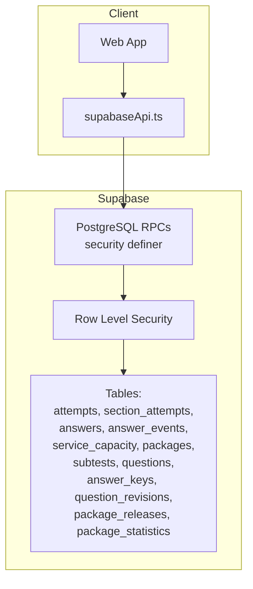
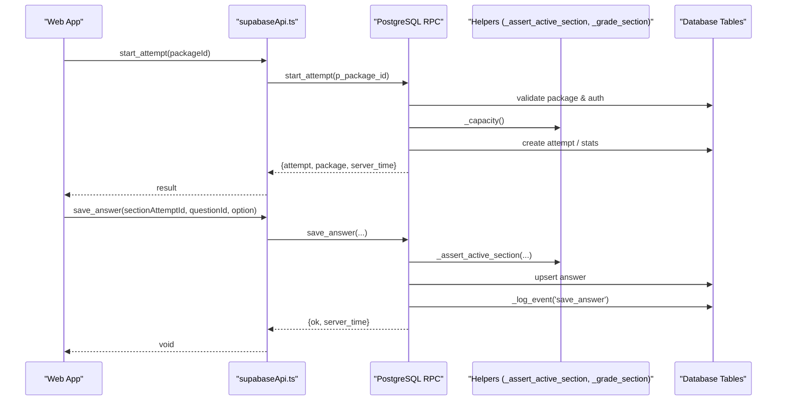
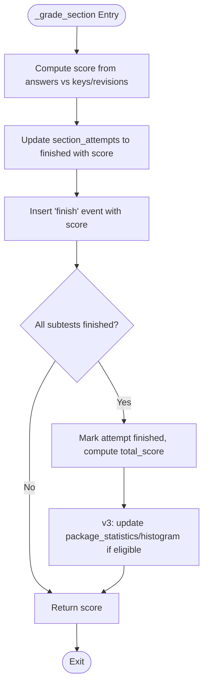
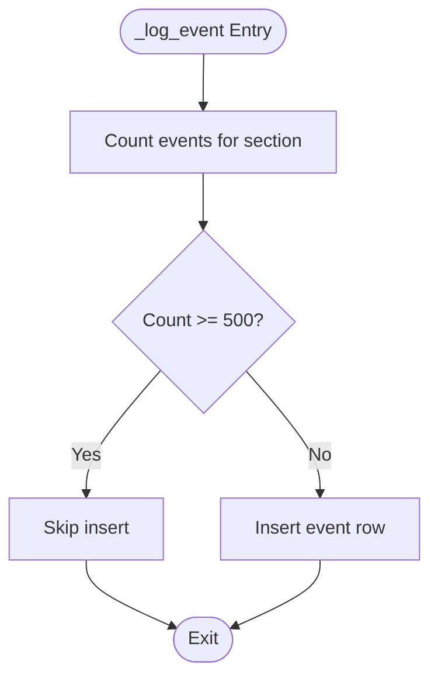
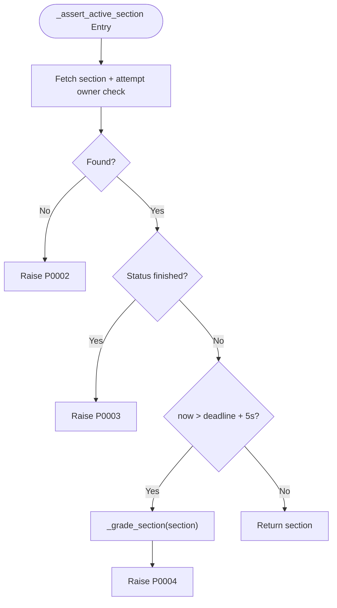
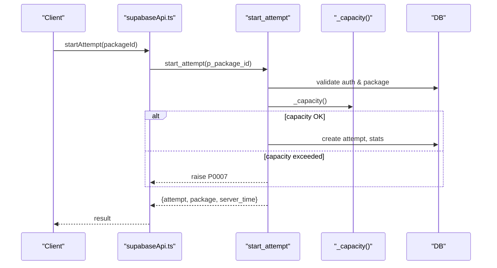
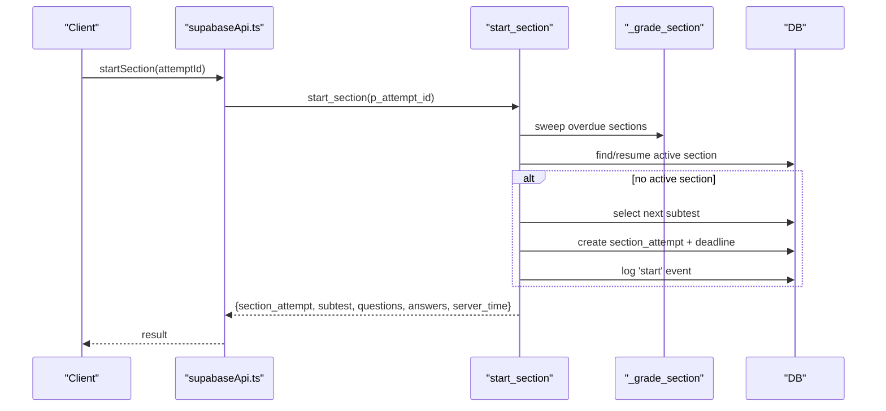
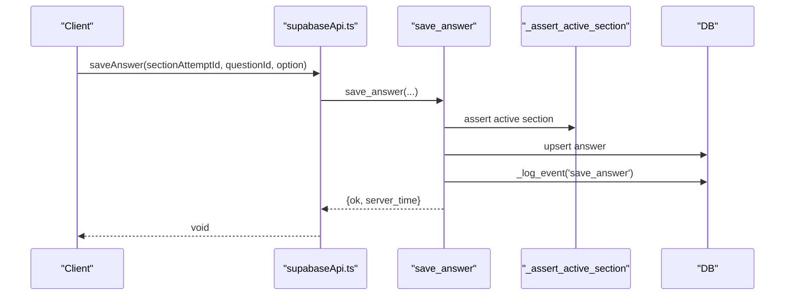
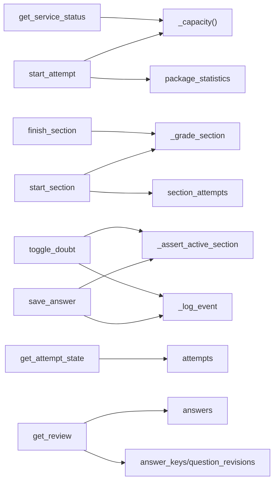

# Database Functions and RPCs

<cite>
**Referenced Files in This Document**
- [schema.sql](file://supabase/schema.sql)
- [schema_v2_reports.sql](file://supabase/schema_v2_reports.sql)
- [schema_v3.sql](file://supabase/schema_v3.sql)
- [maintenance.sql](file://supabase/maintenance.sql)
- [supabaseApi.ts](file://web/src/lib/supabaseApi.ts)
</cite>

## Table of Contents
1. [Introduction](#introduction)
2. [Project Structure](#project-structure)
3. [Core Components](#core-components)
4. [Architecture Overview](#architecture-overview)
5. [Detailed Component Analysis](#detailed-component-analysis)
6. [Dependency Analysis](#dependency-analysis)
7. [Performance Considerations](#performance-considerations)
8. [Troubleshooting Guide](#troubleshooting-guide)
9. [Conclusion](#conclusion)

## Introduction
This document provides comprehensive documentation for the PostgreSQL functions and RPC endpoints that power the TBS LPDP Try Out application’s server-side logic. It covers the complete set of user-facing RPCs: start_attempt, start_section, save_answer, toggle_doubt, finish_section, get_attempt_state, get_review, and get_service_status. It also documents internal helper functions such as _grade_section, _log_event, _refresh_capacity, and _assert_active_section, explaining their business rules, security model (security definer), error handling, and usage patterns from the web client.

## Project Structure
The database layer is implemented across multiple SQL schema files applied in order:
- Base schema and core RPCs: schema.sql
- Question reporting enhancements and extended review: schema_v2_reports.sql
- Immutable releases, statistics, and updated RPCs: schema_v3.sql
- Scheduled maintenance jobs: maintenance.sql

The web client invokes these RPCs via a thin Supabase wrapper that ensures authentication and synchronizes server time.

**Diagram sources**
- [schema.sql:131-181](file://supabase/schema.sql#L131-L181)
- [schema.sql:341-657](file://supabase/schema.sql#L341-L657)
- [schema_v3.sql:574-606](file://supabase/schema_v3.sql#L574-L606)
- [supabaseApi.ts:33-39](file://web/src/lib/supabaseApi.ts#L33-L39)

**Section sources**
- [schema.sql:1-181](file://supabase/schema.sql#L1-L181)
- [schema_v3.sql:574-606](file://supabase/schema_v3.sql#L574-L606)
- [supabaseApi.ts:33-39](file://web/src/lib/supabaseApi.ts#L33-L39)

## Core Components
This section summarizes each RPC endpoint with input parameters, return values, error codes, and business logic. All RPCs are exposed to authenticated users and run with security definer privileges to enforce business rules and access control consistently.

- start_attempt(p_package_id integer)
  - Purpose: Start or resume an attempt for a published package; enforces capacity and rate limits.
  - Input: p_package_id
  - Returns: JSON with attempt object, package release info, and server_time.
  - Errors:
    - Not authenticated
    - P0002: Package not found, unpublished, or no release
    - P0007: Storage capacity reached
    - P0005: Too many attempts per hour
  - Business logic:
    - Validates authentication and package availability.
    - Reuses existing active attempt if present.
    - Checks global storage capacity via _capacity().
    - Enforces per-user hourly attempt budget (max 10).
    - Creates new attempt and increments package statistics.

- start_section(p_attempt_id uuid)
  - Purpose: Start or resume the next section for an attempt; returns questions and current answers.
  - Input: p_attempt_id
  - Returns: JSON with section_attempt, subtest, questions, answers, and server_time; or done flag when all sections finished.
  - Errors:
    - P0002: Attempt not found
  - Business logic:
    - Sweeps and auto-finishes any overdue active sections using _grade_section.
    - Resumes active section if exists.
    - Otherwise picks next unstarted subtest by position and creates section_attempt with deadline.
    - Logs 'start' event and returns full question set with options and saved answers.

- save_answer(p_section_attempt_id uuid, p_question_id text, p_option char(1))
  - Purpose: Save or update a selected option for a question within an active section.
  - Input: p_section_attempt_id, p_question_id, p_option (A–E or null)
  - Returns: JSON with ok true and server_time.
  - Errors:
    - Invalid option value
    - P0002: Question not in this section
  - Business logic:
    - Asserts active section ownership via _assert_active_section.
    - Upserts answer row and logs 'save_answer' event.

- toggle_doubt(p_section_attempt_id uuid, p_question_id text, p_doubtful boolean)
  - Purpose: Mark or unmark a question as doubtful.
  - Input: p_section_attempt_id, p_question_id, p_doubtful
  - Returns: JSON with ok true and server_time.
  - Errors:
    - P0002: Question not in this section
  - Business logic:
    - Asserts active section ownership via _assert_active_section.
    - Upserts doubt flag and logs 'mark_doubt' or 'unmark_doubt' event.

- finish_section(p_section_attempt_id uuid)
  - Purpose: Finish a section, compute score, and finalize attempt if all sections completed.
  - Input: p_section_attempt_id
  - Returns: JSON with score, attempt status, total_score, and server_time.
  - Errors:
    - P0002: Section attempt not found
  - Business logic:
    - Validates ownership.
    - Grades section via _grade_section and updates attempt totals if all sections finished.

- get_attempt_state(p_attempt_id uuid)
  - Purpose: Retrieve attempt state including all sections and subtest metadata.
  - Input: p_attempt_id
  - Returns: JSON with attempt, sections array, and server_time.
  - Errors:
    - P0002: Attempt not found
  - Business logic:
    - Validates ownership and aggregates section data.

- get_review(p_attempt_id uuid)
  - Purpose: Retrieve detailed review for finished sections including correct answers and explanations.
  - Input: p_attempt_id
  - Returns: JSON with attempt, sections (with questions, options, selected/doubt flags, correct/explanations), and server_time.
  - Errors:
    - P0002: Attempt not found
  - Business logic:
    - Validates ownership.
    - Only exposes keys/explanations for finished sections of the caller’s own attempt.
    - v2 adds my_report field per question showing the user’s report state.

- get_service_status()
  - Purpose: Provide service health and capacity usage percentage.
  - Input: None
  - Returns: JSON with accepting_attempts (boolean), usage_percent, measured_at, server_time.
  - Business logic:
    - Reads capacity snapshot via _capacity(), computes usage ratio, and caps at 100%.

**Section sources**
- [schema.sql:341-415](file://supabase/schema.sql#L341-L415)
- [schema.sql:417-657](file://supabase/schema.sql#L417-L657)
- [schema_v2_reports.sql:207-261](file://supabase/schema_v2_reports.sql#L207-L261)
- [schema_v3.sql:709-800](file://supabase/schema_v3.sql#L709-L800)
- [supabaseApi.ts:85-147](file://web/src/lib/supabaseApi.ts#L85-L147)

## Architecture Overview
The system uses PostgreSQL security definer functions to centralize business rules and enforce Row Level Security (RLS). Clients never write tables directly; all mutations go through RPCs. Capacity checks prevent new attempts when storage thresholds are exceeded, while per-user budgets limit abuse. Helper functions encapsulate grading, logging, capacity measurement, and section validation.

**Diagram sources**
- [schema.sql:341-390](file://supabase/schema.sql#L341-L390)
- [schema.sql:495-522](file://supabase/schema.sql#L495-L522)
- [schema.sql:246-260](file://supabase/schema.sql#L246-L260)
- [schema.sql:313-337](file://supabase/schema.sql#L313-L337)
- [supabaseApi.ts:108-124](file://web/src/lib/supabaseApi.ts#L108-L124)

## Detailed Component Analysis

### Internal Helpers

#### _grade_section(p_section_attempt_id uuid)
- Purpose: Compute section score, mark section finished, log finish event, and finalize attempt if all subtests completed.
- Behavior:
  - Counts correct answers against answer_keys or question_revisions depending on schema version.
  - Updates section_attempts to finished with score.
  - Inserts finish event.
  - If all subtests finished, marks attempt finished and computes total_score.
  - v3 additionally updates package_statistics and histogram when eligible.
- Error handling: Idempotent; if already finished, returns stored score without side effects.

**Diagram sources**
- [schema.sql:186-239](file://supabase/schema.sql#L186-L239)
- [schema_v3.sql:610-705](file://supabase/schema_v3.sql#L610-L705)

**Section sources**
- [schema.sql:186-239](file://supabase/schema.sql#L186-L239)
- [schema_v3.sql:610-705](file://supabase/schema_v3.sql#L610-L705)

#### _log_event(p_section_attempt_id uuid, p_question_id text, p_event_type text, p_payload jsonb)
- Purpose: Append one event row to answer_events with a cap per section to bound storage growth.
- Behavior:
  - Checks current event count for the section; if >= 500, skips insertion.
  - Inserts event with sanitized payload.
- Error handling: No exceptions; silently drops events beyond cap.

**Diagram sources**
- [schema.sql:246-260](file://supabase/schema.sql#L246-L260)

**Section sources**
- [schema.sql:246-260](file://supabase/schema.sql#L246-L260)

#### _refresh_capacity()
- Purpose: Measure database size and attempt rows, then update service_capacity snapshot.
- Behavior:
  - Uses pg_database_size for db_bytes.
  - Estimates attempt_rows via planner reltuples for key tables.
  - Updates measured_at timestamp.
- Performance: O(1) relative to table sizes due to planner estimates.

**Section sources**
- [schema.sql:266-287](file://supabase/schema.sql#L266-L287)

#### _capacity()
- Purpose: Provide a cached capacity snapshot, refreshing if older than 5 minutes.
- Behavior:
  - Reads service_capacity row; inserts default if missing.
  - Refreshes via _refresh_capacity if measured_at is stale.
  - Returns capacity row.

**Section sources**
- [schema.sql:292-309](file://supabase/schema.sql#L292-L309)

#### _assert_active_section(p_section_attempt_id uuid)
- Purpose: Validate that the caller owns an active, non-deadline-passed section; auto-finish if past deadline.
- Behavior:
  - Joins section_attempts with attempts to verify ownership.
  - Raises P0002 if not found.
  - Raises P0003 if already finished.
  - If deadline passed (+5s tolerance), calls _grade_section and raises P0004.
  - Returns section row on success.

**Diagram sources**
- [schema.sql:313-337](file://supabase/schema.sql#L313-L337)

**Section sources**
- [schema.sql:313-337](file://supabase/schema.sql#L313-L337)

### RPC Endpoints

#### start_attempt(p_package_id integer)
- Inputs: p_package_id
- Outputs: attempt, package (release info), server_time
- Errors:
  - Not authenticated
  - P0002: Package not found/unpublished/no release
  - P0007: Storage capacity reached
  - P0005: Too many attempts per hour
- Business Logic:
  - Auth check and package validation.
  - Reuse active attempt if exists.
  - Capacity guard via _capacity().
  - Rate limiting: max 10 attempts per hour per user.
  - Create attempt and increment package statistics.

**Diagram sources**
- [schema.sql:341-390](file://supabase/schema.sql#L341-L390)
- [schema_v3.sql:709-758](file://supabase/schema_v3.sql#L709-L758)
- [supabaseApi.ts:108-111](file://web/src/lib/supabaseApi.ts#L108-L111)

**Section sources**
- [schema.sql:341-390](file://supabase/schema.sql#L341-L390)
- [schema_v3.sql:709-758](file://supabase/schema_v3.sql#L709-L758)
- [supabaseApi.ts:108-111](file://web/src/lib/supabaseApi.ts#L108-L111)

#### start_section(p_attempt_id uuid)
- Inputs: p_attempt_id
- Outputs: section_attempt, subtest, questions, answers, server_time; or {done: true, server_time}
- Errors:
  - P0002: Attempt not found
- Business Logic:
  - Sweep overdue sections and grade them.
  - Resume active section if exists.
  - Else pick next subtest by position and create section_attempt with deadline.
  - Log 'start' event and return questions/options/answers.

**Diagram sources**
- [schema.sql:417-493](file://supabase/schema.sql#L417-L493)
- [schema_v3.sql:760-800](file://supabase/schema_v3.sql#L760-L800)
- [supabaseApi.ts:113-116](file://web/src/lib/supabaseApi.ts#L113-L116)

**Section sources**
- [schema.sql:417-493](file://supabase/schema.sql#L417-L493)
- [schema_v3.sql:760-800](file://supabase/schema_v3.sql#L760-L800)
- [supabaseApi.ts:113-116](file://web/src/lib/supabaseApi.ts#L113-L116)

#### save_answer(p_section_attempt_id uuid, p_question_id text, p_option char(1))
- Inputs: p_section_attempt_id, p_question_id, p_option (A–E or null)
- Outputs: {ok: true, server_time}
- Errors:
  - Invalid option
  - P0002: Question not in this section
- Business Logic:
  - Assert active section ownership.
  - Upsert answer and log 'save_answer'.

**Diagram sources**
- [schema.sql:495-522](file://supabase/schema.sql#L495-L522)
- [schema.sql:313-337](file://supabase/schema.sql#L313-L337)
- [supabaseApi.ts:118-124](file://web/src/lib/supabaseApi.ts#L118-L124)

**Section sources**
- [schema.sql:495-522](file://supabase/schema.sql#L495-L522)
- [schema.sql:313-337](file://supabase/schema.sql#L313-L337)
- [supabaseApi.ts:118-124](file://web/src/lib/supabaseApi.ts#L118-L124)

#### toggle_doubt(p_section_attempt_id uuid, p_question_id text, p_doubtful boolean)
- Inputs: p_section_attempt_id, p_question_id, p_doubtful
- Outputs: {ok: true, server_time}
- Errors:
  - P0002: Question not in this section
- Business Logic:
  - Assert active section ownership.
  - Upsert doubt flag and log 'mark_doubt' or 'unmark_doubt'.

**Section sources**
- [schema.sql:524-549](file://supabase/schema.sql#L524-L549)
- [supabaseApi.ts:126-132](file://web/src/lib/supabaseApi.ts#L126-L132)

#### finish_section(p_section_attempt_id uuid)
- Inputs: p_section_attempt_id
- Outputs: {score, attempt_status, total_score, server_time}
- Errors:
  - P0002: Section attempt not found
- Business Logic:
  - Validate ownership.
  - Grade section and finalize attempt if all subtests finished.

**Section sources**
- [schema.sql:551-580](file://supabase/schema.sql#L551-L580)
- [supabaseApi.ts:134-137](file://web/src/lib/supabaseApi.ts#L134-L137)

#### get_attempt_state(p_attempt_id uuid)
- Inputs: p_attempt_id
- Outputs: {attempt, sections[], server_time}
- Errors:
  - P0002: Attempt not found
- Business Logic:
  - Validate ownership and aggregate sections with subtest metadata.

**Section sources**
- [schema.sql:582-607](file://supabase/schema.sql#L582-L607)
- [supabaseApi.ts:139-142](file://web/src/lib/supabaseApi.ts#L139-L142)

#### get_review(p_attempt_id uuid)
- Inputs: p_attempt_id
- Outputs: {attempt, sections[] with questions, options, selected/doubt, correct/explanations, my_report}, server_time
- Errors:
  - P0002: Attempt not found
- Business Logic:
  - Validate ownership.
  - Expose keys/explanations only for finished sections of the caller’s attempt.
  - v2 adds my_report per question.

**Section sources**
- [schema.sql:612-657](file://supabase/schema.sql#L612-L657)
- [schema_v2_reports.sql:207-261](file://supabase/schema_v2_reports.sql#L207-L261)
- [supabaseApi.ts:144-147](file://web/src/lib/supabaseApi.ts#L144-L147)

#### get_service_status()
- Inputs: None
- Outputs: {accepting_attempts, usage_percent, measured_at, server_time}
- Business Logic:
  - Read capacity via _capacity(); compute usage ratio; clamp to 100%.

**Section sources**
- [schema.sql:395-415](file://supabase/schema.sql#L395-L415)
- [supabaseApi.ts:85-88](file://web/src/lib/supabaseApi.ts#L85-L88)

## Dependency Analysis
The RPCs depend on internal helpers and shared tables. The following diagram shows key dependencies among functions and tables.

**Diagram sources**
- [schema.sql:341-415](file://supabase/schema.sql#L341-L415)
- [schema.sql:417-657](file://supabase/schema.sql#L417-L657)
- [schema_v3.sql:610-705](file://supabase/schema_v3.sql#L610-L705)

**Section sources**
- [schema.sql:341-657](file://supabase/schema.sql#L341-L657)
- [schema_v3.sql:610-705](file://supabase/schema_v3.sql#L610-L705)

## Performance Considerations
- Capacity measurement uses planner estimates for row counts to remain O(1) regardless of table size.
- Event logging is capped per section to prevent unbounded growth of answer_events.
- Per-user hourly attempt limits mitigate scripted abuse and keep storage growth predictable.
- Maintenance jobs prune old attempts and anonymous users to manage free-tier storage constraints.

[No sources needed since this section provides general guidance]

## Troubleshooting Guide
Common errors and their meanings:
- Not authenticated: RPC requires an active session; ensure client has signed in (anonymous or persistent).
- P0002: Resource not found or invalid reference (e.g., package not found, attempt not found, question not in section).
- P0003: Section already finished; cannot modify or re-grade.
- P0004: Section deadline passed; auto-graded and locked.
- P0005: Too many attempts or reports within the time window; wait or reduce frequency.
- P0006: Invalid input shape (e.g., unknown reason, comment too long).
- P0007: Storage capacity reached; new attempts blocked until capacity frees up.

Client-side error handling pattern:
- The supabaseApi wrapper throws ApiError with message and code; clients should handle these codes to show meaningful messages.

**Section sources**
- [schema.sql:341-415](file://supabase/schema.sql#L341-L415)
- [schema.sql:417-657](file://supabase/schema.sql#L417-L657)
- [schema_v2_reports.sql:90-176](file://supabase/schema_v2_reports.sql#L90-L176)
- [supabaseApi.ts:28-39](file://web/src/lib/supabaseApi.ts#L28-L39)

## Conclusion
The TBS LPDP Try Out application centralizes business logic in secure PostgreSQL functions and RPCs, enforcing strict access controls via Row Level Security and security definer privileges. The design balances usability with robust safeguards: capacity guards, per-user budgets, event capping, and scheduled maintenance ensure reliability under free-tier constraints. Each RPC is well-defined with clear inputs, outputs, and error codes, enabling consistent client integration and predictable behavior.