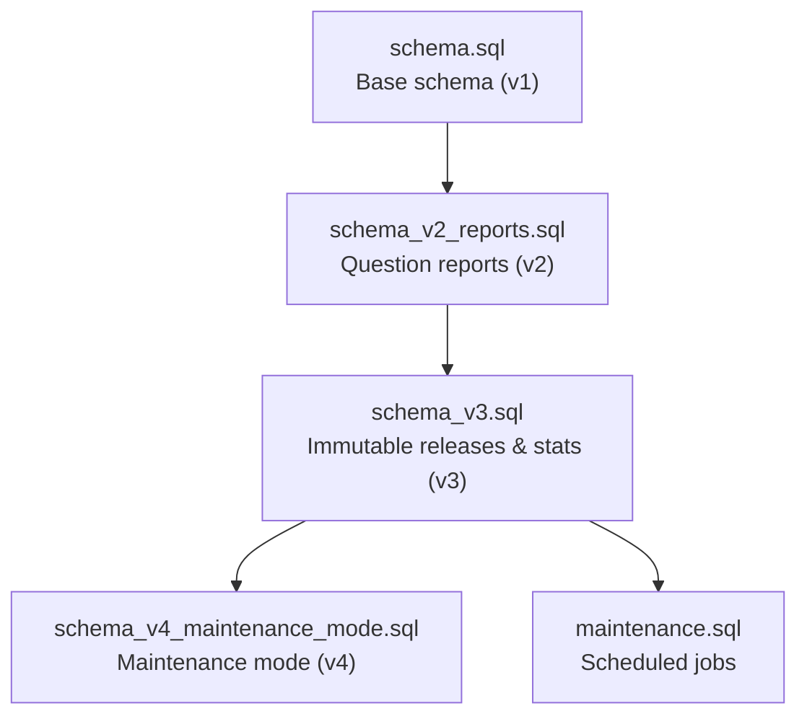
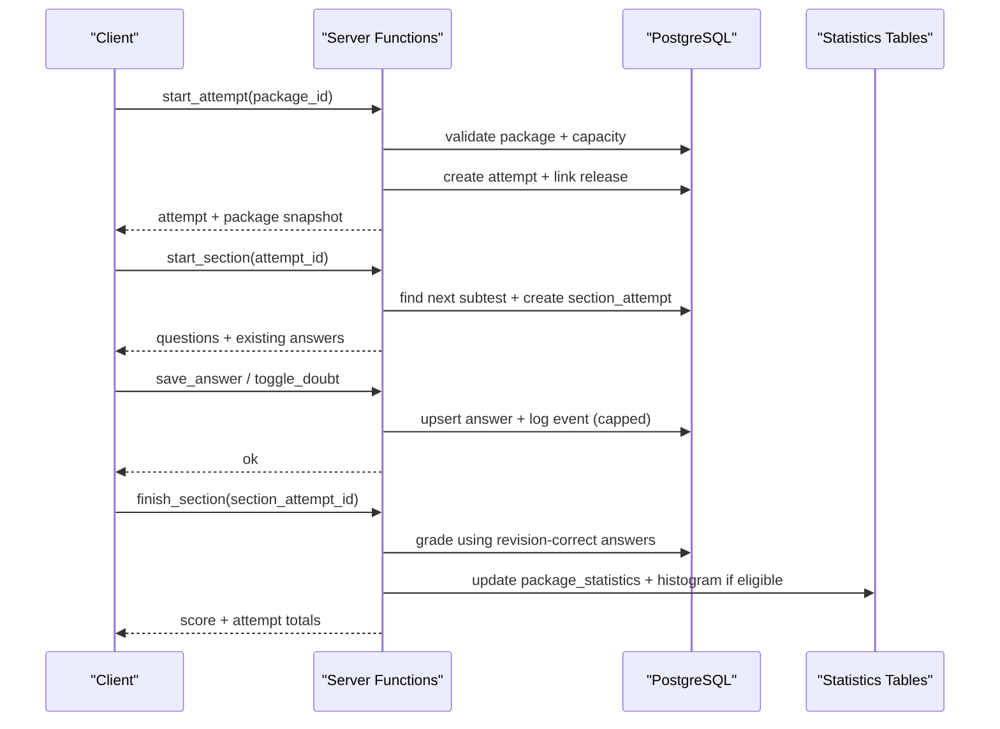
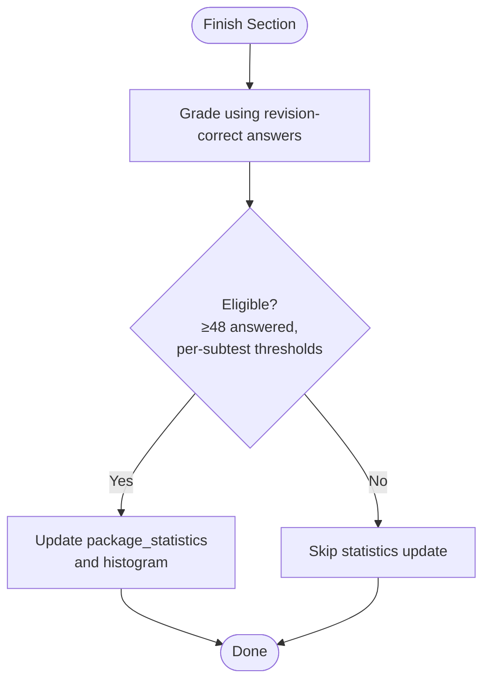
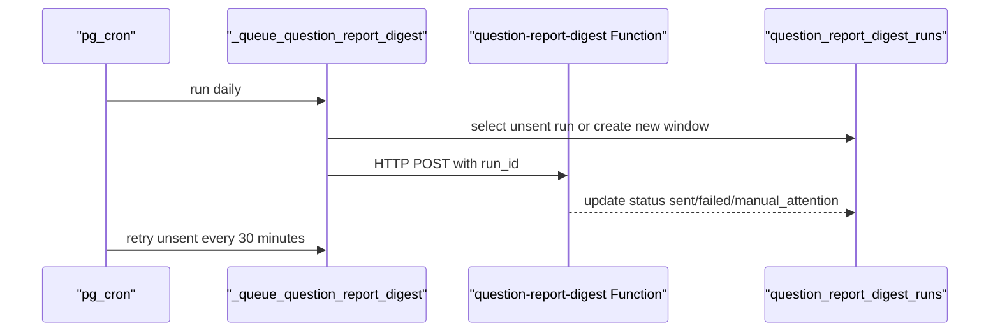
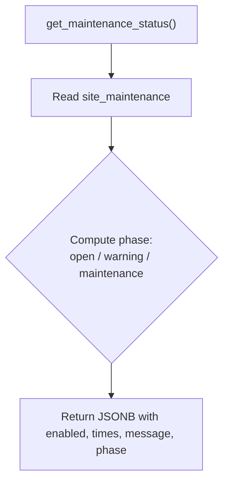
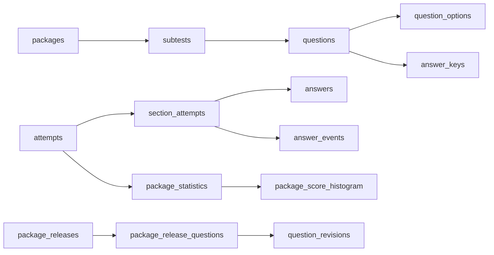

# Database Schema

<cite>
**Referenced Files in This Document**
- [schema.sql](file://supabase/schema.sql)
- [schema_v2_reports.sql](file://supabase/schema_v2_reports.sql)
- [schema_v3.sql](file://supabase/schema_v3.sql)
- [maintenance.sql](file://supabase/maintenance.sql)
- [backfill_v3_1_statistics.sql](file://supabase/backfill_v3_1_statistics.sql)
- [schema_v4_maintenance_mode.sql](file://supabase/schema_v4_maintenance_mode.sql)
</cite>

## Table of Contents
1. [Introduction](#introduction)
2. [Project Structure](#project-structure)
3. [Core Components](#core-components)
4. [Architecture Overview](#architecture-overview)
5. [Detailed Component Analysis](#detailed-component-analysis)
6. [Dependency Analysis](#dependency-analysis)
7. [Performance Considerations](#performance-considerations)
8. [Troubleshooting Guide](#troubleshooting-guide)
9. [Conclusion](#conclusion)
10. [Appendices](#appendices)

## Introduction
This document provides comprehensive database schema documentation for the TBS LPDP Try Out application. It covers all PostgreSQL tables used to manage packages, subtests, questions, options, answer keys, attempts, section attempts, answers, answer events, and service capacity. It also documents versioned migrations from v1 through v4, including immutable releases, statistics, report digests, and maintenance mode. The focus is on entity relationships, constraints, indexes, data types, business rules enforced by the schema, and performance-oriented indexing strategies.

## Project Structure
The database schema is defined across multiple migration files that are applied in a strict order:
- Base schema (v1): core entities, RLS policies, and RPCs
- Reports (v2): question feedback and reporting
- Immutable releases and statistics (v3): versioned content, package statistics, digest outbox
- Maintenance mode (v4): scheduled maintenance window configuration
- Operational maintenance jobs: pruning, capacity refresh, anonymous user cleanup, and digest scheduling



**Diagram sources**
- [schema.sql:1-12](file://supabase/schema.sql#L1-L12)
- [schema_v2_reports.sql:1-21](file://supabase/schema_v2_reports.sql#L1-L21)
- [schema_v3.sql:1-12](file://supabase/schema_v3.sql#L1-L12)
- [schema_v4_maintenance_mode.sql:1-11](file://supabase/schema_v4_maintenance_mode.sql#L1-L11)
- [maintenance.sql:1-16](file://supabase/maintenance.sql#L1-L16)

**Section sources**
- [schema.sql:1-12](file://supabase/schema.sql#L1-L12)
- [schema_v2_reports.sql:1-21](file://supabase/schema_v2_reports.sql#L1-L21)
- [schema_v3.sql:1-12](file://supabase/schema_v3.sql#L1-L12)
- [schema_v4_maintenance_mode.sql:1-11](file://supabase/schema_v4_maintenance_mode.sql#L1-L11)
- [maintenance.sql:1-16](file://supabase/maintenance.sql#L1-L16)

## Core Components
This section summarizes the primary tables and their roles:
- packages: published test packages with metadata
- subtests: sections within a package (verbal, quantitative, problem solving)
- questions: items belonging to a subtest
- question_options: multiple-choice options per question
- answer_keys: correct options and explanations (not client-readable)
- attempts: user attempts at a package
- section_attempts: per-subtest progress within an attempt
- answers: user selections and doubt flags per question in a section attempt
- answer_events: append-only event log per section attempt
- service_capacity: project storage/row limits and usage snapshot
- question_revisions: immutable versions of questions
- question_revision_options: options tied to a revision
- package_releases: immutable snapshots of a package’s content
- package_release_questions: mapping of release to questions and revisions
- package_statistics: aggregate metrics per package
- package_score_histogram: score distribution histogram per package
- package_statistics_backfill_runs: audit record for backfills
- question_report_digest_runs: outbox for daily report digest emails
- site_maintenance: operator-managed maintenance schedule

Key business rules enforced by constraints and functions:
- Subtests must be one of verbal, kuantitatif, pemecahan_masalah; unique position per package
- Questions have difficulty levels and unique number per subtest
- Options use single-letter keys A–E
- Answer keys restrict correct_option to A–E
- Attempts track status active/finished with timestamps and total score
- Section attempts enforce deadlines and status transitions
- Answers store selected option and doubt flag; updated_at tracks edits
- Answer events cap per section attempt to prevent unbounded growth
- Service capacity enforces global storage and row limits before creating new attempts
- v3 introduces immutable releases and revisions; grading uses revision-correct answers
- Statistics update only when eligibility thresholds are met
- Reports are gated behind finished sections and limited by rolling-hour budgets
- Maintenance mode exposes a safe read-only status function

**Section sources**
- [schema.sql:16-129](file://supabase/schema.sql#L16-L129)
- [schema.sql:131-181](file://supabase/schema.sql#L131-L181)
- [schema.sql:186-337](file://supabase/schema.sql#L186-L337)
- [schema.sql:341-657](file://supabase/schema.sql#L341-L657)
- [schema_v2_reports.sql:27-49](file://supabase/schema_v2_reports.sql#L27-L49)
- [schema_v2_reports.sql:90-175](file://supabase/schema_v2_reports.sql#L90-L175)
- [schema_v3.sql:58-166](file://supabase/schema_v3.sql#L58-L166)
- [schema_v3.sql:187-236](file://supabase/schema_v3.sql#L187-L236)
- [schema_v3.sql:267-288](file://supabase/schema_v3.sql#L267-L288)
- [schema_v3.sql:610-705](file://supabase/schema_v3.sql#L610-L705)
- [schema_v3.sql:709-757](file://supabase/schema_v3.sql#L709-L757)
- [schema_v4_maintenance_mode.sql:15-30](file://supabase/schema_v4_maintenance_mode.sql#L15-L30)

## Architecture Overview
The database architecture centers around immutable content releases and secure, RPC-gated mutations. Clients interact exclusively via server-side functions that enforce ownership, deadlines, and capacity limits. Data flows from content publishing into immutable releases, then into attempts and section attempts, with answers and events recorded during sessions. Grading updates statistics and histograms when eligibility criteria are satisfied.



**Diagram sources**
- [schema.sql:341-389](file://supabase/schema.sql#L341-L389)
- [schema.sql:417-493](file://supabase/schema.sql#L417-L493)
- [schema.sql:495-580](file://supabase/schema.sql#L495-L580)
- [schema_v3.sql:610-705](file://supabase/schema_v3.sql#L610-L705)
- [schema_v3.sql:709-757](file://supabase/schema_v3.sql#L709-L757)

## Detailed Component Analysis

### Core Entities and Relationships
The following diagram maps the core tables and their relationships, including foreign keys and key constraints.

```mermaid
erDiagram
PACKAGES {
integer id PK
text title
text description
boolean is_published
timestamptz created_at
}
SUBTESTS {
text id PK
integer package_id FK
text key
text name
integer position
integer question_count
integer duration_seconds
integer passing_grade
}
QUESTIONS {
text id PK
text subtest_id FK
integer number
text qtype
text question_text
text passage
text image_url
text difficulty
}
QUESTION_OPTIONS {
text question_id FK
char(1) key
text text
}
ANSWER_KEYS {
text question_id PK FK
char(1) correct_option
jsonb explanations
}
ATTEMPTS {
uuid id PK
uuid user_id FK
integer package_id FK
text status
timestamptz started_at
timestamptz finished_at
integer total_score
}
SECTION_ATTEMPTS {
uuid id PK
uuid attempt_id FK
text subtest_id FK
text status
timestamptz started_at
timestamptz deadline_at
timestamptz finished_at
integer score
}
ANSWERS {
uuid section_attempt_id FK
text question_id FK
char(1) selected_option
boolean is_doubtful
timestamptz updated_at
}
ANSWER_EVENTS {
bigint id PK
uuid section_attempt_id FK
text question_id
text event_type
jsonb payload
timestamptz created_at
}
SERVICE_CAPACITY {
boolean id PK
bigint db_bytes
bigint attempt_rows
bigint limit_bytes
bigint limit_attempt_rows
timestamptz measured_at
}
PACKAGES ||--o{ SUBTESTS : "has many"
SUBTESTS ||--o{ QUESTIONS : "contains"
QUESTIONS ||--o{ QUESTION_OPTIONS : "has options"
QUESTIONS ||--|| ANSWER_KEYS : "has key"
ATTEMPTS ||--o{ SECTION_ATTEMPTS : "has sections"
SECTION_ATTEMPTS ||--o{ ANSWERS : "records answers"
SECTION_ATTEMPTS ||--o{ ANSWER_EVENTS : "logs events"
```

**Diagram sources**
- [schema.sql:16-129](file://supabase/schema.sql#L16-L129)

**Section sources**
- [schema.sql:16-129](file://supabase/schema.sql#L16-L129)

### Versioned Releases and Revisions (v3)
Versioning ensures immutability of released content and enables accurate historical grading and statistics.

```mermaid
classDiagram
class PackageReleases {
uuid id PK
integer package_id FK
integer version
text title
text description
text difficulty
text ai_model
text ai_company
text ai_model_description
text content_hash
timestamptz published_at
}
class QuestionRevisions {
uuid id PK
text question_id FK
integer version
text qtype
text question_text
text passage
text image_url
text image_sha256
text difficulty
char(1) correct_option
jsonb explanations
text content_hash
timestamptz published_at
}
class QuestionRevisionOptions {
uuid question_revision_id FK
char(1) key
text text
}
class PackageReleaseQuestions {
uuid package_release_id FK
integer package_id FK
text question_id FK
uuid question_revision_id FK
text subtest_id FK
integer number
}
PackageReleases ||--o{ PackageReleaseQuestions : "maps to questions"
QuestionRevisions ||--o{ QuestionRevisionOptions : "has options"
PackageReleaseQuestions }o--|| QuestionRevisions : "links revision"
```

**Diagram sources**
- [schema_v3.sql:58-166](file://supabase/schema_v3.sql#L58-L166)

**Section sources**
- [schema_v3.sql:58-166](file://supabase/schema_v3.sql#L58-L166)

### Statistics and Histograms (v3)
Statistics capture aggregate metrics and score distributions, with eligibility checks ensuring data quality.



**Diagram sources**
- [schema_v3.sql:610-705](file://supabase/schema_v3.sql#L610-L705)

**Section sources**
- [schema_v3.sql:187-236](file://supabase/schema_v3.sql#L187-L236)
- [schema_v3.sql:610-705](file://supabase/schema_v3.sql#L610-L705)

### Report Digest Outbox (v3)
Daily digest runs are queued and retried, with manual attention handling and uniqueness constraints to avoid gaps.



**Diagram sources**
- [maintenance.sql:87-152](file://supabase/maintenance.sql#L87-L152)
- [schema_v3.sql:267-288](file://supabase/schema_v3.sql#L267-L288)

**Section sources**
- [maintenance.sql:87-152](file://supabase/maintenance.sql#L87-L152)
- [schema_v3.sql:267-288](file://supabase/schema_v3.sql#L267-L288)

### Maintenance Mode (v4)
A singleton table stores scheduled maintenance windows and exposes a read-only status function.



**Diagram sources**
- [schema_v4_maintenance_mode.sql:15-63](file://supabase/schema_v4_maintenance_mode.sql#L15-L63)

**Section sources**
- [schema_v4_maintenance_mode.sql:15-63](file://supabase/schema_v4_maintenance_mode.sql#L15-L63)

## Dependency Analysis
The schema defines clear dependency chains:
- packages → subtests → questions → question_options
- questions → answer_keys
- attempts → section_attempts → answers, answer_events
- v3 adds package_releases → package_release_questions → question_revisions
- Statistics depend on completed attempts and eligibility thresholds
- Maintenance jobs depend on schema objects and operate on them safely



**Diagram sources**
- [schema.sql:16-129](file://supabase/schema.sql#L16-L129)
- [schema_v3.sql:58-166](file://supabase/schema_v3.sql#L58-L166)
- [schema_v3.sql:187-236](file://supabase/schema_v3.sql#L187-L236)

**Section sources**
- [schema.sql:16-129](file://supabase/schema.sql#L16-L129)
- [schema_v3.sql:58-166](file://supabase/schema_v3.sql#L58-L166)
- [schema_v3.sql:187-236](file://supabase/schema_v3.sql#L187-L236)

## Performance Considerations
Indexing strategy and query patterns are designed to keep operations efficient under load:
- attempts_user_idx: supports listing recent attempts per user
- answer_events_section_idx: optimizes event retrieval per section attempt
- question_revisions_hash_idx: enables fast deduplication and change detection
- package_releases_hash_idx: supports release integrity checks
- package_release_questions_subtest_idx: accelerates loading questions by subtest within a release
- question_reports indices: support triage and write budget enforcement
- Unique constraints: ensure data integrity and prevent duplicates (e.g., per-package subtest position, per-question option, per-user per-question report)
- Capacity checks: _capacity() uses pg_database_size and planner estimates for O(1)-like behavior
- Event logging cap: prevents unbounded growth of answer_events per section attempt
- Retention jobs: prune-attempts and prune-anonymous-users reduce long-term storage pressure

Recommended query patterns:
- Use RPCs rather than direct table writes to leverage built-in validations and indexes
- Filter by user_id and timestamps for attempts and reports
- Leverage unique constraints for idempotent upserts
- Avoid full-table scans on large tables; rely on indexes and scoped queries

**Section sources**
- [schema.sql:73-106](file://supabase/schema.sql#L73-L106)
- [schema_v2_reports.sql:45-49](file://supabase/schema_v2_reports.sql#L45-L49)
- [schema_v3.sql:75-102](file://supabase/schema_v3.sql#L75-L102)
- [schema_v3.sql:165-166](file://supabase/schema_v3.sql#L165-L166)
- [schema_v3.sql:267-288](file://supabase/schema_v3.sql#L267-L288)
- [maintenance.sql:31-73](file://supabase/maintenance.sql#L31-L73)

## Troubleshooting Guide
Common issues and resolutions:
- Storage capacity reached: occurs when db_bytes or attempt_rows exceed limits; wait for retention jobs or adjust limits
- Too many attempts/reports: per-user hourly budgets enforced by RPCs; reduce frequency or wait for window reset
- Section deadline passed: auto-grade triggers when deadline exceeded; review section status and scores
- Not authenticated: ensure valid session; RPCs require auth.uid()
- Question not in this section: verify subtest membership before saving answers
- Unknown report reason/comment too long: validate inputs against allowed values and length constraints
- Maintenance mode active: frontend may show warning or maintenance banner based on get_maintenance_status()

Operational checks:
- Inspect cron jobs and last run details
- Monitor database size and relation sizes
- Verify capacity snapshot freshness

**Section sources**
- [schema.sql:341-389](file://supabase/schema.sql#L341-L389)
- [schema.sql:417-493](file://supabase/schema.sql#L417-L493)
- [schema.sql:495-580](file://supabase/schema.sql#L495-L580)
- [schema_v2_reports.sql:90-175](file://supabase/schema_v2_reports.sql#L90-L175)
- [maintenance.sql:154-166](file://supabase/maintenance.sql#L154-L166)

## Conclusion
The TBS LPDP Try Out database schema implements a robust, versioned, and secure architecture for managing test content, user attempts, and analytics. Through immutable releases, strict constraints, and RPC-gated mutations, it enforces data integrity and operational safety. Indexing and retention strategies maintain performance under scale, while maintenance mode and capacity guards protect availability. The migration path from v1 to v4 provides backward compatibility and clear evolution toward immutable content and reliable statistics.

## Appendices

### Migration History and Compatibility
- v1 (schema.sql): Base tables, RLS policies, core RPCs, capacity guard
- v2 (schema_v2_reports.sql): Question reports, reporting RPCs, review enhancement
- v3 (schema_v3.sql): Immutable releases and revisions, statistics, histogram, digest outbox, grading updates
- v4 (schema_v4_maintenance_mode.sql): Scheduled maintenance window configuration
- Operational (maintenance.sql): Pruning, capacity refresh, anonymous user cleanup, digest scheduling
- Backfill (backfill_v3_1_statistics.sql): One-time recovery of qualified mean/median from retained attempts

Compatibility considerations:
- Apply in order: v1 → v2 → v3 → v4; maintenance.sql last
- Re-applying earlier schemas requires re-applying later ones to restore final RPC definitions and grants
- Backfill functions are idempotent and safe to run after schema upgrades

**Section sources**
- [schema.sql:1-12](file://supabase/schema.sql#L1-L12)
- [schema_v2_reports.sql:1-21](file://supabase/schema_v2_reports.sql#L1-L21)
- [schema_v3.sql:1-12](file://supabase/schema_v3.sql#L1-L12)
- [schema_v4_maintenance_mode.sql:1-11](file://supabase/schema_v4_maintenance_mode.sql#L1-L11)
- [maintenance.sql:1-16](file://supabase/maintenance.sql#L1-L16)
- [backfill_v3_1_statistics.sql:1-25](file://supabase/backfill_v3_1_statistics.sql#L1-L25)