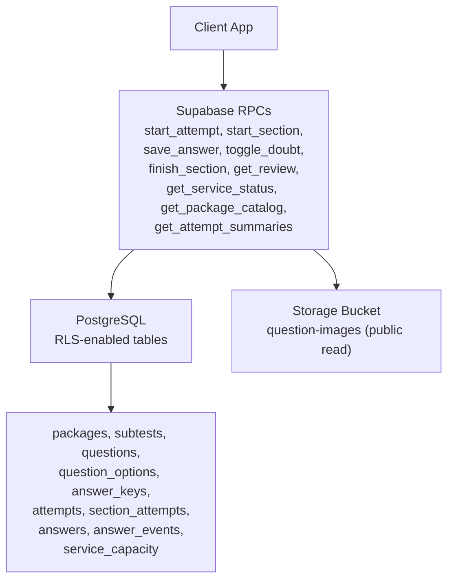
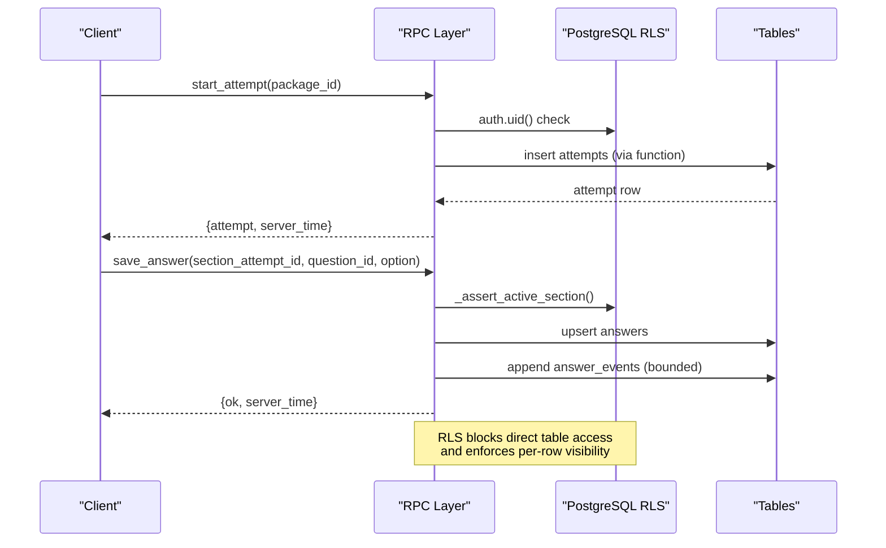
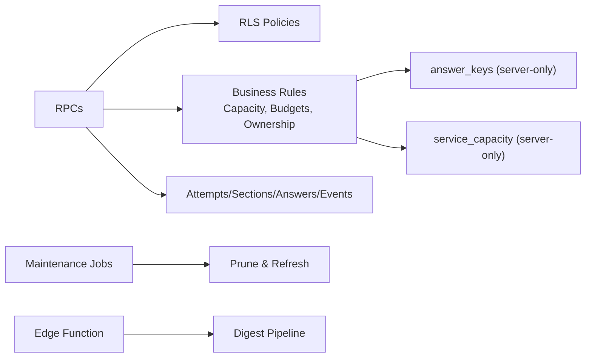

# Row Level Security Policies

<cite>
**Referenced Files in This Document**
- [schema.sql](file://supabase/schema.sql)
- [schema_v2_reports.sql](file://supabase/schema_v2_reports.sql)
- [schema_v3.sql](file://supabase/schema_v3.sql)
- [maintenance.sql](file://supabase/maintenance.sql)
- [index.ts](file://supabase/functions/question-report-digest/index.ts)
</cite>

## Table of Contents
1. [Introduction](#introduction)
2. [Project Structure](#project-structure)
3. [Core Components](#core-components)
4. [Architecture Overview](#architecture-overview)
5. [Detailed Component Analysis](#detailed-component-analysis)
6. [Dependency Analysis](#dependency-analysis)
7. [Performance Considerations](#performance-considerations)
8. [Troubleshooting Guide](#troubleshooting-guide)
9. [Conclusion](#conclusion)

## Introduction
This document explains the Row Level Security (RLS) policies and security model implemented for the TBS LPDP Try Out application. It focuses on how sensitive data is protected from direct client access, how users can only interact with their own attempt-related data, and how all mutations are forced through server-side RPC functions. The documentation covers protection for answer_keys and service_capacity tables, and details the security posture for packages, subtests, attempts, section_attempts, answers, and answer_events.

## Project Structure
The RLS and security model are defined primarily in the Supabase SQL schema files and enforced by PostgreSQL policies and stored procedures:
- Base schema defines tables, enables RLS, and sets read-only policies for safe public content and user-scoped data.
- Versioned schemas add reporting, immutable releases, statistics, and additional RPCs while preserving the same security boundaries.
- Maintenance scripts schedule background jobs to prune old data and keep capacity metrics warm.
- An Edge Function orchestrates operator notifications without exposing internal tables to clients.

**Diagram sources**
- [schema.sql:133-142](file://supabase/schema.sql#L133-L142)
- [schema.sql:670-672](file://supabase/schema.sql#L670-L672)
- [schema.sql:341-657](file://supabase/schema.sql#L341-L657)
- [schema_v3.sql:574-606](file://supabase/schema_v3.sql#L574-L606)

**Section sources**
- [schema.sql:1-12](file://supabase/schema.sql#L1-L12)
- [schema.sql:133-181](file://supabase/schema.sql#L133-L181)
- [schema.sql:676-688](file://supabase/schema.sql#L676-L688)

## Core Components
- RLS-enabled tables: All core tables have RLS enabled; some intentionally have no client-facing policies to prevent direct reads or writes.
- Read policies:
  - Packages and subtests: authenticated users can read published content.
  - Attempts, section_attempts, answers, answer_events: users can read only rows tied to their own user_id via joins to attempts.
- Write controls:
  - No write policies exist for these tables; all mutations must go through RPCs that enforce ownership, validation, and business rules.
- Sensitive tables:
  - answer_keys: RLS enabled but no client policy; only accessible via server-side RPCs (e.g., grading and review).
  - service_capacity: RLS enabled but no client policy; accessed via get_service_status() which returns a safe usage percentage.

Security outcomes:
- Clients cannot directly query answer_keys or service_capacity.
- Clients cannot insert/update/delete attempts, section_attempts, answers, or answer_events directly.
- Users can only see their own attempt data; cross-user visibility is blocked by RLS predicates.

**Section sources**
- [schema.sql:133-181](file://supabase/schema.sql#L133-L181)
- [schema.sql:341-657](file://supabase/schema.sql#L341-L657)
- [schema.sql:676-688](file://supabase/schema.sql#L676-L688)

## Architecture Overview
The security architecture enforces a strict boundary between client and database:
- All client requests call RPCs, not direct table operations.
- RPCs validate authentication, ownership, and business constraints before performing any writes.
- RLS ensures that even if a client bypasses the app layer, it cannot read or modify unauthorized rows.

**Diagram sources**
- [schema.sql:341-389](file://supabase/schema.sql#L341-L389)
- [schema.sql:495-521](file://supabase/schema.sql#L495-L521)
- [schema.sql:159-181](file://supabase/schema.sql#L159-L181)

## Detailed Component Analysis

### Protection of Sensitive Data: answer_keys and service_capacity
- answer_keys:
  - RLS enabled with no client policy; clients cannot select this table directly.
  - Accessible only via server-side logic used by grading and review RPCs, ensuring correct_option and explanations are exposed only to finished sections of the caller’s own attempt.
- service_capacity:
  - RLS enabled with no client policy; clients cannot select this table directly.
  - Exposed via get_service_status(), which computes a safe usage percentage and flags whether new attempts are accepted.

Security rationale:
- Prevents answer leakage and operational metadata exposure.
- Ensures clients receive only necessary, sanitized information.

**Section sources**
- [schema.sql:56-60](file://supabase/schema.sql#L56-L60)
- [schema.sql:119-129](file://supabase/schema.sql#L119-L129)
- [schema.sql:137-142](file://supabase/schema.sql#L137-L142)
- [schema.sql:395-415](file://supabase/schema.sql#L395-L415)
- [schema.sql:612-657](file://supabase/schema.sql#L612-L657)

### Packages and Subtests: Published Content Access
- packages:
  - Policy allows authenticated users to read only published packages (is_published = true).
- subtests:
  - Policy allows reading subtests whose parent package is published.

Outcome:
- Unpublished content remains hidden from clients.
- Only curated, released material is visible.

**Section sources**
- [schema.sql:148-155](file://supabase/schema.sql#L148-L155)

### Attempts, Section Attempts, Answers, Answer Events: User Isolation
- attempts:
  - Read policy restricts rows to those where user_id matches the current user.
- section_attempts:
  - Read policy requires existence of an attempt owned by the current user.
- answers:
  - Read policy requires existence of a section_attempt linked to an attempt owned by the current user.
- answer_events:
  - Read policy mirrors answers’ ownership constraint.

Outcome:
- Users can only view their own attempt lifecycle and interactions.
- Cross-user data isolation is enforced at the row level.

**Section sources**
- [schema.sql:159-181](file://supabase/schema.sql#L159-L181)

### Mutation Enforcement via RPCs
All writes to attempts, section_attempts, answers, and answer_events occur exclusively through RPCs:
- start_attempt: validates authentication, checks published package, enforces storage capacity and per-user hourly budget, then inserts an attempt.
- start_section: validates ownership, sweeps expired sections, creates or resumes section attempts, logs events.
- save_answer: asserts active section ownership, validates question membership, upserts answers, logs bounded events.
- toggle_doubt: asserts active section ownership, updates doubt flag, logs event.
- finish_section: verifies ownership, grades section, updates attempt status and totals when complete.
- get_review: returns only finished sections of the caller’s own attempt, including keys/explanations safely scoped.

These RPCs implement defense-in-depth:
- Authentication checks.
- Ownership verification via joins to attempts.
- Business rule enforcement (capacity limits, budgets).
- Bounded logging to prevent unbounded growth.

**Section sources**
- [schema.sql:341-389](file://supabase/schema.sql#L341-L389)
- [schema.sql:417-493](file://supabase/schema.sql#L417-L493)
- [schema.sql:495-521](file://supabase/schema.sql#L495-L521)
- [schema.sql:524-548](file://supabase/schema.sql#L524-L548)
- [schema.sql:551-580](file://supabase/schema.sql#L551-L580)
- [schema.sql:582-657](file://supabase/schema.sql#L582-L657)

### Reporting and Immutable Revisions: Additional Security Boundaries
- question_reports:
  - RLS enabled; read policy restricts to the reporter’s own reports.
  - Writes only via report_question() and delete_question_report(), which gate access based on finished sections and apply rolling-hour write budgets.
- Immutable revisions and package releases:
  - v3 introduces immutable versions for questions and packages, preventing in-place edits and ensuring historical integrity.
  - Statistics and histograms are updated through controlled paths during grading.

Outcome:
- Reports are private and tamper-resistant.
- Historical data remains stable and auditable.

**Section sources**
- [schema_v2_reports.sql:27-66](file://supabase/schema_v2_reports.sql#L27-L66)
- [schema_v2_reports.sql:90-176](file://supabase/schema_v2_reports.sql#L90-L176)
- [schema_v2_reports.sql:182-199](file://supabase/schema_v2_reports.sql#L182-L199)
- [schema_v3.sql:58-83](file://supabase/schema_v3.sql#L58-L83)
- [schema_v3.sql:85-102](file://supabase/schema_v3.sql#L85-L102)
- [schema_v3.sql:610-705](file://supabase/schema_v3.sql#L610-L705)

### Background Operations and Operational Security
- maintenance.sql schedules:
  - Pruning of old attempts (7 days).
  - Refreshing service capacity snapshots.
  - Pruning anonymous users while preserving reports.
  - Daily digest queueing and retries for question report emails.
- Edge Function (question-report-digest):
  - Validates automation key, claims a run, renders digest, sends email, and records completion/failure.

Outcome:
- Operational tasks do not expose sensitive data to clients.
- Digest pipeline is secured via secrets and authorization checks.

**Section sources**
- [maintenance.sql:31-73](file://supabase/maintenance.sql#L31-L73)
- [maintenance.sql:87-152](file://supabase/maintenance.sql#L87-L152)
- [index.ts:27-69](file://supabase/functions/question-report-digest/index.ts#L27-L69)
- [index.ts:71-117](file://supabase/functions/question-report-digest/index.ts#L71-L117)

## Dependency Analysis
The security model depends on layered relationships:
- RPCs depend on RLS policies to ensure row-level visibility.
- Grading and review logic depend on answer_keys and answers, but are encapsulated within server-side functions.
- Capacity management depends on service_capacity and helper functions to enforce global limits.
- Reporting depends on question_reports and immutable revisions to maintain auditability.

**Diagram sources**
- [schema.sql:133-181](file://supabase/schema.sql#L133-L181)
- [schema.sql:341-657](file://supabase/schema.sql#L341-L657)
- [maintenance.sql:31-73](file://supabase/maintenance.sql#L31-L73)
- [index.ts:27-69](file://supabase/functions/question-report-digest/index.ts#L27-L69)

**Section sources**
- [schema.sql:133-181](file://supabase/schema.sql#L133-L181)
- [schema.sql:341-657](file://supabase/schema.sql#L341-L657)
- [maintenance.sql:31-73](file://supabase/maintenance.sql#L31-L73)
- [index.ts:27-69](file://supabase/functions/question-report-digest/index.ts#L27-L69)

## Performance Considerations
- RLS predicates use indexed joins (e.g., attempts.user_id indexes) to minimize overhead.
- Event logging is capped per section to prevent unbounded growth and protect free-tier storage.
- Capacity checks leverage planner estimates rather than full scans to stay O(1).
- Scheduled jobs offload periodic work (pruning, capacity refresh) from request paths.

[No sources needed since this section provides general guidance]

## Troubleshooting Guide
Common issues and mitigations:
- “not authenticated”: Ensure the client is logged in; RPCs require a valid session.
- “package not found or unpublished”: Only published packages are allowed for new attempts.
- “storage capacity reached” / “too many attempts”: Global or per-user limits are enforced; wait or reduce frequency.
- “section already finished” / “section deadline passed”: Sections auto-grade past deadlines; finishing after deadline still works but reflects state at grade time.
- “invalid option” / “question not in this section”: Input validation prevents malformed writes.
- “question not available for reporting”: Reporting requires a finished section containing the question.

Operational tips:
- Check scheduled jobs and last runs to diagnose background task failures.
- Monitor database size and capacity metrics via get_service_status().
- Use admin/service-role access only for operational tasks; never expose to clients.

**Section sources**
- [schema.sql:341-389](file://supabase/schema.sql#L341-L389)
- [schema.sql:417-493](file://supabase/schema.sql#L417-L493)
- [schema.sql:495-521](file://supabase/schema.sql#L495-L521)
- [schema.sql:524-548](file://supabase/schema.sql#L524-L548)
- [schema.sql:551-580](file://supabase/schema.sql#L551-L580)
- [schema_v2_reports.sql:90-176](file://supabase/schema_v2_reports.sql#L90-L176)
- [maintenance.sql:154-166](file://supabase/maintenance.sql#L154-L166)

## Conclusion
The TBS LPDP Try Out application implements a robust security model centered on RLS and RPC-enforced mutations. Sensitive data such as answer_keys and service_capacity are shielded from direct client access, while users retain appropriate read access to published content and their own attempt data. All writes are validated and authorized server-side, preventing misuse and ensuring data integrity. Background operations further safeguard system stability and privacy. This design balances usability with strong security guarantees across roles and workflows.