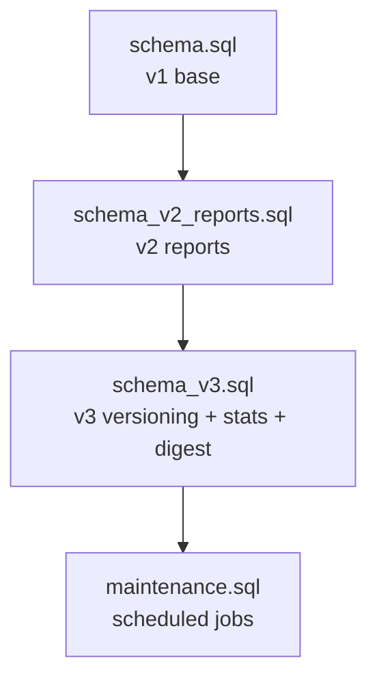
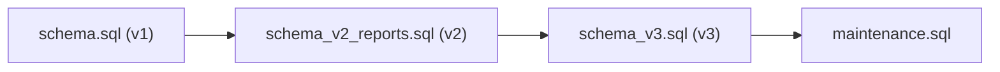

# Schema Migrations and Versioning

<cite>
**Referenced Files in This Document**
- [schema.sql](file://supabase/schema.sql)
- [schema_v2_reports.sql](file://supabase/schema_v2_reports.sql)
- [schema_v3.sql](file://supabase/schema_v3.sql)
- [maintenance.sql](file://supabase/maintenance.sql)
- [backfill_v3_1_statistics.sql](file://supabase/backfill_v3_1_statistics.sql)
- [TECHNICAL_REQUIREMENTS_V2.md](file://docs/TECHNICAL_REQUIREMENTS_V2.md)
- [TECHNICAL_REQUIREMENTS_V3.md](file://docs/TECHNICAL_REQUIREMENTS_V3.md)
</cite>

## Table of Contents
1. [Introduction](#introduction)
2. [Project Structure](#project-structure)
3. [Core Components](#core-components)
4. [Architecture Overview](#architecture-overview)
5. [Detailed Component Analysis](#detailed-component-analysis)
6. [Dependency Analysis](#dependency-analysis)
7. [Performance Considerations](#performance-considerations)
8. [Troubleshooting Guide](#troubleshooting-guide)
9. [Conclusion](#conclusion)
10. [Appendices](#appendices)

## Introduction
This document explains the database schema migration strategy and version management for the TBS LPDP Try Out application across v1, v2, and v3. It details how each version evolves the data model, introduces new features (question reporting, immutable versions, durable statistics, package metadata), and ensures backward compatibility through idempotent migrations and carefully ordered deployments. It also documents safe application of migrations, rollback considerations, and operational safeguards such as capacity guards and scheduled maintenance.

## Project Structure
The database layer is organized into sequential, idempotent SQL files that are applied in a strict order:
- Base schema (v1): core tables, RLS, RPCs, storage bucket, grants
- Reports extension (v2): question reporting table, RPCs, and review augmentation
- Versioned model (v3): immutable revisions/releases, durable statistics, digest outbox, catalog RPCs, and updated exam/report flows
- Maintenance: scheduled jobs for retention, capacity snapshots, and daily report digest



**Diagram sources**
- [schema.sql:1-12](file://supabase/schema.sql#L1-L12)
- [schema_v2_reports.sql:1-21](file://supabase/schema_v2_reports.sql#L1-L21)
- [schema_v3.sql:1-12](file://supabase/schema_v3.sql#L1-L12)
- [maintenance.sql:1-16](file://supabase/maintenance.sql#L1-L16)

**Section sources**
- [schema.sql:1-12](file://supabase/schema.sql#L1-L12)
- [schema_v2_reports.sql:1-21](file://supabase/schema_v2_reports.sql#L1-L21)
- [schema_v3.sql:1-12](file://supabase/schema_v3.sql#L1-L12)
- [maintenance.sql:1-16](file://supabase/maintenance.sql#L1-L16)

## Core Components
- v1 base schema defines the attempt flow, questions, answers, events, capacity guard, and RLS policies. It exposes RPCs to start attempts, sections, save answers, toggle doubt, finish sections, get state, and get review.
- v2 adds question reporting with secure RPCs, RLS isolation, content hashing, and an augmented review response that includes the reporter’s own report per question.
- v3 introduces immutable question revisions and package releases, pins attempts to a release, upgrades grading/review to use pinned revisions, adds durable package statistics, a package catalogue RPC, and a daily digest outbox for operator emails.

Key responsibilities by file:
- schema.sql: v1 foundation, RLS, RPCs, storage bucket, grants
- schema_v2_reports.sql: question_reports table, report/delete RPCs, review augmentation, grants
- schema_v3.sql: revision/release model, statistics, digest outbox, updated exam/report RPCs, backfill helpers
- maintenance.sql: cron jobs for retention, capacity refresh, anonymous user pruning, and daily digest queueing

**Section sources**
- [schema.sql:16-182](file://supabase/schema.sql#L16-L182)
- [schema_v2_reports.sql:27-67](file://supabase/schema_v2_reports.sql#L27-L67)
- [schema_v3.sql:58-166](file://supabase/schema_v3.sql#L58-L166)
- [maintenance.sql:18-73](file://supabase/maintenance.sql#L18-L73)

## Architecture Overview
The migration architecture enforces a strict apply order and idempotency to maintain backward compatibility and data integrity.

```mermaid
sequenceDiagram
participant Dev as "Developer"
participant DB as "Supabase Postgres"
participant Cron as "pg_cron"
participant Edge as "Edge Function"
Dev->>DB : Apply schema.sql (v1)
Dev->>DB : Apply schema_v2_reports.sql (v2)
Dev->>DB : Apply schema_v3.sql (v3)
Dev->>DB : Apply maintenance.sql (jobs)
Note over Dev,DB : Each file is idempotent; re-applying is safe.
Cron->>DB : Prune old attempts/users
Cron->>DB : Refresh capacity snapshot
Cron->>DB : Queue daily digest run
DB->>Edge : Invoke digest function with run_id
Edge-->>DB : Mark run sent or failed
```

**Diagram sources**
- [schema.sql:1-12](file://supabase/schema.sql#L1-L12)
- [schema_v2_reports.sql:1-21](file://supabase/schema_v2_reports.sql#L1-L21)
- [schema_v3.sql:1-12](file://supabase/schema_v3.sql#L1-L12)
- [maintenance.sql:18-152](file://supabase/maintenance.sql#L18-L152)

## Detailed Component Analysis

### v1 Base Schema (schema.sql)
- Tables: packages, subtests, questions, question_options, answer_keys, attempts, section_attempts, answers, answer_events, service_capacity
- RLS: read-only policies for published content and user-scoped attempt data; no client access to answer_keys
- RPCs: start_attempt, start_section, save_answer, toggle_doubt, finish_section, get_attempt_state, get_review, get_service_status
- Capacity guard: measures database size and attempt rows; blocks new attempts when limits are reached
- Storage: public bucket for question images

Idempotency notes:
- Uses create if not exists, drop policy before create, revoke/grant blocks designed to be reapplied safely
- Reapplying this file replaces RPC definitions and revokes grants; subsequent v2/v3 must be reapplied after

**Section sources**
- [schema.sql:16-182](file://supabase/schema.sql#L16-L182)
- [schema.sql:185-337](file://supabase/schema.sql#L185-L337)
- [schema.sql:339-692](file://supabase/schema.sql#L339-L692)

### v2 Reports Extension (schema_v2_reports.sql)
- New table: question_reports with reason, comment, selected_option, content_hash, status, timestamps
- RLS: select-own only; no write policies; all writes via RPCs
- Helper: _question_content_hash() computes md5 of visible question content (no key material)
- RPCs: report_question (upsert on user+question, rate-limited), delete_question_report (idempotent)
- Review augmentation: get_review returns my_report per question scoped to the caller

Backward compatibility:
- Additive changes; existing v1 clients continue working
- Reapplying schema.sql removes my_report; reapply schema_v2_reports.sql afterward

Data transformations:
- Content hash enables detecting whether a reported question changed since filing
- Rate limiting prevents abuse while allowing genuine feedback

**Section sources**
- [schema_v2_reports.sql:27-67](file://supabase/schema_v2_reports.sql#L27-L67)
- [schema_v2_reports.sql:68-83](file://supabase/schema_v2_reports.sql#L68-L83)
- [schema_v2_reports.sql:90-176](file://supabase/schema_v2_reports.sql#L90-L176)
- [schema_v2_reports.sql:178-200](file://supabase/schema_v2_reports.sql#L178-L200)
- [schema_v2_reports.sql:202-261](file://supabase/schema_v2_reports.sql#L202-L261)
- [schema_v2_reports.sql:263-278](file://supabase/schema_v2_reports.sql#L263-L278)

### v3 Versioned Model and Statistics (schema_v3.sql)
New structures:
- question_revisions and question_revision_options: immutable full content, keys, explanations, version, hashes
- package_releases and package_release_questions: immutable set of 60 question revisions plus package metadata
- package_statistics and package_score_histogram: durable aggregates independent of attempt retention
- question_report_digest_runs: outbox for daily operator email delivery
- Added columns: attempts.package_release_id, answers.question_revision_id, question_reports.question_revision_id, packages.current_release_id

Version pinning and exam flow:
- start_attempt pins to current release; resume keeps original release
- start_section/save_answer/toggle_doubt validate against pinned release mappings
- _grade_section grades using pinned revision keys; updates statistics exactly once on completion
- get_review reads from pinned revisions; returns version metadata and revision-specific report

Statistics and backfill:
- Increment started/completed counts and score sums transactionally
- Eligibility rules ensure qualified mean/median computation
- backfill_v3_1_retained_statistics(): one-time, guarded backfill for pre-boundary retained attempts

Digest outbox:
- _queue_question_report_digest() creates/fetches unsent runs and invokes Edge Function via pg_net
- Idempotent delivery with provider idempotency window; manual attention after timeout

Idempotency and safety:
- create if not exists, alter add column if not exists, drop trigger/constraint before recreate
- Immutability triggers reject updates/deletes on revision/release tables
- Backfill uses advisory locks, consistent snapshots, invariant checks, and audit markers

**Section sources**
- [schema_v3.sql:18-103](file://supabase/schema_v3.sql#L18-L103)
- [schema_v3.sql:104-184](file://supabase/schema_v3.sql#L104-L184)
- [schema_v3.sql:185-264](file://supabase/schema_v3.sql#L185-L264)
- [schema_v3.sql:265-301](file://supabase/schema_v3.sql#L265-L301)
- [schema_v3.sql:303-531](file://supabase/schema_v3.sql#L303-L531)
- [schema_v3.sql:537-606](file://supabase/schema_v3.sql#L537-L606)
- [schema_v3.sql:608-705](file://supabase/schema_v3.sql#L608-L705)
- [schema_v3.sql:707-800](file://supabase/schema_v3.sql#L707-L800)

### Maintenance and Scheduling (maintenance.sql)
- Retention: prune attempts older than 7 days (cascades to sections/answers/events); preserves reports
- Capacity refresh: warm-up job for _refresh_capacity() every 5 minutes
- Anonymous users: prune inactive anonymous auth.users older than 60 days unless they have reports
- Daily digest: schedule daily queue at 01:00 UTC and retry every 30 minutes; requires Vault secrets and deployed Edge Function

Operational notes:
- Fully idempotent; cron.schedule() replaces jobs with same name
- Must be applied last; reapply when job definitions change

**Section sources**
- [maintenance.sql:18-73](file://supabase/maintenance.sql#L18-L73)
- [maintenance.sql:75-152](file://supabase/maintenance.sql#L75-L152)

## Dependency Analysis
Migration dependencies and ordering:
- schema.sql must be applied first to establish base tables, RLS, RPCs, and grants
- schema_v2_reports.sql depends on v1; it augments get_review and adds reporting capabilities
- schema_v3.sql depends on v1 and v2; it owns final RPC definitions and grants, and must be reapplied after any re-run of earlier files
- maintenance.sql depends on all schema files; schedules jobs and integrates with v3 digest outbox



**Diagram sources**
- [schema.sql:1-12](file://supabase/schema.sql#L1-L12)
- [schema_v2_reports.sql:1-21](file://supabase/schema_v2_reports.sql#L1-L21)
- [schema_v3.sql:1-12](file://supabase/schema_v3.sql#L1-L12)
- [maintenance.sql:1-16](file://supabase/maintenance.sql#L1-L16)

**Section sources**
- [schema.sql:1-12](file://supabase/schema.sql#L1-L12)
- [schema_v2_reports.sql:1-21](file://supabase/schema_v2_reports.sql#L1-L21)
- [schema_v3.sql:1-12](file://supabase/schema_v3.sql#L1-L12)
- [maintenance.sql:1-16](file://supabase/maintenance.sql#L1-L16)

## Performance Considerations
- Capacity guard: prevents new attempts when database or row limits approach thresholds; protects ongoing exams from corruption
- Event log cap: answer_events capped per section to bound storage growth
- Statistics: O(1) increments on completion; histogram updates only for eligible attempts; avoids scanning historical attempts
- Digest outbox: bounded detail rows; summarizes excess to keep edge function runtime within limits
- Indexes: targeted indexes on reports, events, and revision/release membership support triage and query performance

[No sources needed since this section provides general guidance]

## Troubleshooting Guide
Common issues and resolutions:
- Reapplying schema.sql revokes grants and replaces RPCs; always reapply schema_v2_reports.sql and schema_v3.sql afterward
- Digest failures: check question_report_digest_runs status; if manual_attention, verify Resend idempotency window and provider logs
- Capacity reached: adjust limit_bytes or limit_attempt_rows via service_capacity; monitor usage_percent via get_service_status
- Report gating errors: ensure section is finished; verify rate limits and input validation codes
- Backfill aborts: ensure retained attempts match durable totals; check histogram/statistics invariants before running backfill

Operational queries:
- Inspect cron jobs and run details
- Monitor database size and relation sizes
- Check digest runs and last errors

**Section sources**
- [schema.sql:674-692](file://supabase/schema.sql#L674-L692)
- [schema_v2_reports.sql:263-278](file://supabase/schema_v2_reports.sql#L263-L278)
- [schema_v3.sql:265-301](file://supabase/schema_v3.sql#L265-L301)
- [maintenance.sql:154-166](file://supabase/maintenance.sql#L154-L166)

## Conclusion
The TBS LPDP Try Out database evolution from v1 to v3 introduces robust versioning, durable statistics, and operator workflows while preserving backward compatibility through idempotent migrations and strict deployment order. The strategy ensures data integrity, performance, and operational safety, with clear guidance for applying migrations, handling rollbacks, and maintaining production stability.

[No sources needed since this section summarizes without analyzing specific files]

## Appendices

### Migration Application Order and Safety
- Fresh project: schema.sql → schema_v2_reports.sql → schema_v3.sql → package pushes → Edge Function/secrets/Vault → maintenance.sql
- Live upgrade: backup database, apply v3 while publishing paused, seed metadata, backfill statistics, deploy frontend changes last, apply maintenance.sql last
- Reapplying schema.sql requires reapplying v2 and v3 to restore RPCs and grants

**Section sources**
- [schema.sql:1-12](file://supabase/schema.sql#L1-L12)
- [schema_v2_reports.sql:1-21](file://supabase/schema_v2_reports.sql#L1-L21)
- [schema_v3.sql:1-12](file://supabase/schema_v3.sql#L1-L12)
- [maintenance.sql:1-16](file://supabase/maintenance.sql#L1-L16)

### Data Transformations and Compatibility
- v2 content_hash detects question changes since reporting; supports triage without exposing keys
- v3 revision pinning ensures old attempts remain stable even after content updates
- v3 statistics are deletion-safe; retention does not decrement durable counters
- Backfill recovers qualified mean/median from retained pre-boundary attempts with invariant checks

**Section sources**
- [schema_v2_reports.sql:68-83](file://supabase/schema_v2_reports.sql#L68-L83)
- [schema_v3.sql:104-184](file://supabase/schema_v3.sql#L104-L184)
- [schema_v3.sql:185-264](file://supabase/schema_v3.sql#L185-L264)
- [backfill_v3_1_statistics.sql:1-25](file://supabase/backfill_v3_1_statistics.sql#L1-L25)

### Rollback Guidance
- No explicit rollback scripts exist; rely on backups and point-in-time recovery
- If a migration fails mid-transaction, Postgres rolls back automatically
- For partial applications, restore from backup and reapply in correct order
- Avoid reapplying schema.sql without subsequent v2/v3 to prevent grant/RPC mismatches

[No sources needed since this section provides general guidance]