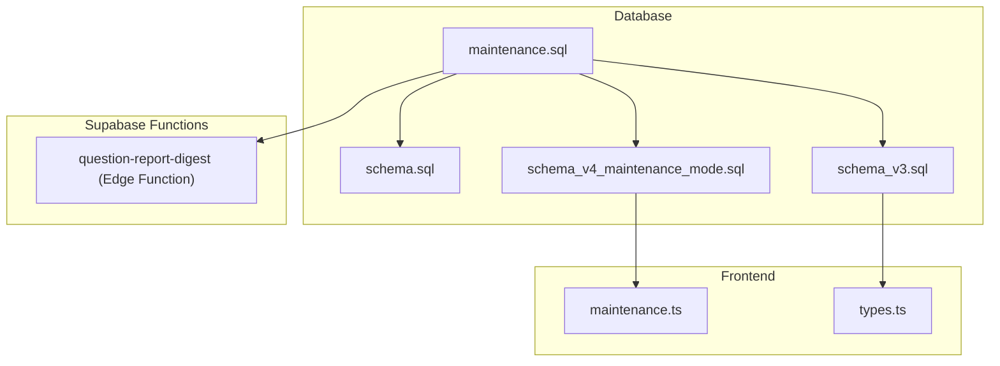
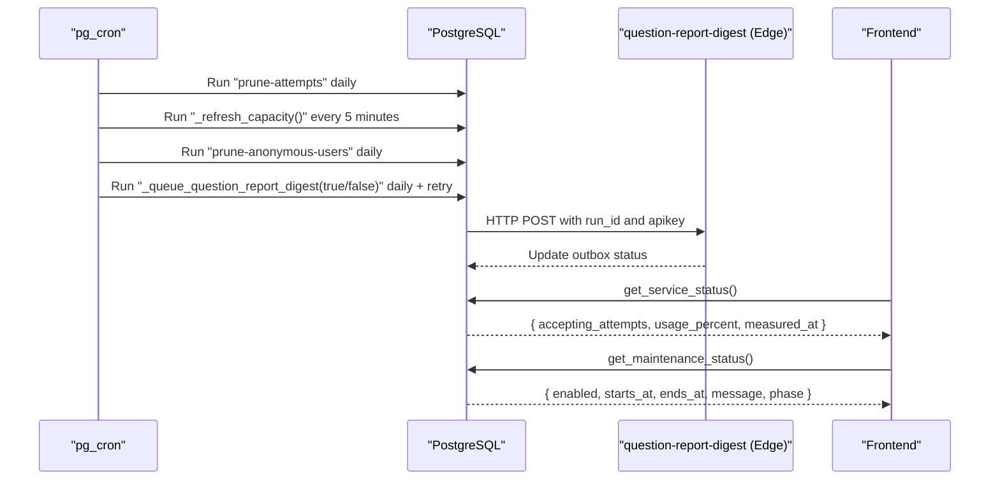
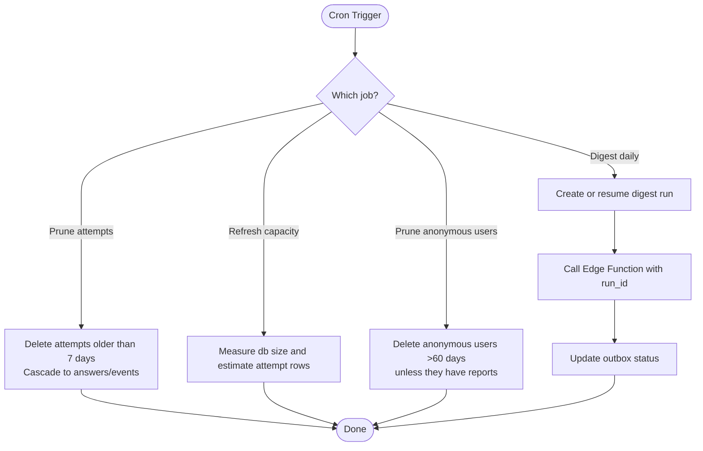
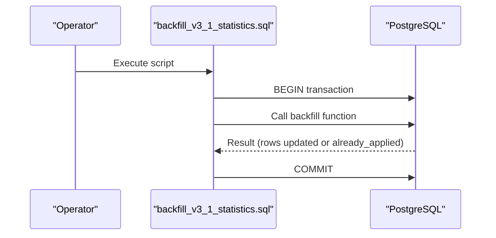
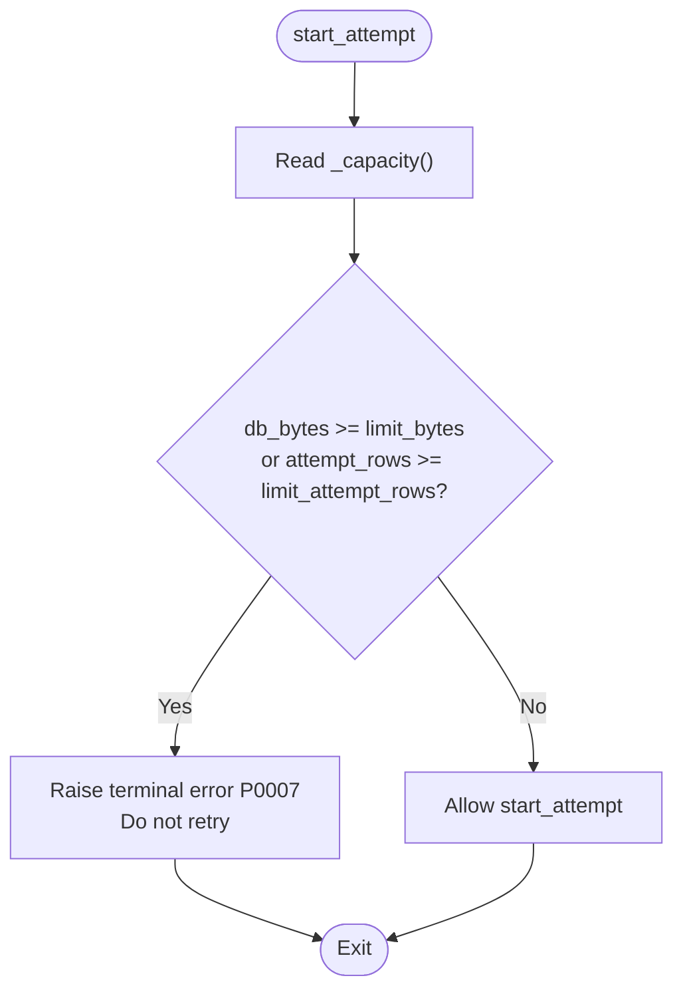
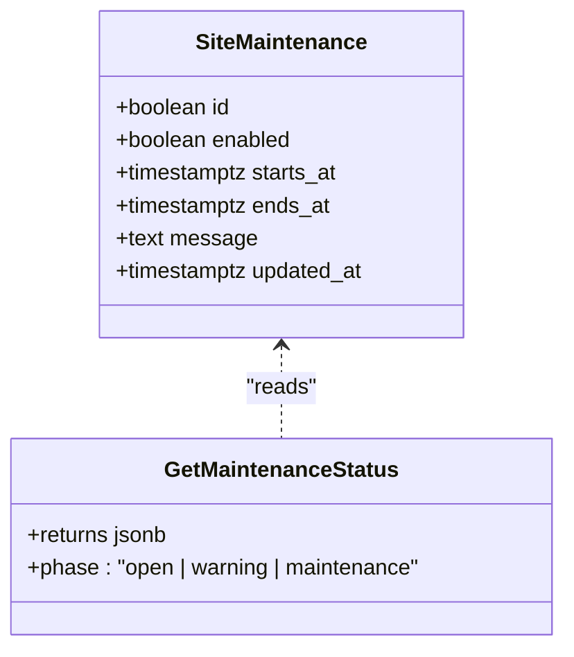
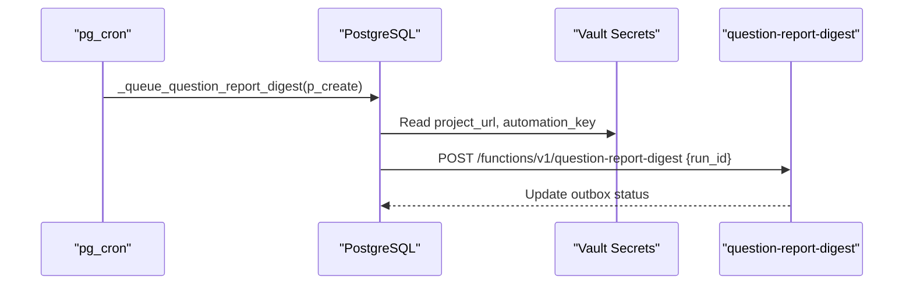
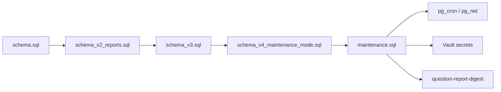

# Maintenance Operations

<cite>
**Referenced Files in This Document**
- [maintenance.sql](file://supabase/maintenance.sql)
- [backfill_v3_1_statistics.sql](file://supabase/backfill_v3_1_statistics.sql)
- [schema.sql](file://supabase/schema.sql)
- [schema_v3.sql](file://supabase/schema_v3.sql)
- [schema_v4_maintenance_mode.sql](file://supabase/schema_v4_maintenance_mode.sql)
- [config.toml](file://supabase/config.toml)
- [CAPACITY_GUARD.md](file://docs/CAPACITY_GUARD.md)
- [maintenance.ts](file://web/src/lib/maintenance.ts)
- [types.ts](file://web/src/lib/types.ts)
- [CONTRIBUTING.md](file://CONTRIBUTING.md)
</cite>

## Table of Contents
1. [Introduction](#introduction)
2. [Project Structure](#project-structure)
3. [Core Components](#core-components)
4. [Architecture Overview](#architecture-overview)
5. [Detailed Component Analysis](#detailed-component-analysis)
6. [Dependency Analysis](#dependency-analysis)
7. [Performance Considerations](#performance-considerations)
8. [Troubleshooting Guide](#troubleshooting-guide)
9. [Conclusion](#conclusion)
10. [Appendices](#appendices)

## Introduction
This document provides operational guidance for ongoing maintenance of the TBS LPDP Try Out system, focusing on database and application health, automated tasks, data lifecycle management, performance monitoring, capacity controls, and scheduled maintenance windows. It consolidates cron-based jobs, retention policies, statistics backfilling, capacity guard behavior, and frontend maintenance mode into a single runbook for operators and maintainers.

## Project Structure
The maintenance surface spans several layers:
- Database schema and operational scripts under supabase/
- Capacity guard documentation and enforcement logic
- Frontend maintenance mode UI state helpers
- Configuration for Supabase Edge Functions used by maintenance workflows

**Diagram sources**
- [maintenance.sql:18-167](file://supabase/maintenance.sql#L18-L167)
- [schema_v4_maintenance_mode.sql:15-63](file://supabase/schema_v4_maintenance_mode.sql#L15-L63)
- [maintenance.ts:7-29](file://web/src/lib/maintenance.ts#L7-L29)
- [types.ts:179-188](file://web/src/lib/types.ts#L179-L188)

**Section sources**
- [maintenance.sql:18-167](file://supabase/maintenance.sql#L18-L167)
- [schema_v4_maintenance_mode.sql:15-63](file://supabase/schema_v4_maintenance_mode.sql#L15-L63)
- [maintenance.ts:7-29](file://web/src/lib/maintenance.ts#L7-L29)
- [types.ts:179-188](file://web/src/lib/types.ts#L179-L188)

## Core Components
- Automated maintenance jobs via pg_cron:
  - Prune attempts older than 7 days
  - Refresh service capacity snapshot periodically
  - Prune anonymous users without reports after 60 days
  - Daily question report digest email dispatch and retry loop
- Capacity guard:
  - Soft limit at 80% of free tier to refuse new attempts while allowing in-progress work
  - Read-only status exposed to clients; enforcement inside start_attempt
- Scheduled maintenance window:
  - Operator-managed schedule with warning phase before start
  - Frontend displays warning and maintenance phases based on server time

**Section sources**
- [maintenance.sql:31-73](file://supabase/maintenance.sql#L31-L73)
- [maintenance.sql:142-152](file://supabase/maintenance.sql#L142-L152)
- [CAPACITY_GUARD.md:17-27](file://docs/CAPACITY_GUARD.md#L17-L27)
- [CAPACITY_GUARD.md:60-79](file://docs/CAPACITY_GUARD.md#L60-L79)
- [schema_v4_maintenance_mode.sql:15-63](file://supabase/schema_v4_maintenance_mode.sql#L15-L63)
- [maintenance.ts:7-29](file://web/src/lib/maintenance.ts#L7-L29)

## Architecture Overview
The maintenance architecture integrates database-level automation with backend RPCs and frontend state:

**Diagram sources**
- [maintenance.sql:31-73](file://supabase/maintenance.sql#L31-L73)
- [maintenance.sql:142-152](file://supabase/maintenance.sql#L142-L152)
- [schema_v4_maintenance_mode.sql:38-63](file://supabase/schema_v4_maintenance_mode.sql#L38-L63)
- [CAPACITY_GUARD.md:60-79](file://docs/CAPACITY_GUARD.md#L60-L79)

## Detailed Component Analysis

### Cron Jobs and Data Lifecycle
- Attempt pruning:
  - Deletes attempts older than 7 days, cascading to answers and events
  - Preserves question_reports because they are evidence about questions
- Anonymous user pruning:
  - Removes anonymous users inactive beyond 60 days unless they have reports
  - Cascades to their attempt-related rows
- Capacity refresh:
  - Periodically measures database size and estimated attempt row counts
  - Ensures capacity checks remain fresh even if cron is disabled
- Question report digest:
  - Creates or re-triggers a daily digest run
  - Calls the Edge Function with an automation key from Vault
  - Uses advisory locks to prevent race conditions between daily and retry jobs

**Diagram sources**
- [maintenance.sql:31-73](file://supabase/maintenance.sql#L31-L73)
- [maintenance.sql:87-152](file://supabase/maintenance.sql#L87-L152)

**Section sources**
- [maintenance.sql:31-73](file://supabase/maintenance.sql#L31-L73)
- [maintenance.sql:87-152](file://supabase/maintenance.sql#L87-L152)

### Statistics Backfilling
- One-time v3.1 retained statistics backfill:
  - Recovers qualified mean/median data from finished attempts predating v3.1
  - Enforces safety properties:
    - Verifies durable completions still have retained attempt rows
    - Derives eligibility rules from saved answers
    - Locks aggregate tables during consistent snapshot
    - Verifies counter/sum/histogram invariants before and after mutation
    - Records immutable audit marker
    - Idempotent: returns already_applied on subsequent runs

**Diagram sources**
- [backfill_v3_1_statistics.sql:19-23](file://supabase/backfill_v3_1_statistics.sql#L19-L23)

**Section sources**
- [backfill_v3_1_statistics.sql:1-25](file://supabase/backfill_v3_1_statistics.sql#L1-L25)

### Capacity Guard and Monitoring
- Measurement:
  - Stores db_bytes, attempt_rows, limits, and measured_at in a single-row table
  - Uses planner estimates for O(1) reads as data grows
- Enforcement:
  - Refuses new attempts when soft limits reached; allows resuming active attempts
  - Exposes service status to clients with acceptance flag and usage percent
- Operational queries:
  - Inspect current capacity and force measurement
  - Identify largest tables when numbers surprise you

**Diagram sources**
- [CAPACITY_GUARD.md:81-96](file://docs/CAPACITY_GUARD.md#L81-L96)
- [schema.sql:119-129](file://supabase/schema.sql#L119-L129)

**Section sources**
- [CAPACITY_GUARD.md:29-79](file://docs/CAPACITY_GUARD.md#L29-L79)
- [CAPACITY_GUARD.md:81-96](file://docs/CAPACITY_GUARD.md#L81-L96)
- [CAPACITY_GUARD.md:137-161](file://docs/CAPACITY_GUARD.md#L137-L161)
- [schema.sql:119-129](file://supabase/schema.sql#L119-L129)

### Scheduled Maintenance Mode
- Operator-managed schedule stored in a singleton table
- RPC computes phase: open, warning (4 hours before start), or maintenance
- Frontend uses helper functions to compute phase and next boundary for UI updates

**Diagram sources**
- [schema_v4_maintenance_mode.sql:15-63](file://supabase/schema_v4_maintenance_mode.sql#L15-L63)
- [maintenance.ts:7-29](file://web/src/lib/maintenance.ts#L7-L29)

**Section sources**
- [schema_v4_maintenance_mode.sql:15-63](file://supabase/schema_v4_maintenance_mode.sql#L15-L63)
- [maintenance.ts:7-29](file://web/src/lib/maintenance.ts#L7-L29)

### Edge Function Integration for Digests
- The digest job calls the Edge Function with project URL and automation key from Vault
- Required secrets must be configured before scheduling
- Function configuration disables JWT verification for automation flows

**Diagram sources**
- [maintenance.sql:87-152](file://supabase/maintenance.sql#L87-L152)
- [config.toml:3-4](file://supabase/config.toml#L3-L4)

**Section sources**
- [maintenance.sql:87-152](file://supabase/maintenance.sql#L87-L152)
- [config.toml:3-4](file://supabase/config.toml#L3-L4)

## Dependency Analysis
- Schema ordering matters:
  - Apply base schema, then reports schema, then v3, then maintenance mode, then maintenance jobs
  - Re-applying application schema requires re-applying later files in order
- Cron depends on extensions:
  - pg_cron and pg_net must be enabled
- Digest job depends on:
  - Vault secrets for project URL and automation key
  - Deployed Edge Function with correct configuration

**Diagram sources**
- [CONTRIBUTING.md:57-72](file://CONTRIBUTING.md#L57-L72)
- [maintenance.sql:18-20](file://supabase/maintenance.sql#L18-L20)
- [maintenance.sql:87-152](file://supabase/maintenance.sql#L87-L152)

**Section sources**
- [CONTRIBUTING.md:57-72](file://CONTRIBUTING.md#L57-L72)
- [maintenance.sql:18-20](file://supabase/maintenance.sql#L18-L20)

## Performance Considerations
- Use planner estimates for capacity measurements to keep reads O(1) as tables grow
- Avoid heavy scans; rely on indexes and catalog metadata
- Schedule background tasks during off-peak hours:
  - Attempt pruning at 03:00 UTC
  - Anonymous user pruning at 03:30 UTC
  - Digest daily at 08:00 WIB with retries every 30 minutes
- Capacity guard prevents writes from failing mid-exam by refusing new attempts early
- For large-scale growth:
  - Monitor top tables by total relation size
  - Adjust soft limits only when plan changes; prefer waiting for natural retention to reclaim space
  - Consider vacuum strategies carefully; full vacuum locks tables

[No sources needed since this section provides general guidance]

## Troubleshooting Guide
- Verify cron jobs:
  - List scheduled jobs and last run details
  - Unschedule a specific job if needed
- Check database size and table sizes:
  - Measure current database size
  - List top tables by size in public and auth schemas
- Diagnose capacity issues:
  - Inspect service_capacity row and force a measurement
  - Confirm whether new attempts are blocked due to soft limits
- Validate maintenance mode:
  - Query get_maintenance_status() to see phase and server time
  - Ensure frontend receives expected phase boundaries

**Section sources**
- [maintenance.sql:154-167](file://supabase/maintenance.sql#L154-L167)
- [CAPACITY_GUARD.md:137-161](file://docs/CAPACITY_GUARD.md#L137-L161)
- [schema_v4_maintenance_mode.sql:38-63](file://supabase/schema_v4_maintenance_mode.sql#L38-L63)

## Conclusion
The maintenance operations for TBS LPDP Try Out combine automated database cleanup, capacity-aware admission control, scheduled maintenance windows, and robust reporting workflows. Operators can manage retention, monitor capacity, and coordinate maintenance without redeploying code. The design emphasizes safety, idempotency, and graceful degradation to protect user work in progress while keeping the system within platform constraints.

[No sources needed since this section summarizes without analyzing specific files]

## Appendices

### Operational Runbooks

- Daily automated tasks:
  - Attempt pruning: deletes old attempts and cascades to related data
  - Anonymous user pruning: removes inactive anonymous accounts without reports
  - Capacity refresh: keeps capacity metrics fresh for admission control
  - Digest dispatch: creates or retries daily report digest runs

- Manual interventions:
  - Force capacity measurement when needed
  - Inspect cron job statuses and failures
  - Adjust soft limits only when platform plan changes

- Maintenance windows:
  - Set start and end times with a message
  - Frontend will show warning phase before start and maintenance phase during window

**Section sources**
- [maintenance.sql:31-73](file://supabase/maintenance.sql#L31-L73)
- [maintenance.sql:142-152](file://supabase/maintenance.sql#L142-L152)
- [CAPACITY_GUARD.md:137-161](file://docs/CAPACITY_GUARD.md#L137-L161)
- [schema_v4_maintenance_mode.sql:65-81](file://supabase/schema_v4_maintenance_mode.sql#L65-L81)

### Backup and Recovery Procedures
- No explicit backup scripts are present in this repository.
- Recommended approach:
  - Use Supabase’s built-in backups and point-in-time recovery features
  - Export critical reference data (packages, subtests, questions) regularly
  - Preserve storage bucket contents for images and assets
  - Test restore procedures periodically to validate RTO/RPO

[No sources needed since this section provides general guidance]

### Disaster Recovery Planning
- Prioritize restoring:
  - Database schema and data
  - Storage buckets for images and assets
  - Edge Function configurations and secrets
- Validate:
  - Cron jobs are re-scheduled
  - Capacity guard thresholds are restored
  - Maintenance mode schedules are reset
- Communicate:
  - Inform users via maintenance mode messages
  - Provide status updates until services are fully restored

[No sources needed since this section provides general guidance]

### System Restoration Processes
- Re-apply schema files in documented order
- Re-enable extensions and cron jobs
- Restore secrets and Edge Function configuration
- Verify capacity guard and maintenance mode endpoints
- Run one-time backfills if schema versions changed

**Section sources**
- [CONTRIBUTING.md:57-72](file://CONTRIBUTING.md#L57-L72)
- [maintenance.sql:18-20](file://supabase/maintenance.sql#L18-L20)
- [schema_v4_maintenance_mode.sql:15-63](file://supabase/schema_v4_maintenance_mode.sql#L15-L63)

### Scalability Considerations for Growing User Bases
- Retention policy:
  - 7-day attempt retention balances usability and storage
  - 60-day anonymous user pruning reduces MAU pressure
- Capacity guard:
  - Soft limit prevents hard write failures mid-exam
  - Allows existing sessions to complete while blocking new attempts
- Monitoring:
  - Track top tables and database size trends
  - Adjust limits only when plan changes; prefer retention-driven growth control
- Indexing:
  - Existing indexes support common access patterns
  - Review query plans as data grows to ensure efficiency

**Section sources**
- [maintenance.sql:31-73](file://supabase/maintenance.sql#L31-L73)
- [CAPACITY_GUARD.md:29-79](file://docs/CAPACITY_GUARD.md#L29-L79)
- [schema.sql:73-106](file://supabase/schema.sql#L73-L106)