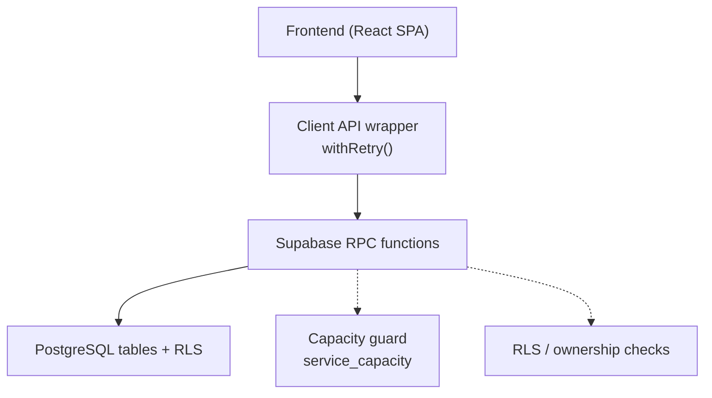
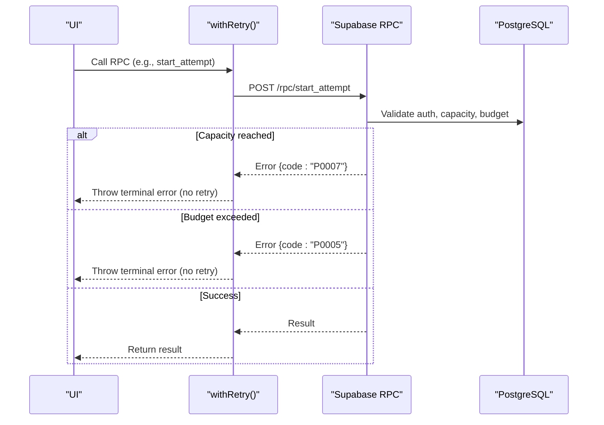
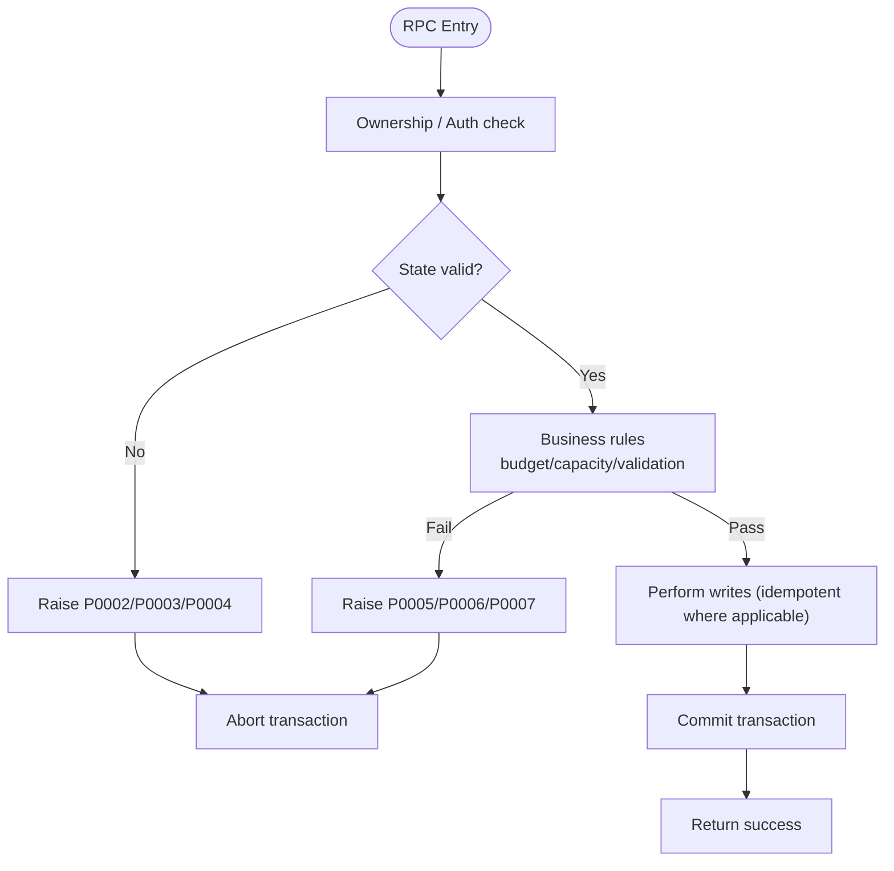
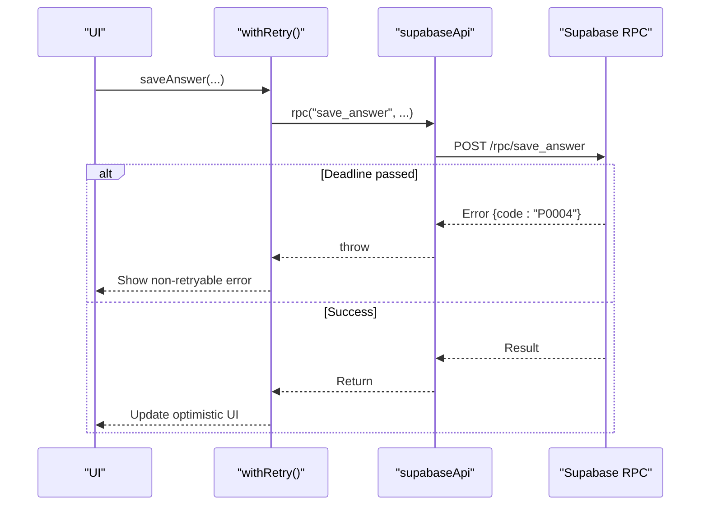
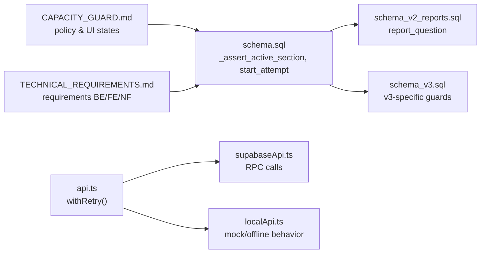

# Error Handling Patterns

<cite>
**Referenced Files in This Document**
- [schema.sql](file://supabase/schema.sql)
- [schema_v2_reports.sql](file://supabase/schema_v2_reports.sql)
- [schema_v3.sql](file://supabase/schema_v3.sql)
- [api.ts](file://web/src/lib/api.ts)
- [supabaseApi.ts](file://web/src/lib/supabaseApi.ts)
- [localApi.ts](file://web/src/lib/localApi.ts)
- [CAPACITY_GUARD.md](file://docs/CAPACITY_GUARD.md)
- [TECHNICAL_REQUIREMENTS.md](file://docs/TECHNICAL_REQUIREMENTS.md)
</cite>

## Table of Contents
1. [Introduction](#introduction)
2. [Project Structure](#project-structure)
3. [Core Components](#core-components)
4. [Architecture Overview](#architecture-overview)
5. [Detailed Component Analysis](#detailed-component-analysis)
6. [Dependency Analysis](#dependency-analysis)
7. [Performance Considerations](#performance-considerations)
8. [Troubleshooting Guide](#troubleshooting-guide)
9. [Conclusion](#conclusion)

## Introduction
This document explains the error handling patterns used across the RPC layer and client code for the exam platform. It focuses on:
- Custom error codes and their exact use cases (P0002, P0003, P0004, P0005, P0007).
- Exception handling strategy, transaction boundaries, and rollback behavior.
- Validation patterns for inputs, business rules, and security checks.
- Error propagation from server to client, retry policy, and debugging techniques.
- Common error scenarios and how to resolve them.

## Project Structure
The error handling spans three layers:
- Server-side Postgres functions (RPCs) enforce validation, business rules, and capacity limits, raising custom error codes via `raise exception ... using errcode = 'Pxxxx'`.
- Client-side API wrappers call these RPCs and implement a retry policy that treats certain error codes as terminal (no retries).
- Documentation and configuration define the semantics of each error code and when they are raised.

**Diagram sources**
- [api.ts:97-122](file://web/src/lib/api.ts#L97-L122)
- [schema.sql:341-389](file://supabase/schema.sql#L341-L389)
- [schema.sql:313-337](file://supabase/schema.sql#L313-L337)
- [schema.sql:119-127](file://supabase/schema.sql#L119-L127)

**Section sources**
- [TECHNICAL_REQUIREMENTS.md:150-162](file://docs/TECHNICAL_REQUIREMENTS.md#L150-L162)
- [CAPACITY_GUARD.md:1-27](file://docs/CAPACITY_GUARD.md#L1-L27)

## Core Components
- Server RPCs:
  - Ownership and state guards (e.g., active section, deadline).
  - Business rule enforcement (attempt creation budget, report rate limit).
  - Capacity guard preventing new attempts when storage is near or at the ceiling.
  - Input validation (option values, report reasons/comments).
- Client retry policy:
  - Exponential backoff with jitter for transient errors.
  - Terminal error codes short-circuit retries immediately.

Key behaviors:
- P0002: Not found or invalid context (e.g., attempt not found, question not in section, reporting an unavailable question).
- P0003: Section already finished; further mutations rejected.
- P0004: Deadline passed; auto-grade occurs and operation is rejected.
- P0005: Rate limit exceeded (attempt creation or report submission).
- P0007: Storage capacity reached; new attempts refused.

**Section sources**
- [schema.sql:313-337](file://supabase/schema.sql#L313-L337)
- [schema.sql:341-389](file://supabase/schema.sql#L341-L389)
- [schema_v2_reports.sql:114-143](file://supabase/schema_v2_reports.sql#L114-L143)
- [api.ts:97-122](file://web/src/lib/api.ts#L97-L122)

## Architecture Overview
Error flow from client to server and back:

**Diagram sources**
- [schema.sql:341-389](file://supabase/schema.sql#L341-L389)
- [api.ts:97-122](file://web/src/lib/api.ts#L97-L122)

## Detailed Component Analysis

### Custom Error Codes and Use Cases
- P0002 — Not found or invalid context
  - Attempt not found in read-only flows (get_review, get_attempt_state).
  - Section attempt not found or unauthorized in write flows.
  - Question not in current section for save/toggle operations.
  - Reporting a question that is not available for reporting.
  - Package not found or unpublished when starting an attempt.
- P0003 — Already finished
  - Attempting to mutate a section that is already finished.
- P0004 — Deadline passed
  - Any write to an active section after deadline (+grace), which triggers auto-grading then rejects.
- P0005 — Too many attempts (rate limit)
  - Per-user attempt creation cap within a rolling hour.
  - Report submission rate limit per user per hour.
- P0007 — Storage capacity reached
  - New attempt creation blocked when database size or estimated row count exceeds configured limits.

Where these are enforced:
- Section lifecycle and deadlines: `_assert_active_section` enforces P0002/P0003/P0004.
- Attempt creation: `start_attempt` enforces P0002 (package), P0005 (budget), P0007 (capacity).
- Reports: `report_question` enforces P0002 (availability), P0005 (rate limit), P0006 (input validation).
- Review/read flows: `get_review`, `get_attempt_state` enforce P0002 (ownership/availability).

**Section sources**
- [schema.sql:313-337](file://supabase/schema.sql#L313-L337)
- [schema.sql:341-389](file://supabase/schema.sql#L341-L389)
- [schema_v2_reports.sql:114-143](file://supabase/schema_v2_reports.sql#L114-L143)
- [schema_v2_reports.sql:207-218](file://supabase/schema_v2_reports.sql#L207-L218)
- [schema_v3.sql:723-739](file://supabase/schema_v3.sql#L723-L739)
- [schema_v3.sql:773-858](file://supabase/schema_v3.sql#L773-L858)

### Exception Handling Strategy and Transaction Boundaries
- All mutations occur inside Postgres functions with explicit ownership/state checks before writes.
- Auto-finishing logic:
  - When a deadline passes, the system grades the section and transitions it to finished before rejecting further writes. This ensures consistent state even under race conditions.
- Idempotency:
  - Finishing a section is idempotent; repeated calls return the stored score without side effects.
  - Saving answers uses upsert semantics keyed by section+question.
- Rollback behavior:
  - Because all logic runs in Postgres transactions, any `raise exception` aborts the current transaction, ensuring no partial writes. For example, if capacity is checked after some reads but before inserts, an exception will roll back any preceding changes in that transaction.

**Diagram sources**
- [schema.sql:313-337](file://supabase/schema.sql#L313-L337)
- [schema.sql:341-389](file://supabase/schema.sql#L341-L389)
- [schema_v2_reports.sql:114-143](file://supabase/schema_v2_reports.sql#L114-L143)

**Section sources**
- [schema.sql:185-239](file://supabase/schema.sql#L185-L239)
- [schema.sql:313-337](file://supabase/schema.sql#L313-L337)
- [schema.sql:341-389](file://supabase/schema.sql#L341-L389)

### Validation Patterns
- Input validation:
  - Option values restricted to A–E; invalid options raise P0006.
  - Report reason must be known; comment length and requirement enforced; violations raise P0006.
- Business rule enforcement:
  - Attempt creation budget: per-user hourly limit raises P0005.
  - Report submission rate limit: per-user hourly limit raises P0005.
  - Capacity guard: global storage ceiling prevents new attempts, raising P0007.
- Security checks:
  - Row Level Security (RLS) restricts access to user-owned data.
  - Functions use `security definer` to enforce policies consistently regardless of caller privileges.
  - Answer keys are never readable by clients; review returns keys only for finished sections.

**Section sources**
- [schema.sql:495-522](file://supabase/schema.sql#L495-L522)
- [schema_v2_reports.sql:114-143](file://supabase/schema_v2_reports.sql#L114-L143)
- [schema_v2_reports.sql:207-218](file://supabase/schema_v2_reports.sql#L207-L218)
- [schema.sql:131-181](file://supabase/schema.sql#L131-L181)

### Error Propagation and Client-Side Handling
- The client wraps RPC calls with `withRetry`, which:
  - Retries transient failures with exponential backoff.
  - Treats P0002, P0003, P0004, P0005, P0006, P0007 as terminal (no retries).
- Local API mirrors server behavior for offline/mocked modes, throwing equivalent errors (e.g., P0002 for missing attempt).
- Error messages are surfaced to users via UI components; backend error codes guide whether to retry or show immediate feedback.

**Diagram sources**
- [api.ts:97-122](file://web/src/lib/api.ts#L97-L122)
- [supabaseApi.ts:144-169](file://web/src/lib/supabaseApi.ts#L144-L169)
- [schema.sql:495-522](file://supabase/schema.sql#L495-L522)

**Section sources**
- [api.ts:97-122](file://web/src/lib/api.ts#L97-L122)
- [supabaseApi.ts:144-169](file://web/src/lib/supabaseApi.ts#L144-L169)
- [localApi.ts:513-530](file://web/src/lib/localApi.ts#L513-L530)

### Debugging Techniques for RPC Failures
- Inspect error code and message:
  - Backend raises specific codes (P0002–P0007) with descriptive messages.
  - Frontend surfaces the error message; use browser dev tools to inspect the thrown error object and its `code` field.
- Reproduce with minimal steps:
  - Identify which RPC triggered the error (start_attempt, save_answer, finish_section, report_question).
  - Check ownership and state (attempt exists, section active, deadline not passed).
- Capacity issues:
  - Use `get_service_status()` to see `accepting_attempts` and `usage_percent`.
  - If P0007 occurs, check `public.service_capacity` metrics and consider waiting for retention sweeps or adjusting limits.
- Rate limits:
  - For P0005, wait for the rolling window to expire or reduce request frequency.

**Section sources**
- [CAPACITY_GUARD.md:98-135](file://docs/CAPACITY_GUARD.md#L98-L135)
- [schema.sql:395-415](file://supabase/schema.sql#L395-L415)
- [api.ts:124-127](file://web/src/lib/api.ts#L124-L127)

## Dependency Analysis
Error handling depends on several interconnected components:

**Diagram sources**
- [schema.sql:313-389](file://supabase/schema.sql#L313-L389)
- [schema_v2_reports.sql:114-143](file://supabase/schema_v2_reports.sql#L114-L143)
- [schema_v3.sql:723-739](file://supabase/schema_v3.sql#L723-L739)
- [api.ts:97-122](file://web/src/lib/api.ts#L97-L122)
- [supabaseApi.ts:144-169](file://web/src/lib/supabaseApi.ts#L144-L169)
- [localApi.ts:513-530](file://web/src/lib/localApi.ts#L513-L530)
- [CAPACITY_GUARD.md:98-135](file://docs/CAPACITY_GUARD.md#L98-L135)
- [TECHNICAL_REQUIREMENTS.md:150-162](file://docs/TECHNICAL_REQUIREMENTS.md#L150-L162)

**Section sources**
- [schema.sql:313-389](file://supabase/schema.sql#L313-L389)
- [schema_v2_reports.sql:114-143](file://supabase/schema_v2_reports.sql#L114-L143)
- [schema_v3.sql:723-739](file://supabase/schema_v3.sql#L723-L739)
- [api.ts:97-122](file://web/src/lib/api.ts#L97-L122)
- [supabaseApi.ts:144-169](file://web/src/lib/supabaseApi.ts#L144-L169)
- [localApi.ts:513-530](file://web/src/lib/localApi.ts#L513-L530)
- [CAPACITY_GUARD.md:98-135](file://docs/CAPACITY_GUARD.md#L98-L135)
- [TECHNICAL_REQUIREMENTS.md:150-162](file://docs/TECHNICAL_REQUIREMENTS.md#L150-L162)

## Performance Considerations
- Capacity measurement is O(1) using catalog stats (`pg_class.reltuples`) and directory stats (`pg_database_size`), cached for 5 minutes to avoid frequent scans.
- Event logging caps per section to prevent unbounded growth; beyond 500 events, logs stop appending while writes still succeed.
- Retry policy avoids hammering the server on terminal errors, reducing unnecessary load during capacity saturation or rate limiting.

[No sources needed since this section provides general guidance]

## Troubleshooting Guide
Common error scenarios and resolutions:
- P0002 (Not found):
  - Verify the attempt/section/question IDs belong to the current user and are valid.
  - Ensure the question belongs to the active section before saving or toggling doubt.
  - For reports, ensure the question is available for reporting (finished section containing the question).
- P0003 (Already finished):
  - Do not attempt to mutate a finished section; redirect to review or next actions.
- P0004 (Deadline passed):
  - The section is auto-graded; do not retry saves. Proceed to review or next steps.
- P0005 (Too many attempts/reports):
  - Wait for the rolling window to expire; reduce request frequency.
  - Avoid loops or automated scraping that exceed limits.
- P0007 (Storage capacity reached):
  - Check `get_service_status()` for `accepting_attempts`.
  - If true, wait for retention sweeps or adjust capacity limits; do not retry aggressively.

Debugging tips:
- Log the error code and message from the thrown error.
- Use Supabase SQL editor to inspect `service_capacity` and recent attempts/events.
- Confirm RLS policies and ownership checks align with expected user context.

**Section sources**
- [schema.sql:313-389](file://supabase/schema.sql#L313-L389)
- [schema_v2_reports.sql:114-143](file://supabase/schema_v2_reports.sql#L114-L143)
- [CAPACITY_GUARD.md:98-135](file://docs/CAPACITY_GUARD.md#L98-L135)
- [api.ts:97-122](file://web/src/lib/api.ts#L97-L122)

## Conclusion
The error handling strategy combines strict server-side validation, clear business rule enforcement, and resilient client-side retry policies. Custom error codes provide precise signals for both developers and users, enabling appropriate responses such as immediate failure display for terminal errors versus retries for transient issues. Capacity guards and rate limits protect the free-tier environment while preserving ongoing user work. Consistent use of transactions ensures atomicity and rollback on errors, maintaining data integrity throughout the exam lifecycle.