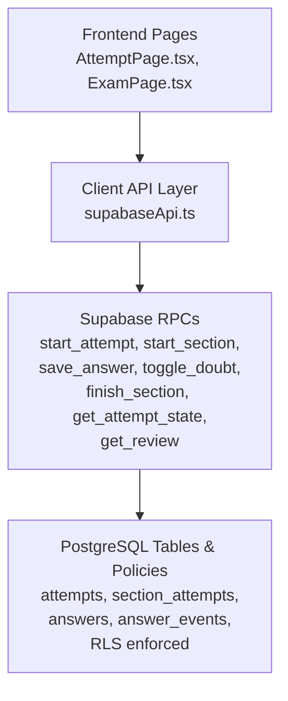
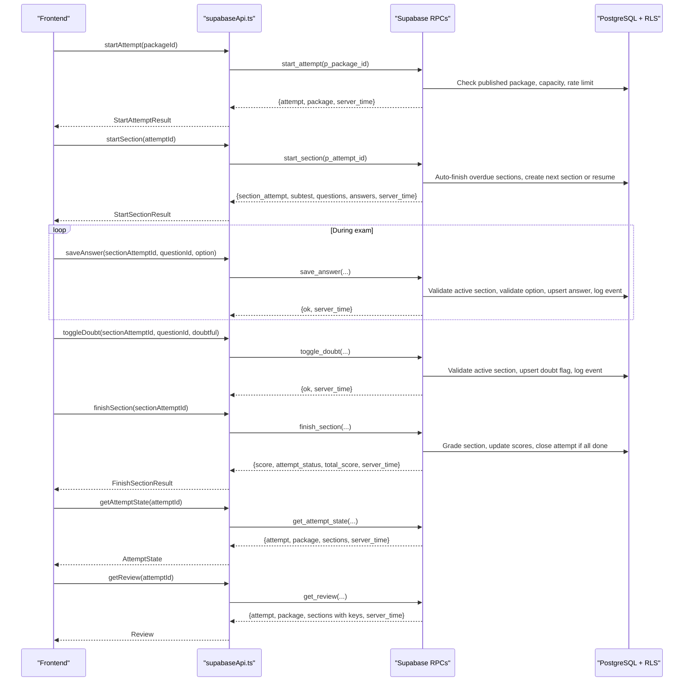
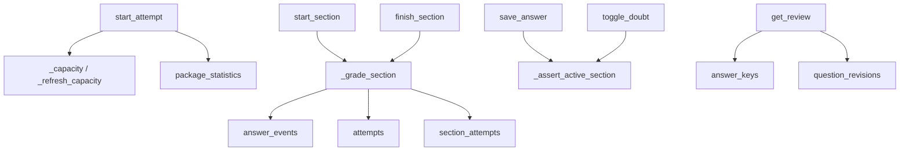

# Exam Lifecycle RPCs

<cite>
**Referenced Files in This Document**
- [schema.sql](file://supabase/schema.sql)
- [schema_v3.sql](file://supabase/schema_v3.sql)
- [supabaseApi.ts](file://web/src/lib/supabaseApi.ts)
- [types.ts](file://web/src/lib/types.ts)
- [AttemptPage.tsx](file://web/src/pages/AttemptPage.tsx)
- [ExamPage.tsx](file://web/src/pages/ExamPage.tsx)
</cite>

## Table of Contents
1. [Introduction](#introduction)
2. [Project Structure](#project-structure)
3. [Core Components](#core-components)
4. [Architecture Overview](#architecture-overview)
5. [Detailed Component Analysis](#detailed-component-analysis)
6. [Dependency Analysis](#dependency-analysis)
7. [Performance Considerations](#performance-considerations)
8. [Troubleshooting Guide](#troubleshooting-guide)
9. [Conclusion](#conclusion)

## Introduction
This document explains the server-side RPC functions that implement the complete exam lifecycle for a user’s attempt: starting an attempt, initializing sections with deadlines, saving answers, marking questions as doubtful, finishing sections with automatic grading, retrieving current progress, and accessing completed review data with answer keys. It specifies input parameters, return structures, error codes (P0002, P0003, P0004, P0005, P0007), authentication requirements, Row Level Security enforcement, and how frontend components call these functions during exam execution.

## Project Structure
The exam lifecycle is implemented as PostgreSQL functions exposed via Supabase RPCs. The web client calls these RPCs through a typed API layer. Key files:
- Server schema and RPC definitions: supabase/schema.sql and supabase/schema_v3.sql
- Client API wrappers and types: web/src/lib/supabaseApi.ts and web/src/lib/types.ts
- Frontend pages orchestrating the flow: web/src/pages/AttemptPage.tsx and web/src/pages/ExamPage.tsx

**Diagram sources**
- [supabaseApi.ts:108-147](file://web/src/lib/supabaseApi.ts#L108-L147)
- [schema.sql:341-657](file://supabase/schema.sql#L341-L657)
- [schema_v3.sql:709-800](file://supabase/schema_v3.sql#L709-L800)

**Section sources**
- [supabaseApi.ts:108-147](file://web/src/lib/supabaseApi.ts#L108-L147)
- [schema.sql:341-657](file://supabase/schema.sql#L341-L657)
- [schema_v3.sql:709-800](file://supabase/schema_v3.sql#L709-L800)

## Core Components
- Authentication: All RPCs require an authenticated session. The client enforces this before calling RPCs by ensuring a Supabase session exists; anonymous sign-in is used to create a persistent identity per browser.
- Row Level Security (RLS): Every read/write path is scoped to the current user via policies on attempts, section_attempts, answers, and answer_events. Answer keys are never directly readable by clients; they are only included in controlled RPC outputs like get_review for finished sections owned by the caller.
- Capacity and rate limiting: New attempts check global storage capacity and per-user hourly attempt limits.
- Deadline management: Sections have server-enforced deadlines; past-deadline sections are auto-graded and closed.
- Automatic grading: Finishing a section triggers server-side scoring using immutable question revisions and updates attempt totals when all subtests finish.

**Section sources**
- [supabaseApi.ts:45-64](file://web/src/lib/supabaseApi.ts#L45-L64)
- [schema.sql:131-181](file://supabase/schema.sql#L131-L181)
- [schema_v3.sql:610-705](file://supabase/schema_v3.sql#L610-L705)

## Architecture Overview
The exam lifecycle follows a strict sequence enforced by the server:

**Diagram sources**
- [supabaseApi.ts:108-147](file://web/src/lib/supabaseApi.ts#L108-L147)
- [schema.sql:341-657](file://supabase/schema.sql#L341-L657)
- [schema_v3.sql:709-800](file://supabase/schema_v3.sql#L709-L800)

## Detailed Component Analysis

### start_attempt
Purpose: Create or resume an attempt for a published package with capacity checks and rate limiting.

- Input parameters:
  - p_package_id: integer (package identifier)
- Return value structure:
  - attempt: Attempt object (id, package_id, package_release_id, status, started_at, finished_at, total_score)
  - package: Package metadata from the current release
  - server_time: string timestamp
- Authentication requirement:
  - Must be authenticated; function raises an exception if no auth.uid()
- Business logic:
  - Validates that the package exists, is published, and has a current release
  - If no active attempt exists for the user and package, checks global storage capacity and per-user hourly attempt limit
  - Creates a new attempt row and increments package statistics counters
  - Returns existing active attempt if one already exists
- Error codes:
  - P0002: Package not found, unpublished, or missing release
  - P0005: Too many attempts within the last hour (rate limit)
  - P0007: Storage capacity reached (global ceiling exceeded)
- Row Level Security:
  - Read/write paths are scoped to the authenticated user; attempts table policy ensures users can only see their own attempts

Frontend usage:
- Called from the package selection flow to begin an attempt; returns enough context to navigate into section intros and then start sections.

**Section sources**
- [schema_v3.sql:709-758](file://supabase/schema_v3.sql#L709-L758)
- [supabaseApi.ts:108-111](file://web/src/lib/supabaseApi.ts#L108-L111)
- [types.ts:88-92](file://web/src/lib/types.ts#L88-L92)

### start_section
Purpose: Initialize or resume a subtest for an attempt, managing deadlines and serving questions without exposing answer keys.

- Input parameters:
  - p_attempt_id: uuid (attempt identifier)
- Return value structure:
  - Either done: true (no more sections) or
  - section_attempt: SectionAttempt object (id, attempt_id, subtest_id, status, started_at, deadline_at, finished_at, score)
  - subtest: Subtest metadata (name, position, duration_seconds, passing_grade)
  - package: Package metadata
  - questions: Array of Question objects (no correct_option or explanations)
  - answers: Array of AnswerState objects (selected_option, is_doubtful)
  - server_time: string timestamp
- Authentication requirement:
  - Must be authenticated; validates ownership of the attempt
- Business logic:
  - Sweeps and auto-grades any active sections whose deadline has passed
  - Resumes an existing active section if present
  - Otherwise selects the next unstarted subtest by position and creates a section_attempt with deadline computed from subtest duration
  - Logs a “start” event for the section
  - Returns questions and persisted answers for the section; answer keys are intentionally excluded
- Error codes:
  - P0002: Attempt not found or not owned by the caller
- Row Level Security:
  - Ensures the attempt belongs to the current user; questions and options are served via RPC, bypassing direct table reads

Frontend usage:
- Called after starting an attempt or resuming an attempt; drives the intro screen and then renders the exam page with questions and timer.

**Section sources**
- [schema_v3.sql:760-800](file://supabase/schema_v3.sql#L760-L800)
- [supabaseApi.ts:113-116](file://web/src/lib/supabaseApi.ts#L113-L116)
- [types.ts:94-107](file://web/src/lib/types.ts#L94-L107)

### save_answer
Purpose: Record a user’s selected option for a question within an active section.

- Input parameters:
  - p_section_attempt_id: uuid
  - p_question_id: text
  - p_option: char(1) or null
- Return value structure:
  - ok: boolean
  - server_time: string timestamp
- Authentication requirement:
  - Enforced via _assert_active_section which verifies ownership and active state
- Business logic:
  - Validates the section is active and not past deadline (with a small grace window)
  - Validates the option is one of A–E or null
  - Validates the question belongs to the section’s subtest
  - Upserts the answer row and logs a “save_answer” event
- Error codes:
  - P0002: Question not in this section (or section not found)
  - P0003: Section already finished
  - P0004: Section deadline passed (auto-graded and closed)
- Row Level Security:
  - Ownership verified through joins to attempts and section_attempts; events logged under the same scope

Frontend usage:
- Debounced writes during exam navigation; explicit save button flushes pending changes; errors handled gracefully with retry and warnings.

**Section sources**
- [schema.sql:495-522](file://supabase/schema.sql#L495-L522)
- [schema_v3.sql:836-870](file://supabase/schema_v3.sql#L836-L870)
- [supabaseApi.ts:118-124](file://web/src/lib/supabaseApi.ts#L118-L124)
- [ExamPage.tsx:104-126](file://web/src/pages/ExamPage.tsx#L104-L126)

### toggle_doubt
Purpose: Mark or unmark a question as doubtful within an active section.

- Input parameters:
  - p_section_attempt_id: uuid
  - p_question_id: text
  - p_doubtful: boolean
- Return value structure:
  - ok: boolean
  - server_time: string timestamp
- Authentication requirement:
  - Enforced via _assert_active_section
- Business logic:
  - Validates the section is active and not past deadline
  - Validates the question belongs to the section’s subtest
  - Upserts the doubt flag on the answer row and logs “mark_doubt” or “unmark_doubt” event
- Error codes:
  - P0002: Question not in this section (or section not found)
  - P0003: Section already finished
  - P0004: Section deadline passed (auto-graded and closed)
- Row Level Security:
  - Ownership verified through joins to attempts and section_attempts

Frontend usage:
- Toggled per question; immediate optimistic UI update with background RPC; errors handled with retry and warnings.

**Section sources**
- [schema.sql:524-549](file://supabase/schema.sql#L524-L549)
- [supabaseApi.ts:126-132](file://web/src/lib/supabaseApi.ts#L126-L132)
- [ExamPage.tsx:205-215](file://web/src/pages/ExamPage.tsx#L205-L215)

### finish_section
Purpose: Complete a section, compute score, and finalize the attempt if all subtests are done.

- Input parameters:
  - p_section_attempt_id: uuid
- Return value structure:
  - score: integer (section score)
  - attempt_status: 'active' | 'finished'
  - total_score: integer or null (cumulative across sections)
  - server_time: string timestamp
- Authentication requirement:
  - Validates ownership of the section attempt
- Business logic:
  - Grades the section using immutable question revisions and stored answers
  - Updates section status to finished and records finished_at and score
  - If all subtests of the attempt are finished, closes the attempt and computes total_score
  - Updates package statistics and histogram for eligible completions
- Error codes:
  - P0002: Section attempt not found or not owned by the caller
- Row Level Security:
  - Ownership verified through joins to attempts and section_attempts

Frontend usage:
- Triggered by user confirmation or auto-expire at zero time; handles P0003/P0004 gracefully since the server may have already graded the section.

**Section sources**
- [schema_v3.sql:610-705](file://supabase/schema_v3.sql#L610-L705)
- [schema.sql:551-580](file://supabase/schema.sql#L551-L580)
- [supabaseApi.ts:134-137](file://web/src/lib/supabaseApi.ts#L134-L137)
- [ExamPage.tsx:146-169](file://web/src/pages/ExamPage.tsx#L146-L169)

### get_attempt_state
Purpose: Retrieve current progress for an attempt including sections and package context.

- Input parameters:
  - p_attempt_id: uuid
- Return value structure:
  - attempt: Attempt object
  - package: Package metadata
  - sections: Array of { section_attempt, subtest }
  - server_time: string timestamp
- Authentication requirement:
  - Validates ownership of the attempt
- Business logic:
  - Returns attempt details and all associated sections with their subtest metadata
- Error codes:
  - P0002: Attempt not found or not owned by the caller
- Row Level Security:
  - Ownership enforced via attempts policy

Frontend usage:
- Bootstraps the attempt page to determine whether to resume an active section, show intro for next subtest, or navigate to review.

**Section sources**
- [schema.sql:582-607](file://supabase/schema.sql#L582-L607)
- [supabaseApi.ts:139-142](file://web/src/lib/supabaseApi.ts#L139-L142)
- [types.ts:116-121](file://web/src/lib/types.ts#L116-L121)
- [AttemptPage.tsx:30-72](file://web/src/pages/AttemptPage.tsx#L30-L72)

### get_review
Purpose: Access completed attempt data with answer keys and explanations for finished sections.

- Input parameters:
  - p_attempt_id: uuid
- Return value structure:
  - attempt: Attempt object
  - package: Package metadata
  - sections: Array of ReviewSection objects containing subtest, score, and questions with selected_option, is_doubtful, correct_option, and explanations
  - server_time: string timestamp
- Authentication requirement:
  - Validates ownership of the attempt
- Business logic:
  - Includes answer keys and explanations only for finished sections of the caller’s own attempt
  - Orders sections by subtest position
- Error codes:
  - P0002: Attempt not found or not owned by the caller
- Row Level Security:
  - Ownership enforced via attempts policy; answer_keys table has no client-readable policy and is accessed only through this controlled RPC

Frontend usage:
- Navigated to after completing all sections; displays full Pembahasan with correct answers and explanations.

**Section sources**
- [schema.sql:612-657](file://supabase/schema.sql#L612-L657)
- [supabaseApi.ts:144-147](file://web/src/lib/supabaseApi.ts#L144-L147)
- [types.ts:146-165](file://web/src/lib/types.ts#L146-L165)

## Dependency Analysis
The RPCs depend on shared helpers and tables:

**Diagram sources**
- [schema.sql:185-337](file://supabase/schema.sql#L185-L337)
- [schema_v3.sql:610-705](file://supabase/schema_v3.sql#L610-L705)

Key dependencies:
- _assert_active_section: Central guard for write operations; enforces ownership, active status, and deadline checks
- _grade_section: Computes section score, logs finish events, and finalizes attempts when all subtests are done
- _capacity/_refresh_capacity: Measures database size and attempt rows against configured limits
- answer_events: Append-only audit log bounded per section to prevent unbounded growth
- answer_keys and question_revisions: Immutable references used for grading and review

**Section sources**
- [schema.sql:185-337](file://supabase/schema.sql#L185-L337)
- [schema_v3.sql:610-705](file://supabase/schema_v3.sql#L610-L705)

## Performance Considerations
- Debounced saves: The frontend batches answer updates to reduce RPC calls and event log entries
- Event cap: answer_events per section capped to prevent abuse and control storage growth
- Capacity checks: Global storage limits gate new attempts while allowing ongoing exams to continue
- Efficient queries: Functions use targeted joins and aggregates; capacity measurement uses planner estimates rather than count(*)
- Idempotent operations: Finishing sections and grading are safe to call multiple times; results remain consistent

[No sources needed since this section provides general guidance]

## Troubleshooting Guide
Common error codes and handling:
- P0002: Resource not found or not owned (package, attempt, section, question). Verify IDs and authentication; ensure the resource belongs to the current user.
- P0003: Section already finished. The frontend should navigate away or refresh state; do not allow further writes.
- P0004: Section deadline passed. The server grades and closes the section automatically; the frontend should leave the section and re-bootstrap state.
- P0005: Rate limit exceeded (too many attempts per hour). Wait and retry later; inform the user.
- P0007: Storage capacity reached. New attempts are blocked; existing attempts continue working. Monitor service status and adjust limits if necessary.

Frontend error handling patterns:
- Retry with backoff for transient network issues
- Gracefully handle P0003/P0004 by leaving the section and refreshing state
- Show user-friendly messages for capacity and rate limit errors

**Section sources**
- [ExamPage.tsx:88-98](file://web/src/pages/ExamPage.tsx#L88-L98)
- [ExamPage.tsx:146-169](file://web/src/pages/ExamPage.tsx#L146-L169)
- [schema.sql:311-337](file://supabase/schema.sql#L311-L337)
- [schema_v3.sql:709-758](file://supabase/schema_v3.sql#L709-L758)

## Conclusion
The exam lifecycle RPCs provide a secure, server-authoritative implementation of attempt creation, section management, answer recording, doubt toggling, grading, and review access. They enforce authentication, Row Level Security, capacity controls, rate limits, and deadline-based grading. The frontend integrates tightly with these RPCs to deliver a resilient exam experience, handling edge cases like timeouts, retries, and capacity constraints while preserving user data integrity.