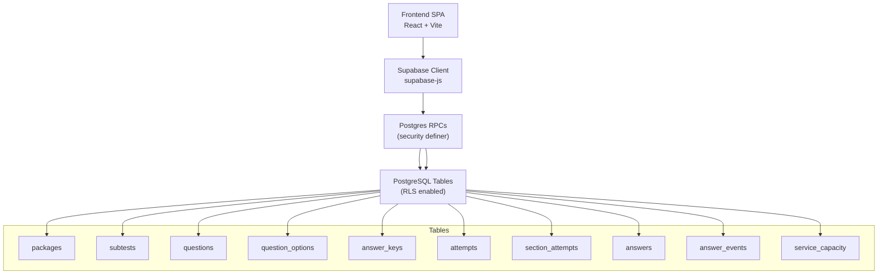
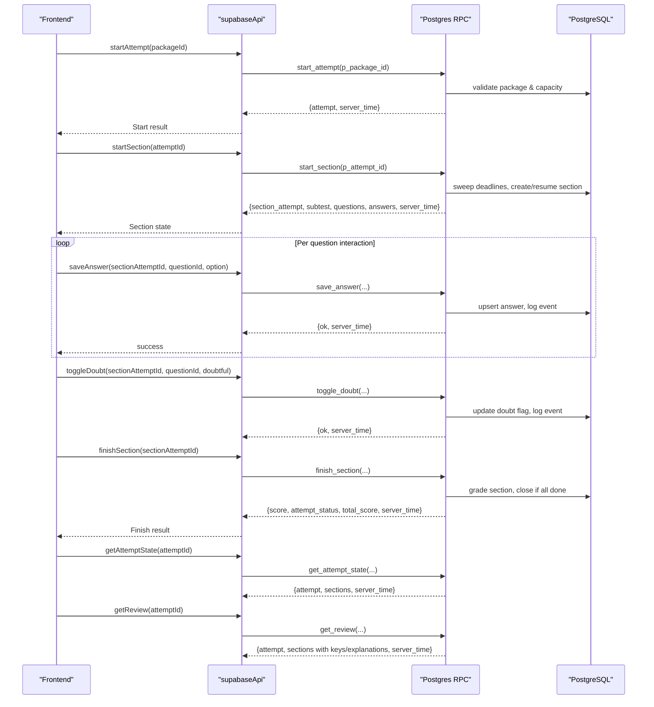
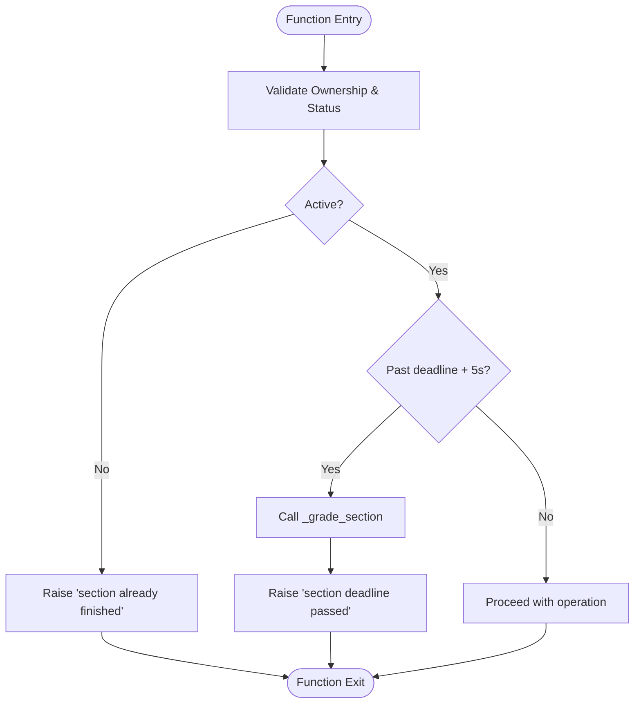

# RPC Functions

<cite>
**Referenced Files in This Document**
- [schema.sql](file://supabase/schema.sql)
- [supabaseApi.ts](file://web/src/lib/supabaseApi.ts)
- [AttemptPage.tsx](file://web/src/pages/AttemptPage.tsx)
- [ExamPage.tsx](file://web/src/pages/ExamPage.tsx)
- [ReviewPage.tsx](file://web/src/pages/ReviewPage.tsx)
- [TECHNICAL_REQUIREMENTS.md](file://docs/TECHNICAL_REQUIREMENTS.md)
</cite>

## Table of Contents
1. [Introduction](#introduction)
2. [Project Structure](#project-structure)
3. [Core Components](#core-components)
4. [Architecture Overview](#architecture-overview)
5. [Detailed Component Analysis](#detailed-component-analysis)
6. [Dependency Analysis](#dependency-analysis)
7. [Performance Considerations](#performance-considerations)
8. [Troubleshooting Guide](#troubleshooting-guide)
9. [Conclusion](#conclusion)

## Introduction
This document provides detailed server-side RPC function documentation for the Supabase backend used by the TBS LPDP Try Out application. It covers the core functions start_attempt, start_section, save_answer, toggle_doubt, finish_section, get_attempt_state, get_review, and get_service_status. For each function, it specifies input parameters, return values, error codes, business logic, authentication requirements, Row Level Security (RLS) enforcement, transaction boundaries, and usage examples from frontend components. It also documents internal helper functions _grade_section, _log_event, _assert_active_section, and capacity management helpers (_refresh_capacity, _capacity).

## Project Structure
The backend is implemented as Postgres Database Functions (RPCs) with RLS policies. The frontend calls these RPCs via supabase-js. Key files:
- Backend schema and RPC definitions: supabase/schema.sql
- Frontend API client wrappers: web/src/lib/supabaseApi.ts
- Frontend pages that call RPCs: web/src/pages/AttemptPage.tsx, ExamPage.tsx, ReviewPage.tsx
- Technical requirements and constraints: docs/TECHNICAL_REQUIREMENTS.md

**Diagram sources**
- [schema.sql:16-127](file://supabase/schema.sql#L16-L127)
- [schema.sql:131-181](file://supabase/schema.sql#L131-L181)

**Section sources**
- [schema.sql:16-127](file://supabase/schema.sql#L16-L127)
- [schema.sql:131-181](file://supabase/schema.sql#L131-L181)
- [TECHNICAL_REQUIREMENTS.md:125-149](file://docs/TECHNICAL_REQUIREMENTS.md#L125-L149)

## Core Components
- Authentication: Anonymous sign-in per browser; all RPCs require an authenticated session.
- RLS: All tables have RLS enabled; user-scoped policies restrict access to own attempts, sections, answers, and events. Content tables are read-only to clients; answer_keys has no client-readable policy.
- Transaction boundaries: Each RPC executes within a single database transaction. Mutations are atomic per call; idempotency is enforced where applicable (e.g., finishing a section).
- Capacity guard: Global storage ceiling prevents new attempt creation when limits are reached; existing attempts remain usable.

**Section sources**
- [schema.sql:131-181](file://supabase/schema.sql#L131-L181)
- [schema.sql:341-415](file://supabase/schema.sql#L341-L415)
- [TECHNICAL_REQUIREMENTS.md:110-123](file://docs/TECHNICAL_REQUIREMENTS.md#L110-L123)

## Architecture Overview
The exam flow uses a sequence of RPCs to manage attempts and sections, enforce timing, grade results, and provide review data only after completion.

**Diagram sources**
- [schema.sql:341-657](file://supabase/schema.sql#L341-L657)
- [supabaseApi.ts:108-147](file://web/src/lib/supabaseApi.ts#L108-L147)

## Detailed Component Analysis

### start_attempt
- Purpose: Create or resume an active attempt for a published package; enforces capacity and per-user hourly budget.
- Input parameters:
  - p_package_id: integer (package identifier)
- Return value: JSON object containing:
  - attempt: attempt row
  - server_time: ISO timestamp string
- Error codes:
  - Not authenticated: generic exception (no code)
  - P0002: Package not found or unpublished
  - P0007: Storage capacity reached (global limit)
  - P0005: Too many attempts (per-user hourly budget)
- Business logic:
  - Requires authenticated user
  - Validates package existence and published status
  - Returns existing active attempt if present
  - If creating new attempt: checks global capacity via _capacity(), then per-user hourly attempt count, then inserts attempt
- Authentication: Requires authenticated session (anonymous allowed)
- RLS: Reads packages via policy; writes attempts via security definer function
- Transaction boundary: Single transaction encompassing validation and insertion
- Frontend usage example:
  - AttemptPage calls api.startSection after bootstrap; start_attempt is invoked via supabaseApi.startAttempt before navigating to attempt flow
  - See [supabaseApi.ts:108-111](file://web/src/lib/supabaseApi.ts#L108-L111)

**Section sources**
- [schema.sql:341-390](file://supabase/schema.sql#L341-L390)
- [supabaseApi.ts:108-111](file://web/src/lib/supabaseApi.ts#L108-L111)
- [TECHNICAL_REQUIREMENTS.md:110-123](file://docs/TECHNICAL_REQUIREMENTS.md#L110-L123)

### start_section
- Purpose: Start next unstarted section for an attempt; returns questions without answer keys; sets deadline_at based on subtest duration
- Input parameters:
  - p_attempt_id: uuid
- Return value: JSON object containing:
  - section_attempt: section_attempts row
  - subtest: subtest metadata
  - questions: array of question objects (without keys)
  - answers: current saved answers for this section
  - server_time: ISO timestamp string
  - done: boolean indicating all sections completed
- Error codes:
  - P0002: Attempt not found
- Business logic:
  - Validates attempt ownership
  - Sweeps and auto-finishes any overdue active sections
  - Resumes active section if exists; otherwise creates next subtest by position with deadline_at = now() + duration_seconds
  - Logs 'start' event
  - Returns questions and answers for UI
- Authentication: Requires authenticated session
- RLS: Reads subtests/questions/options via policies; writes section_attempts via security definer
- Transaction boundary: Single transaction including sweep, insert, and reads
- Frontend usage example:
  - AttemptPage calls api.startSection to begin or resume a section
  - See [AttemptPage.tsx:82-87](file://web/src/pages/AttemptPage.tsx#L82-L87)
  - See [supabaseApi.ts:113-116](file://web/src/lib/supabaseApi.ts#L113-L116)

**Section sources**
- [schema.sql:417-493](file://supabase/schema.sql#L417-L493)
- [AttemptPage.tsx:82-87](file://web/src/pages/AttemptPage.tsx#L82-L87)
- [supabaseApi.ts:113-116](file://web/src/lib/supabaseApi.ts#L113-L116)

### save_answer
- Purpose: Save or update selected option for a question in an active section; logs event
- Input parameters:
  - p_section_attempt_id: uuid
  - p_question_id: text
  - p_option: char(1) in ('A','B','C','D','E') or null
- Return value: JSON object containing:
  - ok: true
  - server_time: ISO timestamp string
- Error codes:
  - Generic invalid option if not in allowed set
  - P0002: Question not in this section
  - P0003: Section already finished
  - P0004: Section deadline passed (+5s grace)
- Business logic:
  - Asserts active section via _assert_active_section
  - Validates option format
  - Ensures question belongs to the section’s subtest
  - Upserts answer row with selected_option and updated_at
  - Logs 'save_answer' event via _log_event (capped at 500 rows per section)
- Authentication: Requires authenticated session
- RLS: Writes answers via security definer; reads section via policy
- Transaction boundary: Single transaction for assertion, upsert, and logging
- Frontend usage example:
  - ExamPage debounces saves and calls api.saveAnswer with optimistic UI
  - See [ExamPage.tsx:104-126](file://web/src/pages/ExamPage.tsx#L104-L126)
  - See [supabaseApi.ts:118-124](file://web/src/lib/supabaseApi.ts#L118-L124)

**Section sources**
- [schema.sql:495-522](file://supabase/schema.sql#L495-L522)
- [ExamPage.tsx:104-126](file://web/src/pages/ExamPage.tsx#L104-L126)
- [supabaseApi.ts:118-124](file://web/src/lib/supabaseApi.ts#L118-L124)

### toggle_doubt
- Purpose: Toggle doubt mark for a question in an active section; logs event
- Input parameters:
  - p_section_attempt_id: uuid
  - p_question_id: text
  - p_doubtful: boolean
- Return value: JSON object containing:
  - ok: true
  - server_time: ISO timestamp string
- Error codes:
  - P0002: Question not in this section
  - P0003: Section already finished
  - P0004: Section deadline passed (+5s grace)
- Business logic:
  - Asserts active section via _assert_active_section
  - Validates question belongs to section’s subtest
  - Upserts answer row with is_doubtful and updated_at
  - Logs 'mark_doubt' or 'unmark_doubt' event via _log_event
- Authentication: Requires authenticated session
- RLS: Writes answers via security definer; reads section via policy
- Transaction boundary: Single transaction for assertion, upsert, and logging
- Frontend usage example:
  - ExamPage toggles doubt and calls api.toggleDoubt with retry
  - See [ExamPage.tsx:205-215](file://web/src/pages/ExamPage.tsx#L205-L215)
  - See [supabaseApi.ts:126-132](file://web/src/lib/supabaseApi.ts#L126-L132)

**Section sources**
- [schema.sql:524-549](file://supabase/schema.sql#L524-L549)
- [ExamPage.tsx:205-215](file://web/src/pages/ExamPage.tsx#L205-L215)
- [supabaseApi.ts:126-132](file://web/src/lib/supabaseApi.ts#L126-L132)

### finish_section
- Purpose: Grade and finalize a section; may close the entire attempt when all sections are finished
- Input parameters:
  - p_section_attempt_id: uuid
- Return value: JSON object containing:
  - score: integer (section score)
  - attempt_status: 'active' or 'finished'
  - total_score: integer (sum of section scores)
  - server_time: ISO timestamp string
- Error codes:
  - P0002: Section attempt not found
- Business logic:
  - Validates ownership of section attempt
  - Calls _grade_section to compute score, mark section finished, and possibly close attempt
  - Returns grading result and updated attempt state
- Authentication: Requires authenticated session
- RLS: Reads section/attempts via policy; writes via security definer
- Transaction boundary: Single transaction for ownership check, grading, and updates
- Frontend usage example:
  - ExamPage calls api.finishSection on user confirmation or timeout
  - See [ExamPage.tsx:146-169](file://web/src/pages/ExamPage.tsx#L146-L169)
  - See [supabaseApi.ts:134-137](file://web/src/lib/supabaseApi.ts#L134-L137)

**Section sources**
- [schema.sql:551-580](file://supabase/schema.sql#L551-L580)
- [ExamPage.tsx:146-169](file://web/src/pages/ExamPage.tsx#L146-L169)
- [supabaseApi.ts:134-137](file://web/src/lib/supabaseApi.ts#L134-L137)

### get_attempt_state
- Purpose: Retrieve full state for resuming an attempt, including sections and their metadata
- Input parameters:
  - p_attempt_id: uuid
- Return value: JSON object containing:
  - attempt: attempt row
  - server_time: ISO timestamp string
  - sections: array of section_attempt and subtest pairs
- Error codes:
  - P0002: Attempt not found
- Business logic:
  - Validates attempt ownership
  - Aggregates sections with subtest details
- Authentication: Requires authenticated session
- RLS: Reads attempts and section_attempts via policies scoped to user
- Transaction boundary: Single read transaction
- Frontend usage example:
  - AttemptPage bootstraps by calling api.getAttemptState to determine current phase
  - See [AttemptPage.tsx:34-52](file://web/src/pages/AttemptPage.tsx#L34-L52)
  - See [supabaseApi.ts:139-142](file://web/src/lib/supabaseApi.ts#L139-L142)

**Section sources**
- [schema.sql:582-607](file://supabase/schema.sql#L582-L607)
- [AttemptPage.tsx:34-52](file://web/src/pages/AttemptPage.tsx#L34-L52)
- [supabaseApi.ts:139-142](file://web/src/lib/supabaseApi.ts#L139-L142)

### get_review
- Purpose: Retrieve review data for an attempt, including correct options and explanations for finished sections only
- Input parameters:
  - p_attempt_id: uuid
- Return value: JSON object containing:
  - attempt: attempt row
  - sections: array of subtest, score, and questions with selected_option, is_doubtful, correct_option, explanations
  - server_time: ISO timestamp string
- Error codes:
  - P0002: Attempt not found
- Business logic:
  - Validates attempt ownership
  - Joins questions, answer_keys, and answers for finished sections only
  - Excludes keys/explanations for active sections (answer-key secrecy)
- Authentication: Requires authenticated session
- RLS: Reads via policies; answer_keys accessed only within security definer context
- Transaction boundary: Single read transaction
- Frontend usage example:
  - ReviewPage calls api.getReview to load results and per-question explanations
  - See [ReviewPage.tsx:67-83](file://web/src/pages/ReviewPage.tsx#L67-L83)
  - See [supabaseApi.ts:144-147](file://web/src/lib/supabaseApi.ts#L144-L147)

**Section sources**
- [schema.sql:612-657](file://supabase/schema.sql#L612-L657)
- [ReviewPage.tsx:67-83](file://web/src/pages/ReviewPage.tsx#L67-L83)
- [supabaseApi.ts:144-147](file://web/src/lib/supabaseApi.ts#L144-L147)

### get_service_status
- Purpose: Provide capacity and acceptance status for starting new attempts
- Input parameters: None
- Return value: JSON object containing:
  - accepting_attempts: boolean
  - usage_percent: integer percentage
  - measured_at: timestamp
  - server_time: ISO timestamp string
- Error codes: None expected
- Business logic:
  - Computes usage from _capacity() comparing db_bytes vs limit_bytes and attempt_rows vs limit_attempt_rows
  - Sets accepting_attempts to true when usage < 100%
- Authentication: Requires authenticated session
- RLS: Reads service_capacity via security definer (no public policy)
- Transaction boundary: Single read transaction
- Frontend usage example:
  - HomePage or similar uses api.getServiceStatus to enable/disable "Mulai Try Out" buttons
  - See [supabaseApi.ts:85-88](file://web/src/lib/supabaseApi.ts#L85-L88)

**Section sources**
- [schema.sql:395-415](file://supabase/schema.sql#L395-L415)
- [supabaseApi.ts:85-88](file://web/src/lib/supabaseApi.ts#L85-L88)

## Dependency Analysis
Internal helper functions and capacity management:

- _grade_section: Grades a section, marks it finished, logs finish event, and closes attempt if all sections finished
- _log_event: Appends event row with cap of 500 per section
- _assert_active_section: Validates ownership, active status, and deadline; auto-finishes if past deadline
- _refresh_capacity: Measures database size and row counts, updates service_capacity row
- _capacity: Returns cached capacity snapshot, refreshes if older than 5 minutes

**Diagram sources**
- [schema.sql:313-337](file://supabase/schema.sql#L313-L337)
- [schema.sql:186-239](file://supabase/schema.sql#L186-L239)

**Section sources**
- [schema.sql:186-239](file://supabase/schema.sql#L186-L239)
- [schema.sql:246-260](file://supabase/schema.sql#L246-L260)
- [schema.sql:266-309](file://supabase/schema.sql#L266-L309)
- [schema.sql:313-337](file://supabase/schema.sql#L313-L337)

## Performance Considerations
- Event log capping: _log_event caps answer_events at 500 rows per section to bound storage growth
- Capacity measurement: _refresh_capacity uses pg_database_size and planner estimates for O(1) measurement
- Caching: _capacity caches measurements for 5 minutes to reduce overhead
- Idempotent operations: finish_section and start_section are designed to be safe under retries
- Optimistic UI: Frontend debounces saves to reduce RPC calls and event rows

[No sources needed since this section provides general guidance]

## Troubleshooting Guide
Common error codes and handling:
- P0002: Resource not found (package, attempt, section, question)
- P0003: Section already finished
- P0004: Section deadline passed (+5s grace)
- P0005: Too many attempts (per-user hourly budget) or too many reports
- P0006: Validation error (report reason/comment)
- P0007: Storage capacity reached

Frontend error handling patterns:
- ExamPage handles P0003/P0004 by leaving section gracefully
- ReviewPage maps error codes to user-friendly messages
- Retry logic with withRetry for transient failures

**Section sources**
- [ExamPage.tsx:88-98](file://web/src/pages/ExamPage.tsx#L88-L98)
- [ReviewPage.tsx:38-50](file://web/src/pages/ReviewPage.tsx#L38-L50)
- [schema.sql:341-657](file://supabase/schema.sql#L341-L657)

## Conclusion
The Supabase RPC layer provides a secure, efficient, and robust backend for the TBS LPDP Try Out application. Functions enforce authentication, RLS, timing, grading, and capacity constraints while providing clear error codes and idempotent operations. The frontend integrates seamlessly through typed API wrappers and handles errors gracefully. Internal helpers ensure consistency, performance, and protection against abuse.

[No sources needed since this section summarizes without analyzing specific files]