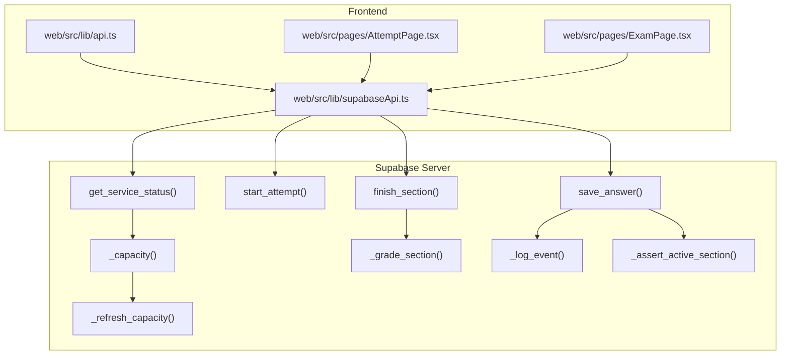
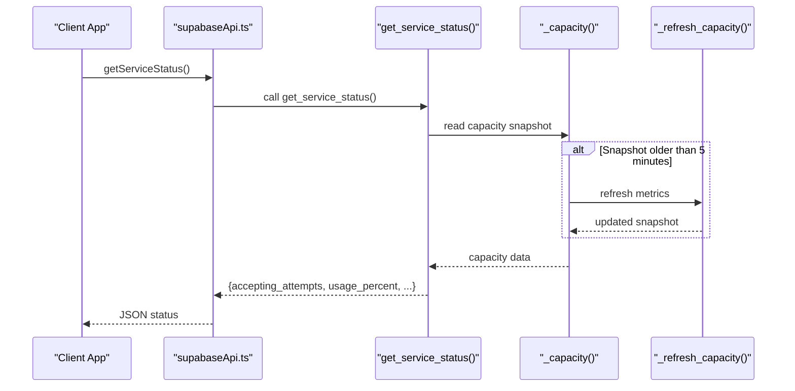
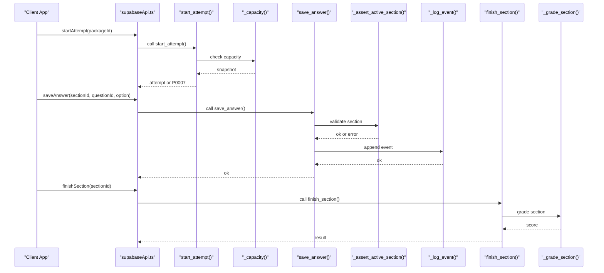
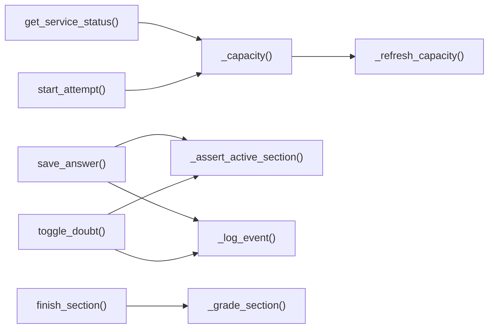

# System Utility RPCs

<cite>
**Referenced Files in This Document**
- [schema.sql](file://supabase/schema.sql)
- [CAPACITY_GUARD.md](file://docs/CAPACITY_GUARD.md)
- [api.ts](file://web/src/lib/api.ts)
- [supabaseApi.ts](file://web/src/lib/supabaseApi.ts)
- [AttemptPage.tsx](file://web/src/pages/AttemptPage.tsx)
- [ExamPage.tsx](file://web/src/pages/ExamPage.tsx)
</cite>

## Table of Contents
1. Introduction
2. Project Structure
3. Core Components
4. Architecture Overview
5. Detailed Component Analysis
6. Dependency Analysis
7. Performance Considerations
8. Troubleshooting Guide
9. Conclusion

## Introduction
This document explains the system utility RPC functions that provide infrastructure support for the exam application. It focuses on capacity management and section lifecycle utilities:
- get_service_status: exposes whether the service is accepting new attempts and current usage percentage.
- _capacity: returns a cached capacity snapshot, refreshing it when stale.
- _refresh_capacity: measures database size and estimated row counts to update capacity metrics.
- Internal helpers:
  - _grade_section: computes and persists a section score and closes the section.
  - _log_event: appends audit events with per-section rate limiting.
  - _assert_active_section: validates ownership and active state of a section, auto-finishing if past deadline.

These utilities protect the system from storage exhaustion, ensure consistent grading, and provide reliable auditing while keeping performance predictable under load.

## Project Structure
The utilities live in the Supabase schema as server-side SQL functions and are consumed by frontend pages through typed API calls. The capacity guard also has dedicated documentation describing design decisions and operational guidance.

**Diagram sources**
- [schema.sql:392-415](file://supabase/schema.sql#L392-L415)
- [schema.sql:262-309](file://supabase/schema.sql#L262-L309)
- [schema.sql:183-239](file://supabase/schema.sql#L183-L239)
- [schema.sql:241-260](file://supabase/schema.sql#L241-L260)
- [schema.sql:311-337](file://supabase/schema.sql#L311-L337)
- [schema.sql:341-390](file://supabase/schema.sql#L341-L390)
- [schema.sql:495-522](file://supabase/schema.sql#L495-L522)
- [schema.sql:551-580](file://supabase/schema.sql#L551-L580)
- [api.ts:77-95](file://web/src/lib/api.ts#L77-L95)
- [supabaseApi.ts:108-137](file://web/src/lib/supabaseApi.ts#L108-L137)
- [AttemptPage.tsx:78-93](file://web/src/pages/AttemptPage.tsx#L78-L93)
- [ExamPage.tsx:146-174](file://web/src/pages/ExamPage.tsx#L146-L174)

**Section sources**
- [schema.sql:108-129](file://supabase/schema.sql#L108-L129)
- [CAPACITY_GUARD.md:29-80](file://docs/CAPACITY_GUARD.md#L29-L80)

## Core Components
- Capacity measurement and exposure:
  - _refresh_capacity: updates db_bytes and attempt_rows with O(1) catalog lookups and timestamps measured_at.
  - _capacity: returns the latest snapshot; refreshes automatically if older than 5 minutes.
  - get_service_status: converts capacity into a safe, client-facing JSON payload including accepting_attempts and usage_percent.
- Section lifecycle and auditing:
  - _grade_section: calculates score, marks section finished, logs finish event, and finalizes attempt totals when all sections complete.
  - _log_event: appends answer_events with per-section cap to prevent unbounded growth.
  - _assert_active_section: enforces ownership, prevents finishing already-finished sections, and auto-grades past-deadline sections.
- Integration points:
  - start_attempt checks capacity before creating new attempts, allowing resuming existing ones even at capacity.
  - save_answer and toggle_doubt validate section state via _assert_active_section and log events via _log_event.
  - finish_section grades the section and returns scores and attempt status.

**Section sources**
- [schema.sql:262-309](file://supabase/schema.sql#L262-L309)
- [schema.sql:392-415](file://supabase/schema.sql#L392-L415)
- [schema.sql:183-239](file://supabase/schema.sql#L183-L239)
- [schema.sql:241-260](file://supabase/schema.sql#L241-L260)
- [schema.sql:311-337](file://supabase/schema.sql#L311-L337)
- [schema.sql:341-390](file://supabase/schema.sql#L341-L390)
- [schema.sql:495-522](file://supabase/schema.sql#L495-L522)
- [schema.sql:551-580](file://supabase/schema.sql#L551-L580)

## Architecture Overview
The capacity guard protects against storage exhaustion by gating new attempts while preserving ongoing exams. The UI uses get_service_status to disable starting new attempts when near capacity. Internally, _capacity provides a self-healing cache with automatic refresh, and _refresh_capacity performs efficient measurements.

**Diagram sources**
- [schema.sql:392-415](file://supabase/schema.sql#L392-L415)
- [schema.sql:292-309](file://supabase/schema.sql#L292-L309)
- [schema.sql:262-287](file://supabase/schema.sql#L262-L287)
- [supabaseApi.ts:103-111](file://web/src/lib/supabaseApi.ts#L103-L111)

## Detailed Component Analysis

### get_service_status
Purpose:
- Expose whether the service is accepting new attempts and current usage percentage without leaking raw byte counts.

Behavior:
- Calls _capacity to obtain a fresh or cached snapshot.
- Computes usage as the maximum of bytes-to-limit and rows-to-limit ratios.
- Returns a JSON object with accepting_attempts (boolean), usage_percent (integer capped at 100), measured_at, and server_time.

Usage:
- Frontend calls this to decide whether to enable/disable the “Start” button and show a warning banner when not accepting attempts.

Security:
- Implemented as security definer; direct access to service_capacity table is blocked by RLS with no policies.

Performance:
- Uses _capacity’s staleness check to avoid frequent measurements; refresh only when needed.

**Section sources**
- [schema.sql:392-415](file://supabase/schema.sql#L392-L415)
- [CAPACITY_GUARD.md:98-111](file://docs/CAPACITY_GUARD.md#L98-L111)

### _capacity
Purpose:
- Provide a cached capacity snapshot with automatic refresh when stale.

Behavior:
- Reads the single-row service_capacity.
- If missing, inserts the row and reads again.
- If measured_at is older than 5 minutes, calls _refresh_capacity to update metrics.

Concurrency:
- Idempotent refresh; concurrent refreshes overwrite with equally fresh values without locking.

**Section sources**
- [schema.sql:292-309](file://supabase/schema.sql#L292-L309)
- [CAPACITY_GUARD.md:60-80](file://docs/CAPACITY_GUARD.md#L60-L80)

### _refresh_capacity
Purpose:
- Measure and stamp the capacity snapshot.

Behavior:
- Updates db_bytes using pg_database_size.
- Estimates attempt_rows by summing planner estimates (reltuples) for key tables.
- Sets measured_at to now().

Complexity:
- O(1) relative to table sizes due to catalog lookups; avoids expensive count(*) queries.

**Section sources**
- [schema.sql:262-287](file://supabase/schema.sql#L262-L287)
- [CAPACITY_GUARD.md:29-53](file://docs/CAPACITY_GUARD.md#L29-L53)

### _grade_section
Purpose:
- Compute and persist a section’s score, mark it finished, log the finish event, and finalize attempt totals when all sections are done.

Behavior:
- Counts correct answers based on answer_keys and updates section_attempts.
- Inserts a finish event into answer_events.
- Marks the parent attempt finished and aggregates total_score when all subtests are completed.

Idempotency:
- Safe to call multiple times; if already finished, returns stored score.

**Section sources**
- [schema.sql:183-239](file://supabase/schema.sql#L183-L239)

### _log_event
Purpose:
- Append audit events for user actions with per-section rate limiting to prevent unbounded growth.

Behavior:
- Checks current event count for the section; if at or above the cap, silently ignores further events.
- Inserts event with type and payload; normal sections log well under the cap.

Security:
- Security definer function; clients cannot write directly to answer_events without going through RPCs.

**Section sources**
- [schema.sql:241-260](file://supabase/schema.sql#L241-L260)

### _assert_active_section
Purpose:
- Validate that the caller owns an active section that has not exceeded its deadline.

Behavior:
- Verifies ownership by joining section_attempts with attempts and auth.uid().
- Rejects if section not found or already finished.
- Auto-grades and rejects if past deadline plus grace period.

Error codes:
- P0002: section attempt not found
- P0003: section already finished
- P0004: section deadline passed

**Section sources**
- [schema.sql:311-337](file://supabase/schema.sql#L311-L337)

### Integration with main exam functions
- start_attempt:
  - Checks authentication and package validity.
  - Allows resuming existing active attempts even at capacity.
  - For new attempts, checks capacity via _capacity and raises terminal error P0007 if limits reached.
  - Enforces per-user hourly budget to limit rapid creation.
- save_answer and toggle_doubt:
  - Use _assert_active_section to enforce state.
  - Persist answers and log events via _log_event.
- finish_section:
  - Validates ownership, grades via _grade_section, and returns scores and attempt status.

**Diagram sources**
- [schema.sql:341-390](file://supabase/schema.sql#L341-L390)
- [schema.sql:495-522](file://supabase/schema.sql#L495-L522)
- [schema.sql:551-580](file://supabase/schema.sql#L551-L580)
- [schema.sql:311-337](file://supabase/schema.sql#L311-L337)
- [schema.sql:241-260](file://supabase/schema.sql#L241-L260)
- [schema.sql:183-239](file://supabase/schema.sql#L183-L239)
- [supabaseApi.ts:108-137](file://web/src/lib/supabaseApi.ts#L108-L137)

**Section sources**
- [schema.sql:341-390](file://supabase/schema.sql#L341-L390)
- [schema.sql:495-522](file://supabase/schema.sql#L495-L522)
- [schema.sql:551-580](file://supabase/schema.sql#L551-L580)

## Dependency Analysis
- get_service_status depends on _capacity, which may depend on _refresh_capacity.
- start_attempt depends on _capacity for global capacity enforcement.
- save_answer and toggle_doubt depend on _assert_active_section and _log_event.
- finish_section depends on _grade_section.
- Frontend api.ts delegates to supabaseApi.ts, which invokes these RPCs.

**Diagram sources**
- [schema.sql:392-415](file://supabase/schema.sql#L392-L415)
- [schema.sql:292-309](file://supabase/schema.sql#L292-L309)
- [schema.sql:262-287](file://supabase/schema.sql#L262-L287)
- [schema.sql:341-390](file://supabase/schema.sql#L341-L390)
- [schema.sql:495-522](file://supabase/schema.sql#L495-L522)
- [schema.sql:551-580](file://supabase/schema.sql#L551-L580)
- [schema.sql:311-337](file://supabase/schema.sql#L311-L337)
- [schema.sql:241-260](file://supabase/schema.sql#L241-L260)
- [schema.sql:183-239](file://supabase/schema.sql#L183-L239)

**Section sources**
- [schema.sql:392-415](file://supabase/schema.sql#L392-L415)
- [schema.sql:292-309](file://supabase/schema.sql#L292-L309)
- [schema.sql:262-287](file://supabase/schema.sql#L262-L287)
- [schema.sql:341-390](file://supabase/schema.sql#L341-L390)
- [schema.sql:495-522](file://supabase/schema.sql#L495-L522)
- [schema.sql:551-580](file://supabase/schema.sql#L551-L580)
- [schema.sql:311-337](file://supabase/schema.sql#L311-L337)
- [schema.sql:241-260](file://supabase/schema.sql#L241-L260)
- [schema.sql:183-239](file://supabase/schema.sql#L183-L239)

## Performance Considerations
- Capacity measurements use O(1) catalog lookups and directory stats, minimizing overhead.
- Staleness window of 5 minutes reduces refresh frequency while ensuring correctness.
- Per-section event logging cap prevents unbounded growth and keeps storage predictable.
- Terminal error codes (e.g., P0007) avoid retry storms during capacity saturation.

[No sources needed since this section provides general guidance]

## Troubleshooting Guide
Common issues and resolutions:
- Storage capacity reached (P0007):
  - Occurs when db_bytes or attempt_rows exceed limits during new attempt creation.
  - Resolution: wait for cleanup (daily sweep drops old attempts), adjust retention, or raise limits via data changes.
- Section deadline passed (P0004):
  - Happens when attempting to modify a section past its deadline; server auto-grades and rejects.
  - Resolution: finish the section gracefully or handle the error in UI.
- Section already finished (P0003):
  - Attempting to modify a finished section.
  - Resolution: proceed to review or handle error appropriately.
- Too many attempts (P0005):
  - Per-user hourly budget exceeded.
  - Resolution: wait for the hour window to reset.

Operational tips:
- Force a capacity measurement bypassing the 5-minute window when investigating.
- Inspect biggest tables to understand storage growth.

**Section sources**
- [CAPACITY_GUARD.md:81-96](file://docs/CAPACITY_GUARD.md#L81-L96)
- [CAPACITY_GUARD.md:137-161](file://docs/CAPACITY_GUARD.md#L137-L161)
- [schema.sql:341-390](file://supabase/schema.sql#L341-L390)
- [schema.sql:311-337](file://supabase/schema.sql#L311-L337)

## Conclusion
These utility RPCs form the backbone of capacity management, secure section validation, and reliable auditing in the exam system. They ensure:
- Graceful handling of storage limits without disrupting ongoing exams.
- Predictable performance through caching and O(1) measurements.
- Robust security via security definer functions and RLS.
- Scalability by bounding event logs and enforcing rate limits.

Together, they contribute to system reliability and scalability by protecting resources, maintaining consistent state, and providing clear signals to both users and operators.