# Security Policies

<cite>
**Referenced Files in This Document**
- [schema.sql](file://supabase/schema.sql)
- [schema_v2_reports.sql](file://supabase/schema_v2_reports.sql)
- [schema_v3.sql](file://supabase/schema_v3.sql)
- [maintenance.sql](file://supabase/maintenance.sql)
- [config.toml](file://supabase/config.toml)
- [CAPACITY_GUARD.md](file://docs/CAPACITY_GUARD.md)
- [api.ts](file://web/src/lib/api.ts)
- [supabase.ts](file://web/src/lib/supabase.ts)
- [README.md](file://README.md)
</cite>

## Table of Contents
1. Introduction
2. Project Structure
3. Core Components
4. Architecture Overview
5. Detailed Component Analysis
6. Dependency Analysis
7. Performance Considerations
8. Troubleshooting Guide
9. Conclusion
10. Appendices

## Introduction
This document describes the security model for the Supabase backend powering an educational testing platform. It focuses on Row Level Security (RLS), authentication and authorization flows using anonymous users, data isolation, protection of sensitive content such as answer keys, storage bucket security for images, rate limiting, capacity guard enforcement, and operational safeguards via scheduled maintenance. The goal is to ensure exam integrity, prevent answer key exposure, and maintain privacy and reliability under load.

## Project Structure
The security-relevant backend is implemented primarily in SQL functions, policies, and scheduled jobs within the Supabase project:
- Data schema and RLS policies are defined in the base schema and extended by versioned migrations.
- Business logic and access control are enforced through server-side functions executed with elevated privileges where appropriate.
- Storage is configured for public read access to question images while uploads use service-level credentials.
- Maintenance jobs prune old attempts and anonymous users, refresh capacity metrics, and orchestrate operator notifications.

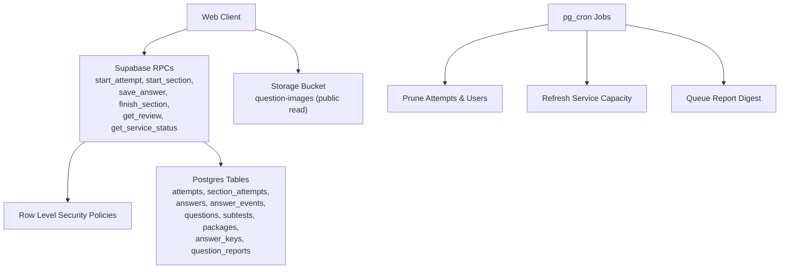

**Diagram sources**
- [schema.sql:131-181](file://supabase/schema.sql#L131-L181)
- [schema.sql:341-657](file://supabase/schema.sql#L341-L657)
- [schema.sql:663-672](file://supabase/schema.sql#L663-L672)
- [maintenance.sql:31-51](file://supabase/maintenance.sql#L31-L51)
- [maintenance.sql:64-73](file://supabase/maintenance.sql#L64-L73)
- [maintenance.sql:87-152](file://supabase/maintenance.sql#L87-L152)

**Section sources**
- [schema.sql:16-142](file://supabase/schema.sql#L16-L142)
- [schema.sql:663-672](file://supabase/schema.sql#L663-L672)
- [maintenance.sql:1-167](file://supabase/maintenance.sql#L1-L167)

## Core Components
- Authentication and session handling: Anonymous sign-in is used; clients authenticate via Supabase client configuration.
- Authorization and data isolation: RLS policies restrict reads to published content and user-owned attempt data; writes are only permitted through RPCs.
- Sensitive data protection: Answer keys are never directly readable by clients; they are accessed only inside server functions for grading and review of finished sections.
- Storage security: A dedicated bucket for question images allows public read; uploads require service-level credentials.
- Rate limiting: Per-user limits on starting attempts and reporting questions protect against abuse.
- Capacity guard: Global storage ceiling prevents new attempts when nearing database limits while allowing ongoing exams to complete.
- Operational safety: Scheduled jobs prune old data, refresh capacity snapshots, and queue digest emails.

**Section sources**
- [supabase.ts:9-13](file://web/src/lib/supabase.ts#L9-L13)
- [schema.sql:131-181](file://supabase/schema.sql#L131-L181)
- [schema.sql:341-657](file://supabase/schema.sql#L341-L657)
- [schema.sql:663-672](file://supabase/schema.sql#L663-L672)
- [schema_v2_reports.sql:51-67](file://supabase/schema_v2_reports.sql#L51-L67)
- [schema_v2_reports.sql:90-176](file://supabase/schema_v2_reports.sql#L90-L176)
- [schema_v3.sql:709-758](file://supabase/schema_v3.sql#L709-L758)
- [CAPACITY_GUARD.md:1-161](file://docs/CAPACITY_GUARD.md#L1-L161)
- [maintenance.sql:31-73](file://supabase/maintenance.sql#L31-L73)

## Architecture Overview
The system enforces a strict separation between client-facing operations and privileged server logic:
- Clients call RPCs that perform all mutations and sensitive reads.
- RLS ensures users can only see their own attempt-related data.
- Answer keys are never exposed via direct table access; they are joined only within controlled functions for grading or post-exam review.
- Storage bucket policies allow public image retrieval without exposing upload capabilities to clients.
- Maintenance jobs keep the system healthy and within capacity constraints.

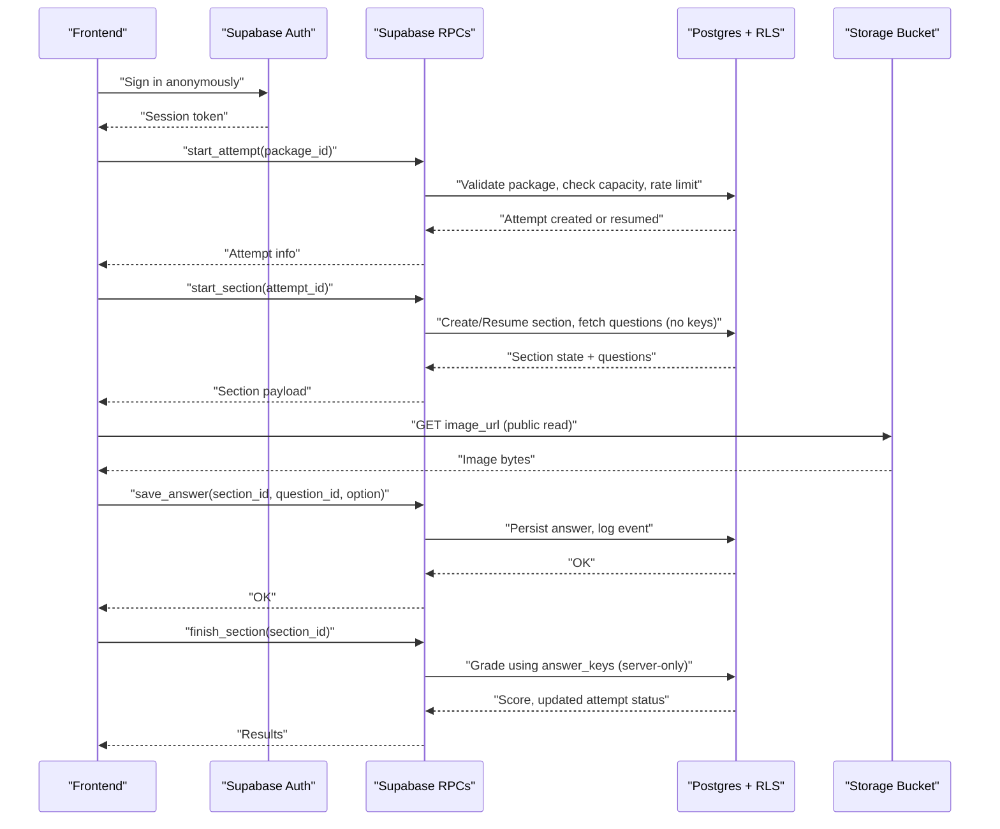

**Diagram sources**
- [schema.sql:341-657](file://supabase/schema.sql#L341-L657)
- [schema.sql:663-672](file://supabase/schema.sql#L663-L672)
- [schema_v3.sql:709-758](file://supabase/schema_v3.sql#L709-L758)

## Detailed Component Analysis

### Row Level Security (RLS) Policies
- Published content visibility: Packages and subtests are selectable by authenticated users only if published.
- User-scoped attempt data: Attempts, section attempts, answers, and events are readable only by the owning user.
- No direct client access to answer keys: The answer_keys table has RLS enabled but no client-readable policy; it is accessed exclusively via server functions.
- Question reports: Only the report author can read their own reports; write access is restricted to RPCs.

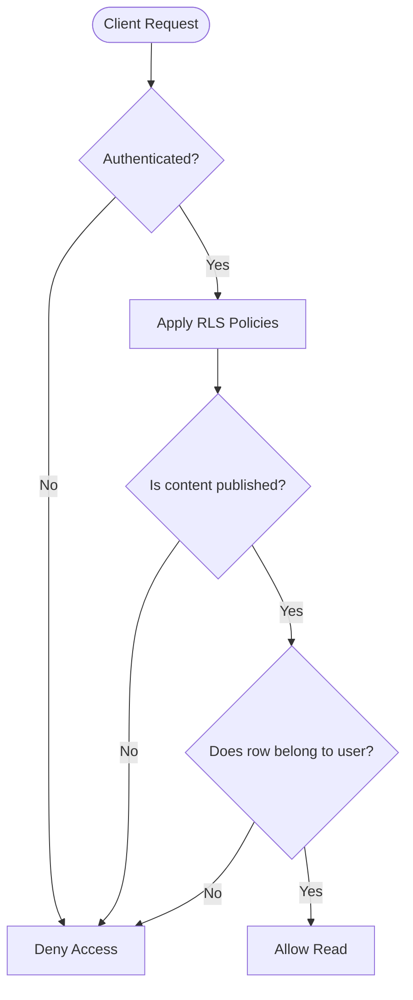

**Diagram sources**
- [schema.sql:131-181](file://supabase/schema.sql#L131-L181)
- [schema_v2_reports.sql:51-67](file://supabase/schema_v2_reports.sql#L51-L67)

**Section sources**
- [schema.sql:131-181](file://supabase/schema.sql#L131-L181)
- [schema_v2_reports.sql:51-67](file://supabase/schema_v2_reports.sql#L51-L67)

### Authentication Flow (Anonymous)
- The frontend initializes a Supabase client with anonymous persistence and token refresh.
- All RPC calls rely on the current session’s user ID to enforce ownership checks.
- Anonymous identities are periodically pruned to manage quotas and storage growth.

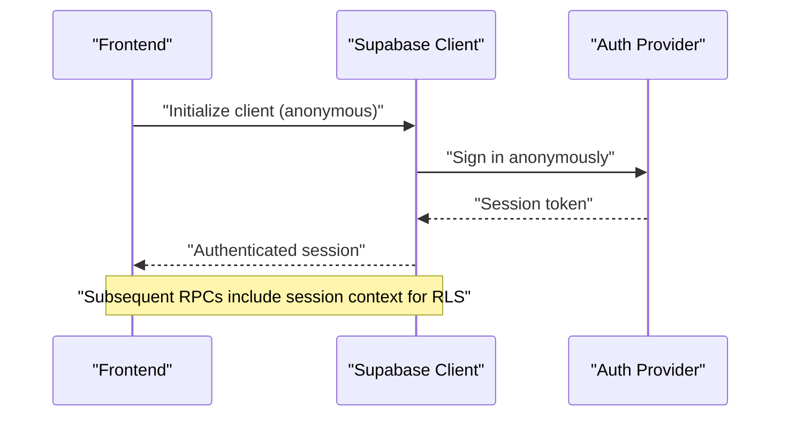

**Diagram sources**
- [supabase.ts:9-13](file://web/src/lib/supabase.ts#L9-L13)
- [maintenance.sql:64-73](file://supabase/maintenance.sql#L64-L73)

**Section sources**
- [supabase.ts:9-13](file://web/src/lib/supabase.ts#L9-L13)
- [maintenance.sql:64-73](file://supabase/maintenance.sql#L64-L73)

### Authorization and Access Control Mechanisms
- All mutations go through RPCs; direct table writes from clients are revoked.
- Ownership checks inside RPCs ensure users cannot modify another user’s attempts or sections.
- Review and reporting are gated behind finished-section ownership predicates to prevent answer-key leakage.

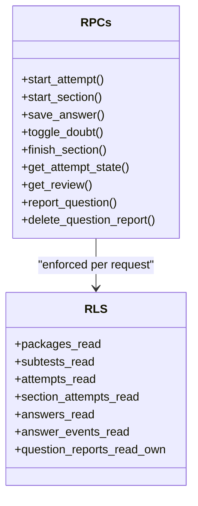

**Diagram sources**
- [schema.sql:341-657](file://supabase/schema.sql#L341-L657)
- [schema.sql:131-181](file://supabase/schema.sql#L131-L181)
- [schema_v2_reports.sql:90-176](file://supabase/schema_v2_reports.sql#L90-L176)

**Section sources**
- [schema.sql:341-657](file://supabase/schema.sql#L341-L657)
- [schema_v2_reports.sql:90-176](file://supabase/schema_v2_reports.sql#L90-L176)

### Protecting Exam Integrity and Answer Keys
- Grading occurs server-side using answer keys; clients never receive correct options during active sections.
- Review responses expose keys only for finished sections owned by the caller.
- Attempt state and review endpoints validate ownership before returning any sensitive data.

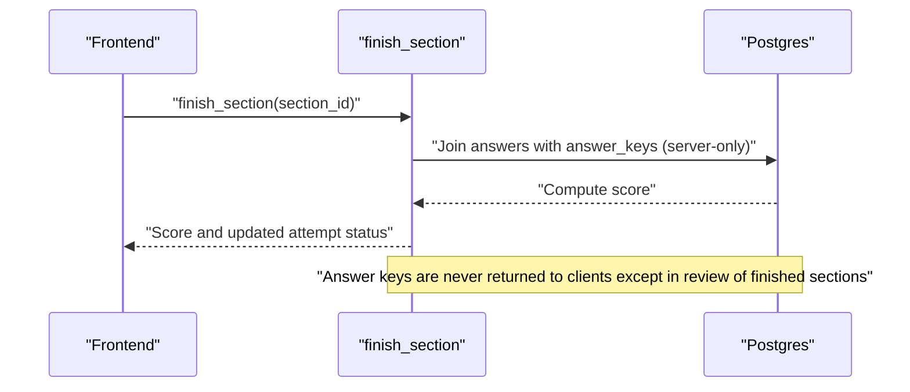

**Diagram sources**
- [schema.sql:551-580](file://supabase/schema.sql#L551-L580)
- [schema.sql:612-657](file://supabase/schema.sql#L612-L657)

**Section sources**
- [schema.sql:551-580](file://supabase/schema.sql#L551-L580)
- [schema.sql:612-657](file://supabase/schema.sql#L612-L657)

### Storage Bucket Security for Question Images
- The bucket is marked public for read access so images can be fetched without authentication.
- Uploads are performed by tooling using service-level credentials; clients do not have write permissions.
- A storage object policy permits SELECT for both anonymous and authenticated roles on the designated bucket.

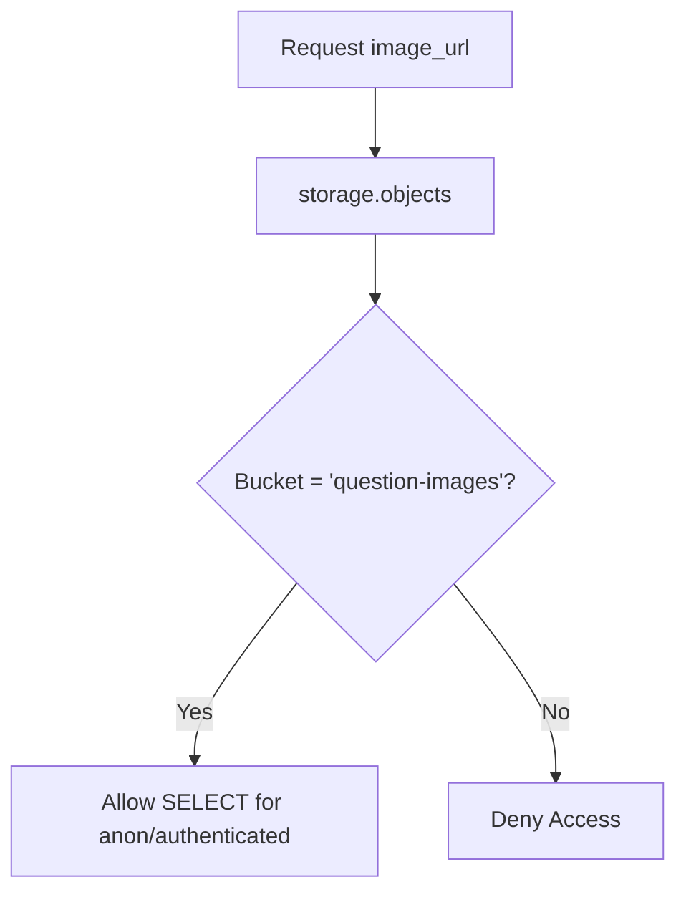

**Diagram sources**
- [schema.sql:663-672](file://supabase/schema.sql#L663-L672)

**Section sources**
- [schema.sql:663-672](file://supabase/schema.sql#L663-L672)

### Rate Limiting Mechanisms
- Per-user attempt creation is limited to a rolling hourly budget to prevent abuse and excessive row growth.
- Reporting questions is rate-limited per user per hour to mitigate spam and resource exhaustion.
- Frontend retries avoid retrying terminal error codes produced by these limits.

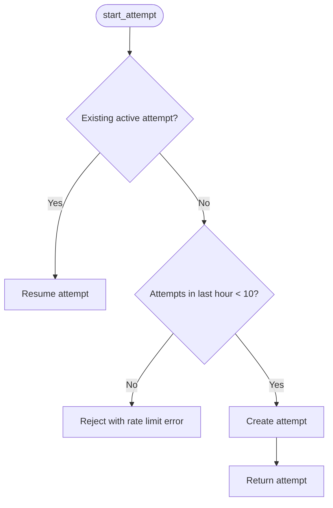

**Diagram sources**
- [schema_v3.sql:709-758](file://supabase/schema_v3.sql#L709-L758)
- [schema_v2_reports.sql:139-144](file://supabase/schema_v2_reports.sql#L139-L144)
- [api.ts:97-122](file://web/src/lib/api.ts#L97-L122)

**Section sources**
- [schema_v3.sql:709-758](file://supabase/schema_v3.sql#L709-L758)
- [schema_v2_reports.sql:139-144](file://supabase/schema_v2_reports.sql#L139-L144)
- [api.ts:97-122](file://web/src/lib/api.ts#L97-L122)

### Capacity Guard Implementation
- A global capacity snapshot tracks database size and estimated attempt rows, with configurable soft limits.
- New attempts are refused when capacity thresholds are exceeded; existing attempts continue uninterrupted.
- The UI uses a service status endpoint to display acceptance state and usage percentage.

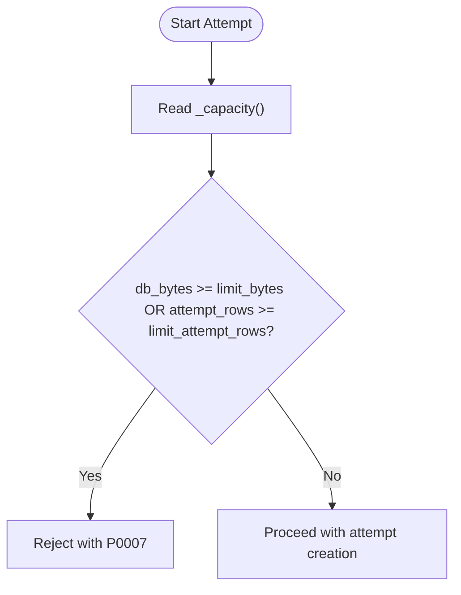

**Diagram sources**
- [CAPACITY_GUARD.md:81-96](file://docs/CAPACITY_GUARD.md#L81-L96)
- [schema.sql:395-415](file://supabase/schema.sql#L395-L415)
- [schema_v3.sql:709-758](file://supabase/schema_v3.sql#L709-L758)

**Section sources**
- [CAPACITY_GUARD.md:1-161](file://docs/CAPACITY_GUARD.md#L1-L161)
- [schema.sql:395-415](file://supabase/schema.sql#L395-L415)
- [schema_v3.sql:709-758](file://supabase/schema_v3.sql#L709-L758)

### Scheduled Maintenance and Retention
- Daily jobs prune attempts older than seven days and delete inactive anonymous users who have not filed reports.
- A periodic job refreshes the capacity snapshot to keep the guard accurate.
- Operator notification is queued via a secure function that invokes an Edge Function with vault secrets.

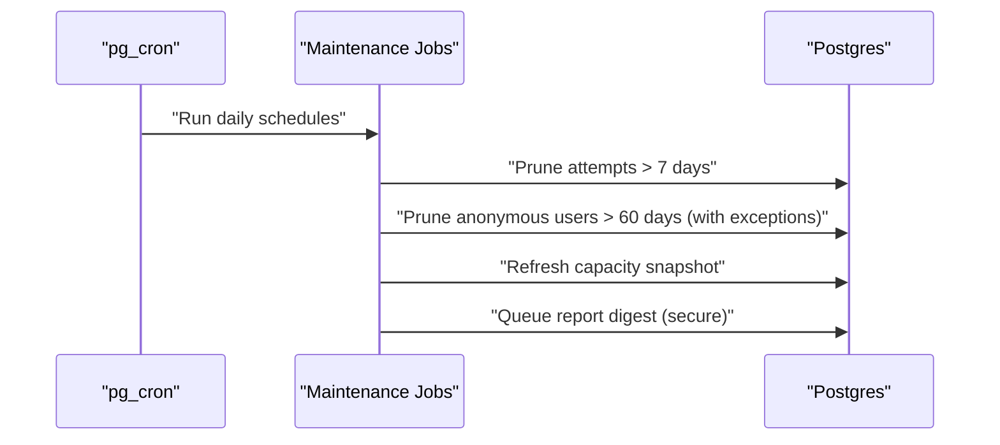

**Diagram sources**
- [maintenance.sql:31-51](file://supabase/maintenance.sql#L31-L51)
- [maintenance.sql:64-73](file://supabase/maintenance.sql#L64-L73)
- [maintenance.sql:87-152](file://supabase/maintenance.sql#L87-L152)

**Section sources**
- [maintenance.sql:1-167](file://supabase/maintenance.sql#L1-L167)

## Dependency Analysis
- The frontend depends on the Supabase client library and selects either a local mock/offline implementation or the live API at build time.
- Backend dependencies include Postgres extensions (e.g., pgcrypto), pg_cron for scheduling, and optional network/vault integrations for operator workflows.
- Versioned schema files extend core functionality while preserving idempotency and final authority for grants and RPC definitions.

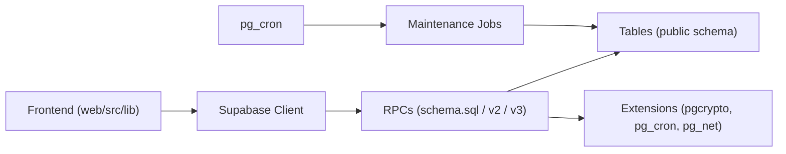

**Diagram sources**
- [api.ts:1-128](file://web/src/lib/api.ts#L1-L128)
- [schema_v3.sql:14-14](file://supabase/schema_v3.sql#L14-L14)
- [maintenance.sql:18-20](file://supabase/maintenance.sql#L18-L20)

**Section sources**
- [api.ts:1-128](file://web/src/lib/api.ts#L1-L128)
- [schema_v3.sql:14-14](file://supabase/schema_v3.sql#L14-L14)
- [maintenance.sql:18-20](file://supabase/maintenance.sql#L18-L20)

## Performance Considerations
- RLS policies and server-side functions minimize client-side trust assumptions and reduce attack surface.
- Capacity guard measurements leverage catalog statistics to remain O(1) even as tables grow.
- Event logging is capped per section to bound storage growth and prevent abuse.
- Scheduled pruning reduces long-term storage pressure and keeps the system within free-tier constraints.

[No sources needed since this section provides general guidance]

## Troubleshooting Guide
- If new attempts are rejected with a capacity error, check the service status endpoint and capacity snapshot; existing attempts remain usable.
- If rate limit errors occur, wait for the rolling window to expire; retries should not target terminal error codes.
- If storage reads fail, verify bucket policies and that image URLs point to the public bucket.
- For persistent issues, inspect cron job runs and failures to ensure maintenance tasks are executing.

**Section sources**
- [CAPACITY_GUARD.md:98-135](file://docs/CAPACITY_GUARD.md#L98-L135)
- [api.ts:97-122](file://web/src/lib/api.ts#L97-L122)
- [maintenance.sql:154-167](file://supabase/maintenance.sql#L154-L167)

## Conclusion
The backend enforces a robust security model centered on server-authoritative grading, strict RLS-based data isolation, and controlled access to sensitive content like answer keys. Anonymous authentication simplifies access while maintaining per-user isolation. Rate limits and a capacity guard protect availability and integrity under load. Scheduled maintenance ensures long-term sustainability and compliance with storage constraints. Together, these mechanisms safeguard exam integrity and user privacy in an educational testing environment.

[No sources needed since this section summarizes without analyzing specific files]

## Appendices

### Security Best Practices Summary
- Enforce all mutations through RPCs; revoke direct table access.
- Use RLS to scope reads to published content and user-owned data.
- Never expose answer keys via direct queries; restrict to server functions for grading and review.
- Configure storage buckets with least privilege; allow public read only for necessary assets.
- Apply rate limits and capacity guards to prevent abuse and outages.
- Schedule retention and cleanup to manage growth and meet quota constraints.

[No sources needed since this section provides general guidance]

### Compliance Considerations
- Minimize personal data retention by pruning attempts and anonymous users after defined periods.
- Avoid storing sensitive information in logs; cap event logs per section.
- Provide clear operational controls for capacity and retention to align with service-level commitments.

[No sources needed since this section provides general guidance]