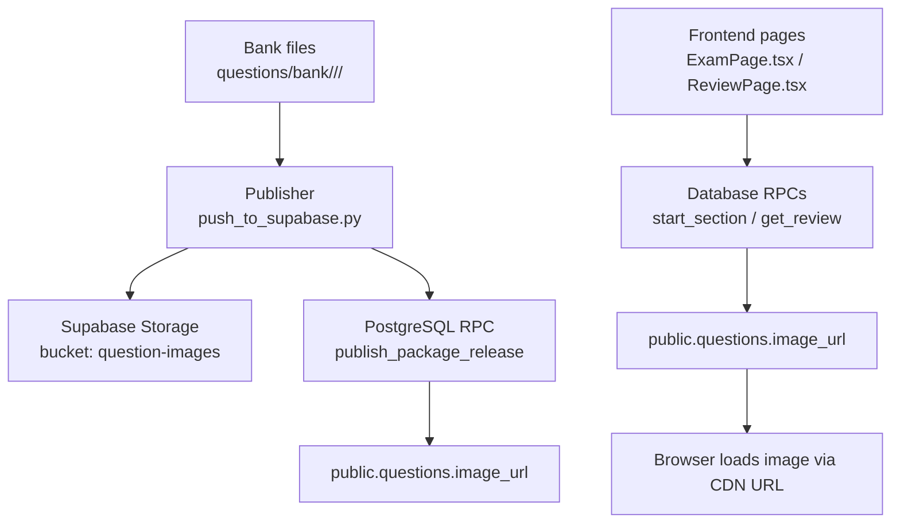
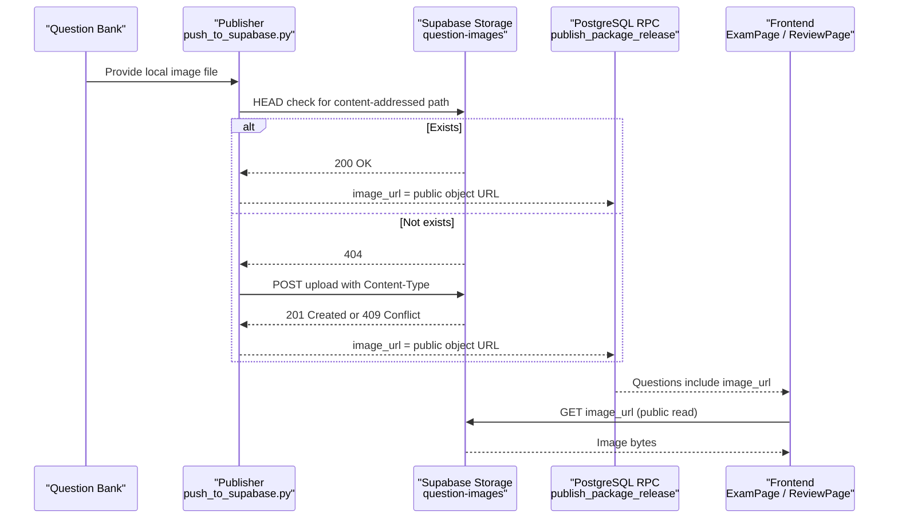
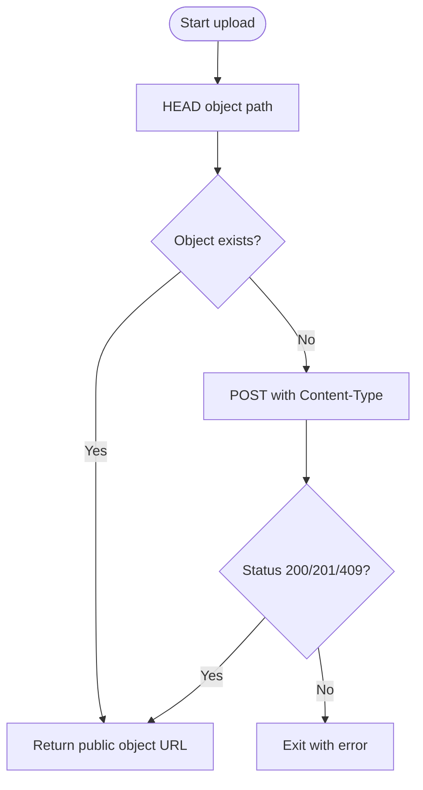
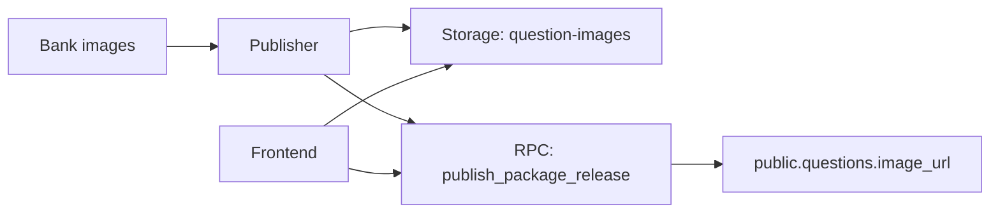

# Storage Management

<cite>
**Referenced Files in This Document**
- [schema.sql](file://supabase/schema.sql)
- [maintenance.sql](file://supabase/maintenance.sql)
- [push_to_supabase.py](file://questions/generator/push_to_supabase.py)
- [CAPACITY_GUARD.md](file://docs/CAPACITY_GUARD.md)
- [ExamPage.tsx](file://web/src/pages/ExamPage.tsx)
- [ReviewPage.tsx](file://web/src/pages/ReviewPage.tsx)
- [bank-reader.ts](file://web/vite/bank-reader.ts)
- [types.ts](file://web/src/lib/types.ts)
</cite>

## Table of Contents
1. [Introduction](#introduction)
2. [Project Structure](#project-structure)
3. [Core Components](#core-components)
4. [Architecture Overview](#architecture-overview)
5. [Detailed Component Analysis](#detailed-component-analysis)
6. [Dependency Analysis](#dependency-analysis)
7. [Performance Considerations](#performance-considerations)
8. [Troubleshooting Guide](#troubleshooting-guide)
9. [Conclusion](#conclusion)
10. [Appendices](#appendices)

## Introduction
This document explains how question images and assets are stored, referenced, and served in the Supabase Storage system for this project. It covers:
- The question-images bucket configuration and public read policy
- How images are uploaded during content publishing
- How image URLs are stored in the database schema and consumed by the frontend
- Optimization strategies, including content addressing and CDN-friendly URLs
- Backup, retention, and quota management related to storage growth
- Troubleshooting common issues and performance techniques

## Project Structure
The storage-related pieces span three layers:
- Database layer: defines tables that reference images and provisions the storage bucket and policies
- Publishing pipeline: uploads images to a content-addressed path and records their URLs in the database
- Frontend layer: renders images using the URLs returned from the database

**Diagram sources**
- [push_to_supabase.py:77-105](file://questions/generator/push_to_supabase.py#L77-L105)
- [schema.sql:37-47](file://supabase/schema.sql#L37-L47)
- [schema.sql:663-672](file://supabase/schema.sql#L663-L672)
- [ExamPage.tsx:288-289](file://web/src/pages/ExamPage.tsx#L288-L289)
- [ReviewPage.tsx:388-389](file://web/src/pages/ReviewPage.tsx#L388-L389)

**Section sources**
- [schema.sql:37-47](file://supabase/schema.sql#L37-L47)
- [schema.sql:663-672](file://supabase/schema.sql#L663-L672)
- [push_to_supabase.py:77-105](file://questions/generator/push_to_supabase.py#L77-L105)
- [ExamPage.tsx:288-289](file://web/src/pages/ExamPage.tsx#L288-L289)
- [ReviewPage.tsx:388-389](file://web/src/pages/ReviewPage.tsx#L388-L389)

## Core Components
- Storage bucket and policy:
  - Bucket: question-images (public = true)
  - Policy: allows anonymous and authenticated users to SELECT (read) objects in this bucket
- Database schema:
  - public.questions includes an image_url column used to point to the stored asset
- Publisher:
  - Uploads images under content-addressed paths based on SHA-256
  - Returns a public object URL for embedding in the database
- Frontend:
  - Reads questions via RPCs and renders images directly from image_url

**Section sources**
- [schema.sql:37-47](file://supabase/schema.sql#L37-L47)
- [schema.sql:663-672](file://supabase/schema.sql#L663-L672)
- [push_to_supabase.py:77-105](file://questions/generator/push_to_supabase.py#L77-L105)
- [ExamPage.tsx:288-289](file://web/src/pages/ExamPage.tsx#L288-L289)
- [ReviewPage.tsx:388-389](file://web/src/pages/ReviewPage.tsx#L388-L389)

## Architecture Overview
End-to-end flow for question images:

**Diagram sources**
- [push_to_supabase.py:77-105](file://questions/generator/push_to_supabase.py#L77-L105)
- [schema.sql:663-672](file://supabase/schema.sql#L663-L672)
- [ExamPage.tsx:288-289](file://web/src/pages/ExamPage.tsx#L288-L289)
- [ReviewPage.tsx:388-389](file://web/src/pages/ReviewPage.tsx#L388-L389)

## Detailed Component Analysis

### Storage Bucket and Policies
- Bucket provisioning:
  - The schema creates the question-images bucket and sets it to public
- Read policy:
  - A storage.objects policy grants SELECT to anon and authenticated roles for the question-images bucket
- Operational note:
  - If policy creation fails due to restricted DDL, create the same public-read policy via the Storage dashboard

**Section sources**
- [schema.sql:663-672](file://supabase/schema.sql#L663-L672)

### Database Schema Reference for Images
- The questions table stores image references:
  - Column image_url is included in question payloads returned by RPCs
- RPCs return image_url alongside other question fields so the frontend can render images without extra calls

**Section sources**
- [schema.sql:37-47](file://supabase/schema.sql#L37-L47)

### Image Upload Procedure (Publisher)
- Content addressing:
  - Each image is stored at a path derived from package id, question id, and the file’s SHA-256 hash
  - This ensures immutability and deduplication across packages
- Upload logic:
  - Probe existence via HEAD; if missing, upload with correct Content-Type
  - Handle concurrent uploads gracefully (409 means another process already created the object)
- URL construction:
  - Returns a public object URL suitable for direct browser loading

**Diagram sources**
- [push_to_supabase.py:77-105](file://questions/generator/push_to_supabase.py#L77-L105)

**Section sources**
- [push_to_supabase.py:77-105](file://questions/generator/push_to_supabase.py#L77-L105)

### Frontend Access to Images
- Data source:
  - Frontend receives questions through RPCs that include image_url
- Rendering:
  - ExamPage and ReviewPage conditionally render an  tag when image_url is present
- Type contract:
  - Types define image_url as nullable string on question models

**Section sources**
- [ExamPage.tsx:288-289](file://web/src/pages/ExamPage.tsx#L288-L289)
- [ReviewPage.tsx:388-389](file://web/src/pages/ReviewPage.tsx#L388-L389)
- [types.ts:54](file://web/src/lib/types.ts#L54)

### Image URL Rendering in Build-Time Artifact
- The build-time reader maps bank items to a model where image_url is set for questions that carry figures
- This supports offline or artifact-based rendering scenarios

**Section sources**
- [bank-reader.ts:40](file://web/vite/bank-reader.ts#L40)
- [bank-reader.ts:245](file://web/vite/bank-reader.ts#L245)

## Dependency Analysis
- Publisher depends on:
  - Local bank files for images
  - Supabase Storage API for uploads
  - PostgreSQL RPC endpoint to persist question metadata and image_url
- Frontend depends on:
  - Supabase RPCs to fetch questions with image_url
  - Public read access to the question-images bucket for direct image retrieval

**Diagram sources**
- [push_to_supabase.py:77-105](file://questions/generator/push_to_supabase.py#L77-L105)
- [schema.sql:37-47](file://supabase/schema.sql#L37-L47)
- [schema.sql:663-672](file://supabase/schema.sql#L663-L672)
- [ExamPage.tsx:288-289](file://web/src/pages/ExamPage.tsx#L288-L289)
- [ReviewPage.tsx:388-389](file://web/src/pages/ReviewPage.tsx#L388-L389)

**Section sources**
- [push_to_supabase.py:77-105](file://questions/generator/push_to_supabase.py#L77-L105)
- [schema.sql:37-47](file://supabase/schema.sql#L37-L47)
- [schema.sql:663-672](file://supabase/schema.sql#L663-L672)

## Performance Considerations
- Content addressing reduces duplicate storage and enables safe retries
- Public bucket URLs are cacheable and compatible with CDN integration
- Avoid unnecessary re-uploads by checking object existence before upload
- Keep images appropriately sized to minimize bandwidth and storage usage

[No sources needed since this section provides general guidance]

## Troubleshooting Guide
- Upload failures:
  - Non-2xx status codes during upload cause the publisher to exit with details; verify network, credentials, and bucket permissions
- Concurrent uploads:
  - 409 Conflict indicates another process created the same content-addressed path; treat as success and reuse the URL
- Missing images:
  - Ensure the local image path exists before publishing; the publisher validates presence
- Frontend not showing images:
  - Confirm image_url is present in the question payload and that the bucket policy allows public reads
- Capacity limits affecting writes:
  - When storage capacity thresholds are reached, new attempts are refused; existing sessions continue unaffected

**Section sources**
- [push_to_supabase.py:77-105](file://questions/generator/push_to_supabase.py#L77-L105)
- [CAPACITY_GUARD.md:1-161](file://docs/CAPACITY_GUARD.md#L1-L161)

## Conclusion
Images for questions are stored in a dedicated, publicly readable Supabase Storage bucket and referenced via image_url in the database. The publisher uses content addressing to ensure immutability and efficient deduplication. The frontend consumes these URLs directly from RPC responses. Retention and capacity controls help manage storage growth, while CDN-friendly URLs enable performance optimization.

[No sources needed since this section summarizes without analyzing specific files]

## Appendices

### Backup and Recovery Procedures
- Database-level backups:
  - Use Supabase native backup mechanisms to capture PostgreSQL state, which includes all data referencing image URLs
- Storage-level recovery:
  - Since images are content-addressed by SHA-256, identical files can be re-uploaded to the same path if needed
- Operational notes:
  - The maintenance jobs prune old attempts and anonymous users; they do not delete stored images unless explicitly managed outside this codebase

**Section sources**
- [maintenance.sql:22-73](file://supabase/maintenance.sql#L22-L73)

### Retention Policies
- Attempts and associated data are pruned daily for older than 7 days
- Anonymous users are pruned after 60 days unless they have retained reports
- These sweeps reduce database size but do not automatically remove stored images

**Section sources**
- [maintenance.sql:22-73](file://supabase/maintenance.sql#L22-L73)

### Storage Quota Management
- Capacity guard enforces soft limits to prevent free-tier exhaustion
- Limits are configurable via data updates without redeploying code
- UI reflects whether new attempts are accepted based on current capacity

**Section sources**
- [CAPACITY_GUARD.md:1-161](file://docs/CAPACITY_GUARD.md#L1-L161)

### Image Compression Guidelines
- Compress images prior to upload to reduce storage and bandwidth costs
- Prefer modern formats (e.g., WebP) when appropriate for target browsers
- Maintain sufficient resolution for readability while minimizing file size

[No sources needed since this section provides general guidance]

### CDN Integration
- The public object URLs are well-suited for CDN caching
- Configure your CDN origin to forward requests to the Supabase Storage public endpoints
- Enable caching headers for static image assets to improve load times

[No sources needed since this section provides general guidance]