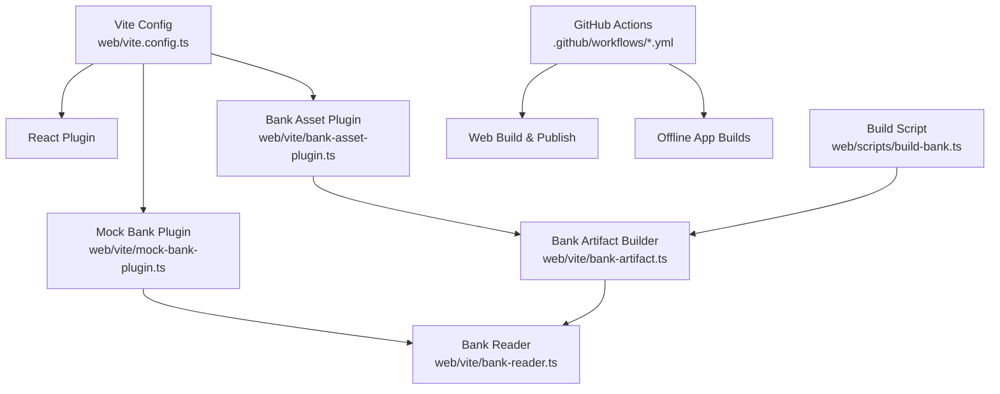
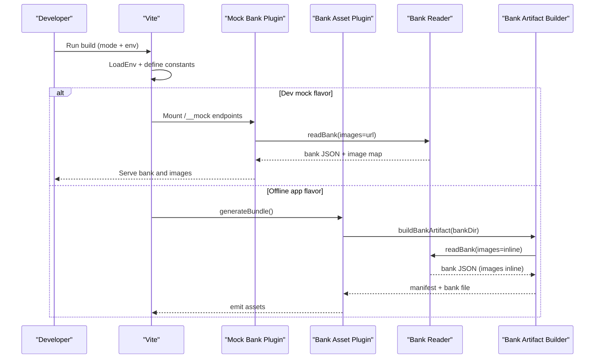
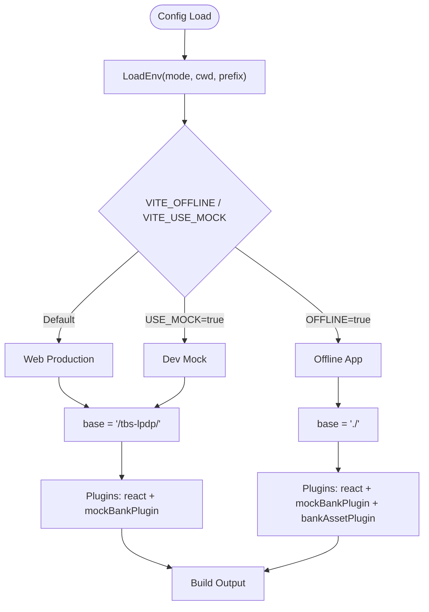
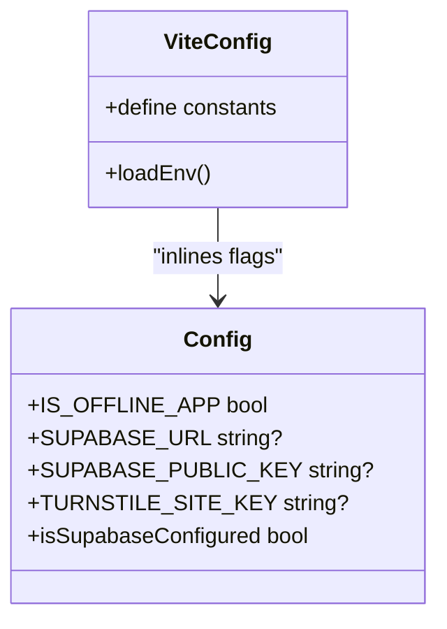
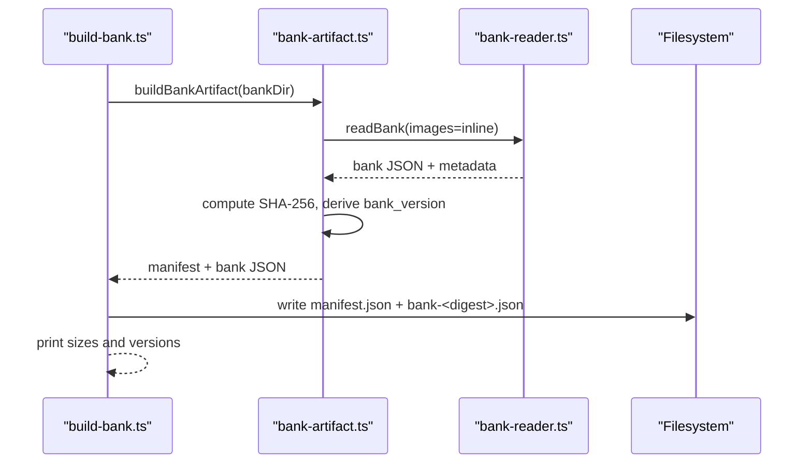
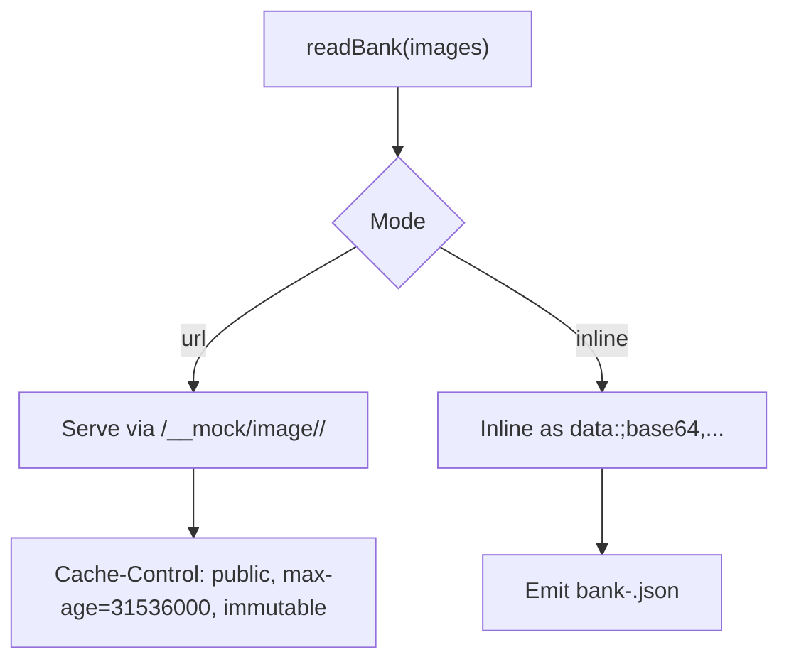
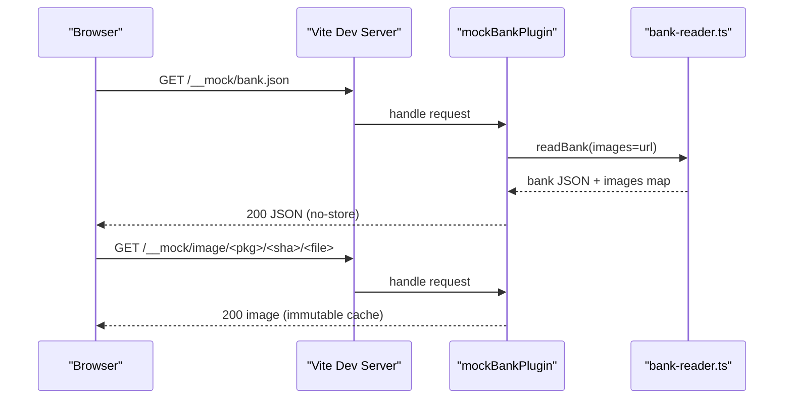
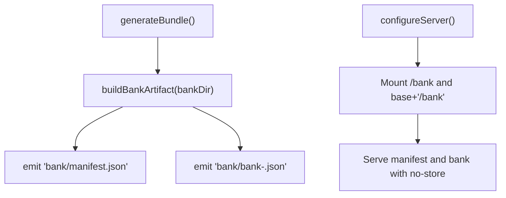
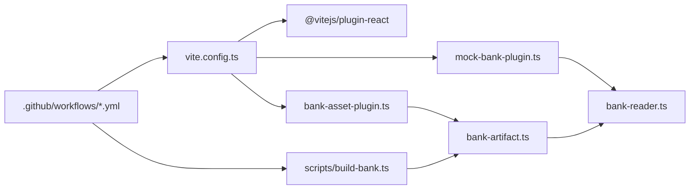

# Build System

<cite>
**Referenced Files in This Document**
- [vite.config.ts](file://web/vite.config.ts)
- [package.json](file://web/package.json)
- [bank-artifact.ts](file://web/vite/bank-artifact.ts)
- [bank-asset-plugin.ts](file://web/vite/bank-asset-plugin.ts)
- [mock-bank-plugin.ts](file://web/vite/mock-bank-plugin.ts)
- [bank-reader.ts](file://web/vite/bank-reader.ts)
- [build-bank.ts](file://web/scripts/build-bank.ts)
- [config.ts](file://web/src/lib/config.ts)
- [bankSchema.ts](file://web/src/lib/bankSchema.ts)
- [deploy-web.yml](file://.github/workflows/deploy-web.yml)
- [release-app.yml](file://.github/workflows/release-app.yml)
</cite>

## Table of Contents
1. [Introduction](#introduction)
2. [Project Structure](#project-structure)
3. [Core Components](#core-components)
4. [Architecture Overview](#architecture-overview)
5. [Detailed Component Analysis](#detailed-component-analysis)
6. [Dependency Analysis](#dependency-analysis)
7. [Performance Considerations](#performance-considerations)
8. [Troubleshooting Guide](#troubleshooting-guide)
9. [Conclusion](#conclusion)
10. [Appendices](#appendices)

## Introduction
This document explains the build system for the TBS LPDP Try Out project, focusing on Vite configuration, three build flavors (web production, dev mock, offline app), environment variable handling, platform-specific optimizations, bank artifact generation, asset optimization strategies, bundle analysis techniques, custom plugins, performance tips, caching strategies, and troubleshooting guidance. It also provides examples of different build commands and their outputs.

## Project Structure
The build system is centered around the web application with Vite as the bundler and TypeScript for type safety. The question bank lives outside the web directory and is compiled into artifacts consumed by both the web and offline app builds. CI/CD workflows orchestrate publishing to GitHub Pages and building multi-platform offline installers.

**Diagram sources**
- [vite.config.ts:1-54](file://web/vite.config.ts#L1-L54)
- [mock-bank-plugin.ts:1-52](file://web/vite/mock-bank-plugin.ts#L1-L52)
- [bank-asset-plugin.ts:1-58](file://web/vite/bank-asset-plugin.ts#L1-L58)
- [bank-artifact.ts:1-56](file://web/vite/bank-artifact.ts#L1-L56)
- [bank-reader.ts:1-298](file://web/vite/bank-reader.ts#L1-L298)
- [build-bank.ts:1-81](file://web/scripts/build-bank.ts#L1-L81)
- [deploy-web.yml:1-133](file://.github/workflows/deploy-web.yml#L1-L133)
- [release-app.yml:1-310](file://.github/workflows/release-app.yml#L1-L310)

**Section sources**
- [vite.config.ts:1-54](file://web/vite.config.ts#L1-L54)
- [package.json:1-46](file://web/package.json#L1-L46)
- [deploy-web.yml:1-133](file://.github/workflows/deploy-web.yml#L1-L133)
- [release-app.yml:1-310](file://.github/workflows/release-app.yml#L1-L310)

## Core Components
- Vite configuration defines three flavors via environment flags and inlined constants to ensure dead code elimination per flavor.
- Custom plugins provide a mock backend for development and an offline asset bundling step for the app flavor.
- A shared bank reader compiles the git-backed question bank into a structured format used by both dev and production flows.
- A dedicated script produces immutable, content-addressed bank artifacts for distribution and offline use.
- Environment variables are centralized and guarded to prevent sensitive data or local engine code from leaking into bundles.

Key responsibilities:
- Flavor selection and base path configuration for GitHub Pages vs Tauri webviews.
- Mock bank serving during development without shipping answer keys.
- Offline app bundling of manifest and bank files for zero-connectivity installs.
- Content-addressed bank artifacts with reproducible manifests.

**Section sources**
- [vite.config.ts:10-52](file://web/vite.config.ts#L10-L52)
- [mock-bank-plugin.ts:1-52](file://web/vite/mock-bank-plugin.ts#L1-L52)
- [bank-asset-plugin.ts:1-58](file://web/vite/bank-asset-plugin.ts#L1-L58)
- [bank-reader.ts:1-298](file://web/vite/bank-reader.ts#L1-L298)
- [build-bank.ts:1-81](file://web/scripts/build-bank.ts#L1-L81)
- [config.ts:1-68](file://web/src/lib/config.ts#L1-L68)

## Architecture Overview
The build system supports three flavors through environment-driven branching and plugin composition:

- Web production: default mode; serves Supabase-backed API; base path set for GitHub Pages.
- Dev mock: enables local exam engine and serves bank via middleware; never included in production bundles.
- Offline app: includes bundled bank assets and disables network-dependent features; optimized targets for Tauri platforms.

**Diagram sources**
- [vite.config.ts:18-52](file://web/vite.config.ts#L18-L52)
- [mock-bank-plugin.ts:21-52](file://web/vite/mock-bank-plugin.ts#L21-L52)
- [bank-asset-plugin.ts:13-58](file://web/vite/bank-asset-plugin.ts#L13-L58)
- [bank-reader.ts:159-298](file://web/vite/bank-reader.ts#L159-L298)
- [bank-artifact.ts:25-56](file://web/vite/bank-artifact.ts#L25-L56)

## Detailed Component Analysis

### Vite Configuration and Flavors
- Flavor selection uses environment variables loaded at config time and inlined into the bundle to enable tree-shaking of backends.
- Base path is relative for Tauri webviews and absolute for GitHub Pages deployment.
- Platform target is narrowed when running under Tauri to optimize for modern WebView engines.

**Diagram sources**
- [vite.config.ts:18-52](file://web/vite.config.ts#L18-L52)

**Section sources**
- [vite.config.ts:10-52](file://web/vite.config.ts#L10-L52)

### Environment Variable Handling
- Centralized runtime configuration module exposes feature flags and credentials only when appropriate for the flavor.
- Offline app explicitly clears network-related configuration to avoid accidental inclusion of secrets or dependencies.
- CI enforces that repository variables do not flip flavors unintentionally in production.

**Diagram sources**
- [config.ts:11-43](file://web/src/lib/config.ts#L11-L43)
- [vite.config.ts:18-37](file://web/vite.config.ts#L18-L37)

**Section sources**
- [config.ts:11-43](file://web/src/lib/config.ts#L11-L43)
- [deploy-web.yml:52-76](file://.github/workflows/deploy-web.yml#L52-L76)

### Bank Artifact Generation
- The bank artifact consists of a small mutable manifest and a large immutable, content-addressed bank file.
- Manifest fields include schema versions, minimum app version, bank digest, size, and timestamp derived from commit history.
- The build script validates the bank using a Python validator before emitting artifacts and enforces presence of full git history for reproducibility.

**Diagram sources**
- [build-bank.ts:1-81](file://web/scripts/build-bank.ts#L1-L81)
- [bank-artifact.ts:25-56](file://web/vite/bank-artifact.ts#L25-L56)
- [bank-reader.ts:159-298](file://web/vite/bank-reader.ts#L159-L298)

**Section sources**
- [build-bank.ts:1-81](file://web/scripts/build-bank.ts#L1-L81)
- [bank-artifact.ts:1-56](file://web/vite/bank-artifact.ts#L1-L56)
- [bank-reader.ts:159-298](file://web/vite/bank-reader.ts#L159-L298)

### Asset Optimization Strategies
- Images are either inlined as data URIs for the offline artifact or served via a URL-based middleware in dev mode.
- The offline asset plugin emits manifest and bank files directly into the bundle so fresh installs work without connectivity.
- Development image responses are cached with long-lived immutable headers for faster reloads during iteration.

**Diagram sources**
- [bank-reader.ts:220-234](file://web/vite/bank-reader.ts#L220-L234)
- [mock-bank-plugin.ts:39-48](file://web/vite/mock-bank-plugin.ts#L39-L48)
- [bank-asset-plugin.ts:23-30](file://web/vite/bank-asset-plugin.ts#L23-L30)

**Section sources**
- [bank-reader.ts:220-234](file://web/vite/bank-reader.ts#L220-L234)
- [mock-bank-plugin.ts:39-48](file://web/vite/mock-bank-plugin.ts#L39-L48)
- [bank-asset-plugin.ts:23-30](file://web/vite/bank-asset-plugin.ts#L23-L30)

### Custom Plugins

#### Mock Bank Plugin
- Serves the compiled bank and images under a dedicated path during development.
- Ensures answer keys remain out of production bundles by applying only in serve mode.
- Caches images keyed by package and hash to support pinning attempts to older releases.

**Diagram sources**
- [mock-bank-plugin.ts:21-52](file://web/vite/mock-bank-plugin.ts#L21-L52)
- [bank-reader.ts:159-298](file://web/vite/bank-reader.ts#L159-L298)

**Section sources**
- [mock-bank-plugin.ts:1-52](file://web/vite/mock-bank-plugin.ts#L1-L52)

#### Bank Asset Plugin
- Bundles the compiled bank and manifest into the offline app’s assets.
- Provides server-side middleware during development to serve generated artifacts with strict cache control.
- Warns when git history is missing to maintain reproducibility guarantees.

**Diagram sources**
- [bank-asset-plugin.ts:13-58](file://web/vite/bank-asset-plugin.ts#L13-L58)

**Section sources**
- [bank-asset-plugin.ts:1-58](file://web/vite/bank-asset-plugin.ts#L1-L58)

### Platform-Specific Optimizations
- Tauri builds set explicit targets to match modern WebView engines, reducing polyfills and improving performance.
- Base path switches between relative and absolute depending on deployment context to ensure correct asset resolution.
- CI guards enforce flavor correctness and validate that local engine code does not leak into web production.

**Section sources**
- [vite.config.ts:38-52](file://web/vite.config.ts#L38-L52)
- [deploy-web.yml:52-96](file://.github/workflows/deploy-web.yml#L52-L96)

## Dependency Analysis
The build system composes several modules with clear separation of concerns:

**Diagram sources**
- [vite.config.ts:1-54](file://web/vite.config.ts#L1-L54)
- [mock-bank-plugin.ts:1-52](file://web/vite/mock-bank-plugin.ts#L1-L52)
- [bank-asset-plugin.ts:1-58](file://web/vite/bank-asset-plugin.ts#L1-L58)
- [bank-artifact.ts:1-56](file://web/vite/bank-artifact.ts#L1-L56)
- [bank-reader.ts:1-298](file://web/vite/bank-reader.ts#L1-L298)
- [build-bank.ts:1-81](file://web/scripts/build-bank.ts#L1-L81)
- [deploy-web.yml:1-133](file://.github/workflows/deploy-web.yml#L1-L133)
- [release-app.yml:1-310](file://.github/workflows/release-app.yml#L1-L310)

**Section sources**
- [vite.config.ts:1-54](file://web/vite.config.ts#L1-L54)
- [build-bank.ts:1-81](file://web/scripts/build-bank.ts#L1-L81)
- [deploy-web.yml:1-133](file://.github/workflows/deploy-web.yml#L1-L133)
- [release-app.yml:1-310](file://.github/workflows/release-app.yml#L1-L310)

## Performance Considerations
- Use flavor-specific builds to eliminate unused code paths and reduce bundle size.
- Inline images only for offline artifacts where necessary; prefer URL serving in dev to speed up rebuilds.
- Narrow platform targets in Tauri builds to minimize polyfills and improve runtime performance.
- Leverage immutable caching for static assets in development to accelerate hot reloads.
- Monitor bank artifact size; consider revisiting image inlining thresholds if the bank grows significantly.

[No sources needed since this section provides general guidance]

## Troubleshooting Guide
Common issues and resolutions:

- Missing git history for bank versions:
  - Symptom: Warnings about no git history; fallback versions and timestamps.
  - Resolution: Ensure CI checks out full history (fetch-depth: 0) when building bank artifacts.

- Empty or invalid bank artifact:
  - Symptom: Build fails due to empty bank or validation errors.
  - Resolution: Validate bank using the provided Python validator; ensure all required files exist.

- Local engine leaked into web production:
  - Symptom: CI asserts fail indicating local engine presence in dist.
  - Resolution: Verify environment flags are not set in production; check .env files for accidental flag leaks.

- Incorrect base path causing asset loading failures:
  - Symptom: Assets fail to load in Tauri or GitHub Pages contexts.
  - Resolution: Confirm base path logic aligns with deployment; Tauri uses relative base, Pages uses absolute.

- Android signing issues:
  - Symptom: APK cannot be verified or installed over existing version.
  - Resolution: Ensure keystore configuration and signature verification steps succeed; verify consistent signing across builds.

**Section sources**
- [bank-asset-plugin.ts:23-30](file://web/vite/bank-asset-plugin.ts#L23-L30)
- [build-bank.ts:42-70](file://web/scripts/build-bank.ts#L42-L70)
- [deploy-web.yml:52-96](file://.github/workflows/deploy-web.yml#L52-L96)
- [release-app.yml:250-296](file://.github/workflows/release-app.yml#L250-L296)

## Conclusion
The TBS LPDP Try Out build system leverages Vite’s flexibility to support multiple flavors with strong guarantees against leaking sensitive or platform-specific code. The bank artifact pipeline ensures reproducible, content-addressed distributions suitable for both web and offline contexts. Custom plugins streamline development and packaging, while CI safeguards maintain flavor integrity and security. Following the outlined performance and troubleshooting guidance will help maintain a fast, reliable build process.

[No sources needed since this section summarizes without analyzing specific files]

## Appendices

### Build Commands and Outputs
- Web development:
  - Command: npm run dev
  - Output: Vite dev server with mock bank endpoints available in development mode.

- Web production build:
  - Command: npm run build
  - Output: Compiled assets under dist/, ready for GitHub Pages deployment.

- Offline app development:
  - Command: npm run dev:app
  - Output: Vite dev server configured for Tauri with bundled bank assets served during development.

- Offline app production build:
  - Command: npm run build:app
  - Output: Tauri-compatible bundle including manifest and bank artifacts for offline use.

- Bank artifact generation:
  - Command: npm run build:bank -- --out dist/bank
  - Output: manifest.json and bank-<digest>.json emitted to the specified output directory.

- Tauri desktop/mobile builds:
  - Commands: npm run tauri, npm run app:dev, npm run app:build, npm run app:android
  - Output: Platform-specific installers and APK signed and packaged according to CI workflows.

**Section sources**
- [package.json:9-23](file://web/package.json#L9-L23)
- [build-bank.ts:1-81](file://web/scripts/build-bank.ts#L1-L81)
- [deploy-web.yml:77-101](file://.github/workflows/deploy-web.yml#L77-L101)
- [release-app.yml:115-182](file://.github/workflows/release-app.yml#L115-L182)