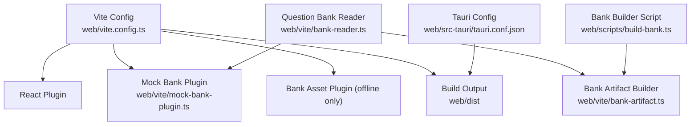
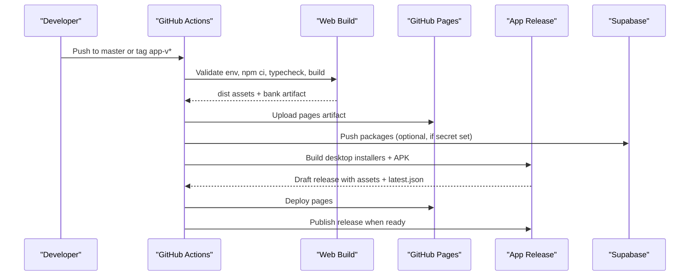
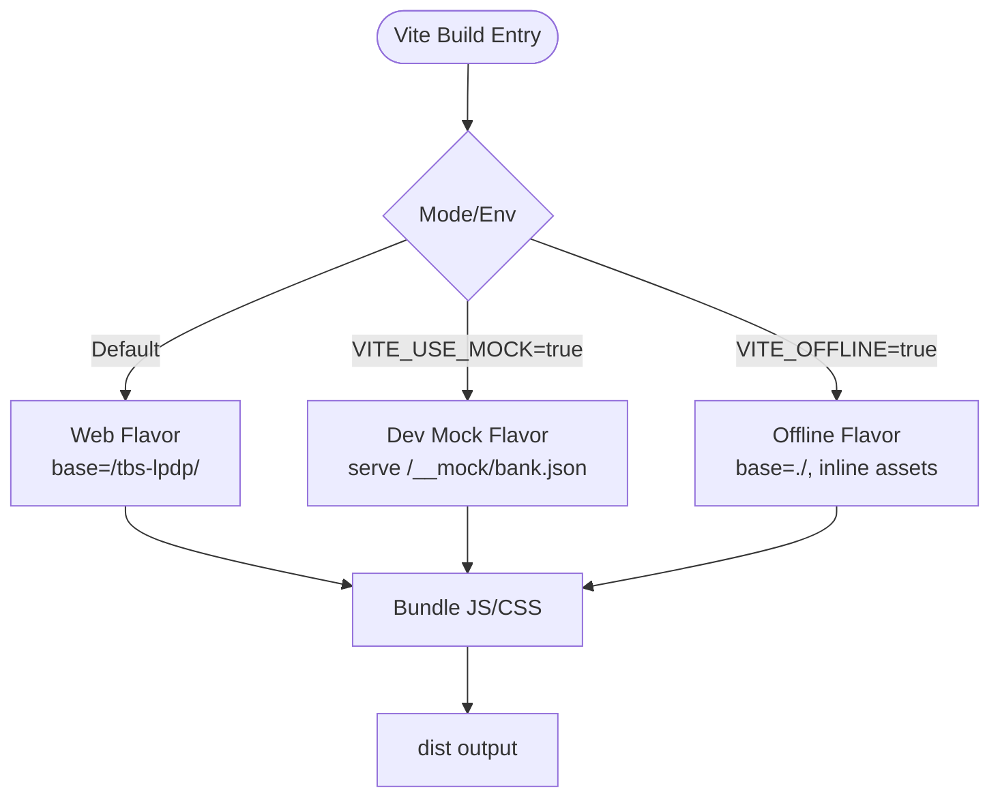
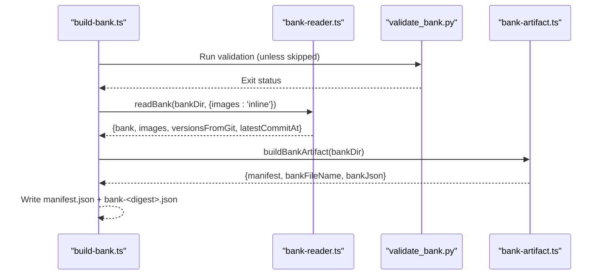
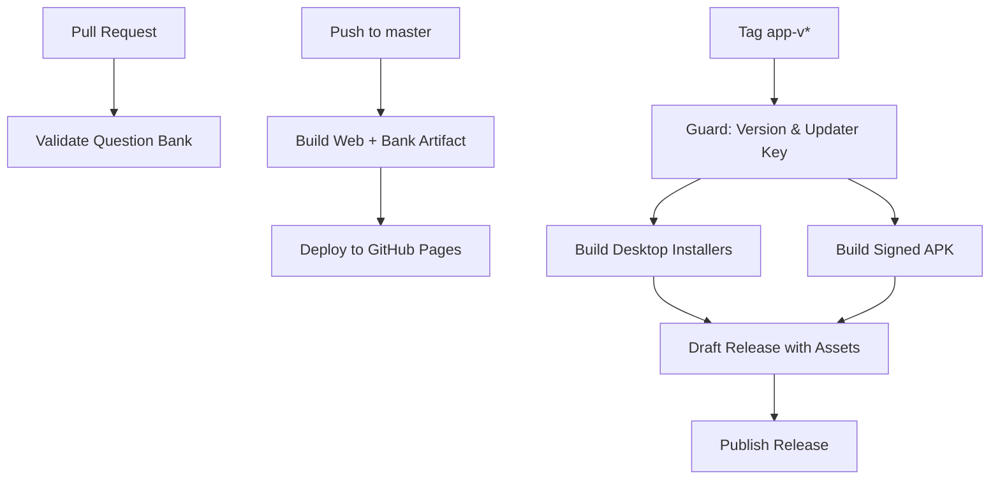
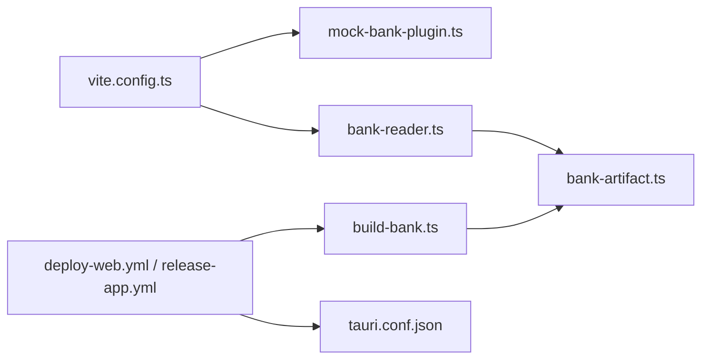

# Build and Deployment

<cite>
**Referenced Files in This Document**
- [vite.config.ts](file://web/vite.config.ts)
- [package.json](file://web/package.json)
- [deploy-web.yml](file://.github/workflows/deploy-web.yml)
- [release-app.yml](file://.github/workflows/release-app.yml)
- [pr.yml](file://.github/workflows/pr.yml)
- [build-bank.ts](file://web/scripts/build-bank.ts)
- [bank-artifact.ts](file://web/vite/bank-artifact.ts)
- [mock-bank-plugin.ts](file://web/vite/mock-bank-plugin.ts)
- [bank-reader.ts](file://web/vite/bank-reader.ts)
- [tauri.conf.json](file://web/src-tauri/tauri.conf.json)
- [config.ts](file://web/src/lib/config.ts)
- [validate_bank.py](file://questions/generator/validate_bank.py)
- [bump_version.py](file://scripts/bump_version.py)
</cite>

## Table of Contents
1. [Introduction](#introduction)
2. [Project Structure](#project-structure)
3. [Core Components](#core-components)
4. [Architecture Overview](#architecture-overview)
5. [Detailed Component Analysis](#detailed-component-analysis)
6. [Dependency Analysis](#dependency-analysis)
7. [Performance Considerations](#performance-considerations)
8. [Troubleshooting Guide](#troubleshooting-guide)
9. [Conclusion](#conclusion)
10. [Appendices](#appendices)

## Introduction
This document explains how the TBS LPDP Try Out project is built and deployed across environments:
- Web application on GitHub Pages (online, Supabase-backed)
- Offline desktop/mobile app via Tauri (bundled question bank, no backend required)
- CI/CD pipelines for automated validation, release packaging, and deployment
It also covers build flavors, asset optimization, bundle analysis guidance, caching strategies, and production monitoring approaches.

## Project Structure
The build system centers around Vite with three flavors controlled by environment flags:
- Default web flavor: builds for GitHub Pages under /tbs-lpdp/, uses Supabase APIs
- Dev mock flavor: serves a local bank fixture during development
- Offline app flavor: bundles the compiled question bank into the installer

**Diagram sources**
- [vite.config.ts:18-52](file://web/vite.config.ts#L18-L52)
- [mock-bank-plugin.ts:21-50](file://web/vite/mock-bank-plugin.ts#L21-L50)
- [bank-reader.ts:159-296](file://web/vite/bank-reader.ts#L159-L296)
- [bank-artifact.ts:25-55](file://web/vite/bank-artifact.ts#L25-L55)
- [build-bank.ts:22-81](file://web/scripts/build-bank.ts#L22-L81)
- [tauri.conf.json:6-11](file://web/src-tauri/tauri.conf.json#L6-L11)

**Section sources**
- [vite.config.ts:18-52](file://web/vite.config.ts#L18-L52)
- [package.json:9-22](file://web/package.json#L9-L22)
- [tauri.conf.json:6-11](file://web/src-tauri/tauri.conf.json#L6-L11)

## Core Components
- Build flavors and environment injection:
  - Flavor selection via VITE_OFFLINE and VITE_USE_MOCK flags; these are forced to literals so dead code elimination removes unused backends from bundles.
  - Base path differs for GitHub Pages (/tbs-lpdp/) vs offline app (./).
  - Tauri-specific target platform settings ensure compatibility with WebView engines.
- Mock bank plugin:
  - Serves the git question bank at /__mock/bank.json during development with images served through a middleware endpoint.
  - Images are cached in memory keyed by content hash to keep attempts stable across edits.
- Bank artifact generation:
  - Produces an immutable, content-addressed bank file and a small manifest pointing to it.
  - Uses git history to derive per-question versions and package versions for reproducibility.
- Tauri integration:
  - Builds the offline app using the Vite “app” mode, embedding the compiled frontend and bundling the bank snapshot.
  - Generates installers and updater metadata for desktop platforms and signs APKs for Android.

**Section sources**
- [vite.config.ts:18-52](file://web/vite.config.ts#L18-L52)
- [mock-bank-plugin.ts:21-50](file://web/vite/mock-bank-plugin.ts#L21-L50)
- [bank-artifact.ts:25-55](file://web/vite/bank-artifact.ts#L25-L55)
- [bank-reader.ts:159-296](file://web/vite/bank-reader.ts#L159-L296)
- [tauri.conf.json:6-11](file://web/src-tauri/tauri.conf.json#L6-L11)

## Architecture Overview
The CI/CD pipeline orchestrates validation, building, and publishing across environments:
- PR checks validate the question bank schema and constraints.
- Master branch pushes build and deploy the web app to GitHub Pages and publish the question bank artifact.
- Tagged releases build and sign installers for multiple platforms, generate updater artifacts, and publish a draft release that becomes live once all jobs succeed.

**Diagram sources**
- [deploy-web.yml:24-133](file://.github/workflows/deploy-web.yml#L24-L133)
- [release-app.yml:24-310](file://.github/workflows/release-app.yml#L24-L310)
- [pr.yml:10-28](file://.github/workflows/pr.yml#L10-L28)

**Section sources**
- [deploy-web.yml:24-133](file://.github/workflows/deploy-web.yml#L24-L133)
- [release-app.yml:24-310](file://.github/workflows/release-app.yml#L24-L310)
- [pr.yml:10-28](file://.github/workflows/pr.yml#L10-L28)

## Detailed Component Analysis

### Vite Build Configuration and Flavors
- Flavor control:
  - VITE_OFFLINE and VITE_USE_MOCK are defined as literals to enable tree-shaking of backend branches.
  - Base path switches between /tbs-lpdp/ for GitHub Pages and ./ for offline apps.
  - Tauri mode sets explicit targets for modern webviews.
- Plugins:
  - React plugin for JSX support.
  - Mock bank plugin for dev server endpoints serving bank JSON and images.
  - Bank asset plugin included only in offline builds to inline assets.
- Build options:
  - Source maps disabled for production.
  - Clear screen disabled to avoid interference with Tauri dev workflow.

**Diagram sources**
- [vite.config.ts:18-52](file://web/vite.config.ts#L18-L52)
- [mock-bank-plugin.ts:21-50](file://web/vite/mock-bank-plugin.ts#L21-L50)

**Section sources**
- [vite.config.ts:18-52](file://web/vite.config.ts#L18-L52)
- [package.json:9-22](file://web/package.json#L9-L22)

### Question Bank Processing and Artifacts
- Reading and compiling the bank:
  - Reads package manifests and subtest question files, compiles them into a unified structure consumed by the exam engine.
  - Derives per-question and per-package versions from git history; falls back to mtime when history is unavailable.
  - Supports two image modes: URL references for dev server and data URIs for bundled offline artifacts.
- Artifact generation:
  - Creates a content-addressed bank file named by SHA-256 digest and a manifest pointing to it.
  - Ensures deterministic output across runs over the same tree.
- Validation gate:
  - Python validator enforces schema, naming conventions, option keys, explanations coverage, image presence, numbering continuity, and blueprint counts.

**Diagram sources**
- [build-bank.ts:22-81](file://web/scripts/build-bank.ts#L22-L81)
- [bank-reader.ts:159-296](file://web/vite/bank-reader.ts#L159-L296)
- [bank-artifact.ts:25-55](file://web/vite/bank-artifact.ts#L25-L55)
- [validate_bank.py:44-203](file://questions/generator/validate_bank.py#L44-L203)

**Section sources**
- [build-bank.ts:22-81](file://web/scripts/build-bank.ts#L22-L81)
- [bank-reader.ts:159-296](file://web/vite/bank-reader.ts#L159-L296)
- [bank-artifact.ts:25-55](file://web/vite/bank-artifact.ts#L25-L55)
- [validate_bank.py:44-203](file://questions/generator/validate_bank.py#L44-L203)

### CI/CD Pipelines
- PR Check:
  - Validates the question bank using the Python validator to catch schema and blueprint issues early.
- Deploy Web to GitHub Pages:
  - Enforces that the web flavor is used (no local engine or mock flags allowed).
  - Runs type checking and build, publishes bank artifact under /tbs-lpdp/bank/.
  - Optionally pushes question packages to Supabase if service role key is configured.
  - Deploys static site via GitHub Pages action.
- Release Offline App:
  - Guard job validates tag matches tauri.conf.json version and updater pubkey configuration.
  - Desktop matrix builds installers for macOS (aarch64/x86_64), Linux (AppImage), Windows (NSIS), plus deb/rpm where applicable.
  - Android job initializes Gradle project, brands icons, configures signing, builds signed APK, verifies signature, and uploads to the draft release.
  - Publishes the draft release automatically after all jobs complete.

**Diagram sources**
- [pr.yml:10-28](file://.github/workflows/pr.yml#L10-L28)
- [deploy-web.yml:24-133](file://.github/workflows/deploy-web.yml#L24-L133)
- [release-app.yml:24-310](file://.github/workflows/release-app.yml#L24-L310)

**Section sources**
- [pr.yml:10-28](file://.github/workflows/pr.yml#L10-L28)
- [deploy-web.yml:24-133](file://.github/workflows/deploy-web.yml#L24-L133)
- [release-app.yml:24-310](file://.github/workflows/release-app.yml#L24-L310)

### Offline App Build and Distribution
- Tauri configuration:
  - Frontend distribution points to Vite’s dist output.
  - Before-build command runs the offline Vite build mode.
  - Bundler creates multiple targets including DMG, NSIS, AppImage, DEB, RPM, and Android APK.
  - Updater endpoints point to GitHub Releases for automatic updates.
- Signing and security:
  - Desktop installers are signed using a private key provided via secrets.
  - Android APK is signed with a keystore configured via secrets and verified before upload.
  - CSP restricts connect-src to trusted domains and IPC channels.

**Section sources**
- [tauri.conf.json:6-11](file://web/src-tauri/tauri.conf.json#L6-L11)
- [tauri.conf.json:37-86](file://web/src-tauri/tauri.conf.json#L37-L86)
- [tauri.conf.json:87-96](file://web/src-tauri/tauri.conf.json#L87-L96)
- [release-app.yml:59-181](file://.github/workflows/release-app.yml#L59-L181)
- [release-app.yml:183-297](file://.github/workflows/release-app.yml#L183-L297)

### Environment and Runtime Configuration
- Build-time flags:
  - IS_OFFLINE_APP derived from VITE_OFFLINE to eliminate backend dependencies in offline builds.
  - Supabase URL and public key are omitted in offline mode to prevent accidental leakage.
  - Turnstile site key is only present in online builds.
- Runtime behavior:
  - Online builds use Supabase APIs and human verification.
  - Offline builds rely on bundled bank and local engine without network calls.

**Section sources**
- [config.ts:11-43](file://web/src/lib/config.ts#L11-L43)

## Dependency Analysis
- Vite plugins depend on the bank reader to serve or compile question data.
- The bank artifact builder depends on the reader and schema constants to produce deterministic outputs.
- CI workflows orchestrate Python validation, Node builds, Rust toolchains, and Android SDK setup.
- Tauri integrates with Vite output and manages cross-platform bundling and signing.

**Diagram sources**
- [vite.config.ts:18-52](file://web/vite.config.ts#L18-L52)
- [mock-bank-plugin.ts:21-50](file://web/vite/mock-bank-plugin.ts#L21-L50)
- [bank-reader.ts:159-296](file://web/vite/bank-reader.ts#L159-L296)
- [bank-artifact.ts:25-55](file://web/vite/bank-artifact.ts#L25-L55)
- [build-bank.ts:22-81](file://web/scripts/build-bank.ts#L22-L81)
- [deploy-web.yml:24-133](file://.github/workflows/deploy-web.yml#L24-L133)
- [release-app.yml:24-310](file://.github/workflows/release-app.yml#L24-L310)
- [tauri.conf.json:6-11](file://web/src-tauri/tauri.conf.json#L6-L11)

**Section sources**
- [vite.config.ts:18-52](file://web/vite.config.ts#L18-L52)
- [bank-reader.ts:159-296](file://web/vite/bank-reader.ts#L159-L296)
- [bank-artifact.ts:25-55](file://web/vite/bank-artifact.ts#L25-L55)
- [build-bank.ts:22-81](file://web/scripts/build-bank.ts#L22-L81)
- [deploy-web.yml:24-133](file://.github/workflows/deploy-web.yml#L24-L133)
- [release-app.yml:24-310](file://.github/workflows/release-app.yml#L24-L310)
- [tauri.conf.json:6-11](file://web/src-tauri/tauri.conf.json#L6-L11)

## Performance Considerations
- Bundle size and dead code elimination:
  - Flavor flags are forced to literals to ensure unused backends are removed from bundles.
  - Avoid importing heavy libraries (e.g., Supabase client) eagerly; keep them in lazy chunks.
- Asset handling:
  - In offline builds, images are inlined as data URIs to avoid network requests.
  - Dev server caches images in memory keyed by content hash for stability.
- Caching strategies:
  - GitHub Actions cache npm and pip dependencies to speed up builds.
  - Rust toolchain and target caches reduce compilation times.
  - Browser caching headers for mock images improve dev performance.
- Monitoring approaches:
  - Use browser DevTools Network panel to analyze bundle loading and asset sizes.
  - Integrate analytics or error tracking in online builds to monitor runtime performance and errors.
  - Track updater fetches and installation success rates via GitHub Releases metrics.

[No sources needed since this section provides general guidance]

## Troubleshooting Guide
- Local engine leaked into web bundle:
  - CI asserts that neither VITE_OFFLINE nor VITE_USE_MOCK is set in the Pages build environment and scans the dist for mock engine references.
- Missing git history:
  - Bank artifact builder requires full history to derive versions; ensure checkout depth is not shallow.
- Empty or invalid bank:
  - Validator must pass before artifact generation; failures block publishing.
- Android signing issues:
  - Ensure keystore secrets are set and the generated APK signature matches expectations; verify before upload.
- Version mismatches:
  - Release guard ensures tags match tauri.conf.json version and updater pubkey is configured.

**Section sources**
- [deploy-web.yml:49-96](file://.github/workflows/deploy-web.yml#L49-L96)
- [build-bank.ts:57-70](file://web/scripts/build-bank.ts#L57-L70)
- [validate_bank.py:44-203](file://questions/generator/validate_bank.py#L44-L203)
- [release-app.yml:250-297](file://.github/workflows/release-app.yml#L250-L297)
- [release-app.yml:26-58](file://.github/workflows/release-app.yml#L26-L58)

## Conclusion
The TBS LPDP Try Out project implements a robust, multi-flavor build system with strict CI gates, deterministic artifact generation, and comprehensive release automation. The separation of concerns between web and offline builds ensures security and performance, while the question bank validation and content addressing provide reliability and reproducibility. Following the documented procedures enables safe deployments to GitHub Pages and distribution of signed installers across platforms.

[No sources needed since this section summarizes without analyzing specific files]

## Appendices

### Build Commands and Scripts
- Web development and preview:
  - Development server, type checking, and preview commands are available in package scripts.
- Offline app development and build:
  - Tauri CLI integrates with Vite to run and build the offline app.
- Bank artifact generation:
  - Standalone script produces manifest and bank files with validation and size warnings.

**Section sources**
- [package.json:9-22](file://web/package.json#L9-L22)
- [build-bank.ts:22-81](file://web/scripts/build-bank.ts#L22-L81)

### Version Management
- Bumping versions across project files:
  - Utility script updates Tauri config, Cargo files, and package version consistently.
  - Supports patch/minor/major increments or explicit version setting.

**Section sources**
- [bump_version.py:1-124](file://scripts/bump_version.py#L1-L124)