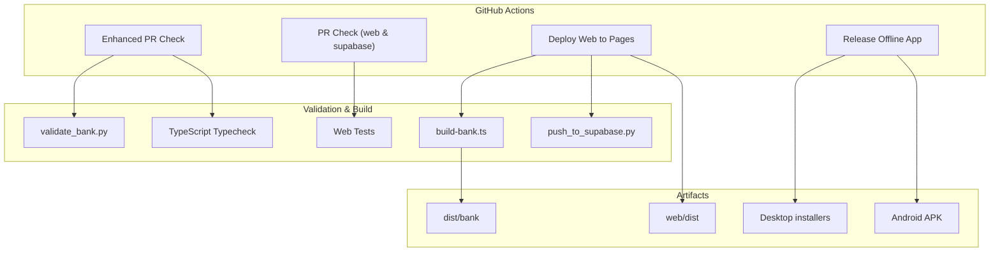
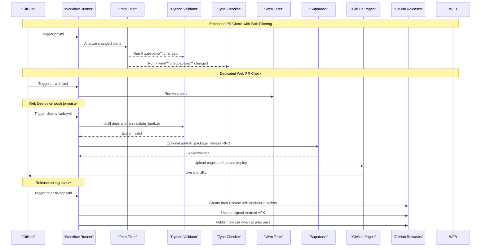
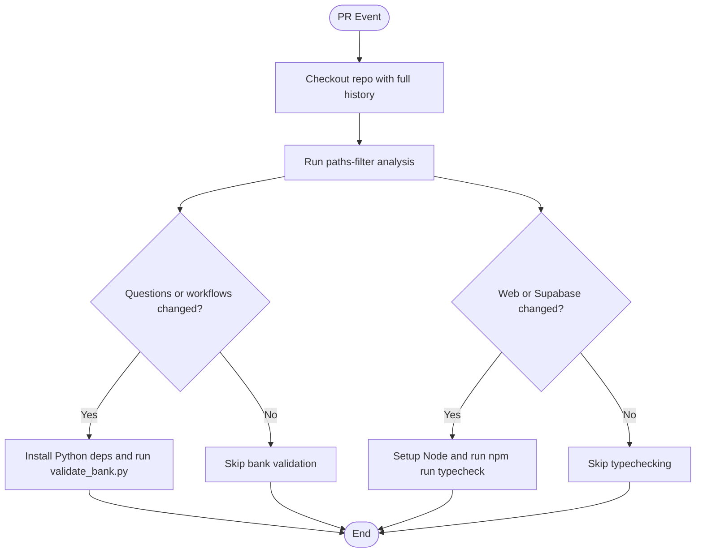
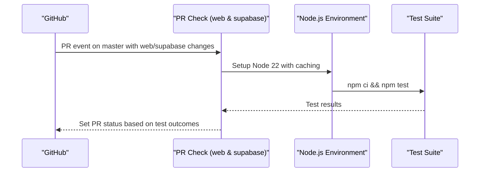
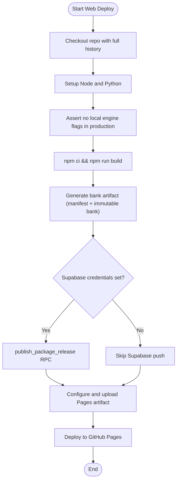
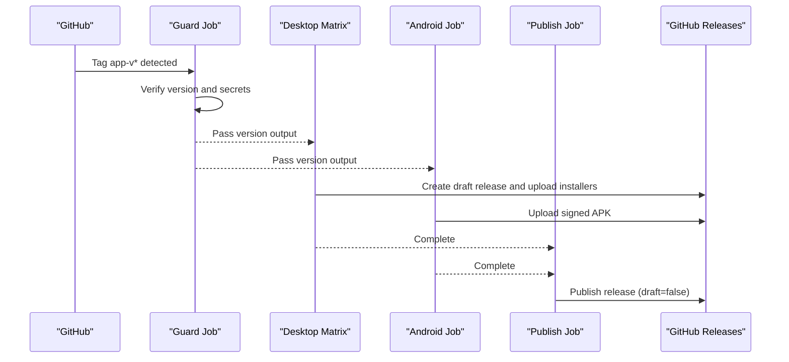
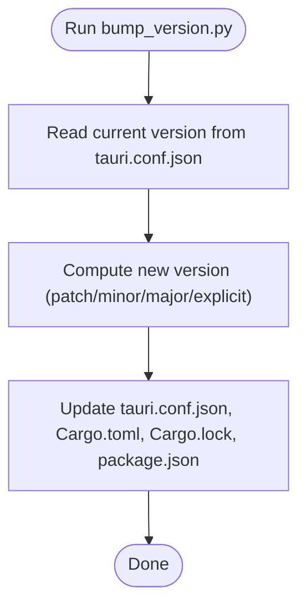
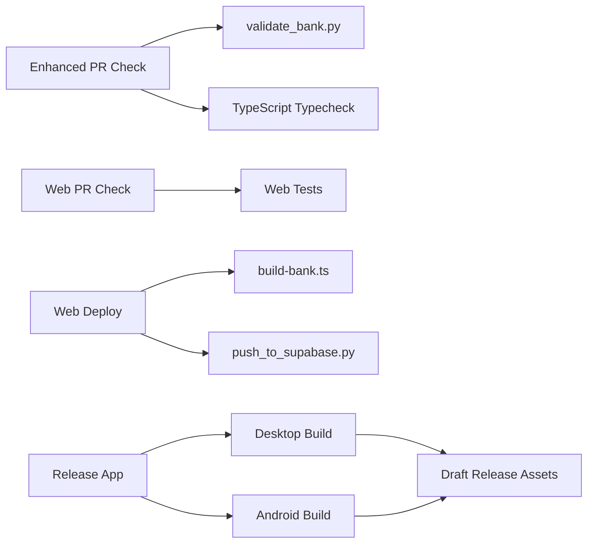

# CI/CD Pipeline

<cite>
**Referenced Files in This Document**
- [deploy-web.yml](file://.github/workflows/deploy-web.yml)
- [pr.yml](file://.github/workflows/pr.yml)
- [pr-web.yml](file://.github/workflows/pr-web.yml)
- [release-app.yml](file://.github/workflows/release-app.yml)
- [bump_version.py](file://scripts/bump_version.py)
- [validate_bank.py](file://questions/generator/validate_bank.py)
- [build-bank.ts](file://web/scripts/build-bank.ts)
- [push_to_supabase.py](file://questions/generator/push_to_supabase.py)
- [package.json](file://web/package.json)
- [tauri.conf.json](file://web/src-tauri/tauri.conf.json)
</cite>

## Update Summary
**Changes Made**
- Enhanced PR validation with path-based filtering for improved efficiency
- Added dedicated `pr-web.yml` workflow for web and Supabase changes
- Separated question bank validation from web typechecking for better performance
- Updated workflow triggers to use path filters for targeted CI execution

## Table of Contents
1. [Introduction](#introduction)
2. [Project Structure](#project-structure)
3. [Core Components](#core-components)
4. [Architecture Overview](#architecture-overview)
5. [Detailed Component Analysis](#detailed-component-analysis)
6. [Dependency Analysis](#dependency-analysis)
7. [Performance Considerations](#performance-considerations)
8. [Troubleshooting Guide](#troubleshooting-guide)
9. [Conclusion](#conclusion)
10. [Appendices](#appendices)

## Introduction
This document describes the end-to-end CI/CD pipeline for automated testing, deployment, and release management. It covers:
- GitHub Actions workflows for web deployment to GitHub Pages
- Desktop and mobile application releases (Tauri-based desktop apps and Android APK)
- Enhanced pull request validation with path-based filtering for question bank integrity
- Automated testing stages, code quality checks, and security considerations
- Deployment strategies across environments, version management, and rollback mechanisms
- Pipeline customization options, debugging failed builds, and monitoring deployment status
- Examples of triggering specific workflows and interpreting results

## Project Structure
The repository organizes CI/CD configuration under .github/workflows with four primary workflows:
- Web deployment to GitHub Pages
- **Enhanced** Pull Request validation with path-based filtering for questions, web, and Supabase changes
- **New** Dedicated PR Check workflow specifically for web and Supabase changes
- Offline app release workflow for desktop and Android

Build and validation scripts live in:
- questions/generator for Python-based validation and publishing utilities
- web/scripts for TypeScript-based bank artifact generation
- scripts for version bumping across multiple project files

**Diagram sources**
- [deploy-web.yml:1-133](file://.github/workflows/deploy-web.yml#L1-L133)
- [pr.yml:1-85](file://.github/workflows/pr.yml#L1-L85)
- [pr-web.yml:1-28](file://.github/workflows/pr-web.yml#L1-L28)
- [release-app.yml:1-310](file://.github/workflows/release-app.yml#L1-L310)
- [validate_bank.py:1-208](file://questions/generator/validate_bank.py#L1-L208)
- [build-bank.ts:1-81](file://web/scripts/build-bank.ts#L1-L81)
- [push_to_supabase.py:107-119](file://questions/generator/push_to_supabase.py#L107-L119)

**Section sources**
- [deploy-web.yml:1-133](file://.github/workflows/deploy-web.yml#L1-L133)
- [pr.yml:1-85](file://.github/workflows/pr.yml#L1-L85)
- [pr-web.yml:1-28](file://.github/workflows/pr-web.yml#L1-L28)
- [release-app.yml:1-310](file://.github/workflows/release-app.yml#L1-L310)

## Core Components
- **Enhanced** Web deployment workflow: Builds the React/Vite app, validates environment flags to prevent local engine inclusion, generates a content-addressed question bank artifact, optionally publishes packages to Supabase, and deploys to GitHub Pages.
- **Enhanced** PR validation workflow: Uses path-based filtering to route changes to appropriate validation jobs - question bank validation for questions directory changes and TypeScript typechecking for web/Supabase changes, improving efficiency by avoiding unnecessary job execution.
- **New** Dedicated PR Check workflow: Specifically targets web and Supabase changes with comprehensive test execution and type checking.
- Release workflow: Validates tag/version alignment, builds Tauri desktop installers across platforms, signs and builds an Android APK, uploads artifacts into a draft GitHub Release, and publishes it once all jobs succeed.
- Version management: A script updates version fields consistently across Tauri config, Cargo metadata, lock file, and package manifest.

Key build and validation tools:
- validate_bank.py enforces JSON schema, path conventions, option keys, passage/image requirements, numbering uniqueness, and blueprint counts.
- build-bank.ts compiles the question bank into a manifest and immutable bank file, requiring full git history for reproducible versions.
- push_to_supabase.py publishes question packages via a server-authoritative RPC endpoint with content hashing.

**Section sources**
- [deploy-web.yml:24-133](file://.github/workflows/deploy-web.yml#L24-L133)
- [pr.yml:18-85](file://.github/workflows/pr.yml#L18-L85)
- [pr-web.yml:11-28](file://.github/workflows/pr-web.yml#L11-L28)
- [release-app.yml:24-310](file://.github/workflows/release-app.yml#L24-L310)
- [validate_bank.py:44-194](file://questions/generator/validate_bank.py#L44-L194)
- [build-bank.ts:42-81](file://web/scripts/build-bank.ts#L42-L81)
- [push_to_supabase.py:107-119](file://questions/generator/push_to_supabase.py#L107-L119)
- [bump_version.py:29-124](file://scripts/bump_version.py#L29-L124)

## Architecture Overview
The enhanced CI/CD architecture orchestrates four main flows with intelligent path-based routing:
- **Enhanced** Web flow: On pushes to master affecting web or questions, build and deploy to GitHub Pages while generating and publishing the question bank artifact.
- **Enhanced** PR flow: Uses path-based filtering to route changes to appropriate validation jobs - question bank validation for questions directory changes and TypeScript typechecking for web/Supabase changes, preventing unnecessary job execution.
- **New** Dedicated web PR flow: Specifically targets web and Supabase changes with comprehensive test execution.
- Release flow: On tags matching app-v*, build and sign multi-platform desktop installers and Android APKs, then publish a single GitHub Release containing all assets and updater metadata.

**Diagram sources**
- [deploy-web.yml:24-133](file://.github/workflows/deploy-web.yml#L24-L133)
- [pr.yml:18-85](file://.github/workflows/pr.yml#L18-L85)
- [pr-web.yml:11-28](file://.github/workflows/pr-web.yml#L11-L28)
- [release-app.yml:24-310](file://.github/workflows/release-app.yml#L24-L310)
- [validate_bank.py:44-194](file://questions/generator/validate_bank.py#L44-L194)
- [build-bank.ts:42-81](file://web/scripts/build-bank.ts#L42-L81)
- [push_to_supabase.py:107-119](file://questions/generator/push_to_supabase.py#L107-L119)

## Detailed Component Analysis

### Enhanced PR Validation with Path-Based Filtering
**Updated** The PR validation workflow now uses sophisticated path-based filtering to optimize CI execution:

- **Intelligent Routing**: Uses `dorny/paths-filter@v3` to analyze changed files and route them to appropriate validation jobs
- **Bank Validation**: Runs only when questions/** or workflow files are modified
- **Web Typechecking**: Runs only when web/** or supabase/** directories are changed
- **Efficiency**: Prevents unnecessary job execution - web-only PRs don't trigger Python validation, questions-only PRs don't run TypeScript typechecking

**Diagram sources**
- [pr.yml:18-85](file://.github/workflows/pr.yml#L18-L85)
- [validate_bank.py:44-194](file://questions/generator/validate_bank.py#L44-L194)

**Section sources**
- [pr.yml:1-85](file://.github/workflows/pr.yml#L1-L85)
- [validate_bank.py:1-208](file://questions/generator/validate_bank.py#L1-L208)

### Dedicated Web and Supabase PR Check
**New** A separate workflow specifically targets web and Supabase changes:

- **Focused Scope**: Only triggers on web/**, supabase/**, or pr-web.yml changes
- **Comprehensive Testing**: Runs both npm test and type checking for complete web validation
- **Optimized Performance**: Eliminates overhead of question bank validation for web-only changes
- **Independent Execution**: Can fail independently without affecting other validation jobs

**Diagram sources**
- [pr-web.yml:11-28](file://.github/workflows/pr-web.yml#L11-L28)
- [package.json:13](file://web/package.json#L13)

**Section sources**
- [pr-web.yml:1-28](file://.github/workflows/pr-web.yml#L1-L28)
- [package.json:9-24](file://web/package.json#L9-L24)

### Web Deployment to GitHub Pages
- Triggers: Push to master when changes affect web or questions directories or the workflow itself; also supports manual dispatch.
- Concurrency: Ensures only one Pages deployment runs at a time, canceling in-progress deployments to keep the newest version.
- Environment setup: Uses Node 22 and Python 3.12; caches npm dependencies and pip packages.
- Security assertions: Prevents local engine flavors from being included in the Pages bundle by checking environment variables and built artifacts.
- Build steps: Runs type checking and Vite build; sets public environment variables for Supabase and Turnstile; generates the question bank artifact.
- Publishing: Optionally pushes question packages to Supabase using service role credentials; uploads the Pages artifact and deploys.

**Diagram sources**
- [deploy-web.yml:24-133](file://.github/workflows/deploy-web.yml#L24-L133)
- [build-bank.ts:42-81](file://web/scripts/build-bank.ts#L42-L81)
- [push_to_supabase.py:107-119](file://questions/generator/push_to_supabase.py#L107-L119)

**Section sources**
- [deploy-web.yml:1-133](file://.github/workflows/deploy-web.yml#L1-L133)
- [build-bank.ts:1-81](file://web/scripts/build-bank.ts#L1-L81)

### Offline App Release (Desktop and Android)
- Triggers: Tags matching app-v*; also supports manual dispatch.
- Guard job: Verifies tag matches tauri.conf.json version, ensures updater pubkey is configured, and checks signing secret presence.
- Desktop matrix: Builds installers for macOS (Apple Silicon and Intel), Linux (AppImage), and Windows (NSIS). Creates a draft GitHub Release with installer assets and updater metadata.
- Android job: Initializes Android project, brands launcher icons, configures release signing, builds a signed APK, verifies signature, and uploads the APK to the same release.
- Publish job: Publishes the draft release automatically after all jobs complete successfully.

**Diagram sources**
- [release-app.yml:24-310](file://.github/workflows/release-app.yml#L24-L310)
- [tauri.conf.json:87-96](file://web/src-tauri/tauri.conf.json#L87-L96)

**Section sources**
- [release-app.yml:1-310](file://.github/workflows/release-app.yml#L1-L310)
- [tauri.conf.json:1-98](file://web/src-tauri/tauri.conf.json#L1-L98)

### Version Management Procedures
- Centralized version bumping: The script updates version fields across Tauri configuration, Cargo metadata, Cargo lock, and package manifest.
- Supported modes: Increment patch/minor/major or set an explicit semver version.
- Integration: The release workflow reads the version from tauri.conf.json and expects tags to match app-v<version>.

**Diagram sources**
- [bump_version.py:29-124](file://scripts/bump_version.py#L29-L124)

**Section sources**
- [bump_version.py:1-124](file://scripts/bump_version.py#L1-L124)
- [release-app.yml:31-57](file://.github/workflows/release-app.yml#L31-L57)

## Dependency Analysis
- **Enhanced** Workflow dependencies:
  - deploy-web.yml depends on Node 22, Python 3.12, and optional Supabase credentials.
  - **Enhanced** pr.yml depends on Python 3.12 and Node 22 with intelligent path-based routing.
  - **New** pr-web.yml depends on Node 22 and executes web-specific tests.
  - release-app.yml depends on Node 22, Rust toolchain, Java 17, Android SDK/NDK, and signing secrets.
- Build-time dependencies:
  - validate_bank.py requires jsonschema and common utilities to enforce schema and blueprint constraints.
  - build-bank.ts relies on full git history to derive question versions and produces immutable artifacts.
  - push_to_supabase.py uses HTTP client to call server-authoritative RPC endpoints.
- Runtime dependencies:
  - Tauri app bundles frontend assets and includes updater configuration pointing to GitHub Releases.

**Diagram sources**
- [pr.yml:18-85](file://.github/workflows/pr.yml#L18-L85)
- [pr-web.yml:11-28](file://.github/workflows/pr-web.yml#L11-L28)
- [deploy-web.yml:24-133](file://.github/workflows/deploy-web.yml#L24-L133)
- [release-app.yml:59-310](file://.github/workflows/release-app.yml#L59-L310)
- [validate_bank.py:44-194](file://questions/generator/validate_bank.py#L44-L194)
- [build-bank.ts:42-81](file://web/scripts/build-bank.ts#L42-L81)
- [push_to_supabase.py:107-119](file://questions/generator/push_to_supabase.py#L107-L119)

**Section sources**
- [deploy-web.yml:24-133](file://.github/workflows/deploy-web.yml#L24-L133)
- [pr.yml:18-85](file://.github/workflows/pr.yml#L18-L85)
- [pr-web.yml:11-28](file://.github/workflows/pr-web.yml#L11-L28)
- [release-app.yml:59-310](file://.github/workflows/release-app.yml#L59-L310)

## Performance Considerations
- **Enhanced** Caching:
  - npm cache via actions/setup-node reduces dependency installation time.
  - pip cache via actions/setup-python speeds up Python dependency resolution.
  - Rust cache via swatinem/rust-cache accelerates native builds across matrix jobs.
- **Improved** Full history requirement:
  - Both web and release workflows use fetch-depth 0 to enable accurate question version derivation and reproducible builds.
- **Enhanced** Path-based filtering:
  - Intelligent routing prevents unnecessary job execution - web-only PRs skip Python validation, questions-only PRs skip TypeScript compilation.
  - Reduces CI queue times and resource consumption significantly.
- Artifact size:
  - Bank builder warns when the compiled bank exceeds 10 MB, suggesting future optimization such as inlining images as data URIs.
- Concurrency control:
  - Pages deployment concurrency prevents overlapping deployments and keeps the latest version.
  - Release concurrency groups per tag avoid duplicate builds for the same release.

[No sources needed since this section provides general guidance]

## Troubleshooting Guide
Common issues and resolutions:
- Local engine flags in Pages build:
  - Ensure repository variables VITE_OFFLINE and VITE_USE_MOCK are empty; the build asserts these must not be set for Pages.
  - Check .env files loaded in production mode to avoid enabling local-engine flavor.
- Missing Supabase credentials:
  - If SUPABASE_SERVICE_ROLE_KEY is not set, the workflow skips pushing to Supabase; configure secrets or variables to enable publishing.
- Question bank validation failures:
  - Review error messages from validate_bank.py to fix schema violations, missing images, incorrect option keys, or blueprint count mismatches.
- Android signing errors:
  - Ensure ANDROID_KEYSTORE_B64 and related secrets are set; verify keystore properties and signing patch execution.
  - Verify APK signature using apksigner to prevent upgrade conflicts.
- Release tag mismatch:
  - Tags must match app-v<version> where version comes from tauri.conf.json; update version via bump_version.py and commit changes before tagging.
- **Enhanced** Debugging failed builds:
  - Inspect workflow logs for step-level errors; focus on assertion steps that fail early (e.g., environment checks, signing verification).
  - For bank building, confirm full git history is checked out to avoid fallback versions.
  - **New** Check path-based filtering results to understand which validation jobs were triggered for your PR.
  - **New** Use the dedicated web PR check workflow for web-specific issues separate from question bank validation.

**Section sources**
- [deploy-web.yml:52-95](file://.github/workflows/deploy-web.yml#L52-L95)
- [release-app.yml:31-57](file://.github/workflows/release-app.yml#L31-L57)
- [release-app.yml:250-296](file://.github/workflows/release-app.yml#L250-L296)
- [validate_bank.py:44-194](file://questions/generator/validate_bank.py#L44-L194)
- [build-bank.ts:59-65](file://web/scripts/build-bank.ts#L59-L65)
- [pr.yml:18-85](file://.github/workflows/pr.yml#L18-L85)

## Conclusion
The enhanced CI/CD pipeline provides robust automation for web deployment, intelligent question bank validation, and multi-platform app releases. The new path-based filtering system significantly improves CI efficiency by routing changes to appropriate validation jobs, while maintaining comprehensive coverage. The dedicated web PR check workflow provides focused testing for web and Supabase changes. The pipeline enforces security by preventing local engine inclusion in production builds, ensures data integrity through comprehensive validation, and streamlines releases with signed artifacts and updater metadata. Version management is centralized and consistent across project files, and concurrency controls maintain reliability during deployments and releases.

[No sources needed since this section summarizes without analyzing specific files]

## Appendices

### Examples of Triggering Workflows
- **Enhanced** Web deployment:
  - Push commits to master affecting web or questions directories.
  - Manually trigger via workflow_dispatch.
- **Enhanced** PR validation:
  - Open or update a pull request targeting master that modifies questions, web, or workflows.
  - Changes are automatically routed to appropriate validation jobs based on affected paths.
- **New** Dedicated web PR check:
  - Automatically triggers for web/**, supabase/**, or pr-web.yml changes.
  - Provides comprehensive web testing independent of question bank validation.
- App release:
  - Create and push a tag matching app-v<version>, e.g., app-v0.1.4.
  - Manually trigger via workflow_dispatch.

**Section sources**
- [deploy-web.yml:3-12](file://.github/workflows/deploy-web.yml#L3-L12)
- [pr.yml:3-10](file://.github/workflows/pr.yml#L3-L10)
- [pr-web.yml:3-9](file://.github/workflows/pr-web.yml#L3-L9)
- [release-app.yml:12-15](file://.github/workflows/release-app.yml#L12-L15)

### Interpreting Pipeline Results
- **Enhanced** PR Check:
  - Success indicates the relevant validation jobs passed based on changed paths.
  - Failure lists specific errors; address them before merging.
  - Check which validation jobs were triggered based on the paths filter results.
- **New** Web PR Check:
  - Success indicates web tests and type checking passed.
  - Failure indicates web-specific issues that need resolution.
- Web Deploy:
  - Success deploys the site to GitHub Pages and may publish question packages to Supabase.
  - Failure often relates to environment assertions or build errors; review logs for details.
- Release App:
  - Success creates and publishes a GitHub Release with desktop installers and an Android APK.
  - Failure may indicate tag/version mismatch, missing secrets, or signing issues; resolve accordingly.

**Section sources**
- [pr.yml:18-85](file://.github/workflows/pr.yml#L18-L85)
- [pr-web.yml:11-28](file://.github/workflows/pr-web.yml#L11-L28)
- [deploy-web.yml:24-133](file://.github/workflows/deploy-web.yml#L24-L133)
- [release-app.yml:24-310](file://.github/workflows/release-app.yml#L24-L310)

### Rollback Mechanisms
- Web rollback:
  - Re-deploy a previous commit to master to revert the Pages site; concurrency ensures the newest deployment wins.
- App rollback:
  - Publish a new tagged release with a prior version; users can downgrade via the updated latest.json provided by the updater.

[No sources needed since this section provides general guidance]