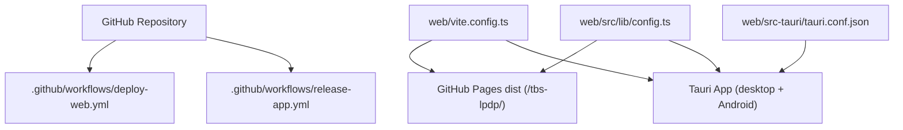
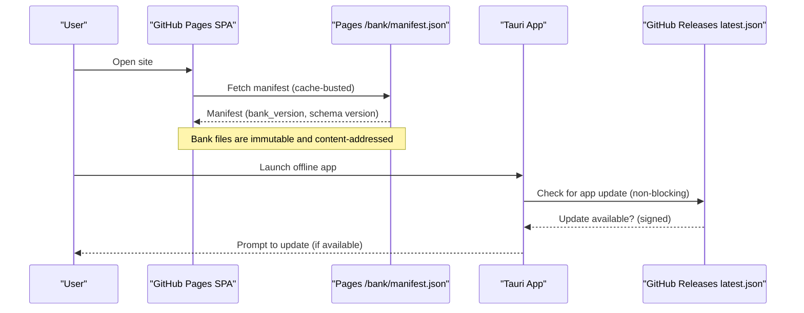
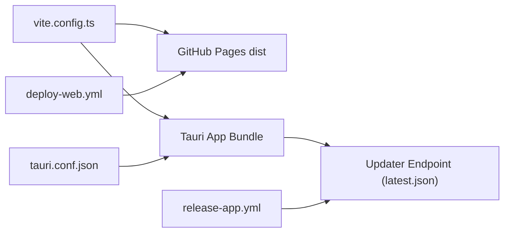

# Deployment Strategies

<cite>
**Referenced Files in This Document**
- [deploy-web.yml](file://.github/workflows/deploy-web.yml)
- [release-app.yml](file://.github/workflows/release-app.yml)
- [vite.config.ts](file://web/vite.config.ts)
- [tauri.conf.json](file://web/src-tauri/tauri.conf.json)
- [package.json](file://web/package.json)
- [config.ts](file://web/src/lib/config.ts)
- [appRuntime.ts](file://web/src/lib/appRuntime.ts)
- [appUpdate.ts](file://web/src/lib/appUpdate.ts)
- [maintenance.ts](file://web/src/lib/maintenance.ts)
- [MaintenanceContext.ts](file://web/src/contexts/MaintenanceContext.ts)
- [TECHNICAL_REQUIREMENTS_V6.md](file://docs/TECHNICAL_REQUIREMENTS_V6.md)
- [README.md](file://README.md)
</cite>

## Table of Contents
1. Introduction
2. Project Structure
3. Core Components
4. Architecture Overview
5. Detailed Component Analysis
6. Dependency Analysis
7. Performance Considerations
8. Troubleshooting Guide
9. Conclusion

## Introduction
This document provides a comprehensive deployment strategy for three targets:
- Web application deployed to GitHub Pages with base path configuration, static asset optimization, and CDN caching strategies.
- Desktop application packaged with Tauri for cross-platform distribution, code signing, and automatic updates.
- Mobile application for Android including APK generation, signing, and distribution via GitHub Releases.

It also covers environment-specific configurations, feature flags, runtime configuration management, scaling considerations, monitoring setup, and maintenance procedures for each target.

## Project Structure
The repository contains a single SPA that supports multiple build flavors and deployment targets:
- Web production builds are served from GitHub Pages under the repository path /tbs-lpdp/.
- Offline app builds use Tauri to package the same SPA into desktop installers and an Android APK.
- CI workflows orchestrate building, signing, publishing artifacts, and release publication.

**Diagram sources**
- [deploy-web.yml:1-133](file://.github/workflows/deploy-web.yml#L1-L133)
- [release-app.yml:1-310](file://.github/workflows/release-app.yml#L1-L310)
- [vite.config.ts:1-54](file://web/vite.config.ts#L1-L54)
- [tauri.conf.json:1-98](file://web/src-tauri/tauri.conf.json#L1-L98)
- [config.ts:1-68](file://web/src/lib/config.ts#L1-L68)

**Section sources**
- [README.md:40-70](file://README.md#L40-L70)
- [deploy-web.yml:1-133](file://.github/workflows/deploy-web.yml#L1-L133)
- [release-app.yml:1-310](file://.github/workflows/release-app.yml#L1-L310)
- [vite.config.ts:1-54](file://web/vite.config.ts#L1-L54)
- [tauri.conf.json:1-98](file://web/src-tauri/tauri.conf.json#L1-L98)

## Core Components
- Build flavor selection and base path handling ensure correct routing and asset resolution for both web and offline app builds.
- Environment variables control backend connectivity and feature toggles; offline mode excludes network dependencies.
- Tauri configuration defines bundling targets, updater endpoints, and security policies.
- CI workflows enforce constraints, build artifacts, sign releases, and publish to GitHub Pages or GitHub Releases.

Key responsibilities:
- Web deployment pipeline builds and publishes assets to GitHub Pages and question bank artifacts.
- Desktop/mobile release pipeline builds installers, signs them, generates updater metadata, and uploads artifacts to a draft release.
- Runtime modules expose platform detection, update checks, and capability gating (e.g., printing).

**Section sources**
- [vite.config.ts:10-52](file://web/vite.config.ts#L10-L52)
- [config.ts:11-43](file://web/src/lib/config.ts#L11-L43)
- [tauri.conf.json:37-96](file://web/src-tauri/tauri.conf.json#L37-L96)
- [appRuntime.ts:12-73](file://web/src/lib/appRuntime.ts#L12-L73)
- [appUpdate.ts:4-153](file://web/src/lib/appUpdate.ts#L4-L153)

## Architecture Overview
The system uses one SPA codebase with three flavors selected at build time:
- Web production: Supabase-backed, served from GitHub Pages under /tbs-lpdp/.
- Dev mock: local engine with Vite middleware bank (development only).
- Offline app: Tauri shell with local engine, bundled/cached bank, and updater-based app updates.

Two independent update planes exist:
- Question bank updates via manifest published to GitHub Pages.
- Application updates via Tauri updater pointing to GitHub Releases latest.json.

**Diagram sources**
- [deploy-web.yml:97-122](file://.github/workflows/deploy-web.yml#L97-L122)
- [release-app.yml:118-181](file://.github/workflows/release-app.yml#L118-L181)
- [tauri.conf.json:87-96](file://web/src-tauri/tauri.conf.json#L87-L96)
- [appUpdate.ts:72-100](file://web/src/lib/appUpdate.ts#L72-L100)

**Section sources**
- [TECHNICAL_REQUIREMENTS_V6.md:35-64](file://docs/TECHNICAL_REQUIREMENTS_V6.md#L35-L64)
- [TECHNICAL_REQUIREMENTS_V6.md:107-146](file://docs/TECHNICAL_REQUIREMENTS_V6.md#L107-L146)

## Detailed Component Analysis

### Web Deployment to GitHub Pages
- Base path is set to /tbs-lpdp/ for non-Tauri builds so assets resolve correctly on GitHub Pages.
- The workflow builds the SPA, asserts that offline/mock flavors are not enabled, publishes the question bank artifact, and deploys to GitHub Pages.
- Static assets are optimized by Vite’s default build; sourcemaps are disabled for production.
- CDN caching strategy relies on GitHub Pages serving immutable bank files (content-addressed) and cache-busting the manifest.

Operational notes:
- Ensure repository variables for Supabase and Turnstile keys are configured.
- The workflow enforces that no local engine or answer key reaches the Pages bundle.
- The question bank is validated before publishing to prevent broken artifacts.

**Section sources**
- [vite.config.ts:38-47](file://web/vite.config.ts#L38-L47)
- [deploy-web.yml:24-133](file://.github/workflows/deploy-web.yml#L24-L133)
- [config.ts:22-43](file://web/src/lib/config.ts#L22-L43)

### Desktop Application Deployment with Tauri
- Tauri config defines product name, version, window settings, CSP, bundling targets, and updater endpoints.
- Cross-platform builds include macOS (aarch64 and x86_64), Windows (NSIS), Linux (AppImage, deb, rpm).
- Code signing:
  - Desktop updater artifacts are signed using minisign; the public key is committed while the private key is stored in secrets.
  - macOS bundles are ad-hoc signed to avoid launch failures on Apple Silicon without Developer ID.
- Automatic updates:
  - Tauri updater checks GitHub Releases latest.json on launch and offers download-and-restart when available.
  - Package managers (.deb/.rpm) cannot self-update; users are directed to the release page.

Release process:
- Tagging app-vX.Y.Z triggers the release workflow.
- Desktop matrix builds installers and includes updater artifacts.
- Release is drafted and published after all artifacts are uploaded.

**Section sources**
- [tauri.conf.json:1-96](file://web/src-tauri/tauri.conf.json#L1-L96)
- [release-app.yml:24-181](file://.github/workflows/release-app.yml#L24-L181)
- [appUpdate.ts:72-100](file://web/src/lib/appUpdate.ts#L72-L100)
- [TECHNICAL_REQUIREMENTS_V6.md:77-88](file://docs/TECHNICAL_REQUIREMENTS_V6.md#L77-L88)

### Mobile Application Deployment for Android
- Android builds are produced in CI using Tauri’s Android support with Java 17 and NDK.
- Signing:
  - Keystore and passwords are provided via secrets and applied during the build.
  - The workflow verifies the APK signature and ensures it can be installed over existing versions.
- Distribution:
  - The signed APK is uploaded to the same GitHub Release as desktop installers.
  - In-app update check compares current version against the latest release and opens the APK download in the browser for installation.

Operational notes:
- The updater plugin does not cover Android; version checking is implemented via GitHub Releases API.
- VersionCode derivation ensures Android accepts upgrades when signatures match.

**Section sources**
- [release-app.yml:183-296](file://.github/workflows/release-app.yml#L183-L296)
- [appUpdate.ts:39-70](file://web/src/lib/appUpdate.ts#L39-L70)
- [TECHNICAL_REQUIREMENTS_V6.md:82-88](file://docs/TECHNICAL_REQUIREMENTS_V6.md#L82-L88)

### Environment-Specific Configurations and Feature Flags
- Flavor selection:
  - VITE_OFFLINE enables offline app behavior; VITE_USE_MOCK enables dev mock server.
  - These flags are forced to literals in Vite config to allow dead-code elimination per flavor.
- Runtime configuration:
  - SUPABASE_URL and keys are excluded in offline mode; TURNSTILE_SITE_KEY is also excluded.
  - Platform detection determines capabilities like printing and external link opening.
- Maintenance mode:
  - Server-driven schedule controls UI phases (open, warning, maintenance) and boundary timing.

Best practices:
- Keep secrets out of repositories; use GitHub Actions secrets and repository variables.
- Validate environment flags in CI to prevent accidental inclusion of sensitive features in production bundles.

**Section sources**
- [vite.config.ts:18-37](file://web/vite.config.ts#L18-L37)
- [config.ts:11-43](file://web/src/lib/config.ts#L11-L43)
- [appRuntime.ts:12-47](file://web/src/lib/appRuntime.ts#L12-L47)
- [maintenance.ts:1-48](file://web/src/lib/maintenance.ts#L1-L48)
- [MaintenanceContext.ts:1-25](file://web/src/contexts/MaintenanceContext.ts#L1-L25)

### Scaling Considerations
- Web:
  - GitHub Pages serves static assets; leverage immutable bank files for long-term caching and cache-bust manifests.
  - Avoid heavy client-side processing; keep bundles minimal by excluding offline features in web builds.
- Desktop/Android:
  - Updates are pull-based; minimize update payload size by keeping bank changes separate from binary updates.
  - Use platform-native packaging to reduce runtime overhead and improve install performance.

[No sources needed since this section provides general guidance]

### Monitoring Setup
- Web:
  - Use analytics or error tracking services configured via environment variables if needed; ensure they are excluded in offline builds.
  - Monitor GitHub Pages availability and CDN health through provider dashboards.
- Desktop/Android:
  - Rely on updater logs and error states surfaced by Tauri updater; handle network errors gracefully.
  - Track release adoption via GitHub Releases metrics and user feedback channels.

[No sources needed since this section provides general guidance]

### Maintenance Procedures
- Scheduled maintenance:
  - Maintenance status is fetched from the server and used to compute UI phases and boundaries.
  - Users see warnings before maintenance starts and are blocked during maintenance windows.
- Release maintenance:
  - Draft releases allow final review before publishing; ensure all artifacts are present and verified.
  - Rotate signing keys securely; store private keys and keystore secrets in GitHub Secrets.

**Section sources**
- [maintenance.ts:6-33](file://web/src/lib/maintenance.ts#L6-L33)
- [release-app.yml:298-309](file://.github/workflows/release-app.yml#L298-L309)

## Dependency Analysis
The deployment pipeline depends on coordinated interactions between Vite, Tauri, and CI workflows:
- Vite config selects flavor and base path based on environment and platform.
- Tauri config defines bundling targets and updater endpoints.
- Workflows enforce constraints, build artifacts, sign releases, and publish outputs.

**Diagram sources**
- [vite.config.ts:18-52](file://web/vite.config.ts#L18-L52)
- [tauri.conf.json:37-96](file://web/src-tauri/tauri.conf.json#L37-L96)
- [deploy-web.yml:24-133](file://.github/workflows/deploy-web.yml#L24-L133)
- [release-app.yml:118-181](file://.github/workflows/release-app.yml#L118-L181)

**Section sources**
- [vite.config.ts:18-52](file://web/vite.config.ts#L18-L52)
- [tauri.conf.json:37-96](file://web/src-tauri/tauri.conf.json#L37-L96)
- [deploy-web.yml:24-133](file://.github/workflows/deploy-web.yml#L24-L133)
- [release-app.yml:118-181](file://.github/workflows/release-app.yml#L118-L181)

## Performance Considerations
- Web:
  - Disable sourcemaps in production to reduce bundle size.
  - Use immutable bank files to maximize CDN cache hits; cache-bust only the manifest.
- Desktop/Android:
  - Target modern engines (Chrome 108+, Safari 15+) to optimize compatibility and performance.
  - Keep update checks non-blocking to preserve startup responsiveness.

[No sources needed since this section provides general guidance]

## Troubleshooting Guide
Common issues and resolutions:
- Web build includes local engine or answer keys:
  - Ensure VITE_OFFLINE and VITE_USE_MOCK are unset in CI; verify assertions pass.
  - Inspect built assets for forbidden patterns and re-run the build.
- Android APK fails to install over existing version:
  - Verify consistent signing with the same keystore; check signature verification step output.
- Desktop updater not finding updates:
  - Confirm latest.json exists and is signed; check network reachability and timeout handling.
- Maintenance UI not updating:
  - Validate server-provided schedule and timezone formatting; refresh the page to pick up new boundaries.

**Section sources**
- [deploy-web.yml:50-95](file://.github/workflows/deploy-web.yml#L50-L95)
- [release-app.yml:275-296](file://.github/workflows/release-app.yml#L275-L296)
- [appUpdate.ts:72-100](file://web/src/lib/appUpdate.ts#L72-L100)
- [maintenance.ts:6-33](file://web/src/lib/maintenance.ts#L6-L33)

## Conclusion
This deployment strategy unifies web, desktop, and mobile targets around a single SPA with flavor-aware builds and robust CI pipelines. GitHub Pages hosts the web app with optimized static assets and immutable bank artifacts. Tauri packages cross-platform desktop installers and an Android APK, with secure signing and automatic updates where supported. Environment variables and feature flags isolate sensitive functionality per target, while maintenance scheduling and monitoring practices ensure reliable operations across environments.

[No sources needed since this section summarizes without analyzing specific files]