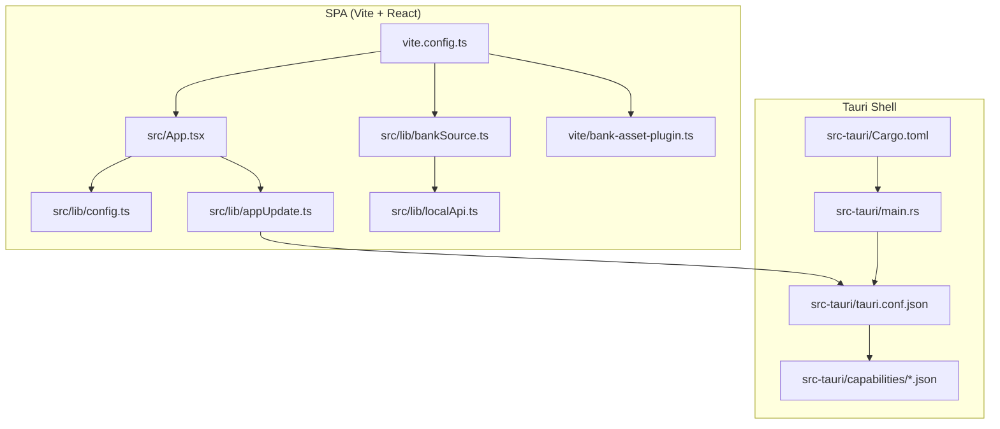
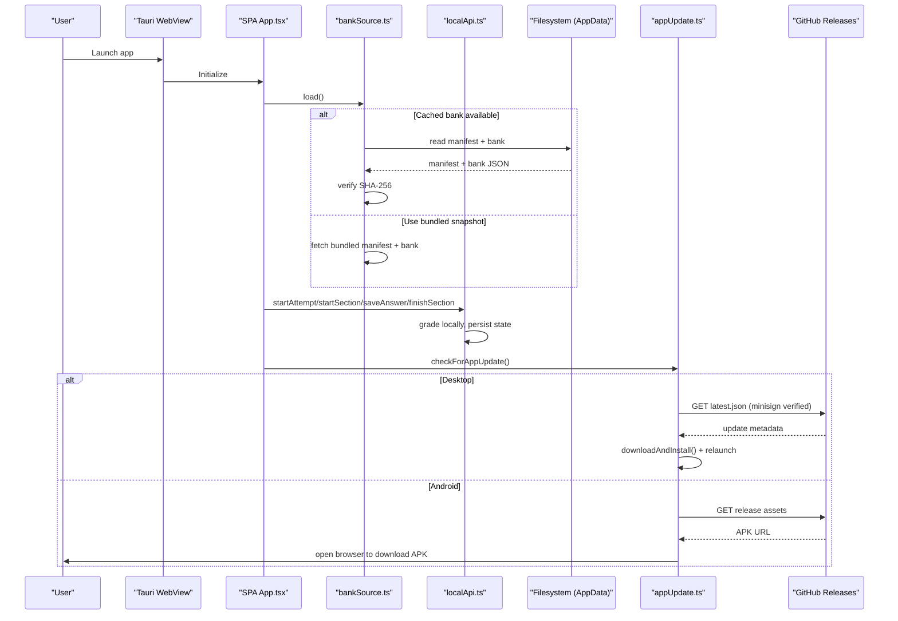
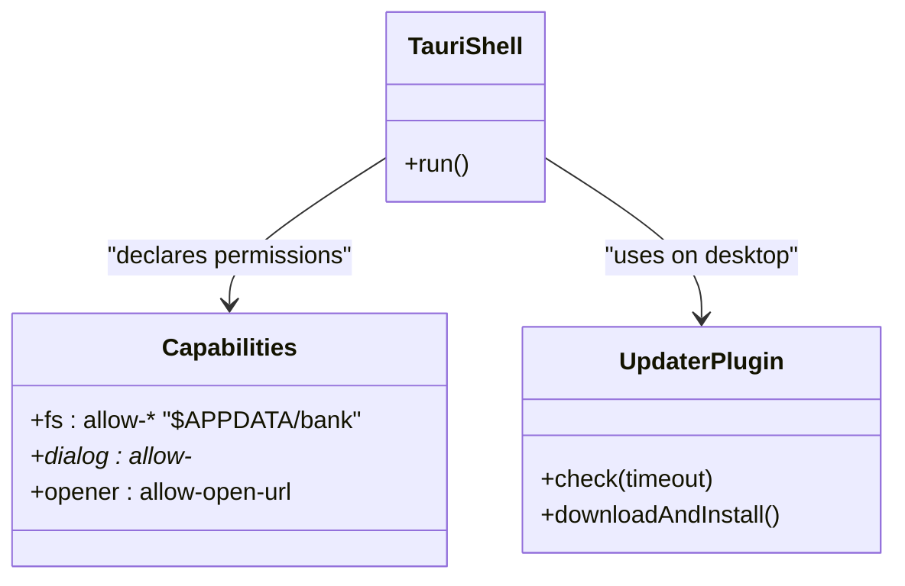
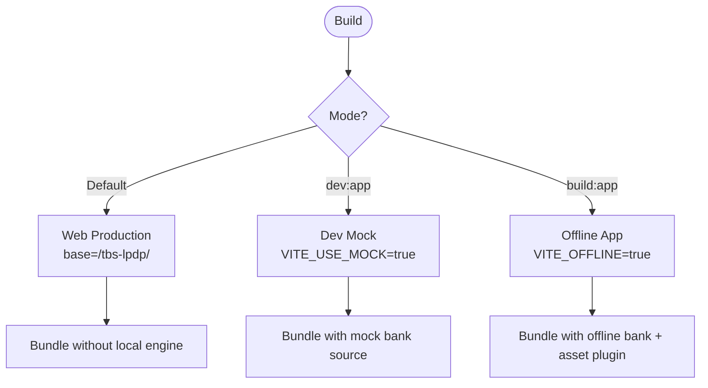
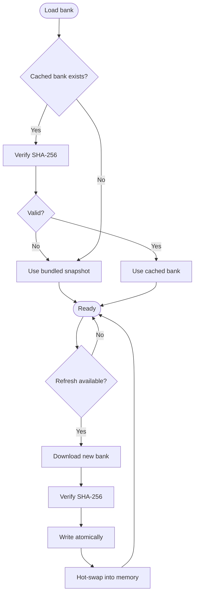
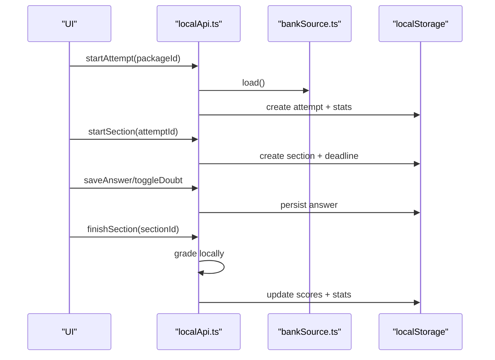
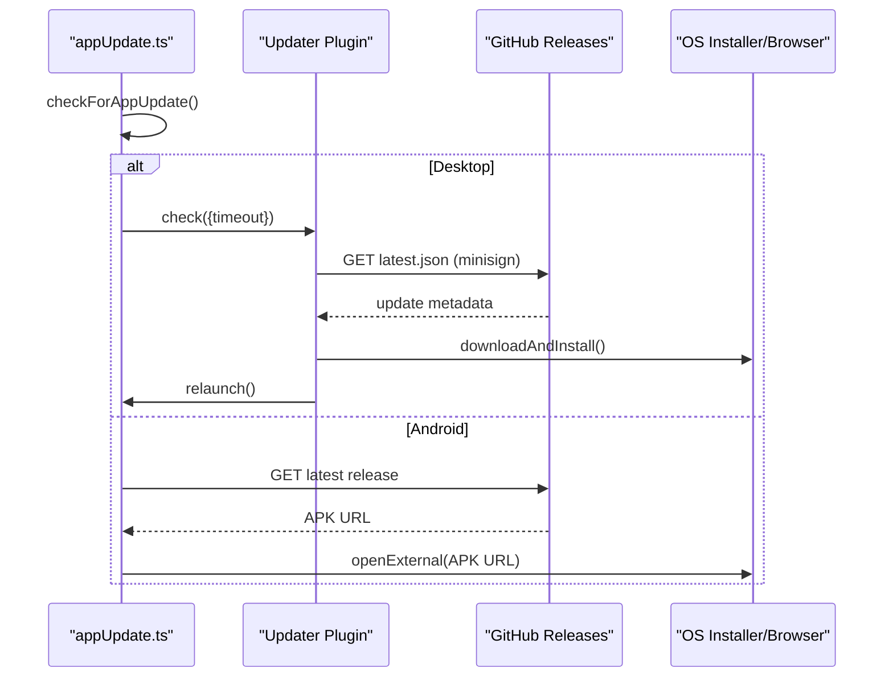
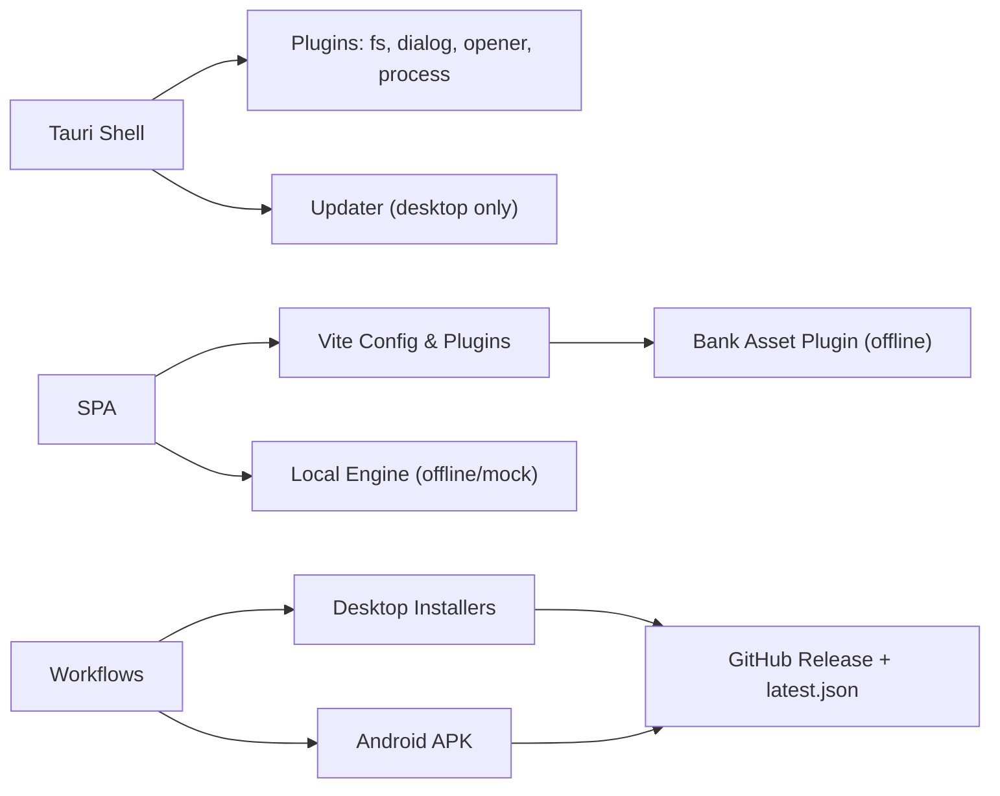

# Desktop and Mobile Applications

<cite>
**Referenced Files in This Document**
- [tauri.conf.json](file://web/src-tauri/tauri.conf.json)
- [Cargo.toml](file://web/src-tauri/Cargo.toml)
- [main.rs](file://web/src-tauri/src/main.rs)
- [build.rs](file://web/src-tauri/build.rs)
- [default.json](file://web/src-tauri/capabilities/default.json)
- [desktop.json](file://web/src-tauri/capabilities/desktop.json)
- [package.json](file://web/package.json)
- [vite.config.ts](file://web/vite.config.ts)
- [bank-asset-plugin.ts](file://web/vite/bank-asset-plugin.ts)
- [App.tsx](file://web/src/App.tsx)
- [config.ts](file://web/src/lib/config.ts)
- [appUpdate.ts](file://web/src/lib/appUpdate.ts)
- [bankSource.ts](file://web/src/lib/bankSource.ts)
- [localApi.ts](file://web/src/lib/localApi.ts)
- [release-app.yml](file://.github/workflows/release-app.yml)
- [deploy-web.yml](file://.github/workflows/deploy-web.yml)
</cite>

## Table of Contents
1. Introduction
2. Project Structure
3. Core Components
4. Architecture Overview
5. Detailed Component Analysis
6. Dependency Analysis
7. Performance Considerations
8. Troubleshooting Guide
9. Conclusion

## Introduction
This document explains the desktop and mobile applications built with Tauri 2. It covers the application shell structure written in Rust, the offline mode that bundles a single-page application (SPA) with a local exam engine and question bank, and the update mechanism via GitHub Releases. It also documents platform-specific configurations for Windows, macOS, Linux, and Android; the distribution strategy including signed installers and latest.json for automatic updates; build differences between web and offline versions; compile-time flavor switching; security implications of grading on-device; troubleshooting guides; and deployment procedures.

## Project Structure
The project is organized around a shared SPA under web/ and a Tauri 2 shell under web/src-tauri/. The SPA supports three flavors controlled at build time:
- Web production: connects to Supabase and serves from GitHub Pages.
- Dev mock: uses a Vite middleware to serve a mock bank and local engine.
- Offline app: ships a bundled question bank snapshot and runs entirely locally.

**Diagram sources**
- [main.rs:1-7](file://web/src-tauri/src/main.rs#L1-L7)
- [Cargo.toml:1-42](file://web/src-tauri/Cargo.toml#L1-L42)
- [tauri.conf.json:1-98](file://web/src-tauri/tauri.conf.json#L1-L98)
- [default.json:1-44](file://web/src-tauri/capabilities/default.json#L1-L44)
- [desktop.json:1-9](file://web/src-tauri/capabilities/desktop.json#L1-L9)
- [vite.config.ts:1-54](file://web/vite.config.ts#L1-L54)
- [bank-asset-plugin.ts:1-58](file://web/vite/bank-asset-plugin.ts#L1-L58)
- [App.tsx:1-63](file://web/src/App.tsx#L1-L63)
- [config.ts:1-68](file://web/src/lib/config.ts#L1-L68)
- [bankSource.ts:1-323](file://web/src/lib/bankSource.ts#L1-L323)
- [localApi.ts:1-560](file://web/src/lib/localApi.ts#L1-L560)
- [appUpdate.ts:1-153](file://web/src/lib/appUpdate.ts#L1-L153)

**Section sources**
- [tauri.conf.json:1-98](file://web/src-tauri/tauri.conf.json#L1-L98)
- [package.json:1-46](file://web/package.json#L1-L46)
- [vite.config.ts:1-54](file://web/vite.config.ts#L1-L54)

## Core Components
- Tauri shell: minimal Rust entry point delegating to a library crate; declares capabilities and updater plugin for desktop.
- Build-time flavor selection: Vite defines constants to include only the appropriate backend per flavor.
- Offline question bank: bundled snapshot plus verified cache refresh from GitHub Pages.
- Local exam engine: reimplementation of server semantics using localStorage and the injected bank.
- Update mechanism: desktop uses tauri-plugin-updater with minisign verification; Android opens APK download in browser.

Key responsibilities:
- App shell: window configuration, CSP, updater endpoints, bundle targets.
- Flavor gating: IS_OFFLINE_APP and VITE_USE_MOCK control code inclusion.
- Bank source: dev vs offline strategies with integrity checks.
- Local API: attempt lifecycle, section deadlines, scoring, statistics, reporting.
- Updates: version comparison and platform-specific apply flows.

**Section sources**
- [main.rs:1-7](file://web/src-tauri/src/main.rs#L1-L7)
- [Cargo.toml:1-42](file://web/src-tauri/Cargo.toml#L1-L42)
- [tauri.conf.json:1-98](file://web/src-tauri/tauri.conf.json#L1-L98)
- [default.json:1-44](file://web/src-tauri/capabilities/default.json#L1-L44)
- [desktop.json:1-9](file://web/src-tauri/capabilities/desktop.json#L1-L9)
- [vite.config.ts:1-54](file://web/vite.config.ts#L1-L54)
- [config.ts:1-68](file://web/src/lib/config.ts#L1-L68)
- [bankSource.ts:1-323](file://web/src/lib/bankSource.ts#L1-L323)
- [localApi.ts:1-560](file://web/src/lib/localApi.ts#L1-L560)
- [appUpdate.ts:1-153](file://web/src/lib/appUpdate.ts#L1-L153)

## Architecture Overview
The offline app runs a Tauri webview loading the SPA. On first launch, it loads the bundled bank snapshot; later it can refresh a cached copy from GitHub Pages after verifying its SHA-256 digest. The local exam engine persists attempts and answers in localStorage and grades sections locally. Desktop apps self-update via GitHub Releases using signed latest.json; Android prompts to download an APK and installs over the existing app.

**Diagram sources**
- [App.tsx:1-63](file://web/src/App.tsx#L1-L63)
- [bankSource.ts:1-323](file://web/src/lib/bankSource.ts#L1-L323)
- [localApi.ts:1-560](file://web/src/lib/localApi.ts#L1-L560)
- [appUpdate.ts:1-153](file://web/src/lib/appUpdate.ts#L1-L153)
- [tauri.conf.json:1-98](file://web/src-tauri/tauri.conf.json#L1-L98)

## Detailed Component Analysis

### Tauri Shell and Capabilities
- Entry point delegates to a library crate to support both desktop and Android linking.
- Cargo features enable logging, dialog, filesystem, opener, process, and conditional updater plugin for non-mobile platforms.
- Tauri config sets product name, version, identifier, window defaults, CSP, bundle targets, updater endpoints, and platform options.
- Capabilities restrict filesystem access to $APPDATA/bank and allow native dialogs and opening URLs.

**Diagram sources**
- [main.rs:1-7](file://web/src-tauri/src/main.rs#L1-L7)
- [Cargo.toml:1-42](file://web/src-tauri/Cargo.toml#L1-L42)
- [tauri.conf.json:1-98](file://web/src-tauri/tauri.conf.json#L1-L98)
- [default.json:1-44](file://web/src-tauri/capabilities/default.json#L1-L44)
- [desktop.json:1-9](file://web/src-tauri/capabilities/desktop.json#L1-L9)

**Section sources**
- [main.rs:1-7](file://web/src-tauri/src/main.rs#L1-L7)
- [build.rs:1-4](file://web/src-tauri/build.rs#L1-L4)
- [Cargo.toml:1-42](file://web/src-tauri/Cargo.toml#L1-L42)
- [tauri.conf.json:1-98](file://web/src-tauri/tauri.conf.json#L1-L98)
- [default.json:1-44](file://web/src-tauri/capabilities/default.json#L1-L44)
- [desktop.json:1-9](file://web/src-tauri/capabilities/desktop.json#L1-L9)

### Build-Time Flavor Switching and SPA Shell
- Vite defines VITE_OFFLINE and VITE_USE_MOCK as literals so dead branches are eliminated at build time.
- Base path switches between relative (Tauri) and GitHub Pages prefix.
- App shell conditionally includes maintenance and human verification gates only when not running offline.
- Offline app includes an update watcher component; web builds exclude it.

**Diagram sources**
- [vite.config.ts:1-54](file://web/vite.config.ts#L1-L54)
- [App.tsx:1-63](file://web/src/App.tsx#L1-L63)
- [config.ts:1-68](file://web/src/lib/config.ts#L1-L68)

**Section sources**
- [vite.config.ts:1-54](file://web/vite.config.ts#L1-L54)
- [package.json:1-46](file://web/package.json#L1-L46)
- [App.tsx:1-63](file://web/src/App.tsx#L1-L63)
- [config.ts:1-68](file://web/src/lib/config.ts#L1-L68)

### Offline Question Bank and Cache Refresh
- Two sources: dev middleware and offline source.
- Offline source prefers a verified cached bank in AppData; falls back to bundled snapshot if missing or corrupted.
- Manifest-driven refresh pulls newer bank from GitHub Pages, verifies SHA-256, writes atomically, and hot-swaps into memory.
- Bundling plugin emits manifest and bank artifact into the app’s assets during offline builds.

**Diagram sources**
- [bankSource.ts:1-323](file://web/src/lib/bankSource.ts#L1-L323)
- [bank-asset-plugin.ts:1-58](file://web/vite/bank-asset-plugin.ts#L1-L58)

**Section sources**
- [bankSource.ts:1-323](file://web/src/lib/bankSource.ts#L1-L323)
- [bank-asset-plugin.ts:1-58](file://web/vite/bank-asset-plugin.ts#L1-L58)

### Local Exam Engine
- Reimplements server-side semantics: immutable release snapshots, attempt pinning, deadlines with grace period, idempotent finish, monotonic statistics.
- Persists attempts, sections, answers, reports, and statistics in localStorage.
- Grades sections by comparing answers against pinned release questions; computes total score and eligibility for statistics.
- Enforces capacity guard and rate limits for reporting.

**Diagram sources**
- [localApi.ts:1-560](file://web/src/lib/localApi.ts#L1-L560)
- [bankSource.ts:1-323](file://web/src/lib/bankSource.ts#L1-L323)

**Section sources**
- [localApi.ts:1-560](file://web/src/lib/localApi.ts#L1-L560)

### Update Mechanism and Distribution
- Desktop: uses tauri-plugin-updater to check GitHub Releases endpoint, verifies minisign signature over latest.json, downloads and installs, then relaunches.
- Android: no updater plugin; compares versions against latest release, opens APK download in browser, and relies on same signing key to overwrite existing app.
- Distribution: workflow builds multi-platform installers, signs them, publishes draft release with latest.json, uploads APK, then publishes automatically.

**Diagram sources**
- [appUpdate.ts:1-153](file://web/src/lib/appUpdate.ts#L1-L153)
- [tauri.conf.json:1-98](file://web/src-tauri/tauri.conf.json#L1-L98)
- [release-app.yml:1-310](file://.github/workflows/release-app.yml#L1-L310)

**Section sources**
- [appUpdate.ts:1-153](file://web/src/lib/appUpdate.ts#L1-L153)
- [tauri.conf.json:1-98](file://web/src-tauri/tauri.conf.json#L1-L98)
- [release-app.yml:1-310](file://.github/workflows/release-app.yml#L1-L310)

## Dependency Analysis
- Tauri shell depends on plugins declared in Cargo.toml; updater is conditional for non-mobile targets.
- SPA depends on Vite plugins and environment flags to select backend; offline flavor adds bank asset plugin.
- Capabilities constrain filesystem and network access patterns.
- Workflows depend on Node, Rust toolchains, and platform SDKs to produce artifacts.

**Diagram sources**
- [Cargo.toml:1-42](file://web/src-tauri/Cargo.toml#L1-L42)
- [vite.config.ts:1-54](file://web/vite.config.ts#L1-L54)
- [bank-asset-plugin.ts:1-58](file://web/vite/bank-asset-plugin.ts#L1-L58)
- [release-app.yml:1-310](file://.github/workflows/release-app.yml#L1-L310)

**Section sources**
- [Cargo.toml:1-42](file://web/src-tauri/Cargo.toml#L1-L42)
- [vite.config.ts:1-54](file://web/vite.config.ts#L1-L54)
- [release-app.yml:1-310](file://.github/workflows/release-app.yml#L1-L310)

## Performance Considerations
- Dead-code elimination via Vite define ensures only one backend per flavor, reducing bundle size and startup overhead.
- Lazy imports of Tauri plugins minimize initial load cost.
- Atomic file writes and content-addressed caching reduce corruption risk and speed up subsequent launches.
- Short timeouts for manifest checks prevent blocking UI on launch.
- LTO and optimized release profile reduce binary size and improve runtime performance.

[No sources needed since this section provides general guidance]

## Troubleshooting Guide
- Web flavor accidentally includes local engine:
  - Ensure VITE_OFFLINE and VITE_USE_MOCK are not set for the default build; CI asserts this.
  - Check that .env files do not leak flags into production mode.
- Offline app cannot refresh bank:
  - Network unreachable or DNS failure returns offline status; cached bank remains usable.
  - If cache integrity fails, app falls back to bundled snapshot.
- Desktop updater fails:
  - Network errors are treated as offline; ensure latest.json is published and minisign public key is configured.
  - System package managers (.deb/.rpm) cannot self-update; manual installation is required.
- Android APK does not install over existing app:
  - Must be signed with the same keystore; CI verifies signature before upload.
- Linux AppImage dependencies:
  - Ensure libwebkit2gtk-4.1 and GTK3 libraries are installed on target systems.
- macOS quarantine message:
  - Remove quarantine attributes via terminal command if prompted; open via System Settings if blocked.
- Windows protected your PC:
  - Click More info then Run anyway; unsigned free software shows warnings by design.

**Section sources**
- [deploy-web.yml:1-133](file://.github/workflows/deploy-web.yml#L1-L133)
- [bankSource.ts:1-323](file://web/src/lib/bankSource.ts#L1-L323)
- [appUpdate.ts:1-153](file://web/src/lib/appUpdate.ts#L1-L153)
- [release-app.yml:1-310](file://.github/workflows/release-app.yml#L1-L310)
- [tauri.conf.json:1-98](file://web/src-tauri/tauri.conf.json#L1-L98)

## Conclusion
The application delivers a consistent experience across desktop and mobile by sharing a single SPA and switching behavior at build time. Offline mode guarantees usability without internet through a bundled question bank and local exam engine, while still allowing safe, verified updates to the bank. Desktop users benefit from automatic updates via signed releases; Android users receive streamlined APK upgrades. The architecture emphasizes security by keeping grading logic off the public web bundle and validating all remote data before use.

[No sources needed since this section summarizes without analyzing specific files]