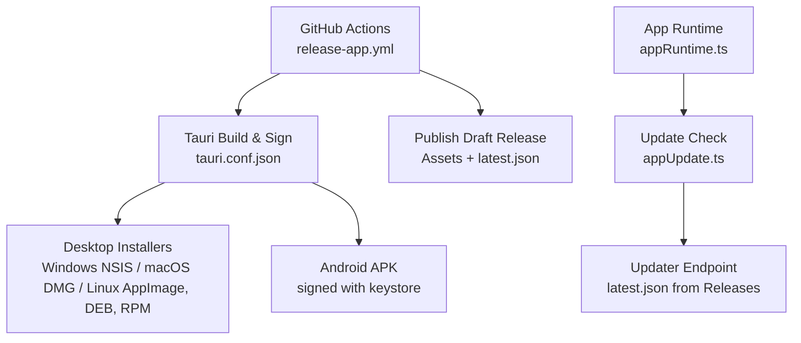
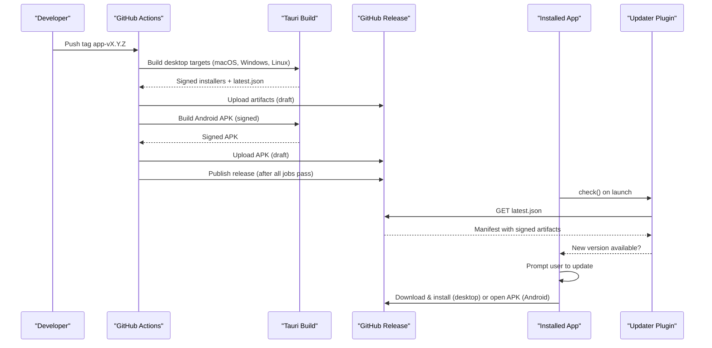
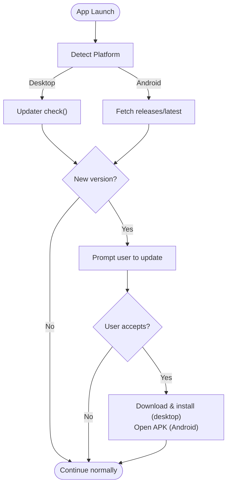
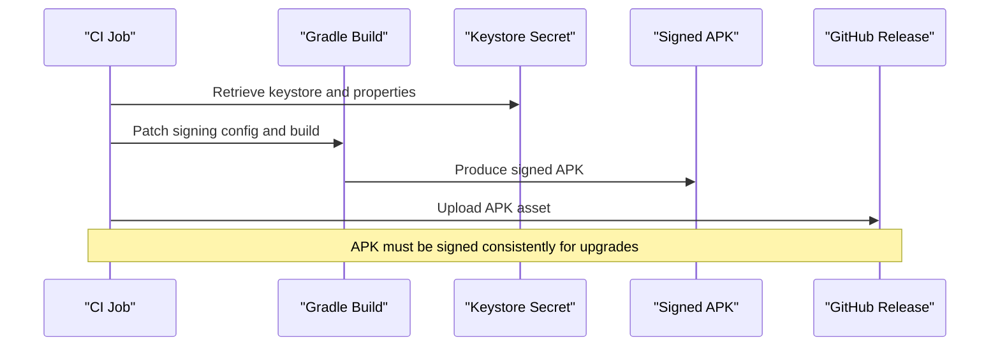
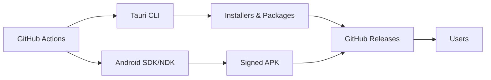

# Distribution and Deployment

<cite>
**Referenced Files in This Document**
- [release-app.yml](file://.github/workflows/release-app.yml)
- [deploy-web.yml](file://.github/workflows/deploy-web.yml)
- [bump_version.py](file://scripts/bump_version.py)
- [tauri.conf.json](file://web/src-tauri/tauri.conf.json)
- [appUpdate.ts](file://web/src/lib/appUpdate.ts)
- [appRuntime.ts](file://web/src/lib/appRuntime.ts)
- [patch-android-signing.ts](file://web/scripts/patch-android-signing.ts)
- [package.json](file://web/package.json)
- [TECHNICAL_REQUIREMENTS_V6.md](file://docs/TECHNICAL_REQUIREMENTS_V6.md)
</cite>

## Table of Contents
1. [Introduction](#introduction)
2. [Project Structure](#project-structure)
3. [Core Components](#core-components)
4. [Architecture Overview](#architecture-overview)
5. [Detailed Component Analysis](#detailed-component-analysis)
6. [Dependency Analysis](#dependency-analysis)
7. [Performance Considerations](#performance-considerations)
8. [Troubleshooting Guide](#troubleshooting-guide)
9. [Conclusion](#conclusion)
10. [Appendices](#appendices)

## Introduction
This document explains how the project distributes and deploys its desktop and mobile applications, including automated builds, signing, publishing to GitHub Releases, and automatic updates via a latest.json manifest. It covers:
- The GitHub Actions workflow that builds and signs installers for Windows (NSIS), macOS (DMG), Linux (AppImage, DEB, RPM), and Android (APK).
- The update mechanism using Tauri’s updater plugin and a latest.json hosted on GitHub Releases.
- Version management across configuration files and release artifacts.
- Procedures for creating releases, testing before publication, and handling rollbacks.
- Guidance for monitoring adoption through release assets and user prompts.

## Project Structure
The distribution pipeline spans several areas:
- CI workflows define build, sign, and publish steps.
- Tauri configuration defines targets, updater endpoints, and platform-specific packaging options.
- Update logic lives in the app runtime and update modules.
- A version bump script keeps versions synchronized across project files.

**Diagram sources**
- [release-app.yml:1-310](file://.github/workflows/release-app.yml#L1-L310)
- [tauri.conf.json:1-98](file://web/src-tauri/tauri.conf.json#L1-L98)
- [appRuntime.ts:1-73](file://web/src/lib/appRuntime.ts#L1-L73)
- [appUpdate.ts:1-153](file://web/src/lib/appUpdate.ts#L1-L153)

**Section sources**
- [release-app.yml:1-310](file://.github/workflows/release-app.yml#L1-L310)
- [tauri.conf.json:1-98](file://web/src-tauri/tauri.conf.json#L1-L98)
- [appRuntime.ts:1-73](file://web/src/lib/appRuntime.ts#L1-L73)
- [appUpdate.ts:1-153](file://web/src/lib/appUpdate.ts#L1-L153)

## Core Components
- GitHub Actions release workflow: orchestrates multi-platform builds, signing, and artifact upload into a draft release; publishes when all jobs succeed.
- Tauri configuration: declares product metadata, bundle targets, updater endpoint, and platform-specific settings.
- Update module: checks for new versions on desktop via Tauri updater and on Android by comparing against GitHub Releases API; handles user prompts and fallbacks.
- Android signing patch: configures Gradle to sign release APKs with the project keystore, ensuring upgrades work seamlessly.
- Version management: a script synchronizes version numbers across Tauri, Cargo, and package manifests.

**Section sources**
- [release-app.yml:24-182](file://.github/workflows/release-app.yml#L24-L182)
- [tauri.conf.json:1-98](file://web/src-tauri/tauri.conf.json#L1-L98)
- [appUpdate.ts:1-153](file://web/src/lib/appUpdate.ts#L1-L153)
- [patch-android-signing.ts:1-100](file://web/scripts/patch-android-signing.ts#L1-L100)
- [bump_version.py:1-124](file://scripts/bump_version.py#L1-L124)

## Architecture Overview
The release process is tag-driven and produces a single GitHub Release containing all platform installers plus an updater manifest. Desktop apps self-update via Tauri’s updater plugin; Android devices are prompted to download and install the new APK over the existing installation.

**Diagram sources**
- [release-app.yml:24-310](file://.github/workflows/release-app.yml#L24-L310)
- [tauri.conf.json:87-96](file://web/src-tauri/tauri.conf.json#L87-L96)
- [appUpdate.ts:72-100](file://web/src/lib/appUpdate.ts#L72-L100)

## Detailed Component Analysis

### GitHub Releases Workflow
- Triggers on tags matching app-v* and supports manual dispatch.
- Guard job validates that the tag matches the version in Tauri configuration and that updater public key and signing secrets are configured.
- Desktop matrix builds for macOS (Apple Silicon and Intel), Ubuntu 22.04 (Linux), and Windows, producing installers and updater artifacts.
- Android job initializes the Android project, applies signing patch, builds a signed APK, verifies signature, and uploads it to the same release.
- Publish job converts the draft release to published once all jobs complete.

Key behaviors:
- Includes updater JSON alongside installers.
- Uses secrets for signing keys and passwords.
- Ensures consistent versioning between tag and configuration.

**Section sources**
- [release-app.yml:13-58](file://.github/workflows/release-app.yml#L13-L58)
- [release-app.yml:59-182](file://.github/workflows/release-app.yml#L59-L182)
- [release-app.yml:183-297](file://.github/workflows/release-app.yml#L183-L297)
- [release-app.yml:298-310](file://.github/workflows/release-app.yml#L298-L310)

### Update Mechanism Using latest.json
- Desktop: Tauri updater plugin checks the configured endpoint for latest.json and downloads/install signed artifacts automatically.
- Android: Since there is no updater implementation, the app compares its version against the latest GitHub Release and opens the APK download in the browser; installing over the existing app works because every APK is signed with the same keystore.
- The update flow includes user prompts and fallbacks for package managers that cannot self-update.

**Diagram sources**
- [appUpdate.ts:39-100](file://web/src/lib/appUpdate.ts#L39-L100)
- [appRuntime.ts:1-73](file://web/src/lib/appRuntime.ts#L1-L73)
- [tauri.conf.json:87-96](file://web/src-tauri/tauri.conf.json#L87-L96)

**Section sources**
- [appUpdate.ts:1-153](file://web/src/lib/appUpdate.ts#L1-L153)
- [appRuntime.ts:1-73](file://web/src/lib/appRuntime.ts#L1-L73)
- [tauri.conf.json:87-96](file://web/src-tauri/tauri.conf.json#L87-L96)

### Distribution Strategy by Platform
- Windows: NSIS installer produced by Tauri; users run setup.exe and follow OS prompts.
- macOS: DMG package created for both Apple Silicon and Intel; ad-hoc signing used to avoid “damaged” errors; users open via System Settings if needed.
- Linux: AppImage, DEB, and RPM packages generated; AppImage supports automatic updates; DEB/RPM rely on system package manager and manual updates.
- Android: Signed APK built and uploaded to the release; users install over existing app to preserve data.

**Section sources**
- [release-app.yml:59-182](file://.github/workflows/release-app.yml#L59-L182)
- [tauri.conf.json:37-86](file://web/src-tauri/tauri.conf.json#L37-L86)

### Android Distribution Process
- Signing: The Gradle project is patched at build time to use a release keystore stored securely in GitHub Secrets; the patch ensures signing is enforced and fails loudly if missing.
- Version management: Android versionCode is derived from semver to allow upgrades; the app reads the installed version and compares against the latest release.
- Distribution: The signed APK is verified and uploaded to the same GitHub Release; users can install directly on device.

**Diagram sources**
- [patch-android-signing.ts:1-100](file://web/scripts/patch-android-signing.ts#L1-L100)
- [release-app.yml:250-297](file://.github/workflows/release-app.yml#L250-L297)

**Section sources**
- [patch-android-signing.ts:1-100](file://web/scripts/patch-android-signing.ts#L1-L100)
- [release-app.yml:250-297](file://.github/workflows/release-app.yml#L250-L297)

### Creating Release Artifacts and Managing Versions
- Version synchronization: Use the version bump script to update Tauri, Cargo, and package manifests consistently.
- Tagging: Create a tag app-vX.Y.Z where X.Y.Z matches the version in Tauri configuration; push the tag to trigger the release workflow.
- Publishing: The workflow creates a draft release with all artifacts; after verification, it publishes automatically.

Recommended procedure:
1. Run the version bump script to set the target version.
2. Commit changes and create the tag app-vX.Y.Z.
3. Push the tag to trigger the workflow.
4. Verify the draft release assets and notes.
5. Allow the publish job to finalize the release.

**Section sources**
- [bump_version.py:1-124](file://scripts/bump_version.py#L1-L124)
- [release-app.yml:24-58](file://.github/workflows/release-app.yml#L24-L58)
- [release-app.yml:298-310](file://.github/workflows/release-app.yml#L298-L310)

### Testing Releases Before Publication
- Local validation: Ensure type checking and builds pass locally; verify offline flavor builds correctly.
- Bank validation: Validate question bank integrity before publishing; ensure reproducible artifacts.
- Release verification: Inspect draft release assets, signatures, and updater manifest; test installers on target platforms.

**Section sources**
- [deploy-web.yml:24-133](file://.github/workflows/deploy-web.yml#L24-L133)
- [TECHNICAL_REQUIREMENTS_V6.md:210-227](file://docs/TECHNICAL_REQUIREMENTS_V6.md#L210-L227)

### Handling Rollback Scenarios
- Keep previous releases intact; do not delete published assets.
- If a release has issues, create a new tagged version and publish it; users will receive the newer version via update mechanisms.
- For Android, ensure the new APK is signed with the same keystore to allow seamless upgrades.

**Section sources**
- [release-app.yml:298-310](file://.github/workflows/release-app.yml#L298-L310)
- [TECHNICAL_REQUIREMENTS_V6.md:326-336](file://docs/TECHNICAL_REQUIREMENTS_V6.md#L326-L336)

### Monitoring User Adoption Metrics
- Track download counts per asset in GitHub Releases.
- Monitor update acceptance rates via user prompts and successful installations.
- Use release notes and instructions to guide users and reduce support requests.

[No sources needed since this section provides general guidance]

## Dependency Analysis
The distribution pipeline depends on:
- GitHub Actions for orchestration and secrets management.
- Tauri for cross-platform packaging and updater integration.
- Android SDK/NDK and Java for building signed APKs.
- GitHub Releases for hosting artifacts and updater manifests.

**Diagram sources**
- [release-app.yml:1-310](file://.github/workflows/release-app.yml#L1-L310)
- [package.json:24-45](file://web/package.json#L24-L45)

**Section sources**
- [release-app.yml:1-310](file://.github/workflows/release-app.yml#L1-L310)
- [package.json:24-45](file://web/package.json#L24-L45)

## Performance Considerations
- Parallelize builds across platforms to reduce total release time.
- Cache dependencies (Node, Rust, Android SDK) to speed up subsequent runs.
- Avoid unnecessary rebuilds by leveraging incremental compilation and caching strategies.

[No sources needed since this section provides general guidance]

## Troubleshooting Guide
Common issues and resolutions:
- Missing secrets: Ensure signing keys and keystore secrets are configured in GitHub Secrets.
- Version mismatch: Confirm the tag matches the version in Tauri configuration.
- Android signing failures: Verify keystore properties and signing patch application.
- Update failures: Check network connectivity and updater endpoint availability.

**Section sources**
- [release-app.yml:33-58](file://.github/workflows/release-app.yml#L33-L58)
- [release-app.yml:250-297](file://.github/workflows/release-app.yml#L250-L297)
- [appUpdate.ts:72-100](file://web/src/lib/appUpdate.ts#L72-L100)

## Conclusion
The project implements a robust, automated distribution pipeline for desktop and mobile applications. By leveraging GitHub Actions, Tauri, and GitHub Releases, it ensures secure, signed installers and seamless updates across platforms. Version management is centralized and validated, while testing and rollback procedures maintain reliability. Monitoring adoption metrics helps track user engagement and update success.

[No sources needed since this section summarizes without analyzing specific files]

## Appendices

### Quick Reference: Commands and Steps
- Bump version: python3 scripts/bump_version.py <version | patch | minor | major>
- Create release tag: git tag app-vX.Y.Z && git push origin app-vX.Y.Z
- Trigger workflow manually: Use GitHub Actions workflow_dispatch

**Section sources**
- [bump_version.py:1-124](file://scripts/bump_version.py#L1-L124)
- [release-app.yml:13-16](file://.github/workflows/release-app.yml#L13-L16)