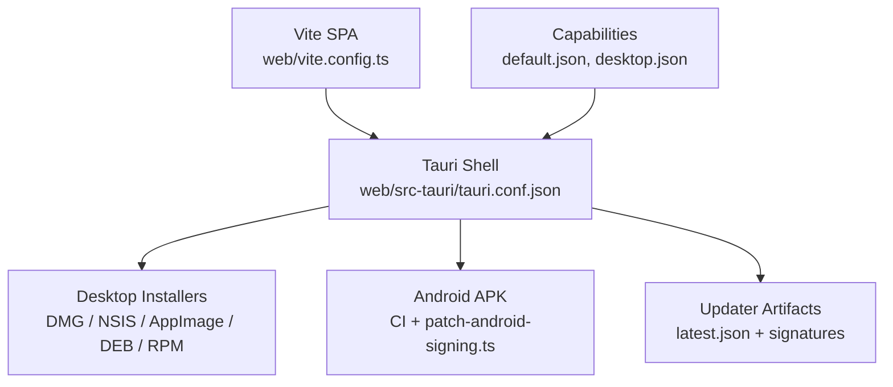
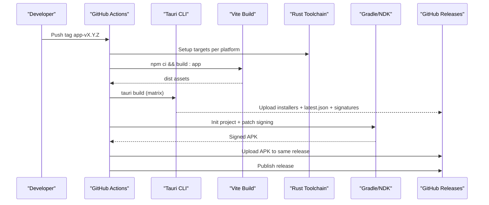
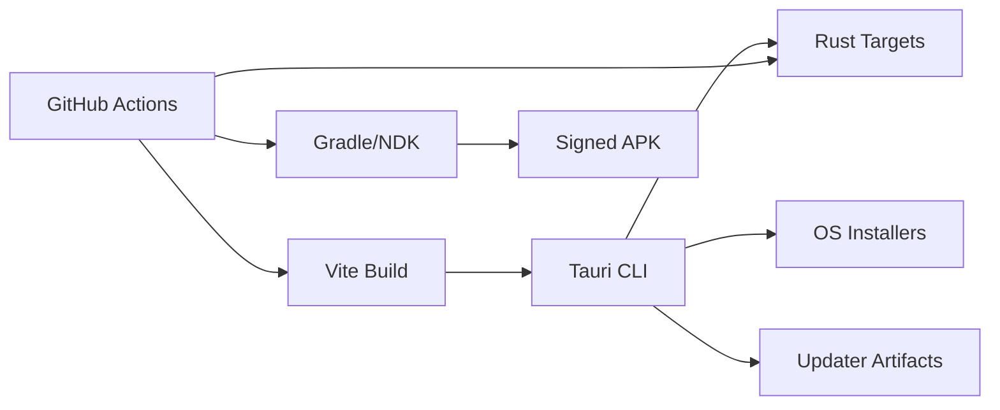

# Platform-Specific Builds

<cite>
**Referenced Files in This Document**
- [tauri.conf.json](file://web/src-tauri/tauri.conf.json)
- [default.json](file://web/src-tauri/capabilities/default.json)
- [desktop.json](file://web/src-tauri/capabilities/desktop.json)
- [patch-android-signing.ts](file://web/scripts/patch-android-signing.ts)
- [release-app.yml](file://.github/workflows/release-app.yml)
- [vite.config.ts](file://web/vite.config.ts)
- [package.json](file://web/package.json)
- [Cargo.toml](file://web/src-tauri/Cargo.toml)
- [TECHNICAL_REQUIREMENTS_V6.md](file://docs/TECHNICAL_REQUIREMENTS_V6.md)
</cite>

## Table of Contents
1. [Introduction](#introduction)
2. [Project Structure](#project-structure)
3. [Core Components](#core-components)
4. [Architecture Overview](#architecture-overview)
5. [Detailed Component Analysis](#detailed-component-analysis)
6. [Dependency Analysis](#dependency-analysis)
7. [Performance Considerations](#performance-considerations)
8. [Troubleshooting Guide](#troubleshooting-guide)
9. [Conclusion](#conclusion)
10. [Appendices](#appendices)

## Introduction
This document explains how the project builds and deploys across platforms: Windows, macOS, Linux, and Android. It covers build targets, code signing and notarization requirements, installer generation, Android APK signing with patch-android-signing.ts, Google Play Store preparation notes, the capability system that controls permissions, differences between development and production builds (including asset optimization and bundle size), and step-by-step setup for toolchains and certificates.

## Project Structure
The desktop/mobile app is a Tauri 2 application wrapping a Vite-built SPA. Build configuration lives in:
- web/src-tauri/tauri.conf.json: product metadata, targets, bundling options, updater config, platform-specific settings
- web/src-tauri/capabilities/*.json: fine-grained permission sets for the app shell
- web/vite.config.ts: build flavors, base path, target browsers, offline bundling behavior
- web/package.json: scripts to run dev/build flows and Tauri commands
- .github/workflows/release-app.yml: CI matrix for desktop installers and Android APK, secrets usage, release publishing
- docs/TECHNICAL_REQUIREMENTS_V6.md: operational guidance for one-time setup and release procedures

**Diagram sources**
- [tauri.conf.json:37-86](file://web/src-tauri/tauri.conf.json#L37-L86)
- [release-app.yml:59-181](file://.github/workflows/release-app.yml#L59-L181)
- [patch-android-signing.ts:28-99](file://web/scripts/patch-android-signing.ts#L28-L99)
- [default.json:1-44](file://web/src-tauri/capabilities/default.json#L1-L44)
- [desktop.json:1-9](file://web/src-tauri/capabilities/desktop.json#L1-L9)

**Section sources**
- [tauri.conf.json:1-98](file://web/src-tauri/tauri.conf.json#L1-L98)
- [vite.config.ts:1-54](file://web/vite.config.ts#L1-L54)
- [package.json:9-23](file://web/package.json#L9-L23)
- [release-app.yml:1-310](file://.github/workflows/release-app.yml#L1-L310)

## Core Components
- Tauri configuration defines product name, version, identifier, frontend distribution, dev URL, window defaults, security policy, bundle targets, platform-specific options, and updater endpoints.
- Capabilities define minimal permissions: core functionality, file system access scoped to $APPDATA/bank, dialog prompts, opening URLs to GitHub or mailto links, and desktop-only updater/restart capabilities.
- Vite build configuration selects flavor at compile time, sets base path for Tauri vs web, and optimizes targets for WebView engines.
- CI workflow orchestrates multi-platform builds, applies Android signing patch, signs artifacts, and publishes a single GitHub Release containing all installers and updater artifacts.

**Section sources**
- [tauri.conf.json:1-98](file://web/src-tauri/tauri.conf.json#L1-L98)
- [default.json:1-44](file://web/src-tauri/capabilities/default.json#L1-L44)
- [desktop.json:1-9](file://web/src-tauri/capabilities/desktop.json#L1-L9)
- [vite.config.ts:10-54](file://web/vite.config.ts#L10-L54)
- [release-app.yml:59-181](file://.github/workflows/release-app.yml#L59-L181)

## Architecture Overview
The build pipeline produces platform-native installers and an Android APK, plus updater artifacts for desktop. The Android flow uses a script to patch generated Gradle files so release builds are signed with the project keystore. Desktop updates use Tauri’s updater plugin; Android updates fall back to downloading the APK via browser.

**Diagram sources**
- [release-app.yml:59-181](file://.github/workflows/release-app.yml#L59-L181)
- [release-app.yml:183-296](file://.github/workflows/release-app.yml#L183-L296)
- [patch-android-signing.ts:28-99](file://web/scripts/patch-android-signing.ts#L28-L99)
- [tauri.conf.json:37-98](file://web/src-tauri/tauri.conf.json#L37-L98)

## Detailed Component Analysis

### Windows Build
- Targets: NSIS installer included in bundle targets.
- Installer language pack includes English and Indonesian.
- Update mode set to passive on Windows.
- No EV certificate configured; releases rely on minisign for update integrity. Users may see SmartScreen warnings on first install.

Key behaviors:
- Bundle targets include nsis.
- Updater endpoint points to GitHub Releases.
- CI builds x86_64-pc-windows-msvc.

Operational notes:
- Ensure TAURI_SIGNING_PRIVATE_KEY and password are set in secrets for updater artifact signing.
- For smoother user experience, consider obtaining a Microsoft EV certificate and configuring it in tauri.conf.json if desired.

**Section sources**
- [tauri.conf.json:37-82](file://web/src-tauri/tauri.conf.json#L37-L82)
- [tauri.conf.json:87-98](file://web/src-tauri/tauri.conf.json#L87-L98)
- [release-app.yml:76-78](file://.github/workflows/release-app.yml#L76-L78)
- [release-app.yml:118-181](file://.github/workflows/release-app.yml#L118-L181)

### macOS Build
- Targets: DMG included in bundle targets.
- Minimum system version set to 10.15.
- Signing identity is set to ad-hoc ("-" by default). This avoids “damaged” errors on Apple Silicon but still triggers unidentified developer prompts; users open via Privacy & Security.
- CI builds both aarch64 and x86_64 targets.

Operational notes:
- Ad-hoc signing is sufficient for distribution without Apple Developer ID; Gatekeeper will require “Open Anyway”.
- If you obtain a Developer ID, replace the signing identity accordingly.

**Section sources**
- [tauri.conf.json:37-73](file://web/src-tauri/tauri.conf.json#L37-L73)
- [release-app.yml:64-70](file://.github/workflows/release-app.yml#L64-L70)
- [TECHNICAL_REQUIREMENTS_V6.md:272-281](file://docs/TECHNICAL_REQUIREMENTS_V6.md#L272-L281)

### Linux Build
- Targets: AppImage, DEB, RPM included in bundle targets.
- DEB depends on libwebkit2gtk-4.1-0 and libgtk-3-0.
- CI builds on ubuntu-22.04 to maximize compatibility across distributions.
- Self-updates work via AppImage; DEB/RPM do not self-update automatically.

Operational notes:
- Ensure required system libraries are present on target machines when distributing DEB/RPM.
- Prefer AppImage for automatic updates.

**Section sources**
- [tauri.conf.json:37-69](file://web/src-tauri/tauri.conf.json#L37-L69)
- [release-app.yml:71-75](file://.github/workflows/release-app.yml#L71-L75)
- [release-app.yml:91-99](file://.github/workflows/release-app.yml#L91-L99)

### Android Build
- Target: arm64 APK produced in CI.
- Signing: patch-android-signing.ts injects a release signingConfig into the generated Gradle project and enforces presence of keystore.properties.
- Secrets used: ANDROID_KEYSTORE_B64, ANDROID_KEYSTORE_PASSWORD, ANDROID_KEY_ALIAS, ANDROID_KEY_PASSWORD.
- Workflow initializes Android project, writes keystore and properties, runs patch, then builds APK and verifies signature before upload.

Google Play Store preparation:
- The current repository targets direct APK distribution via GitHub Releases. Publishing to Google Play Store is out of scope per technical requirements. To prepare for Play Store:
  - Use the same release keystore for consistent upgrades.
  - Align versionCode with semantic versioning as implemented in the workflow.
  - Consider generating multiple ABIs if needed and following Play Console requirements for app bundles.

**Section sources**
- [patch-android-signing.ts:1-100](file://web/scripts/patch-android-signing.ts#L1-L100)
- [release-app.yml:183-296](file://.github/workflows/release-app.yml#L183-L296)
- [TECHNICAL_REQUIREMENTS_V6.md:74-88](file://docs/TECHNICAL_REQUIREMENTS_V6.md#L74-L88)

### Capability System (Permissions)
- default.json grants:
  - Core functionality
  - Dialog allow-ask/message
  - Filesystem access scoped to $APPDATA/bank (mkdir, exists, read-dir, read/write text files, rename, remove)
  - Opener allow-open-url restricted to GitHub and mailto
- desktop.json grants:
  - Updater default and process restart, limited to macOS, Windows, Linux

These permissions ensure the app can manage its question bank locally and perform safe OS interactions while minimizing exposure.

**Section sources**
- [default.json:1-44](file://web/src-tauri/capabilities/default.json#L1-L44)
- [desktop.json:1-9](file://web/src-tauri/capabilities/desktop.json#L1-L9)

### Development vs Production Builds
- Flavor selection:
  - Web production: default mode, serves from /tbs-lpdp/ base on GitHub Pages.
  - Dev mock: local engine with middleware bank, never shipped.
  - Offline app: VITE_OFFLINE=true with Tauri shell; ships bundled/cached bank and local engine.
- Base path:
  - Tauri builds use relative base "./"; web builds use "/tbs-lpdp/".
- Browser targets:
  - Tauri builds target es2022/chrome108/safari15 to match WebView engines.
- Asset optimization:
  - Sourcemaps disabled in production.
  - Bank assets can be bundled into the app for offline-first installs.
- Rust release profile:
  - LTO enabled, single codegen unit, opt-level s, panic abort, strip symbols for smaller binaries.

Bundle size considerations:
- Dead-code elimination via constant folding ensures only the selected backend is included.
- Bundled bank snapshot provides offline-first UX; keep bank size reasonable to avoid large installers.

**Section sources**
- [vite.config.ts:10-54](file://web/vite.config.ts#L10-L54)
- [Cargo.toml:36-42](file://web/src-tauri/Cargo.toml#L36-L42)
- [TECHNICAL_REQUIREMENTS_V6.md:35-88](file://docs/TECHNICAL_REQUIREMENTS_V6.md#L35-L88)

## Dependency Analysis
- Tauri configuration depends on:
  - Frontend dist built by Vite
  - Rust toolchain and targets per platform
  - Updater plugin for desktop updates
- CI workflow depends on:
  - Node.js and npm cache
  - Rust toolchain with specific targets
  - Android SDK/NDK for APK builds
  - Secrets for signing keys and keystore

**Diagram sources**
- [release-app.yml:59-181](file://.github/workflows/release-app.yml#L59-L181)
- [release-app.yml:183-296](file://.github/workflows/release-app.yml#L183-L296)
- [tauri.conf.json:37-98](file://web/src-tauri/tauri.conf.json#L37-L98)

**Section sources**
- [release-app.yml:59-181](file://.github/workflows/release-app.yml#L59-L181)
- [release-app.yml:183-296](file://.github/workflows/release-app.yml#L183-L296)
- [tauri.conf.json:37-98](file://web/src-tauri/tauri.conf.json#L37-L98)

## Performance Considerations
- Production builds disable sourcemaps and optimize Rust binary size with LTO and symbol stripping.
- Vite targets WebView engines for better compatibility and performance on desktop/mobile.
- Bundled bank snapshot reduces initial network dependency; ensure bank size remains manageable.
- CI caches Rust and npm dependencies to speed up builds.

[No sources needed since this section provides general guidance]

## Troubleshooting Guide

### Common Build Issues and Fixes

- Missing Android signing configuration:
  - Symptom: Build fails due to missing keystore.properties or unsigned APK.
  - Fix: Provide ANDROID_KEYSTORE_B64 and related secrets; workflow writes keystore and properties and runs patch-android-signing.ts before building.

- Android template changes break patch:
  - Symptom: Script cannot find expected blocks in generated Gradle files.
  - Fix: Update patch-android-signing.ts to match new template structure; the script validates presence of required blocks and fails loudly.

- macOS “damaged” error:
  - Symptom: App cannot open after download.
  - Cause: No valid signature on Apple Silicon.
  - Fix: Ad-hoc signing is already configured; instruct users to open via Privacy & Security. If using a Developer ID, configure signing identity accordingly.

- Windows SmartScreen warning:
  - Symptom: First install shows protection screen.
  - Cause: No EV certificate.
  - Fix: Follow release notes instructions; optionally obtain EV certificate for smoother experience.

- Linux runtime dependencies:
  - Symptom: App fails to launch on some distributions.
  - Fix: Ensure libwebkit2gtk-4.1-0 and libgtk-3-0 are installed; prefer AppImage for automatic updates.

- Updater pubkey placeholder:
  - Symptom: CI refuses to run.
  - Fix: Replace placeholder with actual minisign public key and set private key secrets.

- Tag/version mismatch:
  - Symptom: CI fails validation.
  - Fix: Ensure git tag matches tauri.conf.json version format app-vX.Y.Z.

**Section sources**
- [release-app.yml:31-57](file://.github/workflows/release-app.yml#L31-L57)
- [release-app.yml:118-181](file://.github/workflows/release-app.yml#L118-L181)
- [release-app.yml:183-296](file://.github/workflows/release-app.yml#L183-L296)
- [patch-android-signing.ts:28-99](file://web/scripts/patch-android-signing.ts#L28-L99)
- [tauri.conf.json:70-73](file://web/src-tauri/tauri.conf.json#L70-L73)
- [TECHNICAL_REQUIREMENTS_V6.md:147-157](file://docs/TECHNICAL_REQUIREMENTS_V6.md#L147-L157)

## Conclusion
The project uses Tauri 2 to produce native installers for Windows, macOS, and Linux, and an Android APK, all orchestrated through a robust CI workflow. Permissions are tightly scoped via capabilities, and updates are handled differently per platform: desktop uses Tauri’s updater, Android downloads the APK via browser. Development and production builds are cleanly separated with flavor-based optimizations and targeted bundling. Operational steps for signing and release are documented and enforced in CI to maintain integrity and reproducibility.

[No sources needed since this section summarizes without analyzing specific files]

## Appendices

### Step-by-Step Toolchain and Certificate Setup

- One-time operator setup:
  - Generate minisign keypair and commit public key into tauri.conf.json; add private key and password to secrets.
  - Create Android release keystore and add secrets for keystore content and passwords.
  - Bump version in tauri.conf.json, tag app-vX.Y.Z, push tag to trigger CI, verify draft release, then publish.

- Local development:
  - Use npm scripts to run dev server and Tauri dev/build flows.
  - For Android development, initialize Android project and apply signing patch when needed.

**Section sources**
- [TECHNICAL_REQUIREMENTS_V6.md:147-157](file://docs/TECHNICAL_REQUIREMENTS_V6.md#L147-L157)
- [package.json:9-23](file://web/package.json#L9-L23)
- [release-app.yml:183-296](file://.github/workflows/release-app.yml#L183-L296)