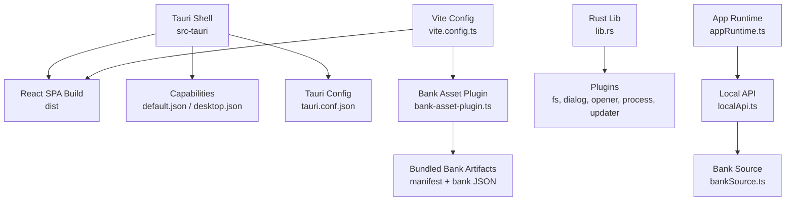
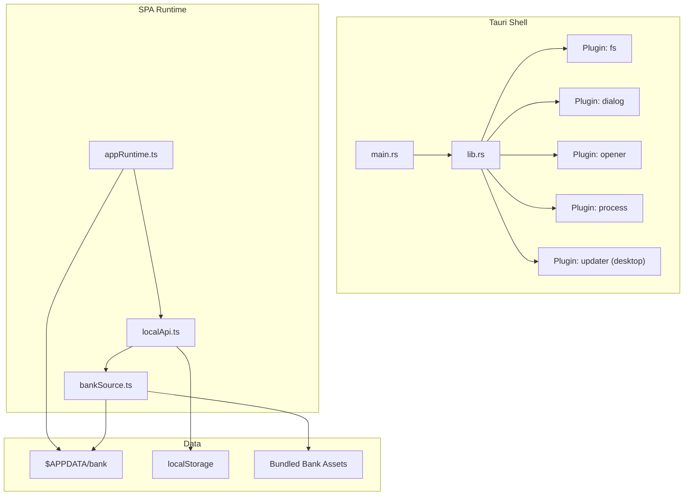
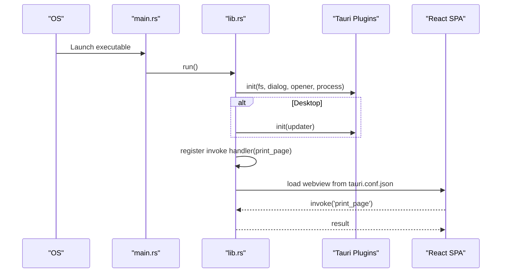
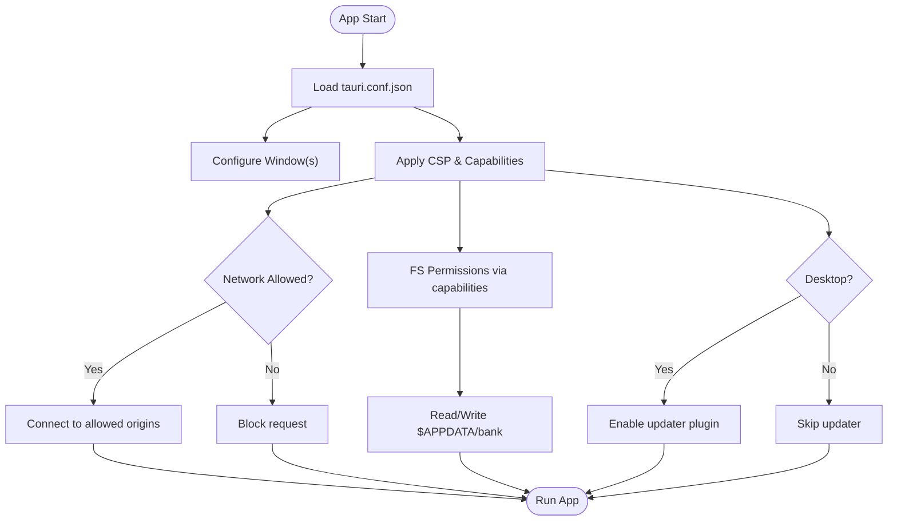
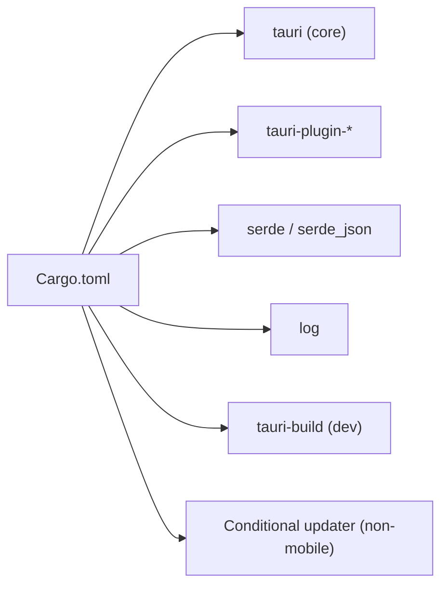
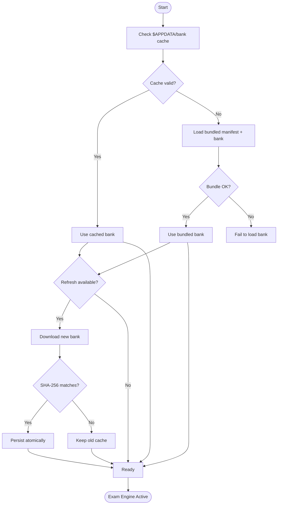
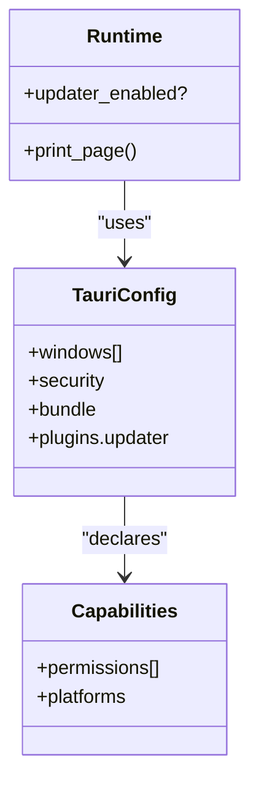
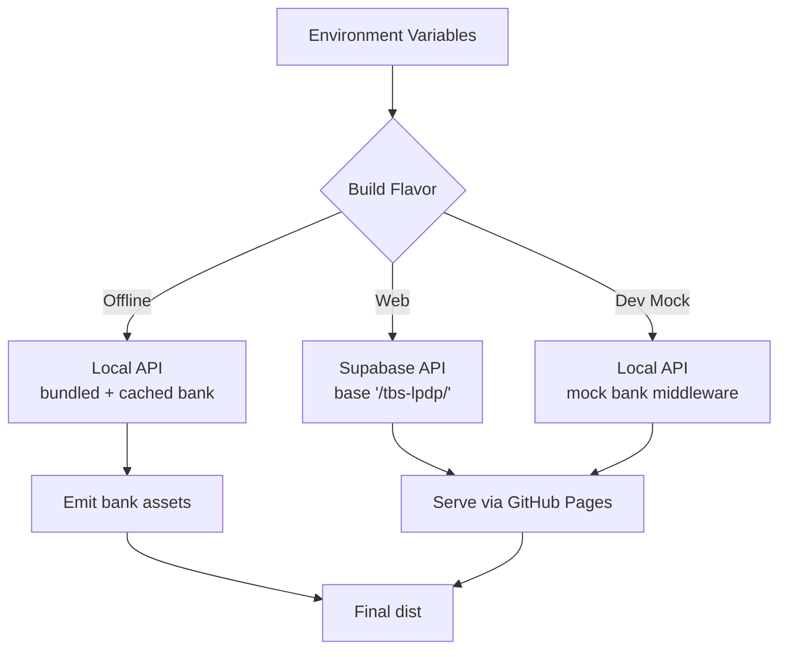
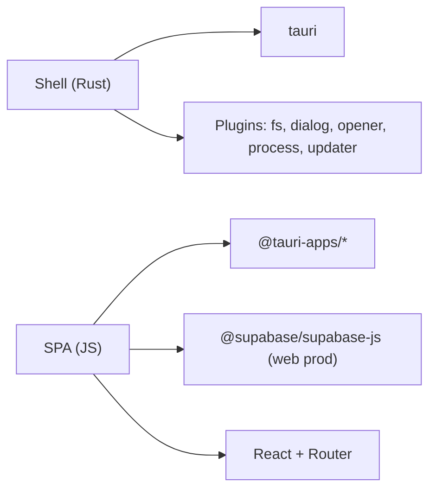

# Tauri Application Shell

<cite>
**Referenced Files in This Document**
- [main.rs](file://web/src-tauri/src/main.rs)
- [lib.rs](file://web/src-tauri/src/lib.rs)
- [Cargo.toml](file://web/src-tauri/Cargo.toml)
- [build.rs](file://web/src-tauri/build.rs)
- [tauri.conf.json](file://web/src-tauri/tauri.conf.json)
- [default.json](file://web/src-tauri/capabilities/default.json)
- [desktop.json](file://web/src-tauri/capabilities/desktop.json)
- [vite.config.ts](file://web/vite.config.ts)
- [package.json](file://web/package.json)
- [appRuntime.ts](file://web/src/lib/appRuntime.ts)
- [bankSource.ts](file://web/src/lib/bankSource.ts)
- [localApi.ts](file://web/src/lib/localApi.ts)
- [bank-asset-plugin.ts](file://web/vite/bank-asset-plugin.ts)
</cite>

## Table of Contents
1. Introduction
2. Project Structure
3. Core Components
4. Architecture Overview
5. Detailed Component Analysis
6. Dependency Analysis
7. Performance Considerations
8. Troubleshooting Guide
9. Conclusion

## Introduction
This document explains the Tauri application shell that wraps a React single-page application into native desktop and mobile applications. It covers the Rust entry point, Tauri configuration, Cargo build settings, offline mode with bundled question bank storage and an exam engine, security model (filesystem access, network restrictions, data persistence), and platform-specific behaviors.

## Project Structure
The project is organized as:
- web/src-tauri: Tauri Rust shell, configuration, capabilities, and build scripts
- web: React SPA, Vite configuration, and offline build helpers
- questions/bank: Source question sets used to generate the bundled bank artifact

**Diagram sources**
- [tauri.conf.json:1-98](file://web/src-tauri/tauri.conf.json#L1-L98)
- [default.json:1-44](file://web/src-tauri/capabilities/default.json#L1-L44)
- [desktop.json:1-9](file://web/src-tauri/capabilities/desktop.json#L1-L9)
- [vite.config.ts:1-54](file://web/vite.config.ts#L1-L54)
- [bank-asset-plugin.ts:1-58](file://web/vite/bank-asset-plugin.ts#L1-L58)
- [lib.rs:1-57](file://web/src-tauri/src/lib.rs#L1-L57)
- [appRuntime.ts:1-73](file://web/src/lib/appRuntime.ts#L1-L73)
- [localApi.ts:1-560](file://web/src/lib/localApi.ts#L1-L560)
- [bankSource.ts:1-323](file://web/src/lib/bankSource.ts#L1-L323)

**Section sources**
- [tauri.conf.json:1-98](file://web/src-tauri/tauri.conf.json#L1-L98)
- [vite.config.ts:1-54](file://web/vite.config.ts#L1-L54)

## Core Components
- Tauri entry point: minimal main.rs delegates to a shared library run function.
- Shared library: initializes plugins, registers commands, and runs the app context.
- Tauri configuration: defines window, security policy (CSP, asset protocol), bundling targets, updater plugin endpoints, and platform options.
- Capabilities: fine-grained permissions for filesystem operations under $APPDATA/bank and opening URLs.
- Offline mode: bundles a verified question bank snapshot and caches updates in the app data directory; the local exam engine persists attempts and statistics in localStorage.
- Build system: Vite produces three flavors (web production, dev mock, offline app); Tauri builds cross-platform binaries and Android artifacts.

**Section sources**
- [main.rs:1-7](file://web/src-tauri/src/main.rs#L1-L7)
- [lib.rs:1-57](file://web/src-tauri/src/lib.rs#L1-L57)
- [tauri.conf.json:1-98](file://web/src-tauri/tauri.conf.json#L1-L98)
- [default.json:1-44](file://web/src-tauri/capabilities/default.json#L1-L44)
- [desktop.json:1-9](file://web/src-tauri/capabilities/desktop.json#L1-L9)
- [bankSource.ts:1-323](file://web/src/lib/bankSource.ts#L1-L323)
- [localApi.ts:1-560](file://web/src/lib/localApi.ts#L1-L560)
- [vite.config.ts:1-54](file://web/vite.config.ts#L1-L54)

## Architecture Overview
The Tauri shell hosts a React SPA inside a WebView. The SPA uses a thin runtime layer to call native features only when running in Tauri. In offline mode, the app ships a verified question bank snapshot and caches updates locally. The local exam engine persists state in localStorage and grades answers client-side.

**Diagram sources**
- [main.rs:1-7](file://web/src-tauri/src/main.rs#L1-L7)
- [lib.rs:1-57](file://web/src-tauri/src/lib.rs#L1-L57)
- [appRuntime.ts:1-73](file://web/src/lib/appRuntime.ts#L1-L73)
- [localApi.ts:1-560](file://web/src/lib/localApi.ts#L1-L560)
- [bankSource.ts:1-323](file://web/src/lib/bankSource.ts#L1-L323)

## Detailed Component Analysis

### Rust Entry Point and Library
- main.rs: Disables console on Windows release and calls the shared library run function.
- lib.rs: Initializes core plugins, conditionally enables the updater plugin on desktop, registers a print_page command, and starts Tauri with generated context.

**Diagram sources**
- [main.rs:1-7](file://web/src-tauri/src/main.rs#L1-L7)
- [lib.rs:1-57](file://web/src-tauri/src/lib.rs#L1-L57)

**Section sources**
- [main.rs:1-7](file://web/src-tauri/src/main.rs#L1-L7)
- [lib.rs:1-57](file://web/src-tauri/src/lib.rs#L1-L57)

### Tauri Configuration and Security Model
- Window settings: label, title, dimensions, min size, resizable, fullscreen, center.
- Security:
  - Asset protocol disabled.
  - Capabilities: default and desktop.
  - CSP restricts origins for scripts, styles, images, fonts, and connections; allows IPC and specific remote endpoints.
- Bundling:
  - Frontend dist path and dev URL configured.
  - Targets include app, dmg, nsis, appimage, deb, rpm.
  - Platform metadata and icons.
  - Linux dependencies, macOS minimum version/signing identity, Windows NSIS install mode and languages, Android debug suffix.
- Updater plugin:
  - Endpoint to signed latest.json.
  - Windows passive install mode.
  - Public key for verification.

**Diagram sources**
- [tauri.conf.json:1-98](file://web/src-tauri/tauri.conf.json#L1-L98)
- [default.json:1-44](file://web/src-tauri/capabilities/default.json#L1-L44)
- [desktop.json:1-9](file://web/src-tauri/capabilities/desktop.json#L1-L9)

**Section sources**
- [tauri.conf.json:1-98](file://web/src-tauri/tauri.conf.json#L1-L98)
- [default.json:1-44](file://web/src-tauri/capabilities/default.json#L1-L44)
- [desktop.json:1-9](file://web/src-tauri/capabilities/desktop.json#L1-L9)

### Cargo Dependencies and Build Configuration
- Package metadata and edition/rust-version.
- Library crate types for staticlib, cdylib, rlib to support desktop and mobile targets.
- Build dependency on tauri-build.
- Runtime dependencies: serde, log, tauri, and plugins (log, dialog, fs, opener, process).
- Conditional updater plugin for non-mobile targets.
- Release profile optimizations: codegen units, LTO, size optimization, abort-on-panic, strip.

**Diagram sources**
- [Cargo.toml:1-42](file://web/src-tauri/Cargo.toml#L1-L42)

**Section sources**
- [Cargo.toml:1-42](file://web/src-tauri/Cargo.toml#L1-L42)
- [build.rs:1-4](file://web/src-tauri/build.rs#L1-L4)

### Offline Mode: Bundled Question Bank and Exam Engine
- Bank source selection:
  - Dev mode serves a mock bank via Vite middleware.
  - Offline mode loads a bundled snapshot first, then verifies and optionally refreshes from GitHub Pages.
- Persistence:
  - Cached bank stored under $APPDATA/bank with content-addressed filenames and atomic writes using temp files and rename.
  - Manifest tracks version, generation time, and SHA-256 digest for integrity checks.
- Local exam engine:
  - Implements the same API semantics as the server: immutable release snapshots per attempt, deadlines with grace period, idempotent finish, and monotonic statistics.
  - Persists attempts, sections, answers, reports, releases, and statistics in localStorage.

**Diagram sources**
- [bankSource.ts:1-323](file://web/src/lib/bankSource.ts#L1-L323)
- [localApi.ts:1-560](file://web/src/lib/localApi.ts#L1-L560)
- [bank-asset-plugin.ts:1-58](file://web/vite/bank-asset-plugin.ts#L1-L58)

**Section sources**
- [bankSource.ts:1-323](file://web/src/lib/bankSource.ts#L1-L323)
- [localApi.ts:1-560](file://web/src/lib/localApi.ts#L1-L560)
- [bank-asset-plugin.ts:1-58](file://web/vite/bank-asset-plugin.ts#L1-L58)

### Platform-Specific Behavior and Capabilities
- Desktop-only updater: enabled via capability and conditional compilation; Android/iOS do not use it.
- Print page: desktop uses native print dialog; Android returns failure so UI hides the button.
- Filesystem access: scoped to $APPDATA/bank via capabilities; read/write/rename/remove operations are explicitly allowed.
- Network: CSP limits connect-src to self, ipc, and specific domains; asset protocol disabled.
- Packaging:
  - Windows NSIS installer language list and install mode.
  - Linux DEB dependencies.
  - macOS minimum version and signing identity.
  - Android debug suffix.

**Diagram sources**
- [tauri.conf.json:1-98](file://web/src-tauri/tauri.conf.json#L1-L98)
- [default.json:1-44](file://web/src-tauri/capabilities/default.json#L1-L44)
- [desktop.json:1-9](file://web/src-tauri/capabilities/desktop.json#L1-L9)
- [lib.rs:1-57](file://web/src-tauri/src/lib.rs#L1-L57)

**Section sources**
- [tauri.conf.json:1-98](file://web/src-tauri/tauri.conf.json#L1-L98)
- [default.json:1-44](file://web/src-tauri/capabilities/default.json#L1-L44)
- [desktop.json:1-9](file://web/src-tauri/capabilities/desktop.json#L1-L9)
- [lib.rs:1-57](file://web/src-tauri/src/lib.rs#L1-L57)

### Vite Build Flavors and SPA Integration
- Three flavors controlled by environment variables:
  - Web production: Supabase-backed API, base path /tbs-lpdp/.
  - Dev mock: local engine with serve-only bank middleware.
  - Offline app: local engine with bundled/cached bank, base path ./ for Tauri.
- Bank asset plugin emits manifest and bank JSON into the app bundle for offline-first behavior.
- Target browser matrix tuned for Tauri’s WebView versions.

**Diagram sources**
- [vite.config.ts:1-54](file://web/vite.config.ts#L1-L54)
- [bank-asset-plugin.ts:1-58](file://web/vite/bank-asset-plugin.ts#L1-L58)

**Section sources**
- [vite.config.ts:1-54](file://web/vite.config.ts#L1-L54)
- [package.json:1-46](file://web/package.json#L1-L46)
- [bank-asset-plugin.ts:1-58](file://web/vite/bank-asset-plugin.ts#L1-L58)

## Dependency Analysis
- Tauri shell depends on:
  - Core tauri crate and selected plugins (dialog, fs, opener, process, optional updater).
  - Logging and serialization crates.
- SPA depends on:
  - Tauri JS APIs (conditionally imported at runtime).
  - Optional Supabase client for web production.
  - React ecosystem and routing.

**Diagram sources**
- [Cargo.toml:1-42](file://web/src-tauri/Cargo.toml#L1-L42)
- [package.json:1-46](file://web/package.json#L1-L46)

**Section sources**
- [Cargo.toml:1-42](file://web/src-tauri/Cargo.toml#L1-L42)
- [package.json:1-46](file://web/package.json#L1-L46)

## Performance Considerations
- Release profile enables LTO, size optimization, and stripping for smaller binaries.
- Offline bank caching avoids repeated downloads; integrity checks prevent corrupted data.
- Atomic file updates (write to .tmp then rename) reduce risk of partial states.
- Vite target tuned to WebView versions to avoid polyfills and improve runtime performance.

[No sources needed since this section provides general guidance]

## Troubleshooting Guide
- Cannot open external links: ensure opener capability allows the target domain or mailto scheme.
- Filesystem errors: verify permissions under $APPDATA/bank and that paths match allowed patterns.
- Updater not working on Android: expected; the app falls back to downloading the APK in a browser.
- Print button does nothing on Android: expected; the runtime detects Android and hides the feature.
- CSP blocking resources: check connect-src and other directives in tauri.conf.json for required domains.

**Section sources**
- [default.json:1-44](file://web/src-tauri/capabilities/default.json#L1-L44)
- [desktop.json:1-9](file://web/src-tauri/capabilities/desktop.json#L1-L9)
- [tauri.conf.json:1-98](file://web/src-tauri/tauri.conf.json#L1-L98)
- [lib.rs:1-57](file://web/src-tauri/src/lib.rs#L1-L57)

## Conclusion
The Tauri shell provides a secure, cross-platform wrapper around a React SPA with robust offline support. It bundles a verified question bank, caches updates safely, and exposes minimal native capabilities through strict capabilities and CSP. Platform differences are handled explicitly, ensuring consistent behavior across desktop and mobile while maintaining security and reliability.