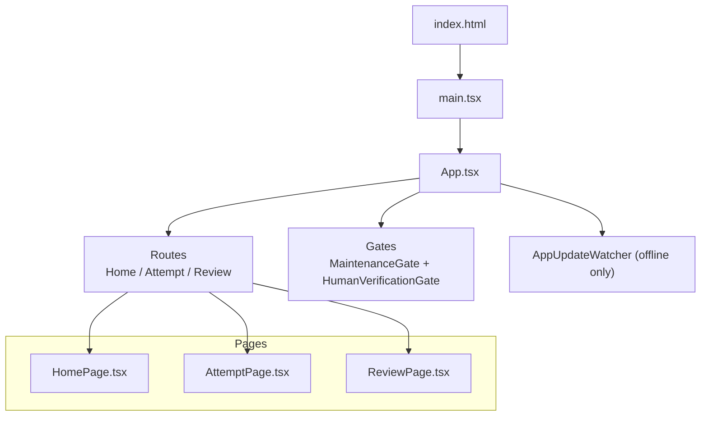
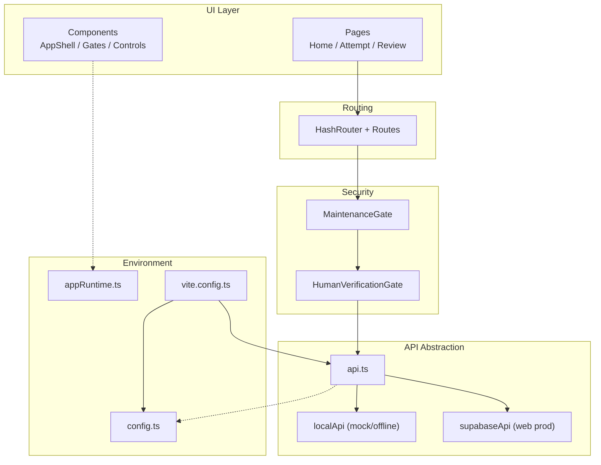
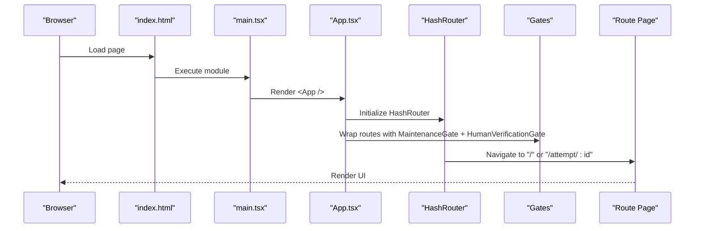
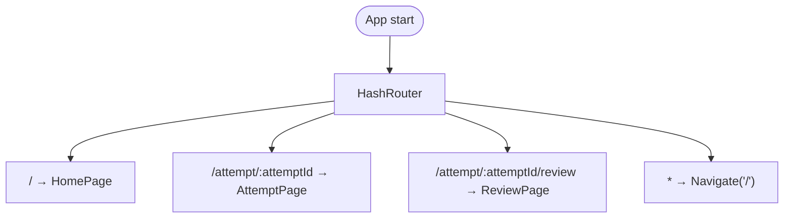
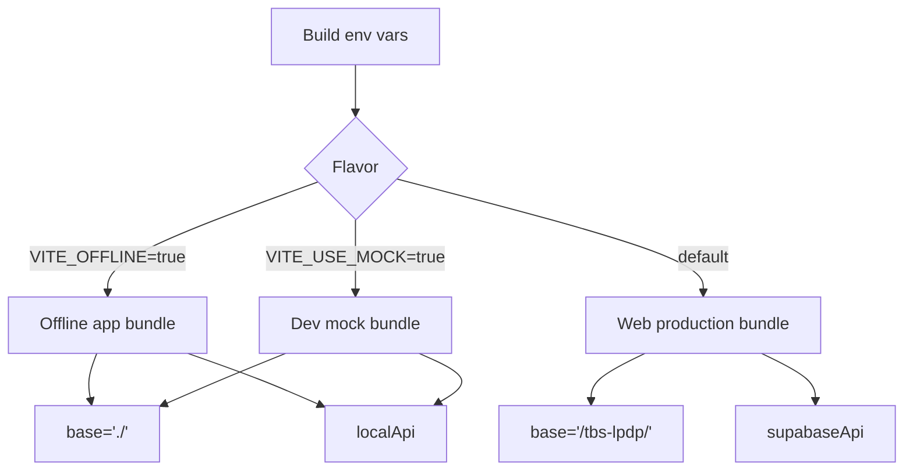
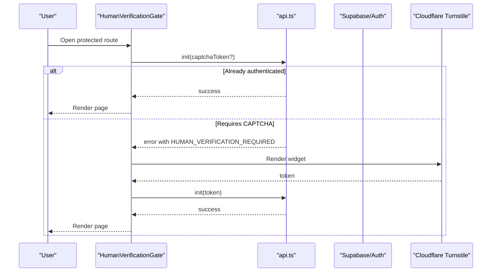
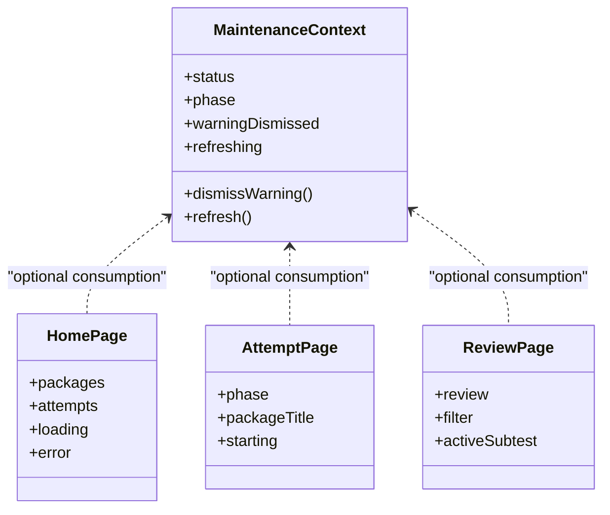
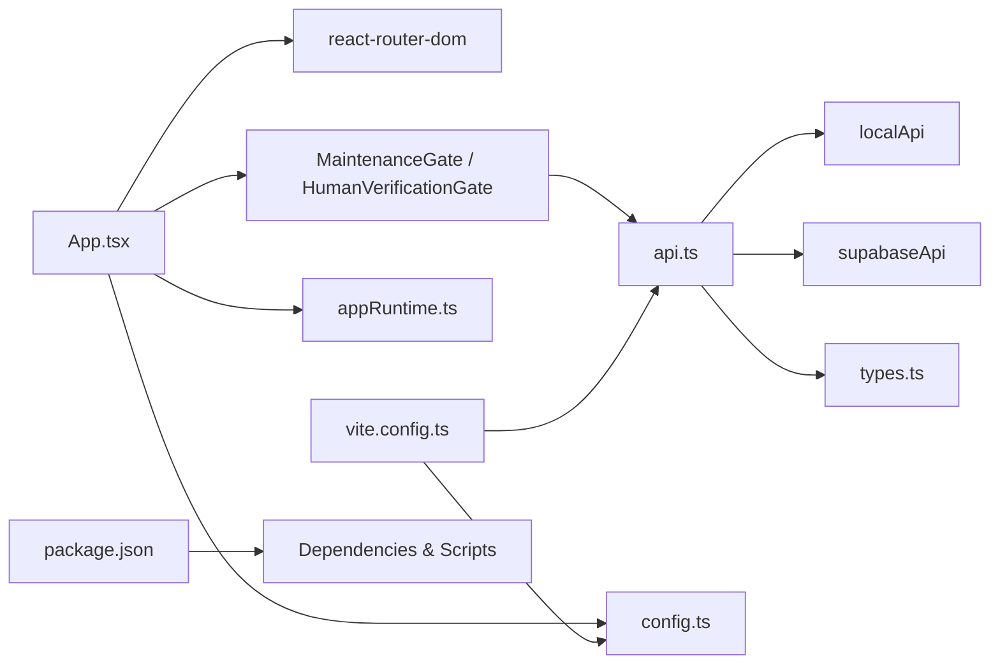

# Application Structure

<cite>
**Referenced Files in This Document**
- [main.tsx](file://web/src/main.tsx)
- [App.tsx](file://web/src/App.tsx)
- [vite.config.ts](file://web/vite.config.ts)
- [package.json](file://web/package.json)
- [index.html](file://web/index.html)
- [config.ts](file://web/src/lib/config.ts)
- [api.ts](file://web/src/lib/api.ts)
- [appRuntime.ts](file://web/src/lib/appRuntime.ts)
- [MaintenanceContext.ts](file://web/src/contexts/MaintenanceContext.ts)
- [MaintenanceGate.tsx](file://web/src/components/MaintenanceGate.tsx)
- [HumanVerificationGate.tsx](file://web/src/components/HumanVerificationGate.tsx)
- [HomePage.tsx](file://web/src/pages/HomePage.tsx)
- [AttemptPage.tsx](file://web/src/pages/AttemptPage.tsx)
- [ReviewPage.tsx](file://web/src/pages/ReviewPage.tsx)
- [AppShell.tsx](file://web/src/components/AppShell.tsx)
</cite>

## Table of Contents
1. Introduction
2. Project Structure
3. Core Components
4. Architecture Overview
5. Detailed Component Analysis
6. Dependency Analysis
7. Performance Considerations
8. Troubleshooting Guide
9. Conclusion

## Introduction
This document explains the TBS LPDP Try Out application structure: a React 18 + TypeScript single-page application built with Vite and optionally wrapped by Tauri for an offline desktop/mobile app. It covers entry points, routing, environment detection, security gates (maintenance mode and human verification), state management approach, and modular architecture patterns used across the codebase.

## Project Structure
The web application lives under web/. The runtime entry is index.html, which mounts the React root and loads main.tsx. App.tsx configures hash-based routing and composes global gates and routes. Vite defines three build flavors via environment flags to produce different bundles for web production, development mock, and offline app.

**Diagram sources**
- [index.html:111-114](file://web/index.html#L111-L114)
- [main.tsx:1-10](file://web/src/main.tsx#L1-L10)
- [App.tsx:44-61](file://web/src/App.tsx#L44-L61)
- [HomePage.tsx:129-131](file://web/src/pages/HomePage.tsx#L129-L131)
- [AttemptPage.tsx:95-141](file://web/src/pages/AttemptPage.tsx#L95-L141)
- [ReviewPage.tsx:168-185](file://web/src/pages/ReviewPage.tsx#L168-L185)

Key responsibilities:
- Entry and bootstrap: index.html provides the DOM root; main.tsx renders React.StrictMode with App.
- Routing: HashRouter ensures GitHub Pages compatibility and works inside Tauri webviews without server rewrites.
- Flavor selection: Vite config sets base path and inlines flavor constants so each bundle contains only its backend and features.

**Section sources**
- [index.html:111-114](file://web/index.html#L111-L114)
- [main.tsx:1-10](file://web/src/main.tsx#L1-L10)
- [App.tsx:38-61](file://web/src/App.tsx#L38-L61)
- [vite.config.ts:10-41](file://web/vite.config.ts#L10-L41)

## Core Components
- AppShell: Global chrome (header, menu, footer) and optional chrome hiding during exams.
- MaintenanceGate: Probes maintenance status from the backend and shows MaintenancePage when active.
- HumanVerificationGate: Handles anonymous sign-in flow and Cloudflare Turnstile challenge when required.
- UpdateControls/AppUpdateWatcher: Offline-app-specific update mechanisms.

State and configuration:
- Build-time flags: IS_OFFLINE_APP, USE_MOCK, USE_LOCAL_ENGINE control feature inclusion and backend selection.
- Runtime environment: appRuntime detects Tauri and platform capabilities (print, external links).
- Context: MaintenanceContext exposes maintenance UI state to consumers.

**Section sources**
- [AppShell.tsx:8-53](file://web/src/components/AppShell.tsx#L8-L53)
- [MaintenanceGate.tsx:35-140](file://web/src/components/MaintenanceGate.tsx#L35-L140)
- [HumanVerificationGate.tsx:77-158](file://web/src/components/HumanVerificationGate.tsx#L77-L158)
- [config.ts:11-43](file://web/src/lib/config.ts#L11-L43)
- [api.ts:3-12](file://web/src/lib/api.ts#L3-L12)
- [appRuntime.ts:12-73](file://web/src/lib/appRuntime.ts#L12-L73)
- [MaintenanceContext.ts:1-25](file://web/src/contexts/MaintenanceContext.ts#L1-L25)

## Architecture Overview
The application uses a layered, modular design:
- Presentation layer: React pages and components.
- Routing layer: react-router-dom with HashRouter.
- Security gates: MaintenanceGate and HumanVerificationGate wrap all routes.
- API abstraction: api.ts dynamically selects localApi or supabaseApi based on build flavor.
- Environment detection: vite.config.ts and config.ts define compile-time flags; appRuntime detects runtime shell/platform.

**Diagram sources**
- [App.tsx:44-61](file://web/src/App.tsx#L44-L61)
- [api.ts:38-75](file://web/src/lib/api.ts#L38-L75)
- [config.ts:11-43](file://web/src/lib/config.ts#L11-L43)
- [appRuntime.ts:12-73](file://web/src/lib/appRuntime.ts#L12-L73)
- [vite.config.ts:18-41](file://web/vite.config.ts#L18-L41)

## Detailed Component Analysis

### Entry Points and Bootstrapping
- index.html mounts #root and loads main.tsx as a module.
- main.tsx creates the React 18 root and renders <App /> inside StrictMode.
- App.tsx sets up HashRouter, global scroll-to-top behavior, route metadata, optional updater watcher, and security gates before rendering Routes.

**Diagram sources**
- [index.html:111-114](file://web/index.html#L111-L114)
- [main.tsx:1-10](file://web/src/main.tsx#L1-L10)
- [App.tsx:44-61](file://web/src/App.tsx#L44-L61)

**Section sources**
- [index.html:111-114](file://web/index.html#L111-L114)
- [main.tsx:1-10](file://web/src/main.tsx#L1-L10)
- [App.tsx:13-61](file://web/src/App.tsx#L13-L61)

### Hash-Based Routing for GitHub Pages and Tauri
- HashRouter avoids deep-link 404s on GitHub Pages and keeps routes host-agnostic for Tauri webview usage.
- Routes include home, attempt, review, and a catch-all redirect to home.

**Diagram sources**
- [App.tsx:38-61](file://web/src/App.tsx#L38-L61)

**Section sources**
- [App.tsx:38-61](file://web/src/App.tsx#L38-L61)

### Platform Detection and Offline vs Web Behavior
- Build-time flags:
  - VITE_OFFLINE: enables offline app flavor (local engine, bundled bank, no Supabase/Turnstile).
  - VITE_USE_MOCK: enables dev mock flavor (local engine with serve-only bank middleware).
  - TAURI_ENV_PLATFORM: detected at build time to adjust base path and targets.
- Runtime detection:
  - appRuntime.isTauri() checks for Tauri internals.
  - appRuntime.isAndroidApp() uses user agent within Tauri.
  - Feature toggles like canPrint() adapt UI to platform capabilities.

**Diagram sources**
- [vite.config.ts:10-41](file://web/vite.config.ts#L10-L41)
- [api.ts:3-12](file://web/src/lib/api.ts#L3-L12)
- [config.ts:11-43](file://web/src/lib/config.ts#L11-L43)

**Section sources**
- [vite.config.ts:10-52](file://web/vite.config.ts#L10-L52)
- [api.ts:3-12](file://web/src/lib/api.ts#L3-L12)
- [config.ts:11-43](file://web/src/lib/config.ts#L11-L43)
- [appRuntime.ts:12-73](file://web/src/lib/appRuntime.ts#L12-L73)

### Security Gates: Maintenance Mode and Human Verification
- MaintenanceGate:
  - Polls backend for maintenance schedule and phase.
  - Shows MaintenancePage during maintenance windows; otherwise passes through.
  - Supports dismissing warnings per schedule key using sessionStorage.
- HumanVerificationGate:
  - Calls api.init(); if server requires CAPTCHA, renders Cloudflare Turnstile widget.
  - In mock or already verified phases, renders children immediately.
  - Dynamically loads Turnstile script only when needed.

**Diagram sources**
- [HumanVerificationGate.tsx:77-158](file://web/src/components/HumanVerificationGate.tsx#L77-L158)
- [api.ts:77-95](file://web/src/lib/api.ts#L77-L95)
- [config.ts:54-60](file://web/src/lib/config.ts#L54-L60)

**Section sources**
- [MaintenanceGate.tsx:35-140](file://web/src/components/MaintenanceGate.tsx#L35-L140)
- [HumanVerificationGate.tsx:77-204](file://web/src/components/HumanVerificationGate.tsx#L77-L204)
- [config.ts:54-60](file://web/src/lib/config.ts#L54-L60)

### State Management Approach
- No global Redux/Zustand store is used. State is component-local or context-scoped:
  - MaintenanceContext holds maintenance UI state (status, phase, dismissal, refresh).
  - Pages manage their own data fetching and UI state (e.g., HomePage packages/attempts, AttemptPage phases, ReviewPage filters).
- API responses are cached locally per component lifecycle; background writes use retry helpers.

**Diagram sources**
- [MaintenanceContext.ts:1-25](file://web/src/contexts/MaintenanceContext.ts#L1-L25)
- [HomePage.tsx:44-92](file://web/src/pages/HomePage.tsx#L44-L92)
- [AttemptPage.tsx:21-76](file://web/src/pages/AttemptPage.tsx#L21-L76)
- [ReviewPage.tsx:53-87](file://web/src/pages/ReviewPage.tsx#L53-L87)

**Section sources**
- [MaintenanceContext.ts:1-25](file://web/src/contexts/MaintenanceContext.ts#L1-L25)
- [HomePage.tsx:44-92](file://web/src/pages/HomePage.tsx#L44-L92)
- [AttemptPage.tsx:21-76](file://web/src/pages/AttemptPage.tsx#L21-L76)
- [ReviewPage.tsx:53-87](file://web/src/pages/ReviewPage.tsx#L53-L87)

### Modular Architecture Patterns
- Lazy backend selection: api.ts dynamically imports localApi or supabaseApi based on build-time literals, enabling dead-code elimination of answer keys or Supabase client per flavor.
- Feature gating via compile-time constants: IS_OFFLINE_APP, USE_MOCK, USE_LOCAL_ENGINE ensure minimal bundles for each deployment target.
- Shell abstraction: appRuntime encapsulates Tauri-specific calls behind dynamic imports and browser fallbacks.
- Context-driven UI state: MaintenanceContext centralizes maintenance-related UI state while keeping business logic decoupled.

**Section sources**
- [api.ts:3-12](file://web/src/lib/api.ts#L3-L12)
- [api.ts:38-75](file://web/src/lib/api.ts#L38-L75)
- [config.ts:11-43](file://web/src/lib/config.ts#L11-L43)
- [appRuntime.ts:12-73](file://web/src/lib/appRuntime.ts#L12-L73)

## Dependency Analysis
- Routing dependencies: react-router-dom provides HashRouter and Routes.
- API dependencies: api.ts depends on either localApi or supabaseApi; both implement ExamApi.
- Environment dependencies: vite.config.ts defines base paths and plugins; package.json lists runtime and dev dependencies including Tauri plugins.

**Diagram sources**
- [App.tsx:1-11](file://web/src/App.tsx#L1-L11)
- [api.ts:3-12](file://web/src/lib/api.ts#L3-L12)
- [config.ts:11-43](file://web/src/lib/config.ts#L11-L43)
- [appRuntime.ts:12-73](file://web/src/lib/appRuntime.ts#L12-L73)
- [vite.config.ts:18-41](file://web/vite.config.ts#L18-L41)
- [package.json:24-44](file://web/package.json#L24-L44)

**Section sources**
- [package.json:24-44](file://web/package.json#L24-L44)
- [api.ts:3-12](file://web/src/lib/api.ts#L3-L12)
- [vite.config.ts:18-41](file://web/vite.config.ts#L18-L41)

## Performance Considerations
- Bundle size optimization:
  - Build-time flag inlining ensures only one backend is included per flavor.
  - Dynamic imports for Tauri plugins and third-party scripts reduce initial payload.
- Network efficiency:
  - MaintenanceGate polls at intervals with timeouts to avoid blocking UI.
  - API retries with exponential backoff for transient errors.
- Rendering:
  - HashRouter avoids server rewrites and reduces navigation overhead on static hosting.
  - Chrome hiding during exam sections prevents accidental navigation and reduces layout shifts.

[No sources needed since this section provides general guidance]

## Troubleshooting Guide
- Missing backend configuration:
  - If Supabase URL/key are not set, the home page displays a notice instructing how to configure or run mock mode.
- Capacity limits:
  - When storage capacity is full, starting new attempts is blocked with a clear message; existing attempts remain usable.
- Maintenance mode:
  - During scheduled maintenance, users see MaintenancePage; warnings can be dismissed per schedule key.
- Human verification failures:
  - If Turnstile fails to load or verify, users can retry; errors are surfaced with actionable messages.

**Section sources**
- [HomePage.tsx:139-147](file://web/src/pages/HomePage.tsx#L139-L147)
- [HomePage.tsx:155-161](file://web/src/pages/HomePage.tsx#L155-L161)
- [MaintenanceGate.tsx:35-140](file://web/src/components/MaintenanceGate.tsx#L35-L140)
- [HumanVerificationGate.tsx:156-204](file://web/src/components/HumanVerificationGate.tsx#L156-L204)

## Conclusion
The TBS LPDP Try Out application is a well-structured React 18 + TypeScript SPA that cleanly separates concerns across routing, security gates, API abstraction, and environment detection. Vite’s build-time flavor system produces optimized bundles for web, dev mock, and offline app modes. Hash-based routing ensures compatibility with GitHub Pages and Tauri webviews. Security gates protect access via maintenance scheduling and human verification, while a lightweight, context-driven state strategy keeps the UI responsive and maintainable.

[No sources needed since this section summarizes without analyzing specific files]