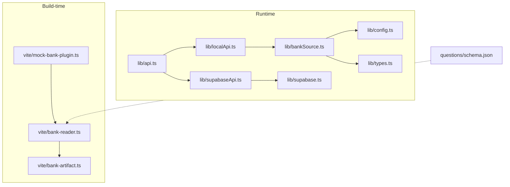
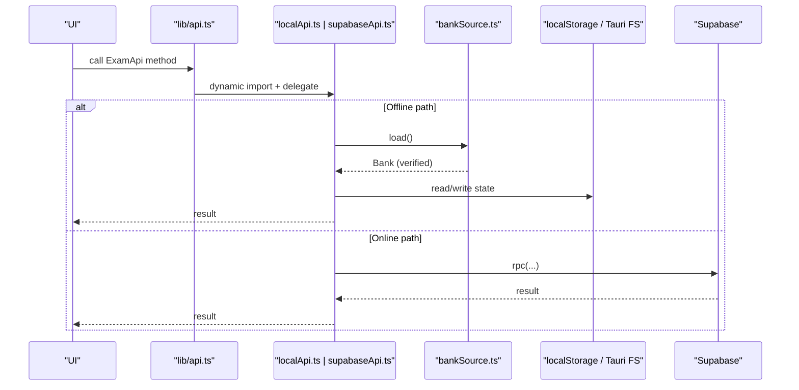
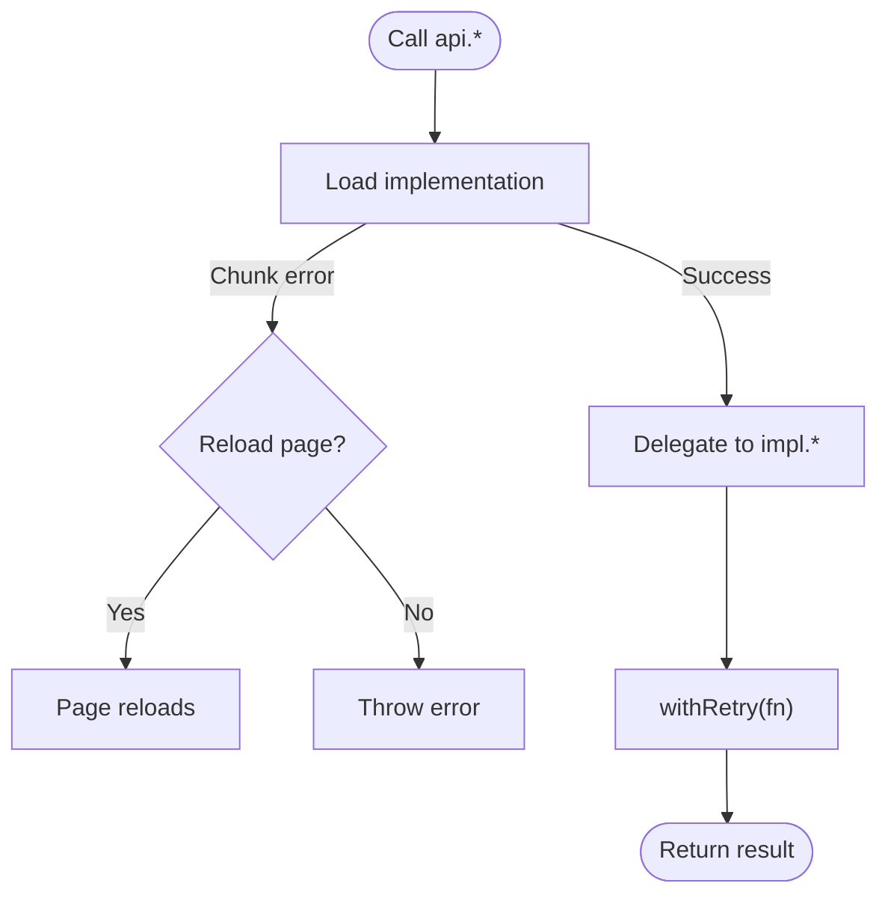
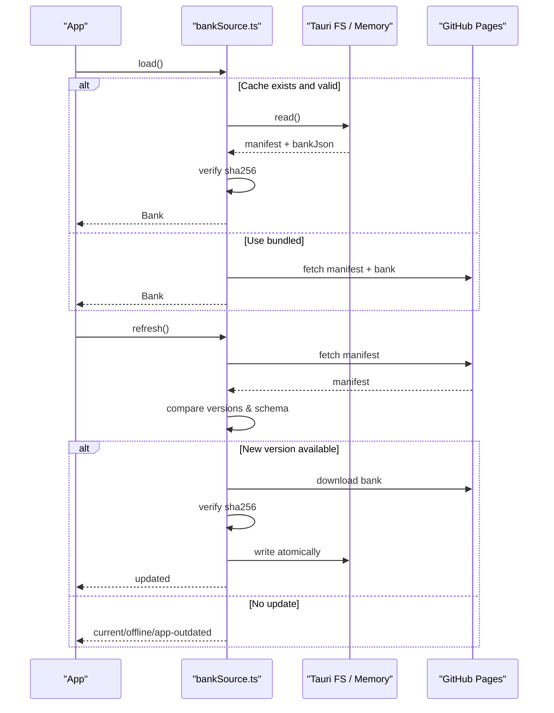
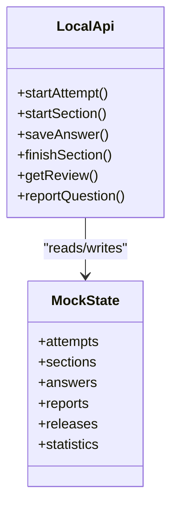
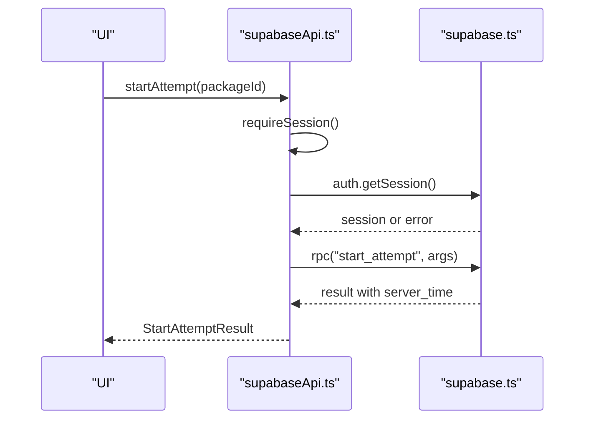
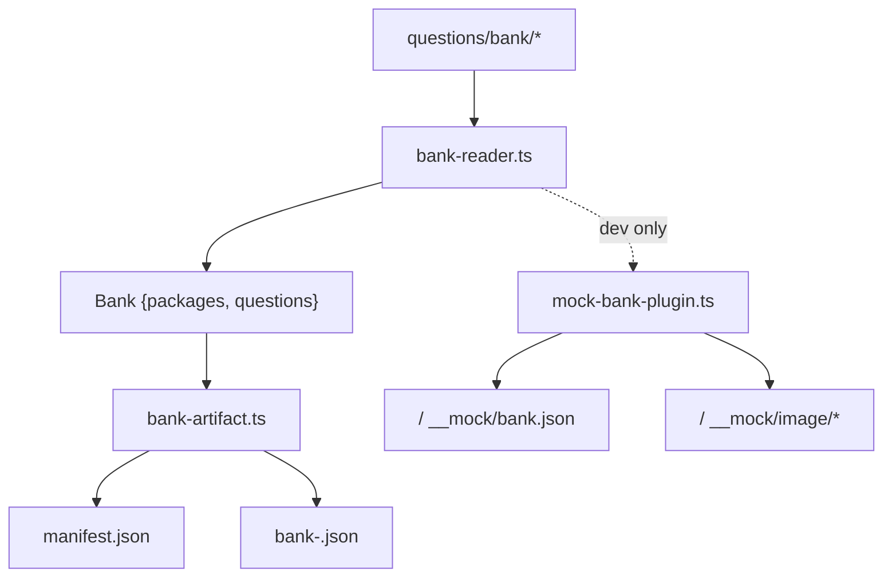
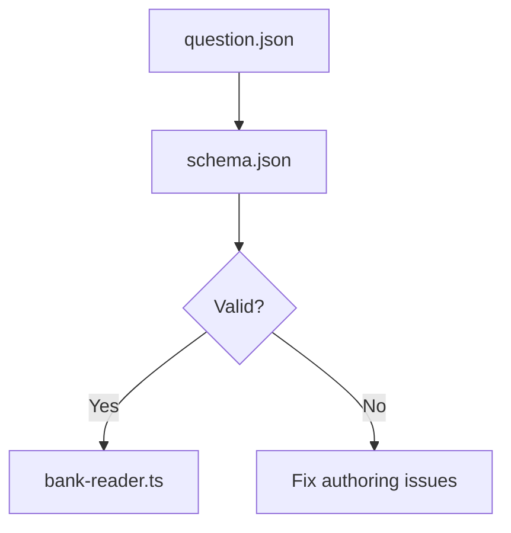
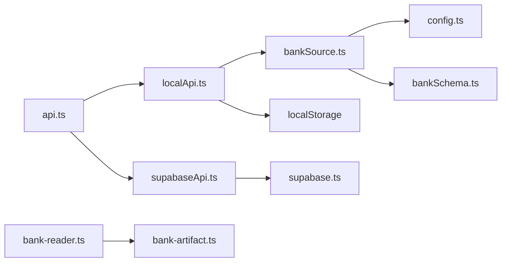

# Data Management

<cite>
**Referenced Files in This Document**
- [bankSource.ts](file://web/src/lib/bankSource.ts)
- [localApi.ts](file://web/src/lib/localApi.ts)
- [supabaseApi.ts](file://web/src/lib/supabaseApi.ts)
- [api.ts](file://web/src/lib/api.ts)
- [types.ts](file://web/src/lib/types.ts)
- [bankSchema.ts](file://web/src/lib/bankSchema.ts)
- [config.ts](file://web/src/lib/config.ts)
- [supabase.ts](file://web/src/lib/supabase.ts)
- [bank-reader.ts](file://web/vite/bank-reader.ts)
- [bank-artifact.ts](file://web/vite/bank-artifact.ts)
- [mock-bank-plugin.ts](file://web/vite/mock-bank-plugin.ts)
- [schema.json](file://questions/schema.json)
</cite>

## Table of Contents
1. Introduction
2. Project Structure
3. Core Components
4. Architecture Overview
5. Detailed Component Analysis
6. Dependency Analysis
7. Performance Considerations
8. Troubleshooting Guide
9. Conclusion

## Introduction
This document explains the data management layer of the TBS LPDP Try Out application with a focus on how questions are sourced, validated, transformed, cached, and served through a unified API. It covers:
- The abstracted question source that supports both local (offline) and remote (Supabase) backends
- JSON schema validation for question integrity
- API client implementations for Supabase and a local offline engine
- A unified API interface that hides backend differences from the UI
- Data loading strategies, caching mechanisms, error handling patterns, and offline behavior
- Bank reader/writer utilities, transformation pipelines, and version management for question packages

## Project Structure
The data layer spans runtime libraries and build-time tooling:
- Runtime libraries provide the unified API, offline bank sourcing, and Supabase integration
- Build-time tools compile the git-backed question bank into artifacts consumed by the app or dev server

**Diagram sources**
- [api.ts:1-128](file://web/src/lib/api.ts#L1-L128)
- [localApi.ts:1-560](file://web/src/lib/localApi.ts#L1-L560)
- [supabaseApi.ts:1-170](file://web/src/lib/supabaseApi.ts#L1-L170)
- [bankSource.ts:1-323](file://web/src/lib/bankSource.ts#L1-L323)
- [types.ts:1-256](file://web/src/lib/types.ts#L1-L256)
- [config.ts:1-68](file://web/src/lib/config.ts#L1-L68)
- [supabase.ts:1-14](file://web/src/lib/supabase.ts#L1-L14)
- [bank-reader.ts:1-298](file://web/vite/bank-reader.ts#L1-L298)
- [bank-artifact.ts:1-56](file://web/vite/bank-artifact.ts#L1-L56)
- [mock-bank-plugin.ts:1-52](file://web/vite/mock-bank-plugin.ts#L1-L52)
- [schema.json:1-98](file://questions/schema.json#L1-L98)

**Section sources**
- [api.ts:1-128](file://web/src/lib/api.ts#L1-L128)
- [bank-reader.ts:1-298](file://web/vite/bank-reader.ts#L1-L298)
- [bank-artifact.ts:1-56](file://web/vite/bank-artifact.ts#L1-L56)
- [mock-bank-plugin.ts:1-52](file://web/vite/mock-bank-plugin.ts#L1-L52)

## Core Components
- Unified API selector: chooses between local and Supabase implementations at runtime based on build flags; provides retry helpers and consistent error formatting.
- Offline bank source: loads a verified, content-addressed bank from cache or bundled snapshot; supports refresh from published GitHub Pages with integrity checks and hot-swap notifications.
- Local exam engine: re-implements the server-side attempt flow using localStorage, pinning attempts to immutable releases derived from the bank.
- Supabase API client: wraps RPC calls, enforces session requirements, and synchronizes server time.
- Bank reader/artifact builder: compiles git-backed question files into a single bank artifact and manifest, embedding images or serving them via dev middleware.
- Schema and types: defines the contract for individual questions, bank structures, and API payloads.

**Section sources**
- [api.ts:1-128](file://web/src/lib/api.ts#L1-L128)
- [bankSource.ts:1-323](file://web/src/lib/bankSource.ts#L1-L323)
- [localApi.ts:1-560](file://web/src/lib/localApi.ts#L1-L560)
- [supabaseApi.ts:1-170](file://web/src/lib/supabaseApi.ts#L1-L170)
- [bank-reader.ts:1-298](file://web/vite/bank-reader.ts#L1-L298)
- [bank-artifact.ts:1-56](file://web/vite/bank-artifact.ts#L1-L56)
- [types.ts:1-256](file://web/src/lib/types.ts#L1-L256)
- [schema.json:1-98](file://questions/schema.json#L1-L98)

## Architecture Overview
The system exposes a single ExamApi surface used by the UI. Depending on build configuration, it delegates to either:
- Local engine backed by an offline bank source and localStorage
- Supabase RPCs over a configured project

**Diagram sources**
- [api.ts:1-128](file://web/src/lib/api.ts#L1-L128)
- [localApi.ts:1-560](file://web/src/lib/localApi.ts#L1-L560)
- [supabaseApi.ts:1-170](file://web/src/lib/supabaseApi.ts#L1-L170)
- [bankSource.ts:1-323](file://web/src/lib/bankSource.ts#L1-L323)

## Detailed Component Analysis

### Unified API Interface
- Lazy selection: chooses implementation once per page load based on build flags; drops unused code paths to keep bundles small.
- Retry wrapper: retries transient failures with exponential backoff while treating terminal codes as immediate errors.
- Error normalization: converts backend errors to a common ApiError type with stable codes.

**Diagram sources**
- [api.ts:1-128](file://web/src/lib/api.ts#L1-L128)

**Section sources**
- [api.ts:1-128](file://web/src/lib/api.ts#L1-L128)
- [config.ts:1-68](file://web/src/lib/config.ts#L1-L68)

### Offline Question Source Abstraction
- Two sources: dev middleware (Vite serve only) and offline source (bundled snapshot + verified cache).
- Loading strategy: prefer verified cache; fall back to bundled snapshot; never trust unverified bytes.
- Refresh strategy: fetch manifest with short timeout; compare versions; download and verify SHA-256; atomically write content-addressed file and manifest; hot-swap active bank and notify subscribers.
- Persistence: Tauri filesystem under AppData with atomic writes and cleanup of superseded revisions; browser dev mode uses memory-only store.

**Diagram sources**
- [bankSource.ts:1-323](file://web/src/lib/bankSource.ts#L1-L323)
- [bankSchema.ts:1-84](file://web/src/lib/bankSchema.ts#L1-L84)

**Section sources**
- [bankSource.ts:1-323](file://web/src/lib/bankSource.ts#L1-L323)
- [bankSchema.ts:1-84](file://web/src/lib/bankSchema.ts#L1-L84)
- [config.ts:1-68](file://web/src/lib/config.ts#L1-L68)

### Local Exam Engine (Offline)
- State model: attempts, sections, answers, reports, releases, statistics persisted in localStorage.
- Attempt pinning: each attempt pins to a release_id computed from package manifest and questions; safe against bank hot-swaps.
- Grading and deadlines: grades locally when finishing or when deadline passes; computes scores and updates statistics.
- Reporting: rate-limited per hour; keyed by release_id and question_id to ensure immutability.

**Diagram sources**
- [localApi.ts:1-560](file://web/src/lib/localApi.ts#L1-L560)

**Section sources**
- [localApi.ts:1-560](file://web/src/lib/localApi.ts#L1-L560)
- [types.ts:1-256](file://web/src/lib/types.ts#L1-L256)

### Supabase API Client
- Session enforcement: requires anonymous session (with Turnstile token when configured) before most operations.
- RPC wrapper: centralizes error mapping and server time synchronization.
- Subtest ordering: ensures deterministic order of subtests in responses.

**Diagram sources**
- [supabaseApi.ts:1-170](file://web/src/lib/supabaseApi.ts#L1-L170)
- [supabase.ts:1-14](file://web/src/lib/supabase.ts#L1-L14)

**Section sources**
- [supabaseApi.ts:1-170](file://web/src/lib/supabaseApi.ts#L1-L170)
- [supabase.ts:1-14](file://web/src/lib/supabase.ts#L1-L14)
- [config.ts:1-68](file://web/src/lib/config.ts#L1-L68)

### Bank Reader/Writer Utilities and Transformation Pipeline
- Reader: scans package directories, reads package manifests and question files, applies blueprint metadata, computes per-question revision numbers from git history, and builds the Bank structure. Images are either inlined as data URIs or served via dev middleware URLs.
- Artifact builder: serializes the Bank to JSON, computes its SHA-256, produces a content-addressed filename, and emits a manifest pointing to the bank file with integrity and size metadata.
- Dev plugin: serves the compiled bank and image assets during development without bundling them into production.

**Diagram sources**
- [bank-reader.ts:1-298](file://web/vite/bank-reader.ts#L1-L298)
- [bank-artifact.ts:1-56](file://web/vite/bank-artifact.ts#L1-L56)
- [mock-bank-plugin.ts:1-52](file://web/vite/mock-bank-plugin.ts#L1-L52)

**Section sources**
- [bank-reader.ts:1-298](file://web/vite/bank-reader.ts#L1-L298)
- [bank-artifact.ts:1-56](file://web/vite/bank-artifact.ts#L1-L56)
- [mock-bank-plugin.ts:1-52](file://web/vite/mock-bank-plugin.ts#L1-L52)

### JSON Schema Validation for Question Integrity
- Single source of truth schema defines required fields, allowed enums, option constraints, and explanation lengths for each question.
- Enforced during authoring/validation tooling; the runtime relies on the compiled Bank shape and manifest integrity to ensure safety.

**Diagram sources**
- [schema.json:1-98](file://questions/schema.json#L1-L98)
- [bank-reader.ts:1-298](file://web/vite/bank-reader.ts#L1-L298)

**Section sources**
- [schema.json:1-98](file://questions/schema.json#L1-L98)

### Version Management for Question Packages
- Manifest schema_version and bank_schema_version guard compatibility; apps refuse newer schemas and prompt updates.
- Content-addressed bank filenames ensure immutability; attempts pin to release_id derived from package manifest and questions.
- Git-based revision tracking yields stable question_version and generated_at timestamps for reproducible artifacts.

**Section sources**
- [bankSchema.ts:1-84](file://web/src/lib/bankSchema.ts#L1-L84)
- [bank-reader.ts:1-298](file://web/vite/bank-reader.ts#L1-L298)
- [bank-artifact.ts:1-56](file://web/vite/bank-artifact.ts#L1-L56)
- [localApi.ts:1-560](file://web/src/lib/localApi.ts#L1-L560)

## Dependency Analysis
- The unified API depends on either the local engine or Supabase client; the offline path excludes the Supabase library entirely.
- The offline bank source depends on config flags and optional Tauri filesystem plugin; the dev path depends on Vite middleware.
- Types define shared contracts across components; schema.json constrains authoring inputs.

**Diagram sources**
- [api.ts:1-128](file://web/src/lib/api.ts#L1-L128)
- [localApi.ts:1-560](file://web/src/lib/localApi.ts#L1-L560)
- [supabaseApi.ts:1-170](file://web/src/lib/supabaseApi.ts#L1-L170)
- [bankSource.ts:1-323](file://web/src/lib/bankSource.ts#L1-L323)
- [bank-reader.ts:1-298](file://web/vite/bank-reader.ts#L1-L298)
- [bank-artifact.ts:1-56](file://web/vite/bank-artifact.ts#L1-L56)
- [config.ts:1-68](file://web/src/lib/config.ts#L1-L68)
- [bankSchema.ts:1-84](file://web/src/lib/bankSchema.ts#L1-L84)

**Section sources**
- [api.ts:1-128](file://web/src/lib/api.ts#L1-L128)
- [localApi.ts:1-560](file://web/src/lib/localApi.ts#L1-L560)
- [supabaseApi.ts:1-170](file://web/src/lib/supabaseApi.ts#L1-L170)
- [bankSource.ts:1-323](file://web/src/lib/bankSource.ts#L1-L323)

## Performance Considerations
- Lazy imports: Supabase client is loaded only in online builds; offline builds exclude it entirely.
- Cached bank: verified cache avoids repeated network downloads; bundled snapshot provides fast cold starts.
- Atomic writes: content-addressed files and temporary files prevent partial updates and reduce corruption risk.
- Short timeouts: manifest checks use tight timeouts to avoid blocking UI startup.
- In-memory vs disk: dev offline mode uses memory store to avoid disk overhead during development.

[No sources needed since this section provides general guidance]

## Troubleshooting Guide
- Chunk load errors: the unified API detects dynamic import failures and triggers a controlled reload to fetch fresh chunks.
- Network timeouts: manifest and bank downloads enforce timeouts; failures return structured results indicating offline or error states.
- Integrity verification: if downloaded bank does not match manifest digest, the old bank remains in place and an error is returned.
- Storage capacity: local engine enforces storage limits and rate limits for reporting; errors carry stable codes to guide retries or user messaging.
- Maintenance windows: local engine can simulate maintenance phases for testing; production reads from configured status.

**Section sources**
- [api.ts:1-128](file://web/src/lib/api.ts#L1-L128)
- [bankSource.ts:1-323](file://web/src/lib/bankSource.ts#L1-L323)
- [localApi.ts:1-560](file://web/src/lib/localApi.ts#L1-L560)
- [config.ts:1-68](file://web/src/lib/config.ts#L1-L68)

## Conclusion
The data management layer provides a robust, offline-first architecture with strong integrity guarantees and a clean abstraction over multiple backends. The bank reader and artifact builder produce deterministic, content-addressed question packages, while the offline bank source caches and verifies updates safely. The unified API decouples the UI from backend specifics, enabling seamless operation in both online and offline modes with consistent error handling and performance characteristics.

[No sources needed since this section summarizes without analyzing specific files]