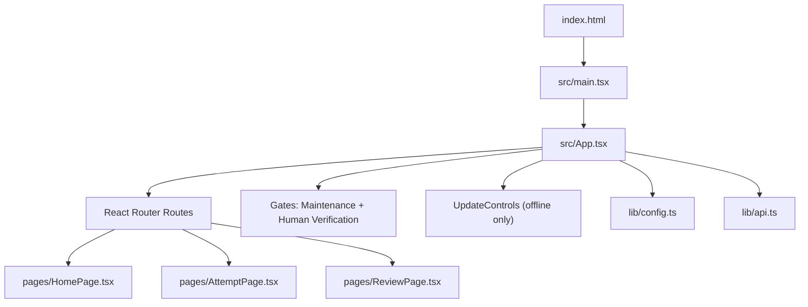
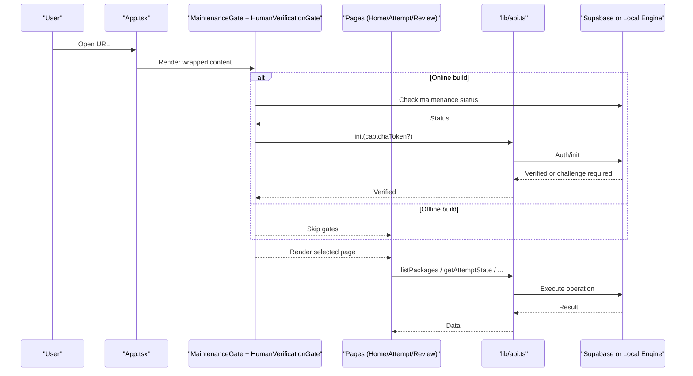
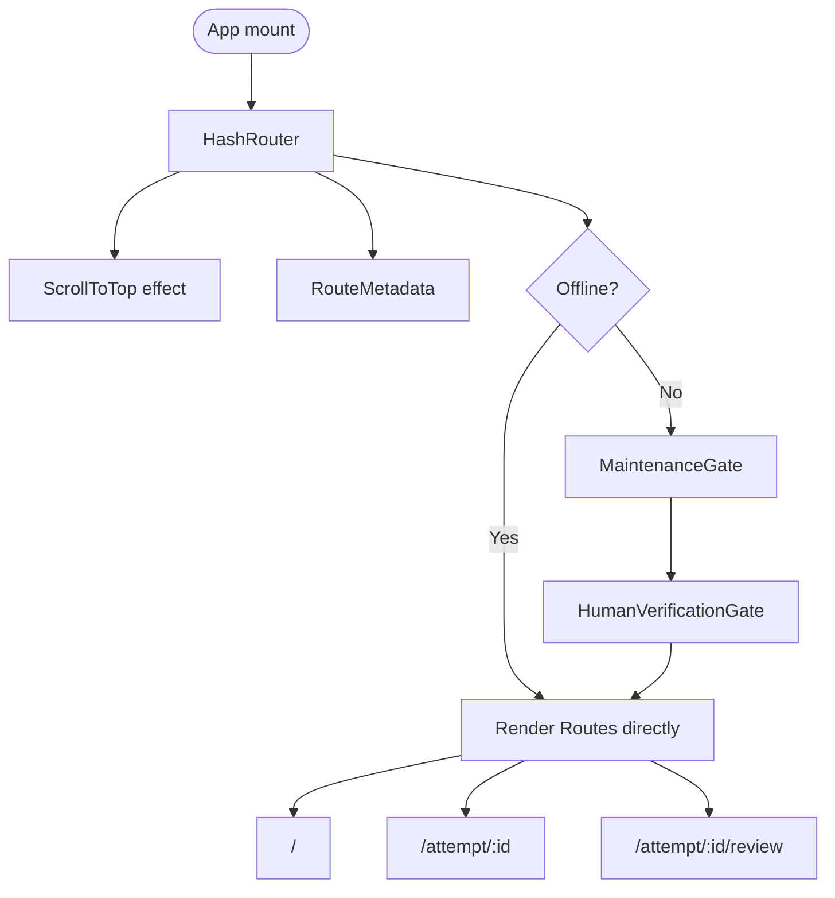
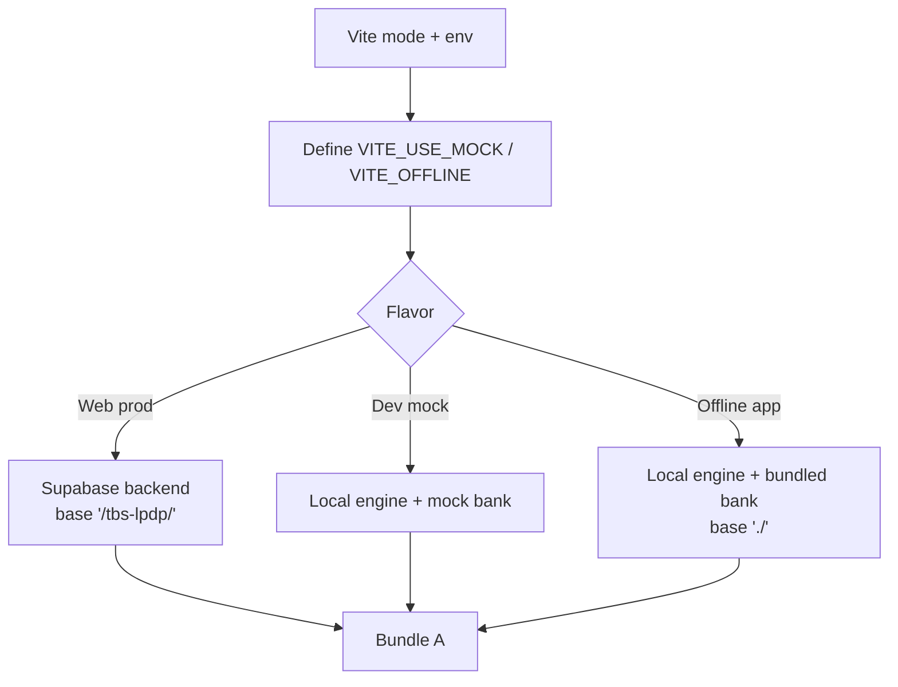
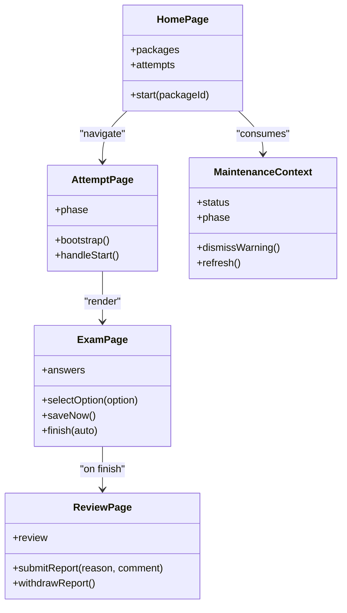
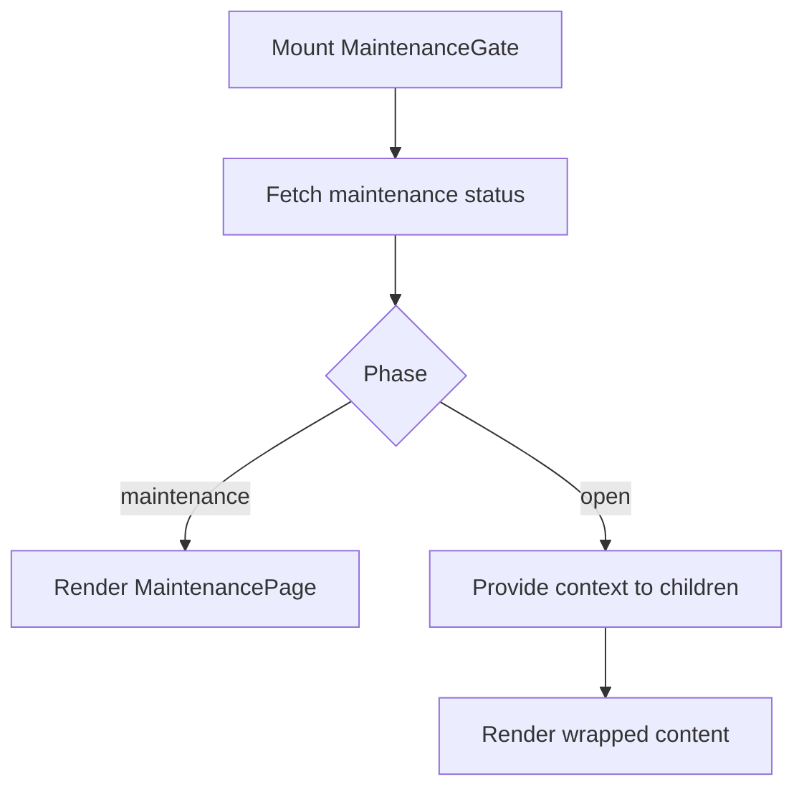
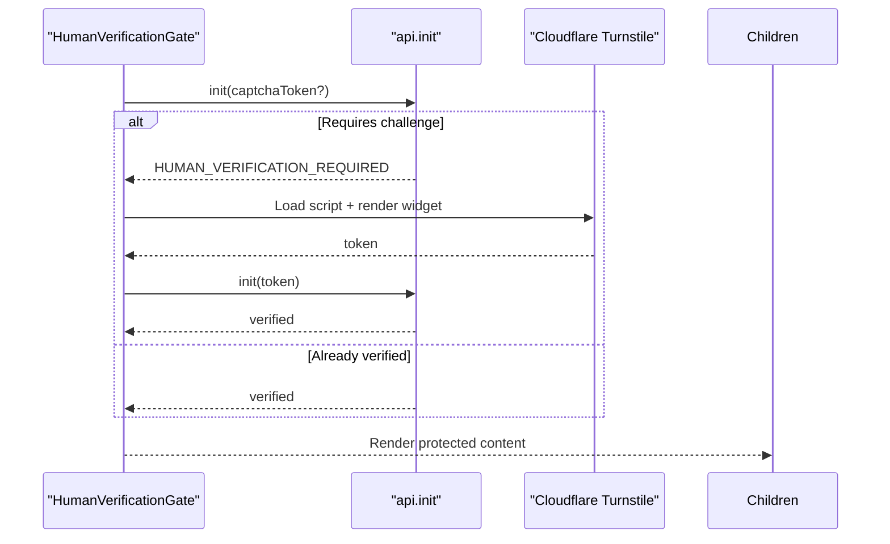
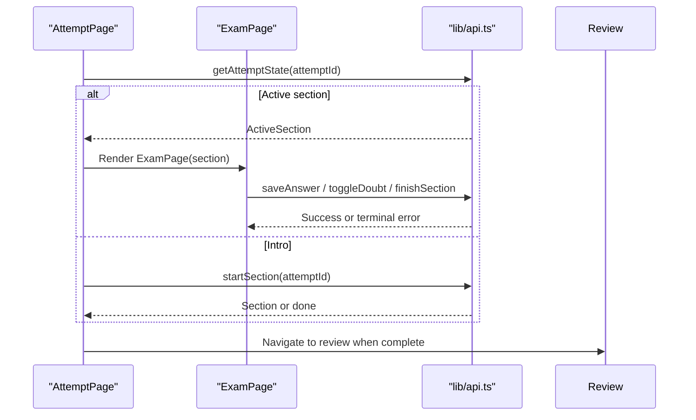
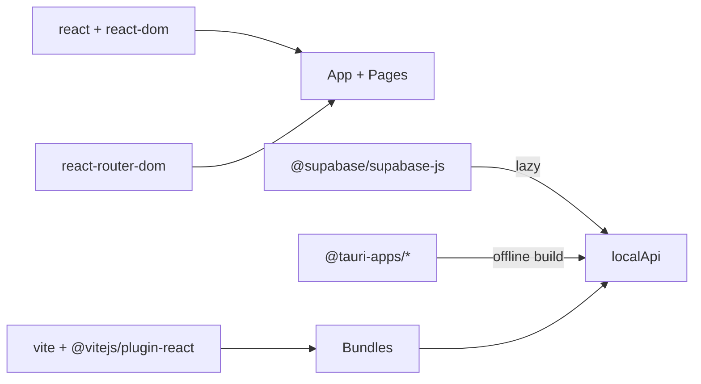

# Frontend Application

<cite>
**Referenced Files in This Document**
- [package.json](file://web/package.json)
- [vite.config.ts](file://web/vite.config.ts)
- [index.html](file://web/index.html)
- [tsconfig.json](file://web/tsconfig.json)
- [main.tsx](file://web/src/main.tsx)
- [App.tsx](file://web/src/App.tsx)
- [config.ts](file://web/src/lib/config.ts)
- [api.ts](file://web/src/lib/api.ts)
- [MaintenanceGate.tsx](file://web/src/components/MaintenanceGate.tsx)
- [HumanVerificationGate.tsx](file://web/src/components/HumanVerificationGate.tsx)
- [MaintenanceContext.ts](file://web/src/contexts/MaintenanceContext.ts)
- [HomePage.tsx](file://web/src/pages/HomePage.tsx)
- [AttemptPage.tsx](file://web/src/pages/AttemptPage.tsx)
- [ExamPage.tsx](file://web/src/pages/ExamPage.tsx)
- [ReviewPage.tsx](file://web/src/pages/ReviewPage.tsx)
</cite>

## Table of Contents
1. Introduction
2. Project Structure
3. Core Components
4. Architecture Overview
5. Detailed Component Analysis
6. Dependency Analysis
7. Performance Considerations
8. Troubleshooting Guide
9. Conclusion

## Introduction
This document describes the TBS LPDP Try Out frontend single-page application built with React 18 and TypeScript, using Vite for building and development. It explains the component hierarchy, state management approach, hash-based routing for GitHub Pages compatibility, build flavors that target web production, local mock, and an offline desktop/mobile app via Tauri, security gates for maintenance mode and human verification, and the modular organization of components and libraries.

## Project Structure
The application lives under web/. The entry point renders a React root inside index.html and mounts App, which configures routing, global gates, and page routes. Feature modules are organized by pages, shared components, contexts, hooks, and library utilities. Build-time configuration is centralized in vite.config.ts and package scripts define multiple modes (default web, app offline, dev mock).

**Diagram sources**
- [index.html:1-116](file://web/index.html#L1-L116)
- [main.tsx:1-11](file://web/src/main.tsx#L1-L11)
- [App.tsx:1-63](file://web/src/App.tsx#L1-L63)
- [HomePage.tsx:1-400](file://web/src/pages/HomePage.tsx#L1-L400)
- [AttemptPage.tsx:1-142](file://web/src/pages/AttemptPage.tsx#L1-L142)
- [ReviewPage.tsx:1-418](file://web/src/pages/ReviewPage.tsx#L1-L418)
- [config.ts:1-68](file://web/src/lib/config.ts#L1-L68)
- [api.ts:1-128](file://web/src/lib/api.ts#L1-L128)

**Section sources**
- [index.html:1-116](file://web/index.html#L1-L116)
- [package.json:1-46](file://web/package.json#L1-L46)
- [vite.config.ts:1-54](file://web/vite.config.ts#L1-L54)
- [tsconfig.json:1-21](file://web/tsconfig.json#L1-L21)

## Core Components
- Routing and layout: HashRouter with scroll-to-top behavior, route metadata, and catch-all redirect.
- Security gates: Maintenance gate and human verification gate wrap all content; both are disabled in offline mode to avoid network dependencies.
- Offline-only features: Update watcher and bank update event handling are included only in the offline flavor.
- Pages: Home (packages and history), Attempt (section flow), Exam (question engine), Review (results and explanations).
- Library layer: Lazy-loaded backend implementation selection between Supabase API and local engine based on build flags.

Key behaviors:
- Hash-based routing ensures deep links survive refresh on GitHub Pages without server rewrites.
- Build-time constants fold branches so each bundle contains only the necessary backend code.
- Offline mode disables CAPTCHA and maintenance checks and uses local resources.

**Section sources**
- [App.tsx:1-63](file://web/src/App.tsx#L1-L63)
- [MaintenanceGate.tsx:1-141](file://web/src/components/MaintenanceGate.tsx#L1-L141)
- [HumanVerificationGate.tsx:1-204](file://web/src/components/HumanVerificationGate.tsx#L1-L204)
- [api.ts:1-128](file://web/src/lib/api.ts#L1-L128)
- [config.ts:1-68](file://web/src/lib/config.ts#L1-L68)

## Architecture Overview
The application composes three layers:
- UI layer: React pages and components render user flows and state.
- Gate layer: Maintenance and human verification ensure safe access before rendering content.
- Data layer: A lazy-loaded API abstraction selects either a Supabase-backed implementation or a local engine depending on build mode.

**Diagram sources**
- [App.tsx:1-63](file://web/src/App.tsx#L1-L63)
- [MaintenanceGate.tsx:1-141](file://web/src/components/MaintenanceGate.tsx#L1-L141)
- [HumanVerificationGate.tsx:1-204](file://web/src/components/HumanVerificationGate.tsx#L1-L204)
- [api.ts:1-128](file://web/src/lib/api.ts#L1-L128)

## Detailed Component Analysis

### Routing and Entry
- Entry: main.tsx creates a React 18 root and mounts App within StrictMode.
- App: Uses HashRouter for GitHub Pages compatibility, sets up scroll-to-top, route metadata, optional offline updater, and wraps routes with security gates. Routes include home, attempt, and review paths.

**Diagram sources**
- [main.tsx:1-11](file://web/src/main.tsx#L1-L11)
- [App.tsx:1-63](file://web/src/App.tsx#L1-L63)

**Section sources**
- [main.tsx:1-11](file://web/src/main.tsx#L1-L11)
- [App.tsx:1-63](file://web/src/App.tsx#L1-L63)

### Build Flavors and Configuration
- Three flavors controlled by environment variables:
  - Web production (default): Supabase backend, base path /tbs-lpdp/.
  - Dev mock: Local engine with serve-only bank middleware.
  - Offline app: Local engine with bundled/cached bank, base ./, no network needed.
- Vite defines constants to enable dead-code elimination of backends and third-party SDKs.
- Tauri-specific settings adjust base path, target browsers, and dev server behavior.

**Diagram sources**
- [vite.config.ts:1-54](file://web/vite.config.ts#L1-L54)
- [package.json:1-46](file://web/package.json#L1-L46)

**Section sources**
- [vite.config.ts:1-54](file://web/vite.config.ts#L1-L54)
- [package.json:1-46](file://web/package.json#L1-L46)
- [config.ts:1-68](file://web/src/lib/config.ts#L1-L68)

### State Management Approach
- Local component state drives UI phases (loading, error, intro, exam, review).
- Debounced background writes persist answers while preserving optimistic UI.
- Global context exposes maintenance status and actions to consumers.
- Offline updates propagate via a DOM event to refresh catalog data without importing heavy modules into the web bundle.

**Diagram sources**
- [HomePage.tsx:1-400](file://web/src/pages/HomePage.tsx#L1-L400)
- [AttemptPage.tsx:1-142](file://web/src/pages/AttemptPage.tsx#L1-L142)
- [ExamPage.tsx:1-380](file://web/src/pages/ExamPage.tsx#L1-L380)
- [ReviewPage.tsx:1-418](file://web/src/pages/ReviewPage.tsx#L1-L418)
- [MaintenanceContext.ts:1-25](file://web/src/contexts/MaintenanceContext.ts#L1-L25)

**Section sources**
- [HomePage.tsx:1-400](file://web/src/pages/HomePage.tsx#L1-L400)
- [AttemptPage.tsx:1-142](file://web/src/pages/AttemptPage.tsx#L1-L142)
- [ExamPage.tsx:1-380](file://web/src/pages/ExamPage.tsx#L1-L380)
- [ReviewPage.tsx:1-418](file://web/src/pages/ReviewPage.tsx#L1-L418)
- [MaintenanceContext.ts:1-25](file://web/src/contexts/MaintenanceContext.ts#L1-L25)

### Security Gates

#### Maintenance Gate
- Probes maintenance status periodically with timeout protection.
- Displays a maintenance page when active; otherwise renders children.
- Supports warning dismissal per schedule key and boundary-aware refresh.

**Diagram sources**
- [MaintenanceGate.tsx:1-141](file://web/src/components/MaintenanceGate.tsx#L1-L141)

**Section sources**
- [MaintenanceGate.tsx:1-141](file://web/src/components/MaintenanceGate.tsx#L1-L141)
- [MaintenanceContext.ts:1-25](file://web/src/contexts/MaintenanceContext.ts#L1-L25)

#### Human Verification Gate
- Attempts authentication first; if a new anonymous identity is required, shows Cloudflare Turnstile challenge.
- Dynamically loads the Turnstile script only when needed and handles errors gracefully.
- Skips verification in offline or mock builds.

**Diagram sources**
- [HumanVerificationGate.tsx:1-204](file://web/src/components/HumanVerificationGate.tsx#L1-L204)
- [api.ts:1-128](file://web/src/lib/api.ts#L1-L128)
- [config.ts:1-68](file://web/src/lib/config.ts#L1-L68)

**Section sources**
- [HumanVerificationGate.tsx:1-204](file://web/src/components/HumanVerificationGate.tsx#L1-L204)
- [config.ts:1-68](file://web/src/lib/config.ts#L1-L68)

### Exam Flow
- AttemptPage bootstraps the attempt state, handles deadlines, and transitions between intro and exam phases.
- ExamPage manages question navigation, answer selection, debounced saves, doubt toggling, font scaling, and section completion.
- ReviewPage displays scores, per-question explanations, filters, and report submission.

**Diagram sources**
- [AttemptPage.tsx:1-142](file://web/src/pages/AttemptPage.tsx#L1-L142)
- [ExamPage.tsx:1-380](file://web/src/pages/ExamPage.tsx#L1-L380)
- [ReviewPage.tsx:1-418](file://web/src/pages/ReviewPage.tsx#L1-L418)
- [api.ts:1-128](file://web/src/lib/api.ts#L1-L128)

**Section sources**
- [AttemptPage.tsx:1-142](file://web/src/pages/AttemptPage.tsx#L1-L142)
- [ExamPage.tsx:1-380](file://web/src/pages/ExamPage.tsx#L1-L380)
- [ReviewPage.tsx:1-418](file://web/src/pages/ReviewPage.tsx#L1-L418)

### Offline App Behavior
- IS_OFFLINE_APP disables maintenance and human verification gates and includes update controls.
- Bank updates trigger a DOM event to refresh the package catalogue without reloading the entire app.
- Vite config sets base path to relative for Tauri webviews and adjusts targets for embedded browsers.

**Section sources**
- [App.tsx:1-63](file://web/src/App.tsx#L1-L63)
- [HomePage.tsx:1-400](file://web/src/pages/HomePage.tsx#L1-L400)
- [config.ts:1-68](file://web/src/lib/config.ts#L1-L68)
- [vite.config.ts:1-54](file://web/vite.config.ts#L1-L54)

## Dependency Analysis
- React 18 and react-router-dom provide UI and routing.
- Supabase client is lazily loaded only in online builds.
- Tauri plugins are present for desktop/mobile packaging but not used in web-only builds.
- Vite plugins integrate mock bank serving and asset bundling for offline mode.

**Diagram sources**
- [package.json:1-46](file://web/package.json#L1-L46)
- [api.ts:1-128](file://web/src/lib/api.ts#L1-L128)
- [vite.config.ts:1-54](file://web/vite.config.ts#L1-L54)

**Section sources**
- [package.json:1-46](file://web/package.json#L1-L46)
- [api.ts:1-128](file://web/src/lib/api.ts#L1-L128)

## Performance Considerations
- Dead-code elimination: Build-time constants remove unused backends and third-party SDKs from bundles.
- Lazy loading: Backend implementations are dynamically imported to reduce initial payload.
- Debounced writes: Answer saves are batched to minimize network calls and improve responsiveness.
- Retry logic: Network requests retry with exponential backoff for transient failures.
- Browser targeting: Tauri builds target specific engines to optimize output size and compatibility.

[No sources needed since this section provides general guidance]

## Troubleshooting Guide
- Missing backend configuration: The home page warns when Supabase credentials are not set; use mock mode for local development.
- Capacity limits: When storage capacity is full, starting new attempts is blocked with a clear message; existing attempts remain accessible.
- Rate limits and invalid input: Certain error codes short-circuit retries to avoid futile loops; surface user-friendly messages.
- Chunk reload recovery: If dynamic imports fail due to deployment mismatch, the app attempts a one-time reload to fetch fresh chunks.

**Section sources**
- [HomePage.tsx:1-400](file://web/src/pages/HomePage.tsx#L1-L400)
- [api.ts:1-128](file://web/src/lib/api.ts#L1-L128)

## Conclusion
The TBS LPDP Try Out frontend is a modern React 18 + TypeScript SPA built with Vite, featuring robust build flavors for web, mock, and offline deployments. Hash-based routing ensures reliable deep linking on GitHub Pages, while security gates protect access in online environments. The modular architecture separates concerns across pages, components, contexts, and a pluggable API layer, enabling efficient performance and maintainability.