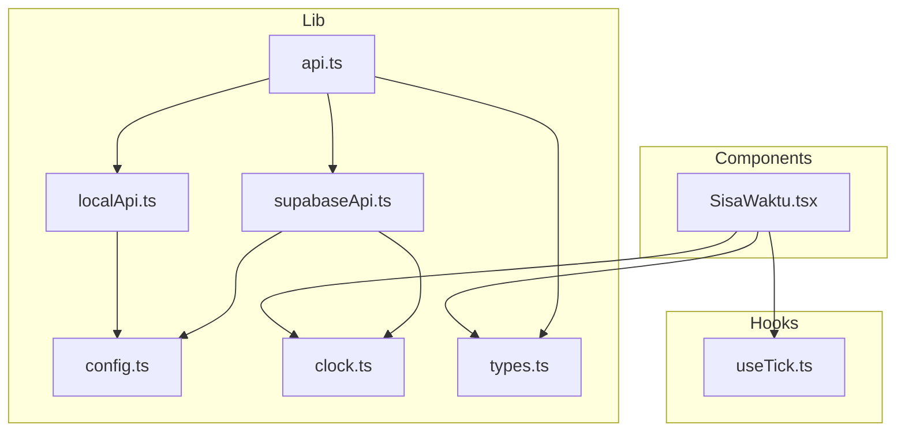
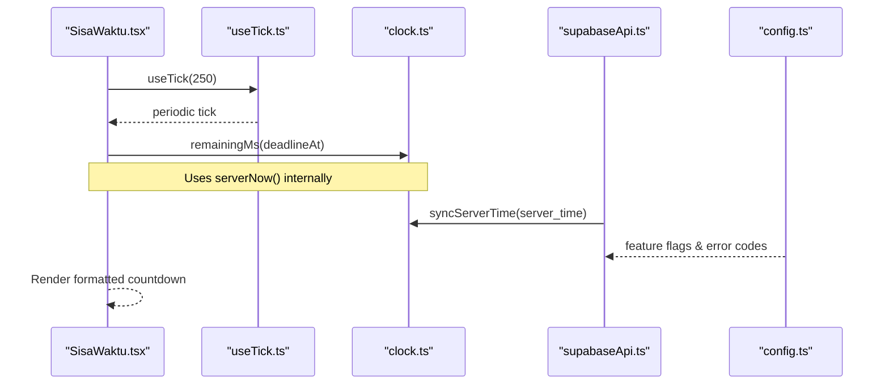
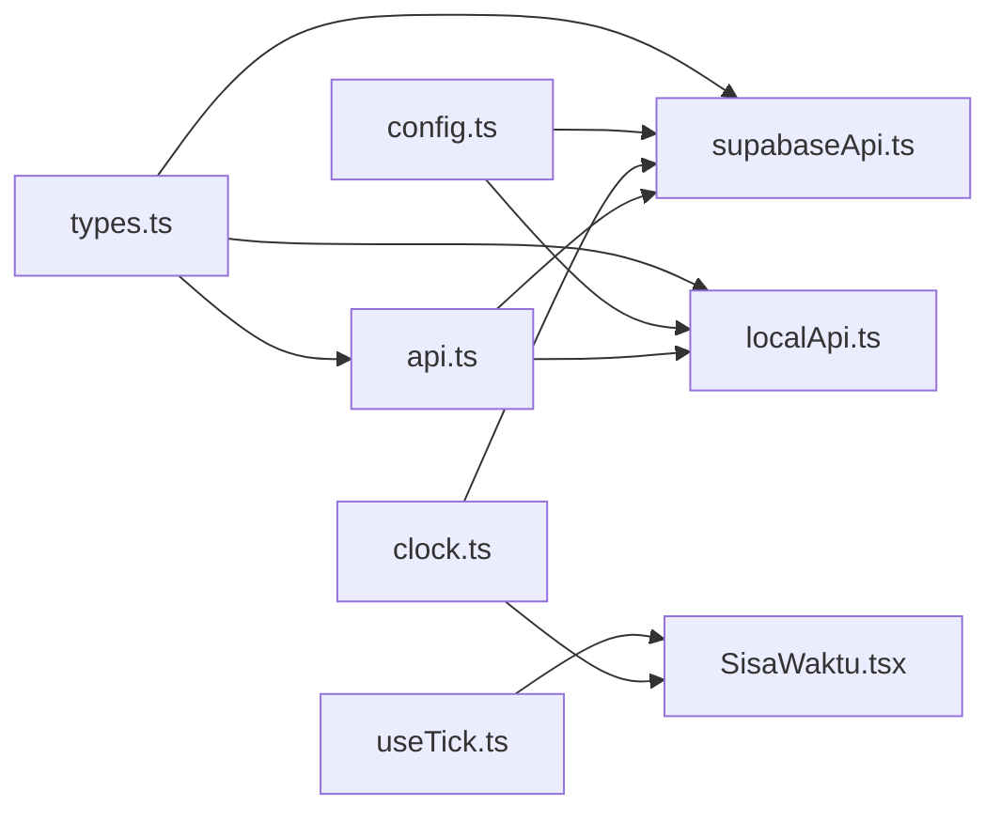

# Hooks and Utilities

<cite>
**Referenced Files in This Document**
- [useTick.ts](file://web/src/hooks/useTick.ts)
- [SisaWaktu.tsx](file://web/src/components/SisaWaktu.tsx)
- [config.ts](file://web/src/lib/config.ts)
- [clock.ts](file://web/src/lib/clock.ts)
- [types.ts](file://web/src/lib/types.ts)
- [api.ts](file://web/src/lib/api.ts)
- [supabaseApi.ts](file://web/src/lib/supabaseApi.ts)
- [localApi.ts](file://web/src/lib/localApi.ts)
</cite>

## Table of Contents
1. [Introduction](#introduction)
2. [Project Structure](#project-structure)
3. [Core Components](#core-components)
4. [Architecture Overview](#architecture-overview)
5. [Detailed Component Analysis](#detailed-component-analysis)
6. [Dependency Analysis](#dependency-analysis)
7. [Performance Considerations](#performance-considerations)
8. [Troubleshooting Guide](#troubleshooting-guide)
9. [Conclusion](#conclusion)

## Introduction
This document explains the custom hooks and utility libraries that power real-time features, configuration management, clock synchronization, and shared type definitions in the TBS LPDP Try Out application. It focuses on:
- The useTick hook for timer-driven re-renders
- Configuration utilities for environment-driven behavior
- Clock synchronization services to keep client timers aligned with server deadlines
- Shared TypeScript types that unify data contracts across UI and API layers
It also covers hook composition patterns, utility organization, and how these abstractions enable cross-platform compatibility (web vs offline app) while keeping performance efficient.

## Project Structure
The relevant code is organized into:
- React hooks under web/src/hooks
- Shared utilities under web/src/lib
- UI components that consume hooks and utilities under web/src/components
- API abstraction layer under web/src/lib that selects between Supabase or local engine at runtime

**Diagram sources**
- [useTick.ts:1-12](file://web/src/hooks/useTick.ts#L1-L12)
- [SisaWaktu.tsx:1-33](file://web/src/components/SisaWaktu.tsx#L1-L33)
- [config.ts:1-68](file://web/src/lib/config.ts#L1-L68)
- [clock.ts:1-65](file://web/src/lib/clock.ts#L1-L65)
- [types.ts:1-256](file://web/src/lib/types.ts#L1-L256)
- [api.ts:1-128](file://web/src/lib/api.ts#L1-L128)
- [supabaseApi.ts:1-170](file://web/src/lib/supabaseApi.ts#L1-L170)
- [localApi.ts:1-560](file://web/src/lib/localApi.ts#L1-L560)

**Section sources**
- [useTick.ts:1-12](file://web/src/hooks/useTick.ts#L1-L12)
- [SisaWaktu.tsx:1-33](file://web/src/components/SisaWaktu.tsx#L1-L33)
- [config.ts:1-68](file://web/src/lib/config.ts#L1-L68)
- [clock.ts:1-65](file://web/src/lib/clock.ts#L1-L65)
- [types.ts:1-256](file://web/src/lib/types.ts#L1-L256)
- [api.ts:1-128](file://web/src/lib/api.ts#L1-L128)
- [supabaseApi.ts:1-170](file://web/src/lib/supabaseApi.ts#L1-L170)
- [localApi.ts:1-560](file://web/src/lib/localApi.ts#L1-L560)

## Core Components
- useTick: A lightweight React hook that schedules periodic re-renders via setInterval and returns a monotonically increasing tick count. Used to drive time-sensitive UI without forcing expensive re-renders elsewhere.
- SisaWaktu component: Consumes useTick to render a countdown box tied to a server deadline. It computes remaining time using clock utilities and triggers an expiration callback when the deadline passes.
- config: Provides build-time flags and constants (offline mode, Supabase credentials, Turnstile key), plus error codes and events used across the app.
- clock: Centralizes time math and formatting. Maintains a skew offset from the server so all client-side time calculations are anchored to server time rather than device clock.
- types: Defines stable TypeScript interfaces and enums for packages, questions, attempts, sections, reports, maintenance status, and the ExamApi surface.
- api: Runtime selector that lazily loads either the Supabase-based implementation or the local mock/offline engine, with chunk reload protection and retry helpers.

**Section sources**
- [useTick.ts:1-12](file://web/src/hooks/useTick.ts#L1-L12)
- [SisaWaktu.tsx:1-33](file://web/src/components/SisaWaktu.tsx#L1-L33)
- [config.ts:1-68](file://web/src/lib/config.ts#L1-L68)
- [clock.ts:1-65](file://web/src/lib/clock.ts#L1-L65)
- [types.ts:1-256](file://web/src/lib/types.ts#L1-L256)
- [api.ts:1-128](file://web/src/lib/api.ts#L1-L128)

## Architecture Overview
The real-time countdown relies on a small chain:
- SisaWaktu calls useTick to schedule frequent updates
- SisaWaktu computes remainingMs from the deadline using clock utilities
- supabaseApi synchronizes the client’s internal clock with server_time from RPC responses
- config provides feature flags and error codes consumed by both API implementations

**Diagram sources**
- [SisaWaktu.tsx:1-33](file://web/src/components/SisaWaktu.tsx#L1-L33)
- [useTick.ts:1-12](file://web/src/hooks/useTick.ts#L1-L12)
- [clock.ts:1-65](file://web/src/lib/clock.ts#L1-L65)
- [supabaseApi.ts:1-170](file://web/src/lib/supabaseApi.ts#L1-L170)
- [config.ts:1-68](file://web/src/lib/config.ts#L1-L68)

## Detailed Component Analysis

### useTick Hook
Purpose:
- Drives periodic UI updates for time-sensitive displays (e.g., countdown).
- Keeps side effects isolated to the consuming component to avoid global state churn.

Parameters:
- intervalMs: number (default 500) — milliseconds between ticks.

Return value:
- number — a monotonically increasing counter incremented each interval.

Behavior:
- Creates a setInterval on mount and clears it on unmount.
- Uses functional setState to avoid stale closures.

Usage example:
- In SisaWaktu, call useTick(250) to trigger ~4 updates per second for smooth countdown rendering.

Integration pattern:
- Combine with pure computation functions (remainingMs, formatClock) to derive derived values without extra state.

Complexity:
- Time: O(1) per tick; memory: minimal (one interval ID + state).

Error handling:
- No explicit errors; safe cleanup prevents leaks.

**Section sources**
- [useTick.ts:1-12](file://web/src/hooks/useTick.ts#L1-L12)
- [SisaWaktu.tsx:1-33](file://web/src/components/SisaWaktu.tsx#L1-L33)

### SisaWaktu Component
Purpose:
- Renders the “Sisa Waktu” countdown box and handles expiration.

Props:
- deadlineAt: string — ISO deadline from the server.
- onExpire: () => void — callback invoked once when remaining time reaches zero or below.

Behavior:
- Calls useTick(250) to refresh frequently.
- Computes remainingMs(deadlineAt) and formats with formatClock.
- Applies urgent styling when under 60 seconds.
- Triggers onExpire when remaining <= 0.

Integration:
- Parent components can auto-submit or navigate on expiration.

Performance:
- Limits heavy re-renders to this component only; parent pages stay stable.

**Section sources**
- [SisaWaktu.tsx:1-33](file://web/src/components/SisaWaktu.tsx#L1-L33)
- [clock.ts:1-65](file://web/src/lib/clock.ts#L1-L65)

### Clock Synchronization Service
Purpose:
- Ensures all client-side time math is anchored to server time, not device clock.

Key functions:
- syncServerTime(serverTime): Updates internal skew based on server_time from RPCs.
- serverNow(): Returns current time adjusted by skew.
- remainingMs(deadlineIso): Calculates remaining seconds until deadline using serverNow().
- formatClock(ms): Formats ms to mm:ss or hh:mm:ss.
- formatDurationWords(ms): Formats duration in Indonesian words (“jam”, “menit”).
- formatMinutes(durationSeconds): Formats minutes in Indonesian.
- formatDateTime(iso)/formatDate(iso): Localized date/time strings in Asia/Jakarta.

Design notes:
- Skew is maintained in module-level state to be consistent across calls.
- All time-dependent UI uses these functions to guarantee alignment with server deadlines.

**Section sources**
- [clock.ts:1-65](file://web/src/lib/clock.ts#L1-L65)
- [supabaseApi.ts:1-170](file://web/src/lib/supabaseApi.ts#L1-L170)

### Configuration Management Utilities
Purpose:
- Provide build-time flags and constants to switch behavior across environments (web production, offline app, dev mock).

Key exports:
- IS_OFFLINE_APP: Boolean flag for offline app builds.
- SUPABASE_URL / SUPABASE_PUBLIC_KEY: Environment variables for Supabase, disabled in offline mode.
- TURNSTILE_SITE_KEY: Public CAPTCHA site key for human verification flows.
- isSupabaseConfigured: True when URL and public key are present.
- ApiError: Custom error class with optional code.
- DEADLINE_PASSED / ALREADY_FINISHED / HUMAN_VERIFICATION_REQUIRED: Stable error/status codes.
- BANK_UPDATED_EVENT: DOM event name for bank hot-swap notifications.

Usage:
- API selection and feature gating rely on these flags.
- Error codes are surfaced consistently to callers.

**Section sources**
- [config.ts:1-68](file://web/src/lib/config.ts#L1-L68)

### Shared TypeScript Type Definitions
Purpose:
- Define stable contracts for packages, questions, attempts, sections, reviews, reports, maintenance status, and the ExamApi interface.

Highlights:
- Subtest, Package, Question, AnswerState, Attempt, SectionAttempt define core exam model.
- StartAttemptResult, StartSectionResult, FinishSectionResult, AttemptState describe API payloads.
- ReviewQuestion, ReviewSection, Review model post-attempt review data.
- Bank, BankPackage, BankQuestion represent offline/local question bank shapes.
- MaintenanceStatus models maintenance windows with server_time.
- ExamApi abstracts backend surface so UI remains agnostic to Supabase vs local engine.

Benefits:
- Strong typing across UI and API layers.
- Enables compile-time safety for RPC inputs/outputs and UI state.

**Section sources**
- [types.ts:1-256](file://web/src/lib/types.ts#L1-L256)

### API Abstraction and Backend Selection
Purpose:
- Provide a unified ExamApi surface and select implementation at runtime based on build flags.

Key behaviors:
- USE_MOCK and USE_LOCAL_ENGINE determine whether to load localApi or supabaseApi.
- Lazy loading keeps bundle size small and excludes answer keys from production web builds.
- Chunk reload guard detects deployment mismatches and reloads to fetch fresh chunks.
- withRetry wraps network calls with exponential backoff, skipping retries for terminal error codes.
- errorMessage normalizes error messages.

Integration:
- Components import api from lib/api.ts and call methods like startSection, saveAnswer, finishSection without knowing the backend.

**Section sources**
- [api.ts:1-128](file://web/src/lib/api.ts#L1-L128)
- [supabaseApi.ts:1-170](file://web/src/lib/supabaseApi.ts#L1-L170)
- [localApi.ts:1-560](file://web/src/lib/localApi.ts#L1-L560)

## Dependency Analysis

**Diagram sources**
- [types.ts:1-256](file://web/src/lib/types.ts#L1-L256)
- [api.ts:1-128](file://web/src/lib/api.ts#L1-L128)
- [supabaseApi.ts:1-170](file://web/src/lib/supabaseApi.ts#L1-L170)
- [localApi.ts:1-560](file://web/src/lib/localApi.ts#L1-L560)
- [config.ts:1-68](file://web/src/lib/config.ts#L1-L68)
- [clock.ts:1-65](file://web/src/lib/clock.ts#L1-L65)
- [useTick.ts:1-12](file://web/src/hooks/useTick.ts#L1-L12)
- [SisaWaktu.tsx:1-33](file://web/src/components/SisaWaktu.tsx#L1-L33)

**Section sources**
- [api.ts:1-128](file://web/src/lib/api.ts#L1-L128)
- [supabaseApi.ts:1-170](file://web/src/lib/supabaseApi.ts#L1-L170)
- [localApi.ts:1-560](file://web/src/lib/localApi.ts#L1-L560)
- [config.ts:1-68](file://web/src/lib/config.ts#L1-L68)
- [clock.ts:1-65](file://web/src/lib/clock.ts#L1-L65)
- [useTick.ts:1-12](file://web/src/hooks/useTick.ts#L1-L12)
- [SisaWaktu.tsx:1-33](file://web/src/components/SisaWaktu.tsx#L1-L33)

## Performance Considerations
- useTick isolates high-frequency re-renders to a single component, preventing full-page repaints.
- Clock utilities compute derived values without additional state, minimizing allocations.
- API layer lazy-loads backend implementations to reduce initial bundle size and exclude sensitive logic from production builds.
- withRetry reduces transient failures impact while avoiding unnecessary retries for terminal errors.

[No sources needed since this section provides general guidance]

## Troubleshooting Guide
Common issues and resolutions:
- Countdown not updating: Ensure useTick is called in the component rendering the timer and that the component stays mounted.
- Timer drift: Verify that supabaseApi.rpc calls receive server_time and that syncServerTime is invoked; otherwise, serverNow will diverge from actual server time.
- Offline vs online mode mismatch: Check IS_OFFLINE_APP and USE_LOCAL_ENGINE flags; ensure correct environment variables are set for your build flavor.
- Human verification required: If TURNSTILE_SITE_KEY is configured but no captchaToken is provided, init will throw a specific error; supply a token before calling protected endpoints.
- Network errors: Use withRetry for background writes; inspect error codes to decide whether to retry or show user-facing messages.

**Section sources**
- [supabaseApi.ts:1-170](file://web/src/lib/supabaseApi.ts#L1-L170)
- [config.ts:1-68](file://web/src/lib/config.ts#L1-L68)
- [api.ts:1-128](file://web/src/lib/api.ts#L1-L128)

## Conclusion
The combination of useTick, clock synchronization, configuration utilities, and shared types creates a robust foundation for real-time features and cross-platform compatibility. By isolating timing concerns in a dedicated hook and anchoring time math to server time, the application delivers accurate countdowns and reliable deadlines. The API abstraction enables seamless switching between Supabase and local engines while preserving a consistent contract defined by shared types. These patterns improve maintainability, performance, and developer experience across web and offline modes.