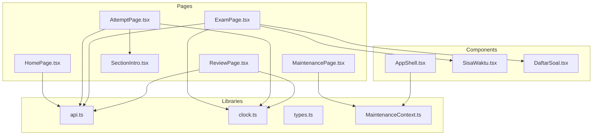
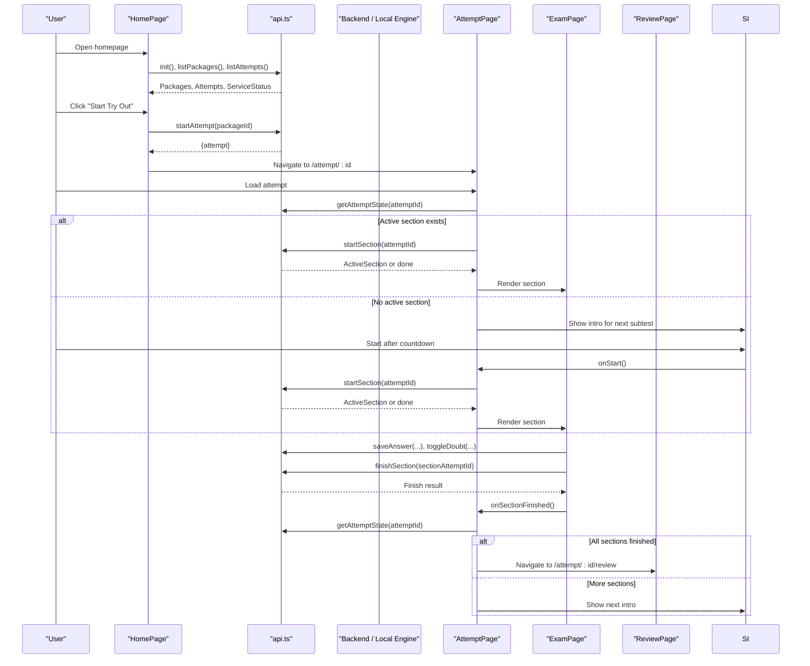
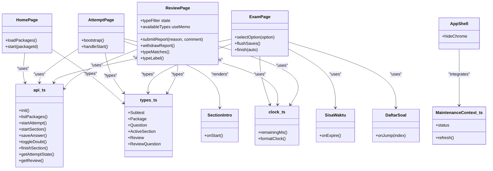

# Page Components

<cite>
**Referenced Files in This Document**
- [HomePage.tsx](file://web/src/pages/HomePage.tsx)
- [AttemptPage.tsx](file://web/src/pages/AttemptPage.tsx)
- [ExamPage.tsx](file://web/src/pages/ExamPage.tsx)
- [ReviewPage.tsx](file://web/src/pages/ReviewPage.tsx)
- [MaintenancePage.tsx](file://web/src/pages/MaintenancePage.tsx)
- [SectionIntro.tsx](file://web/src/pages/SectionIntro.tsx)
- [AppShell.tsx](file://web/src/components/AppShell.tsx)
- [SisaWaktu.tsx](file://web/src/components/SisaWaktu.tsx)
- [DaftarSoal.tsx](file://web/src/components/DaftarSoal.tsx)
- [types.ts](file://web/src/lib/types.ts)
- [api.ts](file://web/src/lib/api.ts)
- [clock.ts](file://web/src/lib/clock.ts)
- [MaintenanceContext.ts](file://web/src/contexts/MaintenanceContext.ts)
</cite>

## Update Summary
**Changes Made**
- Enhanced ReviewPage with new question type filtering capabilities
- Added documentation for typeFilter state variable and useMemo-based computation
- Documented compound filtering system combining answer status and question type filters
- Added helper function documentation for snake_case to display label conversion
- Updated UI enhancement documentation for chip-style filter buttons with question counts

## Table of Contents
1. [Introduction](#introduction)
2. [Project Structure](#project-structure)
3. [Core Components](#core-components)
4. [Architecture Overview](#architecture-overview)
5. [Detailed Component Analysis](#detailed-component-analysis)
6. [Dependency Analysis](#dependency-analysis)
7. [Performance Considerations](#performance-considerances)
8. [Troubleshooting Guide](#troubleshooting-guide)
9. [Conclusion](#conclusion)

## Introduction
This document explains the page components that drive the main user workflows in the TBS LPDP Try Out application: HomePage (package selection and onboarding), AttemptPage (exam orchestration with timed sections), ExamPage (question rendering and answer tracking), ReviewPage (results analysis and performance review with enhanced filtering), MaintenancePage (system status display), and SectionIntro (subtest introductions). It covers page lifecycles, data flow between pages, state persistence mechanisms, integration with the exam engine via a unified API abstraction, navigation patterns, error handling strategies, and user experience considerations.

## Project Structure
The page components live under web/src/pages and are wrapped by AppShell for consistent chrome and maintenance banner behavior. Shared utilities include clock helpers, types, and an API abstraction that selects either a Supabase-backed implementation or a local mock/offline engine at runtime.

**Diagram sources**
- [HomePage.tsx:1-400](file://web/src/pages/HomePage.tsx#L1-L400)
- [AttemptPage.tsx:1-142](file://web/src/pages/AttemptPage.tsx#L1-L142)
- [ExamPage.tsx:1-380](file://web/src/pages/ExamPage.tsx#L1-L380)
- [ReviewPage.tsx:1-460](file://web/src/pages/ReviewPage.tsx#L1-L460)
- [MaintenancePage.tsx:1-32](file://web/src/pages/MaintenancePage.tsx#L1-L32)
- [SectionIntro.tsx:1-81](file://web/src/pages/SectionIntro.tsx#L1-L81)
- [AppShell.tsx:1-56](file://web/src/components/AppShell.tsx#L1-L56)
- [SisaWaktu.tsx:1-33](file://web/src/components/SisaWaktu.tsx#L1-L33)
- [DaftarSoal.tsx:1-73](file://web/src/components/DaftarSoal.tsx#L1-L73)
- [api.ts:1-128](file://web/src/lib/api.ts#L1-L128)
- [clock.ts:1-65](file://web/src/lib/clock.ts#L1-L65)
- [types.ts:1-256](file://web/src/lib/types.ts#L1-L256)
- [MaintenanceContext.ts:1-25](file://web/src/contexts/MaintenanceContext.ts#L1-L25)

**Section sources**
- [HomePage.tsx:1-400](file://web/src/pages/HomePage.tsx#L1-L400)
- [AttemptPage.tsx:1-142](file://web/src/pages/AttemptPage.tsx#L1-L142)
- [ExamPage.tsx:1-380](file://web/src/pages/ExamPage.tsx#L1-L380)
- [ReviewPage.tsx:1-460](file://web/src/pages/ReviewPage.tsx#L1-L460)
- [MaintenancePage.tsx:1-32](file://web/src/pages/MaintenancePage.tsx#L1-L32)
- [SectionIntro.tsx:1-81](file://web/src/pages/SectionIntro.tsx#L1-L81)
- [AppShell.tsx:1-56](file://web/src/components/AppShell.tsx#L1-L56)
- [SisaWaktu.tsx:1-33](file://web/src/components/SisaWaktu.tsx#L1-L33)
- [DaftarSoal.tsx:1-73](file://web/src/components/DaftarSoal.tsx#L1-L73)
- [api.ts:1-128](file://web/src/lib/api.ts#L1-L128)
- [clock.ts:1-65](file://web/src/lib/clock.ts#L1-L65)
- [types.ts:1-256](file://web/src/lib/types.ts#L1-L256)
- [MaintenanceContext.ts:1-25](file://web/src/contexts/MaintenanceContext.ts#L1-L25)

## Core Components
- HomePage: Lists available packages, shows attempt history, handles capacity checks, and navigates to start a new attempt.
- AttemptPage: Orchestrates one attempt lifecycle: loading state, section intro, running section, and completion transitions.
- ExamPage: Renders individual questions, tracks answers, debounced saves, doubt toggling, timer countdown, and section finish flow.
- ReviewPage: Displays scores per subtest, filters questions by answer status and question type, supports question reporting, and print-to-PDF workflow.
- MaintenancePage: Shows scheduled maintenance status and allows manual refresh.
- SectionIntro: Presents subtest instructions and a countdown before starting the section.

**Section sources**
- [HomePage.tsx:44-127](file://web/src/pages/HomePage.tsx#L44-L127)
- [AttemptPage.tsx:21-93](file://web/src/pages/AttemptPage.tsx#L21-L93)
- [ExamPage.tsx:19-174](file://web/src/pages/ExamPage.tsx#L19-L174)
- [ReviewPage.tsx:53-166](file://web/src/pages/ReviewPage.tsx#L53-L166)
- [MaintenancePage.tsx:5-31](file://web/src/pages/MaintenancePage.tsx#L5-L31)
- [SectionIntro.tsx:9-79](file://web/src/pages/SectionIntro.tsx#L9-L79)

## Architecture Overview
The pages integrate with a unified API abstraction that dynamically loads either a Supabase-based backend or a local mock/offline engine. Time is synchronized to server time to ensure accurate countdowns and deadlines. The AppShell provides consistent chrome and integrates a global maintenance banner.

**Diagram sources**
- [HomePage.tsx:65-127](file://web/src/pages/HomePage.tsx#L65-L127)
- [AttemptPage.tsx:30-93](file://web/src/pages/AttemptPage.tsx#L30-L93)
- [ExamPage.tsx:104-174](file://web/src/pages/ExamPage.tsx#L104-L174)
- [api.ts:77-95](file://web/src/lib/api.ts#L77-L95)
- [clock.ts:10-22](file://web/src/lib/clock.ts#L10-L22)

## Detailed Component Analysis

### HomePage
Responsibilities:
- Initialize API and load packages, attempts, and service status.
- Handle capacity gating and error messages for starting attempts.
- Display paginated package grid with metadata and difficulty tooltips.
- Show attempt history with actions to continue or review.
- Provide update controls or download prompts depending on environment.

Lifecycle and data flow:
- On mount, initializes API and fetches data concurrently; updates state and errors accordingly.
- Reacts to bank update events to refresh package listings when offline app hot-swaps content.
- Navigates to AttemptPage upon successful startAttempt call.

Error handling:
- Maps backend codes to localized messages for capacity limits, hourly caps, and unavailable packages.
- Displays notices for missing backend configuration or empty package lists.

UX considerations:
- Paginates packages to improve readability.
- Disables start buttons during capacity constraints and while starting.
- Provides clear empty states and guidance for offline mode.

Navigation:
- Uses router to navigate to /attempt/:id on success.
- History table links to resume active attempts or open reviews.

State persistence:
- Relies on server-side storage for attempts; UI reflects persisted state on reload.

**Section sources**
- [HomePage.tsx:44-127](file://web/src/pages/HomePage.tsx#L44-L127)
- [HomePage.tsx:129-348](file://web/src/pages/HomePage.tsx#L129-L348)

### AttemptPage
Responsibilities:
- Bootstrap attempt state and determine current phase: loading, error, intro, or exam.
- Handle resumed sections where deadline may have elapsed.
- Transition between SectionIntro and ExamPage based on server state.

Lifecycle and data flow:
- Calls getAttemptState to retrieve package and sections; if an active section exists and has not expired, starts it and renders ExamPage.
- If no active section, finds next unstarted subtest and shows SectionIntro.
- On section completion, re-evaluates state to proceed to next section or review.

Error handling:
- Catches and displays errors during bootstrap and section start.
- Handles expired sections by finishing them and re-bootstrapping.

UX considerations:
- Keeps user focused within the attempt flow with minimal distractions.
- Prevents accidental navigation away from active sections via AppShell's hideChrome behavior.

Navigation:
- Navigates to /attempt/:id/review when all sections are completed.

State persistence:
- Persists attempt state server-side; UI reflects progress across sessions.

**Section sources**
- [AttemptPage.tsx:21-93](file://web/src/pages/AttemptPage.tsx#L21-L93)
- [AttemptPage.tsx:95-141](file://web/src/pages/AttemptPage.tsx#L95-L141)

### ExamPage
Responsibilities:
- Render current question, options, passage, and image.
- Track answers locally with optimistic UI and debounced background saves.
- Toggle "doubtful" marking per question.
- Manage font scaling preference persisted in localStorage.
- Enforce section timer and auto-submit on expiration.
- Provide navigation via DaftarSoal modal and question info via InformasiSoal.

Lifecycle and data flow:
- Initializes answers from server-provided AnswerState.
- Debounces answer writes to reduce network calls; flushes pending saves on navigation or visibility changes.
- Finishes section with retry logic; handles terminal error codes that indicate server-side grading.

Error handling:
- Distinguishes terminal vs transient errors; surfaces warnings when last answer could not be saved.
- Auto-leaves section when server rejects due to deadline or other terminal conditions.

UX considerations:
- Scrolls to top on question change to avoid off-screen answers on mobile.
- Provides clear action bar with previous, doubt, save, next/finish.
- Confirms submission with remaining time snapshot.

State persistence:
- Persists font scale step in localStorage.
- Persists answers server-side via saveAnswer and toggleDoubt.

Timer integration:
- SisaWaktu component ticks at high frequency and triggers onExpire callback when deadline passes.

**Section sources**
- [ExamPage.tsx:19-174](file://web/src/pages/ExamPage.tsx#L19-L174)
- [ExamPage.tsx:176-379](file://web/src/pages/ExamPage.tsx#L176-L379)
- [SisaWaktu.tsx:1-33](file://web/src/components/SisaWaktu.tsx#L1-L33)
- [clock.ts:1-65](file://web/src/lib/clock.ts#L1-L65)

### ReviewPage
Responsibilities:
- Load review data for an attempt and compute total score.
- Filter questions by answer status: wrong, blank, doubtful, reported.
- **Enhanced**: Filter questions by question type using chip-style buttons with real-time counts.
- Support question reporting and withdrawal with retry logic.
- Enable printing/PDF export of the full Pembahasan view.

**Updated** Enhanced with advanced question type filtering capabilities including state management, automatic computation, and UI enhancements.

Lifecycle and data flow:
- Fetches review data on mount; sets document title for PDF naming.
- Maintains active subtab, answer status filter, and question type filter states to render visible questions.
- Patches local review state when reports are submitted or withdrawn to avoid refetching.

**Enhanced Filtering System:**
- **typeFilter State**: Manages selected question type filter (null for all types, specific qtype string for filtered view)
- **availableTypes Computation**: Uses useMemo hook to automatically extract unique question types from current section in question order
- **Compound Filtering**: Combines answer status filters with question type filters using logical AND operations
- **Helper Function**: `typeLabel()` converts snake_case question types (e.g., "pemecahan_masalah") to display labels ("Pemecahan Masalah")
- **UI Enhancements**: Chip-style filter buttons showing real-time question counts per type with active state indication

Error handling:
- Maps backend report-related codes to localized messages.
- Displays error notices and keeps dialog open on failure to preserve user input.

UX considerations:
- Score cards show per-subtest performance and pass thresholds.
- Multi-level filtering helps users focus on specific areas needing improvement.
- Print-friendly layout includes hidden print-only body for complete output.
- Responsive chip interface adapts to different screen sizes.

State persistence:
- Reports are stored server-side; UI reflects user's own reports.
- Filter states are managed locally within component scope.

**Section sources**
- [ReviewPage.tsx:53-166](file://web/src/pages/ReviewPage.tsx#L53-L166)
- [ReviewPage.tsx:168-345](file://web/src/pages/ReviewPage.tsx#L168-L345)
- [ReviewPage.tsx:348-460](file://web/src/pages/ReviewPage.tsx#L348-L460)

### MaintenancePage
Responsibilities:
- Display scheduled maintenance status message and end time.
- Allow manual refresh to check if maintenance has ended.

Lifecycle and data flow:
- Consumes MaintenanceContext to read status and trigger refresh.

Error handling:
- Gracefully handles missing status by showing default message.

UX considerations:
- Clear messaging and automatic reopening once maintenance ends.

**Section sources**
- [MaintenancePage.tsx:5-31](file://web/src/pages/MaintenancePage.tsx#L5-L31)
- [MaintenanceContext.ts:1-25](file://web/src/contexts/MaintenanceContext.ts#L1-L25)

### SectionIntro
Responsibilities:
- Present subtest name, question count, duration, passing grade, and instructions.
- Countdown before allowing start to prevent premature clicks.

Lifecycle and data flow:
- Resets wait timer on mount and decrements every second until zero.
- Disables start button until countdown completes and not already starting.

UX considerations:
- Clear instructions about timing, scoring, and navigation tools.
- Visual feedback for countdown and starting state.

**Section sources**
- [SectionIntro.tsx:9-79](file://web/src/pages/SectionIntro.tsx#L9-L79)

## Dependency Analysis
The pages depend on shared libraries and components to provide consistent behavior:

**Diagram sources**
- [HomePage.tsx:1-400](file://web/src/pages/HomePage.tsx#L1-L400)
- [AttemptPage.tsx:1-142](file://web/src/pages/AttemptPage.tsx#L1-L142)
- [ExamPage.tsx:1-380](file://web/src/pages/ExamPage.tsx#L1-L380)
- [ReviewPage.tsx:1-460](file://web/src/pages/ReviewPage.tsx#L1-L460)
- [SectionIntro.tsx:1-81](file://web/src/pages/SectionIntro.tsx#L1-L81)
- [AppShell.tsx:1-56](file://web/src/components/AppShell.tsx#L1-L56)
- [SisaWaktu.tsx:1-33](file://web/src/components/SisaWaktu.tsx#L1-L33)
- [DaftarSoal.tsx:1-73](file://web/src/components/DaftarSoal.tsx#L1-L73)
- [api.ts:1-128](file://web/src/lib/api.ts#L1-L128)
- [clock.ts:1-65](file://web/src/lib/clock.ts#L1-L65)
- [types.ts:1-256](file://web/src/lib/types.ts#L1-L256)
- [MaintenanceContext.ts:1-25](file://web/src/contexts/MaintenanceContext.ts#L1-L25)

**Section sources**
- [api.ts:77-128](file://web/src/lib/api.ts#L77-L128)
- [types.ts:1-256](file://web/src/lib/types.ts#L1-L256)

## Performance Considerations
- Debounced answer saves reduce network overhead and event rows during rapid corrections.
- High-frequency timer ticking is isolated to SisaWaktu to avoid re-rendering entire exam pages.
- Server-time synchronization ensures accurate countdowns without relying on device clocks.
- Lazy API implementation selection reduces bundle size by excluding unused backends.
- Pagination on HomePage improves initial load and rendering performance for large package catalogs.
- **Enhanced**: useMemo hooks optimize availableTypes computation and visible questions filtering to prevent unnecessary recalculations.
- **Enhanced**: Compound filtering system efficiently combines multiple filter criteria without performance degradation.

[No sources needed since this section provides general guidance]

## Troubleshooting Guide
Common issues and strategies:
- Capacity full: HomePage disables start buttons and shows localized notice; server returns specific code handled in startErrorMessage.
- Rate limits or bad input: ReviewPage maps backend codes to friendly messages; withRetry avoids retries for terminal codes.
- Network failures: withRetry wraps critical operations with exponential backoff; chunk reload guard prevents loops on dynamic import failures.
- Expired sections: AttemptPage detects elapsed deadlines and finishes sections automatically before transitioning.
- Missing backend config: HomePage displays guidance to configure environment variables or use mock mode.
- **Enhanced**: Question type filtering issues: Verify availableTypes computation uses correct section context and typeFilter state properly resets when switching subtests.

**Section sources**
- [HomePage.tsx:29-42](file://web/src/pages/HomePage.tsx#L29-L42)
- [api.ts:97-128](file://web/src/lib/api.ts#L97-L128)
- [ReviewPage.tsx:38-50](file://web/src/pages/ReviewPage.tsx#L38-L50)
- [AttemptPage.tsx:38-52](file://web/src/pages/AttemptPage.tsx#L38-L52)

## Conclusion
The page components form a cohesive workflow that guides users from package selection through timed exam execution to detailed results review with enhanced filtering capabilities. Robust error handling, server-time synchronization, and resilient networking ensure a reliable experience. The architecture cleanly separates concerns: pages manage UI and flow, components handle reusable interactions, and libraries provide cross-cutting capabilities like timing and API abstraction. Recent enhancements to ReviewPage provide sophisticated question type filtering with real-time counts and responsive chip-style interfaces, significantly improving the user experience for analyzing test results. This design supports both online and offline modes while maintaining consistent UX and performance.

[No sources needed since this section summarizes without analyzing specific files]