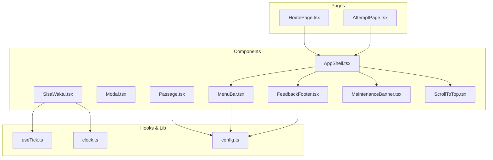
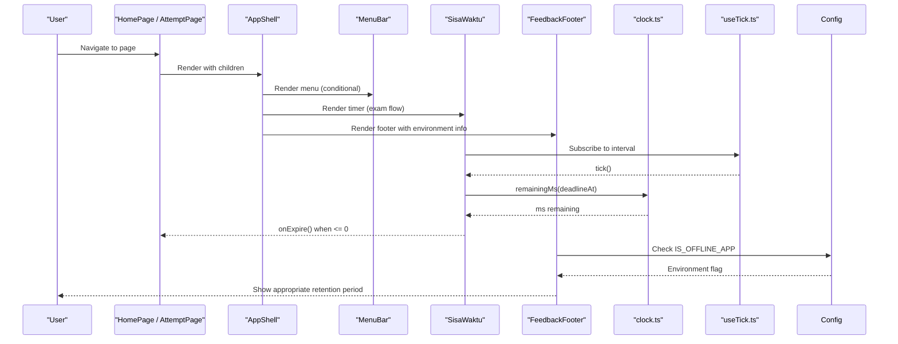
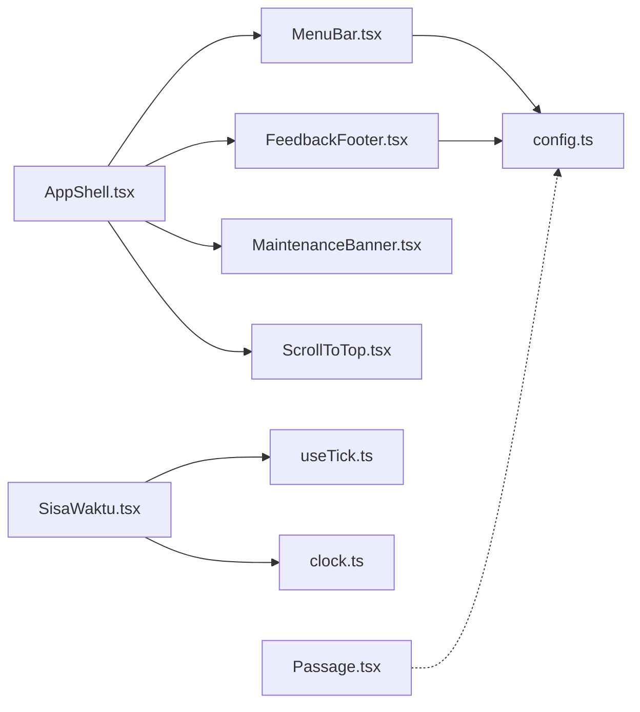

# UI Components

<cite>
**Referenced Files in This Document**
- [AppShell.tsx](file://web/src/components/AppShell.tsx)
- [Modal.tsx](file://web/src/components/Modal.tsx)
- [MenuBar.tsx](file://web/src/components/MenuBar.tsx)
- [SisaWaktu.tsx](file://web/src/components/SisaWaktu.tsx)
- [Passage.tsx](file://web/src/components/Passage.tsx)
- [FeedbackFooter.tsx](file://web/src/components/FeedbackFooter.tsx)
- [useTick.ts](file://web/src/hooks/useTick.ts)
- [clock.ts](file://web/src/lib/clock.ts)
- [MaintenanceBanner.tsx](file://web/src/components/MaintenanceBanner.tsx)
- [ScrollToTop.tsx](file://web/src/components/ScrollToTop.tsx)
- [config.ts](file://web/src/lib/config.ts)
- [App.tsx](file://web/src/App.tsx)
- [HomePage.tsx](file://web/src/pages/HomePage.tsx)
- [AttemptPage.tsx](file://web/src/pages/AttemptPage.tsx)
</cite>

## Update Summary
**Changes Made**
- Updated FeedbackFooter component documentation to reflect conditional data retention display logic
- Added information about environment-specific retention periods (offline vs online applications)
- Enhanced component props interface documentation with IS_OFFLINE_APP dependency
- Updated usage examples to include environment-aware behavior

## Table of Contents
1. Introduction
2. Project Structure
3. Core Components
4. Architecture Overview
5. Detailed Component Analysis
6. Dependency Analysis
7. Performance Considerations
8. Troubleshooting Guide
9. Conclusion

## Introduction
This document describes the reusable UI components library used by the TBS LPDP Try Out application. It focuses on layout management (AppShell), dialog handling (Modal), navigation (MenuBar), countdown timers (SisaWaktu), reading comprehension content rendering (Passage), and feedback management (FeedbackFooter). For each component, we explain props interfaces, event handling patterns, internal state, styling approaches, accessibility considerations, responsive behavior, composition patterns, and how they integrate with the broader application context.

## Project Structure
The UI layer is organized under web/src/components, with shared hooks and utilities under web/src/hooks and web/src/lib. Pages compose these components to build routes for home, attempt, and review flows. The root App configures routing and environment-specific gates.

**Diagram sources**
- [AppShell.tsx:1-56](file://web/src/components/AppShell.tsx#L1-L56)
- [MenuBar.tsx:1-100](file://web/src/components/MenuBar.tsx#L1-L100)
- [SisaWaktu.tsx:1-33](file://web/src/components/SisaWaktu.tsx#L1-L33)
- [Passage.tsx:1-75](file://web/src/components/Passage.tsx#L1-L75)
- [FeedbackFooter.tsx:1-115](file://web/src/components/FeedbackFooter.tsx#L1-L115)
- [useTick.ts:1-12](file://web/src/hooks/useTick.ts#L1-L12)
- [clock.ts:1-65](file://web/src/lib/clock.ts#L1-L65)
- [config.ts:1-68](file://web/src/lib/config.ts#L1-L68)
- [HomePage.tsx:1-400](file://web/src/pages/HomePage.tsx#L1-L400)
- [AttemptPage.tsx:1-142](file://web/src/pages/AttemptPage.tsx#L1-L142)

**Section sources**
- [App.tsx:1-63](file://web/src/App.tsx#L1-L63)
- [HomePage.tsx:1-400](file://web/src/pages/HomePage.tsx#L1-L400)
- [AttemptPage.tsx:1-142](file://web/src/pages/AttemptPage.tsx#L1-L142)

## Core Components
- AppShell: Provides a consistent chrome (header, optional menu/footer, main area) and supports hiding chrome during active exam sections.
- Modal: Accessible dialog with keyboard support and backdrop dismissal.
- MenuBar: Responsive navigation that scrolls to or navigates to sections based on current route.
- SisaWaktu: Countdown timer driven by a tick hook and server-aligned clock utilities; emits expiration events.
- Passage: Renders plain text or pipe-delimited tables with numeric alignment and accessibility attributes.
- FeedbackFooter: Displays feedback options, contact information, and environment-specific disclaimer notices with conditional retention period messaging.

Key integration points:
- AppShell composes MenuBar, FeedbackFooter, MaintenanceBanner, and ScrollToTop.
- SisaWaktu depends on useTick and clock utilities for accurate countdowns.
- MenuBar uses configuration flags to hide web-only items in offline mode.
- Passage provides a table parser and renders semantic HTML when applicable.
- FeedbackFooter adapts its disclaimer content based on IS_OFFLINE_APP flag to show appropriate retention periods.

**Section sources**
- [AppShell.tsx:1-56](file://web/src/components/AppShell.tsx#L1-L56)
- [Modal.tsx:1-36](file://web/src/components/Modal.tsx#L1-L36)
- [MenuBar.tsx:1-100](file://web/src/components/MenuBar.tsx#L1-L100)
- [SisaWaktu.tsx:1-33](file://web/src/components/SisaWaktu.tsx#L1-L33)
- [Passage.tsx:1-75](file://web/src/components/Passage.tsx#L1-L75)
- [FeedbackFooter.tsx:1-115](file://web/src/components/FeedbackFooter.tsx#L1-L115)
- [useTick.ts:1-12](file://web/src/hooks/useTick.ts#L1-L12)
- [clock.ts:1-65](file://web/src/lib/clock.ts#L1-L65)
- [config.ts:1-68](file://web/src/lib/config.ts#L1-L68)

## Architecture Overview
The application uses React Router with HashRouter for host-agnostic routing and deep-link stability. Pages wrap content in AppShell, which centralizes chrome and integrates global features like maintenance banners and feedback footer. During exams, AppShell can hide navigation and footer to prevent accidental exits while deadlines continue ticking server-side. Timers are isolated in SisaWaktu to minimize re-renders across heavy pages. Passages auto-detect pipe-delimited tables to improve readability and accessibility. FeedbackFooter provides environment-aware user information about data retention policies.

**Diagram sources**
- [AppShell.tsx:1-56](file://web/src/components/AppShell.tsx#L1-L56)
- [MenuBar.tsx:1-100](file://web/src/components/MenuBar.tsx#L1-L100)
- [SisaWaktu.tsx:1-33](file://web/src/components/SisaWaktu.tsx#L1-L33)
- [FeedbackFooter.tsx:1-115](file://web/src/components/FeedbackFooter.tsx#L1-L115)
- [useTick.ts:1-12](file://web/src/hooks/useTick.ts#L1-L12)
- [clock.ts:1-65](file://web/src/lib/clock.ts#L1-L65)
- [config.ts:1-68](file://web/src/lib/config.ts#L1-L68)
- [HomePage.tsx:1-400](file://web/src/pages/HomePage.tsx#L1-L400)
- [AttemptPage.tsx:1-142](file://web/src/pages/AttemptPage.tsx#L1-L142)

## Detailed Component Analysis

### AppShell
Purpose:
- Provides a blue masthead header with branding and user avatar area.
- Conditionally includes MenuBar and FeedbackFooter based on an exam-mode flag.
- Wraps page content in a main area and adds a scroll-to-top utility.

Props interface:
- children: ReactNode — content rendered inside the main area.
- hideChrome?: boolean — when true, hides navigation and footer during active exam sections.

Event handling:
- No direct user interactions; delegates to child components (e.g., MenuBar).

State management:
- None locally; relies on child components and context for global state.

Styling approach:
- Uses CSS classes for masthead, page, and footer regions.

Accessibility:
- Includes aria-hidden decorative SVGs and semantic structure.

Responsive design:
- Delegates responsive behavior to MenuBar and Footer.

Composition:
- Composes MenuBar, FeedbackFooter, MaintenanceBanner, and ScrollToTop.

Usage examples:
- HomePage wraps its content in AppShell to provide consistent chrome.
- AttemptPage wraps loading/error states in AppShell for consistency.

Customization options:
- Toggle hideChrome to enter exam mode without navigation distractions.

Integration points:
- Integrates with MenuBar visibility and FeedbackFooter presence based on exam mode.

**Section sources**
- [AppShell.tsx:1-56](file://web/src/components/AppShell.tsx#L1-L56)
- [HomePage.tsx:1-400](file://web/src/pages/HomePage.tsx#L1-L400)
- [AttemptPage.tsx:1-142](file://web/src/pages/AttemptPage.tsx#L1-L142)

### Modal
Purpose:
- Presents a dialog with title, body, and optional footer.
- Supports Escape key to close and backdrop click to dismiss.

Props interface:
- title: string — accessible label for the dialog.
- onClose?: () => void — optional callback to close the modal.
- children: ReactNode — dialog body content.
- footer?: ReactNode — optional footer content.

Event handling:
- Adds/removes a keydown listener for Escape to call onClose.
- Backdrop click triggers onClose if provided.

State management:
- No local state; controlled via parent and onClose prop.

Styling approach:
- Uses modal-backdrop and modal containers with semantic roles.

Accessibility:
- role="dialog", aria-modal="true", and aria-label set from title.

Responsive design:
- Relies on CSS for overlay and centering; no JS-based breakpoints.

Usage examples:
- Wrap confirmation dialogs or informational overlays with Modal.

Customization options:
- Provide footer for action buttons; omit footer for simple messages.

Integration points:
- Typically used within pages or other components to present focused interactions.

**Section sources**
- [Modal.tsx:1-36](file://web/src/components/Modal.tsx#L1-L36)

### MenuBar
Purpose:
- Provides section anchors on the home page and handles navigation between routes.
- Adapts to offline mode by hiding web-only items.

Props interface:
- None (uses router context).

Event handling:
- Toggles open state for mobile menu.
- Closes menu on route changes and Escape key press.
- Navigates or scrolls to target sections based on current location.

State management:
- Local isOpen state for mobile toggle.

Styling approach:
- Uses app-nav classes and conditional is-open class for mobile drawer.

Accessibility:
- aria-expanded on toggle button; aria-label for nav region.

Responsive design:
- Desktop shows inline items; mobile shows hamburger toggle.

Usage examples:
- Rendered inside AppShell header; links trigger scrollToSection or navigate to home with state.

Customization options:
- MENU_ITEMS list defines visible entries; VISIBLE_MENU_ITEMS filters web-only items in offline mode.

Integration points:
- Reads IS_OFFLINE_APP from config to adjust visibility.
- Coordinates with HomePage via scrollToSection and location state.

**Section sources**
- [MenuBar.tsx:1-100](file://web/src/components/MenuBar.tsx#L1-L100)
- [config.ts:1-68](file://web/src/lib/config.ts#L1-L68)
- [HomePage.tsx:1-400](file://web/src/pages/HomePage.tsx#L1-L400)

### SisaWaktu
Purpose:
- Displays a countdown timer aligned to server time and signals expiration to parents.

Props interface:
- deadlineAt: string — ISO deadline string from server.
- onExpire: () => void — callback invoked once when remaining time reaches zero.

Event handling:
- Subscribes to a tick interval to drive re-renders.
- Calls onExpire when remaining milliseconds drop to zero or below.

State management:
- Uses useTick to schedule periodic updates at a fixed interval.

Styling approach:
- Applies urgent class when less than one minute remains.

Accessibility:
- Uses label and value spans; styling communicates urgency visually.

Performance characteristics:
- Isolates frequent updates to this component to avoid re-rendering entire exam pages.

Usage examples:
- Rendered in exam flows to show remaining time per section.

Customization options:
- Adjust URGENT_MS threshold to change when the timer turns urgent.

Integration points:
- Depends on clock utilities for remainingMs and formatClock.

**Section sources**
- [SisaWaktu.tsx:1-33](file://web/src/components/SisaWaktu.tsx#L1-L33)
- [useTick.ts:1-12](file://web/src/hooks/useTick.ts#L1-L12)
- [clock.ts:1-65](file://web/src/lib/clock.ts#L1-L65)

### Passage
Purpose:
- Renders reading comprehension content, automatically detecting pipe-delimited tables for improved presentation.

Props interface:
- text: string — raw content that may be plain text or pipe-delimited table.

Processing logic:
- parsePipeTable detects valid tables (consistent column counts) and returns structured data.
- Numeric columns are right-aligned; summary rows are emphasized.

State management:
- Uses useMemo to compute table parsing only when text changes.

Styling approach:
- Renders either a passage div or a semantic table with headers and rows.

Accessibility:
- Table wrapper has role="region" and aria-label; headers use scope attributes.

Usage examples:
- Used in exam pages to display passages or data tables embedded in question stimuli.

Customization options:
- Extend NUMERIC regex or TOTAL_LABEL pattern to customize detection and styling.

Integration points:
- No external dependencies; self-contained parsing and rendering.

**Section sources**
- [Passage.tsx:1-75](file://web/src/components/Passage.tsx#L1-L75)

### FeedbackFooter
Purpose:
- Displays feedback submission options, contact information, and environment-specific disclaimer notices.
- Provides conditional retention period messaging based on application deployment type.

Props interface:
- None (self-contained component with environment awareness).

Environment-aware behavior:
- **Offline applications** (IS_OFFLINE_APP = true): Display 10-day retention period for stored history
- **Online applications** (IS_OFFLINE_APP = false): Display 7-day retention period for stored history
- Shows appropriate disclaimer content based on deployment environment

Event handling:
- External link handling through externalLinkProps function for cross-platform compatibility
- Mailto link generation with pre-filled subject and body content

State management:
- No local state; relies on environment configuration for dynamic content

Styling approach:
- Uses site-footer classes for consistent footer layout
- Implements two-column layout with feedback/disclaimer on left and contact/source on right

Accessibility:
- Semantic HTML structure with proper heading hierarchy
- aria-hidden attributes for decorative elements
- Proper link semantics for external resources

Responsive design:
- Flexible layout that adapts to different screen sizes
- Mobile-friendly contact information display

Usage examples:
- Rendered within AppShell footer area for consistent placement
- Automatically adapts to offline/online deployment contexts

Customization options:
- Email address and repository URL are configurable through constants
- Retention periods can be adjusted based on business requirements

Integration points:
- Imports IS_OFFLINE_APP from config for environment detection
- Uses appRuntime utilities for external link handling
- Integrates with AppShell for consistent footer placement

**Updated** Enhanced with conditional data retention display logic that shows different retention periods based on IS_OFFLINE_APP flag - offline applications display 10-day retention while online applications show 7-day retention.

**Section sources**
- [FeedbackFooter.tsx:1-115](file://web/src/components/FeedbackFooter.tsx#L1-L115)
- [config.ts:1-68](file://web/src/lib/config.ts#L1-L68)
- [appRuntime.ts:1-50](file://web/src/lib/appRuntime.ts#L1-L50)

## Dependency Analysis
Component-level relationships:
- AppShell depends on MenuBar, FeedbackFooter, MaintenanceBanner, and ScrollToTop.
- SisaWaktu depends on useTick and clock utilities.
- MenuBar depends on config flags for environment-aware behavior.
- Passage is self-contained but often consumed by exam pages.
- FeedbackFooter depends on config flags for environment-aware retention messaging.

**Diagram sources**
- [AppShell.tsx:1-56](file://web/src/components/AppShell.tsx#L1-L56)
- [MenuBar.tsx:1-100](file://web/src/components/MenuBar.tsx#L1-L100)
- [SisaWaktu.tsx:1-33](file://web/src/components/SisaWaktu.tsx#L1-L33)
- [Passage.tsx:1-75](file://web/src/components/Passage.tsx#L1-L75)
- [FeedbackFooter.tsx:1-115](file://web/src/components/FeedbackFooter.tsx#L1-L115)
- [useTick.ts:1-12](file://web/src/hooks/useTick.ts#L1-L12)
- [clock.ts:1-65](file://web/src/lib/clock.ts#L1-L65)
- [config.ts:1-68](file://web/src/lib/config.ts#L1-L68)

**Section sources**
- [AppShell.tsx:1-56](file://web/src/components/AppShell.tsx#L1-L56)
- [MenuBar.tsx:1-100](file://web/src/components/MenuBar.tsx#L1-L100)
- [SisaWaktu.tsx:1-33](file://web/src/components/SisaWaktu.tsx#L1-L33)
- [Passage.tsx:1-75](file://web/src/components/Passage.tsx#L1-L75)
- [FeedbackFooter.tsx:1-115](file://web/src/components/FeedbackFooter.tsx#L1-L115)
- [useTick.ts:1-12](file://web/src/hooks/useTick.ts#L1-L12)
- [clock.ts:1-65](file://web/src/lib/clock.ts#L1-L65)
- [config.ts:1-68](file://web/src/lib/config.ts#L1-L68)

## Performance Considerations
- SisaWaktu owns the tick to limit re-renders to the timer box, preventing full-page churn during countdowns.
- Passage uses memoization to avoid repeated parsing of static content.
- MenuBar closes on navigation changes to reduce unnecessary UI state.
- AppShell conditionally hides chrome during exams to minimize interaction surface and potential navigation errors.
- FeedbackFooter uses compile-time environment detection to eliminate unused code paths in different builds.

[No sources needed since this section provides general guidance]

## Troubleshooting Guide
Common issues and resolutions:
- Timer not updating: Ensure useTick is active and clock utilities receive correct server time offsets. Verify deadlineAt is a valid ISO string.
- Modal not closing: Confirm onClose is provided; check for missing Escape handler registration.
- MenuBar not showing expected items: Check IS_OFFLINE_APP flag and ensure VISIBLE_MENU_ITEMS filtering matches expectations.
- Passage not rendering table: Validate input contains pipe-delimited lines with consistent column counts.
- FeedbackFooter showing incorrect retention period: Verify IS_OFFLINE_APP configuration and ensure build environment is correctly set.

**Section sources**
- [SisaWaktu.tsx:1-33](file://web/src/components/SisaWaktu.tsx#L1-L33)
- [useTick.ts:1-12](file://web/src/hooks/useTick.ts#L1-L12)
- [clock.ts:1-65](file://web/src/lib/clock.ts#L1-L65)
- [Modal.tsx:1-36](file://web/src/components/Modal.tsx#L1-L36)
- [MenuBar.tsx:1-100](file://web/src/components/MenuBar.tsx#L1-L100)
- [config.ts:1-68](file://web/src/lib/config.ts#L1-L68)
- [Passage.tsx:1-75](file://web/src/components/Passage.tsx#L1-L75)
- [FeedbackFooter.tsx:1-115](file://web/src/components/FeedbackFooter.tsx#L1-L115)

## Conclusion
The TBS LPDP Try Out UI components form a cohesive, accessible, and performant foundation. AppShell standardizes layout and chrome control, Modal provides robust dialog semantics, MenuBar offers responsive navigation with environment awareness, SisaWaktu ensures precise countdowns with minimal overhead, Passage enhances readability by auto-detecting tabular content, and FeedbackFooter delivers environment-aware user information about data retention policies. Together, they integrate cleanly with the application's routing and context layers to deliver a consistent user experience across web and offline modes, with intelligent adaptation to deployment environments for accurate user communication.

[No sources needed since this section summarizes without analyzing specific files]