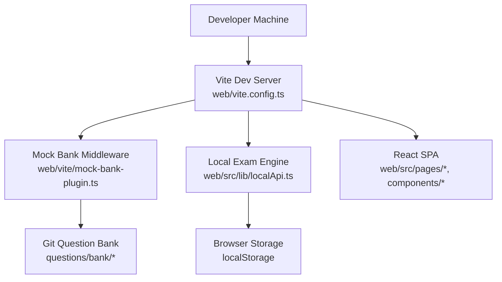
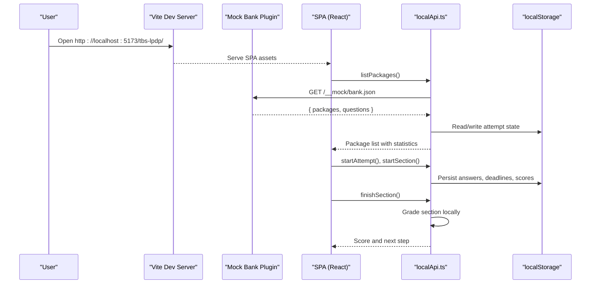
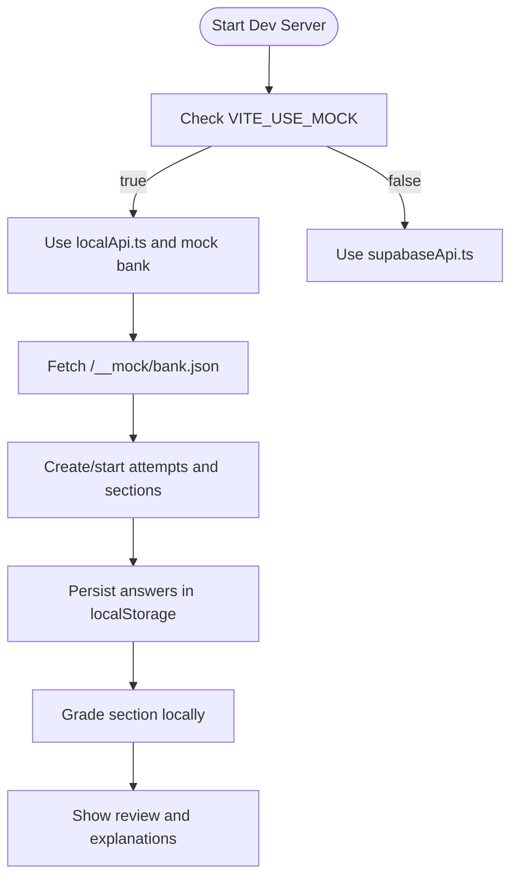
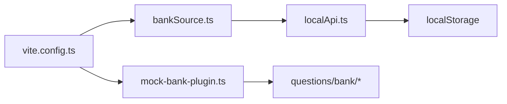

# Getting Started

<cite>
**Referenced Files in This Document**
- [README.md](file://README.md)
- [CONTRIBUTING.md](file://CONTRIBUTING.md)
- [web/README.md](file://web/README.md)
- [web/package.json](file://web/package.json)
- [web/vite.config.ts](file://web/vite.config.ts)
- [web/src/lib/config.ts](file://web/src/lib/config.ts)
- [web/src/lib/localApi.ts](file://web/src/lib/localApi.ts)
- [web/src/lib/bankSource.ts](file://web/src/lib/bankSource.ts)
- [web/vite/mock-bank-plugin.ts](file://web/vite/mock-bank-plugin.ts)
- [web/src/lib/supabaseApi.ts](file://web/src/lib/supabaseApi.ts)
</cite>

## Table of Contents
1. [Introduction](#introduction)
2. [Project Structure](#project-structure)
3. [Core Components](#core-components)
4. [Architecture Overview](#architecture-overview)
5. [Detailed Component Analysis](#detailed-component-analysis)
6. [Dependency Analysis](#dependency-analysis)
7. [Performance Considerations](#performance-considerations)
8. [Troubleshooting Guide](#troubleshooting-guide)
9. [Conclusion](#conclusion)

## Introduction
This guide helps you set up and run the TBS LPDP Try Out project locally using mock mode. Mock mode runs the entire exam flow against your local Git question bank and browser storage, so you do not need a Supabase project or credentials. You will learn how to install dependencies, start the development server, access the app at http://localhost:5173/tbs-lpdp/, and understand how mock data flows through the system. The guide is beginner-friendly but includes enough technical detail for contributors who want to modify behavior.

## Project Structure
At a high level:
- web: React + Vite + TypeScript SPA that implements the exam UI and logic. It supports three build flavors: web production (default), dev mock (VITE_USE_MOCK=true), and offline app (--mode app).
- questions: Git-versioned question packages, generators, sample items, and schema definitions.
- supabase: Database schemas, migrations, tests, maintenance scripts, and an Edge Function.
- docs: Technical requirements and operational documentation.
- exambrowser-ui: Visual references to the PUSMENDIK CBT interface.

**Diagram sources**
- [web/vite.config.ts:10-41](file://web/vite.config.ts#L10-L41)
- [web/vite/mock-bank-plugin.ts:21-50](file://web/vite/mock-bank-plugin.ts#L21-L50)
- [web/src/lib/localApi.ts:27-36](file://web/src/lib/localApi.ts#L27-L36)
- [web/src/lib/bankSource.ts:100-127](file://web/src/lib/bankSource.ts#L100-L127)

**Section sources**
- [README.md:87-101](file://README.md#L87-L101)
- [web/README.md:1-27](file://web/README.md#L1-L27)

## Core Components
- Development environment: Node.js 22.18+ and npm are required. The project’s engine constraint enforces this version.
- Mock mode: Set VITE_USE_MOCK=true to run the full exam flow without Supabase. The Vite config defines the flag as a literal so only the local engine and mock bank middleware are included in the dev bundle.
- Local API: localApi.ts reimplements the server-side RPC semantics (attempts, sections, grading, statistics, reports) using localStorage and the Git question bank.
- Bank source: In mock mode, bankSource.ts fetches the compiled bank from the Vite middleware endpoint /__mock/bank.json.
- Configuration: config.ts exposes build-time flags and error codes; it also determines whether Supabase is configured.

Key setup steps:
1. Install Node.js 22.18+ and npm.
2. Clone the repository and navigate to web/.
3. Run npm install.
4. Start mock mode: VITE_USE_MOCK=true npm run dev.
5. Open http://localhost:5173/tbs-lpdp/ in your browser.

What happens under the hood:
- Vite serves the SPA with base path /tbs-lpdp/.
- The mock bank plugin serves the Git question bank at /__mock/bank.json during development.
- The SPA uses localApi.ts to manage attempts, sections, answers, and grading.
- All state persists in localStorage keys such as tbs-lpdp.mock.v3.

**Section sources**
- [web/package.json:6-8](file://web/package.json#L6-L8)
- [web/vite.config.ts:18-41](file://web/vite.config.ts#L18-L41)
- [web/src/lib/localApi.ts:27-36](file://web/src/lib/localApi.ts#L27-L36)
- [web/src/lib/bankSource.ts:100-127](file://web/src/lib/bankSource.ts#L100-L127)
- [web/src/lib/config.ts:16-43](file://web/src/lib/config.ts#L16-L43)

## Architecture Overview
The application has two runtime backends selected at build time:
- Production web: Uses supabaseApi.ts to call Supabase RPCs. No local engine or answer keys are bundled.
- Dev mock: Uses localApi.ts and the Vite mock bank middleware. Answer keys and grading run locally in the browser.

**Diagram sources**
- [web/vite/mock-bank-plugin.ts:21-50](file://web/vite/mock-bank-plugin.ts#L21-L50)
- [web/src/lib/localApi.ts:386-496](file://web/src/lib/localApi.ts#L386-L496)
- [web/src/lib/bankSource.ts:100-127](file://web/src/lib/bankSource.ts#L100-L127)

## Detailed Component Analysis

### Mock Mode Workflow
Mock mode enables a complete local exam experience:
- The Vite config defines import.meta.env.VITE_USE_MOCK as a literal string based on the environment variable.
- The mock bank plugin serves the Git question bank at /__mock/bank.json and image assets under /__mock/image/.
- The SPA loads the bank via bankSource.ts, which in mock mode calls createDevBankSource().
- localApi.ts manages attempts, sections, answers, deadlines, grading, and statistics using localStorage.

**Diagram sources**
- [web/vite.config.ts:18-41](file://web/vite.config.ts#L18-L41)
- [web/vite/mock-bank-plugin.ts:21-50](file://web/vite/mock-bank-plugin.ts#L21-L50)
- [web/src/lib/bankSource.ts:100-127](file://web/src/lib/bankSource.ts#L100-L127)
- [web/src/lib/localApi.ts:386-559](file://web/src/lib/localApi.ts#L386-L559)

**Section sources**
- [web/README.md:87-117](file://web/README.md#L87-L117)
- [web/src/lib/localApi.ts:27-36](file://web/src/lib/localApi.ts#L27-L36)
- [web/src/lib/bankSource.ts:100-127](file://web/src/lib/bankSource.ts#L100-L127)

### Production vs Mock Builds
- Production builds use supabaseApi.ts and never include the local engine or answer keys. The Vite config ensures constant folding so dead branches are eliminated.
- Mock builds include localApi.ts and the mock bank middleware. They persist state in localStorage and grade locally.
- Offline app builds use localApi.ts with a bundled/cached bank and no network needed to take exams.

Key differences:
- Backend selection: supabaseApi.ts vs localApi.ts.
- Data source: Supabase RPCs vs Git question bank served by Vite middleware.
- Persistence: Supabase tables vs localStorage.
- Security: Server-side grading and RLS vs client-side grading in mock/offline modes.

**Section sources**
- [web/vite.config.ts:10-41](file://web/vite.config.ts#L10-L41)
- [web/src/lib/supabaseApi.ts:1-170](file://web/src/lib/supabaseApi.ts#L1-L170)
- [web/src/lib/localApi.ts:27-36](file://web/src/lib/localApi.ts#L27-L36)
- [web/README.md:1-27](file://web/README.md#L1-L27)

### Key Directories and Responsibilities
- web/src/lib: Core libraries including types, configuration, API implementations, bank source, and utilities.
- web/src/pages: Route-level components like HomePage, AttemptPage, ExamPage, ReviewPage.
- web/src/components: Shared UI components such as AppShell, Modal, DaftarSoal, InformasiSoal, LaporSoal.
- vite: Build-time plugins for mock bank serving and asset bundling.
- questions/bank: Versioned question packages organized by package, subtest, and number.

**Section sources**
- [web/README.md:118-154](file://web/README.md#L118-L154)
- [README.md:87-101](file://README.md#L87-L101)

## Dependency Analysis
The following diagram shows how the development server, mock bank plugin, bank source, and local API interact during mock mode.

**Diagram sources**
- [web/vite.config.ts:18-41](file://web/vite.config.ts#L18-L41)
- [web/vite/mock-bank-plugin.ts:21-50](file://web/vite/mock-bank-plugin.ts#L21-L50)
- [web/src/lib/bankSource.ts:100-127](file://web/src/lib/bankSource.ts#L100-L127)
- [web/src/lib/localApi.ts:386-559](file://web/src/lib/localApi.ts#L386-L559)

**Section sources**
- [web/vite.config.ts:18-41](file://web/vite.config.ts#L18-L41)
- [web/src/lib/bankSource.ts:100-127](file://web/src/lib/bankSource.ts#L100-L127)
- [web/src/lib/localApi.ts:386-559](file://web/src/lib/localApi.ts#L386-L559)

## Performance Considerations
- Mock mode runs entirely in the browser; performance depends on your machine and the size of the question bank.
- The mock bank plugin caches images per session to avoid re-reading disk assets repeatedly.
- localStorage operations are synchronous and fast for small datasets; large numbers of attempts may increase storage usage.
- Avoid running multiple heavy tasks simultaneously in the same tab when testing long sections.

[No sources needed since this section provides general guidance]

## Troubleshooting Guide
Common issues and resolutions:
- Wrong base path: Ensure you open http://localhost:5173/tbs-lpdp/; the bare localhost:5173 will 404 due to the configured base path.
- Missing dependencies: Run npm install inside web/ before starting the dev server.
- Node version mismatch: Use Node.js 22.18+ as enforced by the engines field.
- Mock bank not available: If /__mock/bank.json fails, confirm the dev server is running and the mock plugin is active.
- Stale state: Clear the tbs-lpdp.mock.v3 key in localStorage to reset mock attempts and progress.
- Maintenance simulation: To rehearse maintenance UI in mock mode, set a maintenance window in localStorage or restart with VITE_MOCK_MAINTENANCE_PHASE=warning or maintenance.

How mock mode differs from production:
- Mock mode uses localApi.ts and stores state in localStorage; production uses supabaseApi.ts and persists data in Supabase.
- Mock mode grades locally and includes answer keys; production grades server-side and excludes keys from the bundle.
- Mock mode does not require Supabase credentials; production requires VITE_SUPABASE_URL and a public key.

**Section sources**
- [web/README.md:28-53](file://web/README.md#L28-L53)
- [web/README.md:87-117](file://web/README.md#L87-L117)
- [web/src/lib/localApi.ts:78-84](file://web/src/lib/localApi.ts#L78-L84)
- [web/src/lib/config.ts:16-43](file://web/src/lib/config.ts#L16-L43)
- [web/src/lib/supabaseApi.ts:45-64](file://web/src/lib/supabaseApi.ts#L45-L64)

## Conclusion
You can quickly get started with TBS LPDP Try Out by installing Node.js 22.18+, running npm install in web/, and starting mock mode with VITE_USE_MOCK=true. Access the app at http://localhost:5173/tbs-lpdp/ to practice the full exam flow using local data and storage. For production deployments, configure Supabase and build without mock mode to ensure secure, server-side grading and persistence. Use the troubleshooting tips above to resolve common setup issues and understand how mock mode differs from production builds.