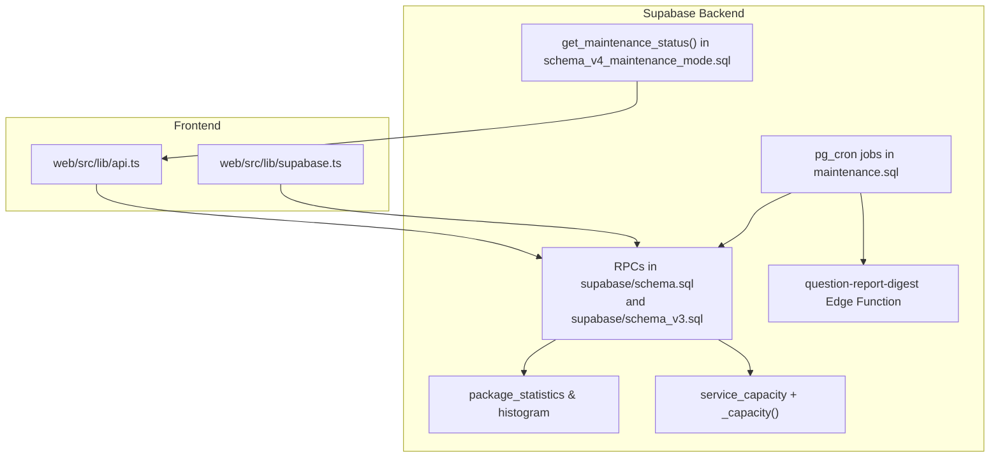
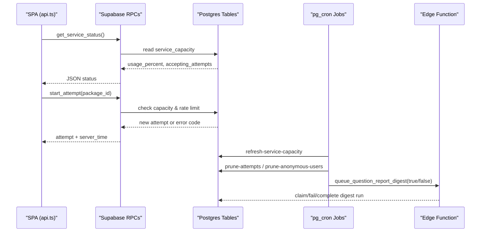
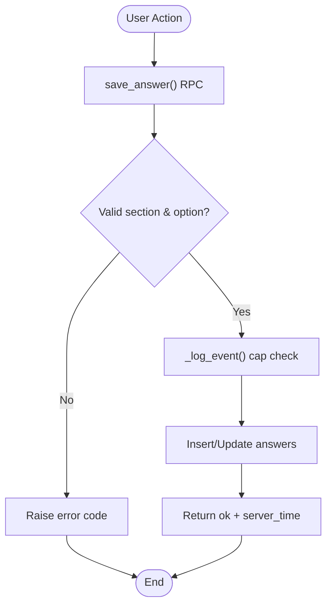
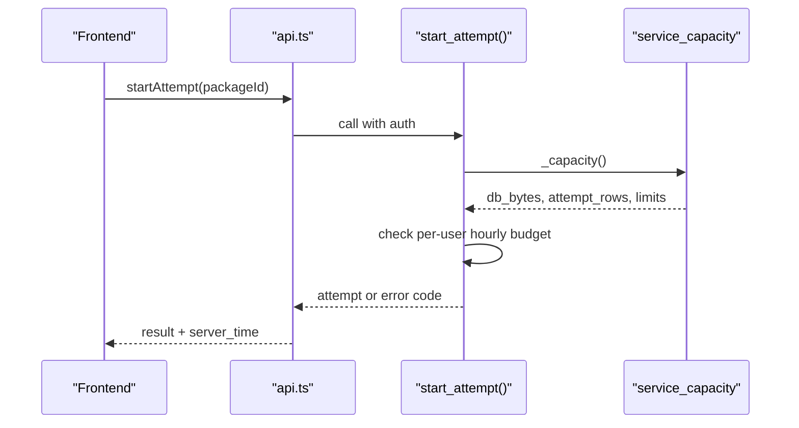
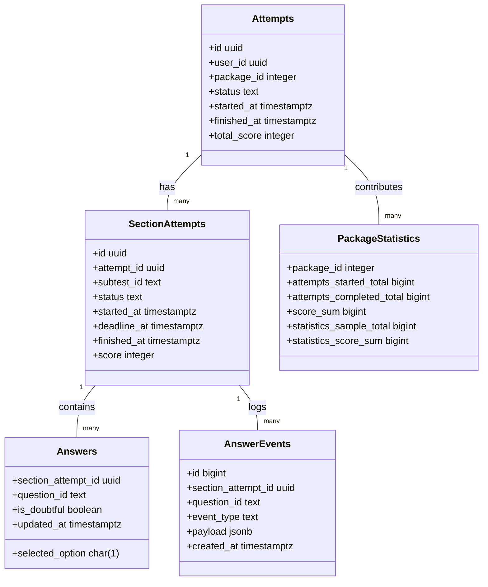
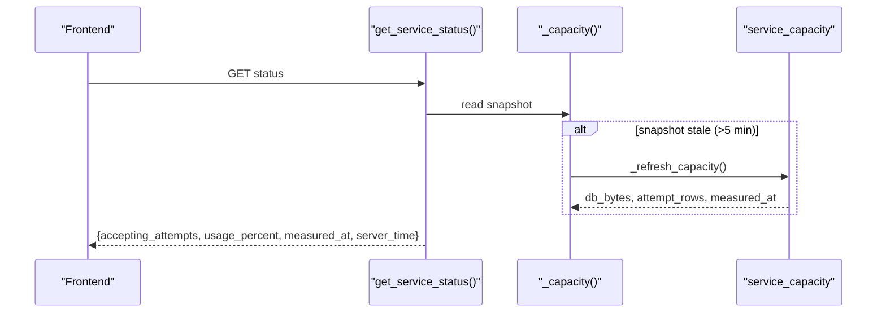
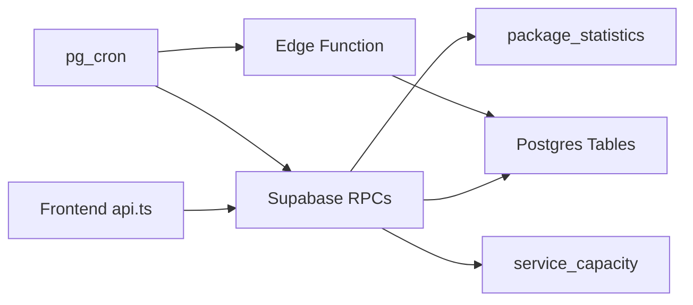

# Application Monitoring

<cite>
**Referenced Files in This Document**
- [schema.sql](file://supabase/schema.sql)
- [maintenance.sql](file://supabase/maintenance.sql)
- [schema_v3.sql](file://supabase/schema_v3.sql)
- [schema_v4_maintenance_mode.sql](file://supabase/schema_v4_maintenance_mode.sql)
- [index.ts](file://supabase/functions/question-report-digest/index.ts)
- [api.ts](file://web/src/lib/api.ts)
- [supabase.ts](file://web/src/lib/supabase.ts)
</cite>

## Table of Contents
1. [Introduction](#introduction)
2. [Project Structure](#project-structure)
3. [Core Components](#core-components)
4. [Architecture Overview](#architecture-overview)
5. [Detailed Component Analysis](#detailed-component-analysis)
6. [Dependency Analysis](#dependency-analysis)
7. [Performance Considerations](#performance-considerations)
8. [Troubleshooting Guide](#troubleshooting-guide)
9. [Conclusion](#conclusion)
10. [Appendices](#appendices)

## Introduction
This document provides comprehensive application monitoring guidance for the TBS LPDP Try Out system. It focuses on:
- Error tracking mechanisms (database query monitoring, API endpoint performance tracking, frontend error logging)
- Performance metrics collection (response times, database query performance, user interaction analytics)
- Usage analytics implementation (user session tracking, feature adoption metrics, exam completion rates)
- Health check endpoints and system status monitoring (database connectivity, storage availability, service dependencies)
- Monitoring dashboard setup, alert configuration, and log aggregation strategies
- Practical monitoring queries and performance analysis techniques using Supabase tools and custom functions exposed by the system

The system is a server-authoritative exam platform where trusted grading logic lives in Supabase database functions, with Row Level Security protecting user data. The frontend is a SPA that calls Supabase RPCs through a client library. Operational maintenance jobs run via pg_cron to keep the system within free-tier limits and to produce daily operator reports.

## Project Structure
Monitoring-relevant parts of the repository are concentrated in:
- Supabase schema and maintenance scripts defining tables, functions, policies, and scheduled jobs
- A private Edge Function that sends daily question-report digests
- Frontend API abstraction layer that selects between local and remote backends and implements retry/error handling

**Diagram sources**
- [schema.sql:341-657](file://supabase/schema.sql#L341-L657)
- [schema_v3.sql:584-757](file://supabase/schema_v3.sql#L584-L757)
- [maintenance.sql:31-51](file://supabase/maintenance.sql#L31-L51)
- [schema_v4_maintenance_mode.sql:38-63](file://supabase/schema_v4_maintenance_mode.sql#L38-L63)
- [index.ts:27-118](file://supabase/functions/question-report-digest/index.ts#L27-L118)
- [api.ts:77-95](file://web/src/lib/api.ts#L77-L95)
- [supabase.ts:1-14](file://web/src/lib/supabase.ts#L1-L14)

**Section sources**
- [schema.sql:1-12](file://supabase/schema.sql#L1-L12)
- [maintenance.sql:1-16](file://supabase/maintenance.sql#L1-L16)
- [schema_v3.sql:1-12](file://supabase/schema_v3.sql#L1-L12)
- [schema_v4_maintenance_mode.sql:1-11](file://supabase/schema_v4_maintenance_mode.sql#L1-L11)
- [index.ts:1-26](file://supabase/functions/question-report-digest/index.ts#L1-L26)
- [api.ts:1-16](file://web/src/lib/api.ts#L1-L16)
- [supabase.ts:1-14](file://web/src/lib/supabase.ts#L1-L14)

## Core Components
- Database RPCs for exam flows: start_attempt, start_section, save_answer, toggle_doubt, finish_section, get_attempt_state, get_review, get_service_status, get_package_catalog, get_attempt_summaries
- Capacity guard and health exposure: service_capacity table and _capacity(), get_service_status()
- Maintenance mode: site_maintenance table and get_maintenance_status()
- Scheduled operations: pg_cron jobs for pruning attempts/users, refreshing capacity, and digest email delivery
- Analytics aggregates: package_statistics and package_score_histogram updated on attempt completion
- Frontend API abstraction: lazy backend selection, retry policy, and error classification

Key responsibilities:
- Error tracking: RPCs raise specific error codes; answer_events logs user interactions per section; Edge Function records failures for digest runs
- Performance metrics: _capacity() measures DB size and row counts; statistics tables track completion and score distribution; RPCs return server_time for latency measurement
- Usage analytics: package_statistics counters and histogram enable completion rate and score analytics; get_attempt_summaries exposes recent user activity
- Health checks: get_service_status() and get_maintenance_status() expose operational state to clients

**Section sources**
- [schema.sql:119-127](file://supabase/schema.sql#L119-L127)
- [schema.sql:185-260](file://supabase/schema.sql#L185-L260)
- [schema.sql:341-657](file://supabase/schema.sql#L341-L657)
- [schema_v3.sql:185-227](file://supabase/schema_v3.sql#L185-L227)
- [schema_v3.sql:584-757](file://supabase/schema_v3.sql#L584-L757)
- [schema_v4_maintenance_mode.sql:15-63](file://supabase/schema_v4_maintenance_mode.sql#L15-L63)
- [maintenance.sql:31-51](file://supabase/maintenance.sql#L31-L51)
- [maintenance.sql:64-73](file://supabase/maintenance.sql#L64-L73)
- [maintenance.sql:87-152](file://supabase/maintenance.sql#L87-L152)
- [api.ts:97-122](file://web/src/lib/api.ts#L97-L122)

## Architecture Overview
The monitoring architecture centers on Supabase RPCs and scheduled jobs, with the frontend consuming health and status endpoints and recording errors via retries and structured exceptions.

**Diagram sources**
- [schema.sql:395-415](file://supabase/schema.sql#L395-L415)
- [schema.sql:341-389](file://supabase/schema.sql#L341-L389)
- [maintenance.sql:31-51](file://supabase/maintenance.sql#L31-L51)
- [maintenance.sql:64-73](file://supabase/maintenance.sql#L64-L73)
- [maintenance.sql:87-152](file://supabase/maintenance.sql#L87-L152)
- [index.ts:27-118](file://supabase/functions/question-report-digest/index.ts#L27-L118)

## Detailed Component Analysis

### Error Tracking Mechanisms
- Structured error codes: RPCs raise domain-specific error codes (e.g., not authenticated, not found, deadline passed, too many attempts, storage capacity reached). The frontend classifies terminal states and avoids retrying them.
- Answer event logging: Each section maintains an append-only event log capturing start, save_answer, mark_doubt/unmark_doubt, and finish events, capped per section to prevent unbounded growth.
- Digest run lifecycle: The Edge Function claims a digest run, renders content, emails via provider, and updates run status; failures are recorded for retry and manual attention.

**Diagram sources**
- [schema.sql:495-521](file://supabase/schema.sql#L495-L521)
- [schema.sql:246-260](file://supabase/schema.sql#L246-L260)
- [api.ts:97-122](file://web/src/lib/api.ts#L97-L122)

**Section sources**
- [schema.sql:185-260](file://supabase/schema.sql#L185-L260)
- [schema.sql:495-549](file://supabase/schema.sql#L495-L549)
- [schema_v3.sql:610-705](file://supabase/schema_v3.sql#L610-L705)
- [index.ts:27-118](file://supabase/functions/question-report-digest/index.ts#L27-L118)
- [api.ts:97-122](file://web/src/lib/api.ts#L97-L122)

### API Endpoint Performance Tracking
- Response time measurement: RPCs include server_time in responses; clients can measure round-trip latency from request send to response receipt.
- Rate limiting and capacity gating: start_attempt enforces per-user hourly attempt limits and global storage capacity thresholds before creating new attempts.
- Retry strategy: withRetry implements exponential backoff for transient errors while skipping retries for terminal error codes.

**Diagram sources**
- [schema.sql:341-389](file://supabase/schema.sql#L341-L389)
- [schema_v3.sql:709-757](file://supabase/schema_v3.sql#L709-L757)
- [api.ts:77-95](file://web/src/lib/api.ts#L77-L95)
- [api.ts:97-122](file://web/src/lib/api.ts#L97-L122)

**Section sources**
- [schema.sql:341-389](file://supabase/schema.sql#L341-L389)
- [schema_v3.sql:709-757](file://supabase/schema_v3.sql#L709-L757)
- [api.ts:97-122](file://web/src/lib/api.ts#L97-L122)

### User Interaction Analytics
- Event log per section: answer_events captures user interactions (start, save, doubt toggles, finish), enabling engagement and navigation analysis.
- Attempt summaries: get_attempt_summaries returns recent attempts with status, scores, and progress indicators for dashboards.
- Completion tracking: package_statistics tracks attempts_started_total and attempts_completed_total; eligible completions update score histograms.

**Diagram sources**
- [schema.sql:64-106](file://supabase/schema.sql#L64-L106)
- [schema_v3.sql:185-227](file://supabase/schema_v3.sql#L185-L227)
- [schema_v3.sql:584-606](file://supabase/schema_v3.sql#L584-L606)

**Section sources**
- [schema.sql:64-106](file://supabase/schema.sql#L64-L106)
- [schema_v3.sql:185-227](file://supabase/schema_v3.sql#L185-L227)
- [schema_v3.sql:584-606](file://supabase/schema_v3.sql#L584-L606)

### Health Check Endpoints and System Status
- Service status: get_service_status() returns acceptance flag, usage percentage, measurement timestamp, and server time. It uses _capacity() which auto-refreshes if older than five minutes.
- Maintenance mode: get_maintenance_status() returns enabled flags, schedule window, message, computed phase (open/warning/maintenance), and server time.
- Storage availability: service_capacity holds limit_bytes and limit_attempt_rows; cron job refreshes measurements periodically.

**Diagram sources**
- [schema.sql:395-415](file://supabase/schema.sql#L395-L415)
- [schema.sql:266-309](file://supabase/schema.sql#L266-L309)
- [schema_v4_maintenance_mode.sql:38-63](file://supabase/schema_v4_maintenance_mode.sql#L38-L63)
- [maintenance.sql:47-51](file://supabase/maintenance.sql#L47-L51)

**Section sources**
- [schema.sql:266-309](file://supabase/schema.sql#L266-L309)
- [schema.sql:395-415](file://supabase/schema.sql#L395-L415)
- [schema_v4_maintenance_mode.sql:38-63](file://supabase/schema_v4_maintenance_mode.sql#L38-L63)
- [maintenance.sql:47-51](file://supabase/maintenance.sql#L47-L51)

### Performance Metrics Collection
- Database query performance: Use Postgres planner estimates and indexes defined in schema (e.g., answer_events index) to avoid expensive scans. The _capacity function uses pg_database_size and reltuples for O(1)-like measurements.
- Response times: Measure client-side latency using server_time returned by RPCs; aggregate across endpoints to identify hotspots.
- User interaction analytics: Analyze answer_events to compute average interactions per section, doubt marking rates, and completion patterns.

Practical techniques:
- Track p50/p95 latency per RPC by sampling server_time deltas in the frontend
- Monitor answer_events volume per section to detect anomalies
- Observe package_statistics growth and histogram shape for cohort behavior

**Section sources**
- [schema.sql:105-106](file://supabase/schema.sql#L105-L106)
- [schema.sql:262-309](file://supabase/schema.sql#L262-L309)
- [schema_v3.sql:185-227](file://supabase/schema_v3.sql#L185-L227)
- [api.ts:77-95](file://web/src/lib/api.ts#L77-L95)

### Usage Analytics Implementation
- Session tracking: Anonymous users create auth.users entries; retention jobs prune inactive anonymous users after 60 days unless they have question reports.
- Feature adoption: Track start_attempt and start_section frequencies per package/subtest; correlate with package_statistics.attempts_started_total.
- Exam completion rates: Compute completion_rate = attempts_completed_total / attempts_started_total; use histogram to analyze score distributions.

**Section sources**
- [maintenance.sql:64-73](file://supabase/maintenance.sql#L64-L73)
- [schema_v3.sql:185-227](file://supabase/schema_v3.sql#L185-L227)
- [schema_v3.sql:584-606](file://supabase/schema_v3.sql#L584-L606)

### Monitoring Dashboard Setup, Alert Configuration, and Log Aggregation
- Dashboard setup:
  - Create views over package_statistics and package_score_histogram for trend lines and score distributions
  - Expose get_service_status() and get_maintenance_status() as live gauges
  - Build a page listing recent attempts via get_attempt_summaries for user activity overview
- Alert configuration:
  - Alert when usage_percent approaches or exceeds 100% (storage capacity reached)
  - Alert when cron job failures appear in cron.job_run_details
  - Alert when Edge Function returns non-ok statuses during digest runs
- Log aggregation:
  - Aggregate answer_events for engagement metrics
  - Capture RPC error codes surfaced to the frontend via withRetry classification
  - Store digest run outcomes and provider_message_id for auditability

[No sources needed since this section provides general guidance]

## Dependency Analysis
The monitoring stack depends on:
- Supabase RPCs for core functionality and status reporting
- pg_cron for scheduled maintenance and capacity refresh
- Edge Function for digest delivery with idempotency and failure handling
- Frontend retry logic to handle transient network issues while avoiding retries on terminal errors

**Diagram sources**
- [api.ts:77-95](file://web/src/lib/api.ts#L77-L95)
- [schema.sql:341-657](file://supabase/schema.sql#L341-L657)
- [maintenance.sql:31-51](file://supabase/maintenance.sql#L31-L51)
- [maintenance.sql:87-152](file://supabase/maintenance.sql#L87-L152)
- [index.ts:27-118](file://supabase/functions/question-report-digest/index.ts#L27-L118)

**Section sources**
- [api.ts:77-95](file://web/src/lib/api.ts#L77-L95)
- [schema.sql:341-657](file://supabase/schema.sql#L341-L657)
- [maintenance.sql:31-51](file://supabase/maintenance.sql#L31-L51)
- [maintenance.sql:87-152](file://supabase/maintenance.sql#L87-L152)
- [index.ts:27-118](file://supabase/functions/question-report-digest/index.ts#L27-L118)

## Performance Considerations
- Prefer RPCs over direct table access to enforce RLS and business rules
- Use server_time to measure end-to-end latency and identify slow endpoints
- Monitor answer_events growth; it is capped per section to prevent runaway writes
- Leverage pg_cron to keep capacity snapshots warm and reduce request-time overhead
- Avoid full-table scans; rely on indexes such as answer_events_section_idx and attempt indices

[No sources needed since this section provides general guidance]

## Troubleshooting Guide
Common issues and diagnostics:
- Storage capacity reached: get_service_status() shows usage_percent near or above 100%; start_attempt raises capacity error code; review service_capacity limits and consider pruning or plan upgrade
- Too many attempts: start_attempt enforces per-user hourly budget; investigate automated loops or misbehaving clients
- Deadline passed: _assert_active_section triggers deadline handling; ensure clients respect deadlines and handle timeouts gracefully
- Cron job failures: inspect cron.job_run_details for last run messages; reapply maintenance.sql if job definitions change
- Digest delivery failures: Edge Function records errors and marks runs for retry or manual attention; verify Vault secrets and email provider configuration

Operational queries:
- Check cron jobs and last runs:
  - select jobid, jobname, schedule, active from cron.job;
  - select jobname, status, return_message, start_time from cron.job_run_details order by start_time desc limit 20;
- Inspect database size and top tables:
  - select pg_size_pretty(pg_database_size(current_database()));
  - select relname, pg_size_pretty(pg_total_relation_size(c.oid)) as size from pg_class c join pg_namespace n on n.oid = c.relnamespace where n.nspname in ('public','auth') and c.relkind = 'r' order by pg_total_relation_size(c.oid) desc limit 10;

**Section sources**
- [schema.sql:341-389](file://supabase/schema.sql#L341-L389)
- [schema.sql:313-337](file://supabase/schema.sql#L313-L337)
- [maintenance.sql:154-166](file://supabase/maintenance.sql#L154-L166)
- [index.ts:27-118](file://supabase/functions/question-report-digest/index.ts#L27-L118)

## Conclusion
The TBS LPDP Try Out system integrates robust monitoring through Supabase RPCs, scheduled maintenance jobs, and a resilient frontend API layer. Health checks, capacity guards, and structured error codes provide clear signals for operational awareness. Analytics tables and event logs enable deep insights into user behavior and exam performance. By leveraging the provided functions and queries, operators can build dashboards, set alerts, and maintain system reliability within free-tier constraints.

[No sources needed since this section summarizes without analyzing specific files]

## Appendices

### Example Monitoring Queries and Techniques
- Service capacity and acceptance:
  - Call get_service_status() to obtain accepting_attempts and usage_percent
  - Schedule refresh-service-capron every five minutes to keep measurements fresh
- Engagement analysis:
  - Query answer_events by section_attempt_id to count interactions per user session
  - Compute average save_answer events per section to gauge engagement
- Completion and score analytics:
  - Read package_statistics for attempts_started_total and attempts_completed_total
  - Use package_score_histogram to visualize score distributions and median calculations
- Maintenance windows:
  - Call get_maintenance_status() to determine current phase and display warnings or maintenance banners

[No sources needed since this section provides general guidance]