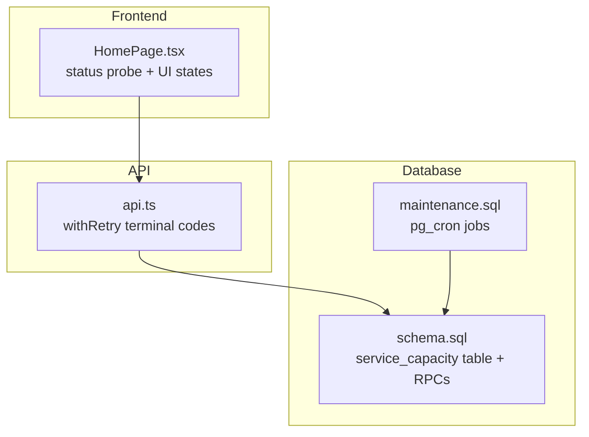
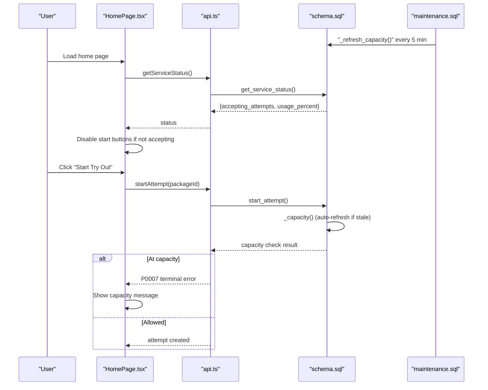
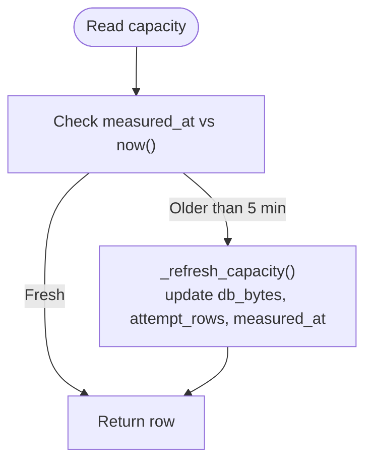
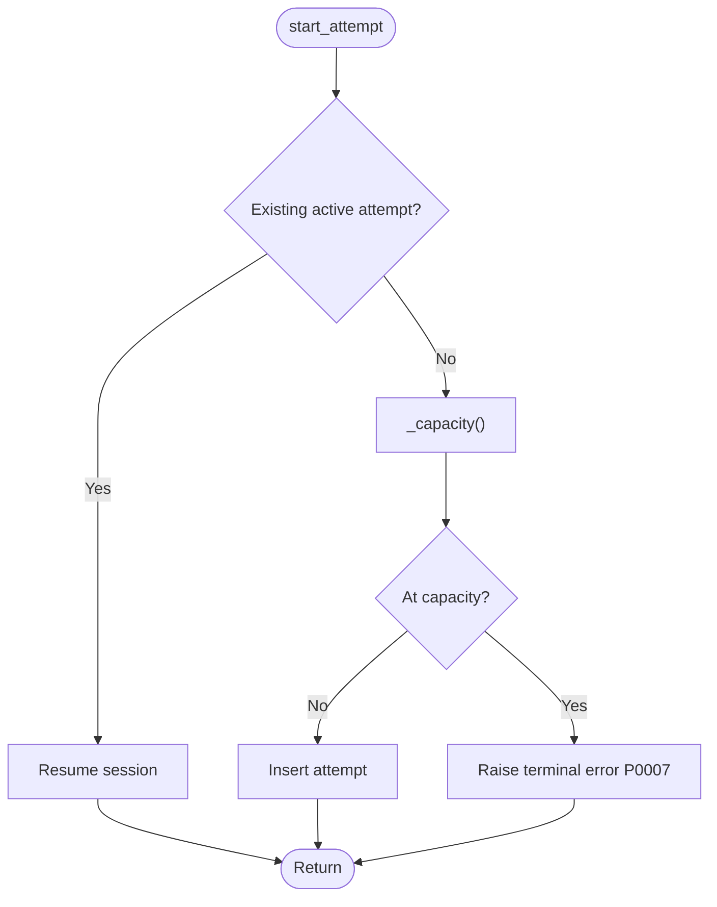
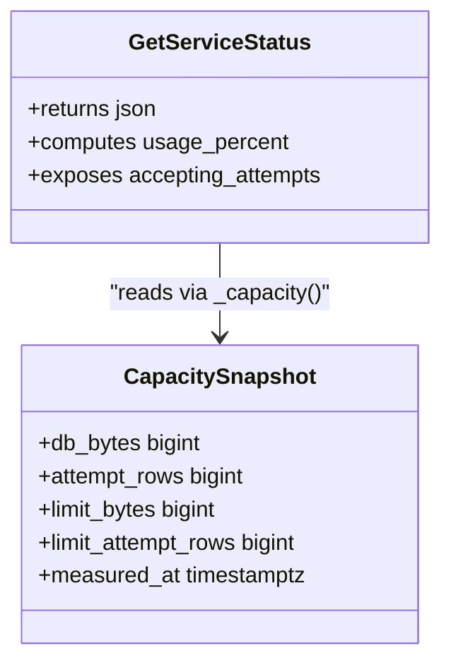
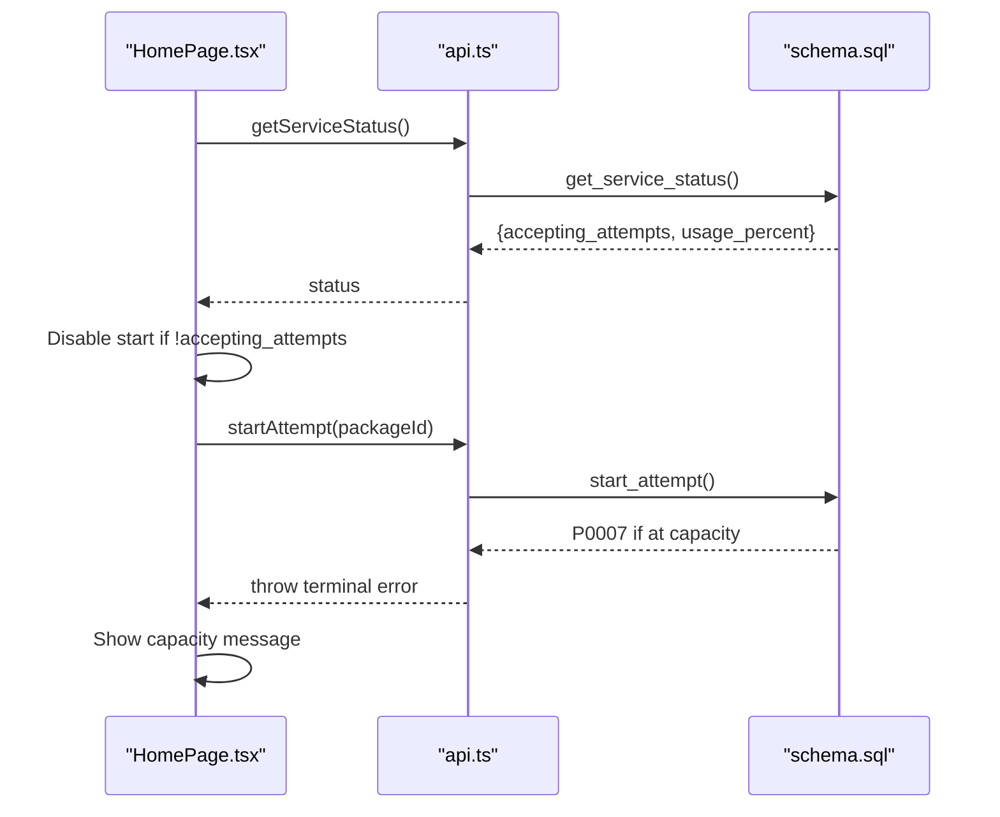
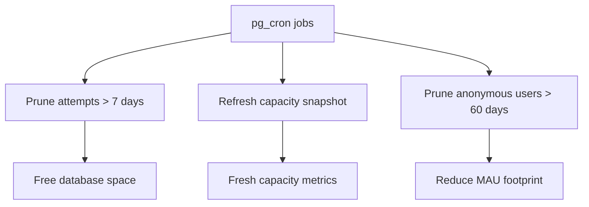
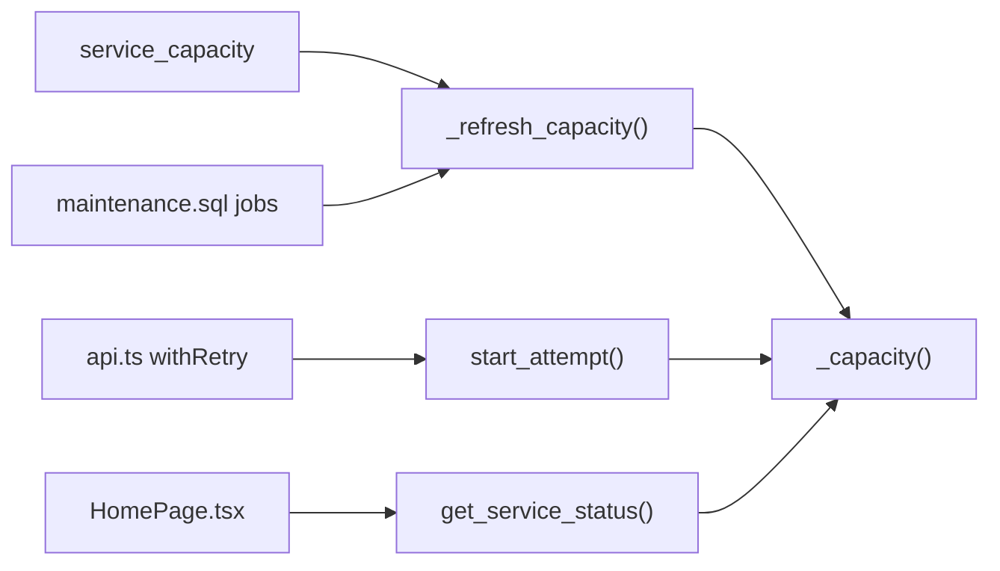

# Capacity Management

<cite>
**Referenced Files in This Document**
- [CAPACITY_GUARD.md](file://docs/CAPACITY_GUARD.md)
- [schema.sql](file://supabase/schema.sql)
- [maintenance.sql](file://supabase/maintenance.sql)
- [api.ts](file://web/src/lib/api.ts)
- [HomePage.tsx](file://web/src/pages/HomePage.tsx)
</cite>

## Table of Contents
1. [Introduction](#introduction)
2. [Project Structure](#project-structure)
3. [Core Components](#core-components)
4. [Architecture Overview](#architecture-overview)
5. [Detailed Component Analysis](#detailed-component-analysis)
6. [Dependency Analysis](#dependency-analysis)
7. [Performance Considerations](#performance-considerations)
8. [Troubleshooting Guide](#troubleshooting-guide)
9. [Conclusion](#conclusion)
10. [Appendices](#appendices)

## Introduction
This document explains the capacity management system that protects free-tier infrastructure by monitoring database size, row growth, and request throughput, and by enforcing tiered access controls under load. It covers:
- The capacity guard that prevents new attempts when storage is near or at capacity while allowing ongoing sessions to continue.
- Automatic maintenance jobs that reclaim space and keep capacity metrics fresh.
- Client-side UI behavior that informs users when capacity is full.
- Operational guidance for thresholds, scaling triggers, monitoring queries, and manual interventions.

The goal is to maintain service quality within free-tier constraints by proactively limiting new workloads before writes fail and by ensuring existing work completes safely.

## Project Structure
Capacity management spans three layers:
- Database layer: schema, functions, and scheduled jobs measure capacity, enforce limits, and prune data.
- API layer: RPCs expose status and enforce capacity checks during attempt creation.
- Frontend layer: the home page reads service status and disables new attempts when capacity is full.

**Diagram sources**
- [schema.sql:119-127](file://supabase/schema.sql#L119-L127)
- [schema.sql:262-315](file://supabase/schema.sql#L262-L315)
- [schema.sql:341-390](file://supabase/schema.sql#L341-L390)
- [schema.sql:392-415](file://supabase/schema.sql#L392-L415)
- [maintenance.sql:31-51](file://supabase/maintenance.sql#L31-L51)
- [api.ts:97-122](file://web/src/lib/api.ts#L97-L122)
- [HomePage.tsx:65-82](file://web/src/pages/HomePage.tsx#L65-L82)

**Section sources**
- [CAPACITY_GUARD.md:1-28](file://docs/CAPACITY_GUARD.md#L1-L28)
- [schema.sql:119-127](file://supabase/schema.sql#L119-L127)
- [maintenance.sql:31-51](file://supabase/maintenance.sql#L31-L51)
- [api.ts:97-122](file://web/src/lib/api.ts#L97-L122)
- [HomePage.tsx:65-82](file://web/src/pages/HomePage.tsx#L65-L82)

## Core Components
- Capacity snapshot and measurement:
  - A single-row table stores current database size, estimated attempt-related rows, and soft/hard ceilings.
  - Functions refresh and serve a cached snapshot with staleness handling.
- Enforcement at write boundary:
  - New attempt creation is blocked when capacity thresholds are reached; resuming active attempts remains allowed.
- Status exposure:
  - A function returns a safe percentage and acceptance flag without exposing raw byte counts.
- Scheduled maintenance:
  - Jobs prune old attempts, refresh capacity snapshots, and clean anonymous users.
- Client integration:
  - Frontend probes service status and disables start buttons when full; errors map to user-friendly messages.

**Section sources**
- [schema.sql:119-127](file://supabase/schema.sql#L119-L127)
- [schema.sql:262-315](file://supabase/schema.sql#L262-L315)
- [schema.sql:341-390](file://supabase/schema.sql#L341-L390)
- [schema.sql:392-415](file://supabase/schema.sql#L392-L415)
- [maintenance.sql:31-51](file://supabase/maintenance.sql#L31-L51)
- [HomePage.tsx:65-82](file://web/src/pages/HomePage.tsx#L65-L82)
- [HomePage.tsx:117-127](file://web/src/pages/HomePage.tsx#L117-L127)
- [api.ts:97-122](file://web/src/lib/api.ts#L97-L122)

## Architecture Overview
The capacity guard operates as a self-healing, server-authoritative control plane:
- Measurement: A background job warms the snapshot; on read, if older than five minutes, a refresh occurs automatically.
- Enforcement: Attempt creation checks the latest snapshot against configured limits and raises a terminal error code when exceeded.
- Exposure: Service status exposes only normalized usage and acceptance state to clients.
- UI: The home page uses the status to disable new attempts and show a warning banner.

**Diagram sources**
- [maintenance.sql:47-51](file://supabase/maintenance.sql#L47-L51)
- [schema.sql:262-315](file://supabase/schema.sql#L262-L315)
- [schema.sql:341-390](file://supabase/schema.sql#L341-L390)
- [schema.sql:392-415](file://supabase/schema.sql#L392-L415)
- [HomePage.tsx:65-82](file://web/src/pages/HomePage.tsx#L65-L82)
- [HomePage.tsx:117-127](file://web/src/pages/HomePage.tsx#L117-L127)
- [api.ts:97-122](file://web/src/lib/api.ts#L97-L122)

## Detailed Component Analysis

### Capacity Snapshot and Measurement
- Storage:
  - A single-row table holds db_bytes, attempt_rows, limit_bytes, limit_attempt_rows, and measured_at.
- Measurement:
  - A security-definer function updates db_bytes via a directory stat and sums planner estimates for attempt-related tables.
  - A second function serves the row, refreshing if older than five minutes.
- Cost and concurrency:
  - Measurement is O(1) using catalog stats; concurrent refreshes are idempotent and safe.

**Diagram sources**
- [schema.sql:262-315](file://supabase/schema.sql#L262-L315)

**Section sources**
- [schema.sql:119-127](file://supabase/schema.sql#L119-L127)
- [schema.sql:262-315](file://supabase/schema.sql#L262-L315)
- [CAPACITY_GUARD.md:29-79](file://docs/CAPACITY_GUARD.md#L29-L79)

### Enforcement at Attempt Creation
- Guard placement:
  - In start_attempt, after checking for an existing active attempt but before inserting a new one, so resuming is never blocked.
- Thresholds:
  - Blocks when db_bytes >= limit_bytes OR attempt_rows >= limit_attempt_rows.
- Error signaling:
  - Raises a terminal error code that the client treats as non-retryable.

**Diagram sources**
- [schema.sql:341-390](file://supabase/schema.sql#L341-L390)

**Section sources**
- [schema.sql:341-390](file://supabase/schema.sql#L341-L390)
- [CAPACITY_GUARD.md:81-97](file://docs/CAPACITY_GUARD.md#L81-L97)
- [api.ts:97-122](file://web/src/lib/api.ts#L97-L122)

### Service Status Exposure
- Purpose:
  - Provide a safe, normalized view of capacity to the frontend without exposing raw bytes.
- Output:
  - Acceptance flag, usage percentage, timestamps.

**Diagram sources**
- [schema.sql:392-415](file://supabase/schema.sql#L392-L415)
- [schema.sql:262-315](file://supabase/schema.sql#L262-L315)

**Section sources**
- [schema.sql:392-415](file://supabase/schema.sql#L392-L415)
- [CAPACITY_GUARD.md:98-112](file://docs/CAPACITY_GUARD.md#L98-L112)

### Frontend Integration and Tiered Access Control
- Probe:
  - HomePage calls getServiceStatus alongside other data; failures return null and default to open behavior.
- UI states:
  - When accepting_attempts is false, start buttons are disabled and a warning banner appears.
  - If startAttempt fails with the terminal capacity error, a consistent message is shown.
- Retry policy:
  - Terminal error codes are not retried to avoid futile retries under capacity pressure.

**Diagram sources**
- [HomePage.tsx:65-82](file://web/src/pages/HomePage.tsx#L65-L82)
- [HomePage.tsx:117-127](file://web/src/pages/HomePage.tsx#L117-L127)
- [schema.sql:341-390](file://supabase/schema.sql#L341-L390)
- [api.ts:97-122](file://web/src/lib/api.ts#L97-L122)

**Section sources**
- [HomePage.tsx:65-82](file://web/src/pages/HomePage.tsx#L65-L82)
- [HomePage.tsx:117-127](file://web/src/pages/HomePage.tsx#L117-L127)
- [api.ts:97-122](file://web/src/lib/api.ts#L97-L122)

### Maintenance and Retention
- Pruning:
  - Daily job deletes attempts older than seven days, cascading to related tables.
- Capacity warm-up:
  - Every-five-minute job refreshes capacity snapshot to reduce request-time measurement cost.
- Anonymous user cleanup:
  - Deletes inactive anonymous users beyond retention window while preserving those with reports.

**Diagram sources**
- [maintenance.sql:31-51](file://supabase/maintenance.sql#L31-L51)
- [maintenance.sql:64-73](file://supabase/maintenance.sql#L64-L73)

**Section sources**
- [maintenance.sql:31-51](file://supabase/maintenance.sql#L31-L51)
- [maintenance.sql:64-73](file://supabase/maintenance.sql#L64-L73)
- [CAPACITY_GUARD.md:137-161](file://docs/CAPACITY_GUARD.md#L137-L161)

## Dependency Analysis
- Data dependencies:
  - service_capacity depends on pg_database_size and planner estimates from pg_class.
  - start_attempt depends on _capacity() and enforces limits before inserts.
  - get_service_status depends on _capacity() and computes usage percentages.
- Operational dependencies:
  - maintenance.sql schedules jobs that depend on pg_cron being enabled.
- Client dependencies:
  - HomePage depends on getServiceStatus availability; gracefully degrades if absent.
  - api.ts treats specific error codes as terminal to prevent retry storms.

**Diagram sources**
- [schema.sql:119-127](file://supabase/schema.sql#L119-L127)
- [schema.sql:262-315](file://supabase/schema.sql#L262-L315)
- [schema.sql:341-390](file://supabase/schema.sql#L341-L390)
- [schema.sql:392-415](file://supabase/schema.sql#L392-L415)
- [maintenance.sql:31-51](file://supabase/maintenance.sql#L31-L51)
- [HomePage.tsx:65-82](file://web/src/pages/HomePage.tsx#L65-L82)
- [api.ts:97-122](file://web/src/lib/api.ts#L97-L122)

**Section sources**
- [schema.sql:262-315](file://supabase/schema.sql#L262-L315)
- [schema.sql:341-390](file://supabase/schema.sql#L341-L390)
- [schema.sql:392-415](file://supabase/schema.sql#L392-L415)
- [maintenance.sql:31-51](file://supabase/maintenance.sql#L31-L51)
- [HomePage.tsx:65-82](file://web/src/pages/HomePage.tsx#L65-L82)
- [api.ts:97-122](file://web/src/lib/api.ts#L97-L122)

## Performance Considerations
- Measurement efficiency:
  - Uses pg_database_size (directory stat) and planner estimates (reltuples) to keep capacity checks O(1).
- Staleness tolerance:
  - Five-minute staleness allows bursty traffic without over-measuring; cron warms the cache.
- Concurrency safety:
  - Idempotent refresh avoids locking; multiple sessions can refresh concurrently without issues.
- Event log cap:
  - Answer event logging per section is capped to prevent unbounded append-only growth.

[No sources needed since this section provides general guidance]

## Troubleshooting Guide
- Diagnose current capacity:
  - Query the service_capacity table to see used space, limits, and last measurement time.
- Force immediate measurement:
  - Invoke the refresh function to bypass the five-minute window.
- Identify largest tables:
  - List top relations by total size to understand where space is consumed.
- Handle capacity trips:
  - Wait for daily pruning to reclaim space, or adjust retention windows; raising limits above ~90% of plan only delays hitting hard limits.

**Section sources**
- [CAPACITY_GUARD.md:137-161](file://docs/CAPACITY_GUARD.md#L137-L161)

## Conclusion
The capacity management system safeguards free-tier infrastructure through precise measurement, conservative enforcement, and graceful degradation. It blocks new attempts when storage is near capacity while preserving ongoing sessions, exposes safe status information to clients, and automates maintenance to reclaim space. Operators can monitor capacity, tune thresholds, and intervene manually when necessary to maintain stability and service quality.

[No sources needed since this section summarizes without analyzing specific files]

## Appendices

### Capacity Thresholds and Behavior
- Soft ceiling:
  - Default limit_bytes set to 80% of the free tier to preempt write failures.
- Row backstop:
  - limit_attempt_rows acts as a secondary safeguard against row inflation without proportional size growth.
- Behavior:
  - New attempts are refused when either threshold is reached; existing sessions continue unaffected.

**Section sources**
- [schema.sql:119-127](file://supabase/schema.sql#L119-L127)
- [CAPACITY_GUARD.md:29-59](file://docs/CAPACITY_GUARD.md#L29-L59)

### Monitoring Queries
- Current capacity:
  - Select db_bytes, limit_bytes, attempt_rows, and measured_at from service_capacity.
- Force refresh:
  - Call the refresh function to update the snapshot immediately.
- Largest tables:
  - Query relation sizes to identify growth drivers.

**Section sources**
- [CAPACITY_GUARD.md:137-161](file://docs/CAPACITY_GUARD.md#L137-L161)

### Scaling Triggers and Manual Intervention
- Triggers:
  - When db_bytes or attempt_rows reach their respective limits, new attempts are blocked.
- Interventions:
  - Adjust limit_bytes via SQL to align with plan changes.
  - Rely on daily pruning to reclaim space; consider shortening retention if urgent relief is needed.
  - Avoid vacuum full unless absolutely necessary due to locking implications.

**Section sources**
- [schema.sql:341-390](file://supabase/schema.sql#L341-L390)
- [CAPACITY_GUARD.md:137-161](file://docs/CAPACITY_GUARD.md#L137-L161)

### Connection Pooling Strategies
- Note:
  - The repository does not define application-level connection pooling configuration in the analyzed files.
- Recommendation:
  - For future scaling, configure connection pooling at the application or proxy layer to manage database connections efficiently under load.

[No sources needed since this section provides general guidance]

### Capacity Planning and Optimization Techniques
- Plan ahead:
  - Monitor trend lines of db_bytes and attempt_rows to anticipate capacity needs.
- Optimize storage:
  - Ensure autovacuum runs regularly to keep planner estimates accurate.
- Tune retention:
  - Balance user experience with storage constraints by adjusting retention windows judiciously.
- Limit event logs:
  - Keep per-section event logs bounded to prevent unbounded growth.

[No sources needed since this section provides general guidance]