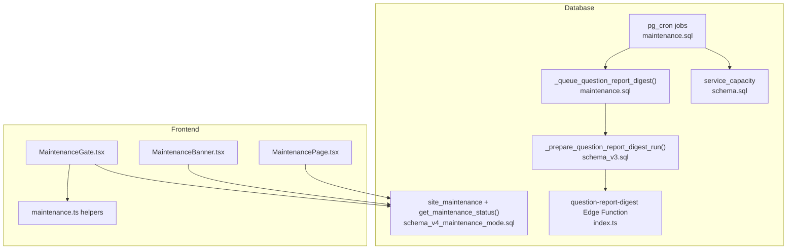
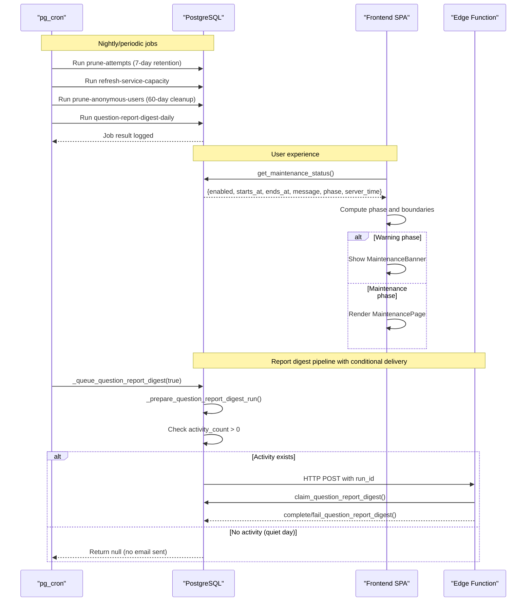
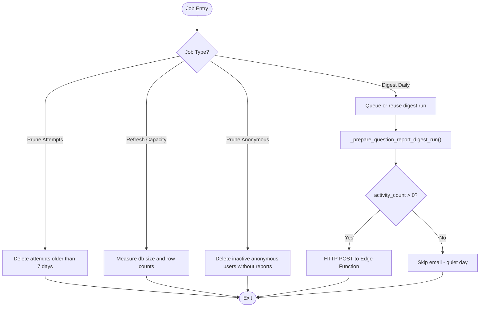
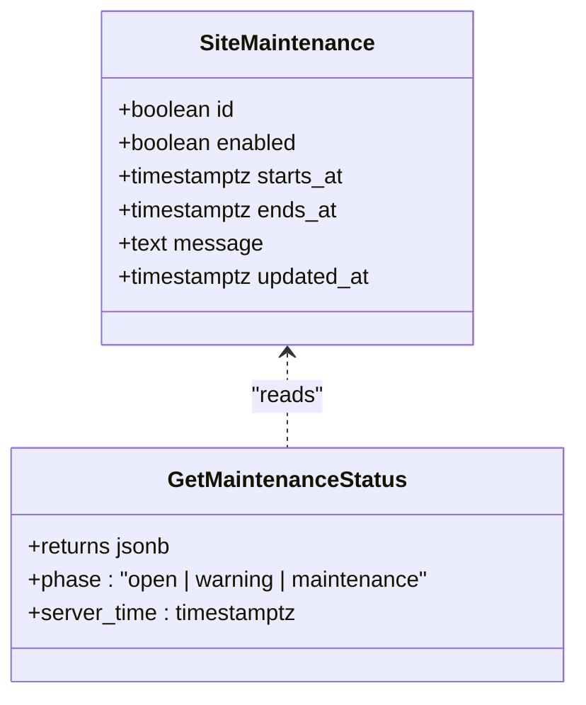
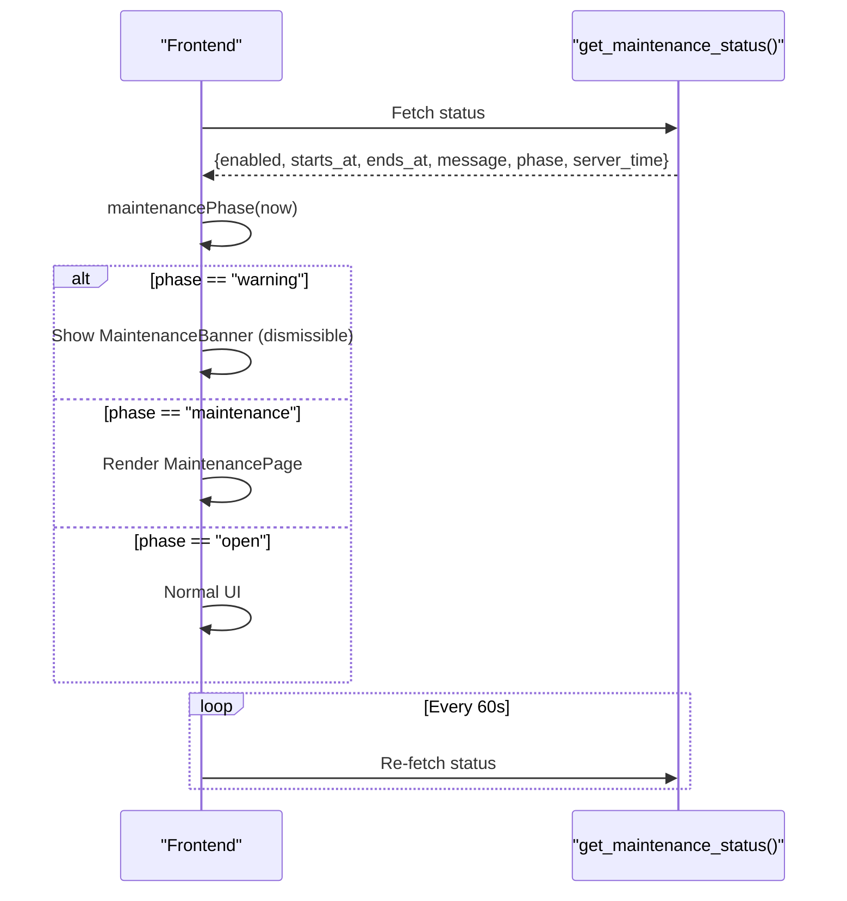
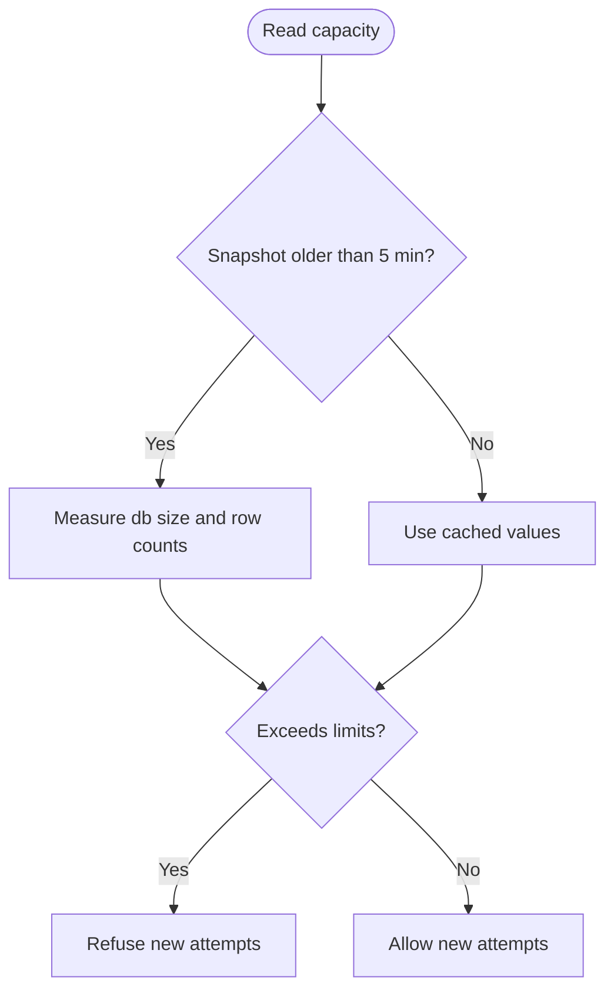
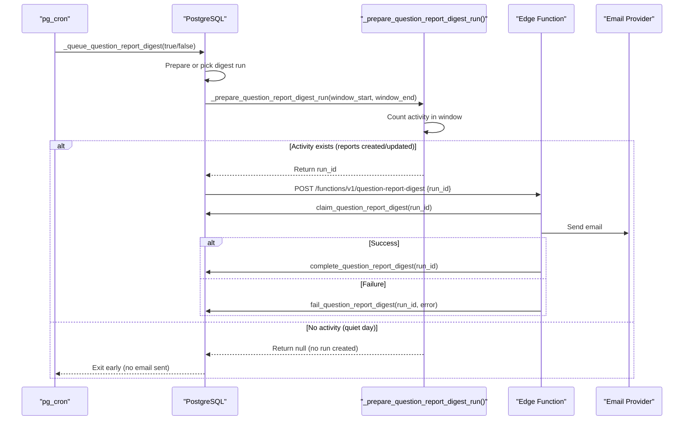
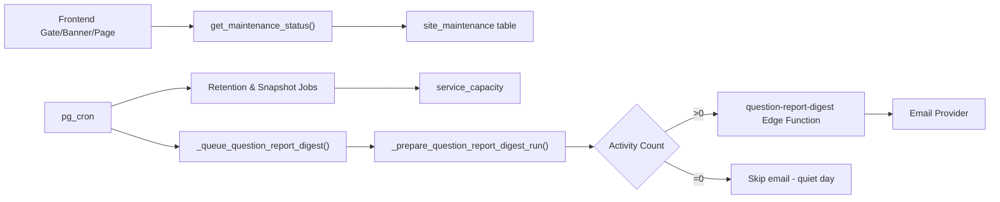

# Maintenance System

<cite>
**Referenced Files in This Document**
- [maintenance.sql](file://supabase/maintenance.sql)
- [schema_v4_maintenance_mode.sql](file://supabase/schema_v4_maintenance_mode.sql)
- [MaintenanceGate.tsx](file://web/src/components/MaintenanceGate.tsx)
- [MaintenanceBanner.tsx](file://web/src/components/MaintenanceBanner.tsx)
- [MaintenancePage.tsx](file://web/src/pages/MaintenancePage.tsx)
- [maintenance.ts](file://web/src/lib/maintenance.ts)
- [types.ts](file://web/src/lib/types.ts)
- [CAPACITY_GUARD.md](file://docs/CAPACITY_GUARD.md)
- [index.ts](file://supabase/functions/question-report-digest/index.ts)
- [render.ts](file://supabase/functions/question-report-digest/render.ts)
- [schema_v3.sql](file://supabase/schema_v3.sql)
</cite>

## Update Summary
**Changes Made**
- Updated Daily Report Digest Pipeline section to reflect conditional delivery logic
- Enhanced architecture diagrams to show quiet day handling
- Added detailed explanation of the `_prepare_question_report_digest_run` function's activity counting mechanism
- Updated troubleshooting guide with new quiet day scenarios

## Table of Contents
1. [Introduction](#introduction)
2. [Project Structure](#project-structure)
3. [Core Components](#core-components)
4. [Architecture Overview](#architecture-overview)
5. [Detailed Component Analysis](#detailed-component-analysis)
6. [Dependency Analysis](#dependency-analysis)
7. [Performance Considerations](#performance-considerations)
8. [Troubleshooting Guide](#troubleshooting-guide)
9. [Conclusion](#conclusion)
10. [Appendices](#appendices)

## Introduction
This document explains the maintenance system that coordinates scheduled database operations and user-facing maintenance notifications for the application. It covers:
- The pg_cron-based job scheduler that performs data retention, capacity snapshots, anonymous user cleanup, and daily report generation with conditional delivery logic.
- The maintenance mode feature that shows frontend banners and gates to prevent new exam attempts during scheduled maintenance windows.
- Automated cleanup processes with defined retention periods and database size management aligned with free-tier constraints.
- Operational procedures for monitoring jobs, manual execution, emergency shutdowns, and recovery when maintenance tasks fail.

## Project Structure
The maintenance system spans two layers:
- Database layer (Supabase): SQL schema and pg_cron jobs define schedules, retention rules, capacity measurements, and a public maintenance status RPC.
- Frontend layer (React SPA): A gate component polls the maintenance status, renders warning banners before maintenance starts, and switches to a maintenance page during the window.

**Diagram sources**
- [maintenance.sql:31-51](file://supabase/maintenance.sql#L31-L51)
- [schema_v4_maintenance_mode.sql:15-63](file://supabase/schema_v4_maintenance_mode.sql#L15-L63)
- [MaintenanceGate.tsx:35-141](file://web/src/components/MaintenanceGate.tsx#L35-L141)
- [MaintenanceBanner.tsx:1-35](file://web/src/components/MaintenanceBanner.tsx#L1-L35)
- [MaintenancePage.tsx:1-32](file://web/src/pages/MaintenancePage.tsx#L1-L32)
- [maintenance.ts:1-48](file://web/src/lib/maintenance.ts#L1-L48)
- [index.ts:27-119](file://supabase/functions/question-report-digest/index.ts#L27-L119)
- [schema_v3.sql:1706-1780](file://supabase/schema_v3.sql#L1706-L1780)

**Section sources**
- [maintenance.sql:1-170](file://supabase/maintenance.sql#L1-L170)
- [schema_v4_maintenance_mode.sql:1-82](file://supabase/schema_v4_maintenance_mode.sql#L1-L82)
- [MaintenanceGate.tsx:1-141](file://web/src/components/MaintenanceGate.tsx#L1-L141)
- [MaintenanceBanner.tsx:1-35](file://web/src/components/MaintenanceBanner.tsx#L1-L35)
- [MaintenancePage.tsx:1-32](file://web/src/pages/MaintenancePage.tsx#L1-L32)
- [maintenance.ts:1-48](file://web/src/lib/maintenance.ts#L1-L48)
- [index.ts:1-119](file://supabase/functions/question-report-digest/index.ts#L1-L119)
- [schema_v3.sql:1706-1895](file://supabase/schema_v3.sql#L1706-L1895)

## Core Components
- pg_cron job scheduler:
  - Attempt pruning: deletes attempts older than 7 days at a fixed nightly time.
  - Capacity snapshot: periodically refreshes service capacity metrics used by the guard.
  - Anonymous user cleanup: removes inactive anonymous users after 60 days unless they have question reports.
  - Daily report digest: queues and retries sending a daily email digest via an Edge Function with conditional delivery logic.
- Maintenance mode:
  - Backend: a singleton table storing enabled state, start/end times, and message; a secure function computes phase and server time.
  - Frontend: a gate component polls the status, shows a warning banner before maintenance, and displays a maintenance page during the window.
- Capacity guard:
  - Monitors database usage against configurable limits and blocks new attempts while allowing ongoing work to finish.

**Section sources**
- [maintenance.sql:22-73](file://supabase/maintenance.sql#L22-L73)
- [maintenance.sql:87-155](file://supabase/maintenance.sql#L87-L155)
- [schema_v4_maintenance_mode.sql:15-63](file://supabase/schema_v4_maintenance_mode.sql#L15-L63)
- [MaintenanceGate.tsx:35-141](file://web/src/components/MaintenanceGate.tsx#L35-L141)
- [CAPACITY_GUARD.md:1-161](file://docs/CAPACITY_GUARD.md#L1-L161)

## Architecture Overview
The system combines scheduled database tasks with real-time frontend behavior to keep the platform healthy and transparent to users.

**Diagram sources**
- [maintenance.sql:31-51](file://supabase/maintenance.sql#L31-L51)
- [maintenance.sql:64-73](file://supabase/maintenance.sql#L64-L73)
- [maintenance.sql:87-155](file://supabase/maintenance.sql#L87-L155)
- [schema_v4_maintenance_mode.sql:38-63](file://supabase/schema_v4_maintenance_mode.sql#L38-L63)
- [MaintenanceGate.tsx:56-139](file://web/src/components/MaintenanceGate.tsx#L56-L139)
- [index.ts:27-119](file://supabase/functions/question-report-digest/index.ts#L27-L119)
- [schema_v3.sql:1706-1780](file://supabase/schema_v3.sql#L1706-L1780)

## Detailed Component Analysis

### pg_cron Jobs
- Prune attempts (daily at 03:00 UTC): Deletes attempts started more than 7 days ago. Cascades delete to related answers and events; question reports are preserved.
- Refresh service capacity (every 5 minutes): Calls a private helper to measure database size and attempt row estimates, keeping the capacity guard up-to-date.
- Prune anonymous users (daily at 03:30 UTC): Removes anonymous users inactive for 60 days unless they authored question reports.
- Daily report digest:
  - Creates or reuses a digest run window and invokes the Edge Function with a run ID.
  - **Enhanced**: Now includes conditional delivery logic - emails are only sent when at least one report was created or updated in the digest window. Quiet days produce no run and no email.
  - Retry job runs every 30 minutes to resend any unsent runs without creating extra windows.

**Diagram sources**
- [maintenance.sql:31-35](file://supabase/maintenance.sql#L31-L35)
- [maintenance.sql:47-51](file://supabase/maintenance.sql#L47-L51)
- [maintenance.sql:64-73](file://supabase/maintenance.sql#L64-L73)
- [maintenance.sql:87-155](file://supabase/maintenance.sql#L87-L155)
- [schema_v3.sql:1706-1780](file://supabase/schema_v3.sql#L1706-L1780)

**Section sources**
- [maintenance.sql:22-73](file://supabase/maintenance.sql#L22-L73)
- [maintenance.sql:87-155](file://supabase/maintenance.sql#L87-L155)

### Maintenance Mode (Backend)
- Singleton configuration table stores whether maintenance is enabled, its start/end timestamps, and a user-facing message.
- A secure function returns the current phase: open, warning (up to 4 hours before start), or maintenance (between start and end). It also returns server time to align frontend transitions.

**Diagram sources**
- [schema_v4_maintenance_mode.sql:15-63](file://supabase/schema_v4_maintenance_mode.sql#L15-L63)

**Section sources**
- [schema_v4_maintenance_mode.sql:15-63](file://supabase/schema_v4_maintenance_mode.sql#L15-L63)

### Maintenance Mode (Frontend)
- Polling gate:
  - Probes the maintenance status on mount and every 60 seconds.
  - Computes phase using server-derived timestamps and local time.
  - Shows a dismissible warning banner in the warning phase.
  - Renders a full maintenance page during the maintenance phase.
- Helpers:
  - Phase computation considers enabled flag, start/end times, and a 4-hour lead-in warning.
  - Boundary detection schedules UI updates at exact transition points.

**Diagram sources**
- [MaintenanceGate.tsx:35-141](file://web/src/components/MaintenanceGate.tsx#L35-L141)
- [maintenance.ts:1-48](file://web/src/lib/maintenance.ts#L1-L48)
- [MaintenanceBanner.tsx:1-35](file://web/src/components/MaintenanceBanner.tsx#L1-L35)
- [MaintenancePage.tsx:1-32](file://web/src/pages/MaintenancePage.tsx#L1-L32)

**Section sources**
- [MaintenanceGate.tsx:1-141](file://web/src/components/MaintenanceGate.tsx#L1-L141)
- [maintenance.ts:1-48](file://web/src/lib/maintenance.ts#L1-L48)
- [MaintenanceBanner.tsx:1-35](file://web/src/components/MaintenanceBanner.tsx#L1-L35)
- [MaintenancePage.tsx:1-32](file://web/src/pages/MaintenancePage.tsx#L1-L32)
- [types.ts:213-226](file://web/src/lib/types.ts#L213-L226)

### Capacity Guard
- Measures database size and estimated attempt rows, comparing against soft limits.
- Blocks new attempts when capacity is reached but allows existing sessions to continue.
- Periodically refreshed via pg_cron; self-heals if cron is disabled by refreshing on read staleness.

**Diagram sources**
- [CAPACITY_GUARD.md:29-80](file://docs/CAPACITY_GUARD.md#L29-L80)
- [CAPACITY_GUARD.md:81-131](file://docs/CAPACITY_GUARD.md#L81-L131)

**Section sources**
- [CAPACITY_GUARD.md:1-161](file://docs/CAPACITY_GUARD.md#L1-L161)

### Daily Report Digest Pipeline
- A database function queues a digest run, reads secrets from Vault, and calls the Edge Function with a run ID.
- **Enhanced**: The `_prepare_question_report_digest_run` function now checks for activity count before creating a run. If no reports were created or updated in the digest window, it returns null and no email is sent.
- The Edge Function claims the run, renders the digest, sends it via an email provider, and marks it sent or failed.
- A retry job resends any unsent runs every 30 minutes without creating duplicate daily windows.

**Diagram sources**
- [maintenance.sql:87-155](file://supabase/maintenance.sql#L87-L155)
- [schema_v3.sql:1706-1780](file://supabase/schema_v3.sql#L1706-L1780)
- [index.ts:27-119](file://supabase/functions/question-report-digest/index.ts#L27-L119)

**Section sources**
- [maintenance.sql:87-155](file://supabase/maintenance.sql#L87-L155)
- [schema_v3.sql:1706-1780](file://supabase/schema_v3.sql#L1706-L1780)
- [index.ts:1-119](file://supabase/functions/question-report-digest/index.ts#L1-L119)
- [render.ts:1-128](file://supabase/functions/question-report-digest/render.ts#L1-L128)

## Dependency Analysis
- Frontend depends on the backend maintenance status RPC to compute phase and render appropriate UI.
- pg_cron jobs depend on extensions being enabled and on Vault secrets for the digest pipeline.
- Capacity guard depends on periodic measurement; if cron fails, reads still refresh stale data.
- Digest pipeline depends on Edge Function configuration and email provider availability.
- **Enhanced**: Digest pipeline now has conditional dependency on activity count - no email is sent on quiet days.

**Diagram sources**
- [schema_v4_maintenance_mode.sql:15-63](file://supabase/schema_v4_maintenance_mode.sql#L15-L63)
- [maintenance.sql:31-51](file://supabase/maintenance.sql#L31-L51)
- [maintenance.sql:87-155](file://supabase/maintenance.sql#L87-L155)
- [schema_v3.sql:1706-1780](file://supabase/schema_v3.sql#L1706-L1780)
- [index.ts:27-119](file://supabase/functions/question-report-digest/index.ts#L27-L119)

**Section sources**
- [maintenance.sql:1-170](file://supabase/maintenance.sql#L1-L170)
- [schema_v4_maintenance_mode.sql:1-82](file://supabase/schema_v4_maintenance_mode.sql#L1-L82)
- [index.ts:1-119](file://supabase/functions/question-report-digest/index.ts#L1-L119)
- [schema_v3.sql:1706-1895](file://supabase/schema_v3.sql#L1706-L1895)

## Performance Considerations
- Retention jobs run off-peak to minimize impact on active users.
- Capacity measurement is cached for 5 minutes and only refreshed when needed, avoiding frequent heavy queries.
- Anonymous user cleanup uses existence checks to preserve users who filed reports, minimizing unnecessary deletions.
- Digest retries avoid duplicate daily windows and rely on idempotent operations.
- **Enhanced**: Conditional delivery reduces unnecessary email processing and network calls on quiet days, improving overall system efficiency.

[No sources needed since this section provides general guidance]

## Troubleshooting Guide
- Monitor job execution:
  - List scheduled jobs and their last run details to identify failures and messages.
  - Check database size and per-table sizes to understand growth drivers.
- Common issues:
  - Digest job fails due to missing Vault secrets or misconfigured Edge Function keys.
  - **New**: Digest appears to not send emails - check if there was actually activity in the digest window. On quiet days, no email is expected.
  - Capacity guard trips because retention has not yet reclaimed space; wait for nightly sweep or adjust retention/limits.
  - Frontend maintenance banner not showing: verify schedule in site_maintenance and ensure the RPC is reachable.
- Manual actions:
  - Force capacity measurement immediately.
  - Reschedule or unschedule specific jobs if necessary.
  - Trigger a digest run manually by invoking the queue function.
  - **New**: To force email on a quiet day, temporarily modify the activity count check or add test data to trigger the digest.

**Section sources**
- [maintenance.sql:157-170](file://supabase/maintenance.sql#L157-L170)
- [CAPACITY_GUARD.md:137-161](file://docs/CAPACITY_GUARD.md#L137-L161)
- [schema_v3.sql:1706-1780](file://supabase/schema_v3.sql#L1706-L1780)

## Conclusion
The maintenance system ensures long-term stability through automated retention, capacity monitoring, and transparent user communication. Scheduled jobs maintain database health within free-tier constraints, while the maintenance mode feature proactively informs users and prevents new attempts during planned downtime. The enhanced daily report digest system now intelligently handles quiet days by skipping email delivery when no activity occurs, reducing unnecessary resource usage. Operators can monitor, adjust, and recover from issues using built-in diagnostics and manual procedures.

[No sources needed since this section summarizes without analyzing specific files]

## Appendices

### Operational Procedures

- Schedule a maintenance window:
  - Update the singleton maintenance record with enabled flag, start/end times, and message.
  - Verify the computed phase reflects the intended warning and maintenance periods.

- Monitor scheduled jobs:
  - Query job list and recent run details to confirm success.
  - Inspect database size trends and largest tables to validate retention effectiveness.

- Handle capacity saturation:
  - Confirm whether the guard is blocking new attempts.
  - Wait for nightly retention to reclaim space or adjust limits cautiously.
  - Force a capacity refresh to validate current usage.

- Recover failed digest delivery:
  - Ensure Vault secrets and Edge Function environment variables are configured.
  - Use the retry job to resend unsent digests; check Edge Function logs for provider errors.
  - **New**: Verify that there was actual activity in the digest window. On quiet days, no email is expected and this is normal behavior.

- Emergency shutdown:
  - Enable maintenance mode immediately to block new attempts and show the maintenance page.
  - Communicate via the configured message; disable once resolved.

- Recovery after failure:
  - Re-run failed jobs manually if needed.
  - Validate that retention and capacity metrics are consistent.
  - Confirm frontend UI reflects the correct phase.

**Section sources**
- [schema_v4_maintenance_mode.sql:65-81](file://supabase/schema_v4_maintenance_mode.sql#L65-L81)
- [maintenance.sql:157-170](file://supabase/maintenance.sql#L157-L170)
- [CAPACITY_GUARD.md:137-161](file://docs/CAPACITY_GUARD.md#L137-L161)
- [index.ts:27-119](file://supabase/functions/question-report-digest/index.ts#L27-L119)
- [schema_v3.sql:1706-1780](file://supabase/schema_v3.sql#L1706-L1780)