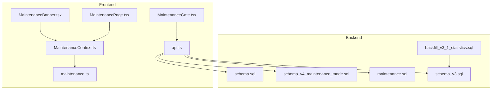
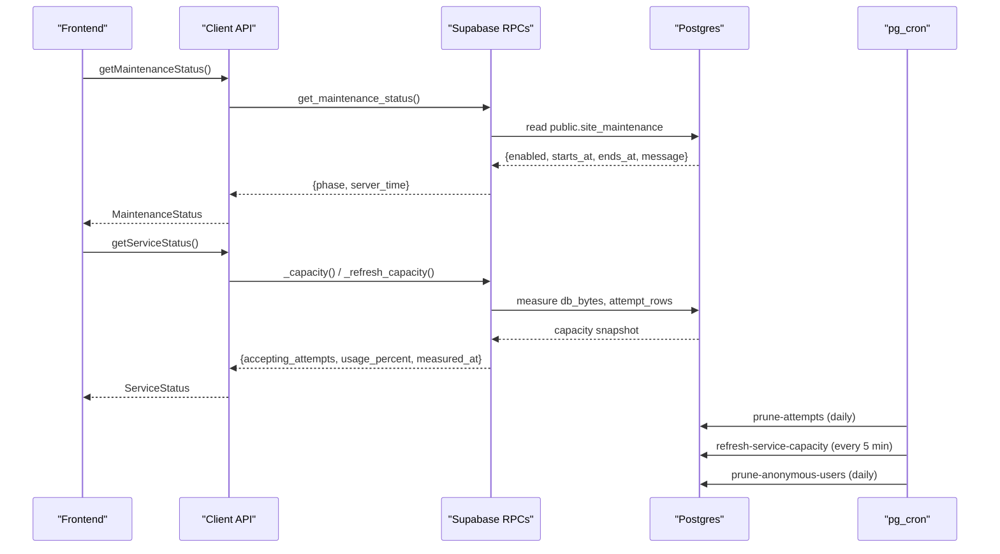
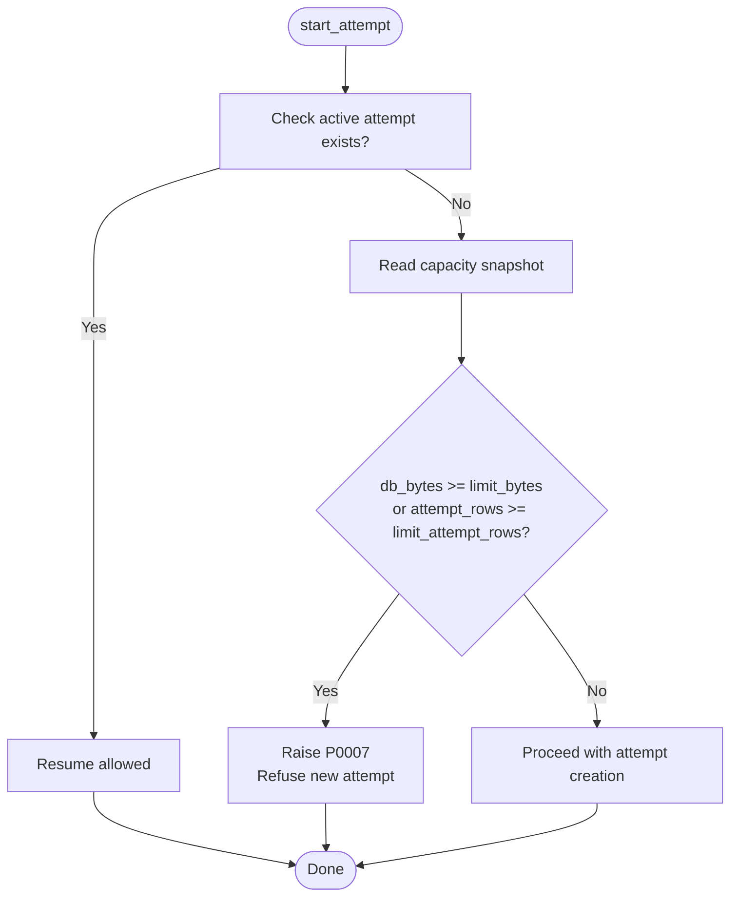
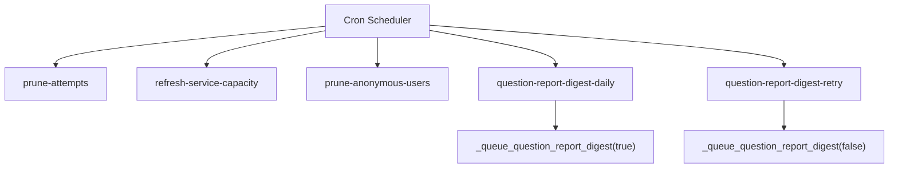
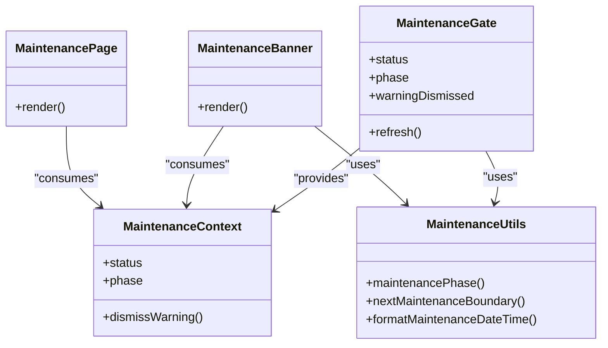
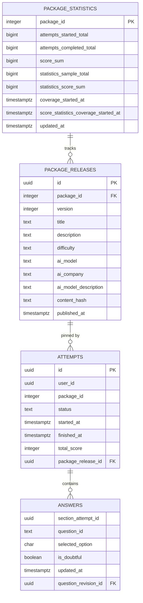
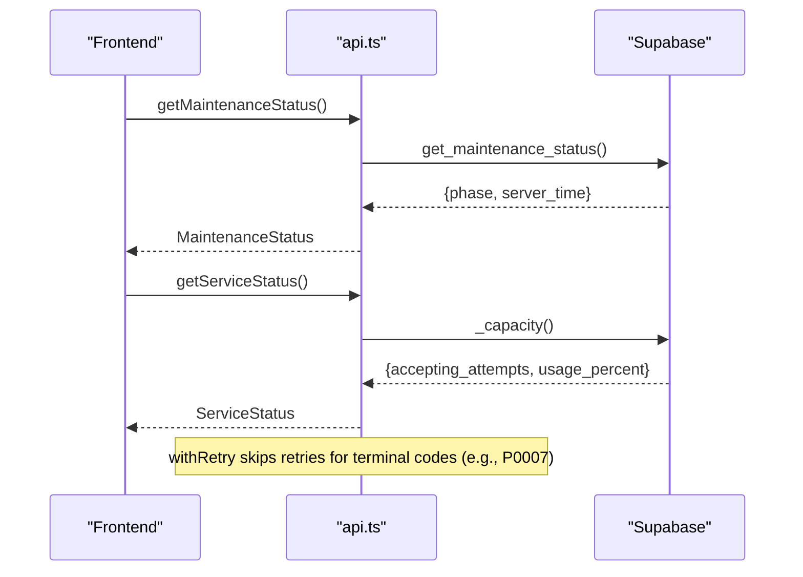
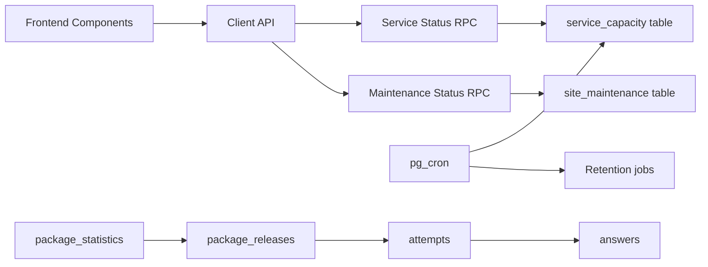

# Monitoring and Maintenance

<cite>
**Referenced Files in This Document**
- [CAPACITY_GUARD.md](file://docs/CAPACITY_GUARD.md)
- [maintenance.sql](file://supabase/maintenance.sql)
- [schema_v4_maintenance_mode.sql](file://supabase/schema_v4_maintenance_mode.sql)
- [MaintenanceBanner.tsx](file://web/src/components/MaintenanceBanner.tsx)
- [MaintenanceGate.tsx](file://web/src/components/MaintenanceGate.tsx)
- [MaintenanceContext.ts](file://web/src/contexts/MaintenanceContext.ts)
- [maintenance.ts](file://web/src/lib/maintenance.ts)
- [MaintenancePage.tsx](file://web/src/pages/MaintenancePage.tsx)
- [api.ts](file://web/src/lib/api.ts)
- [schema.sql](file://supabase/schema.sql)
- [schema_v3.sql](file://supabase/schema_v3.sql)
- [backfill_v3_1_statistics.sql](file://supabase/backfill_v3_1_statistics.sql)
</cite>

## Table of Contents
1. Introduction
2. Project Structure
3. Core Components
4. Architecture Overview
5. Detailed Component Analysis
6. Dependency Analysis
7. Performance Considerations
8. Troubleshooting Guide
9. Conclusion

## Introduction
This document provides operational monitoring and maintenance guidance for the TBS LPDP Try Out system. It covers:
- Application monitoring: error tracking, performance metrics, usage analytics, and health checks
- Scheduled maintenance: frontend maintenance banners and backend maintenance modes
- Capacity guard mechanisms that protect free-tier infrastructure via rate limiting and resource management
- Operational procedures: backup and recovery, scaling considerations, update procedures, and backfill operations for statistics and data migrations
- Troubleshooting common issues and performance optimization techniques

## Project Structure
The monitoring and maintenance capabilities span both backend (Supabase SQL and scheduled jobs) and frontend (React components and utilities):
- Backend capacity and retention are enforced through database tables, functions, and pg_cron jobs
- Frontend displays maintenance windows and adapts behavior based on server status
- Error handling and retry logic are implemented in the client API layer

**Diagram sources**
- [MaintenanceGate.tsx:1-141](file://web/src/components/MaintenanceGate.tsx#L1-L141)
- [MaintenanceBanner.tsx:1-35](file://web/src/components/MaintenanceBanner.tsx#L1-L35)
- [MaintenancePage.tsx:1-32](file://web/src/pages/MaintenancePage.tsx#L1-L32)
- [MaintenanceContext.ts:1-25](file://web/src/contexts/MaintenanceContext.ts#L1-L25)
- [maintenance.ts:1-48](file://web/src/lib/maintenance.ts#L1-L48)
- [api.ts:1-128](file://web/src/lib/api.ts#L1-L128)
- [schema.sql:108-143](file://supabase/schema.sql#L108-L143)
- [schema_v4_maintenance_mode.sql:1-82](file://supabase/schema_v4_maintenance_mode.sql#L1-L82)
- [maintenance.sql:1-167](file://supabase/maintenance.sql#L1-L167)
- [schema_v3.sql:185-200](file://supabase/schema_v3.sql#L185-L200)
- [backfill_v3_1_statistics.sql:1-25](file://supabase/backfill_v3_1_statistics.sql#L1-L25)

**Section sources**
- [CAPACITY_GUARD.md:1-161](file://docs/CAPACITY_GUARD.md#L1-L161)
- [maintenance.sql:1-167](file://supabase/maintenance.sql#L1-L167)
- [schema_v4_maintenance_mode.sql:1-82](file://supabase/schema_v4_maintenance_mode.sql#L1-L82)
- [MaintenanceGate.tsx:1-141](file://web/src/components/MaintenanceGate.tsx#L1-L141)
- [MaintenanceBanner.tsx:1-35](file://web/src/components/MaintenanceBanner.tsx#L1-L35)
- [MaintenancePage.tsx:1-32](file://web/src/pages/MaintenancePage.tsx#L1-L32)
- [MaintenanceContext.ts:1-25](file://web/src/contexts/MaintenanceContext.ts#L1-L25)
- [maintenance.ts:1-48](file://web/src/lib/maintenance.ts#L1-L48)
- [api.ts:1-128](file://web/src/lib/api.ts#L1-L128)
- [schema.sql:108-143](file://supabase/schema.sql#L108-L143)
- [schema_v3.sql:185-200](file://supabase/schema_v3.sql#L185-L200)
- [backfill_v3_1_statistics.sql:1-25](file://supabase/backfill_v3_1_statistics.sql#L1-L25)

## Core Components
- Capacity guard: protects free-tier storage by refusing new attempts when thresholds are reached; allows ongoing attempts to continue
- Scheduled maintenance: frontend banner and gate driven by a backend schedule table with server-derived phase
- Retention and housekeeping: daily cron jobs prune old attempts, anonymous users, and refresh capacity snapshots
- Statistics and analytics: package-level counters and immutable release linkage enable usage analytics and reporting
- Health and error handling: service status probe, maintenance status probe, and terminal error codes prevent retries on fatal conditions

**Section sources**
- [CAPACITY_GUARD.md:1-161](file://docs/CAPACITY_GUARD.md#L1-L161)
- [maintenance.sql:1-167](file://supabase/maintenance.sql#L1-L167)
- [schema_v4_maintenance_mode.sql:1-82](file://supabase/schema_v4_maintenance_mode.sql#L1-L82)
- [schema_v3.sql:185-200](file://supabase/schema_v3.sql#L185-L200)
- [api.ts:97-122](file://web/src/lib/api.ts#L97-L122)

## Architecture Overview
The system enforces capacity limits at the database layer and exposes status to the frontend. The frontend polls maintenance status and renders appropriate UI states. Cron jobs maintain data hygiene and keep capacity measurements fresh.

**Diagram sources**
- [MaintenanceGate.tsx:56-89](file://web/src/components/MaintenanceGate.tsx#L56-L89)
- [schema_v4_maintenance_mode.sql:38-63](file://supabase/schema_v4_maintenance_mode.sql#L38-L63)
- [maintenance.sql:31-51](file://supabase/maintenance.sql#L31-L51)
- [CAPACITY_GUARD.md:60-76](file://docs/CAPACITY_GUARD.md#L60-L76)

## Detailed Component Analysis

### Capacity Guard
- Purpose: Prevent new attempts from being accepted once the database approaches its free-tier limit, while allowing active attempts to complete
- Measurement: Database size and estimated attempt rows are captured into a single-row table and refreshed periodically or on demand
- Enforcement: New attempt creation is blocked with a specific error code; existing sessions continue unaffected
- Client behavior: Terminal error codes are not retried; UI disables start buttons and shows a notice when capacity is full

**Diagram sources**
- [CAPACITY_GUARD.md:81-96](file://docs/CAPACITY_GUARD.md#L81-L96)
- [schema.sql:108-129](file://supabase/schema.sql#L108-L129)
- [api.ts:97-122](file://web/src/lib/api.ts#L97-L122)

**Section sources**
- [CAPACITY_GUARD.md:1-161](file://docs/CAPACITY_GUARD.md#L1-L161)
- [schema.sql:108-143](file://supabase/schema.sql#L108-L143)
- [api.ts:97-122](file://web/src/lib/api.ts#L97-L122)

### Scheduled Maintenance Jobs
- Prune attempts older than 7 days to control growth
- Refresh capacity snapshot every 5 minutes to keep measurements current
- Prune anonymous users older than 60 days without question reports
- Queue daily report digest and retry unsent runs

**Diagram sources**
- [maintenance.sql:31-51](file://supabase/maintenance.sql#L31-L51)
- [maintenance.sql:64-73](file://supabase/maintenance.sql#L64-L73)
- [maintenance.sql:87-152](file://supabase/maintenance.sql#L87-L152)

**Section sources**
- [maintenance.sql:1-167](file://supabase/maintenance.sql#L1-L167)

### Frontend Maintenance Mode
- Server-side schedule defines enabled state, start/end times, and message
- Frontend computes phase (open, warning, maintenance) and renders banners or gates accordingly
- Warning can be dismissed per schedule key; page auto-refreshes near boundaries

**Diagram sources**
- [MaintenanceGate.tsx:1-141](file://web/src/components/MaintenanceGate.tsx#L1-L141)
- [MaintenanceBanner.tsx:1-35](file://web/src/components/MaintenanceBanner.tsx#L1-L35)
- [MaintenancePage.tsx:1-32](file://web/src/pages/MaintenancePage.tsx#L1-L32)
- [MaintenanceContext.ts:1-25](file://web/src/contexts/MaintenanceContext.ts#L1-L25)
- [maintenance.ts:1-48](file://web/src/lib/maintenance.ts#L1-L48)

**Section sources**
- [schema_v4_maintenance_mode.sql:1-82](file://supabase/schema_v4_maintenance_mode.sql#L1-L82)
- [MaintenanceGate.tsx:1-141](file://web/src/components/MaintenanceGate.tsx#L1-L141)
- [MaintenanceBanner.tsx:1-35](file://web/src/components/MaintenanceBanner.tsx#L1-L35)
- [MaintenancePage.tsx:1-32](file://web/src/pages/MaintenancePage.tsx#L1-L32)
- [maintenance.ts:1-48](file://web/src/lib/maintenance.ts#L1-L48)

### Usage Analytics and Statistics
- Package-level counters track attempts started/completed, score sums, and sample totals
- Immutable releases link attempts and answers to specific content versions for accurate analytics
- Backfill script reconstructs retained statistics where necessary

**Diagram sources**
- [schema_v3.sql:185-200](file://supabase/schema_v3.sql#L185-L200)
- [schema_v3.sql:85-100](file://supabase/schema_v3.sql#L85-L100)
- [schema.sql:64-106](file://supabase/schema.sql#L64-L106)

**Section sources**
- [schema_v3.sql:185-200](file://supabase/schema_v3.sql#L185-L200)
- [backfill_v3_1_statistics.sql:1-25](file://supabase/backfill_v3_1_statistics.sql#L1-L25)

### Health Checks and Error Handling
- Maintenance status probe with timeout and polling ensures graceful UI transitions
- Service status probe returns acceptance state and usage percentage
- Terminal error codes (including storage capacity) prevent retries to avoid futile reattempts

**Diagram sources**
- [MaintenanceGate.tsx:56-89](file://web/src/components/MaintenanceGate.tsx#L56-L89)
- [api.ts:77-95](file://web/src/lib/api.ts#L77-L95)
- [api.ts:97-122](file://web/src/lib/api.ts#L97-L122)
- [schema_v4_maintenance_mode.sql:38-63](file://supabase/schema_v4_maintenance_mode.sql#L38-L63)
- [CAPACITY_GUARD.md:98-108](file://docs/CAPACITY_GUARD.md#L98-L108)

**Section sources**
- [api.ts:1-128](file://web/src/lib/api.ts#L1-L128)
- [MaintenanceGate.tsx:1-141](file://web/src/components/MaintenanceGate.tsx#L1-L141)
- [schema_v4_maintenance_mode.sql:38-63](file://supabase/schema_v4_maintenance_mode.sql#L38-L63)
- [CAPACITY_GUARD.md:98-108](file://docs/CAPACITY_GUARD.md#L98-L108)

## Dependency Analysis
- Frontend depends on backend RPCs for maintenance and service status
- Backend relies on pg_cron for scheduled tasks and on schema-defined tables/functions for enforcement
- Statistics depend on immutable releases and answer linkage for accurate aggregation

**Diagram sources**
- [api.ts:77-95](file://web/src/lib/api.ts#L77-L95)
- [schema.sql:108-143](file://supabase/schema.sql#L108-L143)
- [schema_v4_maintenance_mode.sql:15-63](file://supabase/schema_v4_maintenance_mode.sql#L15-L63)
- [maintenance.sql:31-51](file://supabase/maintenance.sql#L31-L51)
- [schema_v3.sql:85-100](file://supabase/schema_v3.sql#L85-L100)
- [schema_v3.sql:185-200](file://supabase/schema_v3.sql#L185-L200)

**Section sources**
- [api.ts:1-128](file://web/src/lib/api.ts#L1-L128)
- [schema.sql:108-143](file://supabase/schema.sql#L108-L143)
- [schema_v4_maintenance_mode.sql:15-63](file://supabase/schema_v4_maintenance_mode.sql#L15-L63)
- [maintenance.sql:31-51](file://supabase/maintenance.sql#L31-L51)
- [schema_v3.sql:85-100](file://supabase/schema_v3.sql#L85-L100)
- [schema_v3.sql:185-200](file://supabase/schema_v3.sql#L185-L200)

## Performance Considerations
- Capacity measurement uses catalog lookups and directory stats to remain O(1) and low cost
- Cron-based refresh avoids per-request measurement overhead while keeping staleness safe
- Retention jobs reduce database growth and index bloat, improving query performance
- Statistics counters minimize expensive aggregations during reads

[No sources needed since this section provides general guidance]

## Troubleshooting Guide
- Storage capacity reached (P0007): Indicates the soft limit has been hit; do not retry. Wait for retention to reclaim space or adjust limits if appropriate
- Maintenance mode active: Frontend will show a maintenance page; check the schedule and wait until the window ends
- Cron job failures: Inspect last run details and messages; verify extensions and permissions
- Anonymous user growth: Ensure pruning job runs; verify no unexpected anonymous sign-ins
- Statistics discrepancies: Use backfill script after schema updates to reconstruct retained statistics

**Section sources**
- [CAPACITY_GUARD.md:98-108](file://docs/CAPACITY_GUARD.md#L98-L108)
- [maintenance.sql:154-167](file://supabase/maintenance.sql#L154-L167)
- [backfill_v3_1_statistics.sql:1-25](file://supabase/backfill_v3_1_statistics.sql#L1-L25)

## Conclusion
The TBS LPDP Try Out system implements robust monitoring and maintenance mechanisms:
- Capacity guard prevents new work under storage pressure while preserving ongoing sessions
- Scheduled maintenance keeps data volumes manageable and informs users via frontend banners and gates
- Statistics and immutable releases support reliable analytics and reporting
- Health probes and terminal error handling ensure resilient user experiences

[No sources needed since this section summarizes without analyzing specific files]