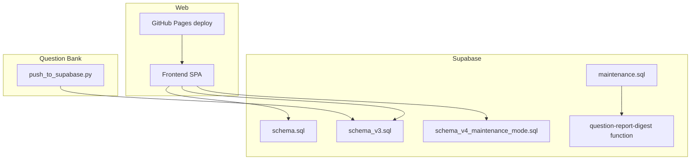
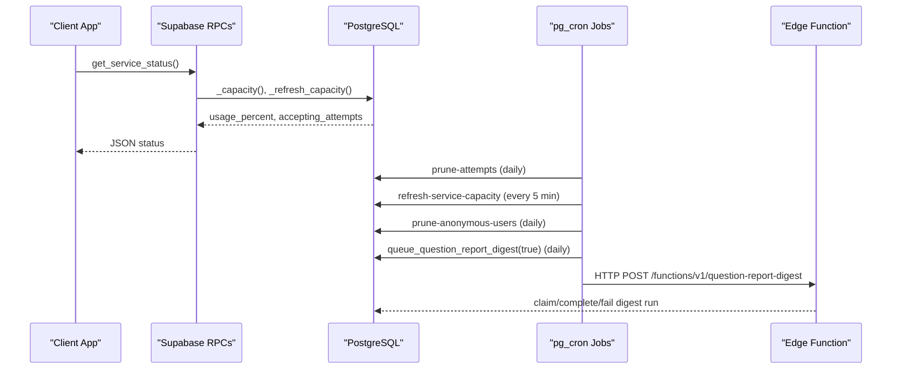
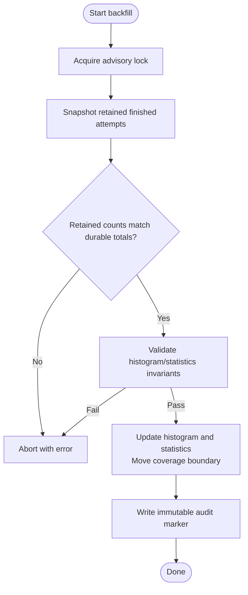
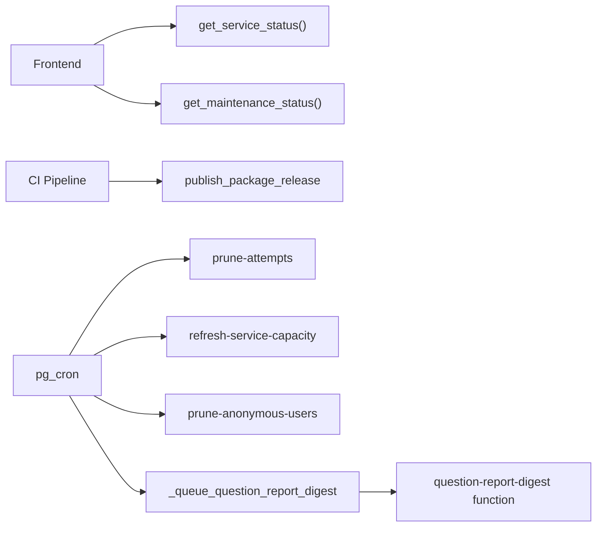

# Operational Procedures

<cite>
**Referenced Files in This Document**
- [supabase/config.toml](file://supabase/config.toml)
- [supabase/schema.sql](file://supabase/schema.sql)
- [supabase/schema_v3.sql](file://supabase/schema_v3.sql)
- [supabase/schema_v4_maintenance_mode.sql](file://supabase/schema_v4_maintenance_mode.sql)
- [supabase/maintenance.sql](file://supabase/maintenance.sql)
- [supabase/backfill_v3_1_statistics.sql](file://supabase/backfill_v3_1_statistics.sql)
- [supabase/functions/question-report-digest/index.ts](file://supabase/functions/question-report-digest/index.ts)
- [web/src/lib/supabase.ts](file://web/src/lib/supabase.ts)
- [web/src/lib/config.ts](file://web/src/lib/config.ts)
- [.github/workflows/deploy-web.yml](file://.github/workflows/deploy-web.yml)
- [questions/generator/push_to_supabase.py](file://questions/generator/push_to_supabase.py)
- [docs/CAPACITY_GUARD.md](file://docs/CAPACITY_GUARD.md)
- [docs/TECHNICAL_REQUIREMENTS_V3_1.md](file://docs/TECHNICAL_REQUIREMENTS_V3_1.md)
- [CONTRIBUTING.md](file://CONTRIBUTING.md)
</cite>

## Table of Contents
1. Introduction
2. Project Structure
3. Core Components
4. Architecture Overview
5. Detailed Component Analysis
6. Dependency Analysis
7. Performance Considerations
8. Troubleshooting Guide
9. Conclusion
10. Appendices

## Introduction
This document provides operational procedures for maintaining the TBS LPDP Try Out system. It covers backup and recovery strategies, scaling considerations, update procedures, data backfill operations, disaster recovery, emergency maintenance protocols, monitoring and alerting setup, and automated recovery mechanisms. The guidance is grounded in the repository’s schema definitions, scheduled jobs, deployment workflows, and technical requirements.

## Project Structure
The system consists of:
- Supabase backend with versioned schemas, RPCs, RLS policies, and scheduled maintenance jobs.
- Frontend SPA deployed to GitHub Pages with a published question-bank artifact.
- Question bank tooling that publishes immutable package releases to Supabase.
- Edge Functions for daily report digest delivery.

**Diagram sources**
- [supabase/schema.sql:1-12](file://supabase/schema.sql#L1-L12)
- [supabase/schema_v3.sql:1-12](file://supabase/schema_v3.sql#L1-L12)
- [supabase/schema_v4_maintenance_mode.sql:1-11](file://supabase/schema_v4_maintenance_mode.sql#L1-L11)
- [supabase/maintenance.sql:1-16](file://supabase/maintenance.sql#L1-L16)
- [supabase/functions/question-report-digest/index.ts:27-38](file://supabase/functions/question-report-digest/index.ts#L27-L38)
- [.github/workflows/deploy-web.yml:97-116](file://.github/workflows/deploy-web.yml#L97-L116)
- [questions/generator/push_to_supabase.py:107-119](file://questions/generator/push_to_supabase.py#L107-L119)

**Section sources**
- [supabase/schema.sql:1-12](file://supabase/schema.sql#L1-L12)
- [supabase/schema_v3.sql:1-12](file://supabase/schema_v3.sql#L1-L12)
- [supabase/schema_v4_maintenance_mode.sql:1-11](file://supabase/schema_v4_maintenance_mode.sql#L1-L11)
- [supabase/maintenance.sql:1-16](file://supabase/maintenance.sql#L1-L16)
- [.github/workflows/deploy-web.yml:97-116](file://.github/workflows/deploy-web.yml#L97-L116)
- [questions/generator/push_to_supabase.py:107-119](file://questions/generator/push_to_supabase.py#L107-L119)

## Core Components
- Database schema and RPCs:
  - Base schema defines core tables, RLS, and RPCs for exam flow and capacity guard.
  - v3 adds immutable releases, statistics, histogram, median computation, and catalogue RPCs.
  - v4 adds scheduled frontend maintenance mode and status RPC.
- Scheduled maintenance:
  - Prunes old attempts and anonymous users.
  - Refreshes service capacity snapshot.
  - Queues and retries daily question-report digest emails.
- Deployment and updates:
  - CI builds the SPA, validates flavors, publishes the question-bank artifact, and deploys to GitHub Pages.
  - Optional push of immutable package releases to Supabase via a Python publisher.
- Monitoring and alerts:
  - Capacity guard exposes usage percentage and acceptance state via an RPC.
  - Maintenance window status exposed via an RPC.
  - Daily digest pipeline with retry and manual attention states.

**Section sources**
- [supabase/schema.sql:119-142](file://supabase/schema.sql#L119-L142)
- [supabase/schema.sql:341-415](file://supabase/schema.sql#L341-L415)
- [supabase/schema_v3.sql:185-237](file://supabase/schema_v3.sql#L185-L237)
- [supabase/schema_v3.sql:574-582](file://supabase/schema_v3.sql#L574-L582)
- [supabase/schema_v4_maintenance_mode.sql:15-63](file://supabase/schema_v4_maintenance_mode.sql#L15-L63)
- [supabase/maintenance.sql:31-73](file://supabase/maintenance.sql#L31-L73)
- [supabase/maintenance.sql:142-152](file://supabase/maintenance.sql#L142-L152)
- [.github/workflows/deploy-web.yml:24-133](file://.github/workflows/deploy-web.yml#L24-L133)
- [questions/generator/push_to_supabase.py:107-119](file://questions/generator/push_to_supabase.py#L107-L119)

## Architecture Overview
The runtime architecture centers on Supabase as the database and serverless functions layer, with a client-side SPA consuming RPCs. Operational automation includes pg_cron jobs for retention, capacity refresh, and email digest queuing/retry.

**Diagram sources**
- [supabase/schema.sql:395-415](file://supabase/schema.sql#L395-L415)
- [supabase/maintenance.sql:31-73](file://supabase/maintenance.sql#L31-L73)
- [supabase/maintenance.sql:142-152](file://supabase/maintenance.sql#L142-L152)
- [supabase/functions/question-report-digest/index.ts:27-69](file://supabase/functions/question-report-digest/index.ts#L27-L69)

## Detailed Component Analysis

### Backup and Recovery Strategy
- Use Supabase project backups and point-in-time recovery (PITR) through the Supabase dashboard or CLI to restore the entire database to a known good state.
- For critical data preservation outside PITR windows:
  - Export key metadata and configuration:
    - Project config: [supabase/config.toml:1-5](file://supabase/config.toml#L1-L5)
    - Service capacity limits and thresholds: [supabase/schema.sql:119-129](file://supabase/schema.sql#L119-L129)
    - Maintenance window schedule: [supabase/schema_v4_maintenance_mode.sql:15-30](file://supabase/schema_v4_maintenance_mode.sql#L15-L30)
  - Snapshot aggregate-only audit markers for backfills:
    - Backfill runs table: [supabase/schema_v3.sql:232-236](file://supabase/schema_v3.sql#L232-L236)
  - Preserve question bank artifacts:
    - Published bank manifest and bundle are built and served by CI: [deploy-web.yml:97-116](file://.github/workflows/deploy-web.yml#L97-L116)
- Restore procedure outline:
  - Stop new deployments and disable maintenance windows if necessary.
  - Restore from PITR to target timestamp using Supabase tools.
  - Re-apply application schemas in order if restoring to a pre-migration state: [CONTRIBUTING.md:57-72](file://CONTRIBUTING.md#L57-L72).
  - Re-run any required one-time backfills after schema alignment: [backfill_v3_1_statistics.sql:19-23](file://supabase/backfill_v3_1_statistics.sql#L19-L23).
  - Verify capacity guard and maintenance status RPCs return expected values.

**Section sources**
- [supabase/config.toml:1-5](file://supabase/config.toml#L1-L5)
- [supabase/schema.sql:119-129](file://supabase/schema.sql#L119-L129)
- [supabase/schema_v4_maintenance_mode.sql:15-30](file://supabase/schema_v4_maintenance_mode.sql#L15-L30)
- [supabase/schema_v3.sql:232-236](file://supabase/schema_v3.sql#L232-L236)
- [.github/workflows/deploy-web.yml:97-116](file://.github/workflows/deploy-web.yml#L97-L116)
- [CONTRIBUTING.md:57-72](file://CONTRIBUTING.md#L57-L72)
- [supabase/backfill_v3_1_statistics.sql:19-23](file://supabase/backfill_v3_1_statistics.sql#L19-L23)

### Scaling Considerations
- Database growth management:
  - Retention policy prunes attempts older than 7 days and anonymous users older than 60 days (unless they have reports): [maintenance.sql:31-73](file://supabase/maintenance.sql#L31-L73).
  - Per-attempt caps bound event log growth: [schema.sql:241-260](file://supabase/schema.sql#L241-L260).
- Storage optimization techniques:
  - Capacity guard enforces soft ceilings; adjust limits without redeploy: [CAPACITY_GUARD.md:54-58](file://docs/CAPACITY_GUARD.md#L54-L58).
  - Use vacuum/full vacuum only when necessary due to locking implications: [CAPACITY_GUARD.md:156-160](file://docs/CAPACITY_GUARD.md#L156-L160).
- Performance tuning for increasing user loads:
  - Capacity measurement uses O(1) catalog stats; cron warms the snapshot every 5 minutes: [schema.sql:262-309](file://supabase/schema.sql#L262-L309), [maintenance.sql:47-51](file://supabase/maintenance.sql#L47-L51).
  - Median calculation scans at most 61 score buckets per package: [schema_v3.sql:238-263](file://supabase/schema_v3.sql#L238-L263).
  - Ensure autovacuum runs regularly so reltuples estimates remain accurate: [CAPACITY_GUARD.md:48-52](file://docs/CAPACITY_GUARD.md#L48-L52).

**Section sources**
- [supabase/maintenance.sql:31-73](file://supabase/maintenance.sql#L31-L73)
- [supabase/schema.sql:241-260](file://supabase/schema.sql#L241-L260)
- [docs/CAPACITY_GUARD.md:48-58](file://docs/CAPACITY_GUARD.md#L48-L58)
- [docs/CAPACITY_GUARD.md:156-160](file://docs/CAPACITY_GUARD.md#L156-L160)
- [supabase/schema.sql:262-309](file://supabase/schema.sql#L262-L309)
- [supabase/maintenance.sql:47-51](file://supabase/maintenance.sql#L47-L51)
- [supabase/schema_v3.sql:238-263](file://supabase/schema_v3.sql#L238-L263)

### Update Procedures
- Schema migration order (must be applied in sequence):
  - schema.sql → schema_v2_reports.sql → schema_v3.sql → schema_v4_maintenance_mode.sql → maintenance.sql: [CONTRIBUTING.md:57-72](file://CONTRIBUTING.md#L57-L72).
- Asset updates:
  - Build and publish the question-bank artifact during CI: [deploy-web.yml:97-116](file://.github/workflows/deploy-web.yml#L97-L116).
  - Publish immutable package releases to Supabase using the publisher script: [questions/generator/push_to_supabase.py:107-119](file://questions/generator/push_to_supabase.py#L107-L119).
- Rollback strategy for failed deployments:
  - Frontend: Re-deploy previous commit to GitHub Pages (CI preserves newest build; concurrency cancels in-progress): [deploy-web.yml:19-23](file://.github/workflows/deploy-web.yml#L19-L23).
  - Backend: If a schema change breaks behavior, revert the schema commit and re-apply the correct ordered set; ensure maintenance.sql is reapplied last: [CONTRIBUTING.md:57-72](file://CONTRIBUTING.md#L57-L72).
  - Data migrations: Use idempotent scripts; verify no-op behavior on re-run where applicable (e.g., backfill returns already_applied): [schema_v3.sql:366-386](file://supabase/schema_v3.sql#L366-L386).

**Section sources**
- [CONTRIBUTING.md:57-72](file://CONTRIBUTING.md#L57-L72)
- [.github/workflows/deploy-web.yml:19-23](file://.github/workflows/deploy-web.yml#L19-L23)
- [.github/workflows/deploy-web.yml:97-116](file://.github/workflows/deploy-web.yml#L97-L116)
- [questions/generator/push_to_supabase.py:107-119](file://questions/generator/push_to_supabase.py#L107-L119)
- [supabase/schema_v3.sql:366-386](file://supabase/schema_v3.sql#L366-L386)

### Data Backfill Operations
- Purpose:
  - Recover qualified mean/median from retained pre-v3.1 attempts while enforcing completeness and invariants: [TECHNICAL_REQUIREMENTS_V3_1.md:283-304](file://docs/TECHNICAL_REQUIREMENTS_V3_1.md#L283-L304).
- Execution:
  - Apply revised schema_v3.sql and v4 maintenance definitions, then run the backfill script: [backfill_v3_1_statistics.sql:19-23](file://supabase/backfill_v3_1_statistics.sql#L19-L23).
  - The function serializes via advisory lock, locks aggregates, snapshots retained attempts, validates invariants, updates histogram and statistics, moves coverage boundary, and records an immutable audit marker: [schema_v3.sql:366-531](file://supabase/schema_v3.sql#L366-L531).
  - Re-running returns already_applied without changing data: [schema_v3.sql:377-386](file://supabase/schema_v3.sql#L377-L386).
- Validation:
  - Completeness check ensures retained finished rows match durable completion totals; aborts otherwise: [schema_v3.sql:400-414](file://supabase/schema_v3.sql#L400-L414).
  - Histogram/statistics invariant checks before and after mutation: [schema_v3.sql:416-430](file://supabase/schema_v3.sql#L416-L430), [schema_v3.sql:506-520](file://supabase/schema_v3.sql#L506-L520).

**Diagram sources**
- [supabase/schema_v3.sql:366-531](file://supabase/schema_v3.sql#L366-L531)
- [supabase/backfill_v3_1_statistics.sql:19-23](file://supabase/backfill_v3_1_statistics.sql#L19-L23)

**Section sources**
- [docs/TECHNICAL_REQUIREMENTS_V3_1.md:283-304](file://docs/TECHNICAL_REQUIREMENTS_V3_1.md#L283-L304)
- [supabase/backfill_v3_1_statistics.sql:19-23](file://supabase/backfill_v3_1_statistics.sql#L19-L23)
- [supabase/schema_v3.sql:366-531](file://supabase/schema_v3.sql#L366-L531)

### Disaster Recovery Procedures
- Database restoration:
  - Use Supabase PITR to restore to a consistent point in time.
  - After restore, re-apply application schemas in order if needed: [CONTRIBUTING.md:57-72](file://CONTRIBUTING.md#L57-L72).
  - Re-run any required backfills post-schema alignment: [backfill_v3_1_statistics.sql:19-23](file://supabase/backfill_v3_1_statistics.sql#L19-L23).
- Frontend recovery:
  - Re-deploy previous commit to GitHub Pages; CI concurrency ensures only the newest remains: [deploy-web.yml:19-23](file://.github/workflows/deploy-web.yml#L19-L23).
- Configuration recovery:
  - Restore project config and environment variables (Supabase URL, keys, Turnstile site key): [web/src/lib/config.ts:22-43](file://web/src/lib/config.ts#L22-L43), [web/src/lib/supabase.ts:9-13](file://web/src/lib/supabase.ts#L9-L13).
- Verification:
  - Confirm capacity guard RPC returns expected usage and acceptance state: [schema.sql:395-415](file://supabase/schema.sql#L395-L415).
  - Confirm maintenance window status RPC reflects current phase: [schema_v4_maintenance_mode.sql:38-63](file://supabase/schema_v4_maintenance_mode.sql#L38-L63).

**Section sources**
- [CONTRIBUTING.md:57-72](file://CONTRIBUTING.md#L57-L72)
- [supabase/backfill_v3_1_statistics.sql:19-23](file://supabase/backfill_v3_1_statistics.sql#L19-L23)
- [.github/workflows/deploy-web.yml:19-23](file://.github/workflows/deploy-web.yml#L19-L23)
- [web/src/lib/config.ts:22-43](file://web/src/lib/config.ts#L22-L43)
- [web/src/lib/supabase.ts:9-13](file://web/src/lib/supabase.ts#L9-L13)
- [supabase/schema.sql:395-415](file://supabase/schema.sql#L395-L415)
- [supabase/schema_v4_maintenance_mode.sql:38-63](file://supabase/schema_v4_maintenance_mode.sql#L38-L63)

### Emergency Maintenance Protocols
- Schedule maintenance windows without redeploying the frontend:
  - Update the singleton maintenance record to enable a window with start/end timestamps and message: [schema_v4_maintenance_mode.sql:66-81](file://supabase/schema_v4_maintenance_mode.sql#L66-L81).
- Cancel or disable maintenance:
  - Set enabled to false and update timestamp: [schema_v4_maintenance_mode.sql:77-81](file://supabase/schema_v4_maintenance_mode.sql#L77-L81).
- Monitor maintenance phase:
  - Clients call get_maintenance_status() to determine open/warning/maintenance phases: [schema_v4_maintenance_mode.sql:38-63](file://supabase/schema_v4_maintenance_mode.sql#L38-L63).

**Section sources**
- [supabase/schema_v4_maintenance_mode.sql:38-81](file://supabase/schema_v4_maintenance_mode.sql#L38-L81)

### Operational Runbooks for Common Scenarios
- Capacity reached (new attempts blocked):
  - Diagnose usage via get_service_status(): [schema.sql:395-415](file://supabase/schema.sql#L395-L415).
  - Wait for retention to reclaim space or adjust limit_bytes if plan allows: [CAPACITY_GUARD.md:54-58](file://docs/CAPACITY_GUARD.md#L54-L58).
  - Force immediate measurement if needed: [CAPACITY_GUARD.md:146-147](file://docs/CAPACITY_GUARD.md#L146-L147).
- Digest email not sent:
  - Check job runs and failures: [maintenance.sql:154-158](file://supabase/maintenance.sql#L154-L158).
  - Inspect edge function logs and secrets configuration: [index.ts:14-25](file://supabase/functions/question-report-digest/index.ts#L14-L25), [index.ts:51-57](file://supabase/functions/question-report-digest/index.ts#L51-L57).
- Failed deployment rollback:
  - Re-deploy previous commit; CI cancels in-progress pages deploy: [deploy-web.yml:19-23](file://.github/workflows/deploy-web.yml#L19-L23).

**Section sources**
- [supabase/schema.sql:395-415](file://supabase/schema.sql#L395-L415)
- [docs/CAPACITY_GUARD.md:54-58](file://docs/CAPACITY_GUARD.md#L54-L58)
- [docs/CAPACITY_GUARD.md:146-147](file://docs/CAPACITY_GUARD.md#L146-L147)
- [supabase/maintenance.sql:154-158](file://supabase/maintenance.sql#L154-L158)
- [supabase/functions/question-report-digest/index.ts:14-25](file://supabase/functions/question-report-digest/index.ts#L14-L25)
- [supabase/functions/question-report-digest/index.ts:51-57](file://supabase/functions/question-report-digest/index.ts#L51-L57)
- [.github/workflows/deploy-web.yml:19-23](file://.github/workflows/deploy-web.yml#L19-L23)

## Dependency Analysis
Operational dependencies include:
- Frontend depends on Supabase RPCs for service status and maintenance status.
- CI depends on repository variables for Supabase URLs and keys to build and optionally publish packages.
- Maintenance jobs depend on pg_cron and Vault secrets for digest delivery.

**Diagram sources**
- [supabase/schema.sql:395-415](file://supabase/schema.sql#L395-L415)
- [supabase/schema_v4_maintenance_mode.sql:38-63](file://supabase/schema_v4_maintenance_mode.sql#L38-L63)
- [supabase/maintenance.sql:31-73](file://supabase/maintenance.sql#L31-L73)
- [supabase/maintenance.sql:142-152](file://supabase/maintenance.sql#L142-L152)
- [supabase/functions/question-report-digest/index.ts:27-69](file://supabase/functions/question-report-digest/index.ts#L27-L69)
- [questions/generator/push_to_supabase.py:107-119](file://questions/generator/push_to_supabase.py#L107-L119)

**Section sources**
- [supabase/schema.sql:395-415](file://supabase/schema.sql#L395-L415)
- [supabase/schema_v4_maintenance_mode.sql:38-63](file://supabase/schema_v4_maintenance_mode.sql#L38-L63)
- [supabase/maintenance.sql:31-73](file://supabase/maintenance.sql#L31-L73)
- [supabase/maintenance.sql:142-152](file://supabase/maintenance.sql#L142-L152)
- [supabase/functions/question-report-digest/index.ts:27-69](file://supabase/functions/question-report-digest/index.ts#L27-L69)
- [questions/generator/push_to_supabase.py:107-119](file://questions/generator/push_to_supabase.py#L107-L119)

## Performance Considerations
- Keep capacity measurements fresh via cron; fallback self-healing ensures correctness even without cron: [schema.sql:262-309](file://supabase/schema.sql#L262-L309), [maintenance.sql:47-51](file://supabase/maintenance.sql#L47-L51).
- Avoid heavy count(*) queries; rely on planner estimates for capacity metrics: [CAPACITY_GUARD.md:48-52](file://docs/CAPACITY_GUARD.md#L48-L52).
- Median computation bounded by fixed histogram size: [schema_v3.sql:238-263](file://supabase/schema_v3.sql#L238-L263).
- Event log capped per section attempt to prevent unbounded growth: [schema.sql:241-260](file://supabase/schema.sql#L241-L260).

[No sources needed since this section provides general guidance]

## Troubleshooting Guide
- Capacity issues:
  - Query service capacity and force refresh: [CAPACITY_GUARD.md:139-147](file://docs/CAPACITY_GUARD.md#L139-L147).
  - Identify largest tables: [CAPACITY_GUARD.md:149-153](file://docs/CAPACITY_GUARD.md#L149-L153).
- Digest delivery failures:
  - Check job run details and errors: [maintenance.sql:154-158](file://supabase/maintenance.sql#L154-L158).
  - Validate edge function secrets and provider response handling: [index.ts:14-25](file://supabase/functions/question-report-digest/index.ts#L14-L25), [index.ts:71-117](file://supabase/functions/question-report-digest/index.ts#L71-L117).
- Maintenance window misconfiguration:
  - Review constraints and phase logic: [schema_v4_maintenance_mode.sql:15-63](file://supabase/schema_v4_maintenance_mode.sql#L15-L63).

**Section sources**
- [docs/CAPACITY_GUARD.md:139-153](file://docs/CAPACITY_GUARD.md#L139-L153)
- [supabase/maintenance.sql:154-158](file://supabase/maintenance.sql#L154-L158)
- [supabase/functions/question-report-digest/index.ts:14-25](file://supabase/functions/question-report-digest/index.ts#L14-L25)
- [supabase/functions/question-report-digest/index.ts:71-117](file://supabase/functions/question-report-digest/index.ts#L71-L117)
- [supabase/schema_v4_maintenance_mode.sql:15-63](file://supabase/schema_v4_maintenance_mode.sql#L15-L63)

## Conclusion
The TBS LPDP Try Out system incorporates robust operational controls: capacity guards, scheduled retention, immutable releases, and a fail-closed backfill process. Deployments are automated with safeguards, and maintenance windows can be managed without frontend changes. Following the documented procedures ensures reliable backups, scalable operations, safe updates, and effective recovery.

[No sources needed since this section summarizes without analyzing specific files]

## Appendices

### Version Update Procedure Checklist
- Apply schemas in order: [CONTRIBUTING.md:57-72](file://CONTRIBUTING.md#L57-L72).
- Re-apply maintenance.sql last: [CONTRIBUTING.md:70-72](file://CONTRIBUTING.md#L70-L72).
- Publish question-bank artifact and optional package releases: [deploy-web.yml:97-116](file://.github/workflows/deploy-web.yml#L97-L116), [questions/generator/push_to_supabase.py:107-119](file://questions/generator/push_to_supabase.py#L107-L119).
- Verify RPCs: [schema.sql:395-415](file://supabase/schema.sql#L395-L415), [schema_v4_maintenance_mode.sql:38-63](file://supabase/schema_v4_maintenance_mode.sql#L38-L63).

**Section sources**
- [CONTRIBUTING.md:57-72](file://CONTRIBUTING.md#L57-L72)
- [.github/workflows/deploy-web.yml:97-116](file://.github/workflows/deploy-web.yml#L97-L116)
- [questions/generator/push_to_supabase.py:107-119](file://questions/generator/push_to_supabase.py#L107-L119)
- [supabase/schema.sql:395-415](file://supabase/schema.sql#L395-L415)
- [supabase/schema_v4_maintenance_mode.sql:38-63](file://supabase/schema_v4_maintenance_mode.sql#L38-L63)