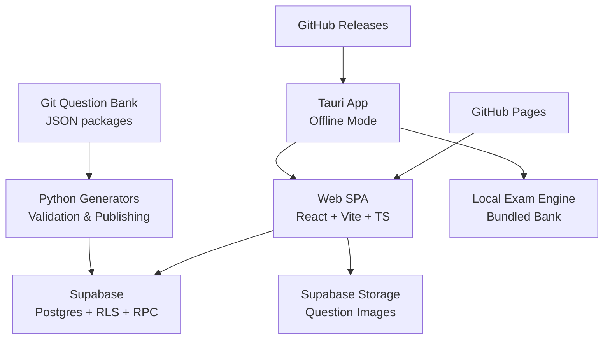
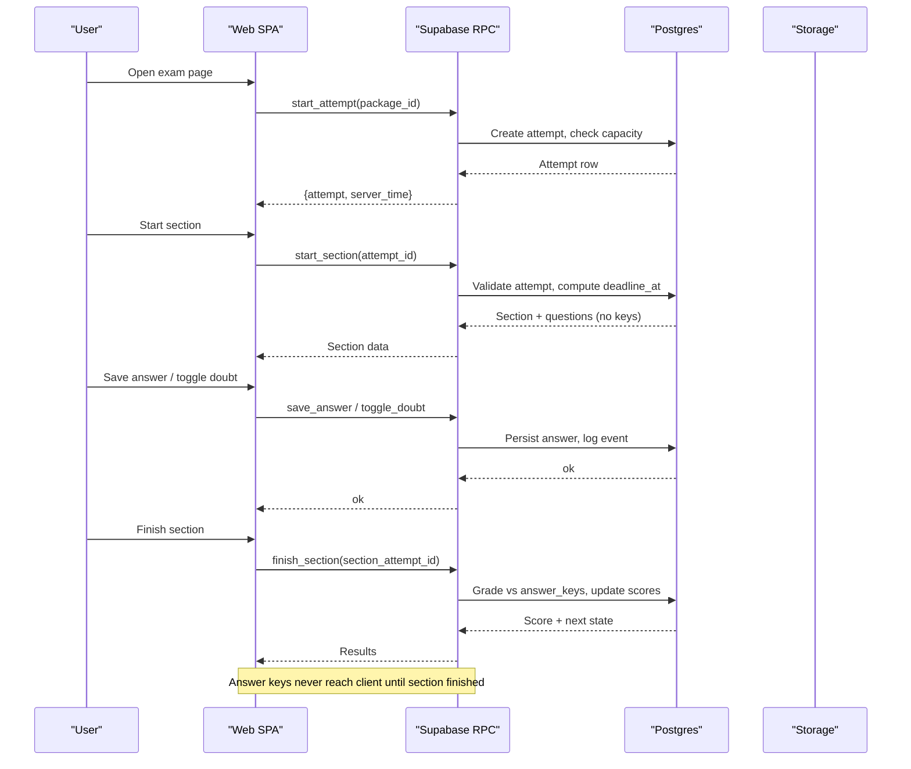
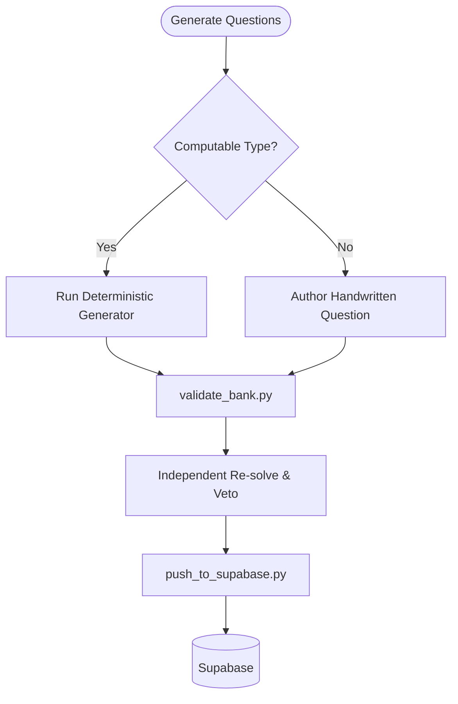
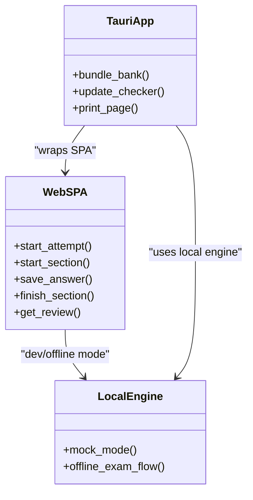
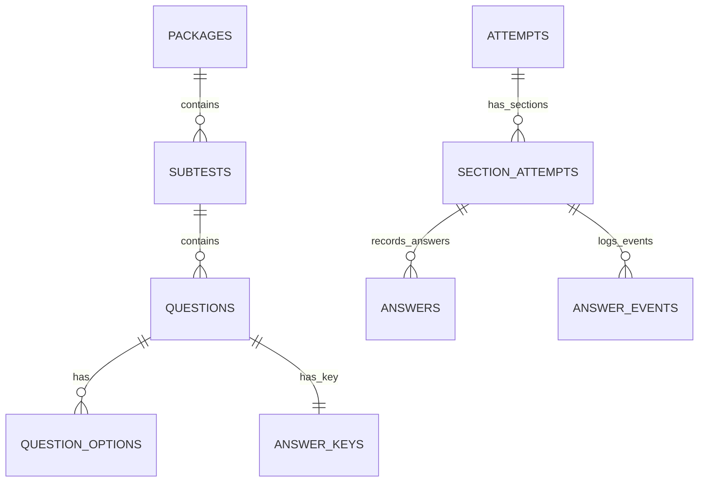
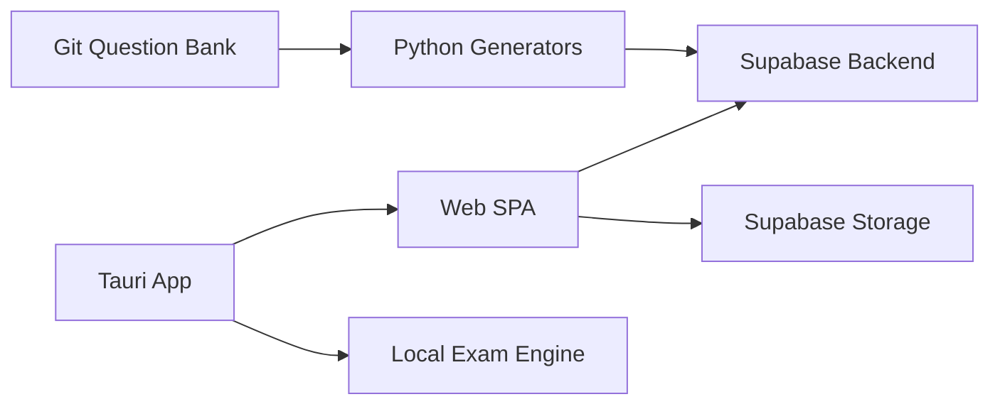

# Project Overview

<cite>
**Referenced Files in This Document**
- [README.md](file://README.md)
- [web/README.md](file://web/README.md)
- [questions/generator/README.md](file://questions/generator/README.md)
- [supabase/schema.sql](file://supabase/schema.sql)
- [questions/schema.json](file://questions/schema.json)
- [docs/TECHNICAL_REQUIREMENTS.md](file://docs/TECHNICAL_REQUIREMENTS.md)
</cite>

## Table of Contents
1. [Introduction](#introduction)
2. [Project Structure](#project-structure)
3. [Core Components](#core-components)
4. [Architecture Overview](#architecture-overview)
5. [Detailed Component Analysis](#detailed-component-analysis)
6. [Dependency Analysis](#dependency-analysis)
7. [Performance Considerations](#performance-considerations)
8. [Troubleshooting Guide](#troubleshooting-guide)
9. [Conclusion](#conclusion)

## Introduction
TBS LPDP Try Out is a free, browser-based practice testing platform for the Indonesian Tes Bakat Skolastik (TBS) exam administered by LPDP. It reproduces the timed, section-by-section PUSMENDIK CBT experience and provides scores, answer reviews, and an explanation for every option once a section ends. The project is independent and not affiliated with LPDP or PUSMENDIK.

Key features:
- Timed section testing with server-enforced deadlines and auto-submit on timeout
- Server-authoritative grading and answer-key protection
- Offline capabilities via a Tauri desktop app that bundles the same SPA and question bank
- Multi-platform support: web (GitHub Pages), desktop (Windows, macOS, Linux), and Android
- Saved answers, doubt marks, navigation, refresh recovery, and revision-pinned attempts
- Per-section and total results with full Pembahasan (explanations) for every option
- Capacity controls, rate limits, retention jobs, scheduled maintenance screen, and Turnstile protection for anonymous sign-in

Exam format:
- Three subtests taken in order: Verbal (23 questions, 30 minutes), Quantitative (25 questions, 40 minutes), Problem-Solving (12 questions, 20 minutes)
- Total: 60 questions, 90 minutes
- Scoring: +5 per correct answer; wrong or unanswered score 0; no negative marking; maximum total score 300
- Benchmarks are practice references, not official selection thresholds

**Section sources**
- [README.md:1-26](file://README.md#L1-L26)
- [docs/TECHNICAL_REQUIREMENTS.md:52-76](file://docs/TECHNICAL_REQUIREMENTS.md#L52-L76)

## Project Structure
The repository is organized into clear layers:
- Frontend SPA: React + Vite + TypeScript deployed to GitHub Pages
- Backend: Supabase (Postgres, Auth, Storage, RPC functions)
- Question bank: Git-versioned JSON packages with deterministic Python generators
- Desktop app: Tauri wrapper enabling offline usage and local exam engine
- Documentation and CI: technical requirements, deployment workflows, and release automation

**Diagram sources**
- [README.md:40-70](file://README.md#L40-L70)
- [web/README.md:1-26](file://web/README.md#L1-L26)

**Section sources**
- [README.md:87-101](file://README.md#L87-L101)
- [web/README.md:1-26](file://web/README.md#L1-L26)

## Core Components
- Question bank and generators: Deterministic scripts generate computable question types and validate the entire bank before publishing. Each package contains verbal, quantitative, and problem-solving questions with images and explanations.
- Web SPA: Single-page application serving the exam UI, handling user interactions, optimistic saves, countdown timers derived from server deadlines, and review pages with explanations.
- Supabase backend: Postgres schema with Row Level Security, RPC functions for secure exam logic, storage for images, and capacity guard mechanisms to protect free-tier limits.
- Tauri desktop app: Wraps the SPA to run offline with a bundled question bank and local exam engine, supporting updates and cross-platform installers.

**Section sources**
- [questions/generator/README.md:1-33](file://questions/generator/README.md#L1-L33)
- [web/README.md:1-26](file://web/README.md#L1-L26)
- [supabase/schema.sql:1-12](file://supabase/schema.sql#L1-L12)

## Architecture Overview
The system uses a clean separation between content authoring, frontend delivery, and trusted backend logic:

**Diagram sources**
- [supabase/schema.sql:341-493](file://supabase/schema.sql#L341-L493)
- [supabase/schema.sql:551-657](file://supabase/schema.sql#L551-L657)

**Section sources**
- [README.md:40-70](file://README.md#L40-L70)
- [supabase/schema.sql:131-182](file://supabase/schema.sql#L131-L182)

## Detailed Component Analysis

### Question Bank and Generators
The question bank is version-controlled in Git and structured by package and subtest. Each question follows a strict JSON schema with five options, one correct answer, and explanations for all options. Deterministic Python generators ensure computable types produce verified answers rather than guessed ones. Validation scripts enforce blueprint counts, image references, and schema conformance before publishing.

**Diagram sources**
- [questions/generator/README.md:9-23](file://questions/generator/README.md#L9-L23)
- [questions/schema.json:1-98](file://questions/schema.json#L1-L98)

**Section sources**
- [questions/generator/README.md:1-33](file://questions/generator/README.md#L1-L33)
- [questions/schema.json:1-98](file://questions/schema.json#L1-L98)

### Web SPA and Offline App
The SPA runs on GitHub Pages and supports three build flavors: web production, dev mock, and offline app. The offline flavor bundles the question bank and local exam engine, enabling fully offline usage without accounts or internet. The Tauri wrapper provides desktop and Android builds with update mechanisms and platform-specific features like printing and signing.

**Diagram sources**
- [web/README.md:1-26](file://web/README.md#L1-L26)
- [web/README.md:190-224](file://web/README.md#L190-L224)

**Section sources**
- [web/README.md:1-26](file://web/README.md#L1-L26)
- [web/README.md:190-224](file://web/README.md#L190-L224)

### Supabase Backend and Security
The backend enforces all critical exam logic through Postgres functions with security definer privileges. Row Level Security ensures users can only access their own data. Answer keys are never readable by clients during active sections, and grading happens server-side. Capacity guards protect against free-tier limits, and event logging provides audit trails while being bounded to prevent abuse.

**Diagram sources**
- [supabase/schema.sql:16-106](file://supabase/schema.sql#L16-L106)

**Section sources**
- [supabase/schema.sql:131-182](file://supabase/schema.sql#L131-L182)
- [supabase/schema.sql:185-337](file://supabase/schema.sql#L185-L337)

## Dependency Analysis
The system has clear dependency boundaries:
- Frontend depends on Supabase RPCs for all exam operations
- Backend depends on Postgres functions for trusted logic
- Question bank is the source of truth, published to Supabase via scripts
- Tauri app depends on the same SPA codebase but with offline capabilities

**Diagram sources**
- [README.md:40-70](file://README.md#L40-L70)
- [web/README.md:1-26](file://web/README.md#L1-L26)

**Section sources**
- [README.md:40-70](file://README.md#L40-L70)
- [web/README.md:1-26](file://web/README.md#L1-L26)

## Performance Considerations
The system is designed for free-tier constraints:
- O(1) capacity measurement using database statistics
- Event log capping to prevent unbounded growth
- Optimistic UI with retry logic for better user experience
- Cached service status to avoid frequent capacity checks
- Efficient queries using indexes and planner estimates

[No sources needed since this section provides general guidance]

## Troubleshooting Guide
Common issues and solutions:
- **Capacity reached**: When storage limits are approached, new attempts are blocked but existing attempts continue working
- **Network issues**: Offline mode available through Tauri app for uninterrupted practice
- **Maintenance mode**: Scheduled maintenance windows may temporarily block new attempts while allowing existing sessions
- **Turnstile verification**: Bot protection may require CAPTCHA completion for new anonymous identities

**Section sources**
- [supabase/schema.sql:395-415](file://supabase/schema.sql#L395-L415)
- [web/README.md:55-69](file://web/README.md#L55-L69)

## Conclusion
TBS LPDP Try Out provides a comprehensive, secure, and accessible practice testing solution for the Indonesian TBS exam. Its architecture separates concerns effectively, ensuring security through server-side validation while maintaining usability across multiple platforms. The project's independence from official institutions makes it a valuable resource for students preparing for competitive exams, offering realistic practice conditions with detailed feedback and analysis.

[No sources needed since this section summarizes without analyzing specific files]