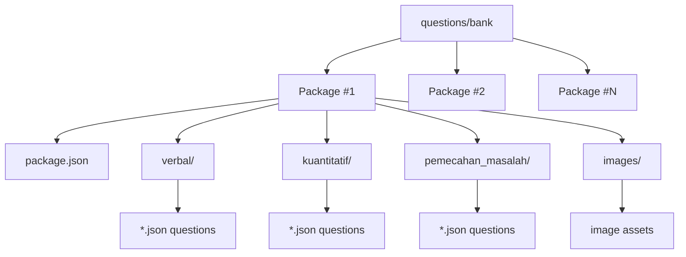
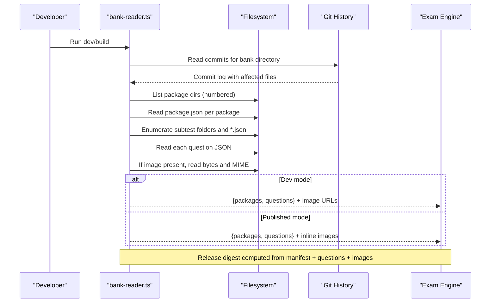
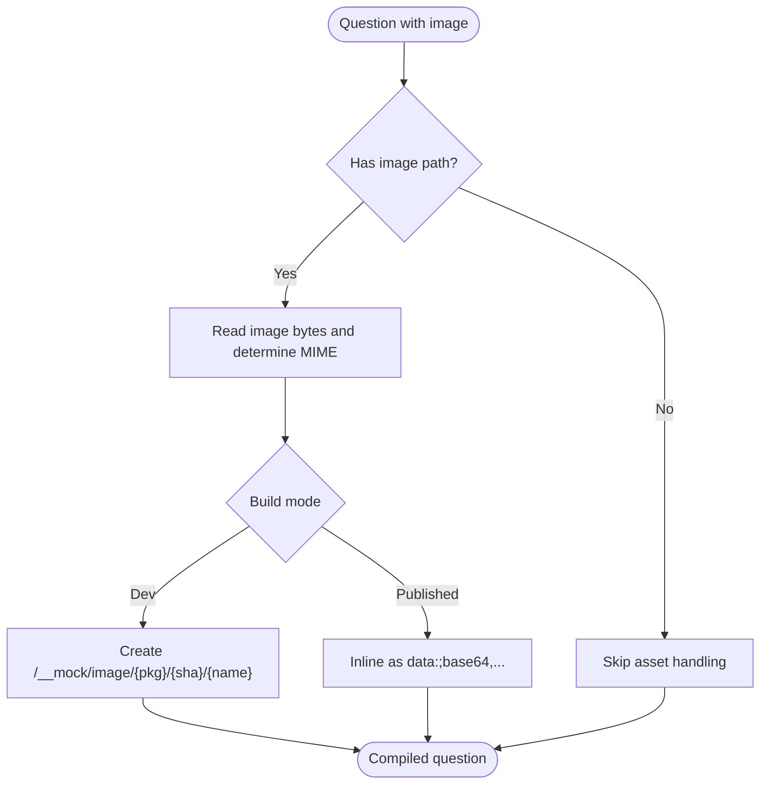
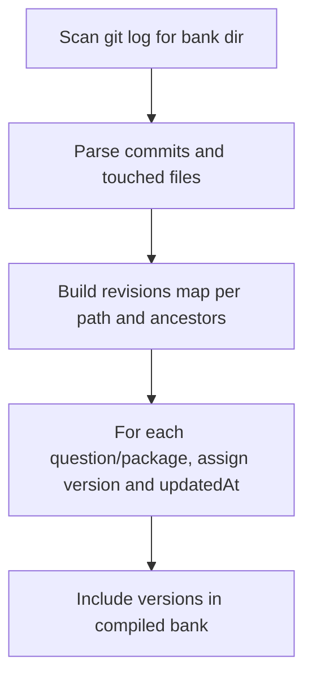
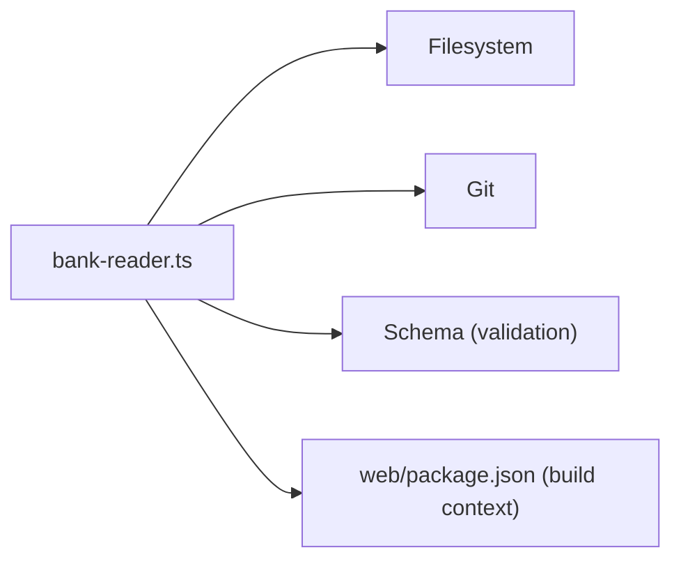

# Package Organization and Structure

<cite>
**Referenced Files in This Document**
- [questions/bank/README.md](file://questions/bank/README.md)
- [questions/schema.json](file://questions/schema.json)
- [web/vite/bank-reader.ts](file://web/vite/bank-reader.ts)
- [questions/bank/1/package.json](file://questions/bank/1/package.json)
- [questions/bank/2/package.json](file://questions/bank/2/package.json)
- [questions/bank/10/package.json](file://questions/bank/10/package.json)
- [questions/bank/1/verbal/001.json](file://questions/bank/1/verbal/001.json)
- [questions/bank/1/kuantitatif/001.json](file://questions/bank/1/kuantitatif/001.json)
- [questions/bank/1/pemecahan_masalah/001.json](file://questions/bank/1/pemecahan_masalah/001.json)
- [web/package.json](file://web/package.json)
- [scripts/bump_version.py](file://scripts/bump_version.py)
- [questions/generator/README.md](file://questions/generator/README.md)
</cite>

## Table of Contents
1. [Introduction](#introduction)
2. [Project Structure](#project-structure)
3. [Core Components](#core-components)
4. [Architecture Overview](#architecture-overview)
5. [Detailed Component Analysis](#detailed-component-analysis)
6. [Dependency Analysis](#dependency-analysis)
7. [Performance Considerations](#performance-considerations)
8. [Troubleshooting Guide](#troubleshooting-guide)
9. [Conclusion](#conclusion)
10. [Appendices](#appendices)

## Introduction
This document explains the package organization and structure of the question bank system used by the TBS LPDP application. It covers how numbered packages are organized under questions/bank, how subtest categories (verbal, kuantitatif, pemecahan_masalah) are structured, how images and assets are managed, and how metadata is defined via package.json per package. It also documents naming conventions for question files, Git-based versioning strategy, and workflows for adding or updating packages while maintaining consistency across large collections.

## Project Structure
The question bank is a content repository rooted at questions/bank. Each numbered directory represents one test package and contains:
- A package.json manifest describing the package’s identity and metadata.
- Three subtest directories: verbal, kuantitatif, pemecahan_masalah.
- An images folder for figures referenced by questions.

**Diagram sources**
- [web/vite/bank-reader.ts:189-293](file://web/vite/bank-reader.ts#L189-L293)
- [questions/bank/1/package.json:1-10](file://questions/bank/1/package.json#L1-L10)

**Section sources**
- [questions/bank/README.md:1-3](file://questions/bank/README.md#L1-L3)
- [web/vite/bank-reader.ts:189-293](file://web/vite/bank-reader.ts#L189-L293)

## Core Components
- Package manifests: One package.json per numbered package defines stable identifiers and human-readable metadata consumed during compilation.
- Question files: One JSON file per question under each subtest directory, following a strict schema.
- Image assets: Optional images stored under each package’s images directory and referenced by relative paths from the package root.
- Schema validation: A central JSON schema enforces field types, allowed values, and image path patterns.
- Bank reader: A build-time module that scans the bank, compiles it into an internal representation, computes versions from Git history, and handles images either as URLs (dev) or inline data URIs (published).

Key responsibilities:
- Maintain consistent IDs derived from paths to ensure stability and reproducibility.
- Enforce subtest-specific constraints and option structures.
- Compute deterministic release digests per package based on manifest and all question content.

**Section sources**
- [questions/schema.json:1-98](file://questions/schema.json#L1-L98)
- [web/vite/bank-reader.ts:159-293](file://web/vite/bank-reader.ts#L159-L293)
- [questions/bank/1/verbal/001.json:1-29](file://questions/bank/1/verbal/001.json#L1-L29)
- [questions/bank/1/kuantitatif/001.json:1-44](file://questions/bank/1/kuantitatif/001.json#L1-L44)
- [questions/bank/1/pemecahan_masalah/001.json:1-44](file://questions/bank/1/pemecahan_masalah/001.json#L1-L44)

## Architecture Overview
The bank is read once during development or build time and transformed into a single artifact consumed by the exam engine. The process integrates Git history to compute stable versions and supports two image modes: URL-based serving in development and inline base64 in published builds.

**Diagram sources**
- [web/vite/bank-reader.ts:78-125](file://web/vite/bank-reader.ts#L78-L125)
- [web/vite/bank-reader.ts:159-293](file://web/vite/bank-reader.ts#L159-L293)

## Detailed Component Analysis

### Package Manifests (per package)
Each package has a package.json containing:
- id: numeric package identifier
- title: human-readable package name
- description: summary of contents and timing
- difficulty: easy | medium | hard
- ai_model, ai_company, ai_model_description: provenance metadata about generation

These fields are read by the bank reader to populate package-level metadata and contribute to the release digest.

Examples:
- Package 1 manifest
- Package 2 manifest
- Package 10 manifest

**Section sources**
- [questions/bank/1/package.json:1-10](file://questions/bank/1/package.json#L1-L10)
- [questions/bank/2/package.json:1-10](file://questions/bank/2/package.json#L1-L10)
- [questions/bank/10/package.json:1-10](file://questions/bank/10/package.json#L1-L10)
- [web/vite/bank-reader.ts:194-202](file://web/vite/bank-reader.ts#L194-L202)

### Question Files and Naming Conventions
- Location: questions/bank/<package>/<subtest>/<NNN>.json
- Subtests: verbal, kuantitatif, pemecahan_masalah
- File numbering: zero-padded three-digit sequence (e.g., 001.json)
- Stable ID: <package>-<subtest>-<NNN>, enforced by schema pattern
- Required fields include id, package, subtest, number, type, question_text, image, passage, options, correct_option, explanations, difficulty, source, verified
- Options: exactly five items keyed A–E; each with text
- Explanations: object with keys A–E and non-empty strings
- Image path: relative to package root, must match images/*.(png|jpg|jpeg|svg|webp) or null
- Difficulty: easy | medium | hard

Examples:
- Verbal question example
- Quantitative question example
- Problem-solving question example

**Section sources**
- [questions/schema.json:7-96](file://questions/schema.json#L7-L96)
- [questions/bank/1/verbal/001.json:1-29](file://questions/bank/1/verbal/001.json#L1-L29)
- [questions/bank/1/kuantitatif/001.json:1-44](file://questions/bank/1/kuantitatif/001.json#L1-L44)
- [questions/bank/1/pemecahan_masalah/001.json:1-44](file://questions/bank/1/pemecahan_masalah/001.json#L1-L44)

### Asset Management (Images)
- Images live under each package’s images directory.
- Questions reference images using a relative path from the package root.
- During development, images are served via a mock endpoint using a content-addressed key (package/imageSha/filename).
- In published builds, images are inlined as data URIs to keep the bank self-contained.
- Allowed formats: png, jpg, jpeg, svg, webp.

**Diagram sources**
- [web/vite/bank-reader.ts:220-234](file://web/vite/bank-reader.ts#L220-L234)
- [questions/schema.json:57-61](file://questions/schema.json#L57-L61)

**Section sources**
- [web/vite/bank-reader.ts:220-234](file://web/vite/bank-reader.ts#L220-L234)
- [questions/schema.json:57-61](file://questions/schema.json#L57-L61)

### Versioning Strategy (Git-based)
- Versions are derived from Git history over the bank directory, not counters.
- For each file and its ancestor directories, the reader counts commits to compute a revision number and last-updated timestamp.
- Package-level and question-level versions are included in the compiled output.
- Latest commit timestamp is exposed when available.

**Diagram sources**
- [web/vite/bank-reader.ts:78-125](file://web/vite/bank-reader.ts#L78-L125)
- [web/vite/bank-reader.ts:186-187](file://web/vite/bank-reader.ts#L186-L187)
- [web/vite/bank-reader.ts:236-251](file://web/vite/bank-reader.ts#L236-L251)
- [web/vite/bank-reader.ts:272-284](file://web/vite/bank-reader.ts#L272-L284)

**Section sources**
- [web/vite/bank-reader.ts:78-125](file://web/vite/bank-reader.ts#L78-L125)
- [web/vite/bank-reader.ts:186-187](file://web/vite/bank-reader.ts#L186-L187)
- [web/vite/bank-reader.ts:236-251](file://web/vite/bank-reader.ts#L236-L251)
- [web/vite/bank-reader.ts:272-284](file://web/vite/bank-reader.ts#L272-L284)

### Workflow for Adding or Updating Packages
Adding a new package:
1. Create a new numbered directory under questions/bank (next integer).
2. Add a package.json with id, title, description, difficulty, and AI provenance fields.
3. Create subtest directories: verbal, kuantitatif, pemecahan_masalah.
4. Add question JSON files named with zero-padded numbers (e.g., 001.json) under each subtest.
5. Place any images under the package’s images directory and reference them via relative paths.
6. Validate the bank using the generator tools before committing.

Updating an existing package:
- Edit package.json or question files as needed.
- Ensure IDs remain unchanged to preserve stability.
- Re-run validation and rebuild to verify correctness.

Publishing considerations:
- Use the generator tooling to validate and optionally publish content-addressed releases.
- The bank reader computes a release_id per package based on manifest and all question content, ensuring immutability.

**Section sources**
- [web/vite/bank-reader.ts:189-293](file://web/vite/bank-reader.ts#L189-L293)
- [questions/generator/README.md:9-24](file://questions/generator/README.md#L9-L24)

### Consistency Guidelines and Best Practices
- Follow the schema strictly: required fields, enum values, and array sizes must be exact.
- Keep IDs stable: they derive from path and must never change after publication.
- Use consistent numbering: zero-padded three digits per subtest.
- Limit images to supported formats and place them under images/.
- Provide explanations for all options (A–E) with meaningful text.
- Mark difficulty consistently and set verified appropriately.
- Use generator scripts for computable types to ensure deterministic answers and high-quality distractors.
- Validate the entire bank before pushing changes.

**Section sources**
- [questions/schema.json:7-96](file://questions/schema.json#L7-L96)
- [questions/generator/README.md:9-24](file://questions/generator/README.md#L9-L24)

## Dependency Analysis
The bank reader depends on:
- Filesystem access to enumerate packages, manifests, and questions.
- Git history to compute versions and timestamps.
- The JSON schema for validation (used by external validators).
- Web package configuration for build/dev flows.

**Diagram sources**
- [web/vite/bank-reader.ts:1-6](file://web/vite/bank-reader.ts#L1-L6)
- [web/vite/bank-reader.ts:78-125](file://web/vite/bank-reader.ts#L78-L125)
- [web/package.json:1-46](file://web/package.json#L1-L46)

**Section sources**
- [web/vite/bank-reader.ts:1-6](file://web/vite/bank-reader.ts#L1-L6)
- [web/package.json:1-46](file://web/package.json#L1-L46)

## Performance Considerations
- Reading the bank is a one-time operation during dev/build; avoid repeated scans in hot paths.
- In dev mode, serve images via URL endpoints to avoid embedding large assets in memory.
- In published mode, inline images to produce a self-contained artifact; this increases bundle size but improves offline performance.
- Sorting questions by number ensures deterministic ordering and stable outputs.
- Using Git history provides accurate versioning without additional bookkeeping.

[No sources needed since this section provides general guidance]

## Troubleshooting Guide
Common issues and resolutions:
- Missing package.json in a numbered directory: the reader skips it; ensure every intended package includes a valid manifest.
- Invalid question JSON: schema validation will fail; check required fields, enums, and array sizes.
- Incorrect image path: must be relative to the package root and use allowed extensions; otherwise, validation fails.
- No Git history available: the reader falls back to file mtimes for versions; ensure your environment has Git for accurate versioning.
- Duplicate or out-of-order numbering: sort by number to maintain expected order; keep filenames sequential.

Validation and publishing tools:
- Use the generator’s validate_bank script to catch schema and blueprint violations before committing.
- Use push_to_supabase to upload content-addressed images and publish immutable releases.

**Section sources**
- [web/vite/bank-reader.ts:169-171](file://web/vite/bank-reader.ts#L169-L171)
- [web/vite/bank-reader.ts:189-198](file://web/vite/bank-reader.ts#L189-L198)
- [questions/schema.json:7-96](file://questions/schema.json#L7-L96)
- [questions/generator/README.md:9-24](file://questions/generator/README.md#L9-L24)

## Conclusion
The question bank system uses a clear, hierarchical structure with numbered packages and standardized subtest directories. A strict schema and Git-based versioning ensure stability and reproducibility. The bank reader compiles the repository into a format suitable for both development and production, handling images flexibly. Following the naming conventions, validation practices, and workflow guidelines helps maintain consistency and scalability as the collection grows.

[No sources needed since this section summarizes without analyzing specific files]

## Appendices

### App Versioning and Dependencies
- The web application uses a standard package.json with dependencies for Supabase, React, Tauri plugins, and build tooling.
- A helper script updates version fields across Tauri and web artifacts to keep app versions synchronized.

**Section sources**
- [web/package.json:1-46](file://web/package.json#L1-L46)
- [scripts/bump_version.py:1-124](file://scripts/bump_version.py#L1-L124)