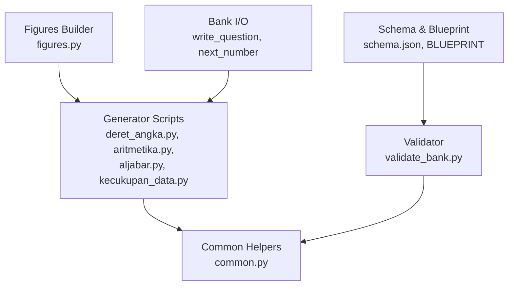
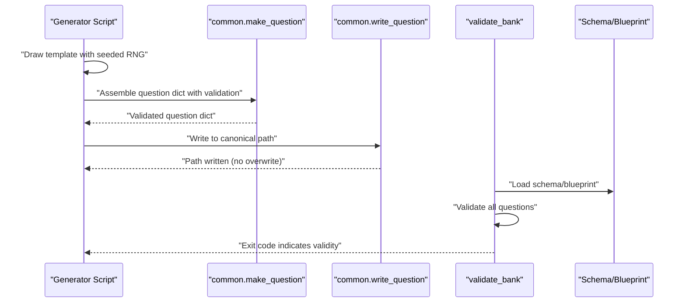
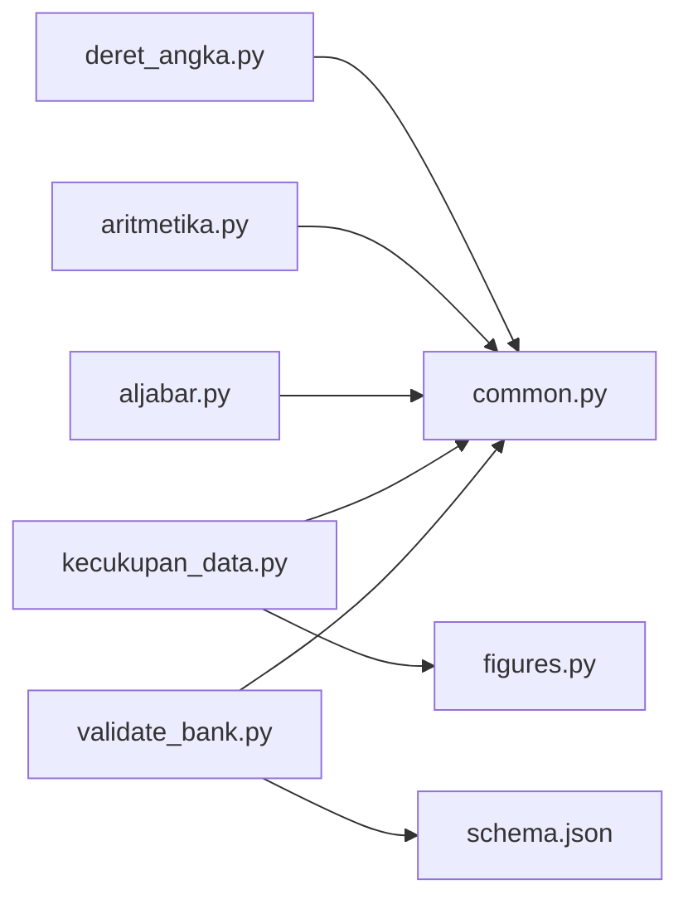

# Common Utilities and Base Classes

<cite>
**Referenced Files in This Document**
- [common.py](file://questions/generator/common.py)
- [README.md](file://questions/generator/README.md)
- [requirements.txt](file://questions/generator/requirements.txt)
- [deret_angka.py](file://questions/generator/deret_angka.py)
- [aritmetika.py](file://questions/generator/aritmetika.py)
- [aljabar.py](file://questions/generator/aljabar.py)
- [kecukupan_data.py](file://questions/generator/kecukupan_data.py)
- [figures.py](file://questions/generator/figures.py)
- [validate_bank.py](file://questions/generator/validate_bank.py)
</cite>

## Table of Contents
1. [Introduction](#introduction)
2. [Project Structure](#project-structure)
3. [Core Components](#core-components)
4. [Architecture Overview](#architecture-overview)
5. [Detailed Component Analysis](#detailed-component-analysis)
6. [Dependency Analysis](#dependency-analysis)
7. [Performance Considerations](#performance-considerations)
8. [Troubleshooting Guide](#troubleshooting-guide)
9. [Conclusion](#conclusion)
10. [Appendices](#appendices)

## Introduction
This document explains the shared utilities and base patterns that underpin all question generators in this repository. It focuses on:
- Shared data structures and constants for subtests, types, and options
- Utility functions for number formatting, schema loading, canonical paths, and question assembly
- Deterministic random generation with seed control
- Validation rules and constraints applied consistently across generators
- The implicit “base class” architecture implemented via common helpers and consistent generator contracts
- Examples of extending functionality and best practices for implementing new generators

The goal is to help developers understand how to build new computable question types that integrate seamlessly with the existing ecosystem.

## Project Structure
At a high level, the generator suite lives under questions/generator. The most important files for this document are:
- common.py: shared helpers, constants, and question assembly
- Generator scripts (e.g., deret_angka.py, aritmetika.py, aljabar.py, kecukupan_data.py): implement specific question types using common helpers
- figures.py: deterministic SVG figure generation used by geometry-related items
- validate_bank.py: validates the entire bank against schema and blueprint rules
- README.md and requirements.txt: usage notes and dependencies

**Diagram sources**
- [common.py:13-24](file://questions/generator/common.py#L13-L24)
- [validate_bank.py:44-194](file://questions/generator/validate_bank.py#L44-L194)
- [figures.py:71-165](file://questions/generator/figures.py#L71-L165)

**Section sources**
- [README.md:1-33](file://questions/generator/README.md#L1-L33)
- [requirements.txt:1-3](file://questions/generator/requirements.txt#L1-L3)

## Core Components
The foundation of all generators is built around a small set of shared components:

- Constants and configuration
  - Subtests and allowed types per subtest
  - Option keys and difficulty weights
  - Blueprint defining counts, durations, and passing grades per subtest
  - Passage rules for stimulus-based types

- Number formatting and rendering
  - Indonesian-style number formatting with typographic minus
  - Exact fraction handling to avoid repeating decimals in options or stems

- Question assembly and persistence
  - Canonical path resolution and next-number computation
  - Safe write operations that refuse to overwrite existing files
  - Structured question creation with validation of option keys, correct option, explanations, and type/subtest compatibility

- Schema and validation
  - Schema loading from a central JSON file
  - Iteration over all bank questions for validation pipelines

These components ensure consistency, determinism, and safety across all generators.

**Section sources**
- [common.py:17-74](file://questions/generator/common.py#L17-L74)
- [common.py:77-128](file://questions/generator/common.py#L77-L128)
- [common.py:130-218](file://questions/generator/common.py#L130-L218)

## Architecture Overview
Generators do not use an explicit Python base class; instead, they follow a consistent contract enforced by common helpers:

- Each generator imports shared helpers from common.py
- Generators produce structured data (text, answer, distractors with reasons, work steps, difficulty)
- They call make_question to assemble a validated question dict
- They call write_question to persist safely to the canonical bank path
- Optional integration with figures.py for geometry items

**Diagram sources**
- [aritmetika.py:510-560](file://questions/generator/aritmetika.py#L510-L560)
- [aljabar.py:257-301](file://questions/generator/aljabar.py#L257-L301)
- [common.py:154-207](file://questions/generator/common.py#L154-L207)
- [validate_bank.py:44-194](file://questions/generator/validate_bank.py#L44-L194)

## Detailed Component Analysis

### Shared Data Structures and Constants
- Subtests and allowed types
  - Defines verbal, kuantitatif, pemecahan_masalah and their allowed question types
  - Some types appear in multiple subtests (e.g., peluang_kombinatorik)
- Passage rules
  - Types requiring passage text vs. those allowing passage or image
  - Self-contained types must not carry stray passages
- Options and difficulty
  - Fixed option keys A..E
  - Difficulty weights used to compute package-level difficulty band

Best practice: Always reference these constants rather than hardcoding strings or sets.

**Section sources**
- [common.py:17-74](file://questions/generator/common.py#L17-L74)

### Number Formatting and Rendering
- fmt_number formats numbers in Indonesian style with typographic minus and thousands separators
- For fractions whose denominator does not divide 100, exact fraction notation is preserved
- renders_exactly checks whether a value prints cleanly as a whole number or terminating decimal

Use cases:
- Ensuring options and stems render consistently
- Avoiding misleading repeating decimals in printed materials

**Section sources**
- [common.py:99-128](file://questions/generator/common.py#L99-L128)

### Question Assembly and Persistence
- make_question enforces:
  - Option keys exactly A..E in order
  - Correct option among A..E
  - Explanations covering all five options
  - Type allowed in the specified subtest
- write_question:
  - Resolves canonical path based on package, subtest, and number
  - Creates directories if needed
  - Refuses to overwrite existing files to prevent accidental data loss
- next_number computes the next free question number in a subtest directory
- question_id builds canonical IDs like "package-subtest-number"

Best practice:
- Always use make_question to construct questions
- Rely on write_question to handle safe persistence
- Use next_number to avoid collisions

**Section sources**
- [common.py:139-207](file://questions/generator/common.py#L139-L207)

### Deterministic Random Generation with Seed Control
- All generators accept --seed to initialize a local random.Random instance
- This ensures reproducible output across runs and packages
- Distractors are generated as (value, reason) pairs to keep explanations precise and tied to each option
- Templates often include retry loops to redraw until conditions are met (e.g., clean rendering, unambiguous sequences)

Examples:
- Sequence generators screen rival rules to ensure uniqueness of interpretation
- Algebra and arithmetic generators filter distractors by rendering quality and magnitude

Best practice:
- Always pass a seeded RNG to generators for reproducibility
- Keep distractor generation deterministic and explainable

**Section sources**
- [deret_angka.py:1-35](file://questions/generator/deret_angka.py#L1-L35)
- [aritmetika.py:510-560](file://questions/generator/aritmetika.py#L510-L560)
- [aljabar.py:257-301](file://questions/generator/aljabar.py#L257-L301)

### Validation Methods and Constraints
- Schema validation via jsonschema against a central schema.json
- Blueprint enforcement for counts, durations, and passing grades
- Strict mode enforces complete packages matching blueprint counts
- Passage/image rules enforced per type
- Image references checked for existence within package images directory
- Unique numbering and no gaps per subtest

Best practice:
- Run validate_bank.py before review/push
- Use strict mode in CI to enforce blueprint compliance

**Section sources**
- [validate_bank.py:44-194](file://questions/generator/validate_bank.py#L44-L194)
- [common.py:130-137](file://questions/generator/common.py#L130-L137)

### Figures Integration for Geometry Items
- figures.py provides deterministic SVG builders for geometry figures
- Builders return Drawing objects with dimensions, parts, and provenance notes
- Rendered SVGs are served inline with styles for portability
- Rules:
  - Figures may label only what the stem gives
  - Derived quantities can be computed but not labeled
- Integration:
  - Data-sufficiency geometry templates specify image names
  - Ensure_shared_figure supports shared schematic figures across families

Best practice:
- Use builders instead of hand-editing SVGs
- Run --check in CI to detect stale figures
- Link questions to their figures via --link

**Section sources**
- [figures.py:1-30](file://questions/generator/figures.py#L1-L30)
- [figures.py:71-165](file://questions/generator/figures.py#L71-L165)
- [kecukupan_data.py:441-518](file://questions/generator/kecukupan_data.py#L441-L518)

### Implicit Base Class Architecture
While there is no formal base class, generators follow a consistent pattern:
- Import common helpers
- Define SUBTEST and QTYPE
- Implement template functions returning structured data
- Build questions using make_question and write_question
- Accept CLI arguments including --seed and --bank-dir
- Enforce rendering and uniqueness constraints

This pattern acts as an implicit base class, ensuring uniform behavior across different question types.

**Section sources**
- [aritmetika.py:1-24](file://questions/generator/aritmetika.py#L1-L24)
- [aljabar.py:1-23](file://questions/generator/aljabar.py#L1-L23)
- [deret_angka.py:1-35](file://questions/generator/deret_angka.py#L1-L35)
- [kecukupan_data.py:1-35](file://questions/generator/kecukupan_data.py#L1-L35)

## Dependency Analysis
Generators depend on common.py for shared logic and on figures.py for geometry visuals. Validation depends on schema and blueprint definitions.

**Diagram sources**
- [deret_angka.py:37-48](file://questions/generator/deret_angka.py#L37-L48)
- [aritmetika.py:26-45](file://questions/generator/aritmetika.py#L26-L45)
- [aljabar.py:25-45](file://questions/generator/aljabar.py#L25-L45)
- [kecukupan_data.py:37-58](file://questions/generator/kecukupan_data.py#L37-L58)
- [validate_bank.py:29-41](file://questions/generator/validate_bank.py#L29-L41)

**Section sources**
- [requirements.txt:1-3](file://questions/generator/requirements.txt#L1-L3)

## Performance Considerations
- Deterministic generation avoids expensive retries by constraining draws early
- Fraction arithmetic ensures exactness without floating-point drift
- Screening rival rules prevents ambiguous stems at the cost of extra computation during generation
- Batch validation runs efficiently by iterating bank files once and collecting errors/warnings

Recommendations:
- Prefer exact arithmetic (Fraction) for correctness
- Limit retry loops to reasonable bounds to avoid infinite generation
- Use shared figures to reduce duplication and ensure consistency

[No sources needed since this section provides general guidance]

## Troubleshooting Guide
Common issues and resolutions:
- Overwrite protection: write_question refuses to overwrite existing files; ensure unique numbers via next_number
- Invalid JSON: iter_bank_questions yields parse errors; fix malformed question files
- Schema violations: validate_bank reports detailed locations; adjust fields to match schema
- Blueprint mismatches: strict mode flags incomplete packages; add missing questions or adjust counts
- Missing images: referenced images must exist in package images directory; regenerate or link figures
- Passage rules: types requiring passage must include it; self-contained types must not carry passage

**Section sources**
- [common.py:154-164](file://questions/generator/common.py#L154-L164)
- [common.py:210-218](file://questions/generator/common.py#L210-L218)
- [validate_bank.py:96-194](file://questions/generator/validate_bank.py#L96-L194)

## Conclusion
The generator ecosystem relies on a robust set of shared utilities and a consistent implicit base class pattern. By centralizing constants, formatting, validation, and persistence logic in common.py, all generators maintain uniform behavior, determinism, and safety. Integrating figures.py enables rich geometry items while preserving computational rigor. Following the documented best practices ensures new generators integrate smoothly and pass validation pipelines.

[No sources needed since this section summarizes without analyzing specific files]

## Appendices

### Extending Base Functionality: Adding a New Computable Type
Steps:
1. Create a new generator script following the established pattern:
   - Import common helpers
   - Define SUBTEST and QTYPE
   - Implement template functions returning structured data
   - Use make_question and write_question
   - Accept --seed and --bank-dir
2. Add allowed type mapping in common.py if needed
3. Integrate figures.py if geometry visuals are required
4. Run validate_bank.py with strict mode to ensure compliance
5. Test with various seeds to verify robustness

Best practices:
- Generate distractors as (value, reason) pairs
- Screen for ambiguity and rendering quality
- Use exact arithmetic and deterministic RNG
- Follow passage/image rules per type

**Section sources**
- [README.md:24-33](file://questions/generator/README.md#L24-L33)
- [common.py:17-74](file://questions/generator/common.py#L17-L74)
- [figures.py:1-30](file://questions/generator/figures.py#L1-L30)