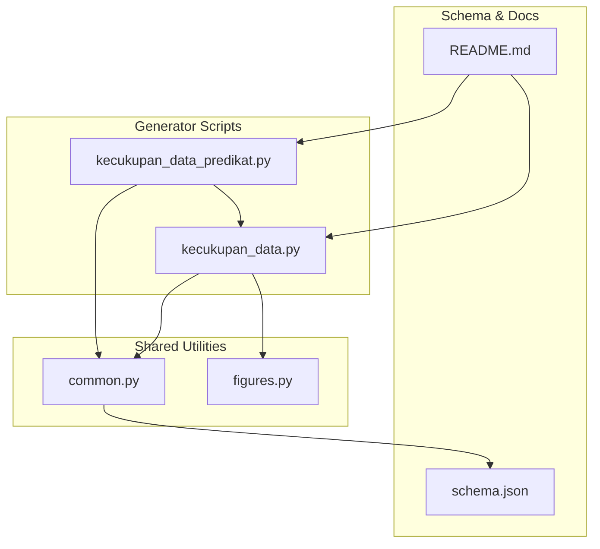
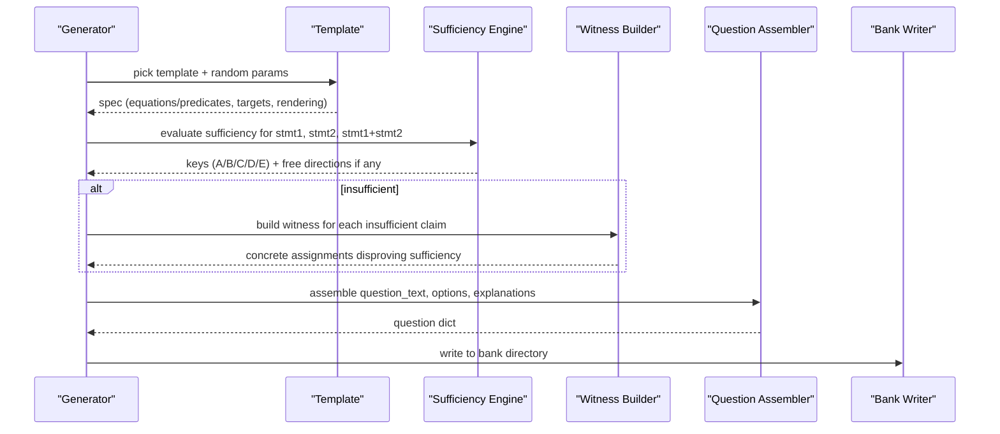
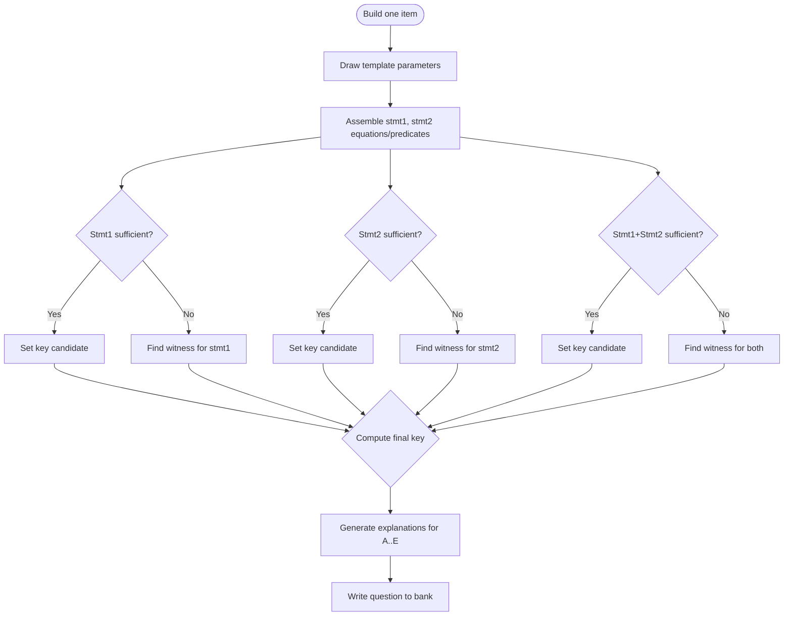
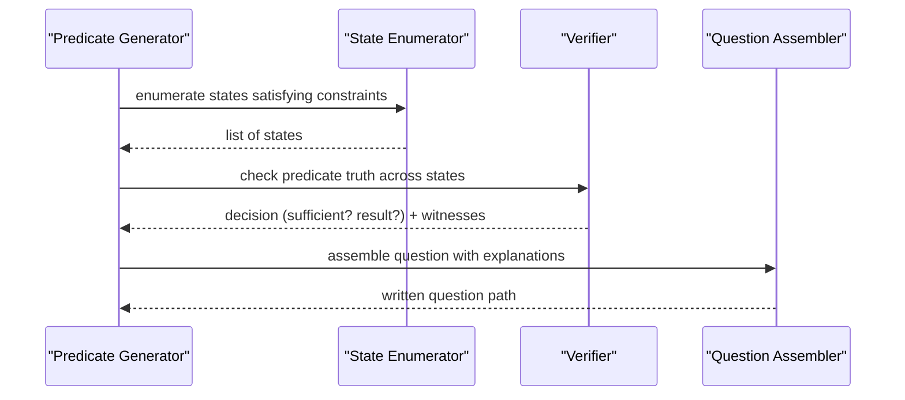
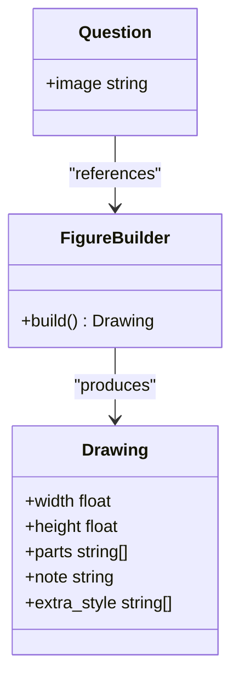
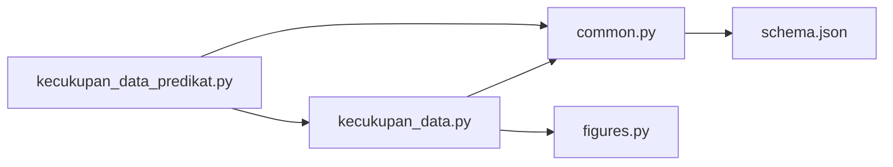

# Data Sufficiency Generator

<cite>
**Referenced Files in This Document**
- [kecukupan_data.py](file://questions/generator/kecukupan_data.py)
- [kecukupan_data_predikat.py](file://questions/generator/kecukupan_data_predikat.py)
- [common.py](file://questions/generator/common.py)
- [figures.py](file://questions/generator/figures.py)
- [schema.json](file://questions/schema.json)
- [README.md](file://questions/generator/README.md)
</cite>

## Table of Contents
1. [Introduction](#introduction)
2. [Project Structure](#project-structure)
3. [Core Components](#core-components)
4. [Architecture Overview](#architecture-overview)
5. [Detailed Component Analysis](#detailed-component-analysis)
6. [Dependency Analysis](#dependency-analysis)
7. [Performance Considerations](#performance-considerations)
8. [Troubleshooting Guide](#troubleshooting-guide)
9. [Conclusion](#conclusion)
10. [Appendices](#appendices)

## Introduction
This document explains the data sufficiency question generator that produces problems where test-takers must determine whether given information is sufficient to answer a question. It covers:
- The algorithm for generating statements and determining sufficiency
- How plausible distractors are created via witness counterexamples
- The predicate-based variant that extends the basic format to yes/no inequality questions
- Examples of generated questions and configuration options for controlling complexity and topic areas

The system generates deterministic, verifiable items with exact arithmetic reasoning and standardized Indonesian TBS-style options.

## Project Structure
The data sufficiency generators live under the question generator package and rely on shared utilities and schema validation.

**Diagram sources**
- [kecukupan_data.py:1-35](file://questions/generator/kecukupan_data.py#L1-L35)
- [kecukupan_data_predikat.py:1-20](file://questions/generator/kecukupan_data_predikat.py#L1-L20)
- [common.py:1-25](file://questions/generator/common.py#L1-L25)
- [figures.py:1-30](file://questions/generator/figures.py#L1-L30)
- [schema.json:1-22](file://questions/schema.json#L1-L22)
- [README.md:9-22](file://questions/generator/README.md#L9-L22)

**Section sources**
- [README.md:9-22](file://questions/generator/README.md#L9-L22)

## Core Components
- Standard data sufficiency engine: builds algebraic or geometric scenarios, computes sufficiency exactly using linear algebra, and produces explanations backed by witness pairs when a statement is insufficient.
- Predicate variant: handles yes/no inequality questions over positive integers, uses symbolic equivalence proofs and exhaustive search for counterexamples.
- Shared helpers: formatting, question assembly, bank I/O, and type constraints.
- Figures: deterministic SVG generation for geometry items; schematic figures avoid giving away answers by measurement.

Key responsibilities:
- Statement generation from templates (word problems and geometry families)
- Exact sufficiency determination via rank/nullspace analysis
- Witness construction for “not sufficient” claims
- Option explanation generation aligned with the standard five-option set
- Output conforming to the canonical question schema

**Section sources**
- [kecukupan_data.py:60-77](file://questions/generator/kecukupan_data.py#L60-L77)
- [kecukupan_data.py:79-141](file://questions/generator/kecukupan_data.py#L79-L141)
- [kecukupan_data_predikat.py:41-86](file://questions/generator/kecukupan_data_predikat.py#L41-L86)
- [common.py:167-207](file://questions/generator/common.py#L167-L207)
- [figures.py:1-30](file://questions/generator/figures.py#L1-L30)

## Architecture Overview
The generator follows a template-driven pipeline:
- Select a template family (word or geometry)
- Randomly draw parameters within realistic bounds
- Build two statements as equations or predicates
- Compute sufficiency for each statement alone and together
- If insufficient, construct a witness pair that satisfies the same statements but yields different target values
- Assemble the final question with explanations for all five options

**Diagram sources**
- [kecukupan_data.py:792-884](file://questions/generator/kecukupan_data.py#L792-L884)
- [kecukupan_data_predikat.py:184-253](file://questions/generator/kecukupan_data_predikat.py#L184-L253)
- [common.py:139-164](file://questions/generator/common.py#L139-L164)

## Detailed Component Analysis

### Basic Data Sufficiency Engine
- Linear algebra core:
  - Reduced row echelon form and nullspace basis computed exactly with rational arithmetic to avoid floating-point errors.
  - Determines whether the asked-for quantity is pinned down by a set of equations by checking if any free direction changes the target functional(s).
- Templates:
  - Word problems: systems of equations, averages/mixtures, perimeters, pricing baskets, fleet totals.
  - Geometry: parallel angles, midsegment properties, two right triangles sharing a base.
- Sufficiency logic:
  - For each statement alone and both together, compute whether the target is uniquely determined.
  - If not sufficient, find a witness pair satisfying the same statements but yielding different target values, respecting realism constraints (positive integers, round prices, valid geometry).
- Explanations:
  - Each option’s explanation either supports the correct verdict or refutes it using a specific conjunct (e.g., “statement (1) alone does not suffice because …”).

**Diagram sources**
- [kecukupan_data.py:792-884](file://questions/generator/kecukupan_data.py#L792-L884)
- [kecukupan_data.py:714-745](file://questions/generator/kecukupan_data.py#L714-L745)

**Section sources**
- [kecukupan_data.py:79-141](file://questions/generator/kecukupan_data.py#L79-L141)
- [kecukupan_data.py:183-438](file://questions/generator/kecukupan_data.py#L183-L438)
- [kecukupan_data.py:455-671](file://questions/generator/kecukupan_data.py#L455-L671)
- [kecukupan_data.py:684-745](file://questions/generator/kecukupan_data.py#L684-L745)
- [kecukupan_data.py:792-884](file://questions/generator/kecukupan_data.py#L792-L884)

### Predicate-Based Data Sufficiency Variant
- Purpose: Generates yes/no questions about inequalities involving positive integers, such as comparing ratios and sums.
- Approach:
  - Define predicates over a finite domain of positive integers.
  - Enumerate states to determine sufficiency and produce counterexamples when insufficient.
  - Use symbolic equivalence to provide concise proofs for sufficient cases.
- Templates include comparisons like ratio vs sum, combined conditions, and cases where each statement alone is sufficient.

**Diagram sources**
- [kecukupan_data_predikat.py:148-177](file://questions/generator/kecukupan_data_predikat.py#L148-L177)
- [kecukupan_data_predikat.py:184-253](file://questions/generator/kecukupan_data_predikat.py#L184-L253)

**Section sources**
- [kecukupan_data_predikat.py:1-20](file://questions/generator/kecukupan_data_predikat.py#L1-L20)
- [kecukupan_data_predikat.py:41-86](file://questions/generator/kecukupan_data_predikat.py#L41-L86)
- [kecukupan_data_predikat.py:89-145](file://questions/generator/kecukupan_data_predikat.py#L89-L145)
- [kecukupan_data_predikat.py:148-177](file://questions/generator/kecukupan_data_predikat.py#L148-L177)
- [kecukupan_data_predikat.py:184-253](file://questions/generator/kecukupan_data_predikat.py#L184-L253)

### Geometry Figures Integration
- Geometry templates use shared schematic figures to avoid measurement-based solving.
- Figures are generated deterministically and linked to questions; they label only what the stem provides.

**Diagram sources**
- [figures.py:71-78](file://questions/generator/figures.py#L71-L78)
- [figures.py:139-165](file://questions/generator/figures.py#L139-L165)
- [kecukupan_data.py:868-883](file://questions/generator/kecukupan_data.py#L868-L883)

**Section sources**
- [figures.py:1-30](file://questions/generator/figures.py#L1-L30)
- [figures.py:139-165](file://questions/generator/figures.py#L139-L165)
- [kecukupan_data.py:441-450](file://questions/generator/kecukupan_data.py#L441-L450)

### Configuration Options and Complexity Control
- Command-line controls:
  - Package selection and count of questions to generate
  - Seed for reproducibility
  - Kind filter: word vs geometry templates
  - Explicit template selection for targeted architectures
- Difficulty control:
  - Per-template difficulty labels influence package-level difficulty band calculations
  - Some templates adjust difficulty based on desired key (e.g., easy for D, hard for E)

**Section sources**
- [kecukupan_data.py:887-933](file://questions/generator/kecukupan_data.py#L887-L933)
- [kecukupan_data_predikat.py:256-281](file://questions/generator/kecukupan_data_predikat.py#L256-L281)
- [common.py:77-96](file://questions/generator/common.py#L77-L96)

## Dependency Analysis
- Template modules depend on shared utilities for formatting, question assembly, and file I/O.
- Geometry templates depend on figure generation utilities to attach deterministic images.
- Predicate variant reuses the standard options and prompt text from the main module.

**Diagram sources**
- [kecukupan_data.py:44-53](file://questions/generator/kecukupan_data.py#L44-L53)
- [kecukupan_data_predikat.py:30-31](file://questions/generator/kecukupan_data_predikat.py#L30-L31)
- [common.py:13-15](file://questions/generator/common.py#L13-L15)

**Section sources**
- [kecukupan_data.py:44-53](file://questions/generator/kecukupan_data.py#L44-L53)
- [kecukupan_data_predikat.py:30-31](file://questions/generator/kecukupan_data_predikat.py#L30-L31)
- [common.py:13-15](file://questions/generator/common.py#L13-L15)

## Performance Considerations
- Exact rational arithmetic avoids floating-point inaccuracies and ensures deterministic outcomes.
- Nullspace computation scales with the number of unknowns; typical templates keep this small (2–3 variables).
- Predicate variant enumerates a bounded positive-integer domain; performance remains acceptable due to small ranges.
- Witness search iterates over predefined scale factors; templates choose scales appropriate to context (e.g., round rupiah values).

[No sources needed since this section provides general guidance]

## Troubleshooting Guide
Common issues and resolutions:
- No clean draw after many attempts:
  - Indicates parameter space constraints cannot satisfy the desired key; adjust seed or template pool.
- Missing witness for insufficient claim:
  - Realism constraints may block feasible counterexamples; review feasibility functions and witness scales.
- Overwrite protection:
  - Writers refuse to overwrite existing question files; ensure unique numbering or clear output directory.
- Schema validation errors:
  - Ensure options cover A..E exactly, correct_option is valid, and explanations exist for all options.

**Section sources**
- [kecukupan_data.py:919-928](file://questions/generator/kecukupan_data.py#L919-L928)
- [kecukupan_data.py:720-745](file://questions/generator/kecukupan_data.py#L720-L745)
- [common.py:154-164](file://questions/generator/common.py#L154-L164)
- [common.py:167-207](file://questions/generator/common.py#L167-L207)

## Conclusion
The data sufficiency generator combines template-driven problem construction with exact mathematical reasoning to produce high-quality, verifiable questions. It ensures correctness through:
- Deterministic parameter draws
- Exact linear algebra for sufficiency checks
- Concrete witness counterexamples for insufficiency
- Standardized options and explanations
- Deterministic figures for geometry items

The predicate variant extends coverage to yes/no inequality questions with symbolic proofs and exhaustive counterexample search. Together, these components enable scalable generation of diverse, challenging data sufficiency items across multiple topics and difficulties.

[No sources needed since this section summarizes without analyzing specific files]

## Appendices

### Example Questions and Outputs
- Generated questions follow the canonical schema with fields including id, package, subtest, number, type, question_text, image, passage, options, correct_option, explanations, difficulty, source, verified.
- Example paths:
  - Arithmetic example: [001.json](file://questions/bank/1/kuantitatif/001.json)
  - Geometry example: [025.json](file://questions/bank/1/kuantitatif/025.json)

**Section sources**
- [schema.json:23-96](file://questions/schema.json#L23-L96)
- [questions/bank/1/kuantitatif/001.json:1-44](file://questions/bank/1/kuantitatif/001.json#L1-L44)
- [questions/bank/1/kuantitatif/025.json:1-44](file://questions/bank/1/kuantitatif/025.json#L1-L44)