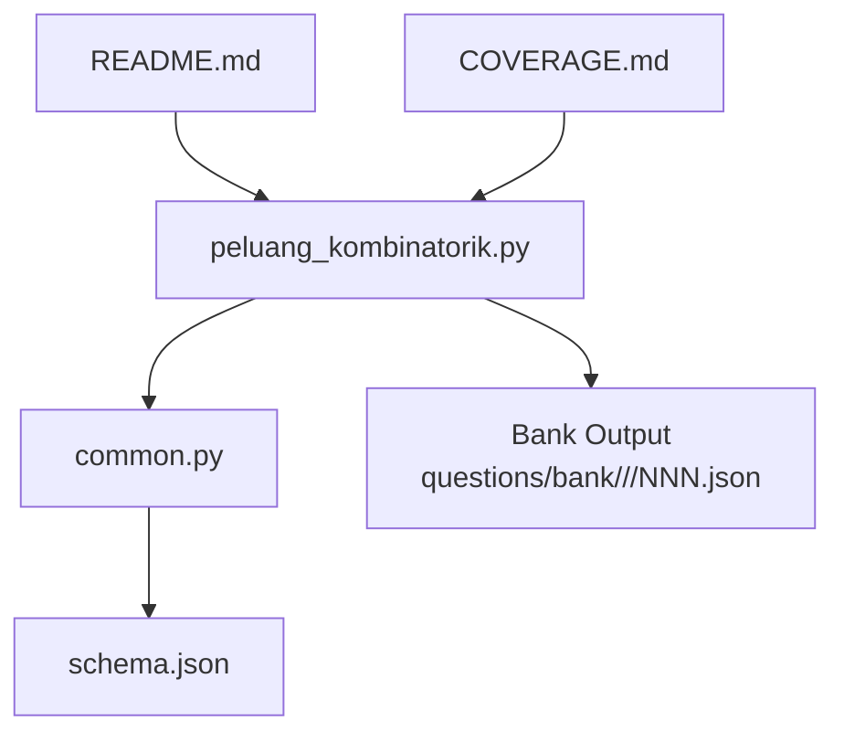
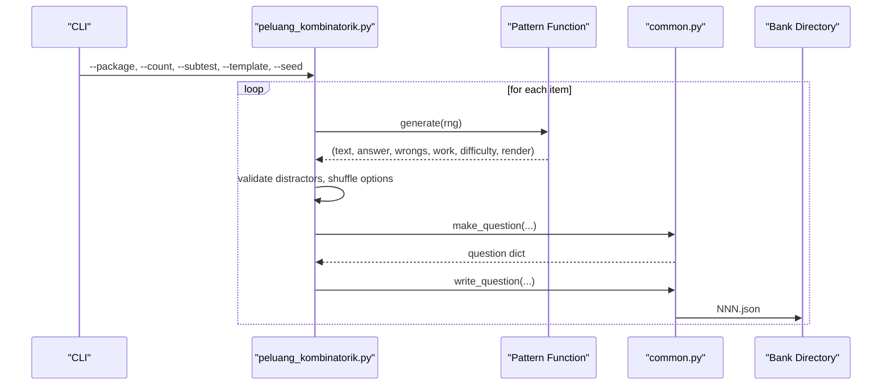
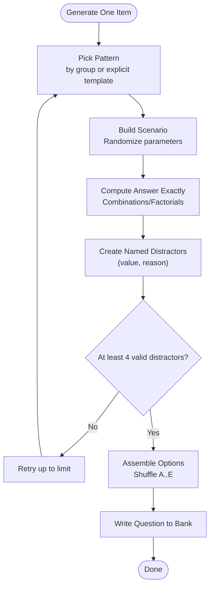
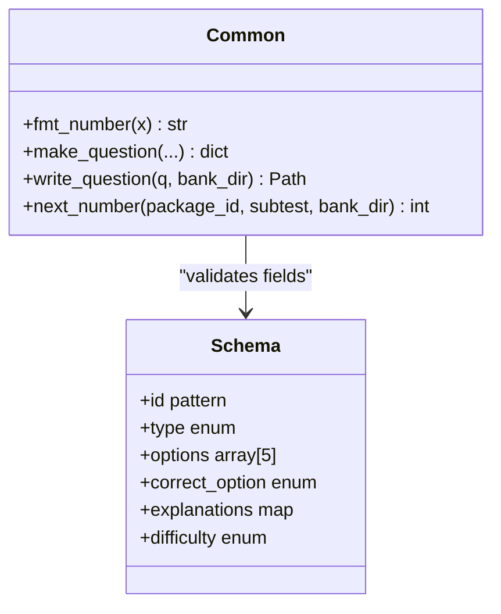
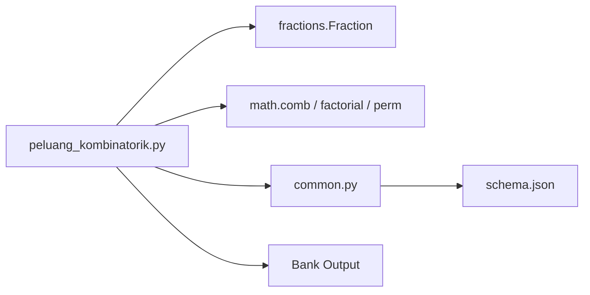

# Probability and Combinatorics Generator

<cite>
**Referenced Files in This Document**
- [peluang_kombinatorik.py](file://questions/generator/peluang_kombinatorik.py)
- [common.py](file://questions/generator/common.py)
- [schema.json](file://questions/schema.json)
- [README.md](file://questions/generator/README.md)
- [COVERAGE.md](file://questions/generator/COVERAGE.md)
- [001.json](file://questions/bank/1/kuantitatif/001.json)
- [002.json](file://questions/bank/1/kuantitatif/002.json)
- [001.json](file://questions/bank/1/pemecahan_masalah/001.json)
</cite>

## Table of Contents
1. [Introduction](#introduction)
2. [Project Structure](#project-structure)
3. [Core Components](#core-components)
4. [Architecture Overview](#architecture-overview)
5. [Detailed Component Analysis](#detailed-component-analysis)
6. [Dependency Analysis](#dependency-analysis)
7. [Performance Considerations](#performance-considerations)
8. [Troubleshooting Guide](#troubleshooting-guide)
9. [Conclusion](#conclusion)
10. [Appendices](#appendices)

## Introduction
This document explains the probability and combinatorics question generator that produces deterministic, mathematically verified multiple-choice questions for quantitative reasoning and problem-solving sections. It covers:
- The mathematical algorithms used to generate solvable problems with appropriate difficulty levels
- How realistic scenarios are constructed (marbles, dice, committees, seating arrangements, lattice paths)
- Parameter controls for complexity and topic focus
- Examples of generated questions via file references
- Guidelines for validating mathematical correctness

The generator is designed so that every answer key is computed from the same construction that creates the stem, ensuring correctness and enabling precise distractor explanations.

## Project Structure
The generator lives under the question generation scripts and integrates with a shared helper module and a JSON schema for validation.

**Diagram sources**
- [peluang_kombinatorik.py:1-525](file://questions/generator/peluang_kombinatorik.py#L1-L525)
- [common.py:1-218](file://questions/generator/common.py#L1-L218)
- [schema.json:1-98](file://questions/schema.json#L1-L98)
- [README.md:1-33](file://questions/generator/README.md#L1-L33)
- [COVERAGE.md:1-45](file://questions/generator/COVERAGE.md#L1-L45)

**Section sources**
- [peluang_kombinatorik.py:1-525](file://questions/generator/peluang_kombinatorik.py#L1-L525)
- [common.py:1-218](file://questions/generator/common.py#L1-L218)
- [schema.json:1-98](file://questions/schema.json#L1-L98)
- [README.md:1-33](file://questions/generator/README.md#L1-L33)
- [COVERAGE.md:1-45](file://questions/generator/COVERAGE.md#L1-L45)

## Core Components
- Deterministic pattern generators for probability and counting topics, each returning:
  - Question text
  - Correct answer (computed exactly)
  - Distractors as (value, reason) pairs describing common mistakes
  - Worked solution text
  - Difficulty label
  - Rendering function for options
- Shared utilities for formatting numbers, assembling question objects, and writing to the bank
- Schema enforcement for question structure and allowed types per subtest

Key responsibilities:
- Generate diverse, realistic scenarios grounded in standard combinatorics and probability
- Ensure answers are exact fractions or integers; probabilities are printed as reduced fractions
- Provide named distractors with explanations tied to specific misconceptions
- Enforce type and subtest constraints via shared configuration

**Section sources**
- [peluang_kombinatorik.py:57-448](file://questions/generator/peluang_kombinatorik.py#L57-L448)
- [common.py:70-207](file://questions/generator/common.py#L70-L207)
- [schema.json:23-96](file://questions/schema.json#L23-L96)

## Architecture Overview
The generator follows a pattern-based architecture:
- Each pattern is a function that constructs a scenario, computes the correct answer, and prepares distractors
- Patterns are grouped by concept to avoid repetition within a package
- A build step validates distractors, shuffles options, and writes a validated question object to the bank

**Diagram sources**
- [peluang_kombinatorik.py:451-525](file://questions/generator/peluang_kombinatorik.py#L451-L525)
- [common.py:139-207](file://questions/generator/common.py#L139-L207)

## Detailed Component Analysis

### Pattern Generators
Each pattern models a classic combinatorics/probability scenario and computes the answer deterministically using exact arithmetic.

- Two-colour draw: selects two marbles at once; asks for one of each colour
  - Uses combinations for sample space and product for favorable outcomes
  - Produces distractors for ordering errors, replacement assumptions, and misreading “or” vs “and”
  - Difficulty: hard; probability rendered as reduced fraction

- At least one: complement rule trap
  - Computes 1 minus probability of none
  - Distractors include computing exactly one, both red, or single-draw probability
  - Difficulty: hard; probability rendered as reduced fraction

- Committee composition: constrained selection
  - Multiplies combinations for men and women to meet exact counts
  - Distractors include ignoring constraint, adding instead of multiplying, or permutation misuse
  - Difficulty: medium

- Arrangement together: adjacency constraint
  - Treats adjacent pair as a block; multiplies internal permutations
  - Distractors include forgetting internal order or subtracting incorrectly
  - Difficulty: medium

- Split equally: partition into two named recipients
  - Choose k items for first friend; rest go to second
  - Distractors include permutation, dividing by 2 for indistinguishable recipients, or unconstrained assignment
  - Difficulty: medium

- Dice sum: ordered sample space
  - Counts ordered pairs summing to target over 36 total
  - Distractors include unordered pairs, incorrect denominators, or “at most” confusion
  - Difficulty: medium; probability rendered as reduced fraction

- Three-digit even number without repetition: digit placement rules
  - Places units first (must be even), then hundreds and tens
  - Distractors include ignoring parity constraint or allowing repetition
  - Difficulty: medium

- Nonadjacent days: choose nonconsecutive days
  - Subtracts adjacent pairs from all pairs
  - Distractors include counting adjacent pairs or ordering issues
  - Difficulty: medium

- Circular nonadjacent: circular permutations with restriction
  - Total circular arrangements minus those where restricted pair sits together
  - Distractors include linear vs circular confusion or missing internal order
  - Difficulty: medium

- Lattice checkpoint: shortest monotone paths through a point
  - Product of ways before and after checkpoint using combinations
  - Distractors include ignoring checkpoint or additive combination
  - Difficulty: medium

**Diagram sources**
- [peluang_kombinatorik.py:451-492](file://questions/generator/peluang_kombinatorik.py#L451-L492)

**Section sources**
- [peluang_kombinatorik.py:60-448](file://questions/generator/peluang_kombinatorik.py#L60-L448)

### Shared Utilities and Schema
- Number formatting: uses Indonesian exam conventions (comma decimal separator, dot thousands separator); preserves exact fractions when decimals repeat
- Question assembly: enforces option keys A–E, correct_option presence, explanation coverage, and allowed type per subtest
- Writing: refuses to overwrite existing files; ensures canonical path naming

**Diagram sources**
- [common.py:99-207](file://questions/generator/common.py#L99-L207)
- [schema.json:23-96](file://questions/schema.json#L23-L96)

**Section sources**
- [common.py:99-207](file://questions/generator/common.py#L99-L207)
- [schema.json:23-96](file://questions/schema.json#L23-L96)

### Parameter Controls
- Package and subtest: select output location and allowed types
- Count: number of items to generate per run
- Template: explicitly pick a specific pattern (e.g., circular_nonadjacent, even_three_digit, lattice_checkpoint, nonadjacent_days)
- Seed: deterministic randomness for reproducible outputs
- Bank directory: alternate output location for testing

These controls allow tuning complexity and topic focus while maintaining reproducibility.

**Section sources**
- [peluang_kombinatorik.py:495-525](file://questions/generator/peluang_kombinatorik.py#L495-L525)
- [README.md:24-30](file://questions/generator/README.md#L24-L30)

### Examples of Generated Questions
While this repository does not currently contain probability-specific items in the bank, the format and content are defined by the generator and schema. For reference, see these example items from other types:
- Quantitative example: [001.json](file://questions/bank/1/kuantitatif/001.json)
- Quantitative example: [002.json](file://questions/bank/1/kuantitatif/002.json)
- Problem-solving example: [001.json](file://questions/bank/1/pemecahan_masalah/001.json)

These illustrate the expected structure: id, package, subtest, number, type, question_text, image, passage, options, correct_option, explanations, difficulty, source, verified.

**Section sources**
- [001.json:1-44](file://questions/bank/1/kuantitatif/001.json#L1-L44)
- [002.json:1-44](file://questions/bank/1/kuantitatif/002.json#L1-L44)
- [001.json:1-44](file://questions/bank/1/pemecahan_masalah/001.json#L1-L44)

## Dependency Analysis
The generator depends on:
- Python standard library modules for randomization and exact arithmetic
- Shared helpers for formatting, validation, and I/O
- JSON schema for structural validation

**Diagram sources**
- [peluang_kombinatorik.py:30-39](file://questions/generator/peluang_kombinatorik.py#L30-L39)
- [common.py:1-20](file://questions/generator/common.py#L1-L20)
- [schema.json:1-22](file://questions/schema.json#L1-L22)

**Section sources**
- [peluang_kombinatorik.py:30-39](file://questions/generator/peluang_kombinatorik.py#L30-L39)
- [common.py:1-20](file://questions/generator/common.py#L1-L20)
- [schema.json:1-22](file://questions/schema.json#L1-L22)

## Performance Considerations
- Exact arithmetic with Fraction avoids floating-point rounding errors and ensures consistent rendering
- Combination and factorial computations are efficient for the small parameter ranges used
- Pattern grouping prevents duplicate reasoning shapes within a package, improving diversity without extra computation
- Retry loop limits attempts to prevent infinite loops if random draws fail to produce sufficient distractors

[No sources needed since this section provides general guidance]

## Troubleshooting Guide
Common issues and resolutions:
- Duplicate or invalid distractors: ensure values are unique and non-negative; the generator filters duplicates and negative values automatically
- Insufficient distractors: the generator retries up to a limit; adjust random seed or pattern pool if necessary
- Overwrite protection: writing to an existing file raises an error; use a different package/subtest or clean the directory
- Type/subtest mismatch: only allowed types per subtest can be written; verify TYPES_BY_SUBTEST mapping

Validation steps:
- Use the shared validator to check the entire bank for structural compliance
- Confirm that explanations cover all options and match the option keys
- Verify that probabilities are rendered as reduced fractions and numbers follow exam conventions

**Section sources**
- [peluang_kombinatorik.py:451-492](file://questions/generator/peluang_kombinatorik.py#L451-L492)
- [common.py:154-207](file://questions/generator/common.py#L154-L207)
- [README.md:24-30](file://questions/generator/README.md#L24-L30)

## Conclusion
The probability and combinatorics generator provides a robust, deterministic pipeline for creating high-quality, mathematically verified questions. Its pattern-based design ensures variety, exactness, and clear explanations for distractors. With parameter controls for complexity and topic focus, it supports scalable production of test items aligned with exam standards.

[No sources needed since this section summarizes without analyzing specific files]

## Appendices

### Mathematical Algorithms Summary
- Combinations and permutations for counting selections and arrangements
- Complement rule for “at least one” problems
- Adjacency constraints via block method
- Circular permutations with restrictions
- Lattice path counting via combinations across segments
- Digit placement rules with parity constraints

[No sources needed since this section provides general guidance]

### Validation Checklist
- Answers computed exactly using combinations/factorials
- Probabilities printed as reduced fractions
- Distractors represent named misconceptions with accurate reasons
- Options labeled A–E with corresponding explanations
- Type allowed in selected subtest
- File written to canonical path without overwriting

**Section sources**
- [peluang_kombinatorik.py:451-492](file://questions/generator/peluang_kombinatorik.py#L451-L492)
- [common.py:167-207](file://questions/generator/common.py#L167-L207)
- [schema.json:23-96](file://questions/schema.json#L23-L96)