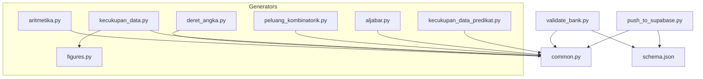
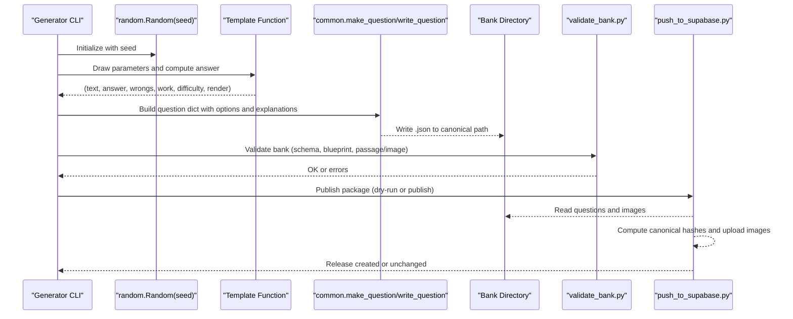
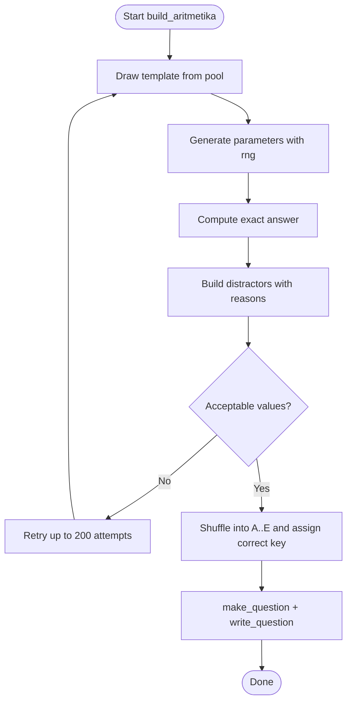
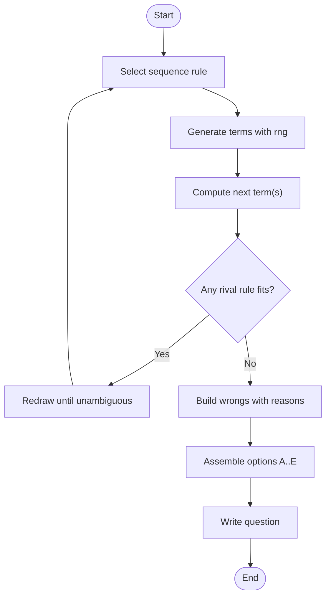
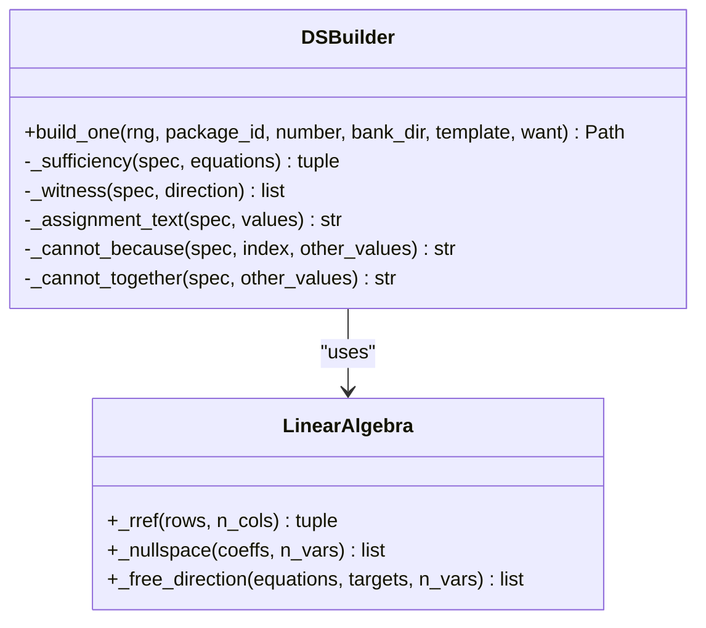
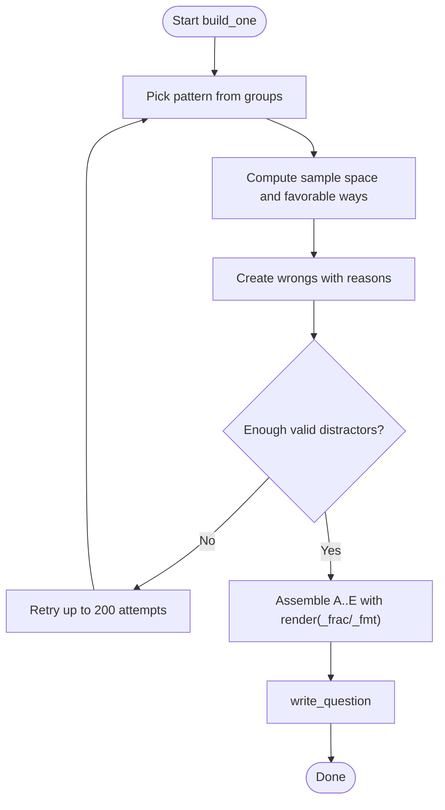
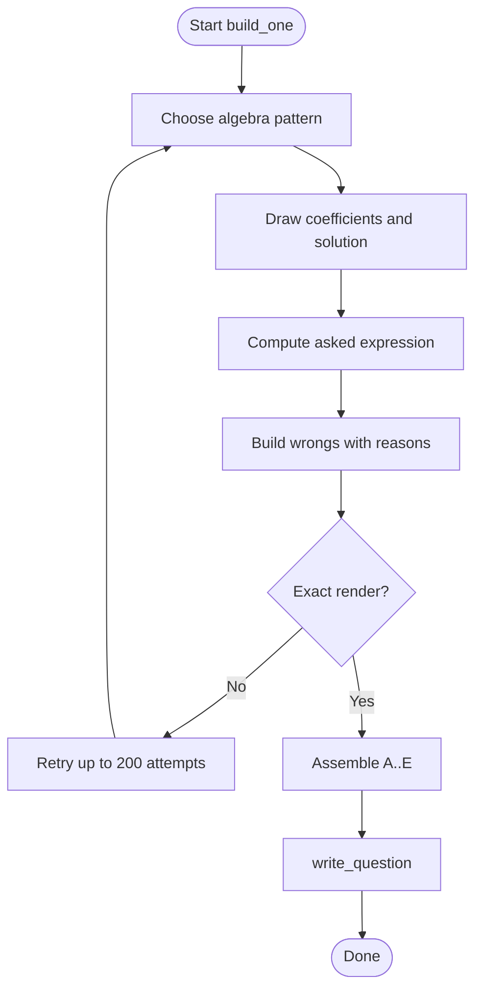
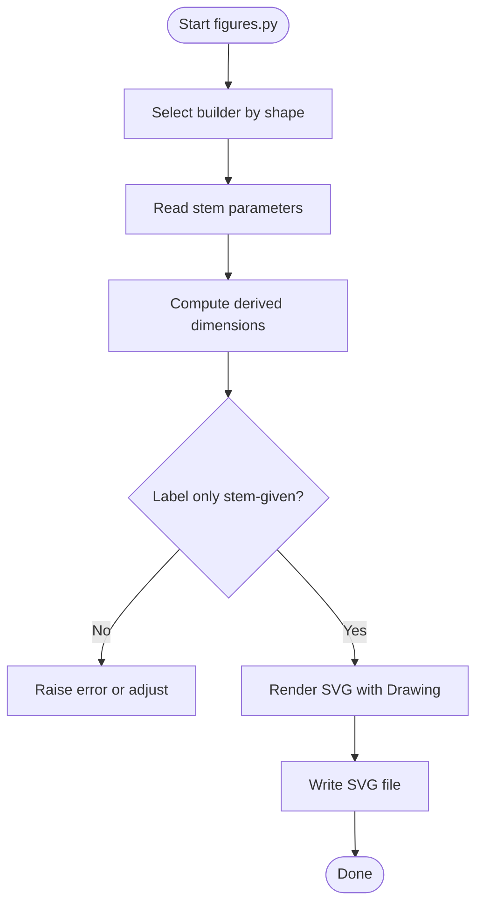
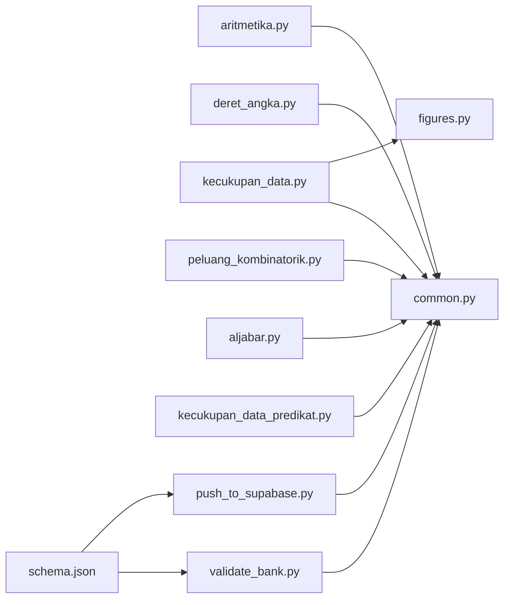

# Python Generator Framework

<cite>
**Referenced Files in This Document**
- [common.py](file://questions/generator/common.py)
- [aritmetika.py](file://questions/generator/aritmetika.py)
- [deret_angka.py](file://questions/generator/deret_angka.py)
- [kecukupan_data.py](file://questions/generator/kecukupan_data.py)
- [peluang_kombinatorik.py](file://questions/generator/peluang_kombinatorik.py)
- [aljabar.py](file://questions/generator/aljabar.py)
- [figures.py](file://questions/generator/figures.py)
- [kecukupan_data_predikat.py](file://questions/generator/kecukupan_data_predikat.py)
- [validate_bank.py](file://questions/generator/validate_bank.py)
- [push_to_supabase.py](file://questions/generator/push_to_supabase.py)
- [schema.json](file://questions/schema.json)
</cite>

## Table of Contents
1. Introduction
2. Project Structure
3. Core Components
4. Architecture Overview
5. Detailed Component Analysis
6. Dependency Analysis
7. Performance Considerations
8. Troubleshooting Guide
9. Conclusion
10. Appendices

## Introduction
This document explains the deterministic question generation framework used to produce exam questions for the LPDP TBS test. The system generates reproducible items across several quantitative types: arithmetic, number sequences, data sufficiency, probability and combinatorics, algebra, and figure-based geometry. Every generator uses a seeded random engine so that the same inputs always produce the same outputs. Distractors are constructed from named mistakes, answers are computed rather than guessed, and all generated questions conform to a shared JSON schema and validation pipeline.

The framework is organized around:
- A shared utilities module providing formatting, numbering, writing, and schema helpers.
- Per-type generators that implement pattern families and build question objects.
- A figures module that deterministically renders SVGs from stem parameters.
- Validation and publishing tools that enforce schema, blueprint counts, and content-addressed image storage before release.

## Project Structure
At a high level:
- Shared utilities live in common.py and define the question schema contract, subtest/blueprint metadata, and helpers for building and persisting questions.
- Each generator module implements one or more question types with deterministic templates and a consistent build_one() workflow.
- figures.py produces SVG images deterministically from numeric parameters and supports schematic diagrams for data-sufficiency geometry.
- validate_bank.py enforces schema, blueprint constraints, and consistency rules across the entire bank.
- push_to_supabase.py publishes validated packages to Supabase with content-addressed images and canonical hashing.

**Diagram sources**
- [common.py:13-17](file://questions/generator/common.py#L13-L17)
- [schema.json:1-98](file://questions/schema.json#L1-L98)

**Section sources**
- [common.py:13-17](file://questions/generator/common.py#L13-L17)
- [schema.json:1-98](file://questions/schema.json#L1-L98)

## Core Components
The core components enable deterministic generation, consistent formatting, and reliable persistence:

- Deterministic RNG: Each generator constructs its own random.Random(seed) instance to ensure reproducibility.
- Number formatting: fmt_number formats values in Indonesian style (comma decimals, dot thousands, typographic minus), preserving exact fractions when needed.
- Question assembly: make_question validates option keys, correct_option, explanations coverage, and allowed type/subtest mapping; it returns a canonical question dict.
- Persistence: write_question writes to the canonical path under questions/bank/<package>/<subtest>/<NNN>.json and refuses overwrites.
- Blueprint and types: BLUEPRINT defines subtest counts, durations, and passing grades; TYPES_BY_SUBTEST constrains which types may appear where.
- Schema enforcement: load_schema reads questions/schema.json; validate_bank.py runs Draft202012Validator against every question file.

Key responsibilities by component:
- common.py: shared constants, formatting, numbering, question builder, writer, and iteration helpers.
- Figures: deterministic SVG builders for measured and schematic diagrams, with strict labeling rules to avoid leaking answers.
- Validators/Publishers: validate_bank.py checks schema, blueprint, passage/image requirements, and uniqueness; push_to_supabase.py uploads images content-addressedly and publishes via RPC with canonical hashing.

**Section sources**
- [common.py:77-127](file://questions/generator/common.py#L77-L127)
- [common.py:135-207](file://questions/generator/common.py#L135-L207)
- [figures.py:139-165](file://questions/generator/figures.py#L139-L165)
- [validate_bank.py:44-194](file://questions/generator/validate_bank.py#L44-L194)
- [push_to_supabase.py:122-298](file://questions/generator/push_to_supabase.py#L122-L298)

## Architecture Overview
The architecture follows a template-driven, deterministic pipeline:

- Template selection: Each generator groups patterns by reasoning shape and draws without replacement per package to avoid repetition.
- Parameterization: Templates draw parameters from a seeded RNG and compute answers exactly using Fraction or integer math.
- Distractor construction: Distractors are built as (value, reason) pairs tied to specific mistakes; they are de-duplicated and shuffled into options A–E.
- Question assembly: make_question enforces schema and type/subtest constraints; write_question persists to disk.
- Validation: validate_bank.py ensures schema compliance, blueprint counts, unique numbering, and stimulus requirements.
- Publishing: push_to_supabase.py computes canonical hashes, uploads images content-addressedly, and publishes releases atomically.

**Diagram sources**
- [aritmetika.py:792-800](file://questions/generator/aritmetika.py#L792-L800)
- [deret_angka.py:1-35](file://questions/generator/deret_angka.py#L1-L35)
- [kecukupan_data.py:792-800](file://questions/generator/kecukupan_data.py#L792-L800)
- [peluang_kombinatorik.py:451-525](file://questions/generator/peluang_kombinatorik.py#L451-L525)
- [aljabar.py:257-325](file://questions/generator/aljabar.py#L257-L325)
- [validate_bank.py:44-194](file://questions/generator/validate_bank.py#L44-L194)
- [push_to_supabase.py:222-298](file://questions/generator/push_to_supabase.py#L222-L298)

## Detailed Component Analysis

### Arithmetic (aritmetika)
Arithmetic covers standard arithmetic operations and quantitative comparison items. It includes:
- Percent calculations, chained percentages, rate/proportion, fraction operations, order-of-operations with fractions, mixed operations, percent change, averages, ratios, powers/roots, decimal chains, weighted group means, reverse discounts.
- Quantitative comparisons (perbandingan_kuantitatif) compare P and Q with options A–D plus a substantive fifth option E that must be computed to reject.

Determinism and quality:
- Distractors are (value, reason) pairs describing precise mistakes.
- Templates are drawn without replacement per package to avoid repeating the same computation shape.
- Values are constrained to render exactly in Indonesian notation unless a template explicitly keeps working in fractions.

Usage example (conceptual):
- python3 aritmetika.py --package 1 --count 6 --type aritmetika --seed 7
- python3 aritmetika.py --package 1 --count 5 --type perbandingan_kuantitatif --seed 7

**Diagram sources**
- [aritmetika.py:493-560](file://questions/generator/aritmetika.py#L493-L560)

**Section sources**
- [aritmetika.py:1-24](file://questions/generator/aritmetika.py#L1-L24)
- [aritmetika.py:464-490](file://questions/generator/aritmetika.py#L464-L490)
- [aritmetika.py:510-560](file://questions/generator/aritmetika.py#L510-L560)
- [aritmetika.py:563-789](file://questions/generator/aritmetika.py#L563-L789)
- [aritmetika.py:792-800](file://questions/generator/aritmetika.py#L792-L800)

### Number Sequences (deret_angka)
Number sequence generators create sequences with a single unambiguous rule. They include:
- Geometric sequences, interleaved arithmetic/geometric tracks, increasing differences, alternating operations, cycling operations with incrementing operands, Fibonacci-like, squares offset, doubling differences, signed arithmetic, oblong numbers, alternating signed squares, square increments, double-minus-primes, fixed four-operation cycles, three-interleaved sequences.

Unambiguity screening:
- Rival-rule checks ensure no alternative reading fits the printed terms but predicts a different continuation. Weak rules are excluded from distractor sets to prevent rewarding misreadings.

Usage example (conceptual):
- python3 deret_angka.py --package 1 --count 5 --blanks 2 --seed 42
- python3 deret_angka.py --package 1 --count 3 --interior --seed 42

**Diagram sources**
- [deret_angka.py:52-197](file://questions/generator/deret_angka.py#L52-L197)
- [deret_angka.py:203-800](file://questions/generator/deret_angka.py#L203-L800)

**Section sources**
- [deret_angka.py:1-35](file://questions/generator/deret_angka.py#L1-L35)
- [deret_angka.py:52-197](file://questions/generator/deret_angka.py#L52-L197)
- [deret_angka.py:203-800](file://questions/generator/deret_angka.py#L203-L800)

### Data Sufficiency (kecukupan_data)
Data sufficiency determines whether statements alone or together determine an answer. The generator uses exact linear algebra:
- RREF and nullspace computations decide sufficiency precisely.
- Witness pairs are generated from null-space directions to prove insufficiency concretely.
- Geometry variants use shared schematic figures to avoid measurement-based solving.

Usage example (conceptual):
- python3 kecukupan_data.py --package 1 --count 2 --seed 7
- python3 kecukupan_data.py --package 1 --count 2 --kind geometry --seed 7

**Diagram sources**
- [kecukupan_data.py:81-140](file://questions/generator/kecukupan_data.py#L81-L140)
- [kecukupan_data.py:684-784](file://questions/generator/kecukupan_data.py#L684-L784)

**Section sources**
- [kecukupan_data.py:1-35](file://questions/generator/kecukupan_data.py#L1-L35)
- [kecukupan_data.py:81-140](file://questions/generator/kecukupan_data.py#L81-L140)
- [kecukupan_data.py:183-433](file://questions/generator/kecukupan_data.py#L183-L433)
- [kecukupan_data.py:455-673](file://questions/generator/kecukupan_data.py#L455-L673)
- [kecukupan_data.py:684-800](file://questions/generator/kecukupan_data.py#L684-L800)

### Probability and Combinatorics (peluang_kombinatorik)
Probability and counting items are computed exactly using combinations and permutations:
- Two-color draws, at-least-one complements, committee composition, arrangements with adjacency constraints, equal splits, dice sums, even three-digit numbers, nonadjacent days, circular nonadjacent seating, lattice paths through checkpoints.

Formatting:
- Probabilities print as reduced fractions, never decimals, matching exam conventions.

Usage example (conceptual):
- python3 peluang_kombinatorik.py --package 1 --count 2 --subtest pemecahan_masalah --seed 7

**Diagram sources**
- [peluang_kombinatorik.py:431-448](file://questions/generator/peluang_kombinatorik.py#L431-L448)
- [peluang_kombinatorik.py:451-492](file://questions/generator/peluang_kombinatorik.py#L451-L492)

**Section sources**
- [peluang_kombinatorik.py:1-28](file://questions/generator/peluang_kombinatorik.py#L1-L28)
- [peluang_kombinatorik.py:60-427](file://questions/generator/peluang_kombinatorik.py#L60-L427)
- [peluang_kombinatorik.py:431-492](file://questions/generator/peluang_kombinatorik.py#L431-L492)
- [peluang_kombinatorik.py:495-525](file://questions/generator/peluang_kombinatorik.py#L495-L525)

### Algebra (aljabar)
Algebra covers:
- Isolating x in linear equations, fractional equations, two-variable systems asking for k(x+y), quadratic substitution, symmetric identities (x^2 + y^2 from x+y and xy).

Quality:
- Distractors are tied to specific algebraic slips; values must render exactly in Indonesian notation.

Usage example (conceptual):
- python3 aljabar.py --package 1 --count 3 --seed 7

**Diagram sources**
- [aljabar.py:247-254](file://questions/generator/aljabar.py#L247-L254)
- [aljabar.py:257-301](file://questions/generator/aljabar.py#L257-L301)

**Section sources**
- [aljabar.py:1-23](file://questions/generator/aljabar.py#L1-L23)
- [aljabar.py:79-243](file://questions/generator/aljabar.py#L79-L243)
- [aljabar.py:247-301](file://questions/generator/aljabar.py#L247-L301)
- [aljabar.py:304-325](file://questions/generator/aljabar.py#L304-L325)

### Figure-Based Questions (figures)
Figures are deterministic SVGs derived from stem parameters:
- Measured drawings scale with given dimensions; labels only show what the stem states. Derived quantities are computed internally but never labeled to avoid giving away answers.
- Schematic figures for data-sufficiency geometry are generic and not drawn to scale, preventing measurement-based solutions.

Supported shapes include rectangles with inner squares, cylinders, trapezoids, cuboids, sectors, rhombi, cones, parallelograms, annular tracks, right triangles with parallel cuts, triangular prisms, kites, and square pyramids.

Usage example (conceptual):
- python3 figures.py --check to verify files match source
- python3 figures.py --only <question-id> to regenerate a specific figure
- python3 figures.py --link to point each question’s image field to its file

**Diagram sources**
- [figures.py:139-165](file://questions/generator/figures.py#L139-L165)
- [figures.py:170-768](file://questions/generator/figures.py#L170-L768)
- [figures.py:770-800](file://questions/generator/figures.py#L770-L800)

**Section sources**
- [figures.py:1-30](file://questions/generator/figures.py#L1-L30)
- [figures.py:139-165](file://questions/generator/figures.py#L139-L165)
- [figures.py:170-768](file://questions/generator/figures.py#L170-L768)
- [figures.py:770-800](file://questions/generator/figures.py#L770-L800)

### Predicate Data Sufficiency (kecukupan_data_predikat)
A companion generator handles yes/no predicate sufficiency questions:
- Uses finite search over positive integers to find counterexamples and symbolic proofs to establish sufficiency.
- Ensures each sufficient claim has a proof and each insufficient claim has witness assignments.

Usage example (conceptual):
- python3 kecukupan_data_predikat.py --package 7 --count 1 --template ratio_vs_sum --seed 42

**Section sources**
- [kecukupan_data_predikat.py:1-20](file://questions/generator/kecukupan_data_predikat.py#L1-L20)
- [kecukupan_data_predikat.py:89-145](file://questions/generator/kecukupan_data_predikat.py#L89-L145)
- [kecukupan_data_predikat.py:152-253](file://questions/generator/kecukupan_data_predikat.py#L152-L253)
- [kecukupan_data_predikat.py:256-282](file://questions/generator/kecukupan_data_predikat.py#L256-L282)

## Dependency Analysis
The dependency graph shows how generators rely on shared utilities and external tools:

**Diagram sources**
- [common.py:13-17](file://questions/generator/common.py#L13-L17)
- [schema.json:1-98](file://questions/schema.json#L1-L98)

**Section sources**
- [common.py:13-17](file://questions/generator/common.py#L13-L17)
- [validate_bank.py:31-41](file://questions/generator/validate_bank.py#L31-L41)
- [push_to_supabase.py:32-35](file://questions/generator/push_to_supabase.py#L32-L35)

## Performance Considerations
- Exact arithmetic: Generators use Fraction to avoid floating-point drift and ensure deterministic boundaries.
- Rejection sampling: Most generators retry up to 200 attempts to find clean draws with acceptable distractors and rendering; this guards quality but can add CPU time for complex templates.
- Unambiguity screening: Sequence generators run multiple rival-rule checks; keep stems short enough to maintain performance while ensuring correctness.
- Image handling: Figures compute derived dimensions once and reuse layout constants; content-addressed uploads avoid redundant transfers during publishing.

[No sources needed since this section provides general guidance]

## Troubleshooting Guide
Common issues and resolutions:
- Duplicate or missing question numbers: validate_bank.py reports duplicates and gaps; ensure next_number() is used consistently and files are named NNN.json.
- Schema violations: validate_bank.py lists schema errors; check required fields, option keys A–E, correct_option presence, and explanation coverage.
- Passage/image mismatches: Types requiring passages or charts must include them; self-contained types should not carry extraneous passages.
- Difficulty mismatch: package_difficulty computes expected band; ensure manifest difficulty matches calculated value.
- Missing images: validate_bank.py flags referenced images not found; ensure images exist under the package directory and paths match schema patterns.
- Publishing failures: push_to_supabase.py requires environment variables SUPABASE_URL and SUPABASE_SERVICE_ROLE_KEY; dry-run mode helps diagnose without uploading.

**Section sources**
- [validate_bank.py:44-194](file://questions/generator/validate_bank.py#L44-L194)
- [push_to_supabase.py:301-346](file://questions/generator/push_to_supabase.py#L301-L346)

## Conclusion
The framework delivers high-quality, deterministic question generation across multiple quantitative domains. By computing answers exactly, constructing meaningful distractors, enforcing schema and blueprint constraints, and producing reproducible figures, it ensures reliability and fairness. Extension points allow adding new templates while maintaining consistency through shared utilities and validation pipelines.

[No sources needed since this section summarizes without analyzing specific files]

## Appendices

### API Usage Patterns
- Arithmetic:
  - python3 aritmetika.py --package 1 --count 6 --type aritmetika --seed 7
  - python3 aritmetika.py --package 1 --count 5 --type perbandingan_kuantitatif --seed 7
- Number sequences:
  - python3 deret_angka.py --package 1 --count 5 --blanks 2 --seed 42
  - python3 deret_angka.py --package 1 --count 3 --interior --seed 42
- Data sufficiency:
  - python3 kecukupan_data.py --package 1 --count 2 --seed 7
  - python3 kecukupan_data.py --package 1 --count 2 --kind geometry --seed 7
- Probability and combinatorics:
  - python3 peluang_kombinatorik.py --package 1 --count 2 --subtest pemecahan_masalah --seed 7
- Algebra:
  - python3 aljabar.py --package 1 --count 3 --seed 7
- Predicate data sufficiency:
  - python3 kecukupan_data_predikat.py --package 7 --count 1 --template ratio_vs_sum --seed 42

**Section sources**
- [aritmetika.py:792-800](file://questions/generator/aritmetika.py#L792-L800)
- [deret_angka.py:1-35](file://questions/generator/deret_angka.py#L1-L35)
- [kecukupan_data.py:32-35](file://questions/generator/kecukupan_data.py#L32-L35)
- [peluang_kombinatorik.py:495-525](file://questions/generator/peluang_kombinatorik.py#L495-L525)
- [aljabar.py:304-325](file://questions/generator/aljabar.py#L304-L325)
- [kecukupan_data_predikat.py:256-282](file://questions/generator/kecukupan_data_predikat.py#L256-L282)

### Extension Points
- Add a new template function returning (text, answer, wrongs, work, difficulty, render) or equivalent structure depending on generator.
- Group patterns by reasoning method to avoid repetition within a package.
- Use common.make_question and write_question to ensure schema compliance and canonical persistence.
- For figures, implement a builder that returns a Drawing and append to FIGURES; run figures.py --link to wire images.
- Integrate with validation by ensuring new types are allowed in TYPES_BY_SUBTEST if applicable.

**Section sources**
- [common.py:167-207](file://questions/generator/common.py#L167-L207)
- [figures.py:22-30](file://questions/generator/figures.py#L22-L30)
- [validate_bank.py:127-139](file://questions/generator/validate_bank.py#L127-L139)