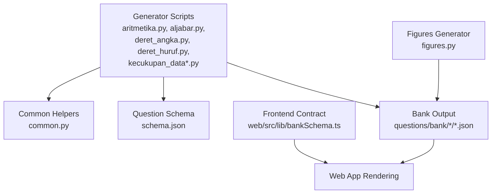
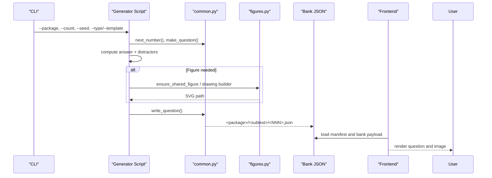
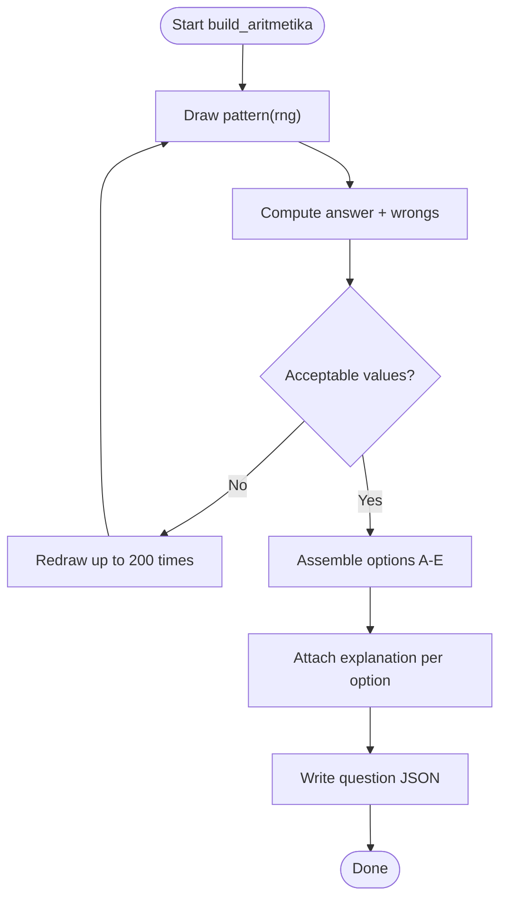
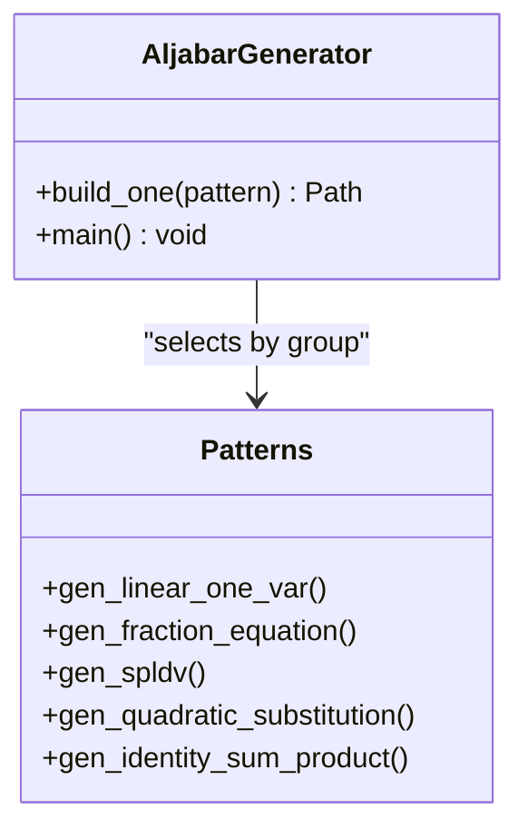
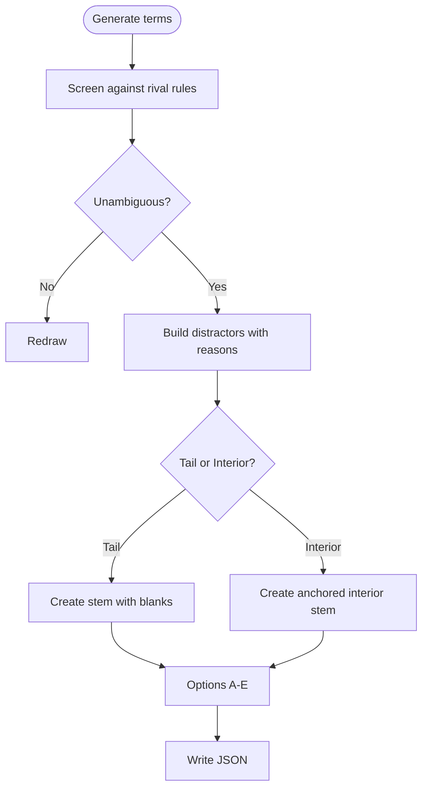
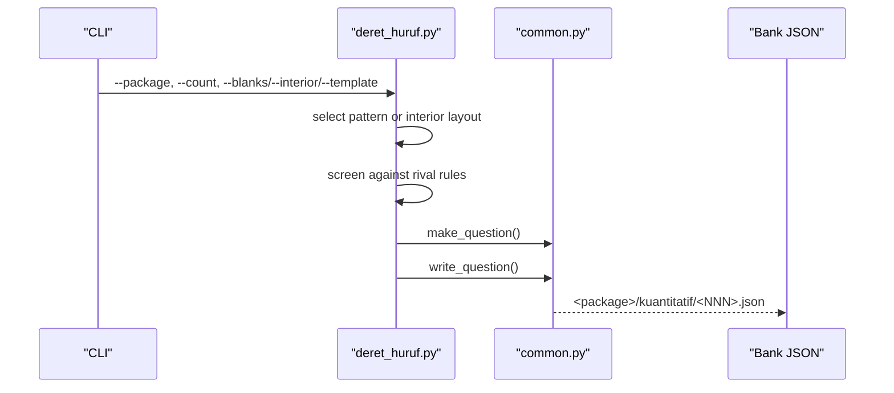
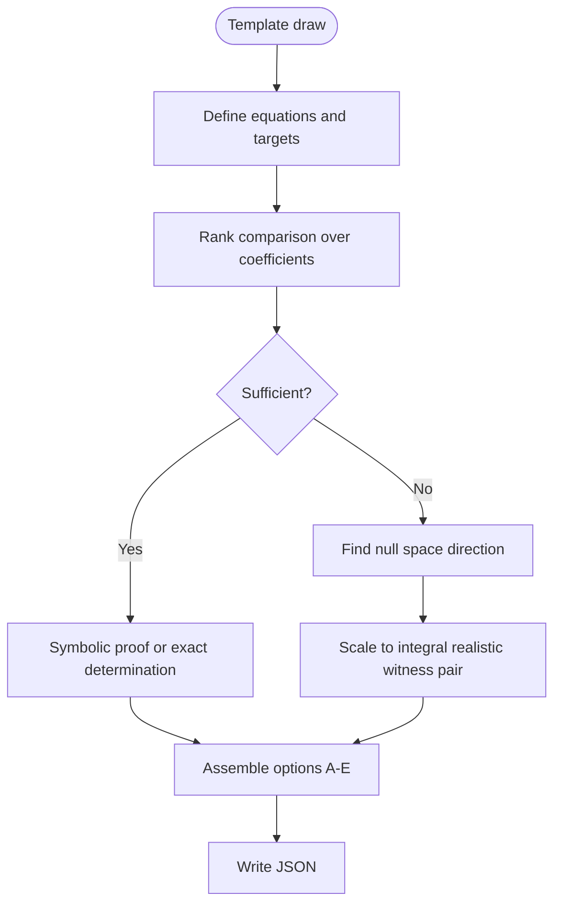
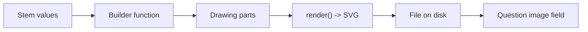
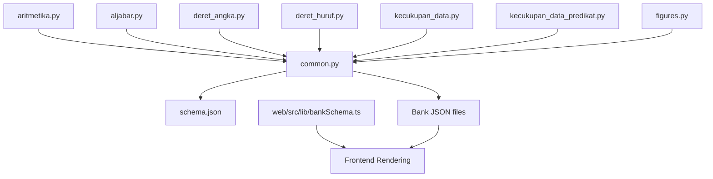

# Quantitative Reasoning Generators

<cite>
**Referenced Files in This Document**
- [README.md](file://questions/generator/README.md)
- [common.py](file://questions/generator/common.py)
- [schema.json](file://questions/schema.json)
- [aritmetika.py](file://questions/generator/aritmetika.py)
- [aljabar.py](file://questions/generator/aljabar.py)
- [deret_angka.py](file://questions/generator/deret_angka.py)
- [deret_huruf.py](file://questions/generator/deret_huruf.py)
- [figures.py](file://questions/generator/figures.py)
- [kecukupan_data.py](file://questions/generator/kecukupan_data.py)
- [kecukupan_data_predikat.py](file://questions/generator/kecukupan_data_predikat.py)
- [001.json](file://questions/bank/1/kuantitatif/001.json)
- [002.json](file://questions/bank/1/kuantitatif/002.json)
- [bankSchema.ts](file://web/src/lib/bankSchema.ts)
</cite>

## Table of Contents
1. [Introduction](#introduction)
2. [Project Structure](#project-structure)
3. [Core Components](#core-components)
4. [Architecture Overview](#architecture-overview)
5. [Detailed Component Analysis](#detailed-component-analysis)
6. [Dependency Analysis](#dependency-analysis)
7. [Performance Considerations](#performance-considerations)
8. [Troubleshooting Guide](#troubleshooting-guide)
9. [Conclusion](#conclusion)
10. [Appendices](#appendices)

## Introduction
This document explains the quantitative reasoning question generators used to produce deterministic, computable items for the kuantitatif subtest. It covers:
- Question types: arithmetic problems, number sequences, letter sequences, algebra problems, data sufficiency, and figure-based questions.
- Algorithms used to generate problems and compute answer keys.
- Parameter configuration options exposed via command-line arguments.
- Difficulty scaling mechanisms and how they are enforced across packages.
- How generated questions map to the frontend rendering system through a strict JSON schema.
- Examples of generated questions and customization options for content creators.

The generators ensure that every distractor is tied to a specific mistake, answers are computed rather than guessed, and stems are screened against rival rules so each item has one defensible reading.

## Project Structure
At a high level:
- The generator scripts live under questions/generator and share common utilities.
- Generated questions are written as JSON files into questions/bank/<package>/<subtest>/<NNN>.json.
- A JSON schema defines the contract between generators and the frontend.
- A figures module generates SVGs for geometry and schematic diagrams.
- The web app consumes the bank artifact according to a TypeScript schema.

**Diagram sources**
- [common.py:13-24](file://questions/generator/common.py#L13-L24)
- [schema.json:1-98](file://questions/schema.json#L1-L98)
- [figures.py:1-30](file://questions/generator/figures.py#L1-L30)
- [bankSchema.ts:20-33](file://web/src/lib/bankSchema.ts#L20-L33)

**Section sources**
- [README.md:1-33](file://questions/generator/README.md#L1-L33)
- [common.py:13-24](file://questions/generator/common.py#L13-L24)
- [schema.json:1-98](file://questions/schema.json#L1-L98)

## Core Components
- Common helpers provide shared formatting, blueprint constraints, question assembly, and file I/O.
- Each generator implements deterministic templates with explicit distractors and explanations.
- Figures module produces measured or schematic SVGs depending on context.
- Frontend contract ensures consistent rendering of questions and images.

Key responsibilities:
- Deterministic generation with seeds and without replacement per package.
- Strict option sets (A–E), required explanations for all options, and difficulty labels.
- Validation against schema and type-per-subtest rules.

**Section sources**
- [common.py:77-96](file://questions/generator/common.py#L77-L96)
- [common.py:99-127](file://questions/generator/common.py#L99-L127)
- [common.py:167-207](file://questions/generator/common.py#L167-L207)
- [schema.json:23-96](file://questions/schema.json#L23-L96)

## Architecture Overview
Generators follow a uniform flow:
1. Choose a template/pattern based on parameters and seed.
2. Compute the correct answer deterministically from construction.
3. Generate distractors as (value, reason) pairs tied to specific mistakes.
4. Assemble a question dict using common.make_question.
5. Write the JSON file to the bank directory.
6. For figure-based items, generate or link an SVG via figures.py.

**Diagram sources**
- [aritmetika.py:792-800](file://questions/generator/aritmetika.py#L792-L800)
- [aljabar.py:304-320](file://questions/generator/aljabar.py#L304-L320)
- [deret_angka.py:1-35](file://questions/generator/deret_angka.py#L1-L35)
- [deret_huruf.py:351-386](file://questions/generator/deret_huruf.py#L351-L386)
- [figures.py:1-30](file://questions/generator/figures.py#L1-L30)
- [bankSchema.ts:20-33](file://web/src/lib/bankSchema.ts#L20-L33)

## Detailed Component Analysis

### Arithmetic Problems (aritmetika)
- Purpose: Generate arithmetic and quantitative comparison items with computed answers and precise distractors.
- Algorithms:
  - Percentages, chained percentages, rates/proportions, fraction operations, order-of-operations with fractions, mixed operations, percent change, averages, ratios, powers/roots, decimal chains, weighted group means, reverse discounts.
  - Quantitative comparison variants compare P vs Q, including indeterminate cases with witness values.
- Parameters:
  - --package, --count, --type aritmetika|perbandingan_kuantitatif, --template (opt-in patterns), --seed, --bank-dir.
- Difficulty:
  - Per-template difficulty labels; multi-step patterns favored to avoid trivial single-step dominance.
- Frontend mapping:
  - Outputs conform to schema.json with five options A–E, explanations for each, and difficulty.

**Diagram sources**
- [aritmetika.py:510-560](file://questions/generator/aritmetika.py#L510-L560)

**Section sources**
- [aritmetika.py:1-24](file://questions/generator/aritmetika.py#L1-L24)
- [aritmetika.py:68-468](file://questions/generator/aritmetika.py#L68-L468)
- [aritmetika.py:493-502](file://questions/generator/aritmetika.py#L493-L502)
- [aritmetika.py:510-560](file://questions/generator/aritmetika.py#L510-L560)
- [aritmetika.py:563-789](file://questions/generator/aritmetika.py#L563-L789)
- [aritmetika.py:792-800](file://questions/generator/aritmetika.py#L792-L800)

### Algebra Problems (aljabar)
- Purpose: Generate linear equations, two-variable systems, quadratic evaluation, and symmetric identities.
- Algorithms:
  - Isolate x in one-variable linear equations.
  - Solve systems and evaluate expressions like k(x + y).
  - Evaluate quadratics at given points, including negative inputs.
  - Apply identities such as x² + y² = (x + y)² − 2xy.
- Parameters:
  - --package, --count, --seed, --bank-dir.
- Difficulty:
  - Grouped by solving method; avoids repeating same method within a package.
- Frontend mapping:
  - Standard schema-compliant output with five options and explanations.

**Diagram sources**
- [aljabar.py:79-242](file://questions/generator/aljabar.py#L79-L242)
- [aljabar.py:245-254](file://questions/generator/aljabar.py#L245-L254)
- [aljabar.py:257-301](file://questions/generator/aljabar.py#L257-L301)
- [aljabar.py:304-320](file://questions/generator/aljabar.py#L304-L320)

**Section sources**
- [aljabar.py:1-23](file://questions/generator/aljabar.py#L1-L23)
- [aljabar.py:79-242](file://questions/generator/aljabar.py#L79-L242)
- [aljabar.py:245-301](file://questions/generator/aljabar.py#L245-L301)
- [aljabar.py:304-320](file://questions/generator/aljabar.py#L304-L320)

### Number Sequences (deret_angka)
- Purpose: Generate number sequence items with tail blanks, interior blanks, and leading layouts.
- Algorithms:
  - Rival-rule screening to ensure unambiguous stems: arithmetic, geometric, second difference, interleaved arithmetic/geometric, three interleaved tracks, alternating differences, Fibonacci-like.
  - Patterns include geometric, two interleaved, increasing differences, alternating operations, cycling operations with incrementing operands, Fibonacci-like, squares offset, doubling differences, signed arithmetic, oblong numbers, alternating signed squares, square increments, double minus primes, fixed four-operation cycle, three interleaved.
- Parameters:
  - --package, --count, --blanks 1|2, --interior, --leading (via README guidance), --template (opt-in), --seed, --bank-dir.
- Difficulty:
  - Pattern-specific difficulty; interior layout considered hardest due to anchor checking.
- Frontend mapping:
  - Schema-compliant JSON with five options and explanations.

**Diagram sources**
- [deret_angka.py:52-197](file://questions/generator/deret_angka.py#L52-L197)
- [deret_angka.py:203-800](file://questions/generator/deret_angka.py#L203-L800)

**Section sources**
- [deret_angka.py:1-35](file://questions/generator/deret_angka.py#L1-L35)
- [deret_angka.py:52-197](file://questions/generator/deret_angka.py#L52-L197)
- [deret_angka.py:203-800](file://questions/generator/deret_angka.py#L203-L800)

### Letter Sequences (deret_huruf)
- Purpose: Generate letter-sequence items with tail blanks (one or two) and interior anchored shapes.
- Algorithms:
  - Convert letters to positions A=1..Z=26; compute continuation from selected rule.
  - Rival-rule screening: constant step, accelerating steps, interleaved tracks, cycles, modular steps.
  - Patterns include increasing steps, opposite interleaved, accelerating interleaved, four-step cycle, five-step modulo.
- Parameters:
  - --package, --count, --blanks 1|2, --interior, --template, --seed, --bank-dir.
- Difficulty:
  - Pattern-specific; interior layout treated as hard.
- Frontend mapping:
  - Schema-compliant JSON with five options and explanations.

**Diagram sources**
- [deret_huruf.py:1-18](file://questions/generator/deret_huruf.py#L1-L18)
- [deret_huruf.py:39-108](file://questions/generator/deret_huruf.py#L39-L108)
- [deret_huruf.py:111-244](file://questions/generator/deret_huruf.py#L111-L244)
- [deret_huruf.py:247-348](file://questions/generator/deret_huruf.py#L247-L348)
- [deret_huruf.py:351-386](file://questions/generator/deret_huruf.py#L351-L386)

**Section sources**
- [deret_huruf.py:1-18](file://questions/generator/deret_huruf.py#L1-L18)
- [deret_huruf.py:39-108](file://questions/generator/deret_huruf.py#L39-L108)
- [deret_huruf.py:111-244](file://questions/generator/deret_huruf.py#L111-L244)
- [deret_huruf.py:247-348](file://questions/generator/deret_huruf.py#L247-L348)
- [deret_huruf.py:351-386](file://questions/generator/deret_huruf.py#L351-L386)

### Data Sufficiency (kecukupan_data and predicate variant)
- Purpose: Generate data sufficiency items where the key is a claim about sufficiency, not just a numeric answer.
- Algorithms:
  - Exact linear algebra over Fractions to determine if quantities are pinned down; rank comparison decides sufficiency.
  - Witness pairs for “not sufficient” claims, found in null space and scaled to realistic integer assignments.
  - Predicate variant uses symbolic equivalence for proofs plus exhaustive positive-integer witnesses for insufficiency.
- Parameters:
  - --package, --count, --kind geometry (for figure-backed items), --template (predicate variant), --seed, --bank-dir.
- Difficulty:
  - Template-specific; geometry items use schematic figures to avoid measurement-based solutions.
- Frontend mapping:
  - Uses standard OPTIONS set and PROMPT; outputs schema-compliant JSON.

**Diagram sources**
- [kecukupan_data.py:1-35](file://questions/generator/kecukupan_data.py#L1-L35)
- [kecukupan_data.py:79-140](file://questions/generator/kecukupan_data.py#L79-L140)
- [kecukupan_data_predikat.py:1-20](file://questions/generator/kecukupan_data_predikat.py#L1-L20)

**Section sources**
- [kecukupan_data.py:1-35](file://questions/generator/kecukupan_data.py#L1-L35)
- [kecukupan_data.py:79-140](file://questions/generator/kecukupan_data.py#L79-L140)
- [kecukupan_data_predikat.py:1-20](file://questions/generator/kecukupan_data_predikat.py#L1-L20)

### Figure-Based Questions (figures)
- Purpose: Generate SVGs for geometry items and schematic diagrams for data sufficiency families.
- Rules:
  - Measured figures scale with stem values; derived quantities are computed but never labeled.
  - Schematic figures carry no values; they show relationships (parallel lines, right angles) and include a “not drawn to scale” note.
- Builders:
  - Rectangle with inner square, cylinder, trapezoid, cuboid, circular sector, rhombus, cone, parallelogram, annular track, right triangle parallel cut, triangular prism, kite, square pyramid.
- Usage:
  - --check validates SVGs against builders; --link attaches image paths to questions.

**Diagram sources**
- [figures.py:1-30](file://questions/generator/figures.py#L1-L30)
- [figures.py:71-165](file://questions/generator/figures.py#L71-L165)
- [figures.py:170-778](file://questions/generator/figures.py#L170-L778)

**Section sources**
- [figures.py:1-30](file://questions/generator/figures.py#L1-L30)
- [figures.py:71-165](file://questions/generator/figures.py#L71-L165)
- [figures.py:170-778](file://questions/generator/figures.py#L170-L778)

## Dependency Analysis
- Generators depend on common.py for formatting, validation, and writing questions.
- Figures module depends on common for iterating bank questions and linking images.
- Frontend depends on bankSchema.ts to parse manifests and enforce compatibility.
- Type-per-subtest enforcement occurs in common.py, ensuring only allowed types appear in each subtest.

**Diagram sources**
- [common.py:29-68](file://questions/generator/common.py#L29-L68)
- [schema.json:23-55](file://questions/schema.json#L23-L55)
- [bankSchema.ts:20-33](file://web/src/lib/bankSchema.ts#L20-L33)

**Section sources**
- [common.py:29-68](file://questions/generator/common.py#L29-L68)
- [schema.json:23-55](file://questions/schema.json#L23-L55)
- [bankSchema.ts:20-33](file://web/src/lib/bankSchema.ts#L20-L33)

## Performance Considerations
- Deterministic draws with seeds reduce variability and enable reproducible testing.
- Without-replacement selection per package avoids duplicate computations and ensures diversity.
- Rival-rule screening prevents ambiguous stems, reducing post-generation corrections.
- Exact arithmetic with Fractions avoids floating-point drift and ensures stable formatting.
- Filtering distractors by magnitude and printability keeps option lists clean and testable.

[No sources needed since this section provides general guidance]

## Troubleshooting Guide
Common issues and resolutions:
- Overwrite protection: write_question refuses to overwrite existing files; choose a new number or remove the file first.
- Invalid JSON: iter_bank_questions yields errors for malformed files; fix JSON structure before re-running validators.
- Type mismatch: make_question enforces allowed types per subtest; adjust qtype or subtest accordingly.
- Non-renderable values: fmt_number falls back to fraction notation for non-terminating decimals; regenerate with different parameters to get terminating decimals.
- Ambiguous sequences: deret_angka and deret_huruf screen against rival rules; if rejected, redraw until unambiguous.

**Section sources**
- [common.py:154-164](file://questions/generator/common.py#L154-L164)
- [common.py:167-207](file://questions/generator/common.py#L167-L207)
- [common.py:210-218](file://questions/generator/common.py#L210-L218)
- [deret_angka.py:190-197](file://questions/generator/deret_angka.py#L190-L197)
- [deret_huruf.py:106-108](file://questions/generator/deret_huruf.py#L106-L108)

## Conclusion
The quantitative reasoning generators produce high-quality, deterministic items with computed answers, precise distractors, and robust validation. They support multiple question types, configurable parameters, and difficulty scaling, while ensuring compatibility with the frontend through a strict schema. Figures are generated consistently, and data sufficiency items rely on exact linear algebra to guarantee correctness.

[No sources needed since this section summarizes without analyzing specific files]

## Appendices

### Example Questions
- Arithmetic average example: see generated question showing mean calculation after adding a value.
- Rate/proportion example: see generated question computing copies produced over time.

**Section sources**
- [001.json:1-44](file://questions/bank/1/kuantitatif/001.json#L1-L44)
- [002.json:1-44](file://questions/bank/1/kuantitatif/002.json#L1-L44)

### Configuration Options Summary
- Common: --package, --count, --seed, --bank-dir.
- Arithmetic: --type aritmetika|perbandingan_kuantitatif, --template (opt-in patterns).
- Algebra: --count, --seed, --bank-dir.
- Number sequences: --blanks 1|2, --interior, --leading (via README), --template (opt-in).
- Letter sequences: --blanks 1|2, --interior, --template, --seed, --bank-dir.
- Data sufficiency: --kind geometry, --template (predicate variant), --seed, --bank-dir.
- Figures: --check, --only, --link.

**Section sources**
- [README.md:9-22](file://questions/generator/README.md#L9-L22)
- [aritmetika.py:792-800](file://questions/generator/aritmetika.py#L792-L800)
- [aljabar.py:304-320](file://questions/generator/aljabar.py#L304-L320)
- [deret_angka.py:1-35](file://questions/generator/deret_angka.py#L1-L35)
- [deret_huruf.py:351-386](file://questions/generator/deret_huruf.py#L351-L386)
- [figures.py:25-30](file://questions/generator/figures.py#L25-L30)

### Frontend Mapping
- The bank artifact follows a manifest schema with versioning and integrity checks.
- Questions conform to schema.json fields: id, package, subtest, number, type, question_text, image, passage, options, correct_option, explanations, difficulty, source, verified.
- Images reference relative paths under the package directory; figures.py links them appropriately.

**Section sources**
- [bankSchema.ts:20-33](file://web/src/lib/bankSchema.ts#L20-L33)
- [schema.json:23-96](file://questions/schema.json#L23-L96)
- [figures.py:25-30](file://questions/generator/figures.py#L25-L30)