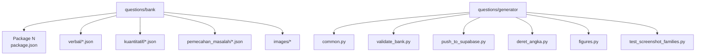
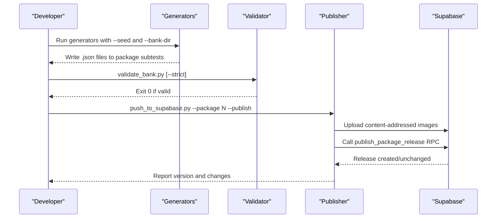
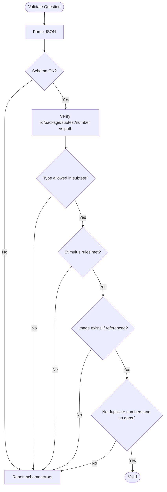
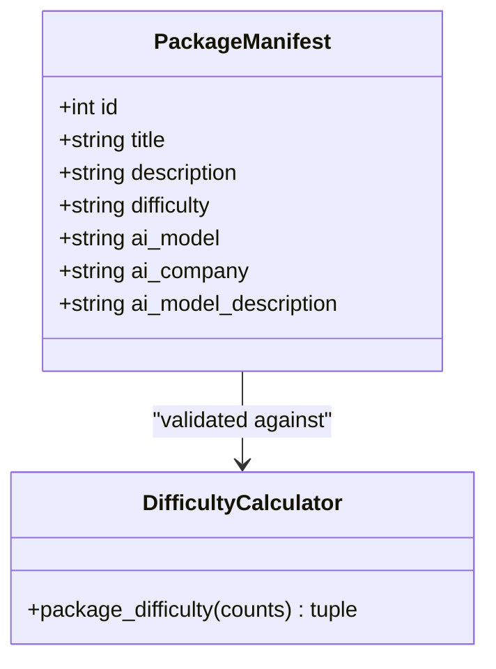
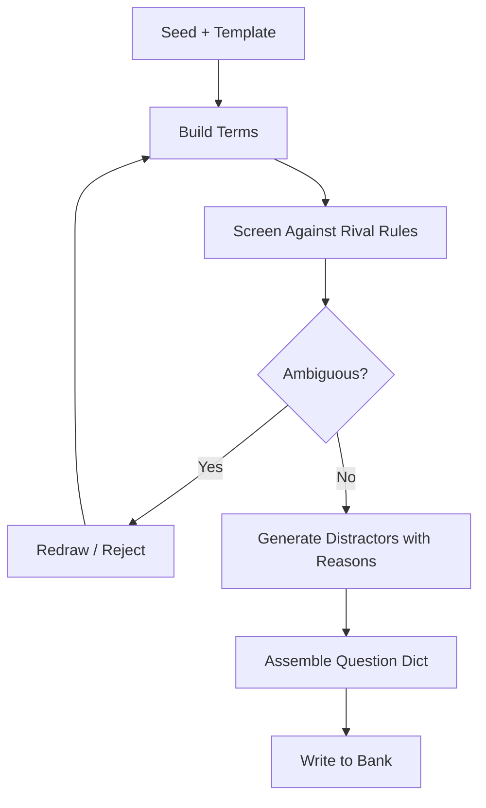
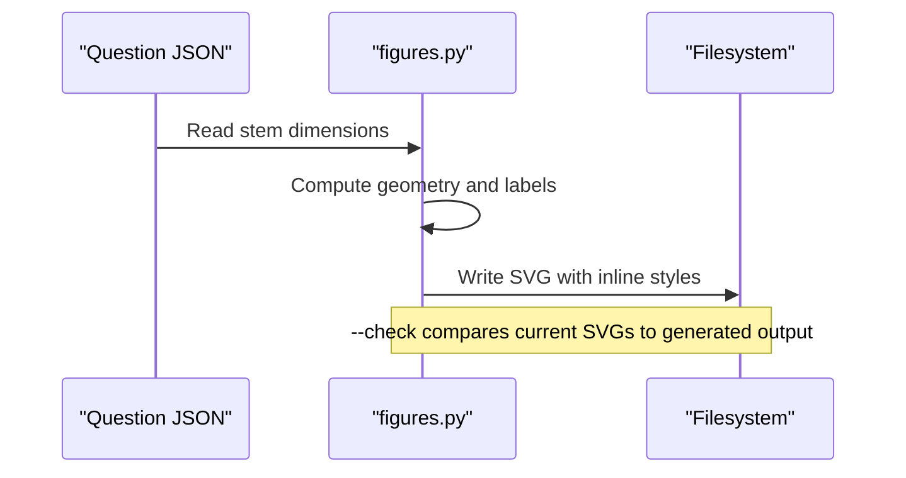
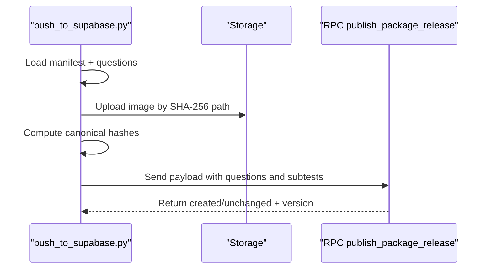
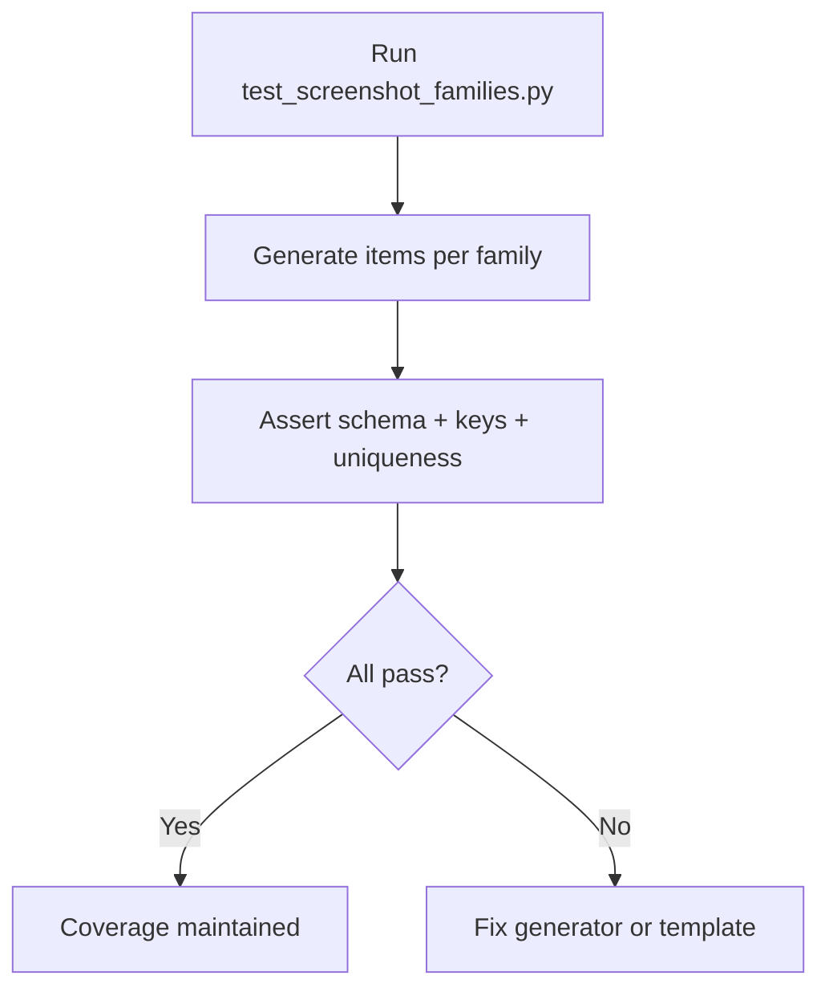
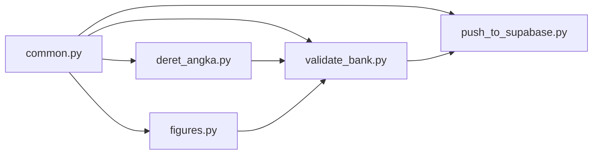

# Question Bank System

<cite>
**Referenced Files in This Document**
- [schema.json](file://questions/schema.json)
- [common.py](file://questions/generator/common.py)
- [validate_bank.py](file://questions/generator/validate_bank.py)
- [test_screenshot_families.py](file://questions/generator/test_screenshot_families.py)
- [push_to_supabase.py](file://questions/generator/push_to_supabase.py)
- [deret_angka.py](file://questions/generator/deret_angka.py)
- [figures.py](file://questions/generator/figures.py)
- [package.json](file://questions/bank/1/package.json)
- [README.md (bank)](file://questions/bank/README.md)
- [README.md (generator)](file://questions/generator/README.md)
- [COVERAGE.md](file://questions/generator/COVERAGE.md)
- [bump_version.py](file://scripts/bump_version.py)
</cite>

## Table of Contents
1. Introduction
2. Project Structure
3. Core Components
4. Architecture Overview
5. Detailed Component Analysis
6. Dependency Analysis
7. Performance Considerations
8. Troubleshooting Guide
9. Conclusion
10. Appendices

## Introduction
This document describes the Git-versioned question bank and the Python-based deterministic generation framework used to produce verbal, quantitative, and problem-solving questions for the LPDP TBS exam simulation. It explains the JSON schema and validation rules, the package organization by subtests, the versioning and publishing workflow, and the testing and coverage processes that ensure quality and reproducibility.

## Project Structure
The repository organizes questions as a Git-tracked bank under questions/bank, with each package representing a complete test set. Each package contains:
- A manifest file describing metadata and difficulty
- Three subtest directories: verbal, kuantitatif, pemecahan_masalah
- An images directory for figures referenced by questions
- One JSON file per question, named with a three-digit sequence number

Generator scripts live under questions/generator and provide deterministic creation of computable question types, shared utilities, validation, screenshot-family regression tests, and a publisher to Supabase.

**Diagram sources**
- [package.json:1-10](file://questions/bank/1/package.json#L1-L10)
- [common.py:13-17](file://questions/generator/common.py#L13-L17)
- [validate_bank.py:1-19](file://questions/generator/validate_bank.py#L1-L19)
- [push_to_supabase.py:1-16](file://questions/generator/push_to_supabase.py#L1-L16)
- [deret_angka.py:1-35](file://questions/generator/deret_angka.py#L1-L35)
- [figures.py:1-30](file://questions/generator/figures.py#L1-L30)
- [test_screenshot_families.py:1-19](file://questions/generator/test_screenshot_families.py#L1-L19)

**Section sources**
- [README.md (bank):1-3](file://questions/bank/README.md#L1-L3)
- [README.md (generator):1-33](file://questions/generator/README.md#L1-L33)

## Core Components
- JSON Schema: Defines the contract for every question file, including required fields, allowed values, and constraints on options, explanations, image paths, and passage usage.
- Shared Utilities: Provide blueprint definitions, type-to-subtest mapping, canonical ID generation, formatting helpers, and safe file writing.
- Validator: Enforces schema conformance, path-field consistency, option/explanation integrity, stimulus requirements, numbering continuity, and optional strict blueprint enforcement.
- Deterministic Generators: Produce computable questions with computed answer keys, rival-rule screening, and explanation pairing for distractors.
- Figures Generator: Generates SVGs deterministically from stem data and enforces that only given quantities are labeled.
- Publisher: Validates a full package, uploads content-addressed images, computes canonical hashes, and publishes an immutable release via a Postgres RPC.
- Regression Tests: Validate new generator families and predicate-sufficiency templates against the schema and expected keys.

**Section sources**
- [schema.json:1-98](file://questions/schema.json#L1-L98)
- [common.py:17-68](file://questions/generator/common.py#L17-L68)
- [validate_bank.py:44-194](file://questions/generator/validate_bank.py#L44-L194)
- [deret_angka.py:1-35](file://questions/generator/deret_angka.py#L1-L35)
- [figures.py:1-30](file://questions/generator/figures.py#L1-L30)
- [push_to_supabase.py:122-298](file://questions/generator/push_to_supabase.py#L122-L298)
- [test_screenshot_families.py:21-115](file://questions/generator/test_screenshot_families.py#L21-L115)

## Architecture Overview
The system follows a deterministic pipeline:
- Author or generate questions into Git-tracked packages under questions/bank.
- Validate all questions and manifests using the validator.
- Optionally run screenshot-family tests to cover new generator logic.
- Publish validated packages to Supabase with content-addressed images and canonical hashing.

**Diagram sources**
- [validate_bank.py:197-208](file://questions/generator/validate_bank.py#L197-L208)
- [push_to_supabase.py:301-346](file://questions/generator/push_to_supabase.py#L301-L346)
- [push_to_supabase.py:107-119](file://questions/generator/push_to_supabase.py#L107-L119)

## Detailed Component Analysis

### JSON Schema and Validation Rules
- Required fields include stable id derived from path, package identifier, subtest category, sequential number, type, question text, image or null, passage or null, five ordered options, correct option, explanations for all options, difficulty, source, and verified flag.
- Type is constrained per subtest by the shared TYPES_BY_SUBTEST mapping; the schema itself lists all supported types but defers subtest compatibility to validation.
- Image paths must be relative to the package directory and match allowed extensions.
- Passage is required for reading and text-analysis types; for data interpretation it may be provided as text or chart image.
- Options must be exactly A–E in order; explanations must cover all five keys.
- Numbering must be contiguous per subtest without duplicates.

**Diagram sources**
- [schema.json:7-96](file://questions/schema.json#L7-L96)
- [common.py:29-68](file://questions/generator/common.py#L29-L68)
- [validate_bank.py:96-163](file://questions/generator/validate_bank.py#L96-L163)

**Section sources**
- [schema.json:1-98](file://questions/schema.json#L1-L98)
- [validate_bank.py:44-194](file://questions/generator/validate_bank.py#L44-L194)

### Package Manifest and Versioning Strategy
- Each package has a manifest with id, title, description, difficulty, and AI model attribution fields.
- Difficulty in the manifest must match the calculated difficulty derived from per-question difficulty weights.
- The app-level version bump script updates Tauri and web artifacts consistently across configuration files.

**Diagram sources**
- [package.json:1-10](file://questions/bank/1/package.json#L1-L10)
- [common.py:77-96](file://questions/generator/common.py#L77-L96)
- [push_to_supabase.py:159-165](file://questions/generator/push_to_supabase.py#L159-L165)
- [bump_version.py:1-124](file://scripts/bump_version.py#L1-L124)

**Section sources**
- [package.json:1-10](file://questions/bank/1/package.json#L1-L10)
- [common.py:77-96](file://questions/generator/common.py#L77-L96)
- [push_to_supabase.py:159-165](file://questions/generator/push_to_supabase.py#L159-L165)
- [bump_version.py:1-124](file://scripts/bump_version.py#L1-L124)

### Deterministic Generation Framework
- Generators compute answers from construction rather than guessing, ensuring correctness by design.
- Rival-rule screening prevents ambiguous stems by rejecting candidates where alternative patterns fit the printed terms but predict different continuations.
- Distractor explanations are paired with their values so each option’s justification is self-contained.
- Specialized modes support interior blanks, leading blanks, two-blank tails, and multi-track sequences.

**Diagram sources**
- [deret_angka.py:1-35](file://questions/generator/deret_angka.py#L1-L35)
- [deret_angka.py:52-196](file://questions/generator/deret_angka.py#L52-L196)
- [common.py:167-207](file://questions/generator/common.py#L167-L207)

**Section sources**
- [deret_angka.py:1-35](file://questions/generator/deret_angka.py#L1-L35)
- [deret_angka.py:52-196](file://questions/generator/deret_angka.py#L52-L196)
- [common.py:167-207](file://questions/generator/common.py#L167-L207)

### Figures and Visual Assets
- Figures are generated deterministically from stem-provided dimensions; no hand edits are allowed.
- A builder returns a Drawing object; rendering produces inline-styled SVGs suitable for storage serving.
- The tool can regenerate all figures, check for drift, and link questions to their figure files.

**Diagram sources**
- [figures.py:1-30](file://questions/generator/figures.py#L1-L30)
- [figures.py:139-165](file://questions/generator/figures.py#L139-L165)

**Section sources**
- [figures.py:1-30](file://questions/generator/figures.py#L1-L30)
- [figures.py:139-165](file://questions/generator/figures.py#L139-L165)

### Publishing Workflow
- The publisher loads a package manifest and all questions, validates counts and difficulty, uploads images under content-addressed paths, computes canonical hashes, and calls the server RPC to create or update a release.
- Dry-run mode computes everything without network writes; actual publishing requires environment credentials.

**Diagram sources**
- [push_to_supabase.py:122-298](file://questions/generator/push_to_supabase.py#L122-L298)
- [push_to_supabase.py:301-346](file://questions/generator/push_to_supabase.py#L301-L346)

**Section sources**
- [push_to_supabase.py:122-298](file://questions/generator/push_to_supabase.py#L122-L298)
- [push_to_supabase.py:301-346](file://questions/generator/push_to_supabase.py#L301-L346)

### Testing and Coverage
- Screenshot-family tests exercise new letter/number layouts and predicate-sufficiency templates, asserting schema validity, unique options, and expected keys.
- Coverage documentation maps tutorial screenshots to implemented generator capabilities and outlines a recipe for building new packages.

**Diagram sources**
- [test_screenshot_families.py:21-115](file://questions/generator/test_screenshot_families.py#L21-L115)
- [COVERAGE.md:1-45](file://questions/generator/COVERAGE.md#L1-L45)

**Section sources**
- [test_screenshot_families.py:21-115](file://questions/generator/test_screenshot_families.py#L21-L115)
- [COVERAGE.md:1-45](file://questions/generator/COVERAGE.md#L1-L45)

## Dependency Analysis
- common.py centralizes blueprint, type allowances, ID generation, and question assembly; both validators and publishers depend on it.
- validate_bank.py depends on jsonschema and common to enforce schema and blueprint constraints.
- Generators depend on common for safe writing and formatting; deret_angka.py implements its own rival-rule screening.
- figures.py depends on common for iterating questions and linking assets.
- push_to_supabase.py depends on common for iteration and difficulty calculation and uses requests to interact with Supabase.

**Diagram sources**
- [common.py:13-17](file://questions/generator/common.py#L13-L17)
- [validate_bank.py:31-41](file://questions/generator/validate_bank.py#L31-L41)
- [push_to_supabase.py:32-35](file://questions/generator/push_to_supabase.py#L32-L35)
- [deret_angka.py:37-47](file://questions/generator/deret_angka.py#L37-L47)
- [figures.py:32-43](file://questions/generator/figures.py#L32-L43)

**Section sources**
- [common.py:13-17](file://questions/generator/common.py#L13-L17)
- [validate_bank.py:31-41](file://questions/generator/validate_bank.py#L31-L41)
- [push_to_supabase.py:32-35](file://questions/generator/push_to_supabase.py#L32-L35)
- [deret_angka.py:37-47](file://questions/generator/deret_angka.py#L37-L47)
- [figures.py:32-43](file://questions/generator/figures.py#L32-L43)

## Performance Considerations
- Deterministic generation with seeds ensures reproducible outputs and avoids repeated computation during validation and publishing.
- Content-addressed image uploads prevent redundant transfers and enable idempotent publishing.
- Strict validation catches structural issues early, reducing downstream failures.
- Canonical hashing aligns client and server representations, minimizing reconciliation overhead.

[No sources needed since this section provides general guidance]

## Troubleshooting Guide
Common issues and resolutions:
- Schema violations: Use validate_bank.py to identify exact field locations and messages; fix JSON structure or values accordingly.
- Missing or mismatched images: Ensure referenced images exist under the package’s images directory and follow allowed extensions.
- Incorrect type-subtest mapping: Confirm the question type is allowed in its subtest per TYPES_BY_SUBTEST.
- Non-contiguous numbering: Ensure no duplicate or missing question numbers within a subtest.
- Difficulty mismatch: Recalculate difficulty based on per-question difficulties; update the manifest to match the computed value.
- Publishing failures: Verify environment variables for Supabase URL and service role key; use dry-run to preview uploads and hashes.

**Section sources**
- [validate_bank.py:44-194](file://questions/generator/validate_bank.py#L44-L194)
- [push_to_supabase.py:301-346](file://questions/generator/push_to_supabase.py#L301-L346)

## Conclusion
The question bank system combines a strict JSON schema, deterministic generators, comprehensive validation, and a content-addressed publishing pipeline to maintain high-quality, verifiable question sets. By following the documented workflows and guidelines, contributors can add new questions, extend generator families, and publish reliable releases with confidence.

[No sources needed since this section summarizes without analyzing specific files]

## Appendices

### Adding New Questions
- For computable types, implement or extend a generator that computes the answer from construction, screens rival rules, and pairs distractors with explanations.
- For non-computable types, author questions following the schema and place them in the appropriate subtest directory with a unique three-digit filename.
- Always run validate_bank.py before review or publication.

**Section sources**
- [README.md (generator):1-33](file://questions/generator/README.md#L1-L33)
- [common.py:167-207](file://questions/generator/common.py#L167-L207)
- [validate_bank.py:197-208](file://questions/generator/validate_bank.py#L197-L208)

### Maintaining Question Quality
- Keep passages only for types that require them; avoid stray passages in self-contained questions.
- Ensure images are generated via figures.py and never edited by hand; use --check to detect drift.
- Maintain contiguous numbering and exact option/explanation coverage for every question.
- Update package manifests to reflect accurate difficulty and AI attribution.

**Section sources**
- [validate_bank.py:130-147](file://questions/generator/validate_bank.py#L130-L147)
- [figures.py:1-30](file://questions/generator/figures.py#L1-L30)
- [package.json:1-10](file://questions/bank/1/package.json#L1-L10)