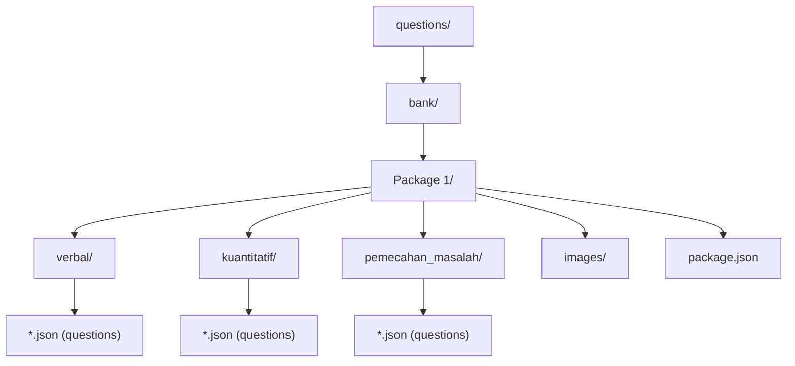
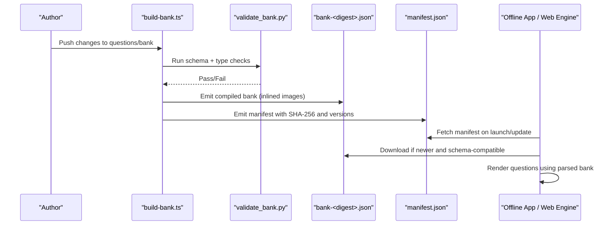
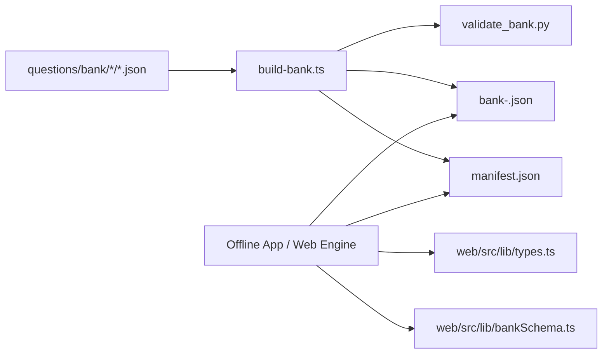

# Question Schema and Format

<cite>
**Referenced Files in This Document**
- [schema.json](file://questions/schema.json)
- [001.json (verbal)](file://questions/bank/1/verbal/001.json)
- [001.json (kuantitatif)](file://questions/bank/1/kuantitatif/001.json)
- [001.json (pemecahan_masalah)](file://questions/bank/1/pemecahan_masalah/001.json)
- [package.json (package 1)](file://questions/bank/1/package.json)
- [README.md (question bank)](file://questions/bank/README.md)
- [bankSchema.ts](file://web/src/lib/bankSchema.ts)
- [types.ts](file://web/src/lib/types.ts)
- [Passage.tsx](file://web/src/components/Passage.tsx)
- [TECHNICAL_REQUIREMENTS_V6.md](file://docs/TECHNICAL_REQUIREMENTS_V6.md)
</cite>

## Table of Contents
1. Introduction
2. Project Structure
3. Core Components
4. Architecture Overview
5. Detailed Component Analysis
6. Dependency Analysis
7. Performance Considerations
8. Troubleshooting Guide
9. Conclusion

## Introduction
This document specifies the question schema and format used by the project’s question bank, including JSON schema rules, field types, validation constraints, and how different question types are structured. It also explains file organization within packages, naming conventions, versioning strategy for both the bank artifact and the application, and how schema validation relates to rendering in the frontend. Examples reference actual files to illustrate proper formatting for passages, questions, options, answers, and explanations.

## Project Structure
The question bank is organized into versioned packages under questions/bank/<package>/ with subtest folders verbal, kuantitatif, and pemecahan_masalah. Each package contains:
- A package.json describing metadata such as title, difficulty, and AI model information.
- Subtest directories containing one JSON file per question.
- An images directory for assets referenced by questions.

**Diagram sources**
- [package.json (package 1):1-10](file://questions/bank/1/package.json#L1-L10)
- [README.md (question bank):1-3](file://questions/bank/README.md#L1-L3)

**Section sources**
- [README.md (question bank):1-3](file://questions/bank/README.md#L1-L3)
- [package.json (package 1):1-10](file://questions/bank/1/package.json#L1-L10)

## Core Components
At the heart of the system is a strict JSON schema that defines every question object. The schema enforces required fields, enumerations, patterns, and array sizes. Key aspects include:
- Stable ID derived from path: <package>-<subtest>-<NNN>.
- Package number and subtest type selection.
- Number range limits per package.
- Type enumeration constrained to allowed values; cross-type validity per subtest is enforced by validation scripts outside this schema.
- Textual content requirements for question_text and explanations.
- Image path pattern relative to the package directory or null.
- Passage support for reading-style stimuli and pipe-delimited tables for data interpretation.
- Exactly five options with keys A–E and corresponding explanation strings.
- Difficulty classification and provenance/source metadata.
- Verified flag indicating editorial review status.

**Section sources**
- [schema.json:1-98](file://questions/schema.json#L1-L98)

## Architecture Overview
The question bank is compiled into a single artifact consumed by the offline app and web engine. The compilation pipeline validates each question against the schema and produces a manifest plus a content-addressed bank file. The frontend reads the bank and renders questions according to their type and passage/image content.

**Diagram sources**
- [TECHNICAL_REQUIREMENTS_V6.md:107-145](file://docs/TECHNICAL_REQUIREMENTS_V6.md#L107-L145)
- [TECHNICAL_REQUIREMENTS_V6.md:119-141](file://docs/TECHNICAL_REQUIREMENTS_V6.md#L119-L141)

## Detailed Component Analysis

### JSON Schema Definition
The schema defines a question object with the following structure and constraints:
- id: string matching pattern <package>-<subtest>-<NNN>.
- package: integer ≥ 1.
- subtest: enum verbal | kuantitatif | pemecahan_masalah.
- number: integer between 1 and 25 inclusive.
- type: enum of allowed question types; cross-type validity per subtest is enforced by validation scripts.
- question_text: string with minimum length.
- image: string matching a relative path pattern under images/ with supported extensions, or null.
- passage: string or null; used for reading passages or pipe-delimited tables for data interpretation.
- options: array of exactly 5 items, each with key A–E and text string.
- correct_option: enum A–E.
- explanations: object with required keys A–E, each a non-empty string.
- difficulty: enum easy | medium | hard.
- source: string with minimum length.
- verified: boolean.

Validation notes:
- Additional properties are disallowed at the top level.
- Option objects disallow additional properties beyond key and text.
- Explanations require all five option keys.

**Section sources**
- [schema.json:1-98](file://questions/schema.json#L1-L98)

### Question Types and Field Requirements
Question types are grouped by subtest. While the schema allows many types, cross-type validity per subtest is enforced by validation scripts. Typical groupings observed in the bank include:
- Verbal reasoning: sinonim, antonim, analogi, silogisme, kalimat_efektif, reading, analisis_teks.
- Quantitative reasoning: aritmetika, aljabar, deret_angka, deret_huruf, perbandingan_kuantitatif, kecukupan_data, peluang_kombinatorik, soal_cerita, geometri, logika_analitis, penalaran_kasus, interpretasi_data.
- Problem-solving: similar quantitative and analytical types applied to scenario-based problems.

Field usage by type:
- All types require the core fields defined by the schema.
- reading and analisis_teks typically use passage for prose stimulus.
- interpretasi_data uses passage for a pipe-delimited table rendered as a table in the UI.
- image is optional and must match the specified pattern when present.

**Section sources**
- [schema.json:32-65](file://questions/schema.json#L32-L65)
- [Passage.tsx:11-29](file://web/src/components/Passage.tsx#L11-L29)

### File Organization and Naming Conventions
- Packages: questions/bank/<package>/ where <package> is an integer folder name.
- Subtests: verbal, kuantitatif, pemecahan_masalah under each package.
- Questions: numbered JSON files named NNN.json (e.g., 001.json).
- Images: stored under images/ within the package directory; referenced via relative paths in image field.
- Package metadata: package.json at the root of each package with title, description, difficulty, and AI model info.

Examples:
- Verbal question file: [001.json (verbal)](file://questions/bank/1/verbal/001.json)
- Quantitative question file: [001.json (kuantitatif)](file://questions/bank/1/kuantitatif/001.json)
- Problem-solving question file: [001.json (pemecahan_masalah)](file://questions/bank/1/pemecahan_masalah/001.json)
- Package metadata: [package.json (package 1)](file://questions/bank/1/package.json)

**Section sources**
- [001.json (verbal):1-29](file://questions/bank/1/verbal/001.json#L1-L29)
- [001.json (kuantitatif):1-44](file://questions/bank/1/kuantitatif/001.json#L1-L44)
- [001.json (pemecahan_masalah):1-44](file://questions/bank/1/pemecahan_masalah/001.json#L1-L44)
- [package.json (package 1):1-10](file://questions/bank/1/package.json#L1-L10)

### Versioning Strategy
Two independent version planes exist:
- Bank versioning: The compiled bank artifact is content-addressed (bank-<digest>.json) and immutable once published. A manifest.json points to the current bank file, includes its SHA-256, byte size, generated timestamp, and schema compatibility metadata.
- Application versioning: The offline app has a minimum compatible bank schema version; apps with lower versions refuse to download newer banks and prompt users to update the app.

Key behaviors:
- On launch, the app fetches manifest.json and compares bank_version with the active bank. If newer and schema-compatible, it downloads, verifies integrity, and swaps the bank atomically.
- The manifest carries bank_schema_version and min_app_version to gate compatibility.

**Section sources**
- [TECHNICAL_REQUIREMENTS_V6.md:107-145](file://docs/TECHNICAL_REQUIREMENTS_V6.md#L107-L145)
- [TECHNICAL_REQUIREMENTS_V6.md:119-141](file://docs/TECHNICAL_REQUIREMENTS_V6.md#L119-L141)
- [bankSchema.ts:7-18](file://web/src/lib/bankSchema.ts#L7-L18)
- [bankSchema.ts:39-67](file://web/src/lib/bankSchema.ts#L39-L67)

### Relationship Between Schema Validation and Frontend Rendering
- Schema validation ensures structural correctness before publishing; invalid banks fail the build step and never reach users.
- The frontend consumes the compiled bank and renders questions based on type and presence of passage or image:
  - For reading and analisis_teks, passage is rendered as prose.
  - For interpretasi_data, passage is parsed as a pipe-delimited table and rendered as a formatted table.
  - Images are referenced via relative paths and resolved relative to the package directory.

Rendering flow highlights:
- Passage parsing detects pipe-delimited tables and formats them accordingly.
- Options and explanations are displayed alongside the question stem during review.

**Section sources**
- [Passage.tsx:11-29](file://web/src/components/Passage.tsx#L11-L29)
- [Passage.tsx:31-75](file://web/src/components/Passage.tsx#L31-L75)
- [schema.json:57-95](file://questions/schema.json#L57-L95)

## Dependency Analysis
The bank artifact depends on:
- Source questions in questions/bank/.
- Validation script validate_bank.py which enforces schema and type-per-subtest rules.
- Build script build-bank.ts which compiles the bank and emits manifest.json.

The frontend depends on:
- The compiled bank artifact (bank-<digest>.json) and manifest.json.
- Local types and schemas for runtime checks and UI behavior.

**Diagram sources**
- [TECHNICAL_REQUIREMENTS_V6.md:107-145](file://docs/TECHNICAL_REQUIREMENTS_V6.md#L107-L145)
- [bankSchema.ts:7-18](file://web/src/lib/bankSchema.ts#L7-L18)
- [types.ts:191-211](file://web/src/lib/types.ts#L191-L211)

**Section sources**
- [TECHNICAL_REQUIREMENTS_V6.md:107-145](file://docs/TECHNICAL_REQUIREMENTS_V6.md#L107-L145)
- [bankSchema.ts:39-67](file://web/src/lib/bankSchema.ts#L39-L67)
- [types.ts:191-211](file://web/src/lib/types.ts#L191-L211)

## Performance Considerations
- The compiled bank inlines images as data URIs; keep total size reasonable to avoid large payloads.
- Manifest checks are lightweight and run on launch; failures are silent when offline to avoid blocking UI.
- Bank updates are content-addressed and immutable, enabling efficient caching and fast hot-swaps.
- Parsing pipe-delimited tables is O(n) over lines and columns; ensure passages remain concise for responsive rendering.

[No sources needed since this section provides general guidance]

## Troubleshooting Guide
Common issues and resolutions:
- Invalid question JSON: Ensure all required fields are present and conform to schema constraints (patterns, enums, array sizes). Use validate_bank.py to catch errors early.
- Incorrect image path: Confirm image paths follow the pattern images/<filename>.<ext> and reside within the package directory.
- Missing or malformed passage: For interpretasi_data, ensure every line has consistent column counts and uses pipe delimiters; otherwise, it will render as plain prose.
- Bank update failures: Verify manifest integrity and bank SHA-256; corrupted downloads fall back to cached or bundled snapshots.
- App refuses new bank: Check bank_schema_version and min_app_version; update the app if required.

**Section sources**
- [schema.json:23-95](file://questions/schema.json#L23-L95)
- [Passage.tsx:11-29](file://web/src/components/Passage.tsx#L11-L29)
- [TECHNICAL_REQUIREMENTS_V6.md:119-145](file://docs/TECHNICAL_REQUIREMENTS_V6.md#L119-L145)

## Conclusion
The question schema provides a robust, validated foundation for storing and rendering diverse question types across verbal, quantitative, and problem-solving domains. Clear file organization, strict naming conventions, and a dual versioning strategy for bank and application ensure reliable delivery and safe updates. The frontend leverages schema-compliant data to render passages, tables, and options consistently, while validation pipelines prevent broken content from reaching users.