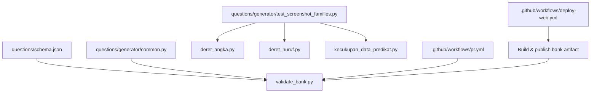
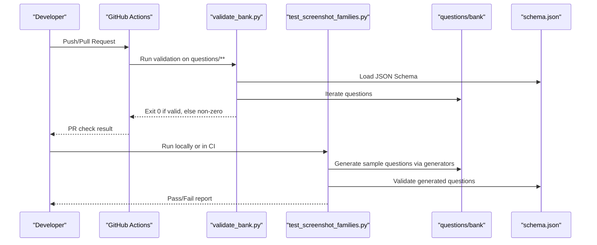
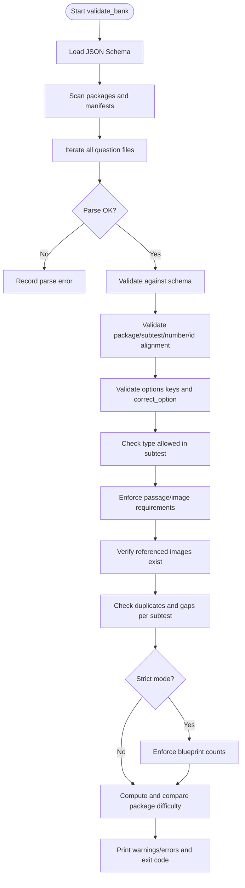
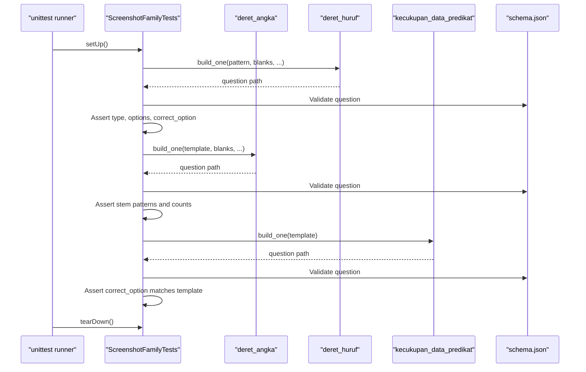
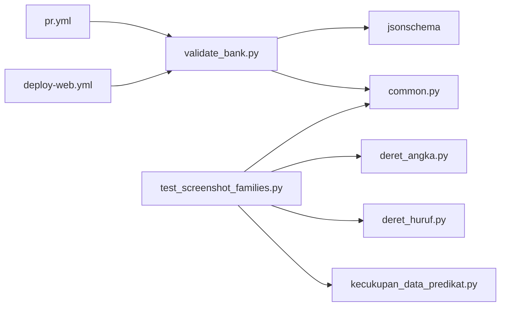

# Validation and Testing

<cite>
**Referenced Files in This Document**
- [validate_bank.py](file://questions/generator/validate_bank.py)
- [test_screenshot_families.py](file://questions/generator/test_screenshot_families.py)
- [common.py](file://questions/generator/common.py)
- [schema.json](file://questions/schema.json)
- [README.md](file://questions/generator/README.md)
- [COVERAGE.md](file://questions/generator/COVERAGE.md)
- [requirements.txt](file://questions/generator/requirements.txt)
- [pr.yml](file://.github/workflows/pr.yml)
- [deploy-web.yml](file://.github/workflows/deploy-web.yml)
</cite>

## Table of Contents
1. [Introduction](#introduction)
2. [Project Structure](#project-structure)
3. [Core Components](#core-components)
4. [Architecture Overview](#architecture-overview)
5. [Detailed Component Analysis](#detailed-component-analysis)
6. [Dependency Analysis](#dependency-analysis)
7. [Performance Considerations](#performance-considerations)
8. [Troubleshooting Guide](#troubleshooting-guide)
9. [Conclusion](#conclusion)
10. [Appendices](#appendices)

## Introduction
This document explains the validation and testing tools for the question bank:
- Structural validation and schema compliance via validate_bank.py
- Visual regression and screenshot-family tests via test_screenshot_families.py
- Automated CI pipeline integration, coverage expectations, and quality gates
- How to run checks, interpret results, troubleshoot failures, and add new test cases for custom question types

The goal is to ensure every question package is structurally sound, schema-compliant, and visually consistent across generations.

## Project Structure
The validation and testing tooling lives under questions/generator alongside shared helpers and schemas:
- Schema definition: questions/schema.json
- Shared logic and constants: questions/generator/common.py
- Bank validator: questions/generator/validate_bank.py
- Screenshot-family regression tests: questions/generator/test_screenshot_families.py
- Documentation and usage notes: questions/generator/README.md, COVERAGE.md
- Dependencies: questions/generator/requirements.txt
- CI workflows: .github/workflows/pr.yml (PR validation), .github/workflows/deploy-web.yml (artifact build/publish)

**Diagram sources**
- [validate_bank.py:1-208](file://questions/generator/validate_bank.py#L1-L208)
- [test_screenshot_families.py:1-115](file://questions/generator/test_screenshot_families.py#L1-L115)
- [common.py:1-218](file://questions/generator/common.py#L1-L218)
- [schema.json:1-98](file://questions/schema.json#L1-L98)
- [pr.yml:1-28](file://.github/workflows/pr.yml#L1-L28)
- [deploy-web.yml:97-116](file://.github/workflows/deploy-web.yml#L97-L116)

**Section sources**
- [validate_bank.py:1-208](file://questions/generator/validate_bank.py#L1-L208)
- [test_screenshot_families.py:1-115](file://questions/generator/test_screenshot_families.py#L1-L115)
- [common.py:1-218](file://questions/generator/common.py#L1-L218)
- [schema.json:1-98](file://questions/schema.json#L1-L98)
- [README.md:1-33](file://questions/generator/README.md#L1-L33)
- [COVERAGE.md:1-45](file://questions/generator/COVERAGE.md#L1-L45)
- [requirements.txt:1-3](file://questions/generator/requirements.txt#L1-L3)
- [pr.yml:1-28](file://.github/workflows/pr.yml#L1-L28)
- [deploy-web.yml:97-116](file://.github/workflows/deploy-web.yml#L97-L116)

## Core Components
- validate_bank.py: Validates entire question bank against schema.json and blueprint rules; enforces structural integrity, path-to-id consistency, option keys, passage/image requirements, numbering uniqueness and gaps, and strict blueprint counts when requested.
- test_screenshot_families.py: Unit tests that exercise generator families (number sequences, letter sequences, predicate sufficiency) to ensure generated questions remain valid and consistent with expected layouts and answer keys.
- common.py: Provides shared constants (blueprint, allowed types per subtest), schema loader, number formatting utilities, and helpers to assemble and write questions deterministically.
- schema.json: JSON Schema defining the contract for each question file (required fields, enums, patterns).

Key responsibilities:
- Schema compliance: Draft202012Validator used by both validator and tests.
- Blueprint enforcement: Subtest counts, difficulty band calculation, and strict mode checks.
- Integrity checks: Path-based id/package/subtest/number alignment, image existence, unique numbering without gaps.
- Regression safety: Tests cover all major generator families and key behaviors.

**Section sources**
- [validate_bank.py:44-194](file://questions/generator/validate_bank.py#L44-L194)
- [test_screenshot_families.py:21-111](file://questions/generator/test_screenshot_families.py#L21-L111)
- [common.py:19-68](file://questions/generator/common.py#L19-L68)
- [schema.json:1-98](file://questions/schema.json#L1-L98)

## Architecture Overview
The validation and testing architecture integrates local scripts with CI:
- PR checks run validate_bank.py on changes touching questions/.
- Deploy workflow builds a question-bank artifact using the same validation before publishing.
- Screenshot-family tests can be run locally or integrated into CI to guard regressions in generators.

**Diagram sources**
- [pr.yml:10-28](file://.github/workflows/pr.yml#L10-L28)
- [deploy-web.yml:97-116](file://.github/workflows/deploy-web.yml#L97-L116)
- [validate_bank.py:44-194](file://questions/generator/validate_bank.py#L44-L194)
- [test_screenshot_families.py:21-111](file://questions/generator/test_screenshot_families.py#L21-L111)
- [schema.json:1-98](file://questions/schema.json#L1-L98)

## Detailed Component Analysis

### validate_bank.py: Structural validation and integrity verification
- Loads JSON Schema and validates each question file.
- Enforces path-to-metadata alignment: package, subtest, number, id.
- Validates options: exactly keys A..E in order; correct_option among them.
- Ensures type-subtest compatibility using TYPES_BY_SUBTEST.
- Checks stimulus requirements: required passage types vs optional image/table.
- Verifies referenced images exist within the package directory.
- Detects duplicate numbers and numbering gaps per subtest; supports strict mode to enforce exact blueprint counts.
- Computes package difficulty from difficulty distribution and compares to manifest difficulty.
- Exits with code 0 on success, 1 on errors; prints warnings and errors for CI friendliness.

**Diagram sources**
- [validate_bank.py:44-194](file://questions/generator/validate_bank.py#L44-L194)

**Section sources**
- [validate_bank.py:44-194](file://questions/generator/validate_bank.py#L44-L194)
- [common.py:19-68](file://questions/generator/common.py#L19-L68)
- [schema.json:1-98](file://questions/schema.json#L1-L98)

### test_screenshot_families.py: Visual regression and screenshot generation tests
- Uses unittest to generate questions via generator modules and assert schema validity and expected properties.
- Covers:
  - Letter sequence family with one/two blanks and interior layout behavior
  - Number sequence families including fixed four-operation cycles, three interleaved tracks, two interleaved tracks, and leading blank layouts
  - Predicate sufficiency templates ensuring all five keys (A–E) are produced correctly
- Asserts explanations do not contain certain phrases for specific blank configurations and verifies numeric patterns in stems where applicable.

**Diagram sources**
- [test_screenshot_families.py:21-111](file://questions/generator/test_screenshot_families.py#L21-L111)
- [schema.json:1-98](file://questions/schema.json#L1-L98)

**Section sources**
- [test_screenshot_families.py:21-111](file://questions/generator/test_screenshot_families.py#L21-L111)

### Common helpers and schema
- common.py defines BLUEPRINT (subtest names, positions, counts, durations, passing grades), TYPES_BY_SUBTEST, PASSAGE_REQUIRED_TYPES, PASSAGE_OR_IMAGE_TYPES, and utility functions like package_difficulty, fmt_number, load_schema, write_question, make_question, iter_bank_questions.
- schema.json defines the question object contract, including required fields, enums, patterns for id and image paths, and constraints on options and explanations.

These components are reused by both the validator and the tests to ensure consistency between generation, validation, and runtime rendering.

**Section sources**
- [common.py:19-68](file://questions/generator/common.py#L19-L68)
- [common.py:77-96](file://questions/generator/common.py#L77-L96)
- [common.py:130-164](file://questions/generator/common.py#L130-L164)
- [common.py:167-218](file://questions/generator/common.py#L167-L218)
- [schema.json:1-98](file://questions/schema.json#L1-L98)

## Dependency Analysis
- validate_bank.py depends on:
  - jsonschema.Draft202012Validator for schema validation
  - common.py for blueprint, allowed types, schema loading, iteration over bank questions
- test_screenshot_families.py depends on:
  - Generator modules (deret_angka, deret_huruf, kecukupan_data_predikat)
  - common.load_schema for validation
- CI pipelines depend on:
  - pr.yml to run validate_bank.py on PRs touching questions/**
  - deploy-web.yml to build and publish the bank artifact after validation

**Diagram sources**
- [validate_bank.py:23-41](file://questions/generator/validate_bank.py#L23-L41)
- [test_screenshot_families.py:13-18](file://questions/generator/test_screenshot_families.py#L13-L18)
- [pr.yml:10-28](file://.github/workflows/pr.yml#L10-L28)
- [deploy-web.yml:97-116](file://.github/workflows/deploy-web.yml#L97-L116)

**Section sources**
- [validate_bank.py:23-41](file://questions/generator/validate_bank.py#L23-L41)
- [test_screenshot_families.py:13-18](file://questions/generator/test_screenshot_families.py#L13-L18)
- [pr.yml:10-28](file://.github/workflows/pr.yml#L10-L28)
- [deploy-web.yml:97-116](file://.github/workflows/deploy-web.yml#L97-L116)

## Performance Considerations
- Validation complexity scales linearly with the number of question files due to iterative parsing and schema validation.
- Strict mode adds additional checks against blueprint counts but remains O(N) overall.
- Using a temporary directory in tests avoids filesystem overhead and ensures isolation.
- Deterministic generation with seeds improves reproducibility and reduces flakiness in regression tests.

[No sources needed since this section provides general guidance]

## Troubleshooting Guide
Common validation failures and how to resolve them:
- Invalid JSON in question files: Fix syntax errors reported by the parser.
- Schema violations: Ensure all required fields are present and match expected types/patterns (e.g., id format, image path pattern).
- Path-to-metadata mismatch: Align package, subtest, number, and id with the file’s directory structure and filename.
- Option keys not A..E in order or correct_option missing: Reorder options and verify correct_option exists among them.
- Type not allowed in subtest: Adjust type to one permitted by TYPES_BY_SUBTEST for the given subtest.
- Missing passage or image for stimulus-based types: Add passage text or reference a valid image/chart as required.
- Referenced image not found: Ensure the image path points to an existing file under the package’s images directory.
- Duplicate numbers or gaps: Ensure unique, contiguous numbering per subtest.
- Strict mode failures: Meet exact blueprint counts per subtest; otherwise remove --strict or adjust content.
- Difficulty mismatch: Verify difficulty distribution aligns with calculated band based on easy/medium/hard weights.

Running checks locally:
- Install dependencies: pip install -r questions/generator/requirements.txt
- Validate bank: python3 questions/generator/validate_bank.py [--strict] [--bank-dir PATH]
- Run screenshot-family tests: python3 -m unittest questions/generator/test_screenshot_families.py

Interpreting results:
- Exit code 0 indicates no errors; non-zero indicates validation failures.
- Warnings are printed separately and do not fail the run unless they indicate authoring slips.
- Errors include file-relative paths and concise messages to locate issues quickly.

Adding new test cases for custom question types:
- Extend test_screenshot_families.py with new test methods that:
  - Instantiate generators for the new type
  - Write to a temporary directory
  - Validate output against schema.json
  - Assert expected properties (type, options, correct_option, explanation characteristics)
- Use deterministic seeds for reproducibility
- Optionally integrate into CI by adding a step similar to the PR validation job

**Section sources**
- [validate_bank.py:44-194](file://questions/generator/validate_bank.py#L44-L194)
- [test_screenshot_families.py:21-111](file://questions/generator/test_screenshot_families.py#L21-L111)
- [README.md:9-24](file://questions/generator/README.md#L9-L24)
- [requirements.txt:1-3](file://questions/generator/requirements.txt#L1-L3)

## Conclusion
The validation and testing framework ensures the question bank remains robust, schema-compliant, and visually consistent:
- validate_bank.py provides comprehensive structural and integrity checks
- test_screenshot_families.py guards against regressions in generator families
- CI pipelines enforce validation on PRs and during deployment
- Clear documentation and troubleshooting steps enable rapid issue resolution and extension for new question types

Adhering to these practices maintains high-quality question packages and reliable rendering across environments.

[No sources needed since this section summarizes without analyzing specific files]

## Appendices

### Running validation and tests
- Install dependencies: pip install -r questions/generator/requirements.txt
- Validate bank: python3 questions/generator/validate_bank.py [--strict] [--bank-dir PATH]
- Run screenshot-family tests: python3 -m unittest questions/generator/test_screenshot_families.py

### CI integration
- PR validation runs validate_bank.py automatically on changes to questions/**
- Deploy workflow builds and publishes the bank artifact after validation

**Section sources**
- [pr.yml:10-28](file://.github/workflows/pr.yml#L10-L28)
- [deploy-web.yml:97-116](file://.github/workflows/deploy-web.yml#L97-L116)
- [README.md:9-24](file://questions/generator/README.md#L9-L24)