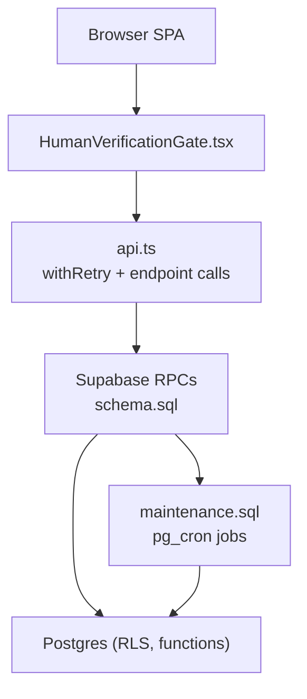
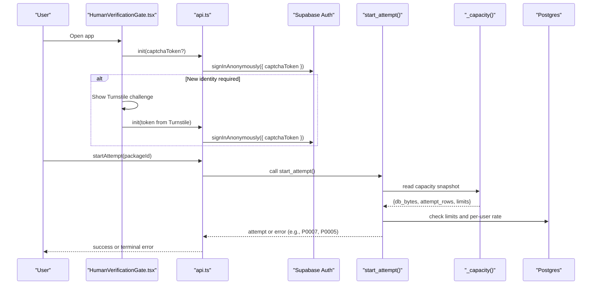
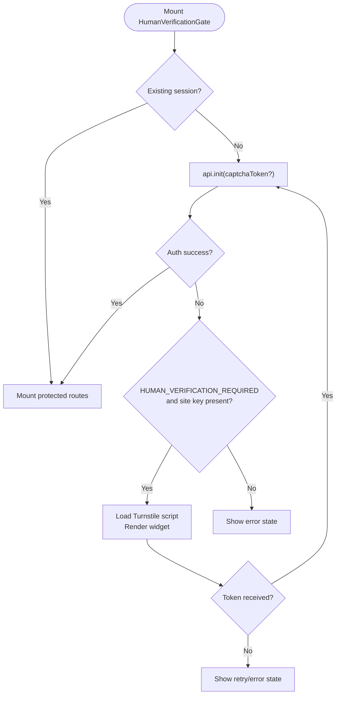
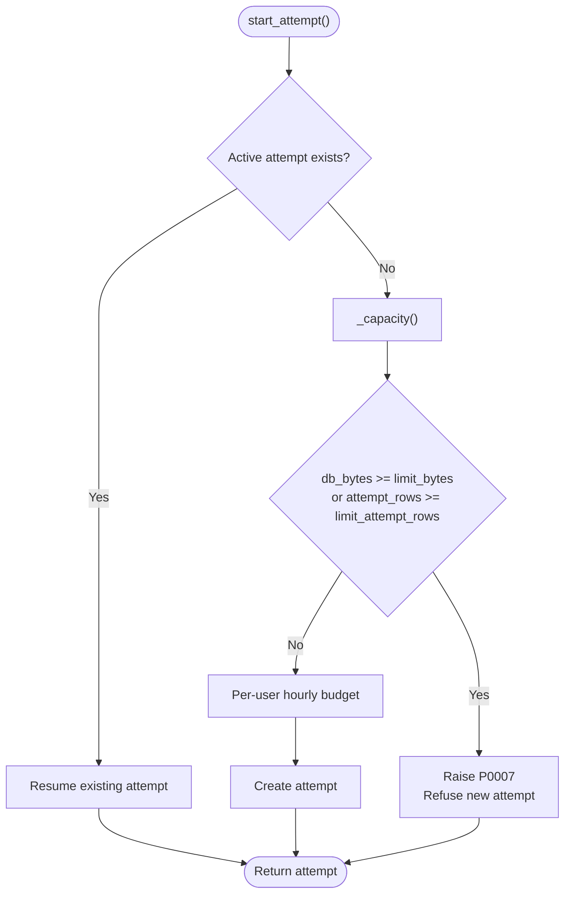
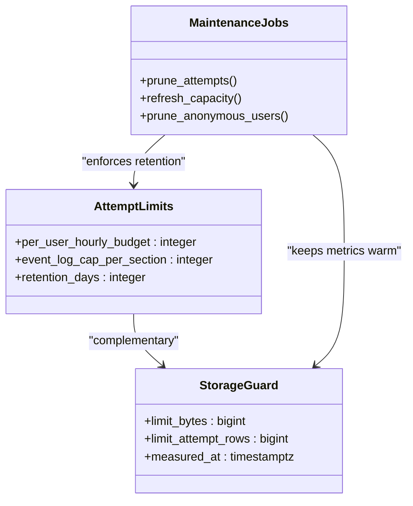
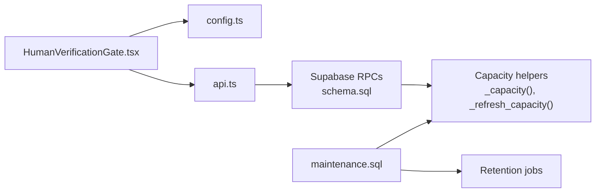

# Abuse Prevention and Rate Limiting

<cite>
**Referenced Files in This Document**
- [README.md](file://README.md)
- [CAPACITY_GUARD.md](file://docs/CAPACITY_GUARD.md)
- [TECHNICAL_REQUIREMENTS_V5.md](file://docs/TECHNICAL_REQUIREMENTS_V5.md)
- [HumanVerificationGate.tsx](file://web/src/components/HumanVerificationGate.tsx)
- [config.ts](file://web/src/lib/config.ts)
- [api.ts](file://web/src/lib/api.ts)
- [schema.sql](file://supabase/schema.sql)
- [maintenance.sql](file://supabase/maintenance.sql)
- [CONTRIBUTING.md](file://CONTRIBUTING.md)
</cite>

## Table of Contents
1. [Introduction](#introduction)
2. [Project Structure](#project-structure)
3. [Core Components](#core-components)
4. [Architecture Overview](#architecture-overview)
5. [Detailed Component Analysis](#detailed-component-analysis)
6. [Dependency Analysis](#dependency-analysis)
7. [Performance Considerations](#performance-considerations)
8. [Troubleshooting Guide](#troubleshooting-guide)
9. [Conclusion](#conclusion)

## Introduction
This document explains how the TBS LPDP Try Out system prevents abuse and protects free-tier infrastructure through:
- Turnstile CAPTCHA integration to ensure human users create new anonymous identities.
- Capacity guard mechanisms that stop new attempts before storage limits are reached while allowing ongoing sessions to continue safely.
- Rate limiting and resource controls for per-user attempt creation, event logging, and background retention.
It also provides configuration guidance, examples for extending rate limiters, and strategies to mitigate common attack vectors such as credential stuffing, brute force attempts, and resource exhaustion.

## Project Structure
Abuse prevention spans three layers:
- Frontend gate: a React component that enforces Turnstile verification before mounting protected routes.
- Backend enforcement: Supabase RPCs enforce capacity checks, per-user rate limits, and bounded event logging.
- Operational maintenance: scheduled jobs prune old data and keep capacity metrics fresh.

**Diagram sources**
- [HumanVerificationGate.tsx:77-158](file://web/src/components/HumanVerificationGate.tsx#L77-L158)
- [api.ts:77-122](file://web/src/lib/api.ts#L77-L122)
- [schema.sql:341-389](file://supabase/schema.sql#L341-L389)
- [maintenance.sql:31-51](file://supabase/maintenance.sql#L31-L51)

**Section sources**
- [README.md:28-38](file://README.md#L28-L38)
- [HumanVerificationGate.tsx:77-158](file://web/src/components/HumanVerificationGate.tsx#L77-L158)
- [api.ts:77-122](file://web/src/lib/api.ts#L77-L122)
- [schema.sql:341-389](file://supabase/schema.sql#L341-L389)
- [maintenance.sql:31-51](file://supabase/maintenance.sql#L31-L51)

## Core Components
- Turnstile Gate: A session-aware pre-route gate that loads Cloudflare Turnstile only when creating a new anonymous identity. It supports retry, expiry, and error states, and never stores the token beyond authentication.
- Capacity Guard: A server-side check that blocks new attempts when database size or estimated attempt rows exceed configured soft limits. Existing sessions remain unaffected.
- Rate Limits: Per-user hourly attempt budget; bounded answer event log per section; background pruning of old attempts and anonymous users.
- Maintenance Jobs: Scheduled tasks to refresh capacity metrics, prune old attempts, and clean up stale anonymous users.

**Section sources**
- [HumanVerificationGate.tsx:77-158](file://web/src/components/HumanVerificationGate.tsx#L77-L158)
- [CAPACITY_GUARD.md:15-27](file://docs/CAPACITY_GUARD.md#L15-L27)
- [schema.sql:241-260](file://supabase/schema.sql#L241-L260)
- [schema.sql:341-389](file://supabase/schema.sql#L341-L389)
- [maintenance.sql:31-73](file://supabase/maintenance.sql#L31-L73)

## Architecture Overview
The flow combines frontend gating with backend enforcement to deter automated abuse while preserving user experience for legitimate users.

**Diagram sources**
- [HumanVerificationGate.tsx:85-158](file://web/src/components/HumanVerificationGate.tsx#L85-L158)
- [api.ts:77-122](file://web/src/lib/api.ts#L77-L122)
- [schema.sql:341-389](file://supabase/schema.sql#L341-L389)
- [schema.sql:292-309](file://supabase/schema.sql#L292-L309)

## Detailed Component Analysis

### Turnstile CAPTCHA Integration
Purpose: Ensure new anonymous identities are created by humans without requiring email accounts or challenging returning users on every visit.

Key behaviors:
- Session-aware: existing sessions pass silently; new sessions see a Turnstile gate.
- Token handling: single-use token passed to anonymous sign-in; not stored in local storage, URLs, logs, or application tables.
- Error handling: retryable UI for failed/expired challenges; no content mounts until verification succeeds.
- Configuration: public site key is loaded at build time; mock mode bypasses third-party scripts.

**Diagram sources**
- [HumanVerificationGate.tsx:77-158](file://web/src/components/HumanVerificationGate.tsx#L77-L158)
- [config.ts:33-40](file://web/src/lib/config.ts#L33-L40)
- [config.ts:59-60](file://web/src/lib/config.ts#L59-L60)

Configuration options:
- Public site key: provided via environment variable and consumed at build time.
- Mock mode: disables third-party scripts during development.
- Production activation: requires enabling CAPTCHA protection in Supabase Authentication settings after deploying a site-key-enabled frontend.

Operational notes:
- The secret remains in Supabase; only the public site key is bundled.
- Returning browsers do not load Turnstile again unless needed.

**Section sources**
- [TECHNICAL_REQUIREMENTS_V5.md:10-53](file://docs/TECHNICAL_REQUIREMENTS_V5.md#L10-L53)
- [HumanVerificationGate.tsx:77-158](file://web/src/components/HumanVerificationGate.tsx#L77-L158)
- [config.ts:33-40](file://web/src/lib/config.ts#L33-L40)
- [CONTRIBUTING.md:74-79](file://CONTRIBUTING.md#L74-L79)

### Capacity Guard
Purpose: Protect free-tier infrastructure by stopping new attempts before storage fills, while allowing ongoing sessions to complete safely.

Mechanics:
- Measurement: database size and estimated attempt rows are captured into a single-row table; reads auto-refresh if older than five minutes.
- Enforcement: new attempts are blocked when either byte or row limits are exceeded; existing sessions can start sections, save answers, toggle doubts, finish sections, and review results.
- Client visibility: service status exposes whether the system accepts new attempts and usage percentage; raw bytes stay server-side.

**Diagram sources**
- [schema.sql:341-389](file://supabase/schema.sql#L341-L389)
- [schema.sql:292-309](file://supabase/schema.sql#L292-L309)

Client behavior:
- Terminal errors like storage capacity are not retried.
- UI shows a warning banner and disables start buttons when not accepting attempts.

Operational tuning:
- Adjust soft limits via SQL without redeploying.
- Background job warms capacity snapshots; self-healing ensures correctness even without cron.

**Section sources**
- [CAPACITY_GUARD.md:15-27](file://docs/CAPACITY_GUARD.md#L15-L27)
- [CAPACITY_GUARD.md:29-80](file://docs/CAPACITY_GUARD.md#L29-L80)
- [CAPACITY_GUARD.md:81-135](file://docs/CAPACITY_GUARD.md#L81-L135)
- [schema.sql:119-127](file://supabase/schema.sql#L119-L127)
- [schema.sql:262-309](file://supabase/schema.sql#L262-L309)
- [api.ts:97-122](file://web/src/lib/api.ts#L97-L122)

### Rate Limiting and Resource Controls
- Per-user attempt budget: limits how many new attempts a user can start within an hour to bound row growth and scripted abuse.
- Event log cap: each section’s append-only event log is capped to prevent unbounded writes.
- Retention and cleanup: daily jobs prune old attempts and anonymous users to maintain healthy storage levels.

**Diagram sources**
- [schema.sql:341-389](file://supabase/schema.sql#L341-L389)
- [schema.sql:241-260](file://supabase/schema.sql#L241-L260)
- [maintenance.sql:31-73](file://supabase/maintenance.sql#L31-L73)

**Section sources**
- [schema.sql:341-389](file://supabase/schema.sql#L341-L389)
- [schema.sql:241-260](file://supabase/schema.sql#L241-L260)
- [maintenance.sql:31-73](file://supabase/maintenance.sql#L31-L73)

### Monitoring and Observability
- Service status RPC returns whether the system accepts new attempts and a coarse usage percentage.
- Capacity snapshots are refreshed automatically on read if stale; a scheduled job keeps them warm.
- Operational queries help diagnose storage growth and job health.

Practical tips:
- Use the service status to drive UI banners and button states.
- Monitor cron job runs and failures to ensure retention and capacity jobs execute reliably.

**Section sources**
- [schema.sql:392-409](file://supabase/schema.sql#L392-L409)
- [CAPACITY_GUARD.md:60-80](file://docs/CAPACITY_GUARD.md#L60-L80)
- [maintenance.sql:41-51](file://supabase/maintenance.sql#L41-L51)

## Dependency Analysis
Frontend components depend on configuration and API modules, which in turn call Supabase RPCs defined in the schema. Maintenance jobs operate independently but influence runtime behavior by keeping capacity metrics current and reducing storage pressure.

**Diagram sources**
- [HumanVerificationGate.tsx:77-158](file://web/src/components/HumanVerificationGate.tsx#L77-L158)
- [config.ts:33-40](file://web/src/lib/config.ts#L33-L40)
- [api.ts:77-122](file://web/src/lib/api.ts#L77-L122)
- [schema.sql:262-309](file://supabase/schema.sql#L262-L309)
- [maintenance.sql:31-73](file://supabase/maintenance.sql#L31-L73)

**Section sources**
- [HumanVerificationGate.tsx:77-158](file://web/src/components/HumanVerificationGate.tsx#L77-L158)
- [api.ts:77-122](file://web/src/lib/api.ts#L77-L122)
- [schema.sql:262-309](file://supabase/schema.sql#L262-L309)
- [maintenance.sql:31-73](file://supabase/maintenance.sql#L31-L73)

## Performance Considerations
- Capacity checks use O(1) catalog lookups and directory stats; they avoid expensive count(*) scans.
- Event log caps prevent runaway writes per section.
- Retention jobs reduce long-term storage growth, keeping capacity checks accurate and fast.
- Frontend retries back off on transient errors but treat terminal codes (including capacity and rate limits) as non-retryable.

[No sources needed since this section provides general guidance]

## Troubleshooting Guide
Common issues and resolutions:
- Turnstile script fails to load: clear and retry; verify network access and privacy extensions; ensure site key is configured for production builds.
- Anonymous sign-in rejected: confirm Supabase CAPTCHA protection is enabled and matches the deployed frontend site key.
- New attempts blocked: check service status; if capacity is full, wait for retention to run or adjust limits; existing sessions continue unaffected.
- Frequent rate limit errors: investigate per-user attempt bursts; consider spacing out test runs or increasing budgets judiciously.

Operational diagnostics:
- Inspect capacity snapshot and limits via service status and SQL queries.
- Review cron job runs and failures to ensure retention and capacity jobs execute.

**Section sources**
- [HumanVerificationGate.tsx:117-158](file://web/src/components/HumanVerificationGate.tsx#L117-L158)
- [api.ts:97-122](file://web/src/lib/api.ts#L97-L122)
- [CAPACITY_GUARD.md:137-161](file://docs/CAPACITY_GUARD.md#L137-L161)
- [maintenance.sql:154-167](file://supabase/maintenance.sql#L154-L167)

## Conclusion
The TBS LPDP Try Out system combines a lightweight frontend gate with robust backend enforcement to deter automation and protect free-tier resources. Turnstile ensures human-driven identity creation, while capacity guards, rate limits, and retention jobs safeguard availability and performance. Operators can tune thresholds and monitor health using built-in RPCs and scheduled jobs, ensuring the system remains resilient under abuse attempts.

[No sources needed since this section summarizes without analyzing specific files]