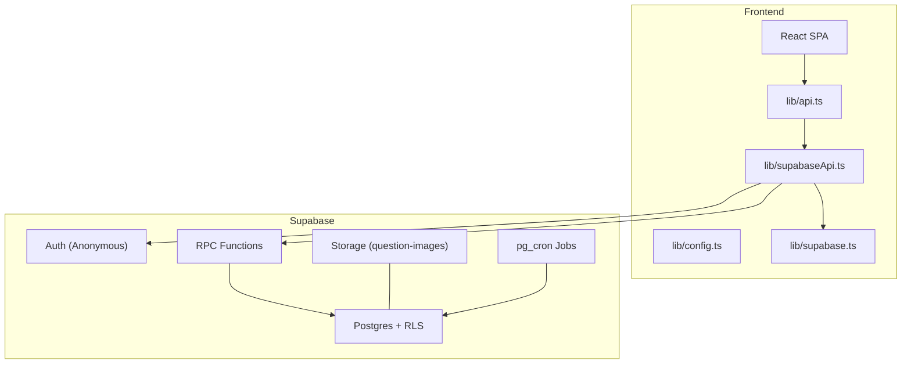
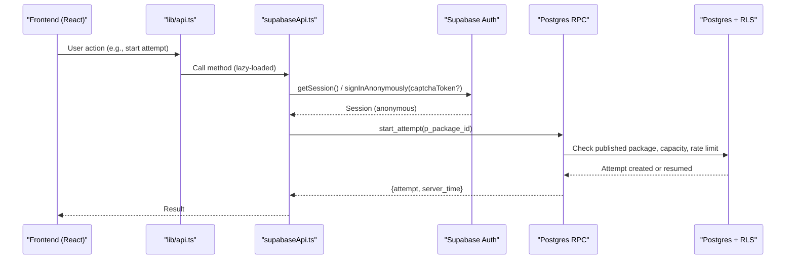
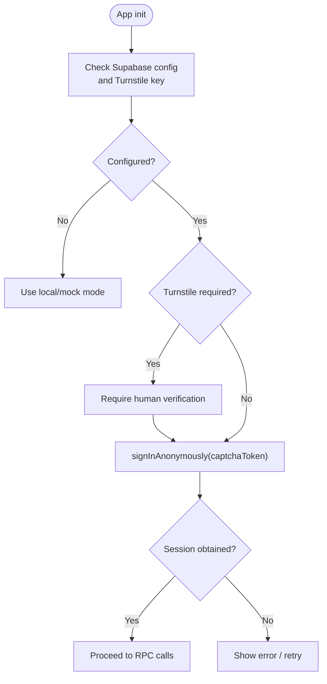
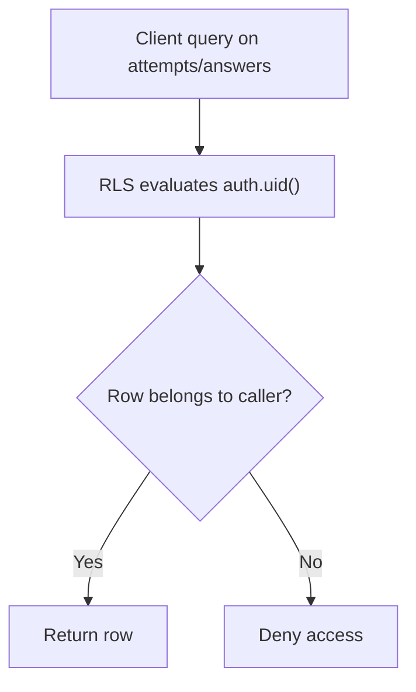
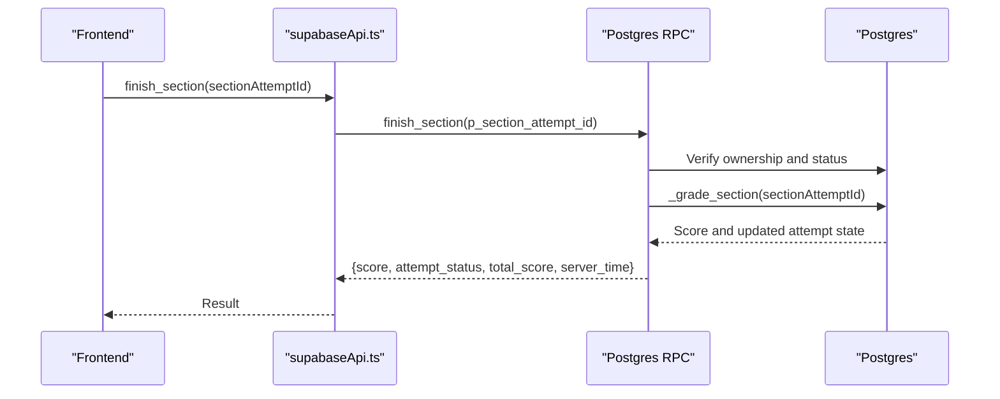
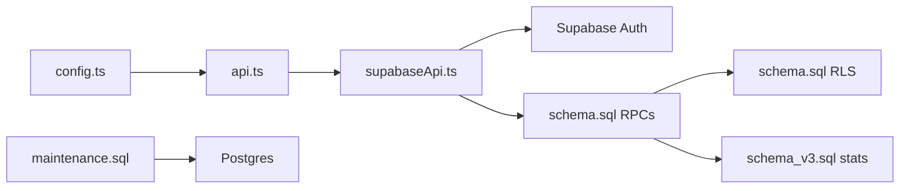

# Access Control and Authentication

<cite>
**Referenced Files in This Document**
- [schema.sql](file://supabase/schema.sql)
- [schema_v3.sql](file://supabase/schema_v3.sql)
- [maintenance.sql](file://supabase/maintenance.sql)
- [supabase.ts](file://web/src/lib/supabase.ts)
- [supabaseApi.ts](file://web/src/lib/supabaseApi.ts)
- [config.ts](file://web/src/lib/config.ts)
- [api.ts](file://web/src/lib/api.ts)
- [README.md](file://README.md)
- [CONTRIBUTING.md](file://CONTRIBUTING.md)
- [push_to_supabase.py](file://questions/generator/push_to_supabase.py)
</cite>

## Table of Contents
1. [Introduction](#introduction)
2. [Project Structure](#project-structure)
3. [Core Components](#core-components)
4. [Architecture Overview](#architecture-overview)
5. [Detailed Component Analysis](#detailed-component-analysis)
6. [Dependency Analysis](#dependency-analysis)
7. [Performance Considerations](#performance-considerations)
8. [Troubleshooting Guide](#troubleshooting-guide)
9. [Conclusion](#conclusion)

## Introduction
This document explains how the TBS LPDP Try Out system secures user data and enforces access control using Supabase authentication, Row Level Security (RLS), and server-side RPCs. It covers:
- Anonymous authentication flows that allow guest usage without registration while protecting sensitive data.
- RLS policies that isolate attempts and answers per anonymous user.
- Role-based boundaries enforced by database functions and grants.
- Session management and token handling for secure API calls from the frontend.
- Security implications of anonymous access and how the system prevents unauthorized data access while maintaining usability.

The system is designed so that the browser never grades an attempt or reads answer keys during an active section; trusted logic runs inside Postgres via security-definer functions, and RLS scopes all user data to the current anonymous identity.

**Section sources**
- [README.md:28-63](file://README.md#L28-L63)

## Project Structure
At a high level:
- Frontend (web): A React + Vite SPA that lazily loads the Supabase client and API layer only when needed.
- Backend (Supabase): Postgres with RLS, RPCs for exam operations, storage policies for public images, and scheduled maintenance jobs.
- Content pipeline: Python tooling publishes immutable package releases into Supabase using service-role credentials.

**Diagram sources**
- [api.ts:38-95](file://web/src/lib/api.ts#L38-L95)
- [supabaseApi.ts:45-169](file://web/src/lib/supabaseApi.ts#L45-L169)
- [config.ts:16-43](file://web/src/lib/config.ts#L16-L43)
- [supabase.ts:1-14](file://web/src/lib/supabase.ts#L1-L14)
- [schema.sql:131-181](file://supabase/schema.sql#L131-L181)
- [schema.sql:659-692](file://supabase/schema.sql#L659-L692)
- [maintenance.sql:18-73](file://supabase/maintenance.sql#L18-L73)

**Section sources**
- [README.md:40-63](file://README.md#L40-L63)
- [api.ts:3-12](file://web/src/lib/api.ts#L3-L12)
- [config.ts:16-43](file://web/src/lib/config.ts#L16-L43)

## Core Components
- Anonymous authentication: The app uses one persistent anonymous identity per browser session, gated by Turnstile verification before sign-in.
- RLS policies: All user-scoped tables (attempts, section_attempts, answers, answer_events) are readable/writable only for the authenticated user’s own rows.
- RPC boundary: All mutations go through server-side functions that enforce ownership, deadlines, capacity limits, and rate limits.
- Storage policy: Public read access to question images; no direct table writes from clients.
- Maintenance jobs: Prune old attempts and anonymous users, refresh capacity snapshots, and queue operator digests.

Key implementation anchors:
- Anonymous sign-in flow and session gating: [requireSession:45-64](file://web/src/lib/supabaseApi.ts#L45-L64)
- RLS policies for user data isolation: [RLS definitions:131-181](file://supabase/schema.sql#L131-L181)
- RPCs enforcing business rules and ownership: [start_attempt, start_section, save_answer, finish_section, get_review:341-657](file://supabase/schema.sql#L341-L657)
- Storage policy for images: [storage policy:659-672](file://supabase/schema.sql#L659-L672)
- Cron jobs for retention and cleanup: [maintenance jobs:18-73](file://supabase/maintenance.sql#L18-L73)

**Section sources**
- [supabaseApi.ts:45-64](file://web/src/lib/supabaseApi.ts#L45-L64)
- [schema.sql:131-181](file://supabase/schema.sql#L131-L181)
- [schema.sql:341-657](file://supabase/schema.sql#L341-L657)
- [schema.sql:659-692](file://supabase/schema.sql#L659-L692)
- [maintenance.sql:18-73](file://supabase/maintenance.sql#L18-L73)

## Architecture Overview
The system separates concerns between client and server:
- Client: Lazy-loads Supabase client and API; ensures configuration presence and performs human verification before creating an anonymous session.
- Server: Enforces all critical rules in Postgres functions with security definer, scoped by RLS and auth.uid().

**Diagram sources**
- [api.ts:38-95](file://web/src/lib/api.ts#L38-L95)
- [supabaseApi.ts:45-111](file://web/src/lib/supabaseApi.ts#L45-L111)
- [schema.sql:341-389](file://supabase/schema.sql#L341-L389)

**Section sources**
- [supabaseApi.ts:45-111](file://web/src/lib/supabaseApi.ts#L45-L111)
- [schema.sql:341-389](file://supabase/schema.sql#L341-L389)

## Detailed Component Analysis

### Anonymous Authentication Flow
- Configuration: The app checks whether Supabase is configured and whether a Turnstile site key is present. In production builds, it will not create accounts until a valid CAPTCHA token is provided.
- Session gating: Every RPC call goes through requireSession, which either reuses an existing session or signs in anonymously with an optional captchaToken.
- Token handling: The Supabase client is created with session persistence and auto-refresh enabled. Tokens are managed by Supabase; the app does not handle tokens directly.

**Diagram sources**
- [config.ts:16-43](file://web/src/lib/config.ts#L16-L43)
- [supabaseApi.ts:45-64](file://web/src/lib/supabaseApi.ts#L45-L64)
- [supabase.ts:1-14](file://web/src/lib/supabase.ts#L1-L14)

**Section sources**
- [config.ts:16-43](file://web/src/lib/config.ts#L16-L43)
- [supabaseApi.ts:45-64](file://web/src/lib/supabaseApi.ts#L45-L64)
- [supabase.ts:1-14](file://web/src/lib/supabase.ts#L1-L14)
- [CONTRIBUTING.md:57-79](file://CONTRIBUTING.md#L57-L79)

### Row Level Security Policies
- Published content visibility: Packages and subtests are selectable only if published.
- User data isolation: Attempts, section attempts, answers, and events are readable only by the owner via auth.uid().
- Answer keys protection: No client-readable policy exists for answer_keys; they are accessed only through review RPCs after completion.

**Diagram sources**
- [schema.sql:131-181](file://supabase/schema.sql#L131-L181)

**Section sources**
- [schema.sql:131-181](file://supabase/schema.sql#L131-L181)

### RPC-Based Access Controls and Business Rules
All mutations are funneled through RPCs that:
- Require authentication (auth.uid() must be present).
- Validate inputs and ownership.
- Enforce deadlines, capacity, and rate limits.
- Grade sections and update statistics securely.

**Diagram sources**
- [supabaseApi.ts:134-147](file://web/src/lib/supabaseApi.ts#L134-L147)
- [schema.sql:551-580](file://supabase/schema.sql#L551-L580)
- [schema.sql:185-239](file://supabase/schema.sql#L185-L239)

**Section sources**
- [schema.sql:185-239](file://supabase/schema.sql#L185-L239)
- [schema.sql:341-389](file://supabase/schema.sql#L341-L389)
- [schema.sql:417-493](file://supabase/schema.sql#L417-L493)
- [schema.sql:495-549](file://supabase/schema.sql#L495-L549)
- [schema.sql:551-607](file://supabase/schema.sql#L551-L607)

### Storage and Image Access
- A public bucket holds question images.
- A storage policy allows both anonymous and authenticated users to read objects in this bucket.
- Uploads use service-role credentials from the publisher pipeline.

**Section sources**
- [schema.sql:659-672](file://supabase/schema.sql#L659-L672)
- [push_to_supabase.py:69-119](file://questions/generator/push_to_supabase.py#L69-L119)

### Maintenance and Retention
Scheduled jobs ensure long-term stability and privacy:
- Prune attempts older than 7 days.
- Refresh capacity snapshot periodically.
- Prune anonymous users older than 60 days unless they have reports.
- Queue daily question-report digests.

**Section sources**
- [maintenance.sql:18-73](file://supabase/maintenance.sql#L18-L73)
- [maintenance.sql:75-152](file://supabase/maintenance.sql#L75-L152)

## Dependency Analysis
- Frontend depends on environment variables for project URL and publishable key; offline mode removes these dependencies entirely.
- supabaseApi.ts depends on Supabase Auth and RPCs; it centralizes session requirements and error mapping.
- schema files define the authoritative access model: RLS policies, function grants, and storage policies.
- Publisher script uses service-role credentials to publish immutable releases; it never reaches the client bundle.

**Diagram sources**
- [config.ts:16-43](file://web/src/lib/config.ts#L16-L43)
- [api.ts:38-95](file://web/src/lib/api.ts#L38-L95)
- [supabaseApi.ts:45-169](file://web/src/lib/supabaseApi.ts#L45-L169)
- [schema.sql:131-181](file://supabase/schema.sql#L131-L181)
- [schema_v3.sql:574-606](file://supabase/schema_v3.sql#L574-L606)
- [maintenance.sql:18-73](file://supabase/maintenance.sql#L18-L73)

**Section sources**
- [config.ts:16-43](file://web/src/lib/config.ts#L16-L43)
- [api.ts:38-95](file://web/src/lib/api.ts#L38-L95)
- [supabaseApi.ts:45-169](file://web/src/lib/supabaseApi.ts#L45-L169)
- [schema.sql:131-181](file://supabase/schema.sql#L131-L181)
- [schema_v3.sql:574-606](file://supabase/schema_v3.sql#L574-L606)
- [maintenance.sql:18-73](file://supabase/maintenance.sql#L18-L73)

## Performance Considerations
- Capacity guard: Before creating new attempts, the system measures database size and attempt row counts against configurable limits to avoid exceeding free-tier constraints.
- Rate limiting: Per-user hourly attempt caps prevent abuse and unbounded growth.
- Event log cap: Answer event logs are capped per section to bound storage growth.
- Lazy loading: The Supabase client is dynamically imported only when needed, reducing initial bundle size.

[No sources needed since this section provides general guidance]

## Troubleshooting Guide
Common issues and where to look:
- Missing Supabase configuration: Ensure VITE_SUPABASE_URL and VITE_SUPABASE_PUBLISHABLE_KEY are set; otherwise the app falls back to local mode.
- Human verification required: If TURNSTILE_SITE_KEY is configured but no captchaToken is provided, sign-in is blocked until verified.
- Not authenticated errors: RPCs check auth.uid(); ensure a session exists before calling mutating endpoints.
- Storage capacity reached: When limits are hit, new attempts are rejected; existing attempts remain usable.
- Too many attempts: Per-user hourly budget exceeded; wait or reduce frequency.
- Section deadline passed: Auto-grading occurs; further writes are rejected.

Relevant code paths:
- Session gating and Turnstile requirement: [requireSession:45-64](file://web/src/lib/supabaseApi.ts#L45-L64)
- Error codes and retry behavior: [withRetry:97-122](file://web/src/lib/api.ts#L97-L122)
- RPC error conditions: [start_attempt, start_section, save_answer, finish_section:341-580](file://supabase/schema.sql#L341-L580)
- Capacity and rate limits: [capacity checks and per-user limits:341-389](file://supabase/schema.sql#L341-L389)

**Section sources**
- [supabaseApi.ts:45-64](file://web/src/lib/supabaseApi.ts#L45-L64)
- [api.ts:97-122](file://web/src/lib/api.ts#L97-L122)
- [schema.sql:341-389](file://supabase/schema.sql#L341-L389)
- [schema.sql:417-580](file://supabase/schema.sql#L417-L580)

## Conclusion
The TBS LPDP Try Out system achieves strong security with minimal friction:
- Anonymous users can participate without registration, protected by RLS and server-side RPCs.
- Sensitive data (answer keys, grading logic) never leaves the database; the client only receives what it is allowed to see.
- Operational safeguards (capacity, rate limits, retention) keep the system stable under load and within platform constraints.
- The separation of concerns—client orchestration vs. server enforcement—ensures consistent, auditable access control across all features.

[No sources needed since this section summarizes without analyzing specific files]