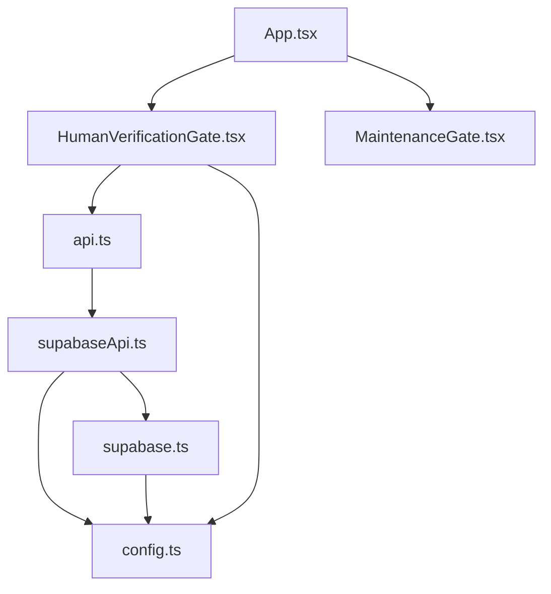
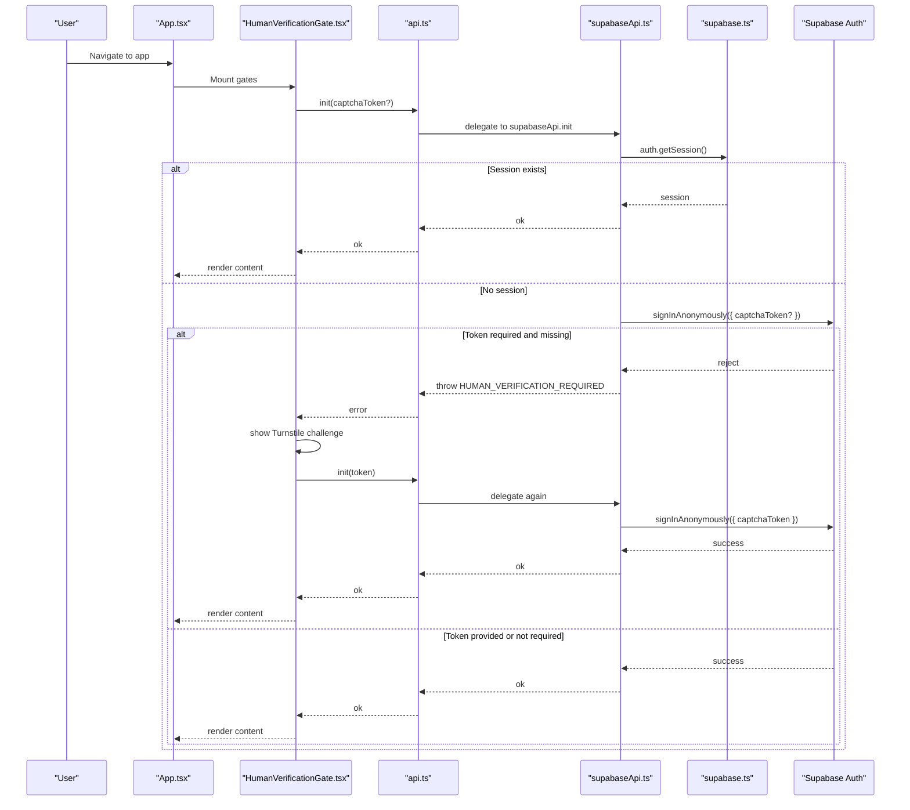
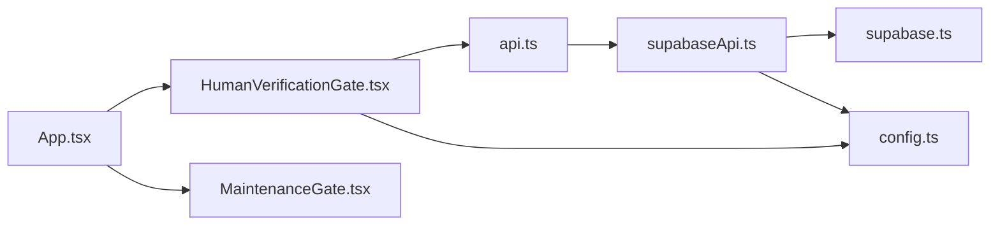

# Authentication Flows and Session Management

<cite>
**Referenced Files in This Document**
- [App.tsx](file://web/src/App.tsx)
- [HumanVerificationGate.tsx](file://web/src/components/HumanVerificationGate.tsx)
- [api.ts](file://web/src/lib/api.ts)
- [supabaseApi.ts](file://web/src/lib/supabaseApi.ts)
- [supabase.ts](file://web/src/lib/supabase.ts)
- [config.ts](file://web/src/lib/config.ts)
- [MaintenanceGate.tsx](file://web/src/components/MaintenanceGate.tsx)
</cite>

## Table of Contents
1. [Introduction](#introduction)
2. [Project Structure](#project-structure)
3. [Core Components](#core-components)
4. [Architecture Overview](#architecture-overview)
5. [Detailed Component Analysis](#detailed-component-analysis)
6. [Dependency Analysis](#dependency-analysis)
7. [Performance Considerations](#performance-considerations)
8. [Troubleshooting Guide](#troubleshooting-guide)
9. [Conclusion](#conclusion)

## Introduction
This document explains how the TBS LPDP Try Out application authenticates users anonymously, manages sessions with Supabase, and protects anonymous sign-in with a human verification gate using Cloudflare Turnstile. It covers:
- How the Supabase client initializes and persists sessions
- How the React frontend gates routes until authentication succeeds
- How tokens are handled and refreshed automatically
- How Turnstile is integrated to prevent automated abuse while keeping the experience smooth
- Error handling patterns and best practices for securing API calls
- Security considerations for anonymous access and balancing usability with protection

## Project Structure
Authentication-related code is concentrated in a small set of modules:
- App-level routing and global gates
- Human verification UI and flow
- API abstraction that selects local or Supabase implementation
- Supabase client configuration
- Configuration flags and shared error types
- Maintenance gating (separate from auth but part of route entry)

**Diagram sources**
- [App.tsx:23-36](file://web/src/App.tsx#L23-L36)
- [HumanVerificationGate.tsx:77-107](file://web/src/components/HumanVerificationGate.tsx#L77-L107)
- [api.ts:38-75](file://web/src/lib/api.ts#L38-L75)
- [supabaseApi.ts:45-64](file://web/src/lib/supabaseApi.ts#L45-L64)
- [supabase.ts:9-13](file://web/src/lib/supabase.ts#L9-L13)
- [config.ts:16-43](file://web/src/lib/config.ts#L16-L43)

**Section sources**
- [App.tsx:23-36](file://web/src/App.tsx#L23-L36)
- [HumanVerificationGate.tsx:77-107](file://web/src/components/HumanVerificationGate.tsx#L77-L107)
- [api.ts:38-75](file://web/src/lib/api.ts#L38-L75)
- [supabaseApi.ts:45-64](file://web/src/lib/supabaseApi.ts#L45-L64)
- [supabase.ts:9-13](file://web/src/lib/supabase.ts#L9-L13)
- [config.ts:16-43](file://web/src/lib/config.ts#L16-L43)

## Core Components
- Supabase client initialization and session options
- Anonymous session creation with optional CAPTCHA token
- Human verification gate UI and lifecycle
- API layer abstraction and lazy loading
- Configuration and environment-driven behavior

Key behaviors:
- The Supabase client enables session persistence and automatic token refresh.
- All protected RPCs require an active session; if none exists, the system attempts anonymous sign-in.
- If a Turnstile site key is configured, anonymous sign-in requires a verified token before proceeding.
- The human verification gate renders only when needed and supports retry and expiry flows.

**Section sources**
- [supabase.ts:9-13](file://web/src/lib/supabase.ts#L9-L13)
- [supabaseApi.ts:45-64](file://web/src/lib/supabaseApi.ts#L45-L64)
- [HumanVerificationGate.tsx:77-107](file://web/src/components/HumanVerificationGate.tsx#L77-L107)
- [api.ts:38-75](file://web/src/lib/api.ts#L38-L75)
- [config.ts:16-43](file://web/src/lib/config.ts#L16-L43)

## Architecture Overview
The authentication architecture combines a pre-route gate, a lazy-loaded API layer, and Supabase Auth with CAPTCHA enforcement.

**Diagram sources**
- [App.tsx:23-36](file://web/src/App.tsx#L23-L36)
- [HumanVerificationGate.tsx:77-107](file://web/src/components/HumanVerificationGate.tsx#L77-L107)
- [api.ts:38-75](file://web/src/lib/api.ts#L38-L75)
- [supabaseApi.ts:45-64](file://web/src/lib/supabaseApi.ts#L45-L64)
- [supabase.ts:9-13](file://web/src/lib/supabase.ts#L9-L13)

## Detailed Component Analysis

### Supabase Client Initialization and Session Management
- The client is created with session persistence enabled and automatic token refresh turned on. URL-based session detection is disabled to avoid leaking tokens in URLs.
- Sessions are stored by Supabase’s storage layer and restored across page reloads. Automatic refresh keeps sessions valid without user interaction.

Security notes:
- Tokens are managed by Supabase; the application does not manually attach headers.
- The client uses a public project URL and publishable/anon key, which are safe to bundle.

**Section sources**
- [supabase.ts:9-13](file://web/src/lib/supabase.ts#L9-L13)

### Anonymous Authentication Flow
- Protected RPCs call a session requirement function that checks for an existing session.
- If no session exists and a Turnstile site key is configured, the API throws a specific error indicating human verification is required.
- Otherwise, it signs in anonymously. When a CAPTCHA token is present, it is passed into the anonymous sign-in call so Supabase Auth can verify it server-side.

Behavior highlights:
- One persistent anonymous identity per browser is established via Supabase Auth.
- The flow prevents direct anonymous account creation without a token when CAPTCHA is enforced.

**Section sources**
- [supabaseApi.ts:45-64](file://web/src/lib/supabaseApi.ts#L45-L64)

### Human Verification Gate (Turnstile)
- The gate mounts before any content route and attempts authentication.
- If a session already exists, it passes silently.
- If a new anonymous identity is needed and a site key is configured, it dynamically loads the Turnstile script once and renders the widget.
- On successful verification, it retries authentication with the token. On failure or expiry, it shows retry controls and localized messages.
- Mock mode bypasses third-party scripts entirely.

UI states:
- Checking: attempting to authenticate
- Challenge: rendering Turnstile widget
- Verified: allowing content to mount
- Error: showing message and retry option

**Section sources**
- [HumanVerificationGate.tsx:77-158](file://web/src/components/HumanVerificationGate.tsx#L77-L158)

### API Layer Abstraction and Lazy Loading
- The API module lazily imports either a local mock implementation or the Supabase implementation based on build-time flags.
- This allows production builds to exclude heavy dependencies like the Supabase client when running offline or mocked.
- It also centralizes retry logic for background writes and provides a consistent error formatter.

**Section sources**
- [api.ts:38-75](file://web/src/lib/api.ts#L38-L75)
- [api.ts:97-127](file://web/src/lib/api.ts#L97-L127)

### Configuration and Environment Flags
- Build-time flags determine whether the app runs offline, which Supabase keys to use, and whether Turnstile is enabled.
- The configuration module exposes a helper to detect whether Supabase is configured and defines shared error codes used across the app.

**Section sources**
- [config.ts:16-43](file://web/src/lib/config.ts#L16-L43)
- [config.ts:45-60](file://web/src/lib/config.ts#L45-L60)

### Route Entry and Global Gates
- The root component wraps all routes with maintenance and human verification gates.
- In offline mode, both gates are skipped because they rely on networked services.

**Section sources**
- [App.tsx:23-36](file://web/src/App.tsx#L23-L36)

## Dependency Analysis
The following diagram shows how components depend on each other during authentication:

**Diagram sources**
- [App.tsx:23-36](file://web/src/App.tsx#L23-L36)
- [HumanVerificationGate.tsx:77-107](file://web/src/components/HumanVerificationGate.tsx#L77-L107)
- [api.ts:38-75](file://web/src/lib/api.ts#L38-L75)
- [supabaseApi.ts:45-64](file://web/src/lib/supabaseApi.ts#L45-L64)
- [supabase.ts:9-13](file://web/src/lib/supabase.ts#L9-L13)
- [config.ts:16-43](file://web/src/lib/config.ts#L16-L43)

**Section sources**
- [App.tsx:23-36](file://web/src/App.tsx#L23-L36)
- [HumanVerificationGate.tsx:77-107](file://web/src/components/HumanVerificationGate.tsx#L77-L107)
- [api.ts:38-75](file://web/src/lib/api.ts#L38-L75)
- [supabaseApi.ts:45-64](file://web/src/lib/supabaseApi.ts#L45-L64)
- [supabase.ts:9-13](file://web/src/lib/supabase.ts#L9-L13)
- [config.ts:16-43](file://web/src/lib/config.ts#L16-L43)

## Performance Considerations
- Lazy loading: The Supabase client is loaded only when the non-mock path is taken, reducing initial bundle size.
- Conditional script loading: Turnstile is loaded only when a challenge is required, avoiding unnecessary network requests for returning users.
- Session reuse: Existing sessions pass silently, preventing repeated challenges.
- Retry strategy: Background writes use exponential backoff with terminal error codes to avoid futile retries.

[No sources needed since this section provides general guidance]

## Troubleshooting Guide
Common issues and their indicators:
- Missing Supabase configuration: The API will throw a configuration error when Supabase URL or key are absent.
- Human verification required: Indicates a new anonymous session is needed and a CAPTCHA token is missing when a site key is configured.
- Turnstile load failures: May be caused by network restrictions or privacy extensions; the UI offers retry and clears failed script tags.
- Expired challenge: The widget resets automatically; users can reattempt verification.
- Offline mode: Both maintenance and human verification gates are bypassed; no network calls occur.

Operational tips:
- Ensure environment variables for Supabase URL and publishable/anon key are set for web builds.
- Keep the Turnstile site key out of source control; only the public key belongs in the frontend.
- Use mock mode during development to avoid third-party dependencies.

**Section sources**
- [supabaseApi.ts:45-64](file://web/src/lib/supabaseApi.ts#L45-L64)
- [HumanVerificationGate.tsx:117-158](file://web/src/components/HumanVerificationGate.tsx#L117-L158)
- [config.ts:16-43](file://web/src/lib/config.ts#L16-L43)

## Conclusion
The application implements a secure, user-friendly authentication model:
- Anonymous sessions are created through Supabase Auth with optional CAPTCHA verification enforced server-side.
- Sessions persist and refresh automatically, minimizing friction for returning users.
- The human verification gate ensures new anonymous identities are validated without exposing secrets to the client.
- The API layer abstracts backend selection and provides robust error handling and retry strategies.
- Configuration-driven behavior supports multiple deployment modes, including offline and mock environments.

This design balances usability with protection against automated abuse while maintaining clear separation of concerns and minimal runtime overhead.

[No sources needed since this section summarizes without analyzing specific files]