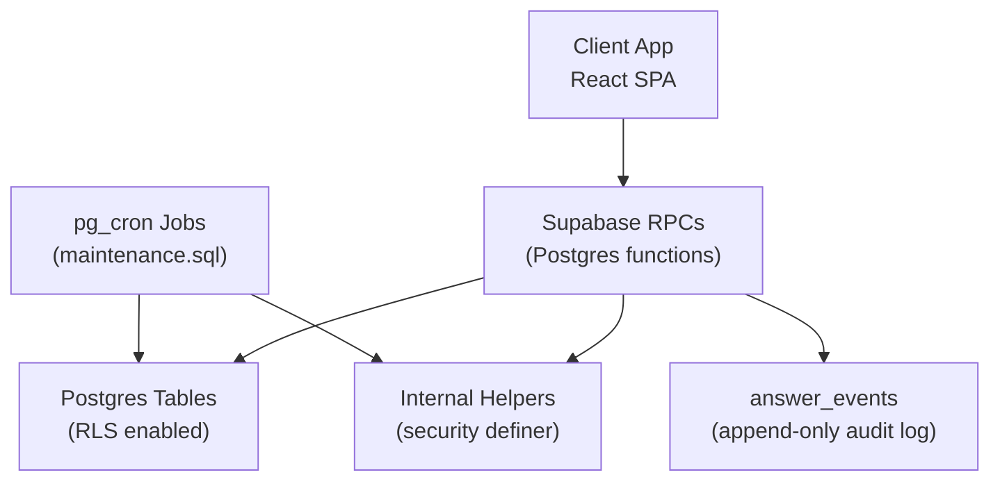
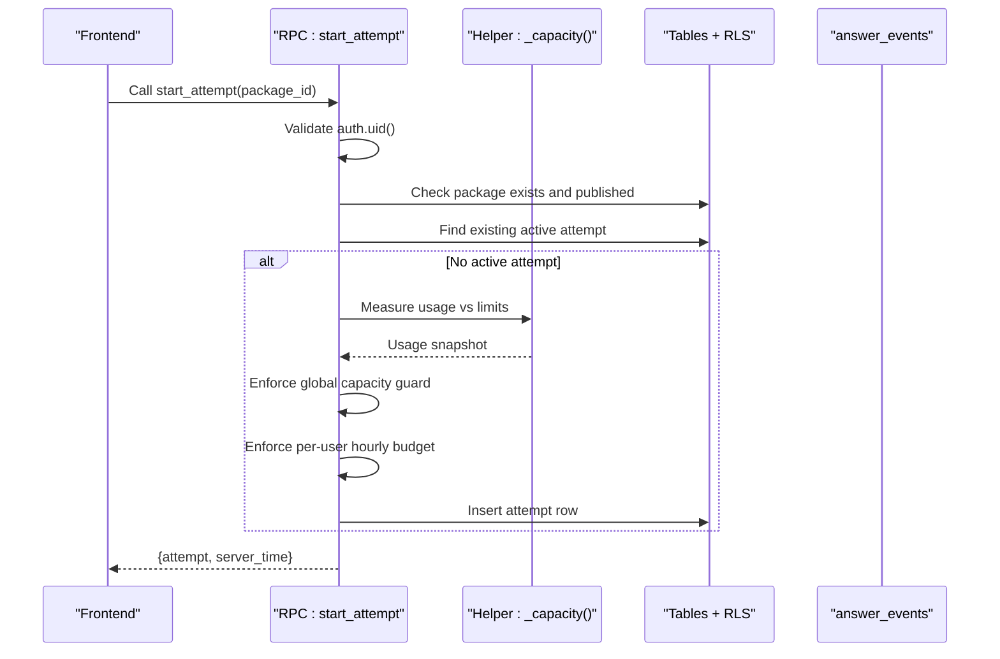
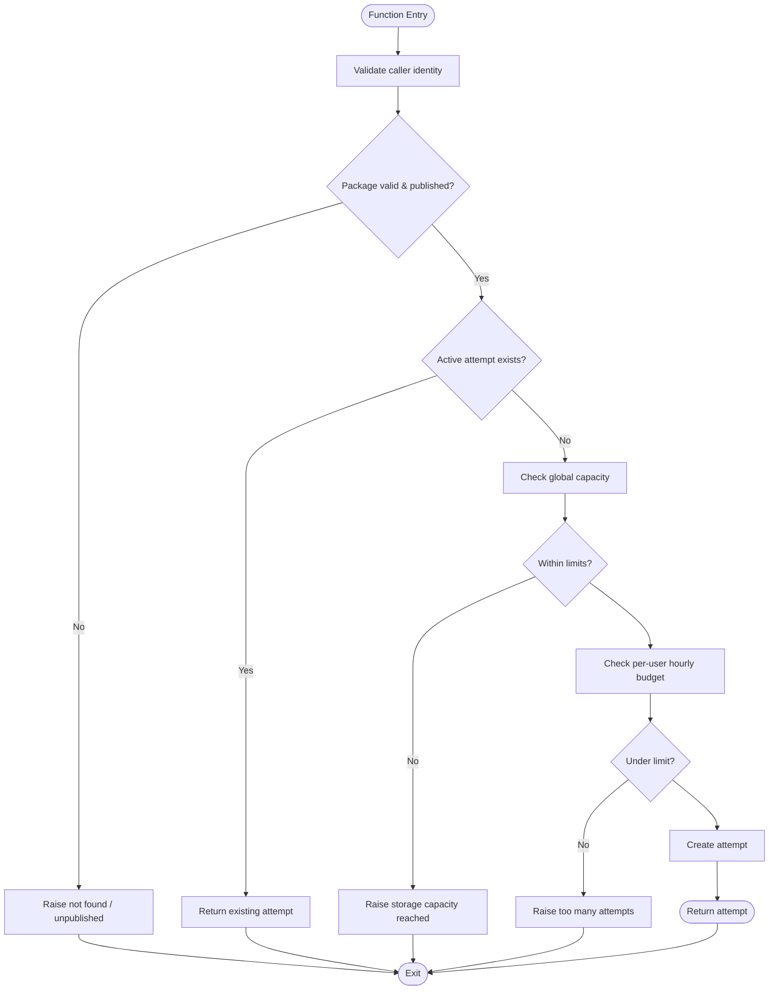
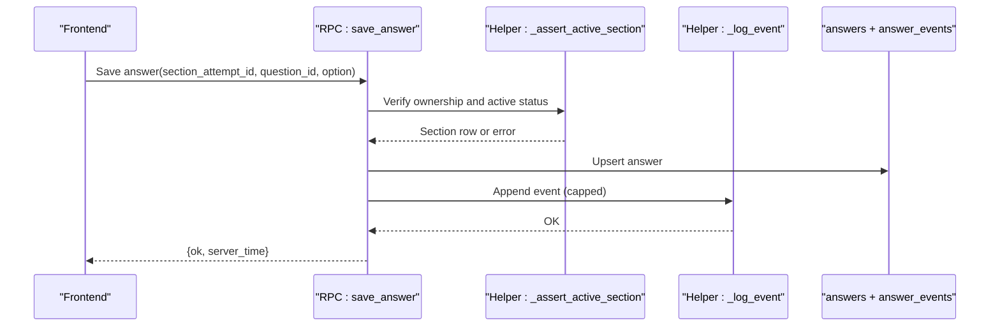
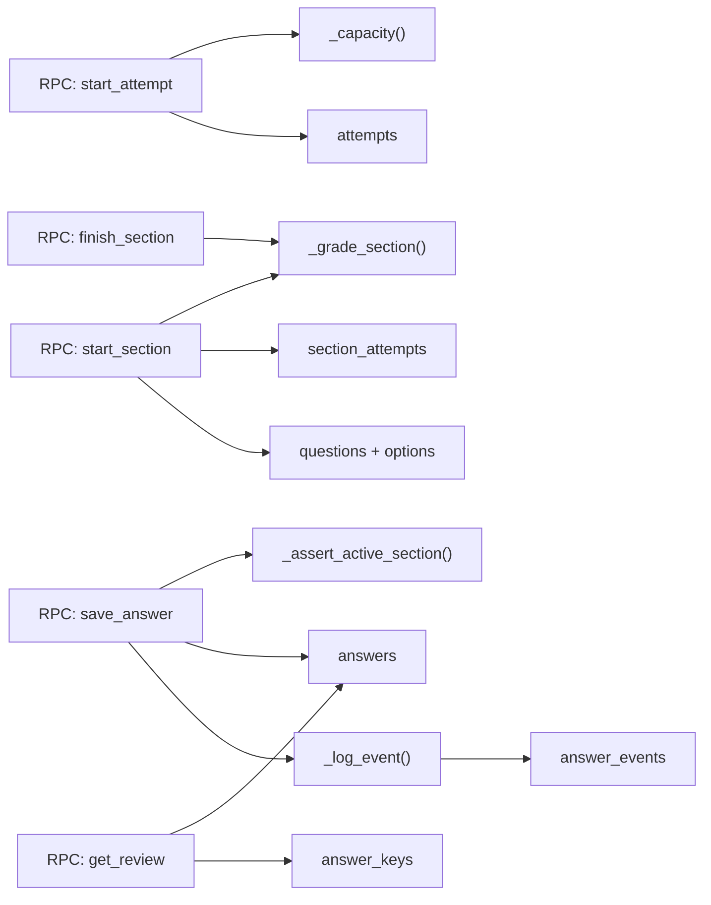

# RPC Function Security and Validation

<cite>
**Referenced Files in This Document**
- [schema.sql](file://supabase/schema.sql)
- [schema_v2_reports.sql](file://supabase/schema_v2_reports.sql)
- [schema_v3.sql](file://supabase/schema_v3.sql)
- [maintenance.sql](file://supabase/maintenance.sql)
- [config.toml](file://supabase/config.toml)
- [index.ts](file://supabase/functions/question-report-digest/index.ts)
- [TECHNICAL_REQUIREMENTS.md](file://docs/TECHNICAL_REQUIREMENTS.md)
- [CAPACITY_GUARD.md](file://docs/CAPACITY_GUARD.md)
</cite>

## Table of Contents
1. [Introduction](#introduction)
2. [Project Structure](#project-structure)
3. [Core Components](#core-components)
4. [Architecture Overview](#architecture-overview)
5. [Detailed Component Analysis](#detailed-component-analysis)
6. [Dependency Analysis](#dependency-analysis)
7. [Performance Considerations](#performance-considerations)
8. [Troubleshooting Guide](#troubleshooting-guide)
9. [Conclusion](#conclusion)

## Introduction
This document explains how the TBS LPDP Try Out system enforces security and validation through server-side RPC functions rather than direct table access. It covers:
- How all database mutations are funneled through Postgres `security definer` RPCs to ensure data integrity and confidentiality (for example, answer keys are never readable by clients).
- How caller identity and permissions are validated inside each RPC using Row Level Security and explicit ownership checks.
- Input validation, business rule enforcement, and rate limiting implemented in RPCs.
- Capacity guards that prevent storage overflow during attempt creation.
- Error handling strategy with specific error codes for different failure scenarios.
- Audit logging via an append-only event log used for compliance and debugging.

## Project Structure
The security model is defined in Supabase SQL schema files and enforced at the database layer. The frontend communicates exclusively with these RPCs; no client writes tables directly. Operational maintenance jobs schedule background tasks such as capacity measurement and retention sweeps.

**Diagram sources**
- [schema.sql:131-181](file://supabase/schema.sql#L131-L181)
- [schema.sql:186-337](file://supabase/schema.sql#L186-L337)
- [schema.sql:341-607](file://supabase/schema.sql#L341-L607)
- [maintenance.sql:18-51](file://supabase/maintenance.sql#L18-L51)

**Section sources**
- [schema.sql:131-181](file://supabase/schema.sql#L131-L181)
- [maintenance.sql:18-51](file://supabase/maintenance.sql#L18-L51)

## Core Components
- All mutation RPCs are declared with `security definer`, run under a privileged role, and perform strict input validation, ownership checks, and business rules before touching data.
- Read RPCs enforce RLS so users can only see their own attempts and related data.
- Sensitive content (answer keys) is never exposed to clients except after a section is finished and scoped to the caller’s attempt.
- A capacity guard prevents new attempts when the project approaches storage limits.
- An append-only event log records user actions for auditing and debugging.

Key responsibilities:
- Authentication and authorization: rely on `auth.uid()` and RLS policies.
- Business logic: attempt lifecycle, section deadlines, grading, statistics updates.
- Rate limiting: per-user budgets for creating attempts and submitting reports.
- Capacity management: global storage ceiling checked before creating new attempts.
- Audit logging: every significant action recorded in `answer_events`.

**Section sources**
- [schema.sql:131-181](file://supabase/schema.sql#L131-L181)
- [schema.sql:186-337](file://supabase/schema.sql#L186-L337)
- [schema.sql:341-607](file://supabase/schema.sql#L341-L607)
- [schema_v2_reports.sql:90-176](file://supabase/schema_v2_reports.sql#L90-L176)
- [schema_v3.sql:609-758](file://supabase/schema_v3.sql#L609-L758)
- [maintenance.sql:41-51](file://supabase/maintenance.sql#L41-L51)

## Architecture Overview
The system uses Postgres RPCs as the single trusted boundary for all state changes. Clients call RPCs over HTTPS; the database enforces RLS and function-level checks. Background jobs maintain operational health without exposing internals to clients.

**Diagram sources**
- [schema.sql:341-390](file://supabase/schema.sql#L341-L390)
- [schema.sql:292-309](file://supabase/schema.sql#L292-L309)
- [schema_v3.sql:709-758](file://supabase/schema_v3.sql#L709-L758)

**Section sources**
- [schema.sql:341-390](file://supabase/schema.sql#L341-L390)
- [schema_v3.sql:709-758](file://supabase/schema_v3.sql#L709-L758)

## Detailed Component Analysis

### Attempt Lifecycle RPCs
- `start_attempt`: authenticates caller, validates package, returns existing active attempt or creates a new one subject to capacity and rate limits.
- `start_section`: verifies ownership, auto-finishes expired sections, starts next subtest, sets deadline, logs start event, and returns questions without answer keys.
- `finish_section`: grades the section, updates scores, closes attempt if all sections finished, and returns results.

Security and validation highlights:
- Ownership checks use `auth.uid()` and joins to ensure callers only access their own attempts and sections.
- Deadlines are enforced server-side; late saves are rejected.
- Answer keys are excluded from question payloads until review of finished sections.

**Diagram sources**
- [schema.sql:341-390](file://supabase/schema.sql#L341-L390)
- [schema_v3.sql:709-758](file://supabase/schema_v3.sql#L709-L758)

**Section sources**
- [schema.sql:341-390](file://supabase/schema.sql#L341-L390)
- [schema.sql:417-493](file://supabase/schema.sql#L417-L493)
- [schema.sql:551-580](file://supabase/schema.sql#L551-L580)
- [schema_v3.sql:709-758](file://supabase/schema_v3.sql#L709-L758)
- [schema_v3.sql:760-800](file://supabase/schema_v3.sql#L760-L800)

### Answer Submission and Doubt Toggle
- `save_answer`: validates option values, ensures the question belongs to the active section, upserts the answer, and logs the event.
- `toggle_doubt`: validates ownership and question membership, toggles doubt flag, and logs the appropriate event.

Validation and safety:
- Option values are constrained to allowed values.
- Question membership is verified against the section’s subtest.
- Event logging is capped per section to bound storage growth.

**Diagram sources**
- [schema.sql:495-522](file://supabase/schema.sql#L495-L522)
- [schema.sql:313-337](file://supabase/schema.sql#L313-L337)
- [schema.sql:246-260](file://supabase/schema.sql#L246-L260)

**Section sources**
- [schema.sql:495-522](file://supabase/schema.sql#L495-L522)
- [schema.sql:524-549](file://supabase/schema.sql#L524-L549)
- [schema.sql:313-337](file://supabase/schema.sql#L313-L337)
- [schema.sql:246-260](file://supabase/schema.sql#L246-L260)

### Review and Answer-Key Exposure
- `get_review`: returns attempt and per-question details including correct options and explanations only for finished sections owned by the caller.
- v2 adds per-question report integration scoped to the caller.

Security guarantees:
- Answer keys are never included in active-section responses.
- Only finished sections expose keys, and only for the caller’s attempt.

**Section sources**
- [schema.sql:612-657](file://supabase/schema.sql#L612-L657)
- [schema_v2_reports.sql:207-261](file://supabase/schema_v2_reports.sql#L207-L261)

### Question Reporting RPCs
- `report_question`: validates inputs, enforces a rolling-hour write budget, confirms the question was part of a finished section owned by the caller, and upserts the report.
- `delete_question_report`: idempotent deletion of the caller’s own report.

Security and validation highlights:
- Input shape validation with named error codes for invalid reasons or comments.
- Rolling-hour rate limit prevents abuse while allowing legitimate edits.
- Report visibility is restricted to the reporter via RLS.

**Section sources**
- [schema_v2_reports.sql:90-176](file://supabase/schema_v2_reports.sql#L90-L176)
- [schema_v2_reports.sql:182-200](file://supabase/schema_v2_reports.sql#L182-L200)
- [schema_v2_reports.sql:56-66](file://supabase/schema_v2_reports.sql#L56-L66)

### Capacity Guard and Service Status
- `_capacity` and `_refresh_capacity`: measure database size and estimate row counts, cache results for five minutes, and refresh lazily.
- `get_service_status`: exposes whether the system is accepting new attempts and a coarse usage percentage.
- `start_attempt`: enforces global capacity before creating new attempts; resuming existing attempts is never blocked.

Operational notes:
- A scheduled job warms the capacity snapshot but is not required for correctness.
- The guard protects against free-tier storage exhaustion while preserving ongoing attempts.

**Section sources**
- [schema.sql:262-309](file://supabase/schema.sql#L262-L309)
- [schema.sql:395-415](file://supabase/schema.sql#L395-L415)
- [schema.sql:341-390](file://supabase/schema.sql#L341-L390)
- [maintenance.sql:41-51](file://supabase/maintenance.sql#L41-L51)
- [CAPACITY_GUARD.md:60-96](file://docs/CAPACITY_GUARD.md#L60-L96)

### Audit Logging
- `answer_events`: append-only table capturing start, save_answer, mark_doubt, unmark_doubt, finish events with payloads.
- `_log_event`: caps per-section event rows to bound storage growth.
- Grading and section completion also emit events.

Compliance and debugging:
- Provides a durable trail of user actions tied to sections and questions.
- Enables reconstruction of attempt flows and troubleshooting issues.

**Section sources**
- [schema.sql:96-106](file://supabase/schema.sql#L96-L106)
- [schema.sql:246-260](file://supabase/schema.sql#L246-L260)
- [schema.sql:186-239](file://supabase/schema.sql#L186-L239)
- [schema_v3.sql:609-705](file://supabase/schema_v3.sql#L609-L705)

### Edge Function for Report Digests
- The edge function processes queued digest runs, authenticates via a secret key, renders email content, and sends it via an external provider.
- It calls internal RPCs to claim and complete runs, ensuring idempotency and reliable delivery tracking.

Security considerations:
- Requires configured secrets and validates request headers.
- Uses service-role credentials internally to interact with Supabase safely.

**Section sources**
- [index.ts:14-38](file://supabase/functions/question-report-digest/index.ts#L14-L38)
- [index.ts:58-117](file://supabase/functions/question-report-digest/index.ts#L58-L117)
- [config.toml:1-5](file://supabase/config.toml#L1-L5)

## Dependency Analysis
RPCs depend on internal helpers and tables protected by RLS. Grants restrict execution to authenticated users; anonymous users have no direct table access.

**Diagram sources**
- [schema.sql:292-309](file://supabase/schema.sql#L292-L309)
- [schema.sql:186-239](file://supabase/schema.sql#L186-L239)
- [schema.sql:313-337](file://supabase/schema.sql#L313-L337)
- [schema.sql:495-522](file://supabase/schema.sql#L495-L522)
- [schema.sql:612-657](file://supabase/schema.sql#L612-L657)

**Section sources**
- [schema.sql:131-181](file://supabase/schema.sql#L131-L181)
- [schema.sql:676-688](file://supabase/schema.sql#L676-L688)

## Performance Considerations
- Capacity measurements use lightweight catalog queries and database size stats, cached for five minutes to minimize overhead.
- Event logging is capped per section to prevent unbounded growth.
- Retention jobs prune old attempts and anonymous users to keep the database within free-tier constraints.
- RPCs avoid unnecessary reads and leverage indexes where applicable.

[No sources needed since this section provides general guidance]

## Troubleshooting Guide
Common error codes and their meanings:
- Not authenticated: indicates missing or invalid session context.
- Not found: attempt, section, or package not accessible to the caller.
- Section already finished: attempted operation on a closed section.
- Deadline passed: operation attempted after section deadline plus grace period.
- Too many attempts: per-user hourly budget exceeded.
- Storage capacity reached: global storage ceiling hit; new attempts blocked.
- Invalid input: malformed parameters or disallowed values.
- Too many reports: rolling-hour write budget exceeded for reporting.

Error handling strategy:
- RPCs raise exceptions with specific error codes so clients can distinguish transient failures from terminal conditions.
- Some errors should not be retried (for example, capacity reached or invalid input).
- Clients receive structured JSON responses with server timestamps for time-sensitive UI behavior.

Operational checks:
- Use maintenance job diagnostics to verify cron schedules and last run statuses.
- Monitor database size and table sizes to anticipate capacity issues.

**Section sources**
- [schema.sql:341-390](file://supabase/schema.sql#L341-L390)
- [schema.sql:417-493](file://supabase/schema.sql#L417-L493)
- [schema.sql:495-522](file://supabase/schema.sql#L495-L522)
- [schema.sql:551-580](file://supabase/schema.sql#L551-L580)
- [schema_v2_reports.sql:90-176](file://supabase/schema_v2_reports.sql#L90-L176)
- [maintenance.sql:154-167](file://supabase/maintenance.sql#L154-L167)

## Conclusion
The TBS LPDP Try Out system centralizes all mutations in secure, server-side RPC functions that validate inputs, enforce business rules, and protect sensitive data. Row Level Security and `security definer` functions ensure that clients cannot bypass controls or access unauthorized data. Capacity guards and rate limits protect system stability under load, while append-only audit logs provide compliance and debugging capabilities. Together, these mechanisms deliver a robust, secure, and maintainable backend for the try-out experience.

[No sources needed since this section summarizes without analyzing specific files]