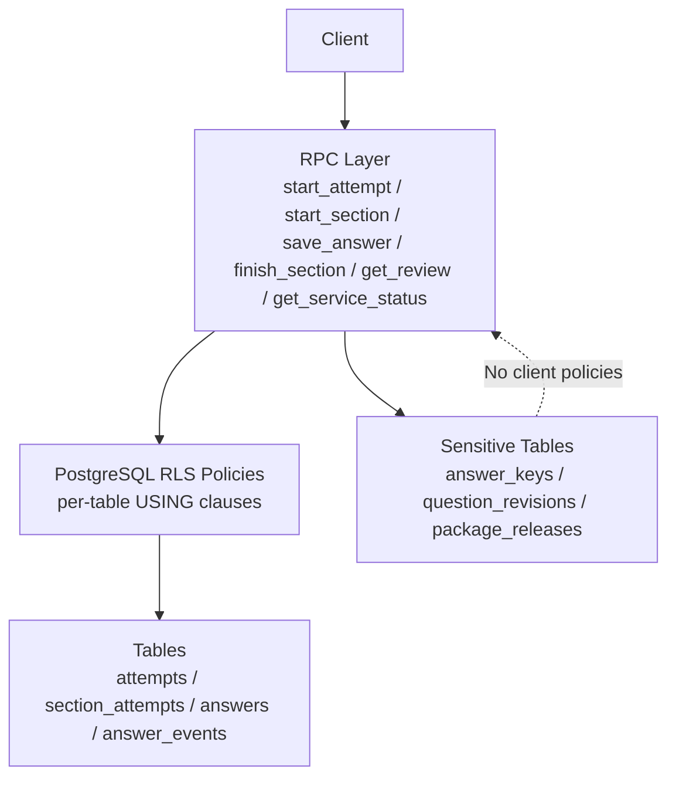
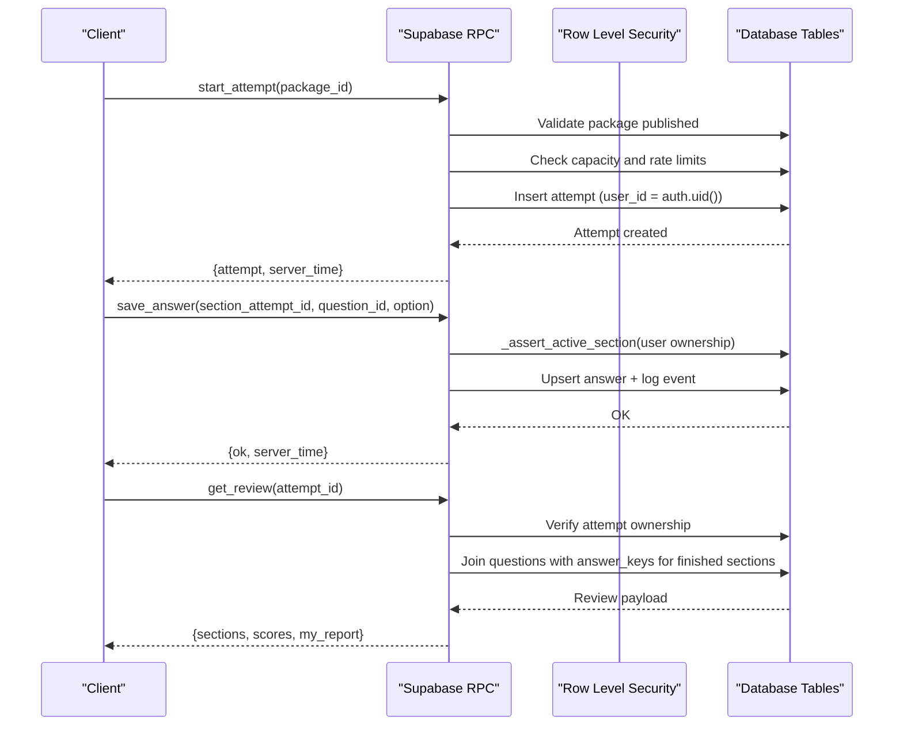
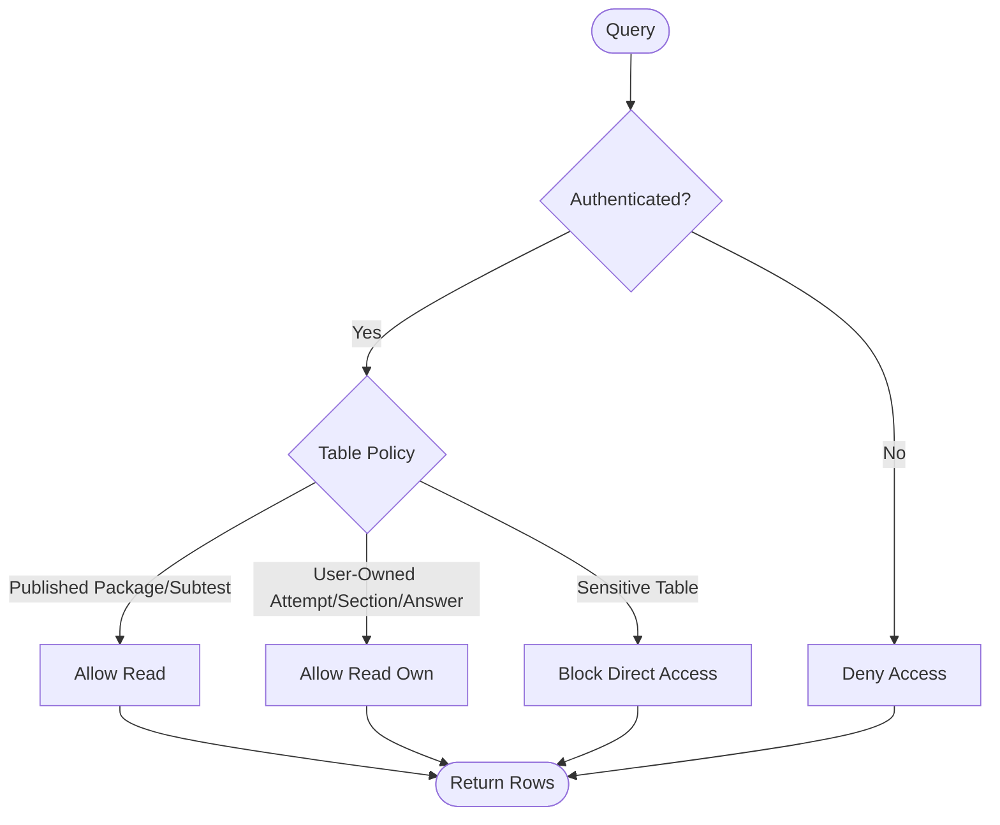
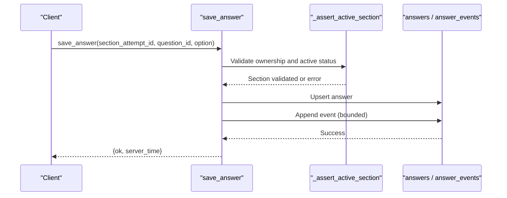
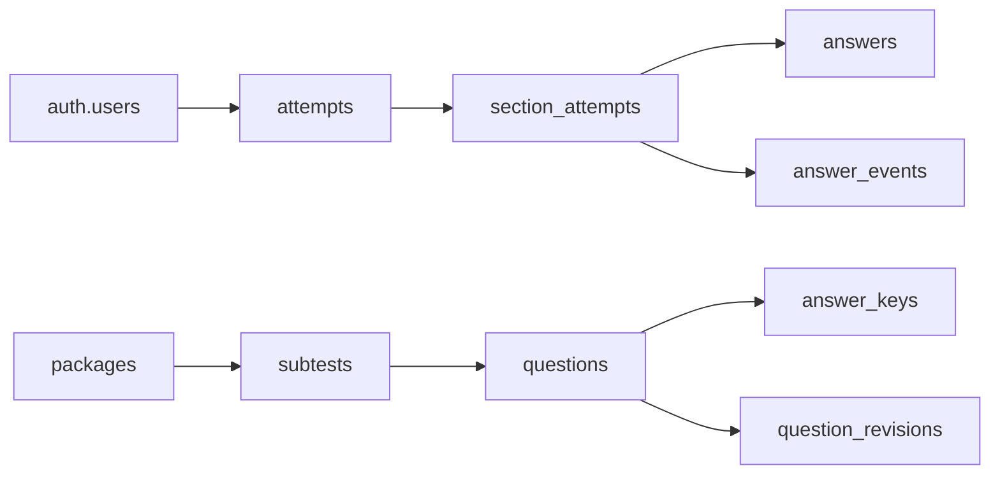

# Row Level Security Policies

<cite>
**Referenced Files in This Document**
- [schema.sql](file://supabase/schema.sql)
- [schema_v2_reports.sql](file://supabase/schema_v2_reports.sql)
- [schema_v3.sql](file://supabase/schema_v3.sql)
- [maintenance.sql](file://supabase/maintenance.sql)
</cite>

## Table of Contents
1. [Introduction](#introduction)
2. [Project Structure](#project-structure)
3. [Core Components](#core-components)
4. [Architecture Overview](#architecture-overview)
5. [Detailed Component Analysis](#detailed-component-analysis)
6. [Dependency Analysis](#dependency-analysis)
7. [Performance Considerations](#performance-considerations)
8. [Troubleshooting Guide](#troubleshooting-guide)
9. [Conclusion](#conclusion)

## Introduction
This document explains how the TBS LPDP Try Out system enforces data isolation and multi-tenant security using PostgreSQL Row Level Security (RLS) combined with narrowly scoped RPC functions. It focuses on:
- Isolating user attempts, section attempts, answers, and events so users can only access their own data
- Allowing authenticated users to read published packages and subtests while preventing direct access to sensitive tables such as answer keys and question revisions
- Enforcing ownership-based controls for mutations through server-side RPCs that validate user identity and context
- Explaining why critical tables intentionally have no client-readable policies and how this prevents unauthorized exposure

## Project Structure
The RLS and security model is defined across several SQL files:
- Base schema defines core tables, enables RLS, and sets up per-table read policies for user-owned data
- Reports extension adds reporting tables with strict ownership-only reads and write-through-RPC enforcement
- Version 3 introduces immutable releases and additional tables; it revokes direct table access and routes all projections through RPCs
- Maintenance schedules operational tasks and exposes a safe service status endpoint

**Diagram sources**
- [schema.sql:131-181](file://supabase/schema.sql#L131-L181)
- [schema_v3.sql:957-978](file://supabase/schema_v3.sql#L957-L978)

**Section sources**
- [schema.sql:131-181](file://supabase/schema.sql#L131-L181)
- [schema_v3.sql:957-978](file://supabase/schema_v3.sql#L957-L978)

## Core Components
- RLS-enabled tables for user-owned data: attempts, section_attempts, answers, answer_events
- Read policies that restrict selection to the current user via auth.uid()
- Write operations exclusively through RPCs that enforce ownership and business rules
- Sensitive tables without client policies: answer_keys, question_revisions, package_releases, statistics tables
- Publicly readable content limited to published packages and subtests

Key policy examples:
- Published packages are selectable by authenticated users only when published
- Subtests are selectable only if their package is published
- Attempts, section attempts, answers, and events are selectable only when owned by the caller
- No policies exist for answer keys or revision tables; access is only via RPCs

Security implications:
- Clients cannot enumerate or leak other users’ attempts or answers
- Answer keys and explanations are never exposed directly; they are returned only within review flows for finished sections of the caller’s own attempt
- Ownership checks in RPCs prevent cross-user mutation even if RLS were bypassed at the application layer

**Section sources**
- [schema.sql:147-181](file://supabase/schema.sql#L147-L181)
- [schema_v3.sql:957-978](file://supabase/schema_v3.sql#L957-L978)

## Architecture Overview
The system uses a layered security model:
- Authentication via Supabase Auth provides a stable user identifier
- RLS enforces row-level isolation at the database level for all direct queries
- RPCs act as the single entry point for mutations and sensitive reads, embedding business logic and ownership validation
- Maintenance jobs handle cleanup and capacity monitoring without exposing raw metrics to clients

**Diagram sources**
- [schema.sql:341-390](file://supabase/schema.sql#L341-L390)
- [schema.sql:495-522](file://supabase/schema.sql#L495-L522)
- [schema.sql:612-657](file://supabase/schema.sql#L612-L657)
- [schema_v3.sql:709-758](file://supabase/schema_v3.sql#L709-L758)
- [schema_v3.sql:836-872](file://supabase/schema_v3.sql#L836-L872)
- [schema_v3.sql:910-933](file://supabase/schema_v3.sql#L910-L933)

## Detailed Component Analysis

### Data Isolation Through RLS Policies
- Attempts: Selectable only when user_id matches the current authenticated user
- Section attempts: Selectable only when linked to an attempt owned by the current user
- Answers and answer events: Selectable only when linked to a section attempt belonging to the current user’s attempt
- Published content: Packages and subtests are readable when published, enabling discovery without exposing unpublished content

**Diagram sources**
- [schema.sql:147-181](file://supabase/schema.sql#L147-L181)

**Section sources**
- [schema.sql:147-181](file://supabase/schema.sql#L147-L181)

### Ownership-Based Mutations via RPCs
All writes go through RPCs that:
- Require authentication
- Validate ownership of the target attempt or section
- Enforce business constraints (e.g., active section, deadline handling, question membership)
- Log events and update state atomically

Examples:
- start_attempt: Creates an attempt for the authenticated user after validating package publication and capacity
- save_answer/toggle_doubt: Validates active section ownership and updates answers/events
- finish_section: Verifies ownership, grades the section, and updates attempt totals

**Diagram sources**
- [schema.sql:311-337](file://supabase/schema.sql#L311-L337)
- [schema.sql:495-522](file://supabase/schema.sql#L495-L522)

**Section sources**
- [schema.sql:311-337](file://supabase/schema.sql#L311-L337)
- [schema.sql:495-522](file://supabase/schema.sql#L495-L522)
- [schema_v3.sql:836-872](file://supabase/schema_v3.sql#L836-L872)

### Controlled Exposure of Sensitive Data
- answer_keys and question_revisions contain correct options and explanations
- These tables have no client-readable policies; direct SELECT is blocked
- Only the review RPC returns keys/explanations for finished sections of the caller’s own attempt
- This design prevents answer key leakage and ensures controlled feedback

Security implications:
- Clients cannot query answer_keys directly
- Even if a client knows a question ID, it cannot retrieve the correct option unless the review flow grants access
- The review flow ties exposure to ownership and completion state

**Section sources**
- [schema.sql:56-60](file://supabase/schema.sql#L56-L60)
- [schema.sql:612-657](file://supabase/schema.sql#L612-L657)
- [schema_v3.sql:957-978](file://supabase/schema_v3.sql#L957-L978)
- [schema_v3.sql:207-261](file://supabase/schema_v3.sql#L207-L261)

### Reporting and Privacy
- question_reports allow users to report issues with questions
- RLS allows reading only reports authored by the current user
- Writes are restricted to RPCs that enforce ownership and rate limits
- Reports survive attempt deletion because they are evidence about questions, not tied to attempt lifecycle

Security implications:
- Users cannot see others’ reports
- Report submission is gated by finishing a relevant section, preventing abuse
- Rate limiting protects against spam and scripted attacks

**Section sources**
- [schema_v2_reports.sql:27-67](file://supabase/schema_v2_reports.sql#L27-L67)
- [schema_v2_reports.sql:90-176](file://supabase/schema_v2_reports.sql#L90-L176)

### Service Status and Capacity Monitoring
- get_service_status exposes usage percentage and acceptance flags without revealing raw byte counts
- Capacity checks prevent new attempts when storage or row limits are reached
- Maintenance jobs refresh capacity snapshots and prune old data

Security implications:
- Clients receive coarse metrics suitable for UI decisions
- Raw capacity details remain internal, reducing reconnaissance surface

**Section sources**
- [schema.sql:395-415](file://supabase/schema.sql#L395-L415)
- [maintenance.sql:41-51](file://supabase/maintenance.sql#L41-L51)

## Dependency Analysis
RLS policies depend on:
- Authentication context (auth.uid())
- Foreign key relationships linking attempts to users, section attempts to attempts, answers to section attempts
- RPCs that encapsulate ownership checks and business rules

**Diagram sources**
- [schema.sql:16-104](file://supabase/schema.sql#L16-L104)
- [schema_v3.sql:58-164](file://supabase/schema_v3.sql#L58-L164)

**Section sources**
- [schema.sql:16-104](file://supabase/schema.sql#L16-L104)
- [schema_v3.sql:58-164](file://supabase/schema_v3.sql#L58-L164)

## Performance Considerations
- RLS policies use simple equality checks and existence joins, which are efficient with proper indexes
- Event logging is capped per section to prevent unbounded growth
- Capacity checks rely on planner estimates rather than full scans to stay O(1)
- Maintenance jobs schedule pruning and capacity refreshes to keep performance predictable under load

[No sources needed since this section provides general guidance]

## Troubleshooting Guide
Common issues and resolutions:
- “not authenticated”: Ensure the client session is authenticated before calling RPCs
- “attempt not found” / “section attempt not found”: Verify ownership and IDs; RPCs enforce user_id matching
- “package not found or unpublished”: Only published packages can be started; check package status
- “storage capacity reached”: New attempts are blocked when limits are exceeded; wait or contact operators
- “too many attempts”: Per-user hourly budget enforced; retry later

Operational checks:
- Inspect cron jobs and last run details for maintenance tasks
- Monitor database size and relation sizes to identify growth hotspots

**Section sources**
- [schema.sql:341-390](file://supabase/schema.sql#L341-L390)
- [schema.sql:417-493](file://supabase/schema.sql#L417-L493)
- [maintenance.sql:154-167](file://supabase/maintenance.sql#L154-L167)

## Conclusion
The TBS LPDP Try Out system achieves strong multi-tenant isolation through a combination of RLS policies and tightly controlled RPCs:
- RLS guarantees that users can only read their own attempts, sections, answers, and events
- Sensitive data like answer keys and question revisions are never directly accessible; exposure is strictly controlled by review RPCs
- Ownership checks in RPCs ensure that only the rightful owner can modify attempt-related data
- Intentional absence of client-readable policies on critical tables prevents unauthorized data exposure and reduces attack surface

This layered approach ensures secure, scalable operation while providing a smooth experience for test-takers and robust safeguards for administrators.